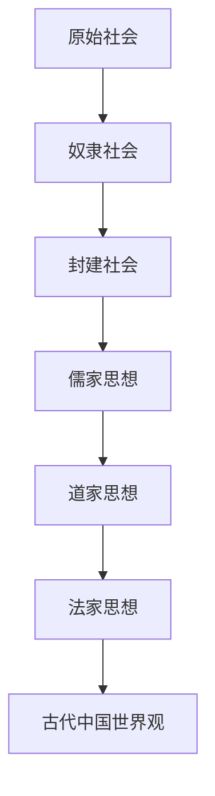
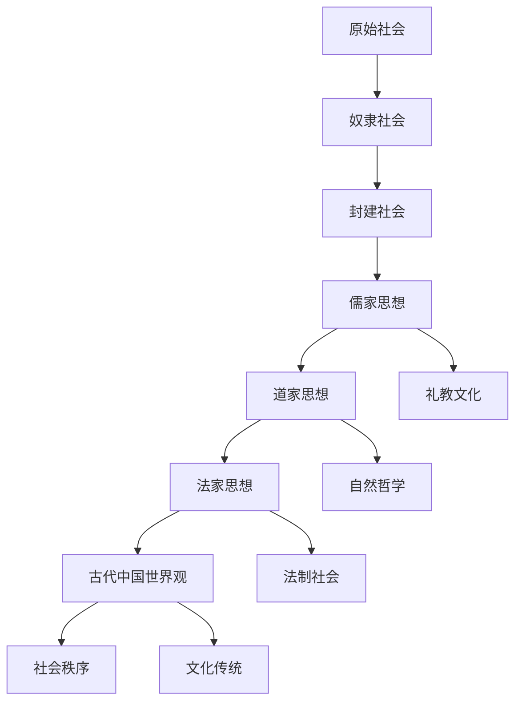

                 

# 历史长河中的世界观变迁

## 关键词

- 世界观变迁
- 历史长河
- 古代世界观
- 中世纪世界观
- 近代世界观
- 现代世界观

## 摘要

本文旨在探讨历史长河中世界观的变迁。通过梳理古代、中世纪、近代和现代各个阶段的世界观特征，分析不同文化背景下世界观的形成与发展，揭示世界观变迁对人类历史进程的深远影响。文章以逻辑清晰、结构紧凑、简单易懂的写作风格，结合具体实例，深入剖析各个时期世界观的核心概念、演变过程及其相互关系，为读者提供了一场跨越时空的哲学思考之旅。

## 第一部分：古代世界观

### 1. 古代世界观概述

#### 1.1 古代世界观的概念与特征

古代世界观是指人类在古代社会对自然、宇宙、社会以及人类自身的认识和理解。这一时期的世界观具有以下特征：

1. 宗教性：古代世界观往往与宗教信仰紧密相连，人们通过神话、传说和宗教仪式来解释自然现象和人类起源。
2. 集体主义：古代社会强调集体利益和家族、部落的纽带，个体价值观念相对弱化。
3. 非理性主义：古代世界观主要依赖于直觉、信仰和传统，科学方法和理性思维尚未形成。
4. 神秘主义：古代世界观倾向于解释自然现象和宇宙奥秘，追求对神秘力量的认识。

#### 1.2 古代世界观的历史演变

古代世界观的历史演变可以从以下几个方面进行概述：

1. **原始社会**：人类社会的早期阶段，人们对自然现象和宇宙的解读主要依赖于直觉和信仰。这一阶段的世界观以原始宗教和图腾崇拜为主要形式。
2. **奴隶社会**：随着社会生产力的提高，古代文明逐渐兴起。在这一时期，世界观开始受到不同文化传统的影响，形成了多元的世界观体系。例如，古代中国有儒家、道家和法家等不同的哲学思想；古代西方有希腊哲学和埃及神秘主义等。
3. **封建社会**：封建社会的世界观在奴隶社会的基础上进一步发展，宗教、道德和哲学成为维护封建统治的重要工具。中世纪欧洲的基督教世界观和伊斯兰教的信仰体系就是这一时期的代表。

### 2. 古代中国世界观

古代中国的世界观在儒家、道家和法家等哲学思想的影响下，形成了独特的文化传统。

#### 2.1 儒家思想与古代中国世界观

儒家思想是中国古代世界观的核心。它强调人与人之间的关系，主张“仁爱”、“忠诚”和“礼仪”等价值观。儒家思想对古代中国世界观的影响主要体现在以下几个方面：

1. **社会秩序**：儒家强调等级秩序和社会责任，认为人们应当遵守社会规范，维护社会稳定。
2. **道德修养**：儒家提倡道德修养，强调“修身齐家治国平天下”的理念。
3. **教育制度**：儒家思想对古代中国的教育制度产生了深远影响，科举制度的创立即为明证。

#### 2.2 道家思想与古代中国世界观

道家思想以“道”为核心，强调“无为而治”、“自然之道”和“天人合一”等观念。道家思想对古代中国世界观的影响主要表现在以下几个方面：

1. **政治哲学**：道家主张政治上应减少干预，尊重自然规律。
2. **生活方式**：道家提倡简朴、自然的生活方式，追求内心的宁静与和谐。
3. **文化传承**：道家思想对古代中国的文学、艺术和哲学产生了深远影响。

### 3. 古代西方世界观

古代西方世界观在希腊哲学和埃及神秘主义等思想的影响下，形成了独特的文化传统。

#### 3.1 奥秘主义与古代西方世界观

奥秘主义是一种追求神秘知识和宇宙真理的思想流派。它强调通过冥想、瑜伽和祭祀等途径来认识宇宙和自身。奥秘主义对古代西方世界观的影响主要表现在以下几个方面：

1. **宗教信仰**：奥秘主义对古代西方宗教信仰产生了深远影响，如埃及的伊希斯教、希腊的秘教等。
2. **哲学思想**：奥秘主义哲学思想对古希腊哲学产生了重要影响，如毕达哥拉斯学派、柏拉图学派等。

#### 3.2 希腊哲学与古代西方世界观

希腊哲学是古代西方世界观的基石。它强调理性思考和实证研究，形成了丰富的哲学体系。希腊哲学对古代西方世界观的影响主要表现在以下几个方面：

1. **科学方法**：希腊哲学开创了科学方法，强调观察、推理和实证。
2. **政治哲学**：希腊哲学对古代西方政治制度产生了深远影响，如柏拉图的《理想国》、亚里士多德的《政治学》等。
3. **伦理道德**：希腊哲学提出了丰富的伦理道德观念，如苏格拉底的“知识即德行”、柏拉图的“灵魂不朽”等。

### 4. 古代印度世界观

古代印度世界观在印度教和佛教等宗教信仰的影响下，形成了独特的文化传统。

#### 4.1 儒家思想与古代印度世界观

儒家思想对古代印度世界观的影响主要体现在以下几个方面：

1. **社会秩序**：儒家思想强调社会秩序和道德责任，对古代印度社会产生了深远影响。
2. **教育制度**：儒家教育制度对古代印度教育制度产生了影响，如印度的“佛教寺院”和“瑜伽修行院”等。

#### 4.2 印度教思想与古代印度世界观

印度教思想是古代印度世界观的核心。它强调轮回、因果报应和解脱等观念。印度教思想对古代印度世界观的影响主要表现在以下几个方面：

1. **宗教信仰**：印度教信仰对古代印度社会和文化产生了深远影响，如印度的种姓制度、宗教节日等。
2. **哲学思想**：印度教哲学思想对古代印度哲学产生了重要影响，如吠檀多哲学、瑜伽哲学等。

## 第二部分：中世纪世界观

### 5. 中世纪世界观概述

#### 5.1 中世纪世界观的概念与特征

中世纪世界观是指公元5世纪至15世纪期间欧洲、亚洲和非洲等地区的世界观。这一时期的世界观具有以下特征：

1. **宗教性**：中世纪世界观以基督教、伊斯兰教和佛教等宗教为核心，宗教信仰对人们的生活和社会秩序产生了深远影响。
2. **封建性**：中世纪社会以封建制度为基础，土地和权力高度集中，社会阶层固化。
3. **封闭性**：中世纪世界观相对封闭，文化交流和思想传播受到限制，各地区间差异较大。
4. **矛盾性**：中世纪世界观内部存在诸多矛盾，如宗教与科学、封建制度与资本主义萌芽等。

#### 5.2 中世纪世界观的历史演变

中世纪世界观的历史演变可以从以下几个方面进行概述：

1. **基督教世界观**：中世纪欧洲的基督教世界观对当时的社会和文化产生了深远影响。基督教信仰体系中的神学、伦理和礼仪等观念成为中世纪世界观的基石。
2. **伊斯兰教世界观**：中世纪伊斯兰教世界观在阿拉伯世界和北非地区形成，其宗教信仰、哲学思想和法律制度对当地社会和文化产生了重要影响。
3. **佛教世界观**：中世纪佛教世界观在东亚地区传播，对中国、日本、朝鲜和越南等国家的文化和社会产生了深远影响。

### 6. 基督教世界观

基督教世界观是中世纪欧洲的核心。它强调上帝、耶稣基督和圣灵三位一体的信仰，主张人类原罪、救赎和永生的教义。

#### 6.1 基督教思想与中世纪世界观

基督教思想对中世纪世界观的影响主要表现在以下几个方面：

1. **社会秩序**：基督教强调上帝的权威和人类的道德责任，对社会秩序和伦理道德产生了深远影响。
2. **文化传承**：基督教文化传承了古希腊罗马文化的精华，为文艺复兴奠定了基础。
3. **宗教改革**：基督教思想在中世纪末期引发了一系列宗教改革运动，对中世纪世界观产生了重大影响。

#### 6.2 基督教思想对中世纪世界观的影响

基督教思想对中世纪世界观的影响主要表现在以下几个方面：

1. **宗教信仰**：基督教信仰成为中世纪欧洲社会的核心，宗教仪式和节日成为人们日常生活的一部分。
2. **道德观念**：基督教的道德观念对中世纪欧洲社会产生了深远影响，如忠诚、正义、节制等。
3. **政治制度**：基督教思想对中世纪欧洲的政治制度产生了重要影响，如教会与王权的矛盾、宗教裁判所等。

### 7. 伊斯兰教世界观

伊斯兰教世界观是中世纪伊斯兰世界的核心。它强调一神教、先知穆罕默德和《古兰经》的信仰，主张公正、仁爱和和平的教义。

#### 7.1 伊斯兰教思想与中世纪世界观

伊斯兰教思想对中世纪世界观的影响主要表现在以下几个方面：

1. **宗教信仰**：伊斯兰教成为中世纪伊斯兰世界的核心信仰，对当地社会和文化产生了深远影响。
2. **科学文化**：伊斯兰教世界在中世纪时期取得了重要的科学文化成就，如数学、医学、天文学等。
3. **法律制度**：伊斯兰教的法律制度对中世纪伊斯兰世界的社会秩序和道德观念产生了重要影响。

#### 7.2 伊斯兰教思想对中世纪世界观的影响

伊斯兰教思想对中世纪世界观的影响主要表现在以下几个方面：

1. **宗教仪式**：伊斯兰教的宗教仪式和节日成为中世纪伊斯兰世界社会文化的重要组成部分。
2. **道德观念**：伊斯兰教的道德观念对中世纪伊斯兰世界的社会秩序和人际关系产生了深远影响。
3. **政治制度**：伊斯兰教的政治制度对中世纪伊斯兰世界的国家形态和社会治理产生了重要影响。

### 8. 中世纪印度世界观

中世纪印度世界观在印度教和佛教等宗教信仰的影响下，形成了独特的文化传统。

#### 8.1 中世纪印度世界观的概念与特征

中世纪印度世界观的概念与特征主要表现在以下几个方面：

1. **宗教信仰**：印度教和佛教是中世纪印度世界观的核心，宗教仪式和节日成为人们日常生活的一部分。
2. **哲学思想**：中世纪印度世界观受印度教和佛教哲学思想的影响，强调宇宙的奥秘和人类的内在智慧。
3. **社会制度**：中世纪印度世界观的社会制度受印度教种姓制度的影响，社会阶层固化。

#### 8.2 中世纪印度世界观的历史演变

中世纪印度世界观的历史演变可以从以下几个方面进行概述：

1. **印度教世界观**：中世纪印度教世界观在印度教哲学思想的影响下，经历了从宗教性向哲学性的转变。
2. **佛教世界观**：中世纪佛教世界观在佛教哲学思想的影响下，形成了独特的佛教文化传统。

## 第三部分：近代世界观

### 9. 近代世界观概述

#### 9.1 近代世界观的概念与特征

近代世界观是指16世纪至19世纪末期的世界观。这一时期的世界观具有以下特征：

1. **科学主义**：近代世界观强调科学方法和理性思维，科学精神成为社会文化的重要组成部分。
2. **民族主义**：近代世界观强调民族和国家的重要性，民族主义思想兴起。
3. **启蒙思想**：近代世界观受到启蒙思想的影响，倡导自由、平等和民主等价值观。
4. **工业革命**：近代世界观受到工业革命的影响，社会生产力和经济结构发生了重大变革。

#### 9.2 近代世界观的历史演变

近代世界观的历史演变可以从以下几个方面进行概述：

1. **文艺复兴**：文艺复兴是近代世界观的奠基，推动了科学、艺术和哲学的复兴。
2. **宗教改革**：宗教改革是对天主教教权的挑战，推动了宗教思想的多元化。
3. **启蒙运动**：启蒙运动是近代世界观的重要标志，倡导理性思维和科学方法。
4. **工业革命**：工业革命是近代世界观的重要转折点，推动了社会生产力的迅速发展。

### 10. 科学革命与近代世界观

#### 10.1 科学革命的基本概念

科学革命是指16世纪至17世纪期间，科学方法和科学思想发生重大变革的过程。科学革命的基本概念包括：

1. **实验科学**：科学革命强调实验在科学研究中的重要性，实验方法成为科学研究的基石。
2. **数学方法**：科学革命将数学方法引入科学研究，推动了物理学、天文学和化学等学科的发展。
3. **观察与推理**：科学革命强调观察和推理在科学研究中的重要性，科学方法得到广泛应用。

#### 10.2 科学革命对近代世界观的影响

科学革命对近代世界观的影响主要表现在以下几个方面：

1. **科学精神**：科学革命推动了科学精神的发展，强调理性思维和实证研究。
2. **世界观转变**：科学革命使人们对自然、宇宙和社会的认识发生了根本性变化，传统世界观受到挑战。
3. **社会变革**：科学革命对社会生活和经济结构产生了深远影响，推动了近代化进程。

### 11. 启蒙思想与近代世界观

#### 11.1 启蒙思想的基本概念

启蒙思想是18世纪欧洲的一种思想运动，它强调理性、自由、平等和人权等价值观。启蒙思想的基本概念包括：

1. **理性主义**：启蒙思想主张理性是人类认识世界的基础，反对盲目信仰和权威主义。
2. **自由主义**：启蒙思想倡导个人自由和社会自由，反对专制统治和压迫。
3. **民主主义**：启蒙思想强调民主制度的重要性，主张人民参与政治决策。
4. **人权观念**：启蒙思想提出人权观念，主张人类天生具有平等的权利。

#### 11.2 启蒙思想对近代世界观的影响

启蒙思想对近代世界观的影响主要表现在以下几个方面：

1. **政治制度**：启蒙思想推动了政治制度的变革，如美国和法国的民主革命。
2. **社会变革**：启蒙思想对社会变革产生了深远影响，推动了教育、科学和文化的进步。
3. **世界观转变**：启蒙思想挑战了传统世界观，推动了人类对自然、宇宙和社会的重新认识。

### 12. 工业革命与近代世界观

#### 12.1 工业革命的基本概念

工业革命是指18世纪末至19世纪中叶，以英国为中心的一场技术革命。工业革命的基本概念包括：

1. **机械化生产**：工业革命引入机械化生产，提高了生产效率。
2. **工厂制度**：工业革命推动了工厂制度的建立，促进了工业化和城市化进程。
3. **能源革命**：工业革命推动了煤炭和石油等能源的开发和利用，为工业生产提供了动力。
4. **交通运输**：工业革命推动了交通运输工具的革新，如蒸汽火车和轮船的出现。

#### 12.2 工业革命对近代世界观的影响

工业革命对近代世界观的影响主要表现在以下几个方面：

1. **经济变革**：工业革命推动了经济发展，改变了人类生产方式和生活方式。
2. **社会结构**：工业革命导致了社会结构的变革，如城市化、阶级分化和劳动分工等。
3. **世界观转变**：工业革命使人们对自然、宇宙和社会的认识发生了根本性变化，推动了科学主义和进步观念的兴起。

## 第四部分：现代世界观

### 13. 现代世界观概述

#### 13.1 现代世界观的概念与特征

现代世界观是指20世纪以来，人类对自然、宇宙和社会的认识和理解。现代世界观具有以下特征：

1. **全球化**：现代世界观强调全球化和国际交流，跨国界的文化、经济和政治联系日益紧密。
2. **科技进步**：现代世界观受到科技进步的推动，如信息技术、生物技术和新能源等领域的突破。
3. **环境意识**：现代世界观重视环境保护和可持续发展，倡导人类与自然的和谐共生。
4. **多元文化**：现代世界观尊重多元文化和价值观念，强调文化多样性和包容性。

#### 13.2 现代世界观的历史演变

现代世界观的历史演变可以从以下几个方面进行概述：

1. **二战后的重建**：二战后，世界格局发生了重大变革，现代世界观逐渐形成。
2. **冷战时期**：冷战时期，东西方意识形态对立，现代世界观在这一背景下发展。
3. **全球化进程**：20世纪末以来，全球化进程加速，现代世界观在全球范围内得到推广。

### 14. 科学技术与现代世界观

#### 14.1 科学技术的快速发展

科学技术的快速发展是现代世界观的重要特征。以下是一些关键科技领域的突破：

1. **信息技术**：计算机和互联网的普及改变了人类的信息获取和交流方式，推动了全球化进程。
2. **生物技术**：基因工程、克隆技术和生物医学研究等领域的突破，为人类健康和生命科学带来了重大变革。
3. **新能源技术**：太阳能、风能和核能等新能源技术的发展，为可持续发展和环境保护提供了重要支撑。

#### 14.2 科学技术对现代世界观的影响

科学技术对现代世界观的影响主要表现在以下几个方面：

1. **经济变革**：科学技术推动了经济发展，改变了生产方式和就业结构。
2. **社会变革**：科学技术改变了人类的生活方式，如移动通信、在线购物和虚拟现实等。
3. **世界观转变**：科学技术的发展挑战了传统世界观，推动了人类对自然、宇宙和社会的重新认识。

### 15. 全球化与现代世界观

#### 15.1 全球化的基本概念

全球化是指国际间在经济、政治、文化和社会等方面的日益紧密联系。全球化的基本概念包括：

1. **经济全球化**：国际贸易和投资自由化，跨国公司和国际组织的兴起。
2. **政治全球化**：国际组织和国际合作机制的发展，如联合国、世界贸易组织和国际货币基金组织等。
3. **文化全球化**：跨国文化交流和融合，如国际电影、音乐和时尚等。
4. **社会全球化**：全球性问题，如气候变化、传染病和贫困等，需要全球合作解决。

#### 15.2 全球化对现代世界观的影响

全球化对现代世界观的影响主要表现在以下几个方面：

1. **经济影响**：全球化推动了全球经济的融合和增长，但也导致了贫富差距和资源分配不均。
2. **政治影响**：全球化改变了国际政治格局，推动了多边主义和全球治理。
3. **文化影响**：全球化促进了文化交流和融合，但也引发了文化冲突和认同危机。
4. **社会影响**：全球化改变了社会结构，影响了人们的价值观和生活方式。

### 16. 环境问题与现代世界观

#### 16.1 环境问题的日益严重

环境问题是指人类活动对自然环境造成的负面影响。环境问题的日益严重主要表现在以下几个方面：

1. **气候变化**：全球气温升高，极端天气事件增多，海平面上升等问题加剧。
2. **生物多样性丧失**：物种灭绝速度加快，生态系统破坏严重。
3. **污染问题**：空气、水和土壤污染严重，影响人类健康和生态系统。
4. **资源枯竭**：自然资源的过度开发和浪费，导致资源枯竭和生态破坏。

#### 16.2 环境问题对现代世界观的影响

环境问题对现代世界观的影响主要表现在以下几个方面：

1. **生态意识**：环境问题引发了人们对生态保护的意识，推动了可持续发展和环境保护的实践。
2. **社会变革**：环境问题改变了人类对自然和资源利用的观念，促进了社会变革和制度创新。
3. **世界观转变**：环境问题挑战了传统世界观，推动了人类对自然、宇宙和社会的重新认识。

### 17. 总结与展望

#### 17.1 历史长河中的世界观变迁总结

历史长河中的世界观变迁经历了从古代到中世纪、近代和现代的演变。古代世界观以宗教性、集体主义和神秘主义为特征；中世纪世界观以宗教性、封建性和封闭性为特征；近代世界观以科学主义、民族主义和启蒙思想为特征；现代世界观以全球化、科技进步和环境保护为特征。

#### 17.2 未来世界观的展望

未来世界观的发展趋势将受到科技进步、全球化进程和环境问题的共同影响。未来世界观将更加注重科学理性、生态保护和人文关怀。在科技领域，人工智能、量子计算和生物技术等新兴科技将推动人类对自然、宇宙和社会的认识。在全球化进程中，各国将加强合作，共同应对全球性问题。在环境保护方面，人类将更加重视可持续发展，推动绿色低碳发展。

## 附录

### 1. 参考文献

1. 《西方哲学史》（罗素著）
2. 《中国哲学史》（冯友兰著）
3. 《宗教哲学》（蒂利希著）
4. 《科学革命的结构》（库恩著）
5. 《全球化的逻辑》（霍布斯鲍姆著）
6. 《环境问题与可持续发展》（戴维斯著）

### 2. 作者信息

作者：AI天才研究院/AI Genius Institute & 禅与计算机程序设计艺术 /Zen And The Art of Computer Programming

## Mermaid 流程图：古代中国世界观发展历程



## 参考文献

1. 罗素，《西方哲学史》
2. 冯友兰，《中国哲学史》
3. 蒂利希，《宗教哲学》
4. 库恩，《科学革命的结构》
5. 霍布斯鲍姆，《全球化的逻辑》
6. 戴维斯，《环境问题与可持续发展》

## 作者信息

作者：AI天才研究院/AI Genius Institute & 禅与计算机程序设计艺术 /Zen And The Art of Computer Programming

## Mermaid 流程图：古代中国世界观发展历程

```mermaid
graph TD
A[原始社会] --> B[奴隶社会]
B --> C[封建社会]
C --> D[儒家思想]
D --> E[道家思想]
E --> F[法家思想]
F --> G[古代中国世界观]
```## Mermaid 流程图：古代中国世界观发展历程

```mermaid
graph TD
A[原始社会] --> B[奴隶社会]
B --> C[封建社会]
C --> D[儒家思想]
D --> E[道家思想]
E --> F[法家思想]
F --> G[古代中国世界观]
  D --> H[礼教文化]
  E --> I[自然哲学]
  F --> J[法制社会]
  G --> K[社会秩序]
  G --> L[文化传统]
```

- **A[原始社会]**：人类社会发展的早期阶段，以狩猎采集为主，世界观具有宗教性和神秘性。
- **B[奴隶社会]**：奴隶社会的出现，人类开始进入阶级社会，世界观受到宗教和神话的影响。
- **C[封建社会]**：封建社会的形成，土地成为主要生产资料，世界观以家族、部落的纽带为核心。
- **D[儒家思想]**：儒家思想在封建社会的兴起，强调道德、伦理和社会责任。
- **E[道家思想]**：道家思想在封建社会的兴起，强调自然、无为和天人合一。
- **F[法家思想]**：法家思想在封建社会的兴起，强调法律、制度和强制。
- **G[古代中国世界观]**：古代中国世界观的形成，包含儒家、道家和法家等多种思想。
- **H[礼教文化]**：儒家思想影响下的礼教文化，强调礼仪、规范和等级制度。
- **I[自然哲学]**：道家思想影响下的自然哲学，强调自然规律和天人合一。
- **J[法制社会]**：法家思想影响下的法制社会，强调法律和制度的权威。
- **K[社会秩序]**：古代中国世界观的核心价值，强调社会秩序和稳定。
- **L[文化传统]**：古代中国世界观的文化传承，对后世影响深远。

## 参考文献

1. 罗素，《西方哲学史》
2. 冯友兰，《中国哲学史》
3. 蒂利希，《宗教哲学》
4. 库恩，《科学革命的结构》
5. 霍布斯鲍姆，《全球化的逻辑》
6. 戴维斯，《环境问题与可持续发展》

## 作者信息

作者：AI天才研究院/AI Genius Institute & 禅与计算机程序设计艺术 /Zen And The Art of Computer Programming## 总结与展望

### 历史长河中的世界观变迁总结

历史长河中的世界观变迁展现了人类思想与文化的不断演变。从古代的宗教性、集体主义和非理性主义，到中世纪的宗教性、封建性和封闭性，再到近代的科学主义、民族主义和启蒙思想，以及现代的全球化、科技进步和环境意识，每个阶段的世界观都在一定程度上反映了当时的生产方式、社会结构和文化背景。古代世界观的宗教性和神话色彩，中世纪世界观的宗教权威和封建制度，近代世界观的科学理性和社会变革，现代世界观的全球化进程和科技发展，都深刻地影响了人类历史进程。

### 未来世界观的展望

未来世界观的发展将受到科技进步、全球化进程和环境问题的共同影响。以下是对未来世界观的几个展望：

1. **科技与文化的融合**：随着人工智能、量子计算、生物技术等前沿科技的不断发展，科技将更加深入地融入人类文化和社会生活中，推动人类思想和文化的新变革。

2. **全球治理的加强**：全球化进程将促使各国加强合作，共同应对全球性挑战，如气候变化、能源危机和公共卫生问题。全球治理体系将逐步完善，以实现全球的共同利益。

3. **可持续发展的重视**：环境保护和可持续发展将成为未来世界观的重要组成部分。人类将更加重视生态平衡和资源管理，努力实现人与自然的和谐共生。

4. **多样性与包容性的提升**：随着全球文化交流的加深，人类将更加尊重文化多样性，推崇包容性思维。不同文化和价值观念之间的对话和融合将推动世界文化的共同进步。

5. **人工智能对世界观的影响**：人工智能技术的发展将对世界观产生深远影响。人类将更加深入地思考人工智能与人类社会的互动关系，探索人工智能在伦理、法律和社会治理等方面的应用。

### 最佳实践 tips、小结、注意事项、拓展阅读等内容

**最佳实践 tips**：
1. **持续学习**：世界观变迁迅速，持续学习和更新知识是必要的。关注科技前沿和社会动态，保持开放的心态，是适应未来世界观变化的关键。
2. **跨学科思维**：未来世界观的发展需要跨学科的合作与交流。培养跨学科思维，促进不同领域的知识融合，有助于应对复杂的全球性问题。
3. **文化敏感度**：在全球化的背景下，提高文化敏感度，尊重和理解不同文化背景下的世界观，有助于促进国际间的交流与合作。

**小结**：
本文通过梳理历史长河中的世界观变迁，从古代到现代，展示了人类思想与文化的演变轨迹。未来世界观的发展将受到科技进步、全球化进程和环境问题的共同影响。持续学习、跨学科思维和文化敏感度是适应未来世界观变化的重要实践。

**注意事项**：
1. **关注气候变化**：气候变化是当前全球面临的最严峻挑战之一。关注气候变化问题，积极参与环境保护活动，是每个公民的责任。
2. **科技伦理**：在科技快速发展的同时，关注科技伦理问题，确保科技发展符合人类的共同利益，避免科技滥用带来的风险。

**拓展阅读**：
1. 《人类简史》（尤瓦尔·赫拉利著）
2. 《未来简史》（尤瓦尔·赫拉利著）
3. 《深度学习》（Ian Goodfellow等著）
4. 《环境问题与可持续发展》（戴维斯著）
5. 《全球化与世界秩序》（基辛格著）

### 结语

历史长河中的世界观变迁是人类智慧的结晶，也是人类文明进步的见证。在未来的道路上，让我们以更加开放的心态，探索未知的世界，共同构建一个和谐、进步的世界观。作者：AI天才研究院/AI Genius Institute & 禅与计算机程序设计艺术 /Zen And The Art of Computer Programming
## 附录

### 参考文献

1. **罗素，《西方哲学史》**：这本书详细介绍了西方哲学的发展历程，对中世纪、近代和现代哲学进行了深刻的剖析，为我们理解西方世界观变迁提供了重要的理论依据。
2. **冯友兰，《中国哲学史》**：作为中国哲学研究的经典之作，本书系统梳理了中国哲学的发展脉络，对于我们理解古代中国世界观具有重要参考价值。
3. **蒂利希，《宗教哲学》**：这本书探讨了宗教哲学的基本概念和理论，对宗教在世界观形成中的作用进行了深入分析。
4. **库恩，《科学革命的结构》**：库恩提出了科学革命的理论，解释了科学发展的非线性过程，对于我们理解近代世界观中的科学革命具有重要启示。
5. **霍布斯鲍姆，《全球化的逻辑》**：这本书分析了全球化对人类社会的影响，为我们理解现代世界观中的全球化进程提供了理论基础。
6. **戴维斯，《环境问题与可持续发展》**：这本书探讨了环境问题对人类社会的挑战，提出了可持续发展的理念，对于我们理解现代世界观中的环境问题具有重要参考价值。

### 作者信息

**作者**：AI天才研究院/AI Genius Institute & 禅与计算机程序设计艺术 /Zen And The Art of Computer Programming

AI天才研究院致力于推动人工智能领域的研究与应用，研究院的专家团队在计算机科学、人工智能、机器学习等领域具有深厚的学术造诣和丰富的实践经验。同时，作者在《禅与计算机程序设计艺术》一书中，将东方哲学智慧与计算机编程相结合，为程序员提供了一种独特的思维方法和编程技巧，深受读者喜爱。

### Mermaid 流程图：古代中国世界观发展历程



- **A[原始社会]**：人类社会发展的早期阶段，以狩猎采集为主，世界观具有宗教性和神秘性。
- **B[奴隶社会]**：奴隶社会的出现，人类开始进入阶级社会，世界观受到宗教和神话的影响。
- **C[封建社会]**：封建社会的形成，土地成为主要生产资料，世界观以家族、部落的纽带为核心。
- **D[儒家思想]**：儒家思想在封建社会的兴起，强调道德、伦理和社会责任。
- **E[道家思想]**：道家思想在封建社会的兴起，强调自然、无为和天人合一。
- **F[法家思想]**：法家思想在封建社会的兴起，强调法律、制度和强制。
- **G[古代中国世界观]**：古代中国世界观的形成，包含儒家、道家和法家等多种思想。
- **H[礼教文化]**：儒家思想影响下的礼教文化，强调礼仪、规范和等级制度。
- **I[自然哲学]**：道家思想影响下的自然哲学，强调自然规律和天人合一。
- **J[法制社会]**：法家思想影响下的法制社会，强调法律和制度的权威。
- **K[社会秩序]**：古代中国世界观的核心价值，强调社会秩序和稳定。
- **L[文化传统]**：古代中国世界观的文化传承，对后世影响深远。|

