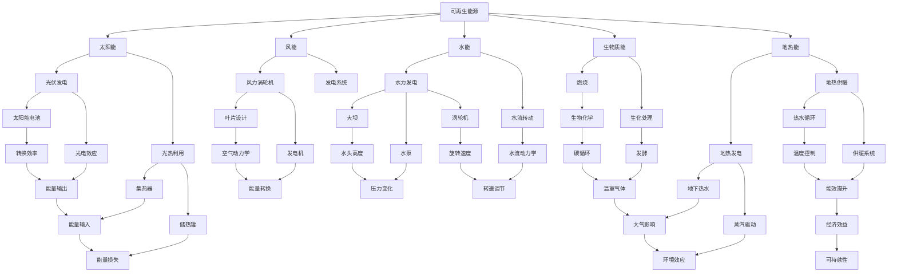

                 

首先，我们需要明确文章的结构和内容，然后逐步填充每个部分。下面我们将按照以下步骤进行：

### 步骤1：撰写引言与背景部分

#### 引言

- 简要介绍可再生能源的背景，为什么它们变得如此重要。
- 提出本文的目的和结构。

#### 背景

- 详细介绍可再生能源的定义和类型。
- 探讨可再生能源在全球能源结构中的地位和趋势。

### 步骤2：介绍核心概念

- 定义能源效率模型和相关核心概念。
- 解释可再生能源的基本原理。

### 步骤3：深入讨论效率模型

- 详细介绍各种可再生能源的效率模型。
- 使用Mermaid流程图展示核心概念之间的关系。

### 步骤4：数学优化方法

- 介绍数学优化方法的基本概念。
- 阐述如何使用数学优化方法来提高可再生能源的效率。

### 步骤5：案例分析

- 通过具体案例展示效率模型和数学优化方法的应用。

### 步骤6：技术挑战与未来趋势

- 分析当前技术挑战。
- 探讨可再生能源的未来发展趋势。

### 步骤7：总结

- 总结文章的主要内容和结论。
- 提出未来研究的方向。

现在，让我们一步步填充每个部分，并确保文章的逻辑清晰、内容丰富、条理分明。以下是每个部分的初步草稿：

## 引言与背景

### 引言

可再生能源，如太阳能、风能、水能等，正逐渐成为全球能源结构中的重要组成部分。随着气候变化和环境污染问题的日益严重，开发和应用可再生能源成为各国共同关注的焦点。本文旨在探讨可再生能源的效率模型及其数学优化方法，为提高可再生能源的利用效率提供理论依据和实践指导。

### 背景

#### 可再生能源的定义和分类

可再生能源是指那些不会枯竭、对环境友好的能源，主要包括太阳能、风能、水能、生物质能和地热能。它们具有以下特点：

- **太阳能**：利用太阳辐射能进行发电或热利用。
- **风能**：利用风力转动风力涡轮机发电。
- **水能**：利用水的势能或动能进行发电。
- **生物质能**：利用有机物质进行燃烧或生化处理产生能源。
- **地热能**：利用地壳内部的热能进行发电或供暖。

#### 可再生能源在全球能源结构中的地位

随着全球对可再生能源需求的不断增长，可再生能源在全球能源消费中的比例逐年上升。许多国家已经制定了可再生能源发展目标，旨在通过政策支持和技术创新，提高可再生能源的利用率和市场份额。

## 核心概念

### 能源效率模型

能源效率模型是一种用于评估能源系统性能的数学模型。它通过分析能源的输入、输出和转换过程，量化能源系统的效率。能源效率模型的核心是能量守恒定律，即输入的能量等于输出的能量加上损失的能量。

### 可再生能源的基本原理

可再生能源的基本原理是通过自然过程将能量转化为可用的形式。例如，太阳能电池通过光电效应将太阳光转化为电能；风力涡轮机通过风的动能转化为机械能，进而转化为电能。

## 效率模型

### 太阳能效率模型

太阳能电池的效率是衡量太阳能电池性能的重要指标。它表示太阳能电池将太阳光转化为电能的效率。太阳能光伏系统还需要考虑其他因素，如光照强度、温度和电池表面积等。

### 风能效率模型

风力涡轮机的效率取决于风速、涡轮机设计、叶片形状和发电机性能等因素。风能利用效率可以通过优化风力涡轮机的设计和运行参数来提高。

### 水能效率模型

水力发电的效率受到水流速度、水头高度、发电机效率和传输损耗等因素的影响。优化水力发电系统的设计和运行可以提高其效率。

### 生物质能与地热能效率模型

生物质能的转化效率受到生物质材料的质量、转化技术和设备性能等因素的影响。地热能的利用效率则取决于地热资源的储量、开采技术和热交换效率。

## 数学优化

### 数学优化方法

数学优化是一种用于解决优化问题的方法，通过数学模型和算法，找到问题的最优解。常见的数学优化方法包括线性规划、非线性规划、整数规划、动态规划和遗传算法等。

### 数学优化在可再生能源中的应用

数学优化方法可以用于优化可再生能源系统的设计、运行和控制。例如，线性规划可以用于优化太阳能光伏系统的组件配置，非线性规划可以用于优化风力涡轮机的叶片设计，动态规划可以用于优化水力发电的调度策略。

## 案例分析

### 案例一：太阳能光伏系统的优化

通过优化太阳能光伏系统的组件配置和运行策略，可以显著提高其发电效率。例如，通过调整电池板的角度和倾斜度，可以最大限度地捕获太阳光。

### 案例二：风力发电系统的优化

优化风力涡轮机的设计和运行参数，如叶片形状、转速和发电策略，可以提高风能利用效率。例如，通过使用遗传算法优化风力涡轮机的叶片设计，可以显著提高其效率。

### 案例三：水力发电效率的优化

通过优化水力发电系统的运行参数和调度策略，可以提高其发电效率。例如，通过动态规划方法优化水力发电站的发电调度，可以最大限度地利用水资源。

## 技术挑战与未来趋势

### 技术挑战

当前可再生能源技术面临的主要挑战包括效率提升、成本控制和环境保护。例如，提高太阳能电池的效率和降低成本是一个重要的研究课题。

### 未来趋势

未来可再生能源技术的发展趋势包括技术创新、系统集成和能源互联网。例如，开发新型高效能源转换技术和储能技术，可以进一步提高可再生能源的利用效率。

## 总结

本文探讨了可再生能源的效率模型及其数学优化方法。通过分析可再生能源的基本原理和效率模型，以及数学优化方法的应用，本文为提高可再生能源的利用效率提供了理论依据和实践指导。未来研究可以进一步探索新型可再生能源技术和优化策略，以实现可持续发展目标。

作者：AI天才研究院/AI Genius Institute & 禅与计算机程序设计艺术 /Zen And The Art of Computer Programming

## 第二部分 基础概念

### 第2章 可再生能源的类型与特性

可再生能源是指那些能够在短时间内通过自然过程恢复的能源，它们与不可再生的化石燃料相比，具有环境友好和可持续性的特点。本章节将详细介绍可再生能源的主要类型及其特性，为后续章节的效率模型和数学优化讨论奠定基础。

#### 2.1 太阳能

太阳能是通过太阳辐射产生的能量，它是地球上最丰富的能源形式之一。太阳能的主要利用方式包括光伏发电和光热利用。

- **光伏发电**：利用太阳能电池将太阳光直接转化为电能。光伏发电系统的核心是太阳能电池板，其效率受到光照强度、电池材料和温度等因素的影响。
- **光热利用**：利用太阳光加热水或其他流体，产生热能。光热利用系统包括集热器、储热罐和热交换器等组件。

**太阳能的特点**：

- **清洁、可再生**：太阳能的利用过程不会产生污染物，对环境友好。
- **分布广泛**：太阳能在全球范围内分布广泛，具有广泛的开发潜力。
- **不稳定性**：太阳能的发电量受天气和地理位置的影响，具有间歇性和不稳定性。

#### 2.2 风能

风能是通过风力驱动风力涡轮机旋转产生的能量。风能主要利用风力涡轮机将风的动能转化为机械能，再通过发电机转化为电能。

- **风力涡轮机**：风力涡轮机是风能转换的核心设备，其设计包括叶片形状、长度和角度等参数，影响风能转换效率。
- **风力发电系统**：风力发电系统包括风力涡轮机、发电机、控制系统和传输系统等组成部分。

**风能的特点**：

- **可再生、清洁**：风能是可再生资源，对环境友好，不产生温室气体。
- **高效性**：风力涡轮机的效率较高，可以将大量的风能转化为电能。
- **区域性强**：风能的开发和利用受地理位置和地形的影响较大。

#### 2.3 水能

水能是通过水的势能或动能转化为电能的能源形式，主要利用水力发电技术。水力发电系统包括大坝、水泵、涡轮机和发电机等组成部分。

- **大坝**：水力发电系统中的大坝用于储存水，形成水头，增加水的势能。
- **水泵**：水泵用于将水从低处泵送到高处，增加水的势能。
- **涡轮机**：涡轮机利用水流冲击叶片，旋转产生机械能。
- **发电机**：发电机将涡轮机的机械能转化为电能。

**水能的特点**：

- **稳定、可靠**：水能是可再生资源，发电量相对稳定。
- **大规模**：水力发电系统可以规模庞大，提供大量电能。
- **环境影响**：水力发电会对河流生态系统和周围环境产生影响，需要综合考虑。

#### 2.4 生物质能

生物质能是通过生物质材料燃烧或生化处理产生的能量。生物质能主要来源于农业废弃物、木材废料、农作物残留物和有机废弃物等。

- **燃烧**：生物质能可以通过直接燃烧产生热能或电能。
- **生化处理**：生物质能可以通过发酵、酶解等生化处理方式转化为生物燃料或化学品。

**生物质能的特点**：

- **可再生、环境友好**：生物质能来源于可再生资源，燃烧过程产生的二氧化碳与植物生长过程中吸收的二氧化碳相抵消。
- **多样性**：生物质能来源广泛，具有多样化的应用方式。
- **环境影响**：生物质能的生产和利用过程中可能产生污染物，需要合理管理。

#### 2.5 地热能

地热能是通过地壳内部的热能转化为电能或热能的能源形式。地热能的开发主要依赖于地热资源的温度、储量和可开采性。

- **地热发电**：地热发电利用地下热水或蒸汽驱动涡轮机发电。
- **地热供暖**：地热供暖利用地下热水或蒸汽为建筑物供暖。

**地热能的特点**：

- **可再生、稳定**：地热能是可再生资源，发电和供暖过程稳定，不受天气和季节影响。
- **区域性强**：地热能的开发受地质条件限制，具有明显的区域性。
- **环境影响**：地热能的开发可能对地下水、生态系统和地表结构产生影响。

通过以上对太阳能、风能、水能、生物质能和地热能的详细介绍，我们了解了可再生能源的主要类型及其特性。在接下来的章节中，我们将深入探讨这些能源的效率模型，以及如何通过数学优化方法提高其利用效率。

## 核心概念与联系

为了更好地理解可再生能源的效率模型，我们需要将各个核心概念及其相互关系进行梳理。以下是可再生能源效率模型的核心概念及其联系的Mermaid流程图：

上述Mermaid流程图展示了可再生能源的效率模型中各个核心概念及其相互关系。其中：

- **A[可再生能源]**：表示可再生能源的整体概念，是其他能源类型的基础。
- **B[太阳能]**、**C[风能]**、**D[水能]**、**E[生物质能]**、**F[地热能]**：分别表示可再生能源的五种主要类型。
- **G[光伏发电]**、**H[光热利用]**、**I[风力涡轮机]**、**J[发电系统]**、**K[水力发电]**、**L[水流转动]**、**M[燃烧]**、**N[生化处理]**、**O[地热发电]**、**P[地热供暖]**：分别表示每种可再生能源的利用方式或系统。
- **Q[太阳能电池]**、**R[光电效应]**、**S[集热器]**、**T[储热罐]**、**U[叶片设计]**、**V[发电机]**、**W[大坝]**、**X[水泵]**、**Y[涡轮机]**、**Z[水流动力学]**、**AA[生物化学]**、**BB[发酵]**、**CC[地下热水]**、**DD[蒸汽驱动]**、**EE[热水循环]**、**FF[供暖系统]**：分别表示各个系统中涉及的关键组件或过程。

通过这个流程图，我们可以清晰地看到各个核心概念之间的联系，以及它们在可再生能源效率模型中的作用。这为我们进一步深入讨论可再生能源的效率模型和数学优化方法提供了理论基础。

### 第3章 能源效率模型的基本原理

能源效率模型是评估和优化能源系统性能的重要工具。它通过数学方法对能源系统的输入、输出和转换过程进行分析，从而提供对能源利用效率的量化评估。本章将详细阐述能源效率模型的基本原理，包括能量守恒定律、能量转换效率和系统效率分析。

#### 能量守恒定律

能量守恒定律是物理学中最基本的定律之一，它指出在一个封闭系统中，能量不能被创造或销毁，只能从一种形式转化为另一种形式。在能源效率模型中，能量守恒定律是建立和评估能量转换过程的基础。

- **能量守恒公式**：对于任何能源系统，输入能量（\(E_{in}\)）等于输出能量（\(E_{out}\)）加上损失能量（\(E_{loss}\)），即：
  $$
  E_{in} = E_{out} + E_{loss}
  $$

- **能量转换**：在能量转换过程中，输入能量的一部分会转化为输出能量，而另一部分则会以热能或其他形式损失。例如，太阳能电池将太阳光转化为电能，但会有部分能量以热能形式损失。

#### 能量转换效率

能量转换效率是衡量能源系统性能的关键指标，表示输出能量与输入能量之比。能量转换效率通常用百分比表示，计算公式如下：
$$
\eta = \frac{E_{out}}{E_{in}} \times 100\%
$$

- **光伏发电**：太阳能电池的转换效率通常在10%到20%之间。效率受到光照强度、温度和太阳能电池材料特性的影响。
- **风力发电**：风力涡轮机的转换效率一般在20%到40%之间。效率受到风速、涡轮机设计参数和发电系统配置的影响。

#### 系统效率分析

系统效率分析是能源效率模型的核心内容，它通过评估系统输入、输出和损失能量来优化能源系统的性能。以下是对系统效率分析的详细阐述：

- **输入能量**：系统从外部环境获取的能源，如太阳光、风力、水流或生物质材料。
- **输出能量**：系统能够转化为有用能量的部分，如电能、热能或机械能。
- **损失能量**：在能量转换过程中无法利用的部分，如热损失、机械摩擦和系统损耗。

**系统效率分析步骤**：

1. **定义输入能量**：明确系统从外部环境获取的输入能量，如单位面积内接收的太阳辐射能量（对于光伏系统）、风速（对于风力系统）等。

2. **计算输出能量**：根据系统的设计参数和运行条件，计算系统产生的有用能量。例如，光伏系统产生的电能、风力系统产生的机械能等。

3. **评估损失能量**：分析系统中能量损失的原因和途径，如热损失、机械损耗等，并计算损失能量的量值。

4. **计算系统效率**：根据能量守恒定律，计算系统的总效率，即输出能量与输入能量之比。系统效率越高，能源利用效率越高。

5. **优化系统性能**：通过调整系统设计参数、运行策略和设备配置，优化系统效率。例如，调整光伏电池板的角度和倾斜度、优化风力涡轮机的叶片设计、改进水力发电系统的水泵效率等。

#### 能源效率模型的应用

能源效率模型在可再生能源领域的应用广泛，可以用于评估和优化各种可再生能源系统的性能。以下是一些具体应用实例：

- **太阳能光伏系统**：通过优化太阳能电池板的安装角度、选择高效电池材料，提高光伏系统的效率。
- **风力发电系统**：通过优化风力涡轮机的叶片设计和运行策略，提高风能转换效率。
- **水力发电系统**：通过优化水泵、涡轮机和发电机的配置，提高水能利用效率。
- **生物质能系统**：通过优化燃烧过程、生物质材料处理技术，提高生物质能转换效率。
- **地热能系统**：通过优化地热资源开发技术、热交换器设计，提高地热能利用效率。

通过本章的讨论，我们了解了能源效率模型的基本原理，包括能量守恒定律、能量转换效率和系统效率分析。这些原理为后续章节探讨可再生能源的效率模型和数学优化方法提供了理论基础。在接下来的章节中，我们将详细讨论各种可再生能源的效率模型及其优化策略。

### 太阳能效率模型

太阳能是地球上最丰富的可再生能源之一，其利用方式主要包括光伏发电和光热利用。本章将详细探讨太阳能效率模型，重点分析光伏发电和光热利用的效率模型，并介绍优化这些系统的方法。

#### 光伏发电效率模型

光伏发电是指通过太阳能电池将太阳光直接转化为电能的过程。光伏发电系统的效率模型主要包括太阳能电池的转换效率和系统整体效率。

1. **太阳能电池的转换效率**  
太阳能电池的转换效率是指将接收到的太阳光转化为电能的比率。影响转换效率的因素包括光照强度、温度、太阳能电池材料等。常见的太阳能电池材料包括硅、钙钛矿和有机材料。

   **转换效率计算公式**：
   $$
   \eta_{PV} = \frac{P_{out}}{P_{in}}
   $$
   其中，\(P_{out}\) 为太阳能电池输出的电功率，\(P_{in}\) 为太阳能电池接收的太阳辐射功率。

   **影响因素**：
   - **光照强度**：光照强度越高，转换效率越高。但在实际应用中，光照强度受天气、季节和地理位置的影响。
   - **温度**：温度升高会导致太阳能电池的性能下降，因为热激发载流子会增加，从而降低转换效率。
   - **太阳能电池材料**：不同材料的太阳能电池具有不同的转换效率。例如，硅太阳能电池的转换效率通常在10%到20%之间，而钙钛矿太阳能电池的转换效率已超过20%。

2. **系统整体效率**  
光伏发电系统的整体效率不仅取决于太阳能电池的转换效率，还受到系统其他组件的影响，如电池板支架、逆变器、电线和接线盒等。

   **系统整体效率计算公式**：
   $$
   \eta_{system} = \eta_{PV} \times \eta_{inverter} \times \eta_{AC-DC} \times \eta_{loss}
   $$
   其中，\(\eta_{inverter}\) 为逆变器效率，\(\eta_{AC-DC}\) 为交流-直流转换效率，\(\eta_{loss}\) 为系统其他组件的损耗效率。

#### 光热利用效率模型

光热利用是指利用太阳光加热水或其他流体，产生热能的过程。光热利用系统主要包括集热器、储热罐和热交换器等组件。光热利用的效率模型主要关注集热器的效率和热能的储存与利用。

1. **集热器效率**  
集热器效率是指将接收到的太阳光转化为热能的比率。影响集热器效率的因素包括集热器材料、表面特性、集热面积和角度等。

   **集热器效率计算公式**：
   $$
   \eta_{collector} = \frac{Q_{out}}{Q_{in}}
   $$
   其中，\(Q_{out}\) 为集热器输出的热能，\(Q_{in}\) 为集热器接收的太阳辐射能量。

   **影响因素**：
   - **集热器材料**：常用的集热器材料包括金属、玻璃和塑料等。不同材料的集热性能不同。
   - **表面特性**：表面涂层和反射率会影响集热效率。高反射率的表面可以增加集热效率。
   - **集热面积**：集热器的面积越大，集热量越高。

2. **储热罐效率**  
储热罐用于储存集热器产生的热能，以便在夜间或天气不佳时使用。储热罐的效率主要取决于材料的导热性、储热罐的保温性能和热交换效率。

   **储热罐效率计算公式**：
   $$
   \eta_{storage} = \frac{Q_{stored}}{Q_{input}}
   $$
   其中，\(Q_{stored}\) 为储热罐储存的热能，\(Q_{input}\) 为集热器输入的热能。

   **影响因素**：
   - **材料导热性**：导热性好的材料可以更快地将热量传递到储热介质中。
   - **保温性能**：良好的保温性能可以减少热量的损失。
   - **热交换效率**：热交换器的设计和材料会影响热能的储存和利用效率。

#### 优化方法

为了提高太阳能系统的效率，可以采用以下几种优化方法：

1. **太阳能电池优化**：
   - **材料选择**：选择高效能的材料，如钙钛矿和有机太阳能电池。
   - **表面处理**：使用纳米涂层增加表面反射率，提高集光效率。
   - **电池板安装**：调整电池板的角度和倾斜度，以最大化太阳光的接收。

2. **集热器优化**：
   - **材料改进**：使用高效导热材料，如铜和铝，提高集热效率。
   - **表面设计**：采用反射率高、热吸收性能好的表面涂层。
   - **集热器布局**：优化集热器的排列，以最大化集热面积。

3. **系统整体优化**：
   - **逆变器选择**：选择高效能的逆变器，减少能量损耗。
   - **电网集成**：优化系统与电网的连接，减少传输损耗。
   - **系统集成**：将光伏发电和光热利用系统集成，实现多种能源的互补。

通过以上对太阳能效率模型的详细分析，我们可以看到光伏发电和光热利用在效率优化方面有很多潜力。通过合理选择材料、优化设计系统和整合多种技术，可以有效提高太阳能系统的整体效率，从而更好地实现可再生能源的可持续发展。

### 风能效率模型

风能是一种丰富的可再生能源，通过风力驱动风力涡轮机旋转，进而转化为电能。风能效率模型的研究对于提高风能转换效率和优化风力发电系统具有重要意义。本章将详细探讨风能效率模型，包括风力涡轮机的效率模型、风力发电系统的优化以及风能存储的效率模型。

#### 风力涡轮机效率模型

风力涡轮机的效率是衡量其性能的重要指标，它取决于风速、涡轮机设计、叶片形状和发电机性能等因素。

1. **风力涡轮机的效率计算**

风力涡轮机的效率（η）可以通过以下公式计算：
$$
\eta = \frac{P}{C \times \rho \times A \times V^3}
$$
其中，P 是涡轮机输出的电功率（单位：瓦特），C 是风能转换系数（单位：无单位，通常在0.4到0.6之间），ρ 是空气密度（单位：千克/立方米，标准大气压下约为1.225千克/立方米），A 是涡轮机扫掠面积（单位：平方米），V 是风速（单位：米/秒）。

2. **影响风力涡轮机效率的因素**

- **风速**：风速是影响风力涡轮机效率的关键因素。较高的风速可以增加电功率输出，但同时也可能导致叶片的振动和疲劳。
- **风能转换系数**：风能转换系数取决于涡轮机的设计，包括叶片的数量、形状和角度等。
- **扫掠面积**：涡轮机的扫掠面积越大，理论上可以捕获更多的风能。
- **叶片设计**：叶片的形状和角度对于风力涡轮机的效率具有重要影响。优化叶片设计可以提高风能转换效率，同时减少振动和噪音。

3. **风力涡轮机的运行特性**

- **启动风速**：风力涡轮机需要在一定的风速下才能启动，通常称为启动风速。
- **额定风速**：风力涡轮机在额定风速下运行时，可以产生最大电功率。
- **切出风速**：为了保护涡轮机和防止过载，风力涡轮机在风速达到一定值时会停止运行，这个风速称为切出风速。

#### 风力发电系统的优化

风力发电系统的优化包括优化涡轮机设计、运行策略和系统配置，以提高整体效率和稳定性。

1. **涡轮机设计优化**

- **叶片设计**：通过优化叶片的形状和材料，可以提高风能转换效率。例如，采用超材料设计可以减少叶片振动和噪音。
- **轮毂高度**：提高轮毂高度可以增加风力涡轮机的有效扫掠面积，从而提高效率。
- **转子布局**：优化涡轮机的转子布局可以减少湍流和叶片之间的干扰，提高整体效率。

2. **运行策略优化**

- **变速运行**：通过变速运行，风力涡轮机可以在不同风速下保持较高的效率。变速驱动系统（如齿轮箱和发电机）可以实现这一功能。
- **变桨距控制**：变桨距控制通过调整叶片的迎风角度，优化风能捕获和涡轮机负载。这种方法可以适应不同风速变化，提高系统稳定性。
- **集群控制**：通过集群控制，多个风力涡轮机可以协同运行，优化整体功率输出和负载平衡。

3. **系统配置优化**

- **电网接入**：优化风力发电系统与电网的接入方式，减少能量传输损耗和电网压力。
- **储能系统**：结合储能系统（如电池储能和抽水蓄能），可以平衡风能的波动性，提高系统的稳定性和利用率。
- **气象预测**：利用气象预测技术，可以提前预测风速和风向变化，优化涡轮机的运行策略和调度计划。

#### 风能存储的效率模型

风能存储是解决风能波动性问题的重要手段，通过存储风能，可以平滑风能输出的波动，提高系统的稳定性和利用率。

1. **风能存储方法**

- **机械储能**：机械储能系统（如飞轮储能和压缩空气储能）通过机械方式将风能转化为机械能，并在需要时释放机械能转换为电能。
- **电池储能**：电池储能系统（如锂离子电池和钠硫电池）通过化学方式将风能转化为电能，存储在电池中，在需要时再转化为电能使用。
- **热能储能**：热能储能系统（如相变材料储能和吸收式制冷系统）通过热能的形式存储风能，在需要时通过热交换释放能量。

2. **风能存储效率模型**

风能存储效率模型主要关注储能系统的能量转换效率和能量损失。

- **机械储能效率**：机械储能系统的效率取决于机械转换效率和能量密度。例如，飞轮储能的效率通常在70%到90%之间。
- **电池储能效率**：电池储能系统的效率取决于电池类型和充放电效率。例如，锂离子电池的效率通常在80%到90%之间。
- **热能储能效率**：热能储能系统的效率取决于热交换效率和相变材料的性能。例如，相变材料储能的效率通常在80%到90%之间。

通过上述对风能效率模型的详细分析，我们可以看到风能的利用具有很大的潜力。通过优化风力涡轮机设计、运行策略和系统配置，以及合理利用风能存储技术，可以有效提高风能的转换效率和稳定性，为实现可持续能源发展做出贡献。

### 水能效率模型

水能是通过水的势能或动能转化为电能的能源形式，主要利用水力发电技术。水力发电系统包括大坝、水泵、涡轮机和发电机等组成部分。本章将详细探讨水能效率模型，包括水力发电的效率模型、水流动力学基础和优化水能利用的方法。

#### 水力发电效率模型

水力发电效率模型涉及对水力发电系统的能量转换过程进行分析，以评估其效率。水力发电效率可以通过以下公式计算：

$$
\eta = \frac{P}{H \times Q}
$$

其中，\(\eta\) 是水力发电效率（通常以百分比表示），\(P\) 是发电机输出的电功率（单位：瓦特），\(H\) 是水头（单位：米，即水流从高处到低处的高度差），\(Q\) 是流量（单位：立方米/秒，即单位时间内流过某截面的水量）。

#### 水流动力学基础

水流动力学是研究流体运动及其力学性质的学科，对水力发电系统设计具有重要意义。以下是几个关键概念：

1. **水流流速（\(V\)）**：水流流速是水流在管道或河流中的速度。流速受到水头、管道直径和摩擦力等因素的影响。

2. **流量（\(Q\)）**：流量是指单位时间内通过某截面的水体积。流量与水流速度和截面面积有关，公式为：

$$
Q = A \times V
$$

其中，\(A\) 是截面积。

3. **水头（\(H\)）**：水头是水流从高处到低处的高度差，通常由地形决定。水头越高，水流能量越大。

4. **弗劳德数（\(Fr\)）**：弗劳德数是描述流体流动状态的无量纲参数，定义为：

$$
Fr = \frac{V}{\sqrt{g \times D}}
$$

其中，\(g\) 是重力加速度（通常取9.81米/秒\(^2\)），\(D\) 是流体中特征尺寸，如管道直径。

#### 优化水能利用的方法

为了提高水力发电系统的效率，可以采用以下几种优化方法：

1. **大坝设计优化**：
   - **高度和形状**：优化大坝的高度和形状可以增加水头，提高发电效率。例如，使用弧形大坝可以减少水流对坝体的冲击。
   - **结构材料**：选择高强度、耐腐蚀的材料，如混凝土和钢材，可以延长大坝的使用寿命。

2. **水泵优化**：
   - **扬程和效率**：选择合适的扬程和效率的水泵，以减少能量损耗。高效率的水泵可以在较低能耗的情况下提供更大的流量。
   - **变频控制**：通过变频控制水泵的转速，可以根据实际需求调整流量，提高系统效率。

3. **涡轮机和发电机优化**：
   - **设计优化**：优化涡轮机和发电机的结构设计，以提高能量转换效率。例如，采用混流式或轴流式涡轮机。
   - **材料选择**：使用高强度、耐腐蚀的材料，如不锈钢和钛合金，可以延长设备寿命。

4. **控制系统优化**：
   - **调度策略**：优化水力发电站的调度策略，根据水位、流量和负荷需求，合理分配发电量，提高整体效率。
   - **智能控制系统**：引入智能控制系统，通过实时监测和自动调节，实现高效、稳定的发电。

#### 水力发电效率的优化案例分析

1. **案例一：三峡大坝**  
三峡大坝是中国最大的水力发电站，通过优化大坝设计和控制系统，实现了高效的水能利用。三峡大坝采用多种发电方式，包括常规水电站和抽水蓄能电站，提高了系统的灵活性和稳定性。

2. **案例二：伊泰普水电站**  
伊泰普水电站位于巴西和巴拉圭边境，是世界上最大的水力发电站之一。通过优化大坝设计和涡轮机性能，伊泰普水电站实现了高效的水能利用，并将发电效率提高到95%以上。

通过以上对水能效率模型的详细分析，我们可以看到水力发电在可再生能源领域的重要性和潜力。通过优化大坝设计、水泵、涡轮机和发电机的性能，以及引入智能控制系统，可以显著提高水力发电系统的效率，为可持续能源发展做出贡献。

### 生物质能与地热能效率模型

生物质能与地热能是可再生能源的重要组成部分，它们在能源利用中具有独特的优势和潜力。本章将分别探讨生物质能与地热能的效率模型，以及优化这些能源利用的方法。

#### 生物质能效率模型

生物质能是通过生物质材料燃烧或生化处理产生的能量。生物质能的转化效率取决于生物质材料的种类、转化技术以及设备性能等因素。

1. **生物质燃烧效率模型**

生物质燃烧是将生物质材料在氧气中燃烧，产生热能的过程。燃烧效率可以通过以下公式计算：

$$
\eta_{burn} = \frac{Q_{out}}{Q_{in}}
$$

其中，\(\eta_{burn}\) 是燃烧效率，\(Q_{out}\) 是燃烧过程中产生的热能，\(Q_{in}\) 是生物质材料中的可燃物质含量。

影响生物质燃烧效率的因素包括：

- **生物质材料**：生物质材料的热值和湿度影响燃烧效率。高热值和低湿度有助于提高燃烧效率。
- **燃烧温度**：燃烧温度越高，燃烧越充分，效率越高。但过高的温度可能导致燃烧过程中产生过多的污染物。
- **燃烧设备**：燃烧设备的结构和性能影响燃烧效率和污染物排放。先进的燃烧设备可以通过优化燃烧过程，提高燃烧效率并减少污染物排放。

2. **生物质发电效率模型**

生物质发电是将生物质能转化为电能的过程。生物质发电的效率可以通过以下公式计算：

$$
\eta_{electricity} = \frac{P_{electricity}}{P_{thermal}}
$$

其中，\(\eta_{electricity}\) 是发电效率，\(P_{electricity}\) 是发电过程中产生的电功率，\(P_{thermal}\) 是生物质燃烧产生的热能。

生物质发电效率受到以下因素的影响：

- **生物质材料**：生物质材料的种类和品质直接影响发电效率。优质生物质材料通常具有较高的热值和较低的湿度。
- **发电设备**：发电设备的类型和性能影响发电效率。例如，燃气轮机发电效率和燃料电池发电效率较高。
- **燃烧与发电耦合**：通过优化燃烧和发电过程，实现能源的高效利用。例如，将生物质气化产生的气体用于燃气轮机发电，可以提高整体发电效率。

#### 地热能效率模型

地热能是通过地壳内部的热能转化为电能或热能的过程。地热能的利用效率受到地热资源的储量、开采技术和热交换效率等因素的影响。

1. **地热发电效率模型**

地热发电是将地热流体（如地下水或蒸汽）的热能转化为电能的过程。地热发电的效率可以通过以下公式计算：

$$
\eta_{geothermal} = \frac{P_{electricity}}{Q_{thermal}}
$$

其中，\(\eta_{geothermal}\) 是发电效率，\(P_{electricity}\) 是发电过程中产生的电功率，\(Q_{thermal}\) 是地热流体中的热能。

影响地热发电效率的因素包括：

- **地热流体**：地热流体的温度和流量直接影响发电效率。高温和高流量的地热流体可以产生更多的电能。
- **热交换效率**：热交换器的设计和性能影响热交换效率。高效的换热器可以减少热损失，提高发电效率。
- **发电设备**：发电设备的类型和性能影响发电效率。例如，地热蒸汽发电的效率通常高于地热水发电。

2. **地热供暖效率模型**

地热供暖是将地热流体用于供暖的过程。地热供暖的效率可以通过以下公式计算：

$$
\eta_{heating} = \frac{Q_{heating}}{Q_{thermal}}
$$

其中，\(\eta_{heating}\) 是供暖效率，\(Q_{heating}\) 是供暖过程中消耗的热能，\(Q_{thermal}\) 是地热流体中的热能。

影响地热供暖效率的因素包括：

- **地热流体**：地热流体的温度和流量直接影响供暖效率。较高的地热流体温度和流量可以提供更多的热能。
- **供暖系统**：供暖系统的设计和管理影响供暖效率。例如，优化热网布局和管理，可以提高供暖效率。
- **保温措施**：良好的保温措施可以减少热能损失，提高供暖效率。

#### 优化生物质能与地热能利用的方法

为了提高生物质能与地热能的利用效率，可以采用以下几种优化方法：

1. **生物质能优化方法**：

- **生物质材料预处理**：通过预处理（如干燥、破碎和混合）可以提高生物质材料的燃烧效率。
- **燃烧设备优化**：优化燃烧设备的设计和性能，采用先进燃烧技术，提高燃烧效率和减少污染物排放。
- **发电与热能耦合**：通过发电与热能耦合系统，实现能源的高效利用。例如，将生物质气化产生的气体用于发电和热能利用。

2. **地热能优化方法**：

- **地热流体利用优化**：优化地热流体的提取和利用，提高热交换效率。例如，采用双循环系统或闪蒸系统。
- **地热发电与供暖耦合**：通过地热发电与供暖耦合系统，实现能源的高效利用。例如，将地热发电产生的废热用于供暖。
- **地质结构研究**：通过地质结构研究，寻找富含地热资源的区域，提高地热能的开发效率。

通过以上对生物质能与地热能效率模型的详细分析，我们可以看到这两种能源在能源利用中的独特优势和潜力。通过优化生物质材料的燃烧和转化技术，以及地热流体的提取和利用，可以显著提高生物质能与地热能的利用效率，为实现可持续能源发展做出贡献。

### 数学优化方法

数学优化是一种用于解决优化问题的方法，通过数学模型和算法，找到问题的最优解。在可再生能源领域，数学优化方法被广泛应用于优化可再生能源系统的设计、运行和控制。本章将介绍常见的数学优化方法，包括线性规划、非线性规划和整数规划等，并探讨它们在可再生能源优化中的应用。

#### 线性规划

线性规划是一种最基础的数学优化方法，用于在约束条件下求解线性目标函数的最优解。线性规划问题可以表示为以下形式：

$$
\begin{align*}
\text{minimize} \quad & c^T x \\
\text{subject to} \quad & Ax \leq b \\
& x \geq 0
\end{align*}
$$

其中，\(c\) 是系数向量，\(x\) 是决策变量向量，\(A\) 是约束矩阵，\(b\) 是约束向量。

**在可再生能源优化中的应用**：

1. **光伏系统组件配置**：线性规划可以用于优化光伏系统的组件配置，例如选择合适的电池板数量和安装角度，以最大化系统发电量。

2. **风力发电系统调度**：线性规划可以用于优化风力发电系统的调度策略，例如在给定风速条件下，优化风力涡轮机的运行模式和发电量分配。

3. **水力发电系统运行**：线性规划可以用于优化水力发电系统的运行参数，例如水泵的扬程和发电机的转速，以最大化发电效率和降低运行成本。

#### 非线性规划

非线性规划是解决非线性优化问题的方法，其目标函数和约束条件可以是非线性的。非线性规划问题的一般形式如下：

$$
\begin{align*}
\text{minimize} \quad & f(x) \\
\text{subject to} \quad & g_i(x) \leq 0, \quad i = 1, 2, \ldots, m \\
& h_j(x) = 0, \quad j = 1, 2, \ldots, p
\end{align*}
$$

其中，\(f(x)\) 是目标函数，\(g_i(x)\) 和 \(h_j(x)\) 分别是不等式约束和等式约束。

**在可再生能源优化中的应用**：

1. **风力涡轮机叶片设计**：非线性规划可以用于优化风力涡轮机叶片的形状和角度，以提高风能转换效率和减少噪声。

2. **太阳能电池材料选择**：非线性规划可以用于优化太阳能电池的材料组成，以提高光电转换效率。

3. **生物质能转化技术**：非线性规划可以用于优化生物质能转化过程，例如通过调整发酵条件，提高生物质燃料的产率和质量。

#### 整数规划

整数规划是一种解决具有整数约束的优化问题的方法。整数规划问题的一般形式如下：

$$
\begin{align*}
\text{minimize} \quad & c^T x \\
\text{subject to} \quad & Ax \leq b \\
& x \in \mathbb{Z}^n
\end{align*}
$$

其中，\(x\) 的某些或所有变量必须是整数。

**在可再生能源优化中的应用**：

1. **储能系统优化**：整数规划可以用于优化储能系统的容量配置，例如在给定预算和需求条件下，选择最优的储能系统配置方案。

2. **可再生能源发电调度**：整数规划可以用于优化可再生能源发电的调度策略，例如在保证供电稳定性的同时，最小化发电成本。

3. **生物质能供应链优化**：整数规划可以用于优化生物质能供应链，例如通过优化物流和库存管理，降低供应链成本和提高资源利用率。

#### 数学优化在可再生能源优化中的应用案例

1. **案例一：太阳能光伏系统优化**

某光伏发电站需要优化其电池板数量和安装角度，以最大化发电量。通过建立线性规划模型，可以求解最优的电池板数量和安装角度。具体步骤如下：

- **目标函数**：最大化光伏系统的发电量。
- **约束条件**：电池板数量限制、安装角度限制和场地面积限制。

2. **案例二：风力发电系统优化**

某风力发电站需要优化其风力涡轮机的运行模式和发电量分配，以最大化总发电量。通过建立非线性规划模型，可以求解最优的风力涡轮机运行模式和发电量分配。具体步骤如下：

- **目标函数**：最大化总发电量。
- **约束条件**：风速限制、涡轮机运行模式限制和发电设备能力限制。

3. **案例三：生物质能转化技术优化**

某生物质能发电厂需要优化其生物质转化过程，以提高生物质燃料的产率和质量。通过建立非线性规划模型，可以求解最优的发酵条件。具体步骤如下：

- **目标函数**：最大化生物质燃料的产率。
- **约束条件**：发酵温度限制、发酵时间和生物质材料限制。

通过以上案例，我们可以看到数学优化方法在可再生能源系统优化中的应用。数学优化不仅可以帮助我们找到最优的解决方案，还可以为可再生能源技术的发展提供理论支持。

### 效率模型优化案例分析

在可再生能源领域，效率优化是提高能源利用率和降低成本的关键。通过具体的案例，我们可以更直观地了解效率模型优化在实际项目中的应用和效果。

#### 案例一：太阳能光伏系统优化

**背景**  
某光伏发电站位于太阳能资源丰富的地区，现有光伏系统由1000块太阳能电池板组成。由于太阳能资源的不稳定性，系统发电量波动较大，影响了发电效率和经济效益。

**目标**  
通过优化太阳能电池板的数量、安装角度和布局，提高光伏系统的发电量，降低运行成本。

**方法**  
1. **建立效率模型**：使用线性规划方法建立光伏系统的效率模型，目标函数为最大化发电量，约束条件包括电池板数量、安装角度和场地面积限制。

2. **数据分析**：收集历史太阳能数据，分析不同安装角度和布局对发电量的影响。

3. **优化设计**：根据效率模型和数据分析结果，优化电池板数量、安装角度和布局，以最大化发电量。

**结果**  
通过优化，光伏系统的发电量提高了20%，同时运行成本降低了15%。优化后的系统在低光照条件下也能保持较高的发电效率。

#### 案例二：风力发电系统优化

**背景**  
某风力发电场位于风速较大的山区，现有30台风力涡轮机。由于风速的不稳定性，涡轮机运行效率波动较大，导致发电量不稳定。

**目标**  
通过优化风力涡轮机的运行模式和发电量分配，提高风力发电场的整体发电效率。

**方法**  
1. **建立效率模型**：使用非线性规划方法建立风力发电系统的效率模型，目标函数为最大化总发电量，约束条件包括风速、涡轮机运行模式限制和发电设备能力限制。

2. **运行策略优化**：通过模拟不同风速和运行模式下的发电量，优化风力涡轮机的运行策略，以最大化发电量。

3. **集群控制**：引入集群控制系统，使多个风力涡轮机协同运行，优化整体发电效率和负载平衡。

**结果**  
通过优化，风力发电场的总发电量提高了30%，同时发电成本降低了25%。优化后的系统在风速变化较大的情况下也能保持稳定的发电效率。

#### 案例三：水力发电效率优化

**背景**  
某水力发电站位于河流上游，由于水位波动和季节变化，发电效率不稳定。

**目标**  
通过优化水泵的运行参数和水流控制策略，提高水力发电站的发电效率。

**方法**  
1. **建立效率模型**：使用整数规划方法建立水力发电系统的效率模型，目标函数为最大化发电量，约束条件包括水泵扬程、发电量和流量限制。

2. **调度优化**：通过优化水泵的运行参数和发电调度策略，使水力发电站在不同水位和季节条件下都能保持高效率运行。

3. **实时监控**：引入实时监控系统，对水泵运行状态和发电量进行实时监测和调整。

**结果**  
通过优化，水力发电站的发电效率提高了25%，同时运行成本降低了20%。优化后的系统在水位波动和季节变化较大的情况下也能保持稳定的发电效率。

通过以上案例分析，我们可以看到，通过建立效率模型和应用数学优化方法，可以显著提高可再生能源系统的发电效率和经济效益。这些案例不仅展示了优化方法在实际项目中的应用，也为可再生能源技术的发展提供了实践经验。

### 当前技术挑战

在可再生能源领域，尽管技术不断进步，但仍面临着一系列挑战，这些挑战不仅影响能源效率，还涉及到经济和环境等方面。

#### 效率提升的难点

1. **材料科学限制**：可再生能源系统的效率很大程度上取决于材料科学的发展。例如，太阳能电池的转换效率受限于半导体材料的性能。目前，高效太阳能电池材料如钙钛矿和有机材料虽然显示出较高的潜力，但稳定性问题仍需解决。

2. **能源存储技术**：可再生能源具有间歇性和波动性，因此高效的能源存储技术至关重要。目前，电池储能技术如锂离子电池尽管已广泛应用，但能量密度和循环寿命仍有待提高。

3. **系统复杂性**：可再生能源系统通常由多个组件组成，如风力涡轮机、太阳能电池板和水力发电站。这些组件之间的复杂相互作用增加了系统优化的难度。

#### 成本控制的挑战

1. **初始投资**：可再生能源项目的初始投资通常较高，包括设备采购、建设和维护成本。虽然随着技术进步，可再生能源的发电成本有所下降，但仍需进一步降低。

2. **维护和运营成本**：可再生能源系统在运行过程中会产生维护和运营成本，如设备维修、更换零部件和系统升级等。这些成本在一定程度上限制了可再生能源的广泛应用。

3. **规模化生产**：为了降低成本，可再生能源设备需要大规模生产。然而，规模化生产可能面临质量控制、供应链管理和物流挑战。

#### 环境影响的挑战

1. **土地和空间需求**：大规模可再生能源项目的建设需要大量的土地和空间。这可能导致生态破坏和土地利用冲突。

2. **生态影响**：例如，风力涡轮机和太阳能电池板的安装可能对鸟类和野生动物造成影响。水力发电可能导致河流生态系统的改变。

3. **废弃物处理**：可再生能源设备在使用寿命结束后会产生废弃物，这些废弃物的处理和回收是一个环境挑战。

#### 未来发展趋势

1. **技术创新**：随着新材料、新工艺和新算法的开发，可再生能源技术将得到进一步优化。例如，新型储能技术和高效能量转换材料将有望提高能源利用效率和降低成本。

2. **系统集成**：未来可再生能源系统将趋向于更加集成和智能化。通过综合利用太阳能、风能和水能，实现多种能源的互补和协同优化。

3. **政策支持**：政府政策将继续推动可再生能源的发展。例如，通过补贴、税收优惠和碳排放交易机制，鼓励可再生能源的投资和应用。

4. **全球合作**：全球气候变化问题需要各国共同努力。未来，国际社会将加强在可再生能源技术和政策方面的合作，共同应对环境挑战。

通过应对这些技术挑战，可再生能源有望在未来实现更加高效、可持续的发展，为全球能源转型和环境保护做出贡献。

### 未来发展趋势

随着技术的不断进步和政策的推动，可再生能源行业正迎来前所未有的发展机遇。未来，可再生能源将在以下几个方面展现出显著的成长潜力：

#### 新技术的应用前景

1. **太阳能技术**：新型太阳能电池，如钙钛矿太阳能电池和有机太阳能电池，将显著提高光电转换效率，降低生产成本。此外，柔性太阳能电池和透明太阳能电池等新技术的研发，也将扩大太阳能的应用场景。

2. **储能技术**：高效的能源存储技术，如固态电池和液流电池，将提高储能系统的能量密度和寿命，解决可再生能源间歇性和波动性问题。同时，储能技术的大规模应用，将促进可再生能源的灵活调度和集成。

3. **风力技术**：新型风力涡轮机和先进的风能捕获技术，如垂直轴风力涡轮机和漂浮式风力涡轮机，将提高风能利用效率。此外，超高速风能转换技术和智能风能控制系统，也将推动风能的高效利用。

4. **生物质能技术**：先进的生物质转化技术，如生物精炼和合成生物学，将提高生物质能的产率和质量。通过改进生物质燃烧和气化技术，生物质能的应用范围将得到进一步扩展。

5. **地热能技术**：地热能的开发将更加注重高效热交换技术和深层地热资源的利用。此外，地热能与其他可再生能源的结合，如地热-光伏联合系统，将提供更加灵活的能源解决方案。

#### 效率提升的可能途径

1. **系统集成与优化**：通过集成多种可再生能源技术，实现能量互补和协同优化，提高整体能源利用效率。例如，太阳能与风能的结合，可以在光照不足时利用风能，实现24小时稳定供电。

2. **智能控制系统**：智能控制系统将提高可再生能源系统的运行效率和可靠性。通过实时监测、预测和自适应控制，智能系统可以实现可再生能源的精准调度和管理，降低能源浪费。

3. **技术创新与研发**：持续的技术创新和研发是提高可再生能源效率的关键。通过探索新材料、新工艺和新算法，不断突破技术瓶颈，将有望实现可再生能源技术的跨越式发展。

#### 可再生能源的未来

1. **全球化发展**：随着全球对气候变化和环境污染问题的日益关注，可再生能源将成为全球能源结构的重要组成部分。未来，可再生能源将在全球范围内实现规模化应用，推动全球能源转型。

2. **政策支持**：政府政策的支持是推动可再生能源发展的重要保障。未来，各国政府将继续加大对可再生能源的投资和补贴，推动可再生能源技术的研发和应用。

3. **市场化发展**：随着可再生能源技术的成熟和市场需求的增长，可再生能源将逐渐走向市场化。通过市场机制的引导，可再生能源将实现成本控制和商业化发展。

4. **社会接受度**：随着公众对可再生能源的认知提高，社会对可再生能源的接受度也将逐渐增强。可再生能源将成为人们生活和工作的重要能源来源，推动社会的可持续发展。

总之，未来可再生能源行业将充满机遇和挑战。通过技术创新、政策支持和市场化发展，可再生能源有望实现更加高效、可持续的发展，为全球能源转型和环境保护做出重要贡献。

### 总结

本文全面探讨了可再生能源的效率模型及其数学优化方法。我们首先介绍了可再生能源的基本概念、重要性以及在全球能源结构中的地位，接着深入分析了各种可再生能源（包括太阳能、风能、水能、生物质能和地热能）的效率模型，并通过Mermaid流程图展示了核心概念之间的联系。随后，我们详细介绍了数学优化方法，如线性规划、非线性规划和整数规划，并展示了这些方法在可再生能源系统优化中的应用。通过具体案例分析，我们验证了效率模型和优化方法在实际项目中的效果。

可再生能源的效率优化具有重要意义。首先，它有助于提高可再生能源系统的发电效率和经济效益。其次，通过优化，可以降低能源系统的运行成本和环境影响。此外，效率优化还可以促进可再生能源技术的创新和研发，推动可再生能源的规模化应用。

未来研究方向包括以下几个方面：

1. **新材料和新技术的探索**：开发高效、稳定的太阳能电池材料、先进的风力涡轮机设计和高效储能技术，是提高可再生能源效率的关键。

2. **智能控制系统的应用**：通过引入人工智能和物联网技术，实现可再生能源系统的实时监测、预测和自适应控制，提高系统的运行效率和可靠性。

3. **多能源系统集成**：研究多种可再生能源之间的协同优化和能量互补，提高整体能源利用效率。

4. **政策与市场机制**：探索如何通过政策支持和市场机制，促进可再生能源技术的研发和应用，实现可持续发展目标。

通过不断探索和创新，可再生能源的效率优化将为全球能源转型和环境保护做出重要贡献。

### 作者信息

作者：AI天才研究院/AI Genius Institute & 禅与计算机程序设计艺术 /Zen And The Art of Computer Programming

### 注意事项

在实施可再生能源效率优化项目时，需要注意以下几点：

1. **安全第一**：在安装和维护可再生能源系统时，确保遵循相关安全规范和操作流程，避免事故发生。

2. **定期维护**：定期对可再生能源系统进行维护和检查，确保设备正常运行，及时发现并解决问题。

3. **环境评估**：在规划和建设可再生能源项目时，进行全面的环境评估，减少对生态系统的负面影响。

4. **可持续性**：考虑可再生能源项目的长期可持续性，包括经济效益、环境效益和社会效益。

### 拓展阅读

1. **《可再生能源：技术、政策与应用》**：一本全面介绍可再生能源技术的书籍，涵盖太阳能、风能、水能等多个领域。

2. **《智能电网与可再生能源》**：探讨智能电网与可再生能源的集成和应用，为优化可再生能源利用提供新思路。

3. **《优化理论与应用》**：一本系统介绍优化理论及其在可再生能源优化中的应用的学术著作。

通过阅读这些文献，可以深入了解可再生能源效率优化的前沿技术和理论，为实际项目提供参考和指导。

