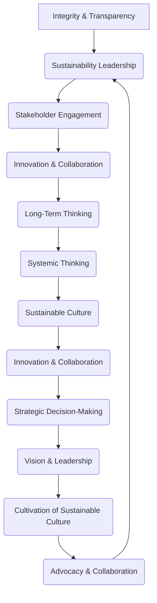
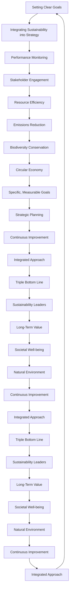
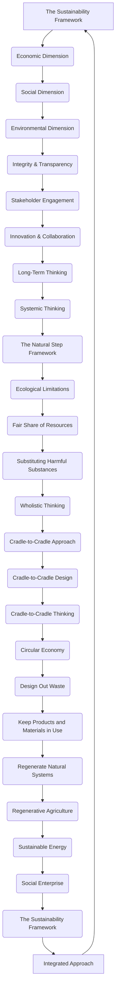
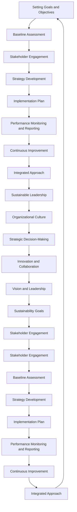
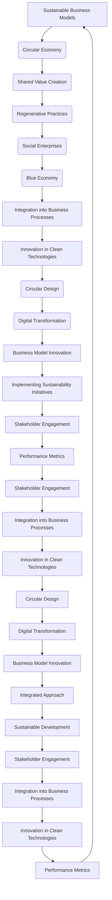
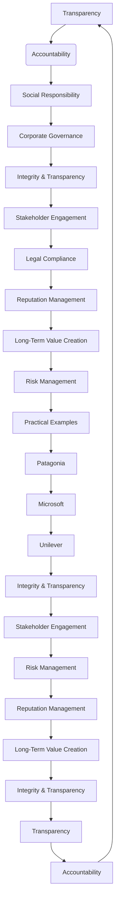
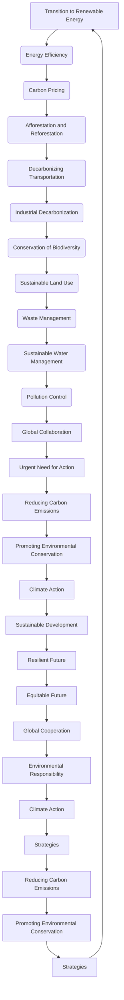
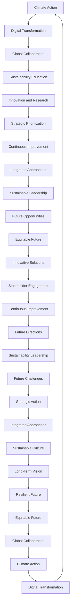

                 

### 1. Introduction to Sustainability Leadership

Sustainability leadership is a critical aspect of modern business and society, focusing on the integration of economic, social, and environmental responsibilities. This form of leadership aims to create a balance that ensures long-term prosperity and well-being for both organizations and the communities they operate within. As the world grapples with climate change, resource depletion, and social inequality, the need for sustainability leaders who can drive meaningful change has never been more pronounced.

#### **Definition and Importance**

Sustainability leadership can be defined as the ability to guide and inspire individuals, teams, and organizations towards achieving sustainable outcomes that benefit all stakeholders. It involves not only understanding the environmental and social impacts of business activities but also incorporating these considerations into strategic decision-making processes.

The importance of sustainability leadership lies in its ability to address the interconnected challenges faced by businesses and society. By adopting a sustainable approach, leaders can create value not only for their organizations but also for the planet and future generations. Sustainability leaders are catalysts for positive change, fostering innovation, collaboration, and resilience in the face of global challenges.

#### **Core Principles and Values**

At the core of sustainability leadership are several key principles and values:

1. **Integrity and Transparency**: Leaders must be transparent about their sustainability goals, progress, and challenges. This fosters trust and accountability among stakeholders.
2. **Stakeholder Engagement**: Involving all stakeholders—employees, customers, suppliers, communities, and investors—in the sustainability journey is crucial for long-term success.
3. **Innovation and Collaboration**: Encouraging a culture of innovation and collaboration can lead to the development of new, sustainable products, services, and business models.
4. **Long-Term Thinking**: Sustainable leaders prioritize long-term value creation over short-term gains, recognizing the need to balance financial success with environmental and social well-being.
5. **Systemic Thinking**: Understanding the interconnectedness of economic, social, and environmental systems allows sustainability leaders to identify and address root causes of sustainability challenges.

#### **The Role of Sustainability Leaders in Society**

Sustainability leaders play a pivotal role in shaping the future of business and society. They are responsible for:

1. **Setting the Vision**: Defining a clear, sustainable vision that aligns with organizational goals and societal needs.
2. **Strategic Decision-Making**: Integrating sustainability into strategic planning and decision-making processes to ensure long-term success.
3. **Cultivating a Sustainable Culture**: Fostering a culture that values sustainability, resilience, and continuous improvement.
4. **Driving Innovation**: Encouraging the development of sustainable technologies, products, and services.
5. **Advocacy and Collaboration**: Championing sustainability initiatives, both within and beyond organizational boundaries, and collaborating with other stakeholders to drive systemic change.

#### **Conclusion**

In conclusion, sustainability leadership is a vital component of modern business and society. By embracing sustainability principles and values, leaders can create a more resilient, equitable, and prosperous future. As we navigate the complexities of the 21st century, the role of sustainability leaders will only become more important, making this a compelling and timely topic for further exploration.

### **Mermaid Diagram: Relationship between Core Concepts and Principles of Sustainability Leadership**

### 2. Balancing Economic, Social, and Environmental Responsibilities

Balancing economic, social, and environmental responsibilities is at the heart of sustainability leadership. This tripartite approach, often referred to as the "triple bottom line" (TBL), emphasizes that a sustainable business must not only be profitable but also socially equitable and environmentally responsible. In this section, we will delve into the concepts and strategies for achieving this balance.

#### **The Triple Bottom Line Approach**

The triple bottom line approach is a framework that considers three main dimensions of sustainability: economic, social, and environmental. 

- **Economic**: This dimension focuses on the financial viability and profitability of an organization. A sustainable business must generate sufficient revenue to cover its costs and invest in future growth while maintaining long-term financial health.
- **Social**: The social dimension addresses the impact of business activities on employees, communities, and society at large. This includes issues such as fair labor practices, employee well-being, community engagement, and social equity.
- **Environmental**: The environmental dimension considers the impact of business operations on the natural environment. This involves managing resources efficiently, reducing waste, minimizing pollution, and conserving biodiversity.

#### **Economic Sustainability: Achieving Long-Term Profitability**

Economic sustainability is crucial for the longevity and success of any business. Here are some key strategies for achieving long-term profitability while maintaining sustainability:

1. **Innovation and Efficiency**: Encouraging innovation can lead to the development of new, sustainable products and services that meet market demands. Additionally, improving operational efficiency can reduce costs and increase profitability.
2. **Diversification**: Diversifying revenue streams and markets can help mitigate risks and ensure stability. This may involve expanding into new geographic regions or diversifying product offerings.
3. **Sustainable Financing**: Accessing sustainable financing options, such as green bonds or impact investments, can support long-term growth while demonstrating a commitment to sustainability.
4. **Supply Chain Management**: Ensuring that supply chain partners adhere to sustainability standards can reduce risks and improve the overall sustainability performance of the business.

#### **Social Sustainability: Fostering Community and Human Well-Being**

Social sustainability is about creating a positive impact on the communities in which a business operates. Here are some strategies for fostering community and human well-being:

1. **Fair Labor Practices**: Ensuring fair wages, safe working conditions, and equitable opportunities for all employees is essential for social sustainability.
2. **Community Engagement**: Engaging with local communities through initiatives such as volunteer programs, philanthropy, and partnerships can build strong relationships and contribute to social well-being.
3. **Diversity and Inclusion**: Promoting diversity and inclusion within the workplace can lead to a more innovative and resilient organization while fostering a sense of belonging and inclusion among employees.
4. **Health and Well-being**: Supporting the health and well-being of employees and their families can improve productivity and reduce absenteeism.

#### **Environmental Sustainability: Protecting Natural Resources and Ecosystems**

Environmental sustainability involves managing resources efficiently and minimizing the environmental impact of business operations. Here are some key strategies:

1. **Resource Efficiency**: Adopting processes and technologies that minimize resource consumption and waste can reduce costs and environmental impact.
2. **Emissions Reduction**: Reducing greenhouse gas emissions and other pollutants is crucial for combating climate change and protecting public health.
3. **Biodiversity Conservation**: Conserving biodiversity and promoting sustainable land use can help preserve ecosystems and maintain the balance of natural systems.
4. **Circular Economy**: Transitioning to a circular economy, where resources are reused and recycled, can reduce waste and resource consumption.

#### **Integrating the Triple Bottom Line Approach**

Achieving balance across the triple bottom line requires a strategic and integrated approach. Here are some steps for integrating the TBL approach into business operations:

1. **Setting Clear Goals**: Establishing specific, measurable goals for economic, social, and environmental performance can help guide decision-making and track progress.
2. **Integrating Sustainability into Strategy**: Incorporating sustainability into strategic planning and decision-making processes ensures that sustainability is a core element of business operations.
3. **Performance Monitoring**: Regularly monitoring and reporting on sustainability performance can help identify areas for improvement and demonstrate progress to stakeholders.
4. **Stakeholder Engagement**: Engaging with stakeholders, including employees, customers, suppliers, and communities, can provide valuable insights and support for sustainability initiatives.

#### **Conclusion**

In conclusion, balancing economic, social, and environmental responsibilities is a complex but essential task for sustainability leaders. By adopting a triple bottom line approach, businesses can create long-term value, contribute to societal well-being, and protect the natural environment. Achieving this balance requires strategic planning, integration across all business functions, and a commitment to continuous improvement. As the world becomes increasingly interconnected and complex, the importance of sustainability leadership and the triple bottom line approach will only continue to grow.

### **Mermaid Diagram: Triple Bottom Line Integration**

### 3. Core Concepts and Principles of Sustainability

Sustainability is a multifaceted concept that encompasses economic, social, and environmental dimensions. At its core, sustainability is about meeting the needs of the present without compromising the ability of future generations to meet their own needs. This section will delve into the core concepts and principles of sustainability, highlighting their interconnectedness and importance in driving sustainable outcomes.

#### **The Sustainability Framework**

The sustainability framework is a comprehensive approach that integrates economic, social, and environmental aspects to create a holistic understanding of sustainability. This framework provides a structured way to identify, prioritize, and address sustainability challenges.

**Economic Dimension**: The economic dimension focuses on the long-term financial health and profitability of an organization. It involves strategies to enhance resource efficiency, innovate sustainable business models, and secure sustainable financing.

**Social Dimension**: The social dimension addresses the impact of business activities on people, communities, and societies. It includes promoting fair labor practices, improving employee well-being, fostering community engagement, and addressing social inequalities.

**Environmental Dimension**: The environmental dimension considers the impact of business operations on the natural environment. It involves adopting resource-efficient practices, reducing greenhouse gas emissions, conserving biodiversity, and promoting sustainable land use.

**Interconnectedness**: The sustainability framework underscores the interconnectedness of these three dimensions. For example, economic sustainability can only be achieved if it aligns with social and environmental goals. Similarly, social and environmental sustainability are critical to ensuring long-term economic viability.

#### **The Natural Step Framework**

The Natural Step (TNS) framework is a widely recognized approach to sustainability that aims to guide organizations and societies towards sustainable development. The TNS framework is based on four system conditions:

1. **Ecological Limitations**: Systems should be designed to fit within the ecological limits of the planet, ensuring that human activities do not undermine the ability of natural systems to provide essential services.
2. **Fair Share of Resources**: Resources should be used in a way that ensures a fair share for all people, without compromising the needs of future generations.
3. **Substituting Harmful Substances**: Technologies and processes should be developed to substitute harmful substances with less harmful alternatives.
4. **Wholistic Thinking**: Decision-making processes should consider the broader social, economic, and environmental context, recognizing the interconnectedness of systems.

#### **The Cradle-to-Cradle Approach**

The Cradle-to-Cradle (C2C) approach is a design philosophy that aims to create products and systems that are truly sustainable. The C2C approach focuses on two main principles:

1. **Cradle-to-Cradle Design**: Products and systems should be designed to be fully recyclable or compostable, with no waste or pollution generated during their lifecycle.
2. **Cradle-to-Cradle Thinking**: Organizations should adopt a holistic approach to sustainability, considering the entire lifecycle of their products and operations, and seeking to create positive impacts on both humans and the environment.

#### **Core Concepts and Principles in Practice**

**Circular Economy**: A circular economy is an economic system designed to minimize waste and make the most of resources. It is based on three key principles:

- **Design Out Waste**: Products and systems should be designed to minimize waste generation.
- **Keep Products and Materials in Use**: Products should be designed for longevity, repairability, and recyclability.
- **Regenerate Natural Systems**: The circular economy aims to restore and regenerate natural systems, ensuring that resources are used sustainably.

**Regenerative Agriculture**: Regenerative agriculture is an approach to farming that seeks to restore and enhance the health of the soil, water, and biodiversity. It involves practices such as crop rotation, cover cropping, and organic fertilizers, which improve soil fertility and reduce reliance on synthetic inputs.

**Sustainable Energy**: Sustainable energy refers to energy sources that are renewable, efficient, and have minimal environmental impact. This includes solar, wind, hydro, and geothermal energy, as well as energy efficiency measures.

**Social Enterprise**: Social enterprises are businesses that pursue social, environmental, and financial goals. They use business strategies to address social and environmental challenges, aiming to create both profit and positive social impact.

#### **Conclusion**

In conclusion, the core concepts and principles of sustainability provide a foundation for understanding and achieving sustainable outcomes. By integrating economic, social, and environmental dimensions, organizations can create value for all stakeholders while safeguarding the planet for future generations. The Natural Step framework and the Cradle-to-Cradle approach offer valuable tools for guiding sustainable practices, while concepts like the circular economy and regenerative agriculture offer practical solutions for addressing sustainability challenges. As sustainability leaders, it is our responsibility to embrace these principles and drive meaningful change in both our organizations and society at large.

### **Mermaid Diagram: Core Concepts and Principles of Sustainability**

### 4. Sustainable Leadership in Organizations

Sustainable leadership within organizations is crucial for embedding sustainability into the core of business operations. It involves fostering a culture that values sustainability, developing a strategic sustainability plan, and ensuring that sustainability initiatives are effectively implemented and measured. In this section, we will explore the role of sustainability leaders within organizations, the process of integrating sustainability into organizational culture, and the development of a sustainability strategy.

#### **The Role of Sustainability Leaders**

Sustainability leaders within organizations play a critical role in driving sustainability initiatives. They are responsible for:

1. **Setting the Vision**: Defining a clear sustainability vision that aligns with the organization's overall strategic goals and societal needs.
2. **Strategic Decision-Making**: Integrating sustainability considerations into strategic planning and decision-making processes to ensure long-term success.
3. **Cultivating a Sustainable Culture**: Fostering a culture that values sustainability, resilience, and continuous improvement.
4. **Driving Innovation**: Encouraging the development of sustainable technologies, products, and services.
5. **Stakeholder Engagement**: Engaging with stakeholders, including employees, customers, suppliers, and communities, to build support for sustainability initiatives.
6. **Performance Monitoring and Reporting**: Regularly monitoring and reporting on sustainability performance to identify areas for improvement and demonstrate progress to stakeholders.

#### **Integrating Sustainability into Organizational Culture**

Integrating sustainability into organizational culture is essential for ensuring that sustainability initiatives are embraced and implemented at all levels of the organization. Here are some steps for achieving this:

1. **Leadership Commitment**: Leaders must demonstrate a genuine commitment to sustainability and integrate it into the organization's mission, vision, and values.
2. **Training and Education**: Providing training and education on sustainability principles and practices to employees at all levels can help build awareness and support for sustainability initiatives.
3. **Incentives and Rewards**: Implementing incentives and rewards for employees who contribute to sustainability goals can encourage a culture of sustainability.
4. **Communication and Transparency**: Regularly communicating sustainability goals, progress, and challenges to employees, customers, and other stakeholders can build trust and support for sustainability initiatives.
5. **Employee Engagement**: Encouraging employee involvement in sustainability initiatives through volunteer programs, innovation challenges, and other opportunities can foster a sense of ownership and commitment to sustainability.
6. **Integration into Business Processes**: Ensuring that sustainability considerations are integrated into all aspects of business operations, from procurement and supply chain management to product design and customer engagement.

#### **Developing a Sustainability Strategy**

Developing a sustainability strategy is a key step in integrating sustainability into an organization. Here are some steps for creating an effective sustainability strategy:

1. **Setting Goals and Objectives**: Define clear, specific, and measurable sustainability goals that align with the organization's overall strategic objectives.
2. **Baseline Assessment**: Conduct a baseline assessment to identify the organization's current sustainability performance and areas for improvement.
3. **Stakeholder Engagement**: Engage with stakeholders, including employees, customers, suppliers, and local communities, to gather insights and input on sustainability priorities and opportunities.
4. **Strategy Development**: Develop a comprehensive sustainability strategy that outlines the initiatives, actions, and timelines needed to achieve the defined goals.
5. **Implementation Plan**: Create an implementation plan that includes specific actions, responsibilities, and timelines for achieving the sustainability strategy.
6. **Performance Monitoring and Reporting**: Regularly monitor and report on sustainability performance to track progress towards goals and identify areas for improvement.
7. **Continuous Improvement**: Foster a culture of continuous improvement, encouraging ongoing evaluation and refinement of sustainability initiatives.

#### **Conclusion**

In conclusion, sustainable leadership within organizations is essential for driving sustainability initiatives and creating long-term value for all stakeholders. By fostering a culture that values sustainability, integrating sustainability into organizational culture, and developing a strategic sustainability plan, organizations can achieve sustainability goals and contribute to a more resilient and equitable future. As sustainability leaders, it is our responsibility to champion sustainability, inspire others, and drive meaningful change in both our organizations and society at large.

### **Mermaid Diagram: Steps in Developing a Sustainability Strategy**

### 5. Strategies for Sustainable Development

Sustainable development requires a proactive approach that integrates innovative strategies across various facets of business operations. This section will explore key strategies for achieving sustainable development, including sustainable business models, the role of innovation in driving sustainability, and the implementation of sustainability initiatives. We will also delve into the importance of stakeholder engagement and the use of performance metrics to track progress.

#### **Sustainable Business Models**

Sustainable business models are designed to create value for all stakeholders while minimizing environmental and social impacts. These models focus on long-term sustainability and resilience. Here are some key components of sustainable business models:

1. **Circular Economy**: Transitioning to a circular economy, where products and materials are designed for longevity, repairability, and recyclability, can reduce waste and resource consumption. This approach emphasizes the use of renewable materials, minimal waste generation, and the recycling of resources back into the economy.
   
2. **Shared Value Creation**: Shared value creation involves aligning business goals with social and environmental objectives. By addressing societal issues, such as inequality or resource scarcity, businesses can create value for both themselves and their communities.

3. **Regenerative Practices**: Regenerative business practices aim to restore and enhance the health of ecosystems. This can include initiatives like regenerative agriculture, reforestation, and the development of sustainable technologies that promote biodiversity.

4. **Social Enterprises**: Social enterprises are businesses that prioritize social and environmental objectives alongside financial returns. They use business strategies to address social and environmental challenges, aiming to create both profit and positive social impact.

5. **Blue Economy**: The blue economy approach focuses on sustainable use of ocean resources to generate economic growth, improve livelihoods, and protect marine ecosystems. This includes practices such as sustainable fishing, ocean conservation, and the development of marine renewable energy.

#### **The Role of Innovation in Driving Sustainability**

Innovation is a key driver of sustainable development. By fostering a culture of innovation, businesses can develop new products, services, and business models that are more sustainable. Here are some ways innovation can drive sustainability:

1. **Clean Technologies**: Investing in clean technologies, such as renewable energy, electric vehicles, and energy-efficient systems, can reduce environmental impact and improve resource efficiency.

2. **Circular Design**: Innovations in design can help create products and systems that are more sustainable. This includes designing for disassembly, using recyclable materials, and incorporating modularity to extend the lifespan of products.

3. **Digital Transformation**: The digital transformation of business processes can lead to increased efficiency, reduced waste, and improved sustainability performance. This includes the use of data analytics, the internet of things (IoT), and automation to optimize operations.

4. **Business Model Innovation**: Redesigning business models to incorporate sustainability principles can lead to new opportunities and competitive advantages. This can include subscription models, product-as-a-service, and shared platforms.

#### **Implementing Sustainability Initiatives**

Implementing sustainability initiatives requires a strategic and systematic approach. Here are the key steps for effectively implementing sustainability initiatives:

1. **Setting Goals and Objectives**: Define clear, specific, and measurable sustainability goals that align with the organization's overall strategic objectives.

2. **Stakeholder Engagement**: Engage with stakeholders, including employees, customers, suppliers, and local communities, to gather insights and support for sustainability initiatives.

3. **Integration into Business Processes**: Ensure that sustainability considerations are integrated into all aspects of business operations, from procurement and supply chain management to product design and customer engagement.

4. **Training and Capacity Building**: Provide training and resources to employees to build their skills and knowledge in sustainability practices.

5. **Performance Monitoring and Reporting**: Regularly monitor and report on sustainability performance to track progress towards goals and identify areas for improvement.

6. **Continuous Improvement**: Foster a culture of continuous improvement, encouraging ongoing evaluation and refinement of sustainability initiatives.

#### **Stakeholder Engagement**

Stakeholder engagement is crucial for the success of sustainability initiatives. Engaging with stakeholders can provide valuable insights, build support, and foster collaboration. Here are some strategies for effective stakeholder engagement:

1. ** transparent communication**: Regularly communicate sustainability goals, progress, and challenges to stakeholders to build trust and maintain transparency.

2. **Inclusive Decision-Making**: Involve stakeholders in decision-making processes to ensure that their perspectives and concerns are considered.

3. **Partnerships and Collaborations**: Collaborate with other organizations, governments, and NGOs to leverage resources, knowledge, and networks for sustainability initiatives.

4. **Community Engagement**: Engage with local communities through initiatives that address their social and environmental needs, building strong relationships and fostering support for sustainability efforts.

#### **Performance Metrics**

To measure the effectiveness of sustainability initiatives, organizations need to establish performance metrics. These metrics should be aligned with the organization's sustainability goals and cover a range of dimensions, including:

1. **Environmental Performance**: Metrics related to resource efficiency, waste reduction, emissions, and biodiversity conservation.

2. **Social Performance**: Metrics related to employee well-being, community engagement, and social equity.

3. **Economic Performance**: Metrics related to financial performance, innovation, and market competitiveness.

4. **Stakeholder Engagement**: Metrics related to stakeholder satisfaction, partnerships, and collaboration.

By regularly monitoring and reporting on these metrics, organizations can track progress, identify areas for improvement, and demonstrate their commitment to sustainability.

#### **Conclusion**

In conclusion, achieving sustainable development requires a strategic and integrated approach that incorporates innovative business models, the role of innovation, effective implementation of sustainability initiatives, stakeholder engagement, and performance metrics. By embracing these strategies, organizations can create long-term value for all stakeholders while contributing to a more sustainable and equitable future.

### **Mermaid Diagram: Strategies for Sustainable Development**

### 6. Social Responsibility and Corporate Governance

Social responsibility and corporate governance are critical components of sustainability leadership. They ensure that businesses not only operate ethically but also contribute positively to society and the environment. In this section, we will delve into the concept of social responsibility, its importance in corporate governance, and the role of transparency and accountability in driving sustainable practices.

#### **Concept of Social Responsibility**

Social responsibility refers to a company's obligation to act in a manner that benefits society while minimizing any adverse impacts. It encompasses a wide range of activities, including ethical business practices, fair labor standards, community engagement, and environmental stewardship. Here are some key aspects of social responsibility:

1. **Ethical Business Practices**: This involves conducting business with integrity, honesty, and fairness. It includes adhering to legal and regulatory requirements, as well as ethical guidelines that go beyond legal compliance.

2. **Fair Labor Standards**: Ensuring fair wages, safe working conditions, and equitable opportunities for employees is a cornerstone of social responsibility. This also includes promoting diversity and inclusion within the workplace.

3. **Community Engagement**: Engaging with local communities through initiatives that address social and environmental issues can enhance a company's reputation and contribute to the well-being of the community.

4. **Environmental Stewardship**: Companies have a responsibility to manage their environmental impact through sustainable practices, such as reducing emissions, conserving resources, and protecting biodiversity.

5. **Corporate Philanthropy**: Donating resources, whether financial, human, or intellectual, to support social causes and charitable organizations is another aspect of social responsibility.

#### **Importance in Corporate Governance**

Corporate governance is the system by which companies are directed and controlled. It includes the processes, policies, and structures through which a company's objectives are set and achieved. Social responsibility is integral to effective corporate governance for several reasons:

1. **Risk Management**: Addressing social and environmental issues can help companies identify and mitigate potential risks that could impact their business operations and financial performance.

2. **Reputation Management**: Companies that prioritize social responsibility are more likely to be perceived as trustworthy and reputable, which can enhance their market position and attract customers, investors, and talent.

3. **Long-Term Value Creation**: By integrating social responsibility into their strategic goals, companies can create long-term value for all stakeholders, including employees, customers, suppliers, and communities.

4. **Stakeholder Engagement**: Effective corporate governance involves engaging with a wide range of stakeholders, including shareholders, employees, customers, suppliers, and local communities. Social responsibility is a key component of this engagement process.

5. **Legal Compliance**: Many social responsibilities are mandated by laws and regulations. Adhering to these requirements is not only a legal obligation but also a reflection of a company's commitment to ethical business practices.

#### **Transparency and Accountability**

Transparency and accountability are fundamental to social responsibility and corporate governance. They ensure that companies are open about their activities, progress, and performance, and that they are held accountable for their actions.

1. **Transparency**: Transparency involves disclosing information about a company's operations, policies, and performance to stakeholders. This can include financial reports, sustainability reports, and other relevant information. Transparent communication builds trust and enhances a company's reputation.

2. **Accountability**: Accountability ensures that companies are held responsible for their actions and their impact on society and the environment. This can involve internal and external mechanisms, such as audits, certifications, and stakeholder reviews. Accountability promotes a culture of integrity and ethical behavior within the organization.

#### **Practical Examples and Case Studies**

Several companies have successfully integrated social responsibility into their corporate governance practices. Here are a few examples:

1. **Patagonia**: Patagonia, an outdoor clothing and gear company, is renowned for its commitment to social and environmental responsibility. The company has implemented initiatives such as the "Worn Wear" program, which encourages customers to repair and reuse their gear, and "1% for the Planet," which donates 1% of its sales to environmental organizations.

2. **Microsoft**: Microsoft has a comprehensive sustainability strategy that includes goals for reducing carbon emissions, conserving water, and promoting responsible supply chain practices. The company's "AI for Good" initiative uses artificial intelligence to address global challenges, such as climate change and health crises.

3. **Unilever**: Unilever, a consumer goods company, has set ambitious sustainability goals under its "Sustainable Living Plan." This includes reducing environmental impact, enhancing health and well-being, and supporting fair livelihoods for farmers and workers. The company regularly reports on its progress and engages with stakeholders to drive continuous improvement.

#### **Conclusion**

In conclusion, social responsibility and corporate governance are crucial elements of sustainability leadership. By embracing these principles, companies can create value for all stakeholders, enhance their reputation, and contribute to a more sustainable and equitable future. Transparency and accountability are key to ensuring that companies live up to their social responsibilities and are held accountable for their actions. As sustainability leaders, it is our responsibility to champion these values and drive meaningful change within our organizations and society at large.

### **Mermaid Diagram: Transparency and Accountability in Social Responsibility and Corporate Governance**

### 7. Environmental Responsibility and Climate Action

Environmental responsibility is a cornerstone of sustainability leadership, focusing on the impact of human activities on the natural environment. Climate change, driven primarily by greenhouse gas emissions and deforestation, poses a significant threat to ecosystems, biodiversity, and human well-being. This section will explore the concept of environmental responsibility, the urgent need for climate action, and key strategies for reducing carbon emissions and promoting environmental conservation.

#### **Concept of Environmental Responsibility**

Environmental responsibility involves the recognition and management of the environmental impacts of human activities. It encompasses a range of actions aimed at minimizing harm to the environment and promoting sustainability. Key aspects of environmental responsibility include:

1. **Emissions Reduction**: Reducing greenhouse gas emissions is a critical component of environmental responsibility. This involves adopting cleaner technologies, improving energy efficiency, and transitioning to renewable energy sources.

2. **Resource Conservation**: Conserving natural resources, such as water, forests, and minerals, is essential for maintaining ecological balance and preventing resource depletion.

3. **Waste Management**: Implementing sustainable waste management practices, such as reducing waste generation, recycling, and proper disposal, helps minimize environmental pollution.

4. **Biodiversity Protection**: Protecting biodiversity involves preserving ecosystems, restoring degraded habitats, and preventing the extinction of species.

5. **Sustainable Agriculture**: Promoting sustainable agricultural practices, such as crop rotation, organic farming, and water conservation, helps maintain soil health and reduce pollution.

#### **The Urgent Need for Climate Action**

Climate change is one of the most pressing global challenges of our time. The effects of climate change, including rising global temperatures, more frequent extreme weather events, and sea-level rise, pose significant risks to human health, economies, and ecosystems. The urgency of climate action is underscored by several key factors:

1. **Scientific Evidence**: The scientific consensus on climate change is clear: human activities are primarily responsible for the current warming trend. The Intergovernmental Panel on Climate Change (IPCC) has warned that urgent and significant reductions in greenhouse gas emissions are needed to limit global warming to 1.5°C above pre-industrial levels.

2. **Consequences of Inaction**: The consequences of continued inaction on climate change are severe. Rising temperatures can lead to more frequent and severe heatwaves, droughts, storms, and floods, which can cause widespread damage to infrastructure, livelihoods, and ecosystems.

3. **Global Collaboration**: Addressing climate change requires global cooperation and collective action. International agreements, such as the Paris Agreement, aim to mobilize efforts to limit global warming and support vulnerable communities.

#### **Key Strategies for Reducing Carbon Emissions**

Reducing carbon emissions is essential for mitigating climate change. Here are some key strategies for achieving this goal:

1. **Transition to Renewable Energy**: Shifting from fossil fuels to renewable energy sources, such as solar, wind, hydro, and geothermal energy, is one of the most effective ways to reduce carbon emissions. Renewable energy technologies are becoming increasingly affordable and efficient, making the transition feasible for many countries.

2. **Energy Efficiency**: Improving energy efficiency in industries, transportation, and buildings can significantly reduce energy consumption and carbon emissions. This can be achieved through the use of advanced technologies, better insulation, and energy management systems.

3. **Carbon Pricing**: Implementing carbon pricing mechanisms, such as carbon taxes or cap-and-trade systems, can incentivize businesses and individuals to reduce their carbon emissions. These mechanisms put a price on carbon emissions, making it economically beneficial to adopt cleaner technologies and practices.

4. **Afforestation and Reforestation**: Planting trees and restoring forests can absorb carbon dioxide from the atmosphere, acting as a natural carbon sink. Afforestation and reforestation initiatives can also enhance biodiversity and provide social and economic benefits.

5. **Decarbonizing Transportation**: Transitioning to low-carbon transportation options, such as electric vehicles, public transportation, and active transportation (walking and cycling), can reduce carbon emissions from the transportation sector. Policies that promote these options, such as subsidies, incentives, and infrastructure improvements, can accelerate the transition.

6. **Industrial Decarbonization**: Many industries, such as steel, cement, and chemicals, are major sources of carbon emissions. Investing in cleaner technologies, such as carbon capture and storage (CCS), and promoting sustainable industrial processes can help reduce emissions from these sectors.

#### **Promoting Environmental Conservation**

In addition to reducing carbon emissions, environmental responsibility also involves protecting and conserving natural ecosystems. Here are some key strategies:

1. **Conservation of Biodiversity**: Protecting biodiversity involves conserving habitats, preventing the extinction of species, and restoring degraded ecosystems. This can be achieved through protected areas, restoration projects, and sustainable land management practices.

2. **Sustainable Land Use**: Adopting sustainable land use practices, such as agroforestry, conservation agriculture, and sustainable logging, can preserve soil health, water resources, and biodiversity.

3. **Waste Management**: Effective waste management practices, such as reducing waste generation, recycling, and proper disposal, help minimize environmental pollution and conserve resources.

4. **Sustainable Water Management**: Implementing sustainable water management practices, such as water conservation, re-use, and pollution control, helps maintain water quality and availability for both human and ecological needs.

5. **Pollution Control**: Implementing measures to control air, water, and soil pollution can protect human health and ecosystems. This includes regulations, monitoring, and the use of pollution control technologies.

#### **Conclusion**

In conclusion, environmental responsibility and climate action are critical for addressing the challenges posed by climate change and promoting sustainable development. By adopting strategies to reduce carbon emissions, promote environmental conservation, and foster global cooperation, we can create a more resilient, equitable, and sustainable future. As sustainability leaders, it is our responsibility to drive these efforts and inspire others to take action.

### **Mermaid Diagram: Strategies for Environmental Responsibility and Climate Action**

### 8. Practical Case Studies and Success Stories

To truly understand the impact of sustainability leadership, it is invaluable to examine real-world examples where organizations have successfully integrated sustainability into their core operations. This section will showcase several practical case studies and success stories, providing insights into their strategies, challenges faced, and the outcomes achieved. These examples will highlight the diverse approaches and innovative solutions that have led to sustainable success.

#### **Case Study 1: Interface, Inc.**

**Background**: Interface, Inc. is a global manufacturer of modular carpet tiles, known for its pioneering efforts in sustainability. The company's mission is to become the world's most sustainable flooring company, aiming to eliminate virgin resources and waste from its products and operations by 2020.

**Core Concepts and Principles**: Interface has embraced the principles of the circular economy, focusing on designing products for longevity, repairability, and recyclability. They have implemented a range of sustainability initiatives, including:

- **Recycling Program**: Interface's "Game Changer" program allows customers to return used carpet tiles for recycling, ensuring that materials are reused rather than ending up in landfills.
- **Biophilic Design**: The company has incorporated natural elements into its product designs, enhancing the connection between people and nature.
- **Carbon Neutral Operations**: Interface has committed to achieving carbon neutrality across its operations by 2020, which involved significant investments in renewable energy and carbon offset projects.

**Results**: Interface's sustainability efforts have yielded impressive results, including:

- A 94% reduction in waste sent to landfills.
- A 93% reduction in greenhouse gas emissions from its operations.
- The successful launch of "InterfacePlay", a line of modular carpet tiles designed for play and learning environments, which has been well-received in the education sector.

**Lessons Learned**: Interface's success underscores the importance of integrating sustainability into every aspect of a business. By setting bold goals and investing in innovative solutions, companies can drive meaningful change and create long-term value.

#### **Case Study 2: Patagonia**

**Background**: Patagonia, an outdoor clothing and gear company, has been a trailblazer in sustainability since its founding in 1973. The company's commitment to environmental and social responsibility is deeply embedded in its mission to "use business to inspire and implement solutions to the environmental crisis."

**Core Concepts and Principles**: Patagonia's sustainability strategy is built on several key principles:

- **Community and Environmental Initiatives**: The company supports environmental organizations and local communities through grants, volunteer programs, and its "1% for the Planet" initiative, which donates 1% of sales to environmental causes.
- **Ethical Supply Chain**: Patagonia works closely with suppliers to ensure fair labor practices and environmentally friendly production processes.
- **Product Sustainability**: The company focuses on designing durable, high-quality products that last longer and reduce waste.

**Results**: Over the years, Patagonia has achieved significant milestones in sustainability:

- The introduction of "Worn Wear," a program that encourages customers to repair and reuse their Patagonia products, extending their lifespan.
- The implementation of "Low-Impact Materials" (LIM) in its products, which aim to minimize the company's environmental footprint.
- The adoption of renewable energy for its global operations, reducing its carbon footprint.

**Lessons Learned**: Patagonia's journey demonstrates the power of a mission-driven approach to sustainability. By fostering a culture of innovation and accountability, companies can inspire both employees and customers to adopt more sustainable practices.

#### **Case Study 3: Unilever**

**Background**: Unilever, a leading consumer goods company, has set ambitious sustainability goals under its "Sustainable Living Plan," which aims to decouple growth from environmental impact and increase access to sustainable products for more than a billion people by 2030.

**Core Concepts and Principles**: Unilever's sustainability strategy focuses on three pillars:

- **Health and Well-being**: Promoting healthier diets, oral hygiene, and skin care.
- **Nutrition**: Improving nutrition and food security through sustainable agriculture and product innovation.
- **Sustainable Living**: Reducing environmental impact through resource efficiency, renewable energy, and circular economy practices.

**Results**: Unilever has made significant progress in its sustainability initiatives:

- Reducing its absolute carbon footprint by 38% and its water use by 48% since 2008.
- Launching sustainable product innovations, such as "Dove Men+Care" and "Flora ProActiv," which have improved health and well-being for millions of people.
- Establishing "The Unilever Foundry," a global innovation platform that supports startups and entrepreneurs in developing sustainable solutions.

**Lessons Learned**: Unilever's success highlights the importance of a comprehensive sustainability strategy that aligns with business goals. By integrating sustainability into every facet of the company, from product development to supply chain management, organizations can drive positive change at scale.

#### **Case Study 4: Danone**

**Background**: Danone, a global food and beverage company, has made sustainability a cornerstone of its business strategy. The company's "One Planet. One Health" initiative aims to improve health and well-being while protecting the planet.

**Core Concepts and Principles**: Danone's sustainability approach focuses on three core areas:

- **One Planet Nutrition**: Promoting healthier diets and sustainable agriculture practices.
- **Health and Well-being**: Developing innovative solutions that improve health and well-being.
- **Sustainable Operations**: Reducing environmental impact through resource efficiency and renewable energy.

**Results**: Danone has made substantial progress in its sustainability efforts:

- Reducing greenhouse gas emissions by 54% since 2008 and water usage by 44%.
- Achieving 100% renewable electricity in its operations globally.
- Launching "Actimel," a probiotic yogurt that supports gut health and immunity, which has been well-received by consumers.

**Lessons Learned**: Danone's experience underscores the importance of a holistic sustainability approach that integrates health and environmental goals. By focusing on the interconnectedness of health and the environment, companies can create value for all stakeholders.

#### **Conclusion**

These case studies and success stories demonstrate the diverse approaches and innovative solutions that organizations can adopt to achieve sustainability. From implementing circular economy principles to promoting health and well-being, these companies have shown that sustainability is not just a moral obligation but a strategic advantage. As sustainability leaders, we can learn from these examples and apply their lessons to drive meaningful change within our own organizations and industries.

### **Mermaid Diagram: Key Takeaways from Practical Case Studies and Success Stories**

### 9. Conclusion and Future Directions

In conclusion, sustainability leadership is a critical aspect of modern business and society, requiring a balance of economic, social, and environmental responsibilities. By integrating sustainability into strategic decision-making and fostering a culture of innovation and resilience, leaders can drive meaningful change and create long-term value for all stakeholders. The key takeaways from this article include:

1. **The Importance of Sustainability Leadership**: Leaders play a pivotal role in setting the vision, fostering a sustainable culture, and driving innovation. By embracing sustainability principles, they can create a more resilient, equitable, and prosperous future.
2. **Balancing Economic, Social, and Environmental Responsibilities**: The triple bottom line approach emphasizes the need to consider all three dimensions of sustainability. Achieving balance requires strategic planning, stakeholder engagement, and continuous improvement.
3. **Core Concepts and Principles of Sustainability**: Understanding the interconnectedness of economic, social, and environmental dimensions is crucial for effective sustainability leadership. Frameworks like the Natural Step and Cradle-to-Cradle approaches provide valuable tools for guiding sustainable practices.
4. **Sustainable Leadership in Organizations**: Integrating sustainability into organizational culture and developing a strategic sustainability plan are essential steps. By fostering a culture of sustainability, organizations can drive innovation and achieve long-term success.
5. **Strategies for Sustainable Development**: Implementing sustainable business models, promoting innovation, and engaging with stakeholders are key strategies for achieving sustainable development. Performance metrics and continuous improvement are essential for tracking progress and driving ongoing innovation.

Looking to the future, several key areas present opportunities and challenges for sustainability leaders:

1. **Climate Action**: The urgency of climate change requires accelerated action to reduce carbon emissions and promote environmental conservation. Leaders must prioritize sustainable energy transitions, emissions reductions, and the protection of biodiversity.
2. **Digital Transformation**: The digital revolution offers new opportunities to enhance sustainability through technologies such as data analytics, artificial intelligence, and the internet of things. Leaders should embrace digital transformation to optimize operations and drive sustainability initiatives.
3. **Global Collaboration**: Addressing sustainability challenges requires global cooperation and collective action. Leaders should seek to collaborate with governments, NGOs, and other stakeholders to develop and implement innovative solutions.
4. **Sustainability Education**: As the complexity of sustainability issues grows, there is an increasing need for education and training to build capacity and expertise. Leaders should invest in education and professional development to foster a culture of sustainability.
5. **Innovation and Research**: Continued innovation and research are essential for developing new technologies, business models, and policies that support sustainable development. Leaders should encourage and support innovation and collaboration in research institutions.

In conclusion, sustainability leadership is a powerful force for positive change. By embracing sustainability principles, fostering a culture of innovation and resilience, and driving meaningful action, leaders can create a more sustainable and equitable future. The future holds both opportunities and challenges, and as sustainability leaders, we have a responsibility to navigate these complexities and inspire others to join us in building a more sustainable world.

### **Mermaid Diagram: Future Directions for Sustainability Leadership**

### **作者信息**

作者：AI天才研究院/AI Genius Institute & 禅与计算机程序设计艺术 /Zen And The Art of Computer Programming

### **全文结束**

通过本文的详细分析和思考，我们深入探讨了可持续发展领导的核心概念、原则和实践。希望这些内容能够激发您的思考，并激励您在各自的领域中推动可持续发展。让我们一起努力，为创造一个更加可持续、公平和繁荣的未来而奋斗！🌟

