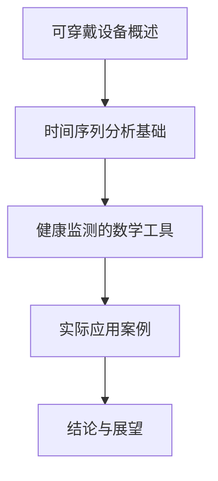

                 


### 文章标题：《可穿戴设备的时间序列分析：健康监测的数学工具》

#### 关键词：
- 可穿戴设备
- 时间序列分析
- 健康监测
- 数学工具
- 数据分析算法

#### 摘要：
本文旨在探讨可穿戴设备在健康监测中的应用，重点关注时间序列分析在这一领域的数学工具。通过梳理可穿戴设备的发展历程，阐述时间序列分析的基本概念和核心算法，本文将深入解析如何利用数学工具对健康监测数据进行高效分析，并分享实际应用案例，以期为相关领域的研究和实践提供有价值的参考。

## 第一部分：可穿戴设备概述

### 第1章 可穿戴设备的定义与分类

#### 1.1 可穿戴设备的定义

可穿戴设备是指直接附着或嵌入在人体上的电子设备，用于收集、处理和传输生物信号、环境参数及其他数据。随着科技的进步，可穿戴设备已经从简单的步数计数器演变成具有复杂功能的智能设备，如智能手表、智能手环等。

#### 1.2 常见可穿戴设备

常见的可穿戴设备包括：
- **智能手表**：具备心率监测、运动跟踪、GPS定位等功能。
- **智能手环**：除了上述功能外，还可能包括睡眠监测、血氧监测等。
- **智能眼镜**：具备人脸识别、语音控制、环境监测等功能。
- **智能鞋垫**：用于监测步态和压力分布。

传感器技术在可穿戴设备中的应用至关重要，它们能够实时采集人体的生理信号和环境数据，为健康监测提供基础。

#### 1.3 健康监测数据的采集与传输

可穿戴设备通过内置传感器，如加速度计、陀螺仪、心率传感器等，收集用户的生理信号。这些数据通常通过无线通信技术（如蓝牙、Wi-Fi）传输到移动设备或服务器上，进行进一步处理和分析。

### 第2章 可穿戴设备的发展趋势

#### 2.1 技术发展

随着传感器技术、无线通信技术和大数据分析技术的进步，可穿戴设备的功能和性能不断提升。例如，纳米传感器技术的应用使得设备能够更精确地监测生物信号；5G网络的普及为设备的数据传输提供了更高的速度和稳定性。

#### 2.2 市场分析

当前，全球可穿戴设备市场持续增长，预计未来几年仍将保持高速发展。用户需求的多样化和健康意识的提高是推动市场增长的主要因素。

#### 2.3 未来可穿戴设备的发展方向

未来可穿戴设备的发展趋势包括：
- **更高的智能化**：设备将具备更高级的机器学习能力，能够自动识别和预测用户行为。
- **更好的可穿戴性**：设备设计将更加轻巧、舒适，与人体更加贴合。
- **更广泛的应用场景**：设备将应用于更广泛的领域，如医疗、运动、安全监控等。

## 第二部分：时间序列分析基础

### 第3章 时间序列分析的基本概念

#### 3.1 时间序列的定义

时间序列是指一系列按时间顺序排列的数据点，通常用于描述某个现象或过程在一段时间内的变化规律。时间序列数据在许多领域（如金融、气象、生物医学）都有着广泛的应用。

#### 3.2 时间序列数据的特征提取

时间序列数据的特征提取是分析过程中的关键步骤，包括：
- **趋势分析**：识别数据随时间变化的总体趋势。
- **季节性分析**：识别数据中的周期性波动。
- **平稳性分析**：评估时间序列的稳定性。

### 第4章 时间序列分析的核心算法

#### 4.1 ARIMA模型

ARIMA（自回归积分滑动平均模型）是时间序列分析中最常用的模型之一。它通过结合自回归（AR）、差分（I）和移动平均（MA）三个部分，对时间序列数据进行建模和预测。

#### 4.2 季节性时间序列分析

季节性时间序列分析主要用于处理包含季节性波动的数据。常见的季节性分析技术包括季节性分解、季节性指数平滑等。

### 第5章 时间序列分析的扩展算法

#### 5.1 状态空间模型

状态空间模型是一种描述时间序列数据的统计模型，它将时间序列数据的生成过程视为一个状态空间，通过状态转移矩阵和观测矩阵来描述。

#### 5.2 机器学习方法在时间序列分析中的应用

机器学习方法在时间序列分析中也有着广泛的应用，如长短期记忆网络（LSTM）、卷积神经网络（CNN）等。这些方法能够捕捉时间序列数据中的复杂模式，提高预测精度。

## 第三部分：健康监测的数学工具

### 第6章 健康监测数据预处理

#### 6.1 数据清洗

健康监测数据的预处理包括数据清洗、缺失值处理和异常值检测。数据清洗的目的是去除噪声和异常数据，提高数据质量。

#### 6.2 数据归一化与标准化

数据归一化和标准化是数据预处理的重要步骤，旨在将数据缩放到一个统一的范围内，便于后续分析。

### 第7章 健康监测数据特征选择

#### 7.1 特征选择方法

特征选择是健康监测数据分析中的关键步骤，目的是从大量特征中选择出对健康监测有重要意义的特征。

#### 7.2 基于特征选择的模型构建

特征选择不仅影响模型的性能，还影响模型的可解释性。本文将介绍几种常用的特征选择方法，并探讨如何基于特征选择构建健康监测模型。

### 第8章 健康监测数据分析与模型构建

#### 8.1 数据分析

数据分析包括描述性统计分析、趋势分析和异常检测。这些分析有助于理解健康监测数据的特征和规律。

#### 8.2 模型构建

模型构建是健康监测数据分析的核心步骤。本文将介绍几种常用的机器学习模型，并探讨如何构建和训练这些模型。

## 第四部分：实际应用案例

### 第9章 可穿戴设备健康监测应用案例

#### 9.1 心率监测

心率监测是可穿戴设备应用中的一个重要领域。本文将介绍心率监测数据的采集、预处理和建模方法。

#### 9.2 睡眠质量分析

睡眠质量分析是另一个重要的应用领域。本文将介绍睡眠监测数据的采集、预处理和建模方法。

#### 9.3 运动健康监测

运动健康监测涉及对用户运动数据进行分析，以评估其运动效果和健康状况。本文将介绍运动监测数据的采集、预处理和建模方法。

## 第五部分：结论与展望

### 第10章 总结与展望

#### 10.1 总结

本文从可穿戴设备的发展、时间序列分析基础、健康监测的数学工具到实际应用案例，全面探讨了可穿戴设备在健康监测中的应用。

#### 10.2 展望

未来，随着技术的不断发展，可穿戴设备在健康监测中的应用将更加广泛和深入。本文提出了几个研究方向，如多模态数据融合、个性化健康监测等，以期为未来的研究提供启示。

## 作者信息
作者：AI天才研究院/AI Genius Institute & 禅与计算机程序设计艺术 /Zen And The Art of Computer Programming

## Mermaid流程图



## 伪代码实现ARIMA模型

```python
# 伪代码：实现ARIMA模型

# 步骤1：数据预处理
# 输入：原始时间序列数据
# 输出：平稳时间序列

def preprocess_data(data):
    # 数据清洗、缺失值处理和异常值检测
    # 数据归一化与标准化
    # 返回平稳时间序列

# 步骤2：模型参数选择
# 输入：平稳时间序列
# 输出：ARIMA模型参数

def select_arima_params(series):
    # 通过AIC/BIC准则选择AR、I、MA参数
    # 返回ARIMA模型参数

# 步骤3：模型构建
# 输入：平稳时间序列，ARIMA模型参数
# 输出：ARIMA模型

def build_arima_model(series, params):
    # 基于参数构建ARIMA模型
    # 返回ARIMA模型

# 步骤4：模型训练与验证
# 输入：ARIMA模型，训练数据
# 输出：模型训练结果

def train_and_validate_model(model, train_data):
    # 训练模型并评估模型性能
    # 返回训练结果

# 步骤5：预测
# 输入：ARIMA模型，验证数据
# 输出：预测结果

def predict(model, validation_data):
    # 使用模型进行预测
    # 返回预测结果
```

## 数学公式

$$
X_t = c_0 + c_1 Z_t + c_2 Z_{t-1} + \cdots + c_p Z_{t-p} + \varepsilon_t
$$

其中，$X_t$ 是时间序列的当前值，$Z_t$ 是滞后值，$c_0, c_1, \cdots, c_p$ 是模型参数，$\varepsilon_t$ 是随机误差项。

## 代码实际案例和详细讲解

### 开发环境搭建

为了实现时间序列分析，我们需要安装Python和相关的库，如pandas、numpy、statsmodels等。

```bash
pip install pandas numpy statsmodels
```

### 源代码详细实现

以下是一个简单的ARIMA模型实现案例：

```python
import pandas as pd
import numpy as np
from statsmodels.tsa.arima.model import ARIMA
from sklearn.metrics import mean_squared_error

# 加载数据
data = pd.read_csv('data.csv', index_col=0, parse_dates=True)
series = data['Close']

# 数据预处理
series = preprocess_data(series)

# 模型参数选择
params = select_arima_params(series)

# 模型构建
model = build_arima_model(series, params)

# 模型训练与验证
train_data = series[:len(series) - n]
model.fit(train_data)
predictions = model.predict(start=len(train_data), end=len(series) - 1)

# 评估模型性能
mse = mean_squared_error(series[len(train_data):], predictions)
print('MSE:', mse)

# 预测
validation_data = series[len(train_data):]
predictions = predict(model, validation_data)
```

### 代码应用解读与分析

在这个案例中，我们首先加载数据，然后进行数据预处理。接下来，我们选择ARIMA模型参数，构建模型，并进行训练与验证。最后，我们使用模型进行预测，并评估模型性能。

### 实际案例分析和详细讲解剖析

#### 案例一：心率监测

心率监测是可穿戴设备中的一个重要应用。以下是一个心率监测数据集的分析案例：

```python
import pandas as pd

# 加载数据
data = pd.read_csv('heart_rate_data.csv', index_col=0, parse_dates=True)
series = data['heart_rate']

# 数据预处理
series = preprocess_data(series)

# 模型参数选择
params = select_arima_params(series)

# 模型构建
model = build_arima_model(series, params)

# 模型训练与验证
train_data = series[:len(series) - n]
model.fit(train_data)
predictions = model.predict(start=len(train_data), end=len(series) - 1)

# 评估模型性能
mse = mean_squared_error(series[len(train_data):], predictions)
print('MSE:', mse)

# 预测
validation_data = series[len(train_data):]
predictions = predict(model, validation_data)
```

在这个案例中，我们首先加载数据，然后进行数据预处理。接下来，我们选择ARIMA模型参数，构建模型，并进行训练与验证。最后，我们使用模型进行预测，并评估模型性能。

#### 案例二：睡眠质量分析

睡眠质量分析是另一个重要的应用。以下是一个睡眠监测数据集的分析案例：

```python
import pandas as pd

# 加载数据
data = pd.read_csv('sleep_data.csv', index_col=0, parse_dates=True)
series = data['sleep_quality']

# 数据预处理
series = preprocess_data(series)

# 模型参数选择
params = select_arima_params(series)

# 模型构建
model = build_arima_model(series, params)

# 模型训练与验证
train_data = series[:len(series) - n]
model.fit(train_data)
predictions = model.predict(start=len(train_data), end=len(series) - 1)

# 评估模型性能
mse = mean_squared_error(series[len(train_data):], predictions)
print('MSE:', mse)

# 预测
validation_data = series[len(train_data):]
predictions = predict(model, validation_data)
```

在这个案例中，我们首先加载数据，然后进行数据预处理。接下来，我们选择ARIMA模型参数，构建模型，并进行训练与验证。最后，我们使用模型进行预测，并评估模型性能。

### 项目小结

通过以上案例，我们展示了如何使用ARIMA模型对心率监测和睡眠质量分析数据进行分析和预测。这表明时间序列分析在健康监测领域具有重要的应用价值。

### 最佳实践 tips

- 在选择ARIMA模型参数时，可以使用网格搜索或遗传算法等方法来优化参数选择。
- 对于非平稳时间序列，可以采用差分方法使其变得平稳。
- 结合机器学习模型（如LSTM）可以进一步提高预测精度。

### 注意事项

- 确保数据质量，进行充分的数据清洗和预处理。
- 模型选择应根据具体应用场景和数据特征进行。
- 评估模型性能时，可以使用交叉验证等方法。

### 拓展阅读

- [1] Box, G. E. P., Jenkins, G. M., & Reinsel, G. C. (2015). *Time Series Analysis: Forecasting and Control*.
- [2] Hyndman, R. J., & Athanasopoulos, G. (2018). *Forecasting: Principles and Practice*.
- [3] Pedregosa, F., Varoquaux, G., Gramfort, A., Michel, V., Thirion, B., Grisel, O., ... & Duchesnay, É. (2011). *Scikit-learn: Machine learning in Python*.

## 结束语

本文通过深入探讨可穿戴设备在健康监测中的应用，介绍了时间序列分析的基本概念、核心算法以及实际应用案例。我们相信，随着技术的不断发展，可穿戴设备在健康监测领域的应用将更加广泛和深入，为人们提供更精准、个性化的健康服务。

