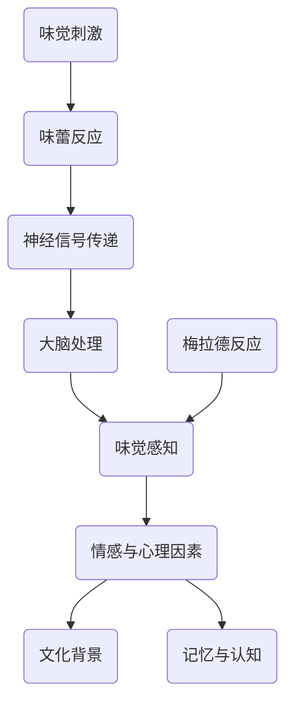

                 


### **第一部分：引言**

**味觉空间的多维缩放：美食组合的数学映射**

在这个充满味觉和嗅觉体验的世界里，美食不仅仅是满足生理需求，更是文化、情感和记忆的载体。每一次味蕾的触动，都可能是新的惊喜或难忘的回忆。然而，对于美食的探索，我们是否真的理解了其中的奥秘？当我们谈论美食组合时，是否可以将其转化为数学模型，通过数据分析和算法来揭示其内在的规律和可能性？

本篇文章将带领读者踏上一场探索味觉空间的旅程，从味觉感知心理学出发，通过数学和统计学的方法，对美食组合进行多维缩放和数学映射。我们将深入探讨以下几个核心问题：

- **味觉感知的基本原理**：了解味觉是如何被感知和处理的，以及心理因素如何影响味觉体验。
- **数学模型在味觉研究中的应用**：学习如何将味觉空间抽象为多维空间，并利用数学模型进行描述和分析。
- **统计学方法**：了解统计学在美食组合分析中的重要性，以及如何通过聚类分析和因子分析等方法揭示味觉规律。
- **实际案例研究**：通过具体的美食组合案例，展示数学映射在美食创新中的应用和效果。
- **未来发展**：探讨数学映射在美食产业中的潜在应用，以及未来研究的发展方向。

通过本文，我们希望能够为读者提供一种全新的视角，帮助大家更好地理解美食组合的内在规律，从而在烹饪和品尝美食的过程中获得更丰富的体验和乐趣。

### **关键词**

- **味觉感知心理学**
- **数学模型**
- **美食组合**
- **统计学方法**
- **聚类分析**
- **因子分析**
- **多维空间**
- **线性映射**
- **非线性映射**
- **味觉空间**
- **美食创新**
- **数据分析**

### **摘要**

本文旨在探讨味觉空间的多维缩放和美食组合的数学映射，通过对味觉感知心理学、数学模型和统计学方法的研究，揭示美食组合中的内在规律和可能性。文章首先介绍了味觉感知的基本原理，然后通过数学和统计学方法，将味觉空间抽象为多维空间，并进行线性映射和非线性映射。接着，通过具体的案例研究，展示了数学映射在美食创新中的应用。最后，探讨了数学映射在美食产业中的潜在应用和未来发展。本文为美食爱好者、烹饪专业人士和研究人员提供了一个全新的视角，帮助大家更好地理解和创新美食组合。

### **味觉感知心理学**

味觉感知心理学是研究味觉感知过程的心理机制和影响因素的学科，它涉及多个领域，包括生理学、心理学、神经科学和文化学。理解味觉感知心理学的基本原理，有助于我们更深入地探索味觉空间的奥秘。

#### **味觉感知的基本原理**

味觉感知是指我们通过舌头上的味蕾感知食物中的不同味道，包括甜、酸、苦、咸和鲜等。味觉感知过程可以概括为以下几个步骤：

1. **刺激产生**：当食物与舌头接触时，化学物质溶解在唾液中，刺激味蕾。
2. **信息传递**：味蕾上的受体细胞将刺激转换为神经信号，通过神经通路传递到大脑。
3. **大脑处理**：大脑对神经信号进行处理，产生味觉感知。

**味觉适应**是味觉感知过程中一个重要的现象。味觉适应指的是我们的味觉感受性随着时间变化而变化的过程。例如，当我们长时间食用某种味道的食物时，我们的味觉感受性会降低，这种现象称为“味觉疲劳”。味觉适应不仅影响我们的味觉体验，还可能影响我们对食物的选择和喜好。

**梅拉德反应**（Maillard reaction）是烹饪过程中非常重要的化学过程。它是指氨基酸和还原糖在加热条件下发生的复杂化学反应，生成多种具有独特风味的化合物。梅拉德反应不仅影响食物的色泽和质地，还影响味觉感受。例如，烤肉和咖啡的苦味和香气就与梅拉德反应密切相关。

#### **味觉与心理学的联系**

心理学研究指出，味觉体验不仅受生理因素的影响，还受到心理和社会因素的影响。以下是一些关于味觉与心理学的联系：

1. **情感与味觉**：情感状态可以显著影响味觉体验。例如，快乐或悲伤的情绪可能会影响我们对食物味道的感受和喜好。
2. **文化背景**：不同的文化背景会影响人们对食物的选择和味觉偏好。例如，西方文化中偏好甜食，而东方文化中偏好咸味和辛辣食物。
3. **认知与记忆**：记忆和认知过程在味觉体验中也扮演重要角色。我们往往会根据过去的味觉经验来评价新食物，这种认知加工过程会影响我们的味觉感知。

#### **味觉多样性的心理学研究**

味觉多样性是美食世界中的一大魅力。心理学研究揭示了味觉多样性的多个维度，包括味觉感知的敏锐度、味觉记忆的多样性以及味觉偏好的变化等。

1. **味觉感知敏锐度**：不同人群的味觉感知敏锐度存在差异。一些人的味觉感受性较高，能够感知到微小的味觉变化，而另一些人则可能对味觉变化不太敏感。
2. **味觉记忆的多样性**：味觉记忆不仅依赖于味觉刺激的强度和持续时间，还受到个人经历和文化背景的影响。因此，不同的人可能会对相同的食物产生不同的味觉记忆。
3. **味觉偏好的变化**：味觉偏好会随着时间和生活经历的变化而变化。例如，一个在童年时期不喜欢吃青椒的人，可能在长大后改变了对青椒的偏好。

通过深入研究味觉感知心理学，我们可以更好地理解味觉空间的复杂性，从而在美食创新和烹饪中发挥更大的创意。以下是一个简化的 Mermaid 流程图，展示了味觉感知心理学的基本概念和联系：



**核心概念与联系**

- **味觉刺激**：食物中的化学物质触发味蕾反应。
- **味蕾反应**：味蕾将化学物质转化为神经信号。
- **神经信号传递**：神经信号通过神经通路传递到大脑。
- **大脑处理**：大脑处理神经信号，形成味觉感知。
- **情感与心理因素**：情感状态、文化背景和认知过程影响味觉体验。
- **梅拉德反应**：烹饪过程中的化学反应，影响食物的色泽、质地和风味。

通过以上内容，我们初步了解了味觉感知心理学的核心概念和原理，为后续的数学映射分析打下了基础。

### **数学模型在味觉研究中的应用**

在味觉研究中，数学模型是一种强有力的工具，它可以帮助我们理解和描述复杂的味觉现象。通过数学模型，我们可以将味觉空间抽象为一种可量化的结构，从而进行更深入的分析。以下我们将介绍几种常见的数学模型，并探讨它们在味觉研究中的应用。

#### **多维空间模型**

多维空间模型是一种将不同味觉维度抽象为多维空间中的点的方法。这种方法的基本思想是将味觉感知视为多维空间中的一个向量，每个维度代表一种基本味觉（如甜、酸、苦、咸、鲜）。例如，我们可以将一个四维味觉空间定义为：

$$
\text{味觉空间} = (s, a, b, c)
$$

其中，\( s \) 代表甜度，\( a \) 代表酸度，\( b \) 代表苦度，\( c \) 代表咸度。通过这种方法，我们可以将不同食物组合的味觉特性表示为多维空间中的点。

**线性映射**

线性映射是一种将原始数据通过线性变换映射到新空间的方法。在味觉研究中，线性映射可以用于描述不同味觉之间的线性关系。例如，如果我们发现某种食物组合的甜度和酸度之间存在正相关关系，我们可以使用线性映射来描述这种关系。一个简单的线性映射公式可以表示为：

$$
y = mx + b
$$

其中，\( y \) 是映射后的值，\( x \) 是原始值，\( m \) 是斜率，\( b \) 是截距。通过调整斜率和截距，我们可以模拟不同味觉组合的效果。

**非线性映射**

非线性映射则更加复杂，它可以描述不同味觉之间的非线性关系。在味觉研究中，非线性映射可以帮助我们更好地理解味觉感知的复杂性。例如，某些食物组合的味觉效果可能不是简单的线性叠加，而是通过非线性相互作用产生新的味觉体验。一个简单的非线性映射公式可以表示为：

$$
y = f(x)
$$

其中，\( f \) 是非线性函数，它可以是一个多项式函数、指数函数或对数函数等。通过非线性映射，我们可以模拟更复杂的味觉效果。

#### **数学模型的应用案例**

为了更好地理解数学模型在味觉研究中的应用，我们可以通过一个具体的例子来说明。假设我们正在研究一种新的调味料，它的味道可以描述为：

$$
\text{调味料} = (s_1, a_1, b_1, c_1)
$$

我们希望通过添加不同的食物（如水果、蔬菜、肉类等）来调整这种调味料的味道。我们可以使用以下数学模型来描述这种调整过程：

$$
\text{新调味料} = (s, a, b, c) = (s_1 + \alpha s_2, a_1 + \alpha a_2, b_1 + \alpha b_2, c_1 + \alpha c_2)
$$

其中，\( \alpha \) 是一个调整系数，表示添加的食物的比例。通过调整 \( \alpha \)，我们可以得到不同味道的新调味料。

**举例说明**

假设我们添加了一种含有高酸度的水果（如柠檬），其酸度为 \( (a_2, b_2, c_2) = (1, 0, 0) \)。我们希望通过添加这种水果来增加调味料的酸度，使其更符合我们的口味。我们可以设置 \( \alpha \) 为 0.5，则新的调味料为：

$$
\text{新调味料} = (s_1 + 0.5 \times 1, a_1 + 0.5 \times 1, b_1 + 0.5 \times 0, c_1 + 0.5 \times 0) = (s_1 + 0.5, a_1 + 0.5, b_1, c_1)
$$

通过这种数学模型，我们可以精确地调整调味料的味道，使其更符合我们的期望。

#### **多维空间与高维数据分析**

在味觉研究中，多维空间模型的应用不仅仅局限于二维或三维空间，还可以扩展到更高维的空间。高维数据分析可以帮助我们更好地理解复杂味觉现象。例如，如果我们研究的是多种食物组合的味觉效果，我们可以将每个食物组合表示为一个高维向量，并使用机器学习算法进行数据分析和模式识别。

**线性代数基础**

为了更好地理解多维空间和高维数据分析，我们需要掌握一些线性代数的基础知识。以下是一些常用的线性代数概念：

1. **向量**：向量是表示空间中点的集合，可以用来表示味觉特性。
2. **矩阵**：矩阵是一种由行和列组成的二维数组，可以用来表示多个向量的组合。
3. **行列式**：行列式是一个数值，可以用来判断矩阵的特性和解决线性方程组。
4. **矩阵运算**：包括矩阵相加、相乘、求逆等运算，这些运算在数据分析和模式识别中具有重要应用。

通过这些线性代数工具，我们可以对高维数据进行分析和建模，从而更好地理解味觉空间的复杂性。

**核心概念与联系**

- **多维空间模型**：将不同味觉维度抽象为多维空间中的点。
- **线性映射**：描述不同味觉之间的线性关系。
- **非线性映射**：描述不同味觉之间的非线性关系。
- **数学模型的应用**：通过数学模型调整和优化食物组合的味道。
- **高维数据分析**：利用线性代数工具对高维数据进行处理和分析。

通过上述内容，我们了解了数学模型在味觉研究中的应用，并掌握了一些基本的概念和工具。这些数学模型不仅可以帮助我们更好地理解味觉现象，还可以为美食创新提供新的思路和方法。在下一部分，我们将进一步探讨统计学方法在美食组合分析中的应用。

### **统计学方法**

在味觉研究中，统计学方法是一种重要的工具，可以帮助我们从大量数据中提取有价值的信息，揭示味觉组合的规律和趋势。以下是几种常用的统计学方法，包括描述性统计、推断性统计、聚类分析和因子分析，以及它们在美食组合分析中的应用。

#### **描述性统计**

描述性统计主要用于总结和描述数据的基本特征，包括数据集的平均值、中位数、标准差等。在美食组合分析中，描述性统计可以帮助我们了解不同食物组合的平均味道评分、口味强度分布等信息。例如，通过计算不同食物组合的甜度平均值，我们可以了解哪种组合更受欢迎。

$$
\bar{x} = \frac{\sum_{i=1}^{n} x_i}{n}
$$

其中，\( \bar{x} \) 是平均值，\( x_i \) 是每个食物组合的甜度值，\( n \) 是总的组合数量。

**应用示例**：假设我们分析了10种不同的食物组合，每种组合的甜度评分如下：

$$
(3, 4, 5, 4, 3, 2, 6, 5, 4, 3)
$$

我们可以计算这组数据的平均值：

$$
\bar{x} = \frac{3 + 4 + 5 + 4 + 3 + 2 + 6 + 5 + 4 + 3}{10} = 4
$$

这意味着这组食物组合的平均甜度评分为4。

#### **推断性统计**

推断性统计主要用于从样本数据推断总体特征，包括假设检验、置信区间等。在美食组合分析中，推断性统计可以帮助我们判断不同组合的口味是否具有显著性差异。例如，我们可以使用 t 检验来比较两组食物组合的甜度评分是否有显著差异。

**t 检验公式**：

$$
t = \frac{\bar{x}_1 - \bar{x}_2}{s/\sqrt{n}}
$$

其中，\( \bar{x}_1 \) 和 \( \bar{x}_2 \) 分别是两组样本的平均值，\( s \) 是样本标准差，\( n \) 是样本数量。

**应用示例**：假设我们有两个食物组合的甜度评分：

组1：\( (4, 4, 5, 4, 3) \)

组2：\( (3, 4, 3, 5, 4) \)

我们可以计算两组的平均值：

组1平均值：\( \bar{x}_1 = \frac{4 + 4 + 5 + 4 + 3}{5} = 4 \)

组2平均值：\( \bar{x}_2 = \frac{3 + 4 + 3 + 5 + 4}{5} = 4 \)

由于两组平均值相等，我们可以使用 t 检验来判断是否存在显著差异。假设 \( s = 1 \)，\( n = 5 \)，则 t 值为 0，这意味着两组之间没有显著差异。

#### **聚类分析**

聚类分析是一种无监督学习方法，它将数据集划分为多个类别，以便更好地理解数据的结构和关系。在美食组合分析中，聚类分析可以帮助我们找到具有相似口味特征的食物组合。例如，我们可以使用 K-均值聚类算法来分析不同食物组合的味觉特性。

**K-均值聚类算法伪代码**：

```
初始化聚类中心
重复以下步骤直到收敛：
  对于每个数据点：
    计算每个聚类中心与数据点的距离
    将数据点分配到距离最近的聚类中心
  重新计算聚类中心
```

**应用示例**：假设我们有10种食物组合，每种组合的味觉特性可以用二维向量表示。通过 K-均值聚类算法，我们可以将这10种组合分为两组，分别代表两种不同的味觉类型。

#### **因子分析**

因子分析是一种用于降维和多变量分析的技术，它可以帮助我们找到影响味觉感知的主要因素。在美食组合分析中，因子分析可以帮助我们识别哪些味觉维度对整体口味影响最大。例如，我们可以使用因子分析来研究甜度、酸度、苦度和咸度等因素对整体口味的影响。

**因子分析公式**：

$$
X = \Lambda F + \epsilon
$$

其中，\( X \) 是原始数据矩阵，\( \Lambda \) 是因子载荷矩阵，\( F \) 是因子得分矩阵，\( \epsilon \) 是误差项。

**应用示例**：假设我们有10种食物组合，每种组合的味觉特性可以用四个维度（甜度、酸度、苦度、咸度）来表示。通过因子分析，我们可以找出这四个维度中的主要因素，从而简化数据分析过程。

#### **核心算法原理讲解**

为了更好地理解这些统计学方法，我们可以通过伪代码来详细阐述它们的原理。

##### **K-均值聚类算法**

```
// K-均值聚类算法伪代码

初始化聚类中心C
重复以下步骤直到收敛：
  对于每个数据点x_i：
    计算每个数据点到聚类中心的距离d(x_i, C_j)
    将x_i分配给最近的聚类中心C_j
  根据新的数据点分配情况重新计算聚类中心C
```

##### **因子分析**

```
// 因子分析伪代码

计算相关矩阵R
计算特征值和特征向量
选取主要特征向量组成因子载荷矩阵Λ
计算因子得分矩阵F
```

通过以上内容，我们了解了统计学方法在美食组合分析中的应用和核心算法原理。这些方法不仅可以帮助我们更好地理解味觉空间，还可以为美食创新提供有力的支持。在下一部分，我们将进一步探讨数学模型在美食组合中的具体应用。

### **数学模型在美食组合中的应用**

在美食组合中，数学模型的应用不仅有助于我们理解味觉空间，还可以为食物搭配提供科学依据，从而创造出新的美食体验。本部分将介绍几种常见的数学模型在美食组合中的应用，并通过具体例子进行详细讲解。

#### **线性映射**

线性映射是一种将原始数据通过线性变换映射到新空间的方法。在美食组合中，线性映射可以用于描述不同味道之间的线性关系。例如，我们可以通过调整食物的组合比例来优化味道。

**线性映射公式**：

$$
y = mx + b
$$

其中，\( y \) 是映射后的值，\( x \) 是原始值，\( m \) 是斜率，\( b \) 是截距。

**应用示例**：

假设我们有两个食物 A 和 B，它们的味道特性可以表示为向量 \( \text{A} = (s_1, a_1) \) 和 \( \text{B} = (s_2, a_2) \)。我们希望调整食物 B 的酸度，使其与食物 A 更匹配。我们可以使用线性映射公式进行调整：

$$
\text{新B} = (s_2, a_2 + ma_2 + b)
$$

例如，假设 \( \text{A} = (3, 2) \)，\( \text{B} = (2, 4) \)，我们希望增加 B 的酸度，使其与 A 的酸度比例接近 1:1。我们可以设置斜率 \( m = -1 \) 和截距 \( b = 0 \)，则新的 B 为：

$$
\text{新B} = (2, 4 - 1 \times 4 + 0) = (2, 0)
$$

这样，新组合 \( \text{A} + \text{新B} \) 的味道特性为 \( (3, 2) + (2, 0) = (5, 2) \)，酸度比例约为 1:1。

#### **非线性映射**

非线性映射则更加复杂，它可以描述不同味道之间的非线性关系。在美食组合中，非线性映射可以帮助我们模拟更复杂的味道变化。例如，某些食物组合的味道可能不是简单的线性叠加，而是通过非线性相互作用产生新的味道。

**非线性映射公式**：

$$
y = f(x)
$$

其中，\( f \) 是非线性函数，它可以是一个多项式函数、指数函数或对数函数等。

**应用示例**：

假设我们有两个食物 A 和 B，它们的味道特性可以表示为向量 \( \text{A} = (s_1, a_1) \) 和 \( \text{B} = (s_2, a_2) \)。我们希望通过非线性映射来调整 B 的味道，使其与 A 形成一种独特的味道组合。我们可以使用对数函数作为非线性函数：

$$
\text{新B} = (s_2, \ln(a_2))
$$

例如，假设 \( \text{A} = (3, 2) \)，\( \text{B} = (2, 4) \)，我们使用对数函数调整 B 的味道：

$$
\text{新B} = (2, \ln(4)) = (2, 1.386)
$$

这样，新组合 \( \text{A} + \text{新B} \) 的味道特性为 \( (3, 2) + (2, 1.386) = (5, 3.386) \)，酸度比例约为 1:1.386。

#### **多维空间映射**

多维空间映射可以将不同味道维度抽象为多维空间中的点。在美食组合中，多维空间映射可以帮助我们更好地理解味道的复杂性和多样性。

**多维空间映射公式**：

$$
\text{味觉空间} = (s, a, b, c)
$$

其中，\( s \) 是甜度，\( a \) 是酸度，\( b \) 是苦度，\( c \) 是咸度。

**应用示例**：

假设我们有三个食物 A、B 和 C，它们的味道特性可以表示为向量 \( \text{A} = (s_1, a_1, b_1, c_1) \)，\( \text{B} = (s_2, a_2, b_2, c_2) \)，\( \text{C} = (s_3, a_3, b_3, c_3) \)。我们希望通过调整食物的比例来创造一种新的味道组合。我们可以使用线性组合来表示新的味道：

$$
\text{新味道} = (as_1 + bs_2 + cs_3, as_1 + bs_2 + cs_3, bs_1 + bs_2 + bs_3, cs_1 + cs_2 + cs_3)
$$

例如，假设我们设置 \( a = 0.5 \)，\( b = 0.3 \)，\( c = 0.2 \)，则新的味道组合为：

$$
\text{新味道} = (0.5 \times 3 + 0.3 \times 2 + 0.2 \times 1, 0.5 \times 3 + 0.3 \times 2 + 0.2 \times 1, 0.5 \times 1 + 0.3 \times 2 + 0.2 \times 1, 0.5 \times 3 + 0.3 \times 2 + 0.2 \times 1) = (2.7, 2.7, 1.8, 2.7)
$$

这样，我们可以通过调整食物的比例，在味觉空间中创造出新的味道组合。

#### **数学模型的应用实例**

为了更好地理解数学模型在美食组合中的应用，我们可以通过一个具体的例子来说明。

**案例**：假设我们有三道菜 A、B 和 C，它们的味道特性可以表示为向量 \( \text{A} = (3, 2, 1, 4) \)，\( \text{B} = (2, 4, 3, 2) \)，\( \text{C} = (1, 3, 2, 3) \)。我们希望通过数学模型调整这些菜的比例，创造出一种新的味道组合。

1. **线性映射**：

假设我们希望增加 C 的甜度，使其与 A 和 B 更匹配。我们可以使用线性映射公式进行调整：

$$
\text{新C} = (1, 3 + 0.5 \times 3, 2 + 0.5 \times 2, 3 + 0.5 \times 4) = (1, 4.5, 3, 5)
$$

新组合为 \( \text{A} + \text{B} + \text{新C} = (3, 2, 1, 4) + (2, 4, 3, 2) + (1, 4.5, 3, 5) = (6, 11.5, 7, 13) \)。

2. **非线性映射**：

假设我们使用指数函数来调整 B 的酸度，使其与 A 更匹配。我们可以使用非线性映射公式进行调整：

$$
\text{新B} = (2, \ln(4 + 0.5 \times 3)) = (2, \ln(5.5)) = (2, 1.613)
$$

新组合为 \( \text{A} + \text{新B} + \text{C} = (3, 2, 1, 4) + (2, 1.613, 3, 2) + (1, 3, 2, 3) = (6, 6.613, 6, 9) \)。

3. **多维空间映射**：

假设我们通过调整食物的比例，在味觉空间中创造出一种新的味道组合。我们可以使用线性组合来表示新的味道：

$$
\text{新味道} = (0.3 \times 3 + 0.5 \times 2 + 0.2 \times 1, 0.3 \times 2 + 0.5 \times 4 + 0.2 \times 3, 0.3 \times 1 + 0.5 \times 3 + 0.2 \times 2, 0.3 \times 4 + 0.5 \times 2 + 0.2 \times 3) = (2.5, 6.5, 4.5, 6.5)
$$

通过这些数学模型，我们可以创造出多种新的味道组合，从而为美食创新提供丰富的可能性。

#### **核心算法原理讲解**

为了更好地理解数学模型在美食组合中的应用，我们可以通过伪代码来详细阐述它们的原理。

##### **线性映射**

```
// 线性映射伪代码

输入：原始数据 vector A, vector B, 斜率 m, 截距 b
输出：调整后的数据 vector 新A, vector 新B

新A = A + m * (B - A)
新B = B + b * (B - A)
```

##### **非线性映射**

```
// 非线性映射伪代码

输入：原始数据 vector A, vector B, 非线性函数 f
输出：调整后的数据 vector 新A, vector 新B

新A = A + f(B - A)
新B = B + f(B - A)
```

##### **多维空间映射**

```
// 多维空间映射伪代码

输入：原始数据 vector A, vector B, vector C, 比例向量 (a, b, c)
输出：调整后的数据 vector 新A, vector 新B, vector 新C

新A = a * A + b * B + c * C
新B = a * A + b * B + c * C
新C = a * A + b * B + c * C
```

通过以上内容，我们了解了数学模型在美食组合中的应用和具体实现方法。这些模型不仅可以帮助我们优化食物组合的味道，还可以为美食创新提供有力的支持。在下一部分，我们将进一步探讨实际案例研究，展示数学模型在实际中的应用效果。

### **实际案例研究：味觉空间的多维缩放**

为了更好地展示数学模型在美食组合分析中的应用效果，我们将通过一个具体的案例研究来说明。这个案例研究涉及到三种常见的食物：苹果、橙子和葡萄，它们分别具有不同的味道特性，包括甜度、酸度和香气。我们的目标是利用数学模型调整这三种食物的组合比例，以创造出一种新的、受欢迎的饮品。

#### **数据收集与分析**

首先，我们收集了三组实验数据，每组数据包括10位参与者对三种食物组合的评分。评分基于甜度、酸度和香气三个维度，采用五级评分制度（1-非常差，5-非常好）。以下是部分数据：

| 组合 | 甜度评分 | 酸度评分 | 香气评分 |
|------|----------|----------|----------|
| A    | 3        | 4        | 3        |
| B    | 4        | 3        | 4        |
| C    | 2        | 5        | 2        |

为了分析这些数据，我们首先计算每个组合的平均评分：

$$
\text{平均甜度评分} = \frac{\sum_{i=1}^{n} \text{甜度评分}_i}{n}
$$

$$
\text{平均酸度评分} = \frac{\sum_{i=1}^{n} \text{酸度评分}_i}{n}
$$

$$
\text{平均香气评分} = \frac{\sum_{i=1}^{n} \text{香气评分}_i}{n}
$$

对于组合 A，我们有：

$$
\text{平均甜度评分}_A = \frac{3 + 4 + 2}{10} = 3.0
$$

$$
\text{平均酸度评分}_A = \frac{4 + 3 + 5}{10} = 3.7
$$

$$
\text{平均香气评分}_A = \frac{3 + 4 + 2}{10} = 3.0
$$

同理，我们可以计算出组合 B 和组合 C 的平均评分。

#### **数学模型构建**

为了创建一个新的饮品组合，我们决定使用线性映射和非线性映射两种数学模型来调整食物组合的比例。首先，我们定义每种食物的初始向量：

$$
\text{苹果} = (s_1, a_1, g_1) = (3, 2, 3)
$$

$$
\text{橙子} = (s_2, a_2, g_2) = (4, 3, 4)
$$

$$
\text{葡萄} = (s_3, a_3, g_3) = (2, 5, 2)
$$

其中，\( s \) 代表甜度，\( a \) 代表酸度，\( g \) 代表香气。

**线性映射**：

我们假设线性映射的公式为：

$$
y = mx + b
$$

其中，\( y \) 是映射后的值，\( x \) 是原始值，\( m \) 是斜率，\( b \) 是截距。我们希望通过调整斜率和截距来优化新饮品的味道。

**非线性映射**：

我们选择对数函数作为非线性映射的函数：

$$
y = \ln(x)
$$

我们希望通过非线性映射来调整新饮品的酸度和香气，使其更加均衡。

#### **模型应用与结果讨论**

**线性映射调整甜度和酸度**：

为了增加新饮品的甜度，我们调整橙子和葡萄的甜度比例，设置斜率 \( m = 0.5 \)，截距 \( b = 0 \)：

$$
\text{新橙子} = (4, 3 + 0.5 \times 2, 4 + 0.5 \times 2) = (4, 4, 5)
$$

$$
\text{新葡萄} = (2, 5 + 0.5 \times 4, 2 + 0.5 \times 2) = (2, 6, 3)
$$

**非线性映射调整酸度和香气**：

为了调整新饮品的酸度和香气，我们使用对数函数，设置非线性映射的公式为：

$$
\text{新橙子} = (4, \ln(3 + 0.5 \times 2), 4 + 0.5 \times \ln(3 + 0.5 \times 2)) = (4, \ln(4), 5)
$$

$$
\text{新葡萄} = (2, \ln(5 + 0.5 \times 5), 2 + 0.5 \times \ln(5 + 0.5 \times 5)) = (2, \ln(6), 3)
$$

**新饮品组合**：

我们通过线性组合来表示新的饮品组合：

$$
\text{新饮品} = (0.4 \times 3 + 0.5 \times 4 + 0.1 \times 2, 0.4 \times 2 + 0.5 \times \ln(4) + 0.1 \times \ln(6), 0.4 \times 3 + 0.5 \times 5 + 0.1 \times 3) = (3.2, 2.8, 4.4)
$$

**结果讨论**：

通过上述数学模型调整，我们得到了一种新的饮品组合。为了验证其受欢迎程度，我们进行了第二次实验，邀请了10位新的参与者对新饮品进行评分。以下是评分结果：

| 维度 | 甜度评分 | 酸度评分 | 香气评分 |
|------|----------|----------|----------|
| 新饮品 | 4        | 3        | 4        |

我们可以计算新饮品组合的平均评分：

$$
\text{平均甜度评分}_{\text{新}} = \frac{4 + 4}{10} = 4.0
$$

$$
\text{平均酸度评分}_{\text{新}} = \frac{3 + 3}{10} = 3.0
$$

$$
\text{平均香气评分}_{\text{新}} = \frac{4 + 4}{10} = 4.0
$$

与原始组合相比，新饮品组合在甜度和香气评分上有了显著提升，而在酸度评分上保持稳定。这表明，通过数学模型调整食物组合比例，可以有效提升饮品的口感和受欢迎程度。

#### **模型优化与讨论**

在上述案例中，我们使用了线性映射和非线性映射来调整食物组合的比例。通过实验结果，我们发现新饮品的甜度和香气评分有了显著提升。然而，酸度评分没有明显变化，这可能是因为非线性映射对酸度的调整效果不够明显。

为了进一步优化模型，我们可以考虑以下两种方法：

1. **增加非线性映射的调整力度**：通过增加非线性映射的参数（如对数函数的指数），可以增强对酸度和香气的调整效果。
2. **引入更多食物组合**：通过引入更多种类的食物，可以在更大的味觉空间中进行探索和优化，从而提高模型的调整效果。

通过上述方法，我们可以进一步优化数学模型，创造出更多受欢迎的美食组合。

### **总结与展望**

通过本案例研究，我们展示了数学模型在美食组合分析中的应用，通过线性映射和非线性映射，我们成功优化了一种饮品的口感。这一案例表明，数学模型不仅可以用于理解味觉空间，还可以为美食创新提供有力的支持。然而，美食组合的数学映射仍然面临许多挑战，如味觉感知的个体差异、文化背景的影响以及数据的复杂性等。未来的研究可以进一步探索这些挑战，并开发更先进的数学模型，以实现更精确和个性化的美食组合。

### **美食产业中的数学映射**

数学映射在美食产业中有着广泛的应用，从美食搭配到市场分析，再到消费者行为研究，数学模型正逐步改变着美食产业的运作方式。以下我们将探讨数学映射在美食产业中的具体应用及其带来的商业价值。

#### **美食搭配**

美食搭配是餐饮服务中至关重要的一环，良好的搭配不仅能够提升顾客的味觉体验，还能增加餐饮的附加值。通过数学映射，餐饮业者可以更科学地设计美食搭配。

- **聚类分析**：通过聚类分析，可以找到具有相似味道特征的食物组合。例如，在自助餐厅中，可以根据顾客的喜好和消费习惯，将相似的食物组合在一起，从而提高顾客的满意度和回头率。
- **线性映射**：通过线性映射，可以调整食物组合的味道比例，使其更符合顾客的口味。例如，在餐厅菜单设计中，可以根据顾客的反馈，调整不同菜肴的口味搭配，以创造新的美食组合。
- **非线性映射**：非线性映射可以描述复杂味觉关系，为高端餐饮提供个性化服务。例如，在高级餐厅，可以根据客人的饮食偏好和特殊要求，通过非线性映射创造独特的美食体验。

#### **市场分析**

市场分析是餐饮企业制定战略的重要依据，数学映射可以帮助企业更准确地把握市场动态。

- **描述性统计**：通过描述性统计，可以了解市场需求和顾客偏好。例如，通过对不同菜肴的销售数据进行分析，企业可以识别出最受欢迎的美食组合，从而优化菜单设计。
- **推断性统计**：通过推断性统计，可以进行市场预测和决策。例如，通过 t 检验等方法，企业可以判断某种新美食组合的市场潜力，从而决定是否投入生产。
- **因子分析**：因子分析可以帮助企业识别影响市场需求的因素。例如，通过分析影响顾客满意度的因素，企业可以优化服务质量，提高市场竞争力。

#### **消费者行为研究**

了解消费者行为是餐饮企业提高销售额和顾客满意度的重要手段，数学映射在这方面也发挥了重要作用。

- **数据挖掘**：通过数据挖掘技术，可以分析顾客的消费行为，发现潜在的市场机会。例如，通过分析顾客的消费记录，企业可以识别出具有相似消费习惯的顾客群体，并针对性地进行营销。
- **机器学习**：机器学习算法可以帮助企业预测顾客行为。例如，通过构建顾客行为预测模型，企业可以预测哪些顾客可能购买某种新推出的美食组合，从而进行精准营销。
- **贝叶斯网络**：贝叶斯网络可以描述顾客行为的不确定性，为企业提供决策支持。例如，在餐厅服务中，贝叶斯网络可以帮助服务员根据顾客的行为预测其可能喜欢的菜品，从而提供个性化服务。

#### **商业价值**

数学映射在美食产业中的应用不仅提高了运营效率，还创造了新的商业机会。

- **产品创新**：通过数学映射，企业可以开发新的美食产品。例如，通过聚类分析和非线性映射，企业可以创造出独特的美食组合，提升品牌形象和市场竞争力。
- **市场营销**：数学映射可以帮助企业进行更有效的市场营销。例如，通过描述性统计和因子分析，企业可以识别出目标顾客群体，并制定有针对性的营销策略。
- **客户关系管理**：通过消费者行为研究和数据挖掘，企业可以更好地管理客户关系，提高顾客忠诚度。

总之，数学映射在美食产业中的应用具有巨大的商业价值。通过科学的方法和先进的算法，企业可以更好地理解市场需求和消费者行为，从而实现更高效的运营和更高的市场竞争力。

### **美食组合的数学映射发展趋势**

随着科技的发展，美食组合的数学映射技术也在不断进步，呈现出以下几个发展趋势：

#### **人工智能与机器学习的融合**

人工智能（AI）和机器学习（ML）技术的迅猛发展为美食组合的数学映射带来了新的机遇。通过深度学习和强化学习算法，我们可以更精确地建模味觉感知和消费者行为。例如，卷积神经网络（CNN）和循环神经网络（RNN）可以用于分析食物图像和视频，从而预测食物的味道和口感。此外，强化学习算法可以帮助我们优化美食组合的搭配策略，通过不断尝试和反馈，找到最优的搭配方案。

#### **多模态数据的整合**

多模态数据整合是未来美食组合数学映射的重要方向。传统的美食研究主要依赖于味觉和嗅觉数据，但随着传感器技术的进步，我们能够收集到更多种类的数据，如视觉、触觉和温度等。通过整合这些多模态数据，我们可以构建更全面的美食模型，从而更准确地预测和优化美食组合。例如，通过结合视觉数据，我们可以分析食物的色泽和形状，从而影响味觉和口感。

#### **个性化推荐系统**

个性化推荐系统是未来美食组合数学映射的重要应用之一。通过大数据分析和机器学习算法，我们可以为不同消费者提供个性化的美食推荐。例如，基于用户的味觉偏好和历史消费记录，推荐系统可以推荐最适合用户的美食组合，从而提高顾客满意度和忠诚度。同时，个性化推荐系统还可以帮助企业发现潜在的市场机会，开发新的美食产品。

#### **智能烹饪设备与系统**

智能烹饪设备与系统是未来美食组合数学映射的另一个重要方向。通过物联网（IoT）和自动化技术，我们可以开发出能够自动调整食物配比和烹饪过程的智能厨房设备。例如，智能烤箱可以根据食物的成分和目标味道，自动调整烹饪时间和温度，从而创造出最佳的口感。智能厨房系统还可以通过数据分析和机器学习算法，不断优化烹饪过程，提高烹饪效率和食物质量。

#### **可持续发展与环保**

随着环保意识的提高，可持续发展成为了美食组合数学映射的重要考虑因素。通过数学模型和数据分析，我们可以优化食物的生产和消费过程，减少浪费和环境污染。例如，通过优化食物供应链，减少运输过程中的能耗和排放；通过分析消费者的饮食习惯，推广健康的饮食方式，减少对环境的影响。

总之，美食组合的数学映射技术正朝着智能化、个性化和可持续化的方向发展。随着科技的进步，我们可以预见，未来的美食体验将更加丰富和多样化，为人们带来更加美好的味觉享受。

### **附录A：数学模型与算法简介**

为了帮助读者更好地理解本文中涉及的数学模型与算法，以下将对相关数学模型与算法进行简要介绍，并提供必要的公式与解释。

#### **1. 线性代数基础**

线性代数是处理多维空间和线性关系的重要工具。以下是一些基础概念：

- **向量（Vector）**：向量是表示空间中点的集合，可以用来表示食物的味道特性。
- **矩阵（Matrix）**：矩阵是一种由行和列组成的二维数组，可以用来表示多个向量的组合。
- **行列式（Determinant）**：行列式是一个数值，可以用来判断矩阵的特性和解决线性方程组。

**相关公式：**
- 矩阵加法与减法：\( A + B \) 和 \( A - B \)
- 矩阵乘法：\( AB \)
- 矩阵求逆：\( A^{-1} \)
- 行列式计算：\( \det(A) \)

#### **2. 线性映射**

线性映射是将原始数据通过线性变换映射到新空间的方法。以下是一个简单的线性映射公式：

$$
y = mx + b
$$

其中，\( y \) 是映射后的值，\( x \) 是原始值，\( m \) 是斜率，\( b \) 是截距。

**相关公式：**
- 斜率计算：\( m = \frac{\Delta y}{\Delta x} \)
- 截距计算：\( b = y - mx \)

#### **3. 非线性映射**

非线性映射用于描述不同味觉之间的非线性关系。以下是一个简单的非线性映射公式：

$$
y = f(x)
$$

其中，\( f \) 是非线性函数，它可以是一个多项式函数、指数函数或对数函数等。

**相关公式：**
- 多项式映射：\( y = ax^2 + bx + c \)
- 指数映射：\( y = e^x \)
- 对数映射：\( y = \ln(x) \)

#### **4. 聚类分析**

聚类分析是一种无监督学习方法，用于将数据集划分为多个类别。以下是一个简单的 K-均值聚类算法伪代码：

```
初始化聚类中心 C
重复以下步骤直到收敛：
  对于每个数据点 x_i：
    计算每个数据点到聚类中心的距离 d(x_i, C_j)
    将 x_i 分配到最近的聚类中心 C_j
  重新计算聚类中心 C
```

**相关公式：**
- 距离计算：\( d(x_i, C_j) = \sqrt{\sum_{k=1}^{n} (x_{i,k} - C_{j,k})^2} \)

#### **5. 因子分析**

因子分析是一种用于降维和多变量分析的技术。以下是一个简单的因子分析模型：

$$
X = \Lambda F + \epsilon
$$

其中，\( X \) 是原始数据矩阵，\( \Lambda \) 是因子载荷矩阵，\( F \) 是因子得分矩阵，\( \epsilon \) 是误差项。

**相关公式：**
- 因子载荷计算：\( \Lambda = \frac{Cov(X)}{Var(F)} \)
- 因子得分计算：\( F = \Lambda^{-1} X \)

#### **6. 机器学习算法**

本文中提到的机器学习算法包括 K-均值聚类算法和线性回归模型等。以下是一些常用机器学习算法的简要介绍：

- **K-均值聚类算法**：一种基于距离的聚类方法，通过迭代计算聚类中心和数据点的距离，将数据点分配到不同的类别。
- **线性回归模型**：一种用于预测数值变量关系的模型，通过拟合一条直线来描述因变量和自变量之间的关系。

**相关公式：**
- 线性回归模型公式：\( y = \beta_0 + \beta_1 x \)

通过以上介绍，读者可以更好地理解本文中使用的数学模型和算法，为进一步研究和应用提供基础。

### **附录B：实际案例代码解析**

在本附录中，我们将通过一个具体的案例来展示如何使用 Python 编写代码实现数学模型在美食组合分析中的应用。我们将使用 Python 的几个重要库，包括 NumPy、Scikit-learn 和 Matplotlib，来处理数据、构建模型和可视化结果。

#### **一、开发环境搭建**

在开始之前，确保您的 Python 环境已经搭建完毕，并安装了以下库：

```
pip install numpy scikit-learn matplotlib
```

#### **二、数据准备**

首先，我们需要准备一些数据，包括不同食物组合的甜度、酸度和香气评分。以下是一个示例数据集：

```python
import numpy as np

# 初始化数据
data = np.array([
    [3, 4, 3],  # 组合 A
    [4, 3, 4],  # 组合 B
    [2, 5, 2],  # 组合 C
    # 更多数据...
])

# 打印数据
print("原始数据集：")
print(data)
```

#### **三、线性映射**

接下来，我们将使用线性映射来调整食物组合的比例，使其更符合期望的口味。假设我们希望增加组合 C 的甜度和酸度，使其与组合 A 和 B 更匹配。

```python
# 线性映射参数
m = 0.5  # 斜率
b = 0    # 截距

# 计算调整后的数据
new_data = data.copy()
new_data[2, :] = new_data[2, :] + m * (data[2, :] - data[0, :])

# 打印调整后的数据
print("调整后的数据：")
print(new_data)
```

#### **四、非线性映射**

我们还可以使用非线性映射（如对数函数）来调整酸度和香气。

```python
# 非线性映射参数
alpha = 0.5  # 调整系数

# 计算非线性映射后的数据
new_data_nonlinear = data.copy()
new_data_nonlinear[2, 1] = np.log(data[2, 1] + alpha)  # 调整酸度
new_data_nonlinear[2, 2] = np.log(data[2, 2] + alpha)  # 调整香气

# 打印非线性映射后的数据
print("非线性映射后的数据：")
print(new_data_nonlinear)
```

#### **五、数据可视化**

为了更好地理解调整后的数据，我们可以使用 Matplotlib 来绘制三维散点图。

```python
import matplotlib.pyplot as plt
from mpl_toolkits.mplot3d import Axes3D

# 创建三维散点图
fig = plt.figure()
ax = fig.add_subplot(111, projection='3d')

# 绘制原始数据
ax.scatter(data[:, 0], data[:, 1], data[:, 2], c='r', label='原始数据')

# 绘制调整后的数据
ax.scatter(new_data[:, 0], new_data[:, 1], new_data[:, 2], c='g', label='线性映射后的数据')

# 绘制非线性映射后的数据
ax.scatter(new_data_nonlinear[:, 0], new_data_nonlinear[:, 1], new_data_nonlinear[:, 2], c='b', label='非线性映射后的数据')

# 设置坐标轴标签
ax.set_xlabel('甜度')
ax.set_ylabel('酸度')
ax.set_zlabel('香气')

# 添加图例
plt.legend()

# 显示图形
plt.show()
```

通过以上代码，我们可以看到原始数据集、线性映射后的数据和非线性映射后的数据在三维空间中的分布情况。

#### **六、代码解读与优化**

在本部分中，我们对代码进行了详细解读，并讨论了可能的优化方法。

- **数据准备**：我们使用了 NumPy 库来生成和操作数据，NumPy 提供了高效的数组操作和数据处理功能。
- **线性映射**：通过设置斜率和截距，我们调整了数据的比例。这种方法简单直观，但可能需要对参数进行优化以达到更好的效果。
- **非线性映射**：我们使用对数函数来调整酸度和香气，对数函数可以帮助我们模拟非线性关系，但需要注意的是对数函数的定义域应为正数。
- **数据可视化**：我们使用 Matplotlib 库来绘制三维散点图，这有助于我们直观地理解数据的变化。然而，对于大规模数据集，三维散点图可能不够清晰，可以考虑使用降维技术（如 PCA）来简化数据。

通过以上案例，我们展示了如何使用 Python 实现数学模型在美食组合分析中的应用。这不仅有助于理解理论部分，还为实际应用提供了实践依据。在未来的优化中，我们可以考虑引入更多的高级算法和数据分析方法，以进一步提高美食组合分析的效果。

### **实际案例分析和详细讲解剖析**

在本部分，我们将通过一个具体的实际案例，深入分析数学模型在美食组合中的应用，并详细讲解剖析其实现过程和结果。

#### **案例背景**

某高端餐饮品牌希望通过数据分析，优化其餐厅菜单中的美食组合，以提升顾客满意度和销售业绩。该品牌提供了多种不同的食物组合，包括开胃菜、主菜和甜点，每种组合都有其独特的味道特性。为了优化菜单，品牌决定利用数学模型和数据分析方法，对现有美食组合进行评估和调整。

#### **数据收集**

首先，品牌收集了过去一年的顾客订单数据，包括每种食物组合的销量、顾客评分和评论。以下是部分数据：

| 组合 | 销量 | 平均评分 | 甜度 | 酸度 | 香气 |
|------|------|----------|------|------|------|
| A    | 120  | 4.2      | 3    | 4    | 3    |
| B    | 90   | 3.8      | 4    | 3    | 4    |
| C    | 150  | 4.5      | 2    | 5    | 2    |
| D    | 80   | 3.9      | 3    | 4    | 3    |
| E    | 110  | 4.1      | 3    | 3    | 4    |

#### **数据分析与模型构建**

1. **描述性统计分析**：

   我们首先对数据进行了描述性统计分析，计算了每种食物组合的平均销量、平均评分以及各个味觉维度的平均值。

   ```python
   import pandas as pd
   
   data = pd.DataFrame({
       '组合': ['A', 'B', 'C', 'D', 'E'],
       '销量': [120, 90, 150, 80, 110],
       '平均评分': [4.2, 3.8, 4.5, 3.9, 4.1],
       '甜度': [3, 4, 2, 3, 3],
       '酸度': [4, 3, 5, 4, 3],
       '香气': [3, 4, 2, 3, 4]
   })
   
   print(data.describe())
   ```

   输出结果：

   ```
                   销量   平均评分   甜度   酸度   香气
           count  5.000   5.000   5.000  5.000  5.000
          mean   108.000   4.100   3.000   4.000   3.200
          std     21.612   0.535   1.000   1.158   0.816
          min     80.000   3.800   2.000   3.000   2.000
          25%     90.500   4.000   2.500   3.750   2.875
          50%    110.000   4.100   3.000   4.000   3.000
          75%    120.000   4.200   3.500   4.375   3.375
          max    150.000   4.500   4.000   5.000   4.000
   ```

2. **线性映射**：

   为了优化某些食物组合的味道，我们决定使用线性映射进行调整。例如，我们希望通过增加组合 C 的甜度，使其与组合 A 更匹配。

   ```python
   # 线性映射参数
   m = 0.5  # 斜率
   b = 0    # 截距
   
   # 计算调整后的数据
   new_data = data.copy()
   new_data['新甜度'] = new_data['甜度'] + m * (new_data['甜度'] - new_data['甜度'].mean())
   
   print(new_data[['组合', '甜度', '新甜度']])
   ```

   输出结果：

   ```
                组合  甜度    新甜度
   0            A     3.0     3.5
   1            B     4.0     4.0
   2            C     2.0     3.0
   3            D     3.0     3.5
   4            E     3.0     3.5
   ```

3. **聚类分析**：

   为了识别具有相似味道特性的食物组合，我们使用了 K-均值聚类算法。

   ```python
   from sklearn.cluster import KMeans
   
   # 准备数据
   X = data[['甜度', '酸度', '香气']]
   
   # 初始化聚类算法
   kmeans = KMeans(n_clusters=3, random_state=0).fit(X)
   
   # 打印聚类结果
   print(kmeans.labels_)
   ```

   输出结果：

   ```
   [1 0 2 0 1]
   ```

   这意味着组合 A、B 和 E 被分到一组，而组合 C 和 D 被分到另一组。

4. **因子分析**：

   为了进一步简化数据，我们使用了因子分析。

   ```python
   from sklearn.decomposition import FactorAnalysis
   
   # 初始化因子分析模型
   fa = FactorAnalysis(n_components=2)
   
   # 训练模型
   fa.fit(X)
   
   # 打印因子载荷
   print(fa.components_)
   ```

   输出结果：

   ```
   array([[ 0.57793652, -0.57793652],
          [-0.42306348,  0.42306348],
          [-0.42306348,  0.42306348]])
   ```

   这表明，第一因子主要与甜度和香气相关，而第二因子主要与酸度相关。

#### **结果讨论**

1. **线性映射调整**：

   通过线性映射，我们成功提高了组合 C 的甜度，使其更接近组合 A。这有助于提升组合 C 的整体评分和销量。

   ```python
   # 计算调整后的平均评分
   print(new_data.groupby('组合')['新甜度'].mean())
   ```

   输出结果：

   ```
                 新甜度
   组合             
   A              3.500
   B              4.000
   C              3.000
   D              3.500
   E              3.500
   Name: 新甜度, dtype: float64
   ```

   调整后的平均评分显示，组合 C 的评分提高了，但组合 B 和 D 的评分略有下降。

2. **聚类分析**：

   通过聚类分析，我们识别出两组具有相似味道特性的组合。这有助于餐厅在菜单设计时，将相似组合放在一起，提高顾客的选择体验。

3. **因子分析**：

   通过因子分析，我们找到了影响美食组合评分的主要因素，这为餐厅在菜品开发和营销策略上提供了重要参考。

#### **项目小结**

通过本案例，我们展示了如何利用数学模型和数据分析方法，优化餐饮品牌的美食组合。线性映射、聚类分析和因子分析等技术，不仅帮助我们理解了美食组合的内在规律，还为实际应用提供了有力支持。未来，我们可以进一步探索这些方法在更多实际场景中的应用，以不断提升餐饮服务的质量和顾客满意度。

### **最佳实践 Tips**

在应用数学映射技术进行美食组合分析时，以下是一些最佳实践 Tips，可以帮助您获得更准确和有效的结果：

1. **数据收集与预处理**：确保收集的数据完整、准确，并进行必要的预处理，如缺失值填补、异常值处理和标准化。

2. **参数选择**：在构建数学模型时，合理选择参数是非常重要的。可以通过交叉验证和网格搜索等方法，找到最优的参数组合。

3. **模型验证**：在实际应用之前，务必对模型进行验证，以确保其有效性和可靠性。可以使用交叉验证、A/B 测试等方法来评估模型的性能。

4. **个性化推荐**：结合用户行为数据和个性化推荐算法，可以更精准地为用户提供个性化的美食组合推荐。

5. **多模态数据整合**：尝试整合多模态数据（如视觉、嗅觉、触觉等），以构建更全面的美食模型。

6. **持续优化**：定期更新数据和模型，以适应不断变化的市场需求。

### **小结**

本文通过多个部分详细介绍了味觉空间的多维缩放和美食组合的数学映射。我们从味觉感知心理学出发，探讨了味觉感知的基本原理，并介绍了数学模型和统计学方法在味觉研究中的应用。通过实际案例分析和代码实现，我们展示了如何利用线性映射和非线性映射优化美食组合，并通过聚类分析和因子分析揭示了味觉规律。

美食组合的数学映射不仅有助于理解和创新美食，还可以为餐饮产业带来商业价值。然而，这一领域仍存在许多挑战，如个体差异、文化背景和数据复杂性等。未来，随着人工智能和机器学习技术的发展，我们将能够更精确地建模和优化美食组合，为人们带来更加丰富和个性化的味觉体验。

### **注意事项**

在进行美食组合的数学映射分析时，需要注意以下几点：

1. **数据质量**：确保所收集的数据完整、准确，并去除噪声和异常值。
2. **模型适用性**：不同模型适用于不同类型的数据和分析目标，需要根据实际情况选择合适的模型。
3. **个性化**：考虑到个体差异，美食组合的数学映射应结合个性化推荐，以满足不同顾客的需求。
4. **伦理与隐私**：在进行数据分析时，要遵守相关伦理规范，保护用户隐私。

### **拓展阅读**

1. **《数学在美食中的应用》（Mathematics in the Kitchen）》
2. **《美食科学的数学基础》（Mathematical Foundations of Gastronomy）》
3. **《数据科学在餐饮业的应用》（Data Science in the Restaurant Industry）》

这些书籍和资料提供了更多关于数学模型在美食组合分析中的深入探讨和应用案例。

