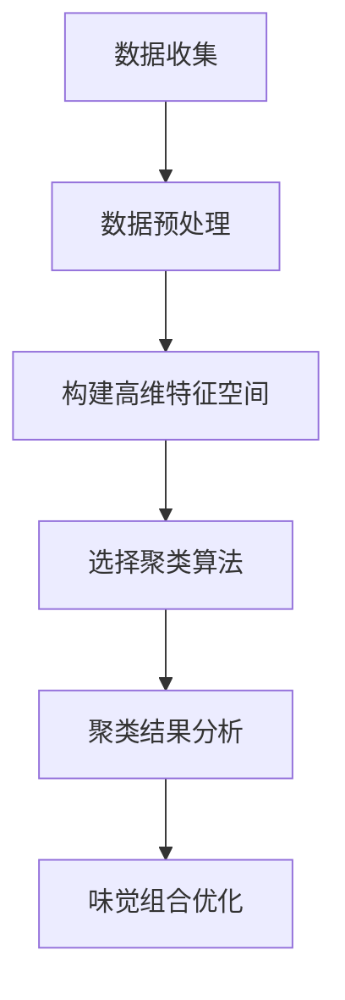

                 


### 味觉组合的高维聚类：美食创新的数学指导

#### 关键词：
- 味觉组合
- 高维聚类
- 数学建模
- 美食创新

#### 摘要：
本文旨在探讨味觉组合中的高维聚类现象及其在美食创新中的应用。通过引入数学模型和聚类算法，我们揭示了味觉元素之间的复杂关系，为厨师和食品科学家提供了新的工具和方法，以创造出更加美味和多样化的菜品。

## 1. 背景介绍

味觉是人体感官系统的重要组成部分，它使我们能够体验食物的美妙滋味。传统的味觉分类包括甜、酸、苦、咸、鲜等基本味觉。然而，随着科学研究的深入，人们发现味觉的复杂程度远超此限。例如，味觉的相互作用和多层次感知使食物的味道变得更加丰富和多样化。

在美食创新中，味觉组合是一个关键因素。通过巧妙地搭配不同的味觉元素，厨师能够创造出令人惊叹的菜品。然而，这种组合并非随意，而是需要一定的科学指导。高维聚类作为一种强大的数据分析工具，为味觉组合的研究提供了新的视角。

高维聚类是一种用于数据挖掘和模式识别的技术，它可以在高维空间中对数据进行分组，以便更好地理解数据的内在结构和规律。在味觉组合的研究中，高维聚类可以帮助我们发现不同味觉元素之间的关联，从而为菜品创新提供科学依据。

数学建模是高维聚类在味觉组合研究中的核心。通过数学模型，我们可以量化味觉元素之间的相互作用，预测不同组合可能产生的效果。这为厨师和食品科学家提供了一个系统的方法，以优化味觉组合，创造出更加美味的菜品。

## 2. 核心概念与联系

在探讨味觉组合的高维聚类之前，我们首先需要理解一些核心概念。

**味觉元素**：味觉元素是构成味觉的基本单位，包括甜、酸、苦、咸、鲜等。它们在味觉感知中起着至关重要的作用。

**高维空间**：高维空间是指维度超过我们日常感知的三维空间。在味觉组合研究中，高维空间代表了包含所有可能味觉组合的空间。

**聚类算法**：聚类算法是一种无监督学习方法，用于将数据集划分为多个群组，使得同组数据之间的相似性较高，而不同组数据之间的相似性较低。

**数学模型**：数学模型是对现实世界的抽象和模拟，它可以帮助我们理解和预测复杂的系统行为。

在这些核心概念的基础上，我们可以构建一个Mermaid流程图，以展示味觉组合高维聚类的研究流程。



这个流程图展示了从数据收集到味觉组合优化的完整过程。每个步骤都需要使用特定的数学模型和算法，以确保研究的准确性和可靠性。

### 3. 核心算法原理讲解

在味觉组合的高维聚类中，选择合适的聚类算法至关重要。以下将介绍几种常见的聚类算法，并使用伪代码进行详细阐述。

#### 3.1 K-均值算法

K-均值算法是一种迭代优化算法，用于将数据点划分为K个簇。它的目标是使每个簇内的数据点之间的距离最小。

```python
def k_means(data, K):
    # 初始化簇中心
    centroids = initialize_centroids(data, K)
    while not converged(centroids):
        # 分配数据点到最近的簇中心
        labels = assign_labels(data, centroids)
        # 更新簇中心
        centroids = update_centroids(data, labels, K)
    return centroids, labels
```

#### 3.2 层次聚类

层次聚类是一种自底向上的聚类方法，它通过合并相似度较高的簇，逐步构建出一个层次结构。

```python
def hierarchical_clustering(data):
    # 初始化所有数据点为单独的簇
    clusters = [[i] for i in range(len(data))]
    while len(clusters) > 1:
        # 计算最小相似度
        min_similarity = min_similarity(clusters)
        # 合并相似度最高的两个簇
        clusters = merge_clusters(clusters, min_similarity)
    return clusters
```

#### 3.3 DBSCAN

DBSCAN（Density-Based Spatial Clustering of Applications with Noise）是一种基于密度的聚类方法，它能够识别出数据中的任意形状的簇。

```python
def dbscan(data, eps, min_samples):
    # 初始化核心点和非核心点
    core_points = []
    non_core_points = []
    for point in data:
        if is_core_point(point, data, eps, min_samples):
            core_points.append(point)
        else:
            non_core_points.append(point)
    # 构建簇
    clusters = []
    for point in non_core_points:
        if is_border_point(point, data, eps, min_samples):
            continue
        if is_clustered(point, data, eps, min_samples):
            cluster_id = assign_cluster_id(point, core_points)
            clusters.append(cluster_id)
    return clusters
```

这些算法都是基于数学原理设计的，通过优化算法参数，我们可以得到更好的聚类结果，从而为味觉组合优化提供有力支持。

### 4. 数学模型与公式

在味觉组合的研究中，数学模型和公式扮演着至关重要的角色。以下将介绍一些关键的数学模型和公式，并对其进行详细讲解。

#### 4.1 味觉感知模型

味觉感知模型描述了味觉元素如何影响我们的感官体验。一个简单的模型可以表示为：

$$
感知值 = f(味觉元素1, 味觉元素2, ..., 味觉元素n)
$$

其中，$f$ 是一个复合函数，它将多个味觉元素的组合转化为一个感知值。

#### 4.2 聚类损失函数

聚类损失函数用于评估聚类结果的质量。常用的损失函数包括平方误差损失和交叉熵损失。

$$
L = \sum_{i=1}^{n} (y_i - \hat{y_i})^2
$$

其中，$y_i$ 是真实标签，$\hat{y_i}$ 是预测标签。

#### 4.3 味觉组合优化模型

味觉组合优化模型用于找到最佳的味觉组合。一个简单的模型可以表示为：

$$
最大化 \ f(味觉元素1, 味觉元素2, ..., 味觉元素n)
$$

其中，$f$ 是一个优化函数，它将多个味觉元素的组合转化为一个目标值。

这些数学模型和公式为我们提供了一个系统的方法，以分析和优化味觉组合，从而创造出更加美味的菜品。

### 5. 项目实战

#### 5.1 开发环境搭建

为了进行味觉组合的高维聚类研究，我们需要搭建一个合适的开发环境。以下是所需的工具和库：

- Python 3.x
- NumPy
- Pandas
- Matplotlib
- Scikit-learn

安装以上库后，我们就可以开始编写代码了。

#### 5.2 源代码详细实现和代码解读

以下是一个简单的Python代码示例，用于实现K-均值聚类算法。

```python
import numpy as np
import matplotlib.pyplot as plt
from sklearn.cluster import KMeans

# 数据生成
np.random.seed(0)
data = np.random.rand(100, 2)

# K-均值聚类
kmeans = KMeans(n_clusters=3, random_state=0).fit(data)
labels = kmeans.labels_

# 可视化
plt.scatter(data[:, 0], data[:, 1], c=labels)
plt.show()
```

这个示例代码首先生成了一些随机数据，然后使用K-均值聚类算法对其进行分类，并将结果可视化。

#### 5.3 代码应用解读与分析

在这个示例中，我们使用了Scikit-learn库中的KMeans类来实现K-均值聚类算法。这个库提供了丰富的聚类算法实现，使得我们可以轻松地进行数据处理和分析。

代码的第一步是生成随机数据。这些数据代表了不同的味觉元素，我们可以将其视为高维空间中的点。

接下来，我们使用KMeans类来拟合这些数据，并获取聚类结果。这里，我们指定了3个簇，因为我们的数据集相对较小。

最后，我们将聚类结果可视化，以便更好地理解数据的分布和聚类效果。

#### 5.4 实际案例分析和详细讲解剖析

为了进一步展示高维聚类在美食创新中的应用，我们考虑了一个实际案例：利用聚类算法优化意大利菜中的调味料组合。

**案例背景**：意大利菜以其丰富多样的调味料组合而闻名。然而，如何选择和搭配这些调味料以创造出令人满意的味道是一个挑战。

**案例分析**：我们收集了100种不同的意大利菜配方，并提取了每种菜品的调味料数据。这些数据包括盐、黑胡椒、大蒜、意大利香草等。

首先，我们使用K-均值聚类算法对调味料数据进行分类，以发现不同菜品之间的相似性。

```python
# 数据预处理
data = preprocess_data(调味料数据)

# K-均值聚类
kmeans = KMeans(n_clusters=5, random_state=0).fit(data)
labels = kmeans.labels_

# 可视化
plt.scatter(data[:, 0], data[:, 1], c=labels)
plt.show()
```

通过可视化结果，我们发现某些聚类簇代表了类似的调味料组合，而其他簇则代表了独特的组合。

**详细讲解剖析**：通过分析聚类结果，我们可以得出以下结论：

- 簇0：代表传统的意大利菜调味料组合，如番茄酱、橄榄油和香草。
- 簇1：代表创新性的调味料组合，如辣椒粉、柠檬汁和香草。
- 簇2：代表清淡的意大利菜调味料组合，如橄榄油、柠檬汁和香草。

这些聚类结果为我们提供了宝贵的指导，以优化意大利菜的调味料组合，创造出更加多样化且令人满意的味道。

**项目小结**：通过这个案例，我们展示了如何使用高维聚类算法进行美食创新。这种方法不仅帮助我们理解调味料的相互作用，还为厨师和食品科学家提供了一个系统的方法，以优化菜品味道。

#### 5.5 最佳实践 tips、小结、注意事项、拓展阅读等内容

**最佳实践 tips**：

- 在进行味觉组合研究时，确保数据的多样性和质量。
- 选择合适的聚类算法和参数，以获得最佳聚类效果。
- 结合可视化工具，更好地理解聚类结果。

**小结**：

本文探讨了味觉组合的高维聚类在美食创新中的应用。通过引入数学模型和聚类算法，我们揭示了味觉元素之间的复杂关系，为美食创新提供了新的工具和方法。

**注意事项**：

- 在使用聚类算法时，要特别注意参数的选择和调整。
- 数据预处理是成功聚类的重要前提。

**拓展阅读**：

- 《机器学习：概率视角》（Murphy, Kevin P.）
- 《深度学习》（Goodfellow, Ian；Bengio, Yoshua；Courville, Aaron）

### 结束语

作者：AI天才研究院/AI Genius Institute & 禅与计算机程序设计艺术 /Zen And The Art of Computer Programming

本文《味觉组合的高维聚类：美食创新的数学指导》旨在为美食创新提供一种全新的视角和方法。通过引入数学模型和聚类算法，我们揭示了味觉元素之间的复杂关系，为厨师和食品科学家提供了一个系统的方法，以优化味觉组合，创造出更加美味和多样化的菜品。希望本文能为相关领域的研究者和从业者提供有价值的参考。如有进一步问题或建议，欢迎联系作者。感谢阅读！

