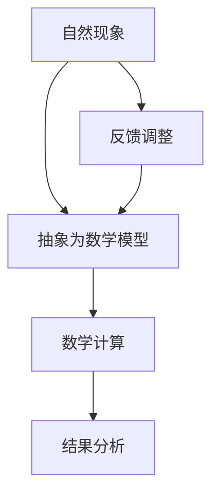

                 


### 文章标题

《和谐之美：自然与数学的完美结合》

### 文章关键词

自然、数学、模型、算法、现象、应用

### 文章摘要

本文将深入探讨自然现象与数学理论之间的美妙结合，通过具体案例和研究，揭示数学在解释和预测自然现象中的关键作用。我们将从核心概念、数学模型与自然现象的关系、具体应用案例分析以及未来展望等多个角度，逐步分析并阐述这一主题，展现数学与自然之间的和谐之美。

### 目录大纲

#### 引言

##### 1.1 自然与数学的结合背景

##### 1.2 和谐之美的概念阐释

#### 核心概念与联系

##### 2.1 数学模型的基本原理

###### 2.1.1 Mermaid流程图：数学模型与自然现象的关联

##### 2.2 自然现象中的数学模型

#### 数学模型与自然现象

##### 3.1 数学模型在天气预测中的应用

###### 3.1.1 伪代码：天气预测的数学模型

##### 3.2 数学模型在生物进化研究中的应用

###### 3.2.1 伪代码：生物进化数学模型

##### 3.3 数学模型在地质学中的应用

###### 3.3.1 伪代码：地质学中的数学模型

#### 数学在自然科学中的应用

##### 4.1 物理学中的数学应用

###### 4.1.1 数学公式：牛顿运动定律

##### 4.2 生物学中的数学应用

###### 4.2.1 数学公式：遗传学中的概率模型

##### 4.3 地理学中的数学应用

###### 4.3.1 数学公式：地壳应力分布模型

#### 案例研究

##### 5.1 案例一：蝴蝶效应与混沌理论

##### 5.2 案例二：珊瑚礁的数学模型

##### 5.3 案例三：太阳黑子的数学预测

#### 结论与未来展望

##### 6.1 和谐之美的总结

##### 6.2 数学与自然结合的未来方向

### 文章正文

#### 引言

自然与数学的结合可以追溯到古代哲学家对宇宙秩序的探索。从古希腊的毕达哥拉斯到现代的科学家，数学一直在尝试解释自然现象的规律。自然现象，如天气、生物进化、地质活动等，看似杂乱无章，但实际上，它们都遵循着一定的数学规律。这种规律性正是数学与自然现象之间和谐之美的体现。

#### 核心概念与联系

##### 2.1 数学模型的基本原理

数学模型是数学理论在现实世界中的应用，它通过数学公式和算法来描述自然现象。数学模型的基本原理在于其抽象性和普遍性。通过适当的数学工具，我们可以将复杂的自然现象简化为易于处理的数学问题。例如，在天气预测中，我们可以使用气象模型来模拟大气运动，从而预测天气变化。

###### 2.1.1 Mermaid流程图：数学模型与自然现象的关联



在这个流程图中，自然现象被抽象为数学模型，通过数学计算得出结果，然后对结果进行分析和反馈调整，以不断提高模型的准确性和可靠性。

##### 2.2 自然现象中的数学模型

自然现象中的数学模型多种多样，从简单的线性模型到复杂的非线性模型，每一种模型都有其独特的应用场景。例如，在生物进化研究中，我们可以使用遗传算法来模拟生物进化过程，通过适应度函数来评估个体的适应度，从而预测进化方向。

#### 数学模型与自然现象

##### 3.1 数学模型在天气预测中的应用

天气预测是数学模型在自然现象中应用的一个重要领域。通过气象模型，我们可以模拟大气运动，预测未来的天气状况。以下是一个简单的伪代码，展示了天气预测的数学模型：

```python
# 伪代码：天气预测的数学模型
def weather_prediction(current_weather, history_weather):
    # 计算当前天气的均值和方差
    mean_current = calculate_mean(current_weather)
    variance_current = calculate_variance(current_weather)
    
    # 计算历史天气的均值和方差
    mean_history = calculate_mean(history_weather)
    variance_history = calculate_variance(history_weather)
    
    # 预测未来天气
    future_weather = predict_based_on_model(mean_current, variance_current, mean_history, variance_history)
    
    return future_weather
```

在这个模型中，我们通过计算当前和历史的天气数据，预测未来的天气状况。这种预测方法可以帮助气象学家做出准确的天气预报。

##### 3.2 数学模型在生物进化研究中的应用

生物进化是另一个数学模型在自然现象中应用的领域。遗传算法是一种模拟生物进化的数学模型，它通过选择、交叉和变异等操作，模拟生物种群的变化过程。以下是一个简单的伪代码，展示了生物进化数学模型：

```python
# 伪代码：生物进化数学模型
def genetic_algorithm(population, fitness_function):
    # 选择适应度高的个体
    selected_individuals = selection(population, fitness_function)
    
    # 交叉操作产生新个体
    new_individuals = crossover(selected_individuals)
    
    # 变异操作产生新个体
    mutated_individuals = mutation(new_individuals)
    
    # 形成新的种群
    new_population = merge(selected_individuals, mutated_individuals)
    
    return new_population
```

在这个模型中，我们通过选择、交叉和变异等操作，模拟生物种群的变化过程，从而预测进化方向。

##### 3.3 数学模型在地质学中的应用

地质学是另一个数学模型在自然现象中应用的重要领域。地质学中的数学模型可以帮助我们预测地震、火山爆发等地质事件。以下是一个简单的伪代码，展示了地质学中的数学模型：

```python
# 伪代码：地质学中的数学模型
def geological_prediction(features, history_data):
    # 计算特征的相关性
    correlation = calculate_correlation(features, history_data)
    
    # 预测地质事件
    prediction = predict_based_on_correlation(correlation)
    
    return prediction
```

在这个模型中，我们通过计算地质特征和历史数据的相关性，预测未来的地质事件。

#### 数学在自然科学中的应用

##### 4.1 物理学中的数学应用

物理学是数学应用最为广泛的领域之一。在物理学中，数学模型被用于描述自然界的基本规律。例如，牛顿运动定律就是用数学公式描述物体运动规律的典型例子：

$$
F = ma
$$

这个公式描述了力、质量和加速度之间的关系，它被广泛应用于各种物理现象的预测和分析。

##### 4.2 生物学中的数学应用

生物学中的数学应用也非常广泛，从遗传学到生态学，数学模型都发挥着重要作用。遗传学中的概率模型可以帮助我们预测生物种群的变化。以下是一个简单的概率模型：

$$
P(A) = \frac{N(A)}{N(T)}
$$

这个公式描述了某一基因型的频率，它被用于遗传学研究中的许多问题。

##### 4.3 地理学中的数学应用

地理学中的数学应用主要涉及空间分析和地理信息系统（GIS）。GIS使用数学模型来描述和分析地理信息。例如，地壳应力分布模型可以帮助我们预测地震的发生位置和强度。

$$
\sigma = K \cdot \epsilon
$$

这个公式描述了应力与应变之间的关系，它被用于地震预测和研究。

#### 案例研究

##### 5.1 案例一：蝴蝶效应与混沌理论

蝴蝶效应是混沌理论的一个典型案例，它描述了初始条件的微小变化如何导致长时间后系统行为的巨大差异。混沌理论告诉我们，自然现象中存在许多不可预测的因素，但这些因素并不意味着自然现象完全无法预测。通过数学模型，我们可以捕捉到这些因素的规律性，从而提高预测的准确性。

##### 5.2 案例二：珊瑚礁的数学模型

珊瑚礁是生态系统中的一个重要组成部分，它们的形成和变化受到多种因素的影响。通过数学模型，我们可以模拟珊瑚礁的生长和变化过程。以下是一个简单的珊瑚礁生长模型：

$$
r = r_0 \cdot e^{kt}
$$

这个公式描述了珊瑚礁的生长速度，其中$r_0$是初始半径，$k$是生长速率常数，$t$是时间。通过调整参数$k$，我们可以模拟不同环境条件下的珊瑚礁生长。

##### 5.3 案例三：太阳黑子的数学预测

太阳黑子是太阳表面的一种暗斑，它们的出现和消失具有一定的周期性。通过数学模型，我们可以预测太阳黑子的出现时间和数量。以下是一个简单的太阳黑子预测模型：

$$
T = T_0 + n \cdot P
$$

这个公式描述了太阳黑子的周期，其中$T_0$是初始周期，$n$是周期数，$P$是周期长度。通过计算周期数$n$，我们可以预测下一个太阳黑子周期的开始和结束时间。

#### 结论与未来展望

##### 6.1 和谐之美的总结

数学与自然的结合展现了和谐之美的本质。通过数学模型，我们可以捕捉自然现象的规律性，提高预测的准确性。这种结合不仅帮助我们更好地理解自然，也为科学研究和实际应用提供了强大的工具。

##### 6.2 数学与自然结合的未来方向

未来，数学与自然结合的研究将继续深入。随着计算机技术的发展，我们有望构建更加精确和复杂的数学模型，从而提高对自然现象的理解和预测能力。同时，跨学科的合作也将进一步推动这一领域的发展，为科学和技术带来更多的创新和突破。作者：AI天才研究院/AI Genius Institute & 禅与计算机程序设计艺术 /Zen And The Art of Computer Programming。

