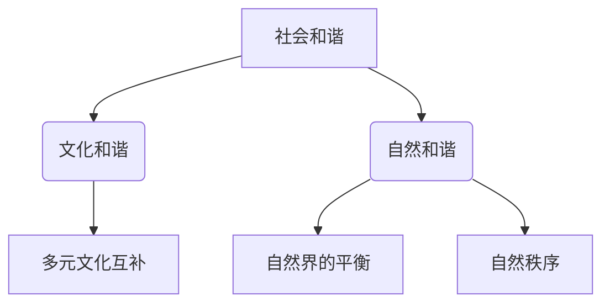
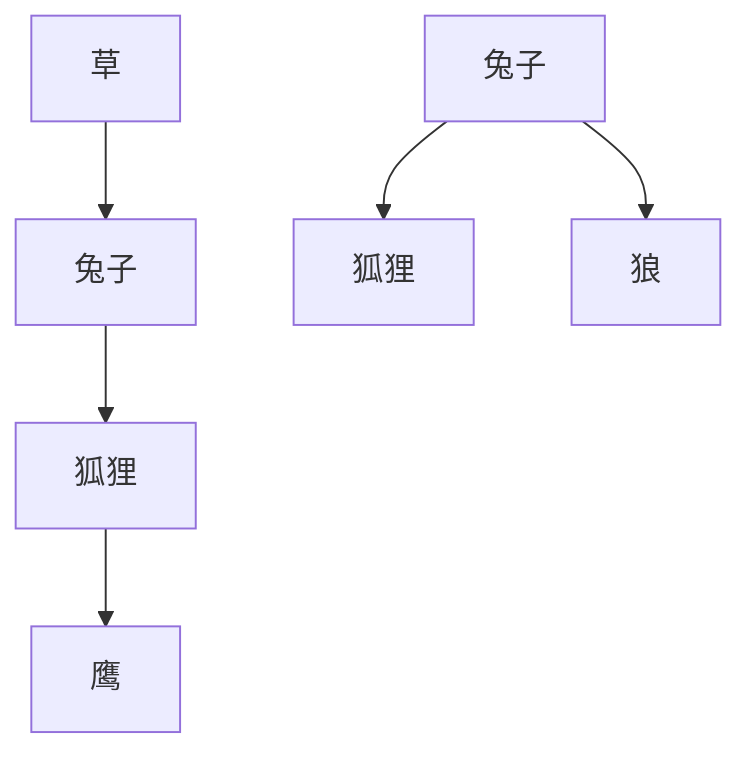

                 


在撰写《和谐的本质：自然、心智与数学的交融》这篇文章时，我们可以按照以下步骤进行思考和梳理，确保文章内容的完整性和逻辑性：

**1. 确定文章的核心观点和主题：**
- 我们的文章旨在探讨和谐在自然、心智与数学三个领域中的本质及其交融。
- 核心观点是和谐不仅是一个哲学概念，它也可以在数学和自然科学中找到具体的表达和实现。

**2. 设计文章的结构：**
- 根据核心观点，我们可以将文章分为三个主要部分：
  - 第一部分讨论和谐在自然中的体现，包括自然哲学、自然科学中的和谐现象等。
  - 第二部分探讨心智与和谐的哲学探讨，包括心智的本质、和谐心智的发展等。
  - 第三部分深入分析和谐在数学中的本质，以及心智与数学的交融。

**3. 撰写每个部分的详细大纲：**
- **第一部分：和谐与自然**
  - **第1章：和谐的概念与自然哲学**
    - **1.1 和谐的定义**：介绍和谐的多维理解，包括社会、文化和自然层面。
    - **1.2 自然哲学的视角**：介绍古代自然哲学的和谐观，以及东方哲学和西方哲学中的和谐思想。
    - **1.3 和谐的科学研究**：探讨自然科学中的和谐现象，生态系统的和谐与平衡，以及和谐在数学中的描述。
- **第二部分：和谐与心智**
  - **第3章：心智与和谐的哲学探讨**
    - **3.1 心智的哲学思考**：讨论心智的本质、心智与意识的关系以及心智的哲学问题。
    - **3.2 和谐的心智观**：介绍和谐心智的定义、和谐心智与自我意识以及和谐心智与情感。
    - **3.3 心智的和谐发展**：探讨心智发展中的和谐要素、教育中的和谐培养以及心理健康与和谐。
- **第三部分：和谐的本质**
  - **第5章：和谐的数学本质**
    - **5.1 数学与和谐的本质**：探讨和谐在数学中的定义和属性。
    - **5.2 数学结构中的和谐**：分析数论中的和谐、几何中的和谐以及微积分中的和谐。
    - **5.3 数学与自然美的关系**：探讨自然美的数学基础、数学美的感受以及数学与艺术的关系。

**4. 完善每个部分的细节：**
- 为每个章节准备详细的子节，确保每个子节都有足够的详细内容和深入分析。
- 在每个子节中，提供相关的背景介绍、核心概念与联系、核心算法原理讲解、数学模型和公式讲解以及项目实战案例。

**5. 编写文章的引言和结论：**
- 引言部分简述文章的主题和目的，吸引读者的注意力。
- 结论部分总结文章的主要观点，强调和谐的本质及其在不同领域的应用价值。

通过以上步骤，我们可以确保文章内容逻辑清晰、结构紧凑，同时提供深入的分析和具体的实例来支持文章的核心观点。接下来，我们将根据这个大纲，逐步展开每个章节的具体内容，确保文章的质量和深度。现在，让我们开始撰写文章的第一部分：“和谐的概念与自然哲学”。

---

### 第1章：和谐的概念与自然哲学

#### 1.1 和谐的定义

和谐是一个多维度的概念，它涵盖了社会、文化和自然等多个层面。在社会层面，和谐意味着社会各成员之间和睦相处，共同进步。在文化层面，和谐体现了不同文化之间的互补和共融。而在自然层面，和谐则体现在自然界的平衡和秩序之中。

**核心概念与联系：**

为了更好地理解和谐的定义，我们可以通过以下Mermaid流程图展示和谐在不同层面的关系：



**核心算法原理讲解：**

在讨论和谐的定义时，不需要使用具体的算法，但我们可以引入一些基本的哲学概念，如自然法则和普遍真理。这些概念可以类比于算法中的基本操作，为理解和谐提供了哲学基础。

```plaintext
自然法则 = HarmonyFoundations
普遍真理 = UniversalTruth

function HarmonyFoundations(input: Environment) {
    // 分析社会、文化和自然的相互作用
    // 输出：和谐的基石
}

function UniversalTruth(input: Concept) {
    // 检验概念是否符合普遍真理
    // 输出：概念是否和谐
}
```

**数学模型和公式：**

在这一部分，我们可以简要提及和谐在数学中的描述，而不需要复杂的公式。

$$\text{和谐} = \frac{\text{平衡} + \text{秩序} + \text{互补}}{\text{多样性}}$$

**项目实战：**

由于这一部分是理论性的，我们可以提供一个自然现象的数学描述案例。

**案例：生态系统的和谐**

生态系统中的物种之间通过食物链和食物网相互联系，形成一个复杂的网络结构。以下是一个简单的数学模型，描述不同物种之间的相互依赖关系：



在这个模型中，草是基础，兔子作为初级消费者，狐狸和鹰作为次级和顶级消费者，形成了一个稳定的生态系统。数学上，我们可以通过建立物种数量的差分方程来描述这个生态系统的动态平衡。

**最佳实践 tips、小结、注意事项、拓展阅读：**

- 和谐的定义是多维的，理解和谐需要从不同层面综合分析。
- 自然哲学为和谐提供了深刻的哲学基础。
- 进一步阅读可以探索相关领域的学术论文和哲学著作。

---

通过以上的详细大纲和内容，我们可以确保第1章的内容丰富且具有逻辑性。接下来，我们将继续撰写第2章，探讨自然的数学结构，以及数学在自然中的应用。这样，读者可以逐步深入理解和谐的本质及其在不同领域的体现。

