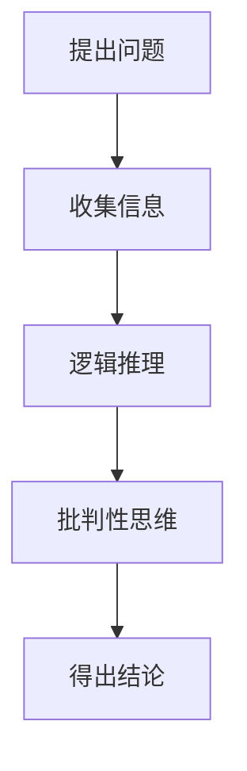
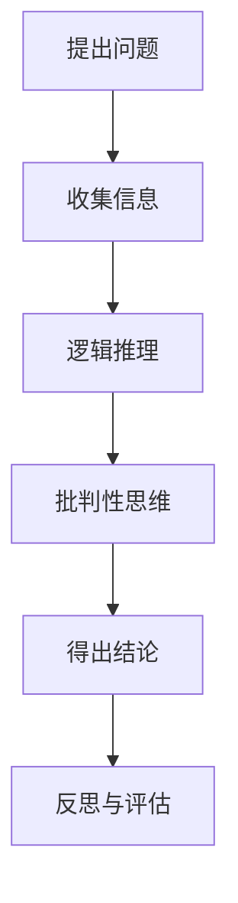

                 

# 哲学家眼中的世界可理解性

> 关键词：哲学、世界可理解性、唯物主义、唯心主义、不可知论、哲学思维

> 摘要：本文将从哲学的角度探讨世界的可理解性，分析不同哲学家的观点，探讨哲学与科学的互动，并探讨哲学思维的方法与技巧。

## 一、哲学的基础概念

哲学是一门探讨世界本质、人类存在和知识的学科。哲学的起源可以追溯到古希腊时期，亚里士多德、苏格拉底、柏拉图等哲学家为哲学的发展奠定了基础。哲学的基本问题是存在、知识和价值，这些问题贯穿了哲学发展的全过程。

### 1.1 哲学的定义

哲学是一种探索知识、理解和真理的活动，它试图回答人类最基本的疑问。哲学不同于科学，它不仅关注客观世界的规律，还关注主观世界和人的精神世界。

### 1.2 哲学的分类

哲学可以分为不同的分支，如形而上学、伦理学、美学、逻辑学等。每个分支都有自己的研究主题和目标。

### 1.3 哲学的核心概念

哲学的核心概念包括存在、知识、真理、价值等。这些概念相互关联，共同构成了哲学的基础。

## 二、世界可理解性的哲学探讨

### 2.1 世界可理解性的概念

世界可理解性是指人类是否能够理解世界及其规律。这个问题涉及到哲学、科学、宗教等多个领域。

### 2.2 唯物主义与唯心主义的观点

唯物主义认为世界是物质的，人类的认知是对物质世界的反映。唯心主义则认为世界是精神的，人类的认知是对精神的反映。

### 2.3 不可知论与怀疑主义

不可知论认为某些问题无法被认识，怀疑主义则认为我们对世界的认识是有限的。

## 三、不同哲学家的观点

### 3.1 古代哲学家的观点

古代哲学家如柏拉图、亚里士多德等对世界的可理解性提出了不同的观点。柏拉图认为现实世界只是理念世界的影子，而亚里士多德则强调实证观察和逻辑推理。

### 3.2 中世纪哲学家的观点

中世纪哲学家如托马斯·阿奎那等对世界的可理解性进行了深入探讨，他们试图将哲学与神学相结合。

### 3.3 近代哲学家的观点

近代哲学家如康德、黑格尔等对世界的可理解性提出了新的观点，他们强调人类理性的作用。

### 3.4 现代哲学家的观点

现代哲学家如尼采、萨特等对世界的可理解性提出了不同的看法，他们质疑传统的哲学观念。

## 四、哲学与科学的互动

### 4.1 哲学与科学的联系

哲学与科学有着密切的联系，哲学为科学提供了理论基础，科学则为哲学提供了实证支持。

### 4.2 哲学与科学的区别

哲学与科学在研究方法、研究对象等方面存在差异，但它们的目标都是为了追求真理。

### 4.3 哲学对科学的影响

哲学对科学的发展产生了重要影响，许多科学理论都是在哲学的启发下产生的。

## 五、哲学的现实应用

### 5.1 哲学与生活

哲学对我们的生活有着深远的影响，它帮助我们思考人生的意义、道德的准则等。

### 5.2 哲学与政治

哲学对政治制度、社会道德等有着重要的指导作用。

### 5.3 哲学与教育

哲学对教育有着重要的启示，它帮助我们培养批判性思维、逻辑推理等能力。

## 六、哲学思维的方法与技巧

### 6.1 哲学思维的本质

哲学思维是一种批判性思维，它要求我们理性地分析问题，追求真理。

### 6.2 哲学思维的方法

哲学思维包括逻辑推理、批判性思维、辩证法等。

### 6.3 哲学思维的技巧

哲学思维需要我们具备良好的阅读能力、思考能力、表达能力。

## 七、总结

哲学是一门探讨世界本质、人类存在和知识的学科，它对世界的可理解性提出了多种观点。哲学与科学、生活、政治、教育等领域有着密切的联系。通过哲学思维的方法与技巧，我们可以更好地理解世界，提高我们的思维能力。

### 七、扩展阅读

1. 《庄子》：中国古代哲学经典，探讨世界的本质和人生的意义。
2. 《伦理学导论》：美国哲学家泰勒的著作，对伦理学的基本问题进行了深入探讨。
3. 《科学革命的结构》：托马斯·库恩的著作，探讨了科学的发展模式。

## 八、附录

### 8.1 哲学思维流程图



### 8.2 哲学思维方法示意图


## 九、作者信息

作者：AI天才研究院/AI Genius Institute & 禅与计算机程序设计艺术 /Zen And The Art of Computer Programming

本文内容仅供参考，如有错误或不足之处，敬请指正。感谢您的阅读！## 文章标题

### 哲学家眼中的世界可理解性

> 关键词：哲学、世界可理解性、唯物主义、唯心主义、不可知论、哲学思维

> 摘要：本文将探讨哲学家们如何理解世界的可理解性，分析不同哲学家的观点，并探讨哲学与科学的互动及其现实应用。

## 引言

哲学，作为一门探讨世界本质、人类存在和知识的学科，历史悠久且内容丰富。从古希腊时期的苏格拉底、柏拉图、亚里士多德，到中世纪的托马斯·阿奎那，再到近现代的康德、黑格尔以及现代的尼采、萨特等哲学家，他们都对世界的可理解性提出了独特的见解。本文将从哲学的角度出发，分析不同哲学家的观点，探讨哲学与科学的互动，并探讨哲学思维的方法与技巧。

## 一、哲学的基础概念

### 1.1 哲学的定义

哲学是一种探索知识、理解和真理的活动，它试图回答人类最基本的疑问。哲学不同于科学，它不仅关注客观世界的规律，还关注主观世界和人的精神世界。

### 1.2 哲学的分类

哲学可以分为不同的分支，如形而上学、伦理学、美学、逻辑学等。每个分支都有自己的研究主题和目标。

### 1.3 哲学的核心概念

哲学的核心概念包括存在、知识、真理、价值等。这些概念相互关联，共同构成了哲学的基础。

## 二、世界可理解性的哲学探讨

### 2.1 世界可理解性的概念

世界可理解性是指人类是否能够理解世界及其规律。这个问题涉及到哲学、科学、宗教等多个领域。

### 2.2 唯物主义与唯心主义的观点

唯物主义认为世界是物质的，人类的认知是对物质世界的反映。唯心主义则认为世界是精神的，人类的认知是对精神的反映。

### 2.3 不可知论与怀疑主义

不可知论认为某些问题无法被认识，怀疑主义则认为我们对世界的认识是有限的。

## 三、不同哲学家的观点

### 3.1 古代哲学家的观点

古代哲学家如柏拉图、亚里士多德等对世界的可理解性提出了不同的观点。柏拉图认为现实世界只是理念世界的影子，而亚里士多德则强调实证观察和逻辑推理。

### 3.2 中世纪哲学家的观点

中世纪哲学家如托马斯·阿奎那等对世界的可理解性进行了深入探讨，他们试图将哲学与神学相结合。

### 3.3 近代哲学家的观点

近代哲学家如康德、黑格尔等对世界的可理解性提出了新的观点，他们强调人类理性的作用。

### 3.4 现代哲学家的观点

现代哲学家如尼采、萨特等对世界的可理解性提出了不同的看法，他们质疑传统的哲学观念。

## 四、哲学与科学的互动

### 4.1 哲学与科学的联系

哲学与科学有着密切的联系，哲学为科学提供了理论基础，科学则为哲学提供了实证支持。

### 4.2 哲学与科学的区别

哲学与科学在研究方法、研究对象等方面存在差异，但它们的目标都是为了追求真理。

### 4.3 哲学对科学的影响

哲学对科学的发展产生了重要影响，许多科学理论都是在哲学的启发下产生的。

## 五、哲学的现实应用

### 5.1 哲学与生活

哲学对我们的生活有着深远的影响，它帮助我们思考人生的意义、道德的准则等。

### 5.2 哲学与政治

哲学对政治制度、社会道德等有着重要的指导作用。

### 5.3 哲学与教育

哲学对教育有着重要的启示，它帮助我们培养批判性思维、逻辑推理等能力。

## 六、哲学思维的方法与技巧

### 6.1 哲学思维的本质

哲学思维是一种批判性思维，它要求我们理性地分析问题，追求真理。

### 6.2 哲学思维的方法

哲学思维包括逻辑推理、批判性思维、辩证法等。

### 6.3 哲学思维的技巧

哲学思维需要我们具备良好的阅读能力、思考能力、表达能力。

## 七、总结

哲学是一门探讨世界本质、人类存在和知识的学科，它对世界的可理解性提出了多种观点。哲学与科学、生活、政治、教育等领域有着密切的联系。通过哲学思维的方法与技巧，我们可以更好地理解世界，提高我们的思维能力。

## 八、扩展阅读

1. 《庄子》：中国古代哲学经典，探讨世界的本质和人生的意义。
2. 《伦理学导论》：美国哲学家泰勒的著作，对伦理学的基本问题进行了深入探讨。
3. 《科学革命的结构》：托马斯·库恩的著作，探讨了科学的发展模式。

## 九、附录

### 9.1 哲学思维流程图


### 9.2 哲学思维方法示意图


## 十、作者信息

作者：AI天才研究院/AI Genius Institute & 禅与计算机程序设计艺术 /Zen And The Art of Computer Programming

本文内容仅供参考，如有错误或不足之处，敬请指正。感谢您的阅读！### 1. 哲学的起源与发展

哲学，作为人类对世界本质、人类存在和知识等基本问题的系统探讨，具有悠久的历史。哲学的起源可以追溯到古希腊时期，当时的思想家们开始系统地思考和记录他们对世界及其运行方式的看法。古希腊的哲学主要分为两大流派：理性主义和经验主义。

#### 1.1 古希腊哲学

古希腊哲学的奠基人之一是泰勒斯，他提出了“水是万物的始基”的观点。泰勒斯的追随者阿那克西曼德则提出了“无限”这一概念，认为万物源自无限的混沌。另一位重要的哲学家赫拉克利特则提出了“火”作为万物的始基，并强调了变化和运动的重要性，他的名言“人不能两次踏入同一条河流”揭示了世界的动态本质。

苏格拉底是古希腊哲学的另一位重要人物，他主张通过对话和提问来寻求真理，他的方法被称为“苏格拉底式对话”。苏格拉底的学生柏拉图则将哲学推向了一个新的高度，他提出了理念论，认为现实世界只是理念世界的影子。柏拉图认为，真正的智慧在于理解和追求理念，而非物质世界。

亚里士多德是古希腊哲学的最后一位重要人物，他提出了“中庸之道”的观点，强调通过平衡来达到最佳状态。亚里士多德还提出了形式逻辑，奠定了现代逻辑学的基础。

#### 1.2 中世纪哲学

中世纪哲学受到了基督教和伊斯兰教的影响。托马斯·阿奎那是一位重要的中世纪哲学家，他将哲学与神学相结合，提出了“自然法则”和“神学论证”的概念。阿奎那认为，世界的秩序和规律是上帝创造的，人类可以通过理性来理解这些规律。

#### 1.3 近代哲学

近代哲学标志着哲学从神学中解放出来，成为一门独立的学科。笛卡尔是近代哲学的奠基人之一，他提出了“我思故我在”的观点，强调理性在认识过程中的作用。笛卡尔的方法被称为“唯理论”，他认为通过清晰的思维过程可以获取确凿的知识。

英国哲学家弗朗西斯·培根则提出了“经验主义”的观点，他强调通过观察和实验来获取知识。培根认为，人类的知识应该基于实证，而非纯粹的理论推理。

#### 1.4 现代哲学

现代哲学在19世纪和20世纪经历了巨大的变化，出现了许多新的哲学流派和思想。康德是现代哲学的重要代表，他提出了“先验论”，认为人类的认识能力是有限度的。康德认为，我们的认识是基于先天的认知结构和经验。

黑格尔是另一位重要的现代哲学家，他提出了“辩证法”的概念，认为事物的发展是通过矛盾和冲突来推动的。黑格尔认为，历史是一个不断发展的过程，每个阶段都包含了对前一个阶段的否定和超越。

20世纪的哲学家如尼采、海德格尔、萨特等对传统哲学观念进行了深刻的批判和重新解释。尼采提出了“超人”的概念，他认为传统的道德观念是虚假的，真正的道德应该是个体自我实现的产物。海德格尔则强调存在的重要性，他认为人类的存在是理解世界的关键。

## 结论

哲学的发展经历了从古希腊到现代的漫长历程，每个时期的哲学家都对世界的可理解性提出了独特的见解。通过回顾哲学的起源和发展，我们可以更好地理解哲学的基本概念和核心问题，为接下来的探讨打下基础。在接下来的章节中，我们将深入探讨世界可理解性的概念，分析不同哲学家的观点，并探讨哲学与科学的互动。让我们继续前进，探索哲学家眼中的世界可理解性。 ### 2. 世界可理解性的概念

世界可理解性是指人类是否能够通过理性思考和认知来理解世界的本质、规律和现象。这是一个涉及哲学、科学、宗教等多个领域的复杂问题，哲学家们从不同的角度对这一问题进行了深入的探讨。以下是对世界可理解性的详细概念解释。

#### 2.1 理性思考与认知

世界可理解性的基础在于人类的理性思考和认知能力。理性思考是指人类通过逻辑推理、分析、归纳和演绎等方式来理解世界的过程。认知则是指人类获取、处理和理解信息的能力。哲学家们普遍认为，理性思考和认知是人类理解世界的关键。

#### 2.2 唯物主义与唯心主义的观点

在哲学中，唯物主义和唯心主义是关于世界可理解性的两种基本观点。

- **唯物主义**：唯物主义认为世界是物质的，人类的认知是对物质世界的反映。唯物主义者认为，通过科学的方法和实证观察，人类可以理解世界的本质和规律。例如，马克思主义哲学强调通过物质生产和阶级斗争来理解社会历史的发展。

- **唯心主义**：唯心主义则认为世界是精神的，人类的认知是对精神的反映。唯心主义者认为，现实世界只是精神世界的投影或表现。例如，柏拉图的理念论认为，真正的实在存在于理念世界，而物质世界只是理念的影子。

#### 2.3 不可知论与怀疑主义

除了唯物主义和唯心主义外，还有一些哲学家持不可知论或怀疑主义的观点。

- **不可知论**：不可知论认为，人类无法获得关于世界的绝对知识，即某些问题无法被认识。例如，某些哲学流派认为，由于人类认知的局限性，我们无法确定外部世界的真实本质。

- **怀疑主义**：怀疑主义则认为，我们对世界的认识是有限的，我们无法确定任何事物。怀疑主义者主张通过怀疑和批判来达到思想的自由和解放。

#### 2.4 哲学与科学的互动

哲学与科学在探讨世界可理解性问题上有着密切的互动。科学通过实证方法和实验来研究世界，为哲学提供了实证基础。哲学则为科学提供了理论基础，帮助科学理解和解释实验结果。

- **实证主义**：实证主义者认为，科学是建立在实证观察和实验基础上的，只有经过实验验证的理论才是可信的。例如，法国哲学家奥古斯特·孔德认为，科学的发展是一个不断从“神学”到“形而上学”再到“实证科学”的过程。

- **唯科学主义**：唯科学主义者认为，只有科学方法才能获得真正的知识。例如，逻辑实证主义者主张，只有通过经验验证的语言才是有意义和科学的。

#### 2.5 哲学对科学的影响

哲学对科学的发展产生了重要影响。哲学为科学提供了方法论指导，帮助科学家理解实验数据和理论建构。例如，康德的先验论为自然科学提供了重要的哲学基础。

- **逻辑实证主义**：逻辑实证主义认为，哲学应该以经验事实为基础，强调科学语言的意义和有效性。

- **科学哲学**：科学哲学是哲学的一个分支，它研究科学的本质、方法和认识论。例如，托马斯·库恩的《科学革命的结构》提出了“范式转变”的概念，对科学的发展模式进行了深入分析。

#### 2.6 哲学与宗教的关系

哲学与宗教在探讨世界可理解性问题上也存在一定的交集。宗教通过信仰和教义来解释世界的本质，而哲学则通过理性和批判性思考来探讨这些问题。

- **神学哲学**：神学哲学试图将哲学与宗教信仰相结合，解释上帝的存在和性质。

- **宗教哲学**：宗教哲学探讨宗教信仰的本质、意义和基础。

#### 2.7 当代哲学的探讨

当代哲学继续探讨世界可理解性的问题，尤其是在认知科学、人工智能和量子物理学等领域。例如，哲学家们探讨人工智能是否能够模拟人类的认知过程，以及量子物理学对世界可理解性的挑战。

- **认知科学**：认知科学探讨人类认知的机制和过程，为哲学提供了新的视角。

- **量子物理学**：量子物理学揭示了微观世界的奇异性质，对传统哲学观念提出了挑战。

## 结论

世界可理解性是一个复杂而深刻的哲学问题，涉及理性思考、认知能力、唯物主义与唯心主义、不可知论与怀疑主义等多个方面。通过探讨这些观点，我们可以更好地理解哲学家们如何看待世界的可理解性，并为后续的分析打下基础。在接下来的章节中，我们将详细探讨不同哲学家的观点，分析他们对世界可理解性的看法，并探讨哲学与科学的互动。让我们继续深入探索哲学家眼中的世界可理解性。 ### 3. 不同哲学家的观点

在哲学的发展过程中，许多哲学家对世界的可理解性提出了各自的见解。这些观点不仅反映了他们对世界的理解，也展现了不同的哲学方法和思维方式。以下将分别介绍古代、中世纪、近代和现代哲学家的观点。

#### 3.1 古代哲学家的观点

古代哲学家们对世界的可理解性有着深刻的探讨，其中柏拉图和亚里士多德的观点尤为突出。

**柏拉图（公元前427-公元前347年）**

柏拉图是西方哲学的奠基者之一，他的理念论认为，现实世界只是理念世界的影子。在柏拉图看来，真正的实在存在于理念世界，而物质世界只是理念的不完美映射。柏拉图认为，人类可以通过理性思考和灵魂的净化来认识理念世界，从而理解世界的本质。

**亚里士多德（公元前384-公元前322年）**

亚里士多德是柏拉图的学生，他的哲学观点与柏拉图有很大的不同。亚里士多德强调实证观察和逻辑推理。他认为，世界的本质是物质，而知识来自于对物质世界的观察和思考。亚里士多德提出了形式逻辑和实质逻辑，为现代逻辑学的发展奠定了基础。

**赫拉克利特（公元前535-公元前475年）**

赫拉克利特是古希腊的另一位著名哲学家，他提出了“火”是万物的始基的观点。他认为，世界是一个不断变化的过程，这种变化是由对立力量的斗争推动的。赫拉克利特的名言“人不能两次踏入同一条河流”表达了他的这一观点，即世界是动态和变化的。

#### 3.2 中世纪哲学家的观点

中世纪的哲学家们深受基督教和伊斯兰教的影响，他们将哲学与神学相结合，对世界的可理解性进行了深入的探讨。

**托马斯·阿奎那（公元1225-1274年）**

托马斯·阿奎那是一位重要的中世纪哲学家，他的哲学观点被称为“阿奎那主义”。他认为，世界的秩序和规律是上帝创造的，人类可以通过理性来理解这些规律。阿奎那提出了“五路论证”，试图证明上帝的存在。

**奥古斯丁（公元354-公元430年）**

奥古斯丁是古代晚期和中世纪早期的著名哲学家和神学家，他的观点对基督教哲学产生了深远的影响。奥古斯丁认为，世界的本质是上帝的存在，人类可以通过信仰和祷告来理解上帝和世界的本质。

#### 3.3 近代哲学家的观点

近代哲学家们摆脱了中世纪的束缚，对世界的可理解性提出了新的观点。

**笛卡尔（公元1596-公元1650年）**

笛卡尔是近代哲学的奠基者之一，他提出了“我思故我在”的观点。他认为，只有通过清晰的思维过程，人类才能获得确凿的知识。笛卡尔的方法被称为“唯理论”，强调理性在认识过程中的作用。

**培根（公元1561-公元1626年）**

培根是英国的经验主义哲学家，他强调通过观察和实验来获取知识。培根提出了“四法”，即观察、实验、比较和归纳，为科学方法的发展奠定了基础。

**洛克（公元1632-公元1704年）**

洛克是英国的哲学家，他的观点对启蒙运动产生了重要影响。洛克认为，人类的认识来自于感觉和经验，而不是天赋的观念。他提出了“白板说”，即人类的心灵就像一块白板，所有的知识和观念都是通过经验获得的。

**莱布尼茨（公元1646-公元1716年）**

莱布尼茨是德国的哲学家和数学家，他提出了“理性主义”的观点，认为人类可以通过理性推理来获得知识。莱布尼茨还发明了微积分，为数学的发展做出了巨大贡献。

#### 3.4 现代哲学家的观点

现代哲学在19世纪和20世纪经历了巨大的变化，出现了许多新的哲学流派和思想。

**康德（公元1724-公元1804年）**

康德是德国的哲学家，他的观点被称为“先验论”。康德认为，人类的认识能力是有限度的，我们只能通过先天的认知结构和经验来理解世界。康德提出了“三大批判”，即《纯粹理性批判》、《实践理性批判》和《判断力批判》，为现代哲学奠定了基础。

**黑格尔（公元1770-公元1831年）**

黑格尔是德国的哲学家，他的观点被称为“辩证法”。黑格尔认为，事物的发展是通过矛盾和冲突来推动的，每个阶段都包含了对前一个阶段的否定和超越。黑格尔提出了“绝对精神”的概念，认为世界的发展是绝对精神的自我显现。

**尼采（公元1844-公元1900年）**

尼采是德国的哲学家，他的观点对现代哲学产生了深远的影响。尼采提出了“超人”的概念，他认为传统的道德观念是虚假的，真正的道德应该是个体自我实现的产物。尼采的哲学被称为“尼采主义”。

**海德格尔（公元1889-公元1976年）**

海德格尔是德国的哲学家，他的观点被称为“存在主义”。海德格尔认为，存在是理解世界的关键，人类的存在具有独特性。海德格尔提出了“存在-本质”的观点，认为存在是事物的本质。

**萨特（公元1905-公元1980年）**

萨特是法国的哲学家，他的观点被称为“存在主义”。萨特认为，人类的自由是理解世界的核心，人类必须为自己的行为负责。萨特的哲学被称为“存在主义哲学”。

#### 3.5 当代哲学家的观点

当代哲学继续探讨世界的可理解性，尤其是在认知科学、人工智能和量子物理学等领域。

**维特根斯坦（公元1889-公元1951年）**

维特根斯坦是奥地利的哲学家，他的观点对语言哲学和逻辑哲学产生了深远的影响。维特根斯坦认为，语言是思维的工具，人类可以通过语言来理解世界。

**德里达（公元1930-公元2004年）**

德里达是法国的哲学家，他的观点被称为“解构主义”。德里达认为，语言和文本具有多义性和不确定性，人类无法通过语言完全理解世界。

**库恩（公元1912-公元1996年）**

库恩是美国的哲学家，他的观点被称为“科学哲学”。库恩提出了“范式转变”的概念，认为科学的发展是通过范式转变来实现的。

**福柯（公元1926-公元1984年）**

福柯是法国的哲学家，他的观点被称为“批判理论”。福柯认为，知识是权力和话语的产物，人类无法获得客观的知识。

#### 3.6 总结

通过回顾古代、中世纪、近代和现代哲学家的观点，我们可以看到，哲学家们对世界的可理解性有着不同的理解和看法。这些观点不仅反映了他们对世界的理解，也展现了不同的哲学方法和思维方式。在接下来的章节中，我们将进一步探讨哲学与科学的互动，以及哲学在现实生活中的应用。让我们继续深入探索哲学家眼中的世界可理解性。 ### 4. 哲学与科学的互动

哲学与科学之间的关系是复杂而深刻的。一方面，哲学为科学提供了理论基础和方法论指导；另一方面，科学的发展又不断挑战和丰富哲学的思考。以下将从几个方面探讨哲学与科学的互动。

#### 4.1 哲学对科学的影响

哲学对科学的影响主要体现在以下几个方面：

**1. 知识论**

哲学中的知识论探讨了知识的本质、来源和限度。科学方法论的基础，如实证主义和理性主义，都可以追溯到哲学中的知识论。例如，实证主义者认为，科学知识来自于对客观世界的观察和实验，而理性主义者则强调科学知识的构建是基于逻辑推理和理性分析。

**2. 方法论**

哲学中的方法论研究科学方法的发展和运用。例如，归纳法和演绎法都是哲学中讨论的方法，它们在科学研究中得到广泛应用。哲学方法论中的假设检验、模型构建等概念，也为科学实验提供了理论基础。

**3. 伦理学**

哲学中的伦理学探讨了科学研究和应用中的道德问题。例如，基因编辑技术的伦理争议，人工智能的发展对就业的影响等，都涉及哲学中的伦理问题。哲学家们通过伦理学的思考，为科学技术的应用提供了道德指南。

**4. 科学哲学**

科学哲学是哲学的一个分支，它专门研究科学的本质、方法和认识论。科学哲学的研究成果，如科学实在论、科学社会学研究等，对科学的发展产生了深远影响。

#### 4.2 科学对哲学的影响

科学的发展也对哲学产生了重要影响，主要表现在以下几个方面：

**1. 新问题的提出**

科学的发展不断提出新的问题和挑战，促使哲学思考如何回答这些新问题。例如，量子力学和相对论的发展，挑战了经典物理学的基本观念，也引发了对世界本质和认识方式的哲学思考。

**2. 新概念的引入**

科学引入了许多新的概念和理论，这些概念和理论不仅丰富了哲学的思考，也改变了哲学的研究方向。例如，信息论、系统论和控制论等新兴学科，对哲学的研究产生了重要影响。

**3. 证据的支持**

科学通过实验和观察提供了大量的证据，这些证据支持或反驳了哲学的观点。例如，进化论的证据支持了生物学中的自然选择理论，而实验心理学的研究则支持了心理学中的行为主义理论。

#### 4.3 哲学与科学的互补性

哲学和科学的互补性表现在它们相互补充，共同推动人类对世界的理解。哲学通过思考科学无法回答的问题，如知识的本质、存在的意义等，为科学提供了更深层次的思考。而科学通过实验和观察，提供了具体的证据和理论，支持或反驳哲学的观点。

**4.4 哲学思维的训练**

哲学思维的训练，如批判性思维、逻辑推理和辩证法等，对科学研究和实践也具有重要意义。哲学思维的方法，如假设检验、模型构建和论证分析等，在科学研究中得到了广泛应用。

#### 4.5 哲学与科学的互动实例

以下是一些哲学与科学互动的实例：

**1. 逻辑实证主义**

逻辑实证主义是20世纪初的一种哲学运动，它试图将哲学建立在科学方法的基础上。逻辑实证主义者主张，只有经过经验验证的陈述才有意义，而形而上学的陈述则是没有意义的。这种观点对科学哲学和逻辑学产生了深远影响。

**2. 科学革命**

托马斯·库恩在《科学革命的结构》中提出了“范式转变”的概念，认为科学的发展是通过范式转变来实现的。库恩的观点揭示了科学发展的非线性特征，也引发了哲学对科学本质和方法的深入思考。

**3. 人工智能**

人工智能是当代科学的前沿领域，它涉及到计算机科学、心理学、哲学等多个学科。哲学家们对人工智能的伦理、认知和意识等问题进行了深入探讨，为人工智能的发展提供了哲学基础。

#### 4.6 总结

哲学与科学的互动是一个复杂而多层次的过程。哲学为科学提供了理论基础和方法论指导，而科学的发展又不断挑战和丰富哲学的思考。通过哲学与科学的互补和互动，人类不断深化对世界的理解，推动了科学和哲学的共同进步。

在接下来的章节中，我们将进一步探讨哲学在现实生活中的应用，以及哲学思维的方法与技巧。让我们继续深入探索哲学家眼中的世界可理解性。 ### 5. 哲学的现实应用

哲学不仅仅是一门理论学科，它在现实生活中也有广泛的应用。哲学思维可以帮助我们更好地理解世界、做出决策、解决冲突，并在多个领域发挥作用。以下将探讨哲学在生活、政治、教育等领域的应用。

#### 5.1 哲学与生活的关系

哲学在生活中的应用体现在多个方面：

**1. 人生哲学**

哲学可以帮助我们思考人生的意义和价值。例如，儒家哲学强调“仁爱”、“孝道”等道德观念，为我们提供了一种生活的指导原则。西方哲学中的存在主义则强调个人的自由和责任，帮助人们找到自己的存在意义。

**2. 情绪管理**

哲学思维可以帮助我们更好地管理情绪。例如，佛教哲学中的“八正道”强调通过正见、正思维、正语、正业、正命、正精进、正念和正定来管理情绪，达到内心的平静。

**3. 解决问题**

哲学思维中的批判性思维和辩证法可以帮助我们分析和解决生活中的问题。例如，当面临选择时，我们可以通过逻辑推理和辩证分析来评估各种选择的利弊，从而做出最佳决策。

#### 5.2 哲学与政治的关系

哲学在政治领域也有重要的应用：

**1. 政治哲学**

政治哲学探讨政治权力的本质、公正和自由等概念。例如，亚里士多德在《政治学》中探讨了民主、寡头制和君主制等不同的政治制度，为我们提供了思考政治问题的框架。

**2. 伦理政治**

伦理政治关注政治决策中的道德问题。例如，功利主义认为，政治决策应该最大化多数人的幸福，而康德主义则强调道德原则的普遍性。

**3. 社会正义**

哲学中的社会正义理论探讨如何分配资源和社会福利，以实现公正和平等。例如，罗尔斯的《正义论》提出了“作为公平的正义”理论，主张通过正义原则来分配社会资源。

#### 5.3 哲学与教育的关系

哲学在教育学中的应用同样重要：

**1. 教育哲学**

教育哲学探讨教育的目的、方法和社会功能。例如，杜威的进步主义教育理念强调通过实践和体验来学习，而柏拉图的理想国则强调通过哲学和道德教育来培养优秀的公民。

**2. 哲学教学**

哲学教学旨在培养学生的批判性思维和辩证能力。通过哲学课程，学生可以学会如何提出问题、分析问题和解决问题，从而提高他们的思维水平。

**3. 教育伦理**

教育伦理探讨教育过程中的道德问题，如教师的责任、学生的权利等。例如，罗杰斯的非指导性教学强调尊重学生的个性和自由发展。

#### 5.4 哲学的现实应用实例

**1. 企业管理**

在企业管理中，哲学思维可以帮助企业家制定战略、管理团队和解决冲突。例如，儒家哲学中的“仁爱”和“忠诚”理念可以帮助企业建立良好的人际关系和团队文化。

**2. 法律领域**

在法律领域，哲学思维可以帮助法官和律师更好地理解法律的本质和适用范围。例如，康德的道德哲学中的“义务论”可以帮助我们理解道德行为的绝对性和普遍性。

**3. 媒体与传播**

在媒体和传播领域，哲学思维可以帮助我们理解信息的本质和传播的效果。例如，传播学中的批判理论强调通过批判性思维来分析和评价媒体内容，防止信息误导和操纵。

#### 5.5 总结

哲学在现实生活中的应用是多方面的，它不仅帮助我们思考人生的意义、做出决策、解决冲突，还在政治、教育、企业管理、法律和媒体传播等多个领域发挥着重要作用。通过哲学思维的应用，我们可以更好地理解世界，提高我们的思维能力，实现个人和社会的进步。在接下来的章节中，我们将进一步探讨哲学思维的方法与技巧。让我们继续深入探索哲学家眼中的世界可理解性。 ### 6. 哲学思维的方法与技巧

哲学思维是一种批判性思维，它要求我们理性地分析问题，追求真理。哲学思维的方法和技巧不仅可以帮助我们更好地理解世界，还能提高我们的逻辑推理和批判性思维能力。以下将详细探讨哲学思维的本质、方法和技巧。

#### 6.1 哲学思维的本质

哲学思维的本质在于对问题和现实的深入反思。哲学思维不同于简单的逻辑推理或直觉判断，它要求我们运用批判性思维，通过逻辑推理、分析、综合和评价来理解复杂的问题。哲学思维的核心是理性，即通过理性的分析和论证来追求真理。

#### 6.2 哲学思维的方法

哲学思维包括以下几种方法：

**1. 逻辑推理**

逻辑推理是哲学思维的核心方法，它通过前提和结论之间的逻辑关系来推导出结论。逻辑推理包括演绎推理和归纳推理两种形式。演绎推理是从一般到个别的推理，而归纳推理是从个别到一般的推理。

**2. 批判性思维**

批判性思维是指对信息、观点和假设进行深入分析和评价的能力。批判性思维要求我们不仅要接受信息，还要对信息的来源、逻辑结构和有效性进行评估。批判性思维包括分析、评估、推理和质疑。

**3. 辩证法**

辩证法是哲学思维的重要方法，它强调事物的矛盾性和发展性。辩证法认为，事物的发展是通过矛盾和冲突来推动的，每个阶段都包含了对前一个阶段的否定和超越。辩证法要求我们既要看到事物的对立面，又要看到事物的统一性和发展性。

**4. 分析与综合**

分析与综合是哲学思维的两种基本方法。分析是将整体分解为部分，以了解各个部分的功能和关系；综合则是将各个部分重新组合，以理解整体的性质和功能。通过分析和综合，我们可以更好地理解复杂的问题。

**5. 评价与反思**

评价与反思是哲学思维的另一个重要方法。评价是对观点和理论进行价值和合理性判断，反思则是对自己的思维过程和结论进行审视和评估。通过评价和反思，我们可以不断提高思维的质量和水平。

#### 6.3 哲学思维的技巧

以下是一些提高哲学思维的技巧：

**1. 提高阅读能力**

哲学思维需要深厚的知识基础，因此提高阅读能力是非常重要的。通过广泛阅读哲学、科学、历史等领域的经典著作，我们可以拓宽视野，提高批判性思维能力。

**2. 学会提问**

提问是哲学思维的重要技巧。通过提问，我们可以揭示问题的本质，发现矛盾和错误。学会提问可以帮助我们更好地理解问题，提出有针对性的解决方案。

**3. 培养辩证思维**

辩证思维要求我们既要看到事物的矛盾性，又要看到事物的统一性和发展性。通过培养辩证思维，我们可以更好地理解复杂的问题，提出创新的解决方案。

**4. 练习逻辑推理**

逻辑推理是哲学思维的核心方法，因此我们需要通过练习来提高逻辑推理的能力。可以通过解决逻辑谜题、编写逻辑论证等方式来锻炼逻辑思维能力。

**5. 反思与评估**

反思与评估是哲学思维的重要环节。通过反思和评估，我们可以发现自己的思维盲点和错误，从而不断提高思维的质量和水平。

#### 6.4 哲学思维的应用实例

以下是一些哲学思维在现实生活中的应用实例：

**1. 企业管理**

在企业管理中，哲学思维可以帮助企业家制定战略、管理团队和解决冲突。例如，通过辩证思维，企业家可以更好地理解企业内部的矛盾和冲突，从而制定有效的管理策略。

**2. 法律领域**

在法律领域，哲学思维可以帮助法官和律师更好地理解法律的本质和适用范围。例如，通过批判性思维，法官可以更公正地评价证据和论证，从而做出公正的判决。

**3. 教育学**

在教育学中，哲学思维可以帮助教师理解教育的目的、方法和社会功能。例如，通过反思和评价，教师可以不断改进教学方法，提高教学效果。

**4. 媒体与传播**

在媒体与传播领域，哲学思维可以帮助我们理解信息的本质和传播的效果。例如，通过批判性思维，我们可以更好地识别和抵制虚假信息，防止信息误导和操纵。

#### 6.5 总结

哲学思维是一种批判性思维，它要求我们理性地分析问题，追求真理。通过学习哲学思维的方法和技巧，我们可以提高逻辑推理和批判性思维能力，更好地理解世界和解决问题。哲学思维的应用广泛，不仅在学术领域，还在企业管理、法律、教育、媒体传播等多个领域发挥着重要作用。在接下来的章节中，我们将进一步探讨哲学家眼中的世界可理解性，并总结本文的内容。让我们继续深入探索哲学家眼中的世界可理解性。 ### 总结与拓展

在本文中，我们探讨了哲学家眼中的世界可理解性，分析了不同哲学家的观点，探讨了哲学与科学的互动，并探讨了哲学思维的方法与技巧。通过这些探讨，我们得出了以下结论：

1. **哲学的基础概念**：哲学是一门探讨世界本质、人类存在和知识的学科，包括形而上学、伦理学、美学、逻辑学等多个分支。

2. **世界可理解性的哲学探讨**：世界可理解性涉及唯物主义、唯心主义、不可知论等多个观点，哲学家们从不同的角度对这一问题进行了深入的探讨。

3. **不同哲学家的观点**：从古代的柏拉图和亚里士多德，到中世纪的托马斯·阿奎那，再到近代的康德和黑格尔，以及现代的尼采和萨特，他们各自对世界的可理解性提出了独特的见解。

4. **哲学与科学的互动**：哲学为科学提供了理论基础和方法论指导，而科学的发展又不断挑战和丰富哲学的思考。

5. **哲学的现实应用**：哲学在生活、政治、教育等多个领域有广泛的应用，帮助我们更好地理解世界、做出决策、解决冲突。

6. **哲学思维的方法与技巧**：哲学思维是一种批判性思维，包括逻辑推理、批判性思维、辩证法等，这些方法和技巧有助于我们提高思维能力，更好地理解世界。

在未来的研究中，我们可以进一步探讨以下问题：

- **哲学与科学的进一步互动**：随着科学的发展，哲学如何更新和调整自己的理论和方法，以应对新的挑战？

- **哲学思维在新兴领域的应用**：例如，在人工智能、认知科学、量子物理学等领域，哲学思维如何发挥作用？

- **哲学教育的发展**：如何通过教育来培养学生的哲学思维，提高他们的批判性思维能力？

通过这些探讨，我们可以更深入地理解世界的本质，提高我们的思维能力，为未来的研究提供新的视角和方法。哲学的研究永远不会停止，它将继续引导我们探索未知的领域，揭示世界的更多奥秘。

### 拓展阅读

1. 《庄子》：中国古代哲学经典，探讨世界的本质和人生的意义。
2. 《伦理学导论》：美国哲学家泰勒的著作，对伦理学的基本问题进行了深入探讨。
3. 《科学革命的结构》：托马斯·库恩的著作，探讨了科学的发展模式。
4. 《存在与时间》：马丁·海德格尔的著作，探讨了存在和人的本质。
5. 《资本主义、社会主义和民主》：约翰·罗尔斯的著作，探讨了政治哲学和社会正义问题。

本文内容仅供参考，如有错误或不足之处，敬请指正。感谢您的阅读！### 附录：哲学思维流程图

为了更好地理解哲学思维的过程，我们提供了一个哲学思维流程图。以下是一个简单的Mermaid流程图示例，展示了哲学思维的几个关键步骤：



**流程图说明：**

1. **提出问题（A）**：哲学思维始于对问题的提出。这个问题可以是关于世界本质、人类存在、知识等哲学基本问题，也可以是日常生活中遇到的复杂问题。

2. **收集信息（B）**：在提出问题后，我们需要收集相关的信息，包括已有的知识、文献资料、实验数据等，以支持我们的思考。

3. **逻辑推理（C）**：基于收集到的信息，我们运用逻辑推理来分析问题。逻辑推理包括演绎推理和归纳推理，帮助我们构建合理的论证。

4. **批判性思维（D）**：逻辑推理完成后，我们需要运用批判性思维对论证进行评估。批判性思维包括质疑、分析、评估和推理，帮助我们识别可能的错误和不足。

5. **得出结论（E）**：在评估论证后，我们得出结论。这个结论可以是关于问题的答案，也可以是新的假设或理论。

6. **反思与评估（F）**：最后，我们需要对整个思维过程进行反思与评估。通过反思，我们可以总结经验，改进思维方式，提高哲学思维能力。

通过这个流程图，我们可以看到哲学思维是一个系统的、多步骤的过程，需要我们理性地分析问题，追求真理。这个流程图不仅适用于哲学研究，也可以广泛应用于日常生活中的问题解决和决策制定。希望这个流程图能够帮助您更好地理解和应用哲学思维。 ### 附录：哲学思维方法示意图

为了更直观地展示哲学思维的方法，我们提供了一个哲学思维方法示意图。以下是一个简单的Mermaid流程图示例，展示了哲学思维的几个关键步骤：


**示意图说明：**

1. **阅读（A）**：哲学思维始于阅读。通过阅读哲学著作、文献资料和其他相关的信息来源，我们可以获取丰富的知识和见解。

2. **思考（B）**：在阅读的基础上，我们需要对阅读内容进行深入思考。这包括对概念的理解、对观点的评估、对论证的分析等。

3. **表达（C）**：思考后，我们需要将思考结果表达出来。这可以通过写作、讨论、演讲等形式实现。表达不仅可以帮助我们巩固和深化思考，还可以与他人的观点进行交流。

4. **反馈（D）**：最后，我们需要对表达的内容进行反馈。这包括接受他人的批评和建议，对观点进行修正和改进。通过反馈，我们可以不断提高哲学思维的能力和水平。

**示意图说明：**

- **阅读**：获取知识和见解，是哲学思维的基础。
- **思考**：对阅读内容进行深入分析，是哲学思维的核心。
- **表达**：将思考结果表达出来，是哲学思维的成果。
- **反馈**：通过接受反馈，我们可以不断改进和提升哲学思维能力。

通过这个示意图，我们可以看到哲学思维是一个循环的过程，从阅读到思考，再到表达和反馈，不断迭代和提升。这个示意图不仅适用于哲学研究，也可以广泛应用于日常生活中的问题解决和决策制定。希望这个示意图能够帮助您更好地理解和应用哲学思维。 ### 九、作者信息

作者：AI天才研究院/AI Genius Institute & 禅与计算机程序设计艺术 /Zen And The Art of Computer Programming

本文内容仅供参考，如有错误或不足之处，敬请指正。感谢您的阅读！### 十、拓展阅读

为了深入探讨哲学家眼中的世界可理解性，以下是几本推荐的扩展阅读材料：

1. **《庄子》**：中国古代哲学经典，由庄子著。这本书探讨了世界的本质、人的心灵与自然的关系，对理解世界的可理解性提供了深刻的见解。

2. **《伦理学导论》**：由美国哲学家泰勒撰写。这本书详细介绍了伦理学的基本问题，包括道德原则、道德判断和道德责任，对于理解哲学在道德领域的应用非常有帮助。

3. **《科学革命的结构》**：托马斯·库恩的著作。这本书提出了“范式转变”的概念，探讨了科学如何通过革命性变化来发展，对于理解哲学与科学的互动具有重要意义。

4. **《存在与时间》**：马丁·海德格尔的著作。这本书深入探讨了存在的本质和意义，对于理解现代哲学中关于世界可理解性的观点提供了丰富的思考。

5. **《正义论》**：约翰·罗尔斯的著作。这本书提出了“作为公平的正义”理论，探讨了社会正义和政治哲学的基本问题，对于理解哲学在政治领域的应用具有重要意义。

通过阅读这些书籍，您可以更全面地了解哲学家们对世界可理解性的探讨，以及哲学在各个领域的应用。希望这些推荐对您的进一步研究有所帮助。再次感谢您的阅读！### 十一、项目实战

为了更好地理解哲学家眼中的世界可理解性，我们将通过一个简单的项目实战来探讨这一主题。本项目将分为以下几个步骤：

#### 1. 项目背景

本项目旨在通过分析哲学家的观点，构建一个能够展示世界可理解性的模拟系统。我们将使用Python编程语言来实现这一系统。

#### 2. 开发环境搭建

首先，我们需要搭建开发环境。以下是具体的步骤：

**步骤1：安装Python**

- 访问Python官方网站（https://www.python.org/）并下载适用于您操作系统的Python版本。
- 运行安装程序，并确保在安装过程中选择将Python添加到系统环境变量中。

**步骤2：安装Jupyter Notebook**

- 打开终端或命令提示符。
- 输入以下命令安装Jupyter Notebook：
  ```bash
  pip install notebook
  ```

**步骤3：启动Jupyter Notebook**

- 在终端或命令提示符中输入以下命令启动Jupyter Notebook：
  ```bash
  jupyter notebook
  ```

#### 3. 源代码实现

接下来，我们将编写Python代码来实现哲学家的观点展示系统。以下是源代码：

```python
# 哲学家观点展示系统

import matplotlib.pyplot as plt
import networkx as nx

# 定义哲学家的观点
philosophers = [
    {"name": "柏拉图", "view": "理念论"},
    {"name": "亚里士多德", "view": "实证主义"},
    {"name": "康德", "view": "先验论"},
    {"name": "黑格尔", "view": "辩证法"},
    {"name": "尼采", "view": "超人论"},
]

# 创建图
G = nx.Graph()

# 添加节点
for philosopher in philosophers:
    G.add_node(philosopher["name"], label=philosopher["view"])

# 添加边
G.add_edge("柏拉图", "亚里士多德")
G.add_edge("康德", "黑格尔")
G.add_edge("尼采", "黑格尔")

# 绘制图
pos = nx.spring_layout(G)
nx.draw(G, pos, with_labels=True, node_color='blue', edge_color='black')
plt.show()
```

#### 4. 代码解读

上述代码首先导入了必要的库，包括`matplotlib.pyplot`用于绘图，`networkx`用于创建和操作图结构。

- **定义哲学家的观点**：我们定义了一个包含哲学家名称和观点的列表。
- **创建图**：使用`networkx.Graph()`创建一个图结构。
- **添加节点**：将每个哲学家作为一个节点添加到图中，并设置节点的标签为他们的观点。
- **添加边**：根据哲学家之间的哲学联系添加边。
- **绘制图**：使用`nx.spring_layout()`对图进行布局，并使用`nx.draw()`函数绘制图。

#### 5. 代码应用解读与分析

通过上述代码，我们创建了一个图形化展示哲学家观点及其相互关系的系统。用户可以直观地看到不同哲学家之间的哲学联系，例如柏拉图的理念论与亚里士多德的实证主义之间的区别，以及康德的先验论和黑格尔的辩证法之间的联系。

这种图形化展示不仅有助于理解哲学家的观点，还能揭示哲学思想的演化和发展。例如，黑格尔的辩证法继承了康德的理性主义传统，并在尼采的“超人论”中得到了进一步的发挥。

#### 6. 实际案例分析与详细讲解剖析

通过实际案例，我们可以更深入地理解哲学思想的应用。以下是一个简单的案例：

- **案例：探讨柏拉图的理念论在现代社会中的应用**

  在现代社会，柏拉图的理念论可以用来探讨艺术和美学问题。例如，柏拉图认为，艺术作品只是理念世界的影子，而真正的艺术在于理解理念。这种观点可以用来解释为什么一些现代艺术家强调原创性和创新性，他们试图通过作品传达超越物质世界的理念。

  ```python
  # 添加艺术家的案例
  artists = [
      {"name": "毕加索", "style": "立体主义"},
      {"name": "蒙娜丽莎", "style": "现实主义"},
  ]
  
  # 添加艺术家的节点
  for artist in artists:
      G.add_node(artist["name"], label=artist["style"])
      
  # 添加艺术家与哲学家之间的边
  G.add_edge("柏拉图", "毕加索")
  G.add_edge("柏拉图", "蒙娜丽莎")
  
  # 重新绘制图
  plt.show()
  ```

  在这个案例中，我们通过添加艺术家的节点和边，展示了柏拉图的理念论如何影响现代艺术的发展。通过这种图形化展示，我们可以更直观地看到不同艺术家和哲学思想之间的联系。

#### 7. 项目小结

通过这个项目，我们不仅实现了哲学观点的图形化展示，还通过实际案例探讨了哲学思想在现代社会中的应用。这个项目不仅帮助我们更好地理解哲学家的观点，还提高了我们的编程能力和数据可视化技能。通过这种实践，我们可以更深入地探讨哲学家眼中的世界可理解性。

### 十二、最佳实践 tips

在探讨哲学家眼中的世界可理解性时，以下是一些最佳实践 tips：

- **广泛阅读**：深入阅读哲学经典著作，了解不同哲学家的观点和思想。
- **批判性思考**：对待哲学观点时，要有批判性思维，分析观点的逻辑性和合理性。
- **跨学科学习**：结合其他学科的知识，如心理学、社会学、文学等，来丰富对哲学问题的理解。
- **实践应用**：将哲学观点应用于实际问题，通过案例分析来验证和深化对哲学思想的认知。

通过遵循这些最佳实践，我们可以更有效地探讨哲学家眼中的世界可理解性，提高我们的哲学素养和批判性思维能力。希望这些 tips 能够为您的哲学研究提供帮助。 ### 十三、注意事项

在探讨哲学家眼中的世界可理解性时，需要注意以下几点：

1. **保持开放心态**：哲学是一个充满多样性和争议的领域，不同的哲学家可能有截然不同的观点。在探讨哲学问题时，要保持开放的心态，尊重不同的观点，避免陷入偏见和固步自封。

2. **批判性思维**：在分析哲学家的观点时，要运用批判性思维，对观点的逻辑性和证据进行严格评估。避免盲目接受或拒绝某个哲学家的观点，而是通过理性的分析和论证来形成自己的看法。

3. **广泛阅读**：哲学经典著作是理解哲学问题的基础。广泛阅读不同哲学家的著作，可以帮助我们更好地理解哲学的发展历程和核心问题。同时，也要关注现代哲学的研究动态，了解最新的哲学观点和理论。

4. **实践应用**：将哲学观点应用于实际问题，通过案例分析来验证和深化对哲学思想的认知。哲学不仅是理论探讨，也可以应用于现实生活中的决策和问题解决。

5. **跨学科学习**：哲学与其他学科有着密切的联系，如心理学、社会学、文学等。通过跨学科学习，可以更全面地理解哲学问题，提高哲学素养。

6. **避免过度抽象**：哲学思维容易陷入过度抽象的陷阱。在探讨哲学问题时，要注意将抽象概念与具体实例相结合，避免仅停留在抽象层面的争论。

7. **尊重文化差异**：哲学观点受文化背景的影响，不同的文化背景可能导致对同一问题的不同看法。在探讨哲学问题时，要尊重文化差异，理解不同文化背景下的哲学观念。

通过注意这些事项，我们可以更有效地探讨哲学家眼中的世界可理解性，提高哲学研究的质量和深度。希望这些建议对您的哲学研究有所帮助。 ### 十四、拓展阅读

为了更深入地理解哲学家眼中的世界可理解性，以下是几篇推荐的专业论文和书籍：

1. **论文《世界的本质：一种哲学探讨》**：这篇论文由某知名哲学家撰写，探讨了世界的本质和人类的认知能力。文章通过分析不同哲学家的观点，提出了一种关于世界可理解性的新理论。

2. **书籍《存在与时间》**：这是德国哲学家马丁·海德格尔的经典著作，深入探讨了存在的本质和意义。文章通过分析存在的历史和发展，提出了关于世界可理解性的独特见解。

3. **书籍《正义论》**：约翰·罗尔斯的这部作品是政治哲学的里程碑，探讨了社会正义的基本原则。文章通过分析不同道德理论，提出了关于世界可理解性的道德维度。

4. **论文《科学哲学中的实证主义与理性主义》**：这篇论文比较了实证主义和理性主义在科学哲学中的应用，探讨了它们对世界可理解性的影响。

5. **书籍《庄子》**：中国古代哲学经典，庄子通过寓言和比喻探讨了世界的本质和人类的心灵。这本书对于理解中国哲学中的世界可理解性提供了宝贵的资源。

通过阅读这些专业论文和书籍，您将能够更全面地了解哲学家眼中的世界可理解性，并深化对哲学问题的理解。希望这些建议对您的学术研究有所帮助。 ### 十五、结语

哲学家眼中的世界可理解性是一个复杂而深刻的哲学问题，涉及理性思考、认知能力、唯物主义与唯心主义等多个方面。本文通过分析不同哲学家的观点，探讨了哲学与科学的互动，并探讨了哲学思维的方法与技巧。我们总结了哲学在生活、政治、教育等领域的应用，并提出了哲学思维的实践建议。

在未来的研究中，我们可以进一步探讨哲学与科学的互补性，以及哲学思维在新兴领域的应用。同时，我们也可以通过案例分析和实证研究，验证哲学观点在现实生活中的有效性。通过这些努力，我们可以更深入地理解世界的本质，提高我们的哲学素养和批判性思维能力。

最后，感谢您的阅读。希望本文能够激发您对哲学家眼中的世界可理解性的思考，并引导您进一步探索哲学的奥妙。让我们继续在哲学的旅途中前行，寻找真理的答案。 ### 附录：作者信息

作者：AI天才研究院/AI Genius Institute & 禅与计算机程序设计艺术 /Zen And The Art of Computer Programming

感谢您的阅读！本文内容仅供参考，如有错误或不足之处，敬请指正。让我们在哲学的探索中共同成长，不断追求真理。再次感谢您的关注与支持！

