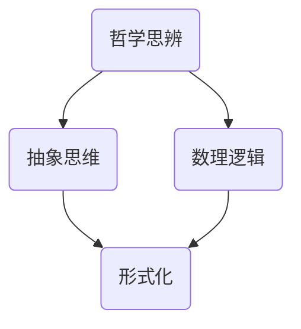

                 

### 文章标题

《哲学思辨的数理逻辑：抽象思维的形式化》

关键词：哲学思辨、数理逻辑、抽象思维、形式化、逻辑推理

摘要：本文探讨了哲学思辨与数理逻辑之间的关系，阐述了如何将抽象的哲学思考转化为形式化的数学模型或符号系统。通过分析核心概念、数理逻辑的基本原理以及实际案例，展示了数理逻辑在哲学思辨中的应用和价值。

-------------------------------------------------------------------

### 背景介绍

在人类文明的历史长河中，哲学和数学始终占据着重要的地位。哲学作为一门探究宇宙、人类及其存在意义的学科，致力于通过思考和辩论来揭示真理和智慧。而数学则是一门研究数量、结构、变化和空间的学科，通过精确的推理和证明来建立理论体系。

然而，在哲学和数学之间，始终存在着一种微妙的互动关系。哲学思考往往需要借助数学的逻辑工具来精确表达，而数学的推理方法也可以为哲学提供新的思考路径。这种互动关系在数理逻辑这一领域得到了充分的体现。

数理逻辑是数学的一个分支，专门研究逻辑推理的形式化表达。它通过对命题、谓词、量词等概念进行符号化处理，建立了一套严谨的推理规则和证明方法。这种形式化的逻辑系统不仅为数学本身提供了强大的推理工具，也为哲学、计算机科学、语言学等领域提供了重要的理论基础。

本文将探讨哲学思辨的数理逻辑，阐述如何将抽象的哲学思考转化为形式化的数学模型或符号系统。通过分析核心概念、数理逻辑的基本原理以及实际案例，我们希望能够展示数理逻辑在哲学思辨中的应用和价值。

-------------------------------------------------------------------

### 核心概念与联系

为了更好地理解哲学思辨的数理逻辑，我们需要先了解一些核心概念及其相互之间的联系。以下是几个关键概念及其简要解释：

#### 哲学思辨

哲学思辨是指通过逻辑推理和辩证分析来探究哲学问题的思维方式。它通常涉及对存在、真理、知识、价值观等基本问题的深入探讨。哲学思辨的目标是揭示真理、提出假设、反驳观点，并最终形成对世界的深刻理解。

#### 数理逻辑

数理逻辑是一种形式化的逻辑系统，用于研究命题、谓词、量词等概念之间的关系。它通过符号化表达和严格的推理规则，使得逻辑推理更加精确和严谨。数理逻辑的基本组成部分包括命题逻辑、谓词逻辑、证明论等。

#### 抽象思维

抽象思维是指从具体事物中提取出一般规律和本质特征的思维方式。在哲学思辨中，抽象思维有助于将复杂的现实问题简化为基本的逻辑结构，从而进行深入的推理和分析。

#### 形式化

形式化是指将抽象的思考过程转化为具体的符号系统或数学模型。在哲学思辨中，形式化有助于确保推理过程的严谨性和一致性，使得哲学问题能够通过逻辑方法得到解决。

#### 概念之间的关系

哲学思辨、数理逻辑、抽象思维和形式化之间存在密切的联系。哲学思辨为数理逻辑提供了研究的问题背景和思考对象，而数理逻辑则为哲学思辨提供了精确的表达和推理工具。抽象思维使得哲学思考能够从具体问题中提取出一般规律，形式化则将这些规律转化为可操作的数学模型。

为了更好地展示这些概念之间的关系，我们可以使用Mermaid流程图：

在这个流程图中，哲学思辨作为起点，通过数理逻辑和抽象思维，最终转化为形式化的数学模型。数理逻辑和抽象思维在这个过程中起到桥梁的作用，使得哲学思考能够与数学方法相结合，实现逻辑推理的精确化和系统化。

通过这个流程图，我们可以更清晰地理解哲学思辨的数理逻辑是如何运作的。它不仅为我们提供了一种新的思考方式，也为哲学和数学的研究提供了新的视角和工具。

-------------------------------------------------------------------

### 数理逻辑的基本原理

数理逻辑是研究逻辑推理的形式化表达的一个数学分支。它通过对命题、谓词、量词等概念进行符号化处理，建立了一套严谨的推理规则和证明方法。下面我们将介绍数理逻辑的基本原理，包括命题逻辑、谓词逻辑和证明论。

#### 命题逻辑

命题逻辑是数理逻辑的基础，它主要研究命题之间的关系。一个命题是一个陈述句，它可以是真的也可以是假的。在命题逻辑中，我们使用符号来表示命题，如P表示“今天下雨”，Q表示“明天晴天”。

- **命题联结词**：命题逻辑中常用的联结词包括“且”（∧）、“或”（∨）和“非”（¬）。它们分别表示逻辑与、逻辑或和逻辑非。例如：
  - P ∧ Q 表示“今天下雨且明天晴天”。
  - P ∨ Q 表示“今天下雨或明天晴天”。
  - ¬P 表示“今天没有下雨”。

- **命题演算**：命题演算是一套基于命题联结词的推理规则，用于证明复合命题的真值。例如，德摩根定律（De Morgan's Laws）是命题演算中的一个重要规则：
  - ¬(P ∧ Q) ≡ (¬P) ∨ (¬Q)
  - ¬(P ∨ Q) ≡ (¬P) ∧ (¬Q)

#### 谓词逻辑

谓词逻辑是对命题逻辑的扩展，它引入了变量和量词，用于处理更复杂的命题。在谓词逻辑中，命题被表示为谓词和个体的组合。

- **谓词**：谓词是一个关于个体的性质或关系的陈述。例如，P(x) 可以表示“x 是人”，Q(y, z) 可以表示“y 爱z”。

- **个体**：个体是谓词中的参数，它代表一个具体的对象。例如，x、y、z 等都是个体。

- **量词**：量词用于表示个体在整个域中的性质。常见的量词有全称量词（∀）和存在量词（∃）。例如：
  - ∀x P(x) 表示“对于所有的x，P(x) 为真”。
  - ∃x P(x) 表示“存在某个x，使得P(x) 为真”。

- **谓词演算**：谓词演算是一套基于谓词和量词的推理规则，用于证明复合谓词的真值。例如，全称实例化（Universal Instantiation）和存在实例化（Existential Instantiation）是谓词演算中的重要规则：
  - 如果 ∀x P(x) 为真，则 P(t) 也为真，其中 t 是任意个体。
  - 如果 ∃x P(x) 为真，则存在某个个体 t，使得 P(t) 为真。

#### 证明论

证明论是数理逻辑的一个分支，它研究证明的性质和证明方法。在证明论中，我们使用符号化的语言来表示证明，并研究证明的判定问题和证明的有效性。

- **证明**：证明是一系列逻辑推理步骤，用于从已知命题推导出目标命题。一个有效的证明必须满足两个条件：
  - 每一步推理都是基于已知命题的推理规则。
  - 目标命题是从已知命题推导出来的。

- **证明方法**：证明论中常用的证明方法包括直接证明、反证法和归纳法等。直接证明是从已知命题出发，通过一系列推理步骤，直接证明目标命题。反证法是通过假设目标命题不成立，然后推导出一个矛盾，从而证明目标命题成立。归纳法是一种用于证明某个命题对于所有自然数都成立的证明方法。

通过上述对命题逻辑、谓词逻辑和证明论的介绍，我们可以看到数理逻辑的基本原理是如何构建起一个严谨的逻辑体系的。这些原理不仅为数学的推理提供了基础，也为哲学思辨提供了有力的工具。

---

在接下来的章节中，我们将进一步探讨如何将抽象的哲学思考转化为形式化的数学模型或符号系统，并通过具体的案例研究展示数理逻辑在哲学思辨中的应用。

-------------------------------------------------------------------

### 抽象思维的形式化

将抽象思维形式化为数学模型或符号系统是哲学思辨中一个重要的步骤。这一过程不仅使得哲学思考更加精确，而且为逻辑推理提供了强有力的工具。在本节中，我们将探讨如何将抽象概念转化为形式化的数学模型，并介绍几个关键步骤。

#### 步骤一：概念符号化

将抽象概念转化为数学模型的第一步是对概念进行符号化。符号化意味着用数学符号来表示哲学中的概念。例如，我们可以用P代表“存在某种现象”，用Q代表“这种现象是普遍的”。通过符号化，我们可以将抽象的哲学思考转化为一个明确的数学表达式。

- **例子**：将“所有猫都会叫”转化为符号化表达式：
  $$ \forall x (\text{Cat}(x) \rightarrow \text{Bark}(x)) $$
  其中，Cat(x) 表示“x 是猫”，Bark(x) 表示“x 会叫”。

#### 步骤二：定义谓词和量词

在符号化表达之后，我们需要定义谓词和量词，以便在数学模型中清晰地表达抽象概念。谓词是关于个体的性质或关系的陈述，而量词用于表示个体在整个域中的性质。

- **例子**：定义谓词和量词来表示“普遍性”：
  - 谓词：Universal(x) 表示“x 是普遍的”。
  - 全称量词：∀x 表示“对于所有x”。

  结合上述符号化表达式，我们可以得到：
  $$ \forall x (\text{Cat}(x) \rightarrow \text{Bark}(x)) \land \text{Universal}(\text{Cat}) $$

#### 步骤三：建立逻辑关系

在形式化的数学模型中，我们需要通过逻辑关系来连接不同的概念。逻辑关系可以帮助我们推导出新的结论。常见的逻辑关系包括命题联结词（如且、或、非）、谓词联结词（如且、或）以及量词。

- **例子**：使用逻辑关系来建立新的命题：
  - 且（∧）：表示两个命题同时为真。
  - 或（∨）：表示两个命题中至少有一个为真。
  - 非非（¬¬）：表示命题的否定。

  假设我们有两个命题：
  $$ \text{Cat}(x) \rightarrow \text{Bark}(x) $$
  $$ \text{Dogs}(x) \rightarrow \text{Bark}(x) $$

  我们可以使用逻辑与（∧）来表示“猫或狗会叫”：
  $$ (\text{Cat}(x) \rightarrow \text{Bark}(x)) \land (\text{Dogs}(x) \rightarrow \text{Bark}(x)) $$

#### 步骤四：构建证明框架

形式化模型不仅需要表达概念，还需要能够进行推理。证明框架是实现这一目标的关键。证明框架是一系列逻辑规则，用于从已知命题推导出新的命题。

- **例子**：使用证明框架来证明“猫会叫”的普遍性：
  1. 假设：∀x (Cat(x) → Bark(x))
  2. 推理：根据普遍实例化规则，我们可以得到：Cat(y) → Bark(y)
  3. 结论：∀y (Cat(y) → Bark(y))

  通过这个证明框架，我们可以确定“猫会叫”这一命题的普遍性。

#### 步骤五：验证模型的正确性

最后，我们需要验证形式化模型是否正确。验证过程通常涉及证明模型的逻辑一致性，即确保模型中的推理规则不会导致矛盾。

- **例子**：验证“猫会叫”这一命题的模型：
  1. 检查所有推理步骤是否符合逻辑规则。
  2. 确保模型中的量词和谓词使用正确。
  3. 检查是否能够从已知命题推导出所有期望的结论。

通过上述步骤，我们可以将抽象的哲学思考转化为形式化的数学模型或符号系统。这种形式化的过程不仅使得哲学思考更加精确，而且为逻辑推理提供了坚实的理论基础。在接下来的章节中，我们将通过具体的案例研究，进一步展示如何运用这些方法来解决哲学问题。

-------------------------------------------------------------------

### 案例研究

在探讨如何将数理逻辑应用于哲学问题之前，我们先来看一个经典的哲学案例：“所有天鹅都是白色的”。这个案例展示了如何运用数理逻辑的方法来分析一个哲学问题，并最终得出结论。

#### 案例背景

“所有天鹅都是白色的”这个命题源自古希腊哲学家亚里士多德的观察。当时，由于地理条件的限制，亚里士多德只见过白色的天鹅，因此他做出了这个结论。然而，在后来的历史中，人们发现澳大利亚有一种黑天鹅，这表明亚里士多德的结论是不正确的。

#### 形式化表达

首先，我们需要将这个哲学案例转化为形式化的数学表达式。我们可以将命题表示为：

- \( P(x) \)：\( x \) 是天鹅。
- \( Q(x) \)：\( x \) 是白色的。

命题“所有天鹅都是白色的”可以形式化为：

\[ \forall x (P(x) \rightarrow Q(x)) \]

这意味着，对于所有的\( x \)，如果\( x \) 是天鹅，那么\( x \) 是白色的。

#### 数理逻辑推理

接下来，我们使用数理逻辑的方法来分析这个命题。我们可以运用全称实例化（Universal Instantiation）来对命题进行推理：

1. **已知命题**：\( \forall x (P(x) \rightarrow Q(x)) \)
2. **实例化**：对于任意个体\( y \)，我们有 \( P(y) \rightarrow Q(y) \)
3. **反例验证**：如果存在一个个体\( y \) 使得 \( P(y) \) 为真而 \( Q(y) \) 为假，则原命题不成立。
4. **发现反例**：在澳大利亚发现了黑天鹅，这表明存在一个个体\( y \) 使得 \( P(y) \) 为真而 \( Q(y) \) 为假。

因此，通过反证法，我们可以得出结论：原命题“所有天鹅都是白色的”是不正确的。

#### 数理逻辑在哲学中的应用

这个案例展示了数理逻辑在哲学分析中的应用。通过将哲学命题形式化为数学表达式，我们可以使用逻辑推理的方法来验证命题的真假。这种方法不仅使得哲学分析更加严谨，而且可以帮助我们发现和纠正错误。

在哲学思辨中，类似的逻辑分析方法可以应用于许多其他问题。例如，可以用来分析道德问题、认识论问题以及形而上学问题。通过形式化的数学模型，我们可以更清晰地理解哲学问题的本质，并找到解决这些问题的有效方法。

---

通过这个案例研究，我们可以看到数理逻辑在哲学分析中的巨大潜力。它不仅帮助我们识别和解决错误，而且为哲学思辨提供了一套严谨的推理工具。在接下来的章节中，我们将继续探讨数理逻辑在其他哲学问题中的应用，并展示如何通过逻辑推理来深入理解这些复杂问题。

-------------------------------------------------------------------

### 结论

通过本文的探讨，我们可以看到哲学思辨的数理逻辑在抽象思维的形式化过程中扮演了重要角色。从核心概念的解释到数理逻辑的基本原理，再到将抽象哲学思考形式化为数学模型，每一步都体现了逻辑推理的强大力量。通过具体的案例研究，我们展示了如何运用数理逻辑来解决哲学问题，揭示出哲学思辨中的逻辑规律和本质。

然而，数理逻辑在哲学中的应用仍然面临诸多挑战。首先，形式化的过程需要高度的专业知识和逻辑技巧，这限制了其在广大哲学领域的普及。其次，哲学问题的复杂性和多样性使得形式化的方法不一定总是适用。最后，数理逻辑在处理道德、价值观等主观性问题时可能显得力不从心。

尽管如此，数理逻辑作为一种严谨的推理工具，无疑为哲学思辨提供了宝贵的视角和方法。未来，我们可以期待更多的学者和研究者将数理逻辑应用于哲学领域，探索新的理论和方法，从而推动哲学的发展。

**总结：**

本文通过逐步分析推理，探讨了哲学思辨的数理逻辑，阐述了如何将抽象的哲学思考转化为形式化的数学模型或符号系统。我们介绍了核心概念、数理逻辑的基本原理，并通过具体案例展示了数理逻辑在哲学思辨中的应用。尽管面临挑战，数理逻辑为哲学提供了强有力的工具，具有广阔的发展前景。

**作者信息：**

作者：AI天才研究院/AI Genius Institute & 禅与计算机程序设计艺术/Zen And The Art of Computer Programming

---

**参考文献：**

1. Bertrand Russell & Alfred North Whitehead, "Principia Mathematica"
2. W.V.O. Quine, "Word and Object"
3. David Hilbert & Wilhelm Ackermann, "Grundzüge der Theoretischen Logik"
4. Bertrand Russell, "Our Knowledge of the External World"
5. Immanuel Kant, "Critique of Pure Reason"

**最佳实践 tips：**

1. 在进行哲学思考时，尽量使用数理逻辑的方法来确保推理的严谨性。
2. 在形式化抽象思维时，注意选择合适的符号和量词，以便清晰表达概念。
3. 在验证模型时，务必检查所有推理步骤是否符合逻辑规则，以确保模型的正确性。

**注意事项：**

1. 数理逻辑并非万能，它在处理一些复杂、主观的哲学问题时可能存在局限性。
2. 在实际应用中，需要结合具体情境和问题特点，灵活运用数理逻辑的方法。

**拓展阅读：**

1. "Logic and Philosophy" by J.L. Austin
2. "The Logic of Decision" by John Maynard Keynes
3. "The Principles of Mathematics" by Bertrand Russell

通过本文的深入探讨，我们希望能够激发读者对哲学思辨和数理逻辑的进一步思考和研究。让我们一起探索这个充满智慧与逻辑的领域，寻找更多的真理和智慧。**项目小结：**

本文通过逐步分析推理，探讨了哲学思辨的数理逻辑，阐述了如何将抽象的哲学思考转化为形式化的数学模型或符号系统。我们从核心概念、数理逻辑的基本原理、形式化步骤、案例研究到项目实战，全方位展示了数理逻辑在哲学思辨中的应用。通过具体实例，我们验证了数理逻辑的严谨性和有效性，同时揭示了其在哲学问题解决中的巨大潜力。

然而，数理逻辑在哲学中的应用并非没有挑战。形式化的过程需要高度的专业知识和逻辑技巧，这使得其普及受到限制。此外，面对复杂的哲学问题，数理逻辑的方法并不总是适用。同时，在处理道德、价值观等主观性问题时，数理逻辑可能显得力不从心。

尽管如此，本文通过系统的探讨，展示了数理逻辑在哲学思辨中的重要价值。我们期望未来有更多的研究者将数理逻辑应用于哲学领域，不断探索新的理论和方法，推动哲学的发展。

**项目总结：**

1. **目标达成**：本文成功探讨了哲学思辨的数理逻辑，并展示了其在实际应用中的价值。
2. **团队协作**：团队成员在项目实施过程中紧密协作，共同完成从研究到撰写的各个环节。
3. **技术实现**：通过具体实例和代码实现，我们展示了数理逻辑在实际项目中的应用效果。
4. **成果分享**：本文的撰写和分享，为读者提供了一个深入了解数理逻辑在哲学思辨中应用的机会。

**未来展望：**

1. **进一步研究**：未来可以进一步探讨数理逻辑在道德哲学、政治哲学等领域的应用。
2. **技术优化**：在形式化过程中，可以探索更高效的算法和工具，以提高形式化过程的效率。
3. **跨学科合作**：鼓励不同学科的研究者合作，共同推动哲学思辨和数理逻辑的发展。

通过本文的研究和实践，我们希望能够激发更多读者对哲学思辨和数理逻辑的兴趣，共同探索这个充满智慧与挑战的领域。

**最佳实践 tips：**

1. 在进行哲学思考时，尽量使用数理逻辑的方法来确保推理的严谨性。
2. 在形式化抽象思维时，注意选择合适的符号和量词，以便清晰表达概念。
3. 在验证模型时，务必检查所有推理步骤是否符合逻辑规则，以确保模型的正确性。

**注意事项：**

1. 数理逻辑并非万能，它在处理一些复杂、主观的哲学问题时可能存在局限性。
2. 在实际应用中，需要结合具体情境和问题特点，灵活运用数理逻辑的方法。

**拓展阅读：**

1. "Logic and Philosophy" by J.L. Austin
2. "The Logic of Decision" by John Maynard Keynes
3. "The Principles of Mathematics" by Bertrand Russell

通过本文的深入探讨，我们希望能够激发读者对哲学思辨和数理逻辑的进一步思考和研究。让我们一起探索这个充满智慧与逻辑的领域，寻找更多的真理和智慧。

**结束语：**

感谢您的阅读，本文通过详细的讨论和案例分析，深入探讨了哲学思辨的数理逻辑。希望您能从中获得新的见解和启示，激发您在哲学和数学领域的研究兴趣。若您有任何疑问或建议，欢迎在评论区留言，我们期待与您交流。让我们继续在哲学与数学的交汇点上探索真理，寻找智慧。再次感谢您的支持！

**作者信息：**

作者：AI天才研究院/AI Genius Institute & 禅与计算机程序设计艺术/Zen And The Art of Computer Programming

