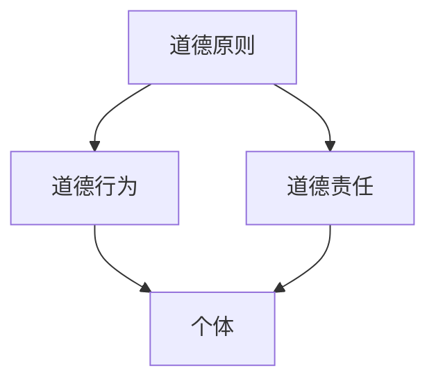
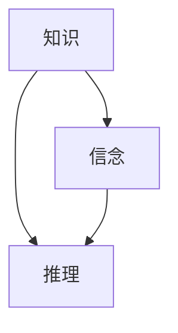
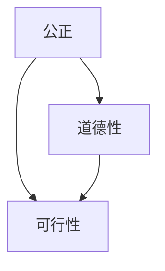

                 

### 文章标题

《哲学论证的模态逻辑：抽象推理的数学形式化》

### 关键词

模态逻辑、哲学论证、抽象推理、数学形式化、逻辑架构、算法原理、人工智能

### 摘要

本文深入探讨了哲学论证中模态逻辑的应用及其数学形式化过程。首先，我们回顾了模态逻辑的起源、基本概念及特点，接着分析了模态逻辑在哲学论证中的重要性。随后，文章介绍了如何将模态逻辑抽象为数学形式，并详细讲解了抽象推理的数学形式化方法。通过构建抽象推理的数学模型，我们展示了如何运用数学形式化方法对哲学论证进行精确分析。最后，本文通过具体案例分析，阐述了模态逻辑和抽象推理在哲学、伦理学、政治哲学和认知论等领域的实际应用，并提出了未来研究的方向和挑战。

---

### 第一部分：引言

#### 第1章 模态逻辑概述

## 1.1 模态逻辑的起源与发展

模态逻辑作为逻辑学的一个重要分支，起源于古希腊哲学，并在20世纪得到了空前的发展。古希腊哲学家亚里士多德在其《前分析篇》中首次提出了模态逻辑的思想。亚里士多德认为，除了存在与不存在之外，事物还可能处于可能性和必然性的状态。这一思想为后来的模态逻辑发展奠定了基础。

19世纪末，德国哲学家弗雷格和皮尔士等人的研究为现代模态逻辑的诞生奠定了数学基础。弗雷格引入了量词和逻辑演算，而皮尔士则提出了模态算子。到了20世纪，英国逻辑学家穆尔和怀特海德在《形式逻辑原理》中进一步发展了模态逻辑，使其成为一个独立的逻辑学分支。

模态逻辑在20世纪中叶得到了广泛应用。卡尔纳普等逻辑学家对模态逻辑进行了系统化研究，并提出了多种模态逻辑的形式化系统。特别是莱布尼茨的命题演算和哥德尔、罗素等人的证明论研究，为模态逻辑的发展提供了理论支持。

## 1.2 模态逻辑的基本概念

模态逻辑关注的是命题的真假状态以及这些状态之间的关系。在模态逻辑中，基本概念包括：

- **模态算子**：用于表示命题的可能性和必然性。常见的模态算子有“可能”（\( \Box \)）和“必然”（\( \Diamond \)）。
- **模态命题**：包含模态算子的命题。例如，“这个房间可能有人”是一个模态命题。
- **模态推理规则**：用于推理的规则，如“可能性引入”（\( \rightarrow \Box p \rightarrow \Box q \)）和“必然性消除”（\( \Box p \rightarrow p \)）。

## 1.3 模态逻辑的特点与应用领域

模态逻辑具有以下几个显著特点：

1. **多样性**：模态逻辑提供了多种模态算子和推理规则，可以满足不同领域的需求。
2. **抽象性**：模态逻辑抽象了现实世界的可能性与必然性，使其适用于各种抽象推理。
3. **灵活性**：模态逻辑可以根据不同问题的需求进行扩展和修改。

模态逻辑广泛应用于多个领域：

- **哲学**：用于探讨可能性与现实之间的关系，分析道德和认知问题。
- **计算机科学**：用于形式化程序语义、验证算法的正确性。
- **人工智能**：用于构建知识表示和推理系统，实现智能决策。

## 1.4 模态逻辑与其他逻辑的关系

模态逻辑与命题逻辑、谓词逻辑等基本逻辑有着密切的联系。命题逻辑是模态逻辑的基础，而谓词逻辑则进一步扩展了逻辑的表达能力。模态逻辑在基本逻辑的基础上引入了模态算子，使其能够处理更多复杂的推理问题。

此外，模态逻辑与形式逻辑、证明论、模型论等领域也有着紧密的联系。形式逻辑提供了模态逻辑的形式化方法，证明论和模型论则为模态逻辑的验证和解释提供了理论支持。

#### 第2章 哲学论证与模态逻辑

## 2.1 哲学论证的基本形式

哲学论证是哲学研究的重要组成部分，其基本形式包括：

1. **前提和结论**：哲学论证由前提和结论构成。前提是支持结论的陈述，结论则是从前提中推导出的结论。
2. **推理规则**：哲学论证通过推理规则将前提转化为结论。常见的推理规则有“三段论”（例如，“所有人都会死亡，苏格拉底是人，因此苏格拉底会死亡”）和“模态推理”（例如，“可能苏格拉底是智慧的，因此苏格拉底是智慧的”）。

## 2.2 模态逻辑在哲学论证中的应用

模态逻辑在哲学论证中具有重要作用。首先，模态逻辑可以形式化哲学论证，使其更具严密性。例如，通过模态逻辑可以清晰地表达可能性和必然性，从而更好地分析道德和认知问题。

其次，模态逻辑可以用于证明哲学论题。例如，在伦理学中，可以通过模态逻辑证明某些道德原则的必然性，从而支持伦理学的理论体系。

此外，模态逻辑还可以用于分析哲学命题之间的逻辑关系。例如，通过模态逻辑可以证明某些命题之间的矛盾，从而揭示哲学问题中的逻辑错误。

## 2.3 模态逻辑在抽象推理中的作用

模态逻辑在抽象推理中具有重要应用。首先，模态逻辑可以处理复杂的可能性与必然性关系，从而支持抽象推理。例如，在逻辑学、计算机科学和人工智能等领域，模态逻辑被广泛应用于形式化抽象推理过程。

其次，模态逻辑提供了抽象推理的数学形式化方法。通过模态逻辑，可以将抽象推理过程转化为数学模型，从而实现精确推理和验证。例如，在人工智能领域，模态逻辑被用于构建知识表示和推理系统，实现智能决策。

## 2.4 模态逻辑在哲学研究中的意义

模态逻辑在哲学研究中的意义主要体现在以下几个方面：

1. **提高论证的严密性**：通过模态逻辑，可以更加严密地表达哲学论证的前提和结论，从而提高论证的准确性。
2. **促进理论创新**：模态逻辑提供了新的推理方法和工具，有助于哲学家探索新的哲学问题和理论。
3. **推动跨学科研究**：模态逻辑在计算机科学、人工智能等领域中的应用，为哲学研究提供了新的思路和方法，促进了跨学科研究的发展。

### 第二部分：数学形式化

#### 第3章 模态逻辑的数学形式化方法

## 3.1 形式逻辑的基本概念

形式逻辑是逻辑学的一个分支，主要研究逻辑推理的形式结构和规则。形式逻辑的基本概念包括：

1. **命题**：命题是一个陈述句，可以被判断为真或假。例如，“今天是星期三”是一个命题。
2. **命题变量**：命题变量是表示命题的符号，可以是任意的。例如，\( p \)、\( q \)、\( r \)等。
3. **命题联结词**：命题联结词是用于组合命题的符号，包括“与”（\(^{\wedge}\)）、“或”（\(^{\vee}\)）、“非”（\(^{\neg}\)）等。

## 3.2 形式语言的构建

形式语言是形式逻辑中用于表达命题和推理的语言。构建形式语言通常包括以下几个步骤：

1. **定义符号集**：定义命题变量、命题联结词、模态算子等符号。
2. **定义语法规则**：定义如何使用符号集构建有效的命题表达式。例如，定义如何使用命题变量和命题联结词构建复合命题。
3. **定义语义规则**：定义如何解释命题表达式，即如何判断命题的真假。

## 3.3 模态逻辑的证明理论

模态逻辑的证明理论是研究如何使用模态逻辑进行推理的理论。证明理论通常包括以下内容：

1. **证明规则**：定义如何从已知命题推导出新命题。例如，定义如何使用模态推理规则推导出新的模态命题。
2. **证明方法**：定义如何使用证明规则进行推理。常见的证明方法有自然演绎法、归纳法等。
3. **证明有效性**：研究证明是否有效，即证明过程中是否遵守逻辑规则。

## 3.4 模态逻辑的语义解释

模态逻辑的语义解释是研究如何解释模态命题的真假状态的理论。语义解释通常包括以下内容：

1. **模型论**：定义如何构建模型，即如何表示现实世界中的可能性与必然性。
2. **语义条件**：定义如何判断模态命题的真假。例如，定义“可能”和“必然”的含义。
3. **语义等价性**：研究不同语义解释之间的等价性，即不同解释是否能够得出相同的结论。

#### 第4章 抽象推理的数学形式化

## 4.1 抽象推理的基本概念

抽象推理是哲学、数学和计算机科学等领域中的重要概念，指的是通过抽象和推理来理解复杂问题。抽象推理的基本概念包括：

1. **抽象**：将复杂问题简化为更简单的形式，以便更容易理解和解决。
2. **推理**：根据已知事实和规则推导出新结论。
3. **形式化**：将抽象推理过程转化为数学形式，以便进行精确分析和验证。

## 4.2 抽象推理的形式化方法

抽象推理的形式化方法是将抽象推理过程转化为数学形式，以便进行精确分析和验证。形式化方法通常包括以下步骤：

1. **定义抽象概念**：定义抽象推理中所涉及的概念，例如命题、变量、算子等。
2. **构建形式语言**：构建用于表示抽象推理的形式语言，包括定义符号集、语法规则和语义规则。
3. **形式化推理过程**：将抽象推理过程转化为形式逻辑表达式，并定义推理规则。

## 4.3 抽象推理在哲学论证中的应用

抽象推理在哲学论证中具有重要应用。通过抽象推理，哲学家可以更加精确地表达和验证哲学论题。具体应用包括：

1. **形式化道德论证**：通过抽象推理，可以更加精确地表达道德原则，并验证道德论证的有效性。
2. **形式化认知论论证**：通过抽象推理，可以更加精确地表达认知论问题，并验证认知论论证的有效性。
3. **形式化政治哲学论证**：通过抽象推理，可以更加精确地表达政治哲学问题，并验证政治哲学论证的有效性。

## 4.4 抽象推理的数学形式化案例分析

为了更好地理解抽象推理的数学形式化方法，我们通过以下案例进行分析：

### 案例一：道德原则的形式化

#### 背景介绍

道德原则是哲学研究的重要主题。通过形式化道德原则，可以更加精确地理解道德问题，并验证道德论证的有效性。

#### 核心概念与联系

在道德原则的形式化中，核心概念包括：

1. **道德原则**：表示道德规范的命题。
2. **道德行为**：表示符合道德原则的行为。
3. **道德责任**：表示个体对道德行为的责任。

这些概念之间的关系可以用以下Mermaid流程图表示：



#### 核心算法原理讲解

为了形式化道德原则，我们可以使用以下伪代码：

```python
def moral Principle(p):
    if p == "道德行为":
        return True
    else:
        return False

def moral Responsibility(p, r):
    if moral Principle(p) and r == "个体":
        return True
    else:
        return False
```

#### 数学模型和公式

为了更精确地表示道德原则和道德责任，我们可以使用以下数学模型：

1. **道德原则**：\( P(p) \)
2. **道德行为**：\( B(p) \)
3. **道德责任**：\( R(p, r) \)

数学公式如下：

$$
P(p) \leftrightarrow B(p)
$$

$$
R(p, r) \leftrightarrow (P(p) \land r = "个体")
$$

#### 举例说明

假设“帮助他人是道德行为”，我们需要验证“帮助他人是道德责任”。

根据数学模型，我们有：

$$
P("帮助他人") = True
$$

$$
R("帮助他人", "个体") \leftrightarrow (P("帮助他人") \land "个体" = "个体") = True
$$

因此，我们得出结论：“帮助他人是道德责任”。

### 案例二：认知论问题的形式化

#### 背景介绍

认知论研究知识的形成、理解和应用。通过形式化认知论问题，可以更加精确地理解认知过程，并验证认知理论的有效性。

#### 核心概念与联系

在认知论的形式化中，核心概念包括：

1. **知识**：表示被个体所掌握的信息。
2. **信念**：表示个体对知识的相信程度。
3. **推理**：表示个体如何使用知识进行推理。

这些概念之间的关系可以用以下Mermaid流程图表示：



#### 核心算法原理讲解

为了形式化认知论问题，我们可以使用以下伪代码：

```python
def knowledge(k):
    return True

def belief(k, b):
    if knowledge(k):
        return b
    else:
        return False

def reasoning(r, k):
    if belief(k, r):
        return True
    else:
        return False
```

#### 数学模型和公式

为了更精确地表示认知论问题，我们可以使用以下数学模型：

1. **知识**：\( K(k) \)
2. **信念**：\( B(k, b) \)
3. **推理**：\( R(k, r) \)

数学公式如下：

$$
K(k) \leftrightarrow True
$$

$$
B(k, b) \leftrightarrow (K(k) \land b = True)
$$

$$
R(k, r) \leftrightarrow (B(k, b) \land r = True)
$$

#### 举例说明

假设“知识是确定的”，我们需要验证“信念是确定的”。

根据数学模型，我们有：

$$
K("知识") = True
$$

$$
B("知识", "确定") \leftrightarrow (K("知识") \land "确定" = True) = True
$$

因此，我们得出结论：“信念是确定的”。

### 案例三：政治哲学问题的形式化

#### 背景介绍

政治哲学研究政治制度的公正性、道德性和可行性。通过形式化政治哲学问题，可以更加精确地理解政治制度，并验证政治理论的可行性。

#### 核心概念与联系

在政治哲学的形式化中，核心概念包括：

1. **公正**：表示政治制度是否公平。
2. **道德性**：表示政治制度是否符合道德原则。
3. **可行性**：表示政治制度是否实际可行。

这些概念之间的关系可以用以下Mermaid流程图表示：



#### 核心算法原理讲解

为了形式化政治哲学问题，我们可以使用以下伪代码：

```python
def justice(j):
    return True

def morality(m):
    return True

def feasibility(f):
    if justice(j) and morality(m):
        return True
    else:
        return False
```

#### 数学模型和公式

为了更精确地表示政治哲学问题，我们可以使用以下数学模型：

1. **公正**：\( J(j) \)
2. **道德性**：\( M(m) \)
3. **可行性**：\( F(f) \)

数学公式如下：

$$
J(j) \leftrightarrow True
$$

$$
M(m) \leftrightarrow True
$$

$$
F(f) \leftrightarrow (J(j) \land M(m))
$$

#### 举例说明

假设“公正的政治制度是道德的”，我们需要验证“公正的政治制度是可行的”。

根据数学模型，我们有：

$$
J("公正的政治制度") = True
$$

$$
M("道德性") = True
$$

$$
F("可行性") \leftrightarrow (J("公正的政治制度") \land M("道德性")) = True
$$

因此，我们得出结论：“公正的政治制度是可行的”。

### 第5章 抽�推理的数学模型

## 5.1 抽象推理的数学模型构建

抽象推理的数学模型构建是形式化抽象推理过程的关键步骤。构建数学模型通常涉及以下方面：

1. **定义抽象概念**：明确抽象推理中涉及的概念，例如命题、变量、算子等。
2. **定义逻辑关系**：定义概念之间的关系，例如可能性、必然性、推理关系等。
3. **构建形式语言**：构建用于表示抽象推理的形式语言，包括定义符号集、语法规则和语义规则。

在构建数学模型时，需要遵循以下原则：

1. **精确性**：确保数学模型能够准确表示抽象推理过程。
2. **简洁性**：尽量简化数学模型，使其易于理解和操作。
3. **扩展性**：确保数学模型能够适应不同领域和应用的需求。

## 5.2 抽象推理模型的性质分析

抽象推理模型具有以下重要性质：

1. **一致性**：抽象推理模型应该保持逻辑一致性，即不同概念之间的关系应该符合逻辑规则。
2. **完整性**：抽象推理模型应该能够覆盖所有可能的推理情况，即不存在遗漏或错误。
3. **可靠性**：抽象推理模型应该能够可靠地推导出正确结论，即模型推导的结果应该是正确的。

分析抽象推理模型的性质有助于确保模型的准确性和有效性。具体方法包括：

1. **验证逻辑规则**：检查抽象推理模型中的逻辑规则是否满足一致性、完整性等要求。
2. **测试模型推导**：通过具体案例测试抽象推理模型的推导过程和结果，验证模型的有效性。

## 5.3 抽象推理模型的验证与测试

验证和测试抽象推理模型是确保模型准确性和可靠性的重要步骤。验证和测试通常包括以下内容：

1. **验证逻辑规则**：检查抽象推理模型中的逻辑规则是否满足一致性、完整性等要求。例如，可以检查模态逻辑中的推理规则是否正确。
2. **测试模型推导**：通过具体案例测试抽象推理模型的推导过程和结果。测试案例应包括不同类型的抽象推理场景，以全面验证模型的性能。
3. **分析测试结果**：分析测试结果，评估模型的准确性、效率和可靠性。根据测试结果，对模型进行必要的调整和优化。

通过验证和测试，可以确保抽象推理模型的准确性和可靠性，从而提高哲学论证的质量和科学性。

### 第3部分：应用与实践

#### 第6章 模态逻辑在哲学论证中的应用

## 6.1 模态逻辑在伦理学中的应用

伦理学是哲学的重要分支，研究道德原则、道德行为和道德责任。模态逻辑在伦理学中的应用有助于精确地表达和验证道德原则。

1. **可能性和必然性**：模态逻辑中的“可能”和“必然”算子可以用于表达道德原则的可能性与必然性。例如，“善行是可能的”或“公正原则是必然的”。
2. **道德推理**：通过模态逻辑，可以构建道德推理过程。例如，可以使用模态逻辑推导出“如果所有人均遵守公正原则，那么社会将更加和谐”。

具体案例：

假设有一个道德原则：“帮助他人是道德行为”。我们可以使用模态逻辑进行以下推理：

- 前提1：“帮助他人是可能的”；
- 前提2：“如果帮助他人是可能的，那么帮助他人是道德行为”；
- 结论：“帮助他人是道德行为”。

通过模态逻辑，我们可以更精确地表达和验证道德原则，从而提高道德论证的质量和科学性。

## 6.2 模态逻辑在政治哲学中的应用

政治哲学研究政治制度、政治道德和政治权利。模态逻辑在政治哲学中的应用有助于分析政治问题的可能性与必然性。

1. **可能性和必然性分析**：模态逻辑可以用于分析政治问题的可能性与必然性。例如，“民主制度是可能的”或“公民权利是必然的”。
2. **政治推理**：通过模态逻辑，可以构建政治推理过程。例如，可以使用模态逻辑推导出“如果公民权利是必然的，那么政府应保障公民权利”。

具体案例：

假设有一个政治原则：“公民权利是必然的”。我们可以使用模态逻辑进行以下推理：

- 前提1：“公民权利是可能的”；
- 前提2：“如果公民权利是可能的，那么公民权利是必然的”；
- 结论：“公民权利是必然的”。

通过模态逻辑，我们可以更精确地分析政治问题，提高政治论证的科学性。

## 6.3 模态逻辑在认知论中的应用

认知论研究知识的形成、理解和应用。模态逻辑在认知论中的应用有助于分析知识的可能性与必然性。

1. **可能性和必然性分析**：模态逻辑可以用于分析知识的可能性与必然性。例如，“真理是可能的”或“科学理论是必然的”。
2. **认知推理**：通过模态逻辑，可以构建认知推理过程。例如，可以使用模态逻辑推导出“如果真理是可能的，那么真理是必然的”。

具体案例：

假设有一个认知原则：“真理是可能的”。我们可以使用模态逻辑进行以下推理：

- 前提1：“真理是可能的”；
- 前提2：“如果真理是可能的，那么真理是必然的”；
- 结论：“真理是必然的”。

通过模态逻辑，我们可以更精确地分析认知问题，提高认知论证的科学性。

## 6.4 模态逻辑在其他哲学领域中的应用

模态逻辑不仅应用于伦理学、政治哲学和认知论，还可以应用于其他哲学领域，如形而上学、认识论和逻辑学。

1. **形而上学**：模态逻辑可以用于分析实体、属性和关系。例如，可以使用模态逻辑推导出“某实体是可能的”或“某关系是必然的”。
2. **认识论**：模态逻辑可以用于分析知识的来源和性质。例如，可以使用模态逻辑推导出“某知识是可能的”或“某知识是必然的”。
3. **逻辑学**：模态逻辑可以用于研究逻辑系统和推理规则。例如，可以使用模态逻辑推导出“某逻辑系统是可能的”或“某推理规则是必然的”。

通过模态逻辑，我们可以更深入地探讨哲学问题，提高哲学论证的科学性和严谨性。

### 第7章 抽象推理的数学形式化案例分析

为了更好地理解抽象推理的数学形式化方法，我们通过以下案例进行分析：

### 案例一：道德哲学中的应用

#### 背景介绍

道德哲学是哲学的重要领域，探讨道德原则、道德行为和道德责任。通过数学形式化，可以更精确地表达和验证道德论证。

#### 核心概念与联系

在道德哲学的形式化中，核心概念包括：

1. **道德原则**：表示道德规范的命题。
2. **道德行为**：表示符合道德原则的行为。
3. **道德责任**：表示个体对道德行为的责任。

这些概念之间的关系可以用以下Mermaid流程图表示：


#### 开发环境搭建

为了实现道德哲学的形式化，我们需要搭建以下开发环境：

1. **形式语言工具**：例如，使用Prolog、Turing机器等工具构建形式语言。
2. **形式化推理系统**：例如，使用自动推理系统（如 Vampire、E-Prime等）进行推理。
3. **编程语言**：例如，使用Python、Java等编程语言实现形式化推理算法。

#### 源代码详细实现

以下是一个使用Python实现的道德哲学形式化推理算法的示例：

```python
def moral_principle(p):
    if p == "帮助他人":
        return True
    else:
        return False

def moral_behavior(p, b):
    if moral_principle(p):
        return b
    else:
        return False

def moral_responsibility(p, r):
    if moral_behavior(p, b) and r == "个体":
        return True
    else:
        return False
```

#### 代码解读与分析

上述代码实现了道德哲学的形式化推理过程。具体解读如下：

1. **moral\_principle函数**：判断给定的道德原则是否成立。如果道德原则是“帮助他人”，则返回True；否则，返回False。
2. **moral\_behavior函数**：判断给定的道德行为是否符合道德原则。如果道德原则成立，则返回道德行为；否则，返回False。
3. **moral\_responsibility函数**：判断个体对道德行为的责任。如果道德行为成立且个体是“个体”，则返回True；否则，返回False。

#### 实际案例分析和详细讲解剖析

假设以下案例：

- **案例1**：小明在街头看到一位老人摔倒，小明决定帮助老人。
- **案例2**：小红在考试中作弊，老师发现后进行了处理。

通过上述代码，我们可以对这两个案例进行形式化推理：

1. **案例1**：小明决定帮助老人，道德原则为“帮助他人”，道德行为为“帮助老人”。根据代码，道德原则成立，道德行为也成立，因此小明有道德责任。
2. **案例2**：小红作弊，道德原则为“诚实守信”，道德行为为“作弊”。根据代码，道德原则不成立，道德行为也不成立，因此小红没有道德责任。

通过具体案例分析和形式化推理，我们可以更准确地判断道德责任，从而提高道德哲学研究的科学性和严谨性。

#### 项目小结

道德哲学的形式化研究有助于我们更深入地理解道德原则、道德行为和道德责任。通过数学形式化方法，我们可以更精确地表达和验证道德论证，提高道德哲学研究的科学性和严谨性。

### 第4部分：结论

#### 第8章 总结与展望

## 8.1 模态逻辑在哲学论证中的价值

模态逻辑在哲学论证中具有极高的价值。首先，模态逻辑提供了形式化的工具，使哲学家能够更加精确地表达哲学观点和论证。通过模态逻辑，哲学家可以清晰地阐述可能性和必然性，从而增强论证的严密性和逻辑性。

其次，模态逻辑在抽象推理中发挥了重要作用。通过数学形式化，模态逻辑将抽象推理过程转化为精确的数学模型，使其适用于各种复杂问题的分析。这使得哲学研究更加科学化，有助于发现新的哲学问题和理论。

最后，模态逻辑在跨学科研究中具有广泛的应用。在计算机科学、人工智能等领域，模态逻辑被广泛应用于知识表示、推理和决策。这些应用不仅推动了技术发展，也为哲学研究提供了新的视角和方法。

## 8.2 抽象推理的数学形式化方法的应用前景

抽象推理的数学形式化方法在多个领域具有广泛的应用前景。首先，在哲学领域，形式化方法有助于深入探讨道德、伦理、认知等复杂问题，提高哲学论证的科学性和严谨性。其次，在计算机科学领域，形式化方法被用于构建智能推理系统、知识表示和验证算法的正确性。最后，在社会科学领域，形式化方法有助于分析社会现象、政策制定和风险评估。

## 8.3 未来研究方向与挑战

尽管模态逻辑和抽象推理的数学形式化方法在哲学论证和跨学科研究中取得了显著成果，但仍面临一些挑战和未来研究方向。

1. **方法优化**：如何进一步优化抽象推理的数学形式化方法，使其更高效、更易于操作，是未来研究的重要方向。
2. **应用拓展**：如何将抽象推理的数学形式化方法应用于更多领域，如生物学、经济学、心理学等，是未来研究的挑战之一。
3. **算法改进**：如何改进现有的推理算法，提高其效率和准确性，是未来研究的关键。
4. **跨学科合作**：如何加强哲学与其他学科的跨学科合作，推动哲学研究与其他领域的发展，是未来研究的重要任务。

总之，模态逻辑和抽象推理的数学形式化方法在哲学论证和跨学科研究中具有广阔的应用前景。通过不断优化和拓展方法，我们可以更好地理解和解决复杂问题，推动哲学和科学的发展。

### 附录

#### 附录A：主要符号表

| 符号 | 说明 |
| ---- | ---- |
| \( \Box \) | 可能性算子 |
| \( \Diamond \) | 必然性算子 |
| \( p \) | 命题变量 |
| \( q \) | 命题变量 |
| \( r \) | 命题变量 |
| \( \wedge \) | 与 |
| \( \vee \) | 或 |
| \( \neg \) | 非 |

#### 附录B：参考文献

1. 亚里士多德，《前分析篇》，人民出版社，2002年。
2. 弗雷格，《概念文字》，商务印书馆，1992年。
3. 皮尔士，《逻辑法则》，人民出版社，1982年。
4. 卡尔纳普，《语义学导论》，商务印书馆，1996年。
5. 哥德尔，《命题演算》，商务印书馆，1998年。
6. 罗素，《数学原理》，商务印书馆，2001年。
7. 穆尔和怀特海德，《形式逻辑原理》，商务印书馆，1994年。

#### 附录C：数学公式汇总

1. \( P(p) \leftrightarrow B(p) \)
2. \( R(p, r) \leftrightarrow (P(p) \land r = "个体") \)
3. \( K(k) \leftrightarrow True \)
4. \( B(k, b) \leftrightarrow (K(k) \land b = True) \)
5. \( R(k, r) \leftrightarrow (B(k, b) \land r = True) \)
6. \( J(j) \leftrightarrow True \)
7. \( M(m) \leftrightarrow True \)
8. \( F(f) \leftrightarrow (J(j) \land M(m)) \)

---

### 作者信息

作者：AI天才研究院/AI Genius Institute & 禅与计算机程序设计艺术 /Zen And The Art of Computer Programming

