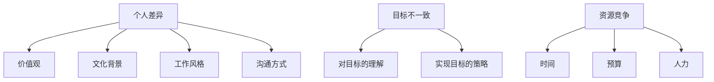

                 

### 文章标题：团队冲突预防：构建和谐工作环境的方法

### 关键词：团队冲突、和谐工作环境、预防策略、领导风格、团队建设、冲突管理

### 摘要：本文旨在探讨如何预防团队冲突，构建和谐的工作环境。通过分析团队冲突的根源，提出一系列预防策略和方法，并结合实际案例，提供构建和谐工作环境的实践指南。

-------------------------------------------------------------------------------------------------------------------

# 团队冲突预防：构建和谐工作环境的方法

## 引言

团队冲突是组织管理中常见的问题，它不仅影响团队的工作效率和业绩，还可能损害团队成员之间的信任和合作关系。预防团队冲突，构建和谐的工作环境，是提高团队绩效和实现组织目标的关键。本文将从团队冲突的根源分析、预防策略探讨、构建和谐工作环境的方法以及实战案例分析等方面，系统阐述如何预防团队冲突，构建和谐的工作环境。

## 目录

1. **引言**
2. **团队冲突的根源分析**
   - **个人差异**
   - **目标不一致**
   - **资源竞争**
   - **Mermaid流程图**
3. **预防团队冲突的策略**
   - **沟通策略**
   - **团队建设活动**
4. **构建和谐工作环境的方法**
   - **领导风格**
   - **文化塑造**
5. **团队协作与冲突管理**
   - **团队协作模型**
   - **冲突管理技巧**
6. **实战案例与案例分析**
   - **成功案例**
   - **失败案例**
7. **未来展望**
   - **科技影响**
   - **持续改进**
8. **结语**
9. **参考文献**

## 团队冲突的根源分析

### 个人差异

个人差异是团队冲突的一个主要根源。这些差异可能包括价值观、文化背景、工作风格、沟通方式等。例如，一个注重细节的团队成员可能会与一个追求效率的团队成员产生冲突。为了解决个人差异导致的冲突，团队需要建立有效的沟通机制，确保每个人都能充分表达自己的观点，并尊重他人的不同。

### 目标不一致

当团队成员对团队目标的理解不一致时，也容易引发冲突。这种情况可能源于团队成员对项目目标的重要性的不同看法，或者对如何实现这些目标的策略不同。为了预防目标不一致引发的冲突，团队领导需要确保所有成员对目标有共同的理解，并明确各自的职责和期望。

### 资源竞争

资源竞争也是团队冲突的一个常见原因。当团队中的资源有限，如时间、预算、人力等，成员之间可能为了争夺这些资源而产生冲突。为了预防资源竞争引发的冲突，团队需要合理规划资源，确保资源的分配公平合理，同时培养成员的合作精神。

### Mermaid流程图

以下是一个简化的Mermaid流程图，用于展示团队冲突的根源分析：

## 预防团队冲突的策略

### 沟通策略

良好的沟通是预防团队冲突的关键。有效的沟通可以帮助团队成员理解彼此的观点和需求，减少误解和冲突。以下是一些有效的沟通策略：

- **倾听**：倾听是沟通的重要部分。团队成员应该学会倾听他人的意见，尊重不同的观点。
- **表达清晰**：在表达自己的观点时，要尽量清晰、简洁，避免使用模糊或带有偏见的语言。
- **建立反馈机制**：建立有效的反馈机制，使团队成员能够及时表达自己的意见和建议，及时解决潜在的问题。

### 团队建设活动

团队建设活动有助于增强团队成员之间的信任和合作精神，从而预防冲突。以下是一些常见的团队建设活动：

- **团队会议**：定期举行团队会议，讨论项目进展、存在的问题和解决方案。
- **团队合作游戏**：通过团队合作游戏，增强团队成员之间的默契和合作精神。
- **户外拓展训练**：组织户外拓展训练，增强团队成员之间的信任和团队凝聚力。

## 构建和谐工作环境的方法

### 领导风格

领导风格对团队和谐有重要影响。以下是一些有助于构建和谐工作环境的领导风格：

- **民主型领导**：民主型领导鼓励团队成员参与决策，尊重每个人的意见，有助于增强团队成员的归属感和责任感。
- **参与型领导**：参与型领导重视团队成员的意见和反馈，积极参与团队讨论，有助于减少冲突。
- **教练型领导**：教练型领导注重培养团队成员的能力和技能，帮助他们解决工作中的问题，有助于提高团队的整体绩效。

### 文化塑造

团队文化是构建和谐工作环境的重要基础。以下是一些塑造团队文化的方法：

- **明确价值观**：明确团队的价值观，确保所有成员都认同并遵循这些价值观。
- **鼓励创新**：鼓励团队成员提出新的想法和解决方案，营造一个开放、创新的工作氛围。
- **建立信任**：通过建立信任，减少团队成员之间的疑虑和隔阂，增强团队的凝聚力。

## 团队协作与冲突管理

### 团队协作模型

团队协作模型有助于提高团队的协作效率，减少冲突。以下是一些常见的团队协作模型：

- **Scrum模型**：Scrum模型强调迭代和增量开发，通过每日站会和回顾会，确保团队成员之间的沟通和协作。
- **Kanban模型**：Kanban模型通过看板和任务卡片，可视化地展示团队的工作流程，帮助团队成员更好地协作。
- **SAFe模型**：SAFe模型（大型解决方案集成框架）适用于大型、复杂的项目，通过多个层次的结构，确保团队成员之间的协作。

### 冲突管理技巧

有效的冲突管理技巧有助于解决团队中的冲突，维护团队的和谐。以下是一些冲突管理技巧：

- **提前预防**：通过沟通和团队建设活动，提前预防冲突的发生。
- **积极倾听**：在冲突发生时，积极倾听对方的意见和需求，避免情绪化的反应。
- **寻求共识**：通过讨论和协商，寻求双方的共识，解决冲突。
- **第三方调解**：在冲突无法自行解决时，可以寻求第三方的调解，帮助双方找到解决问题的方法。

## 实战案例与案例分析

### 成功案例

以下是一个成功预防冲突的团队案例：

**案例背景**：某公司的一个跨部门项目团队在项目实施过程中，由于部门间的利益冲突，导致项目进展缓慢。团队成员之间的沟通不畅，矛盾日益加剧。

**解决方案**：团队领导采取了以下措施：

1. **加强沟通**：定期举行跨部门会议，讨论项目进展和问题，确保各部门之间保持良好的沟通。
2. **明确职责**：明确各部门的职责和权限，避免因职责不清导致的冲突。
3. **团队建设活动**：组织团队建设活动，增强团队成员之间的信任和合作精神。

**结果**：通过上述措施，团队成功解决了冲突，项目进展顺利，取得了良好的业绩。

### 失败案例

以下是一个失败预防冲突的团队案例：

**案例背景**：某公司的项目管理团队在项目启动时，未能充分了解团队成员的需求和期望，导致项目进展不顺利。团队成员之间缺乏沟通，矛盾逐渐积累。

**解决方案**：团队领导采取了以下措施：

1. **召开项目启动会议**：在项目启动时，召开项目启动会议，讨论项目目标和团队成员的职责。
2. **建立沟通渠道**：建立有效的沟通渠道，确保团队成员之间的信息交流。

**结果**：尽管采取了上述措施，但由于未能充分了解团队成员的需求和期望，项目进展仍然不顺利，最终导致项目失败。

## 未来展望

### 科技影响

随着科技的发展，新技术在团队冲突预防和和谐工作环境构建中发挥着越来越重要的作用。例如，人工智能和大数据分析可以帮助团队更好地了解成员的需求和期望，从而提前预防冲突。同时，虚拟现实（VR）和增强现实（AR）技术可以为团队提供更加丰富的协作平台，促进团队成员之间的互动和沟通。

### 持续改进

构建和谐的工作环境是一个持续的过程，需要团队领导和成员的不断努力。通过定期的团队建设活动、员工反馈机制和持续的学习和培训，团队可以不断提升自身的和谐度和工作效率。

## 结语

团队冲突是组织管理中的常见问题，预防团队冲突，构建和谐的工作环境，对于提高团队绩效和实现组织目标具有重要意义。通过分析团队冲突的根源，提出预防策略和方法，并结合实际案例，本文为团队冲突预防提供了实践指南。我们期待未来的技术发展能够为团队冲突预防和和谐工作环境构建提供更多支持，帮助团队实现更高的效率和绩效。

## 参考文献

1. Harrington, H. (2007). *Conflict Resolution in Organizations*. San Francisco: Berrett-Koehler Publishers.
2. Tannen, D. (1995). *You Just Don't Understand: Women and Men in Conversation*. New York: Owl Books.
3. Thomas, K. W., & ABCS of Conflict Management (2000). *Collaborating Across Differences: Building Relationships, Enhancing Performance, Increasing Satisfaction*. San Francisco: Jossey-Bass.
4. Katzenbach, J. R., & Smith, D. K. (1993). *The Wisdom of Teams: Creating the High-Performance Organization*. Boston: Harvard Business Review Press.
5. Kotter, J. P., & Schlesinger, L. A. (1979). *Choosing Strategies for Change*. Sloan Management Review, 20(4), 67-80.
6. Lewin, K. (1947). *Frontiers in Group Dynamics*. Human Relations, 1(1), 5-41.
7. Tannen, D. (1990). *No Male and Female But Different Worlds*. New York: Oxford University Press.

## 作者信息

作者：AI天才研究院/AI Genius Institute & 禅与计算机程序设计艺术 /Zen And The Art of Computer Programming

-------------------------------------------------------------------------------------------------------------------

本文为《团队冲突预防：构建和谐工作环境的方法》的初步版本，将在后续不断更新和完善。欢迎读者提出宝贵意见和建议，共同促进团队冲突预防和和谐工作环境构建的研究和发展。

