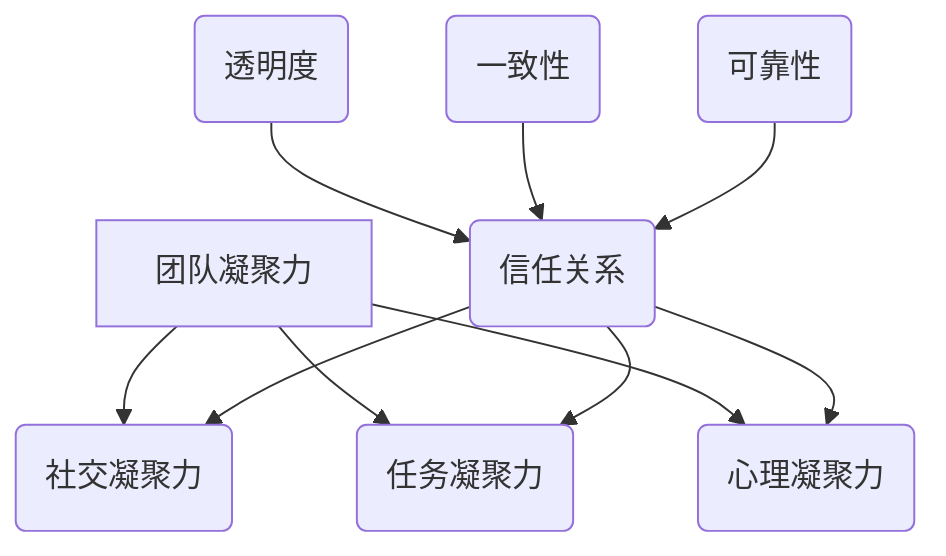
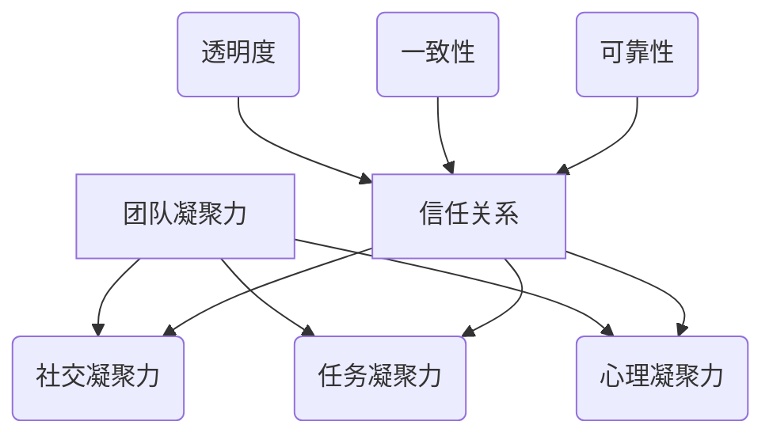

                 

### 背景介绍

在当今快速变化且高度竞争的商业环境中，团队的凝聚力和成员之间的信任关系对于企业的成功至关重要。一个高效的团队不仅需要每个成员拥有出色的专业技能，还需要团队成员之间能够密切协作、共同面对挑战和解决问题。

团队凝聚力是指团队成员之间相互吸引、协作和保持联系的程度。它不仅仅是一个简单的群体现象，更是一个深层次的组织特性。研究表明，高凝聚力的团队往往能够更好地应对压力，展现出更强的创造力和决策能力。然而，团队凝聚力的建立并非一蹴而就，它需要通过一系列的结构化步骤和持续的努力来逐步实现。

信任关系是团队凝聚力的重要组成部分。在团队中，信任是成员之间相互依赖的基石。当团队成员相互信任时，他们更愿意分享信息、承担责任、提出建议并相互支持。这种相互信任的环境能够促进团队合作，减少冲突，提高工作效率。因此，建立深厚的信任关系是提升团队凝聚力的关键步骤之一。

本文将深入探讨团队凝聚力的重要性，并详细阐述建立深厚信任关系的步骤。文章将从以下几个部分展开：

1. **团队凝聚力的重要性**：介绍团队凝聚力对组织的影响和团队凝聚力的定义。
2. **建立深厚信任关系的步骤**：分阶段讨论如何建立团队成员之间的信任。
3. **提升团队凝聚力的策略**：提供实用的方法来增强团队的凝聚力。
4. **巩固团队凝聚力**：讨论如何维持团队的凝聚力，包括领导力和冲突管理。
5. **团队凝聚力的评估**：介绍评估团队凝聚力的方法和工具。

通过本文的讨论，我们希望能够为读者提供一套系统、实用的指导，帮助他们提升团队的凝聚力和建立深厚的信任关系，从而在竞争激烈的市场中取得成功。

### 核心概念与联系

在探讨团队凝聚力和信任关系之前，我们需要先明确几个核心概念，并展示它们之间的关系架构。以下是几个关键概念及其相互关系：

**团队凝聚力**：这是指团队成员之间相互吸引、协作和保持联系的程度。团队凝聚力可以细分为以下几个方面：

- **社交凝聚力**：指团队成员之间的社交关系和互动。
- **任务凝聚力**：指团队成员为了共同的任务或目标而协作的紧密程度。
- **心理凝聚力**：指团队成员对团队内部规范和价值观的认同感。

**信任关系**：在团队中，信任是成员之间相互依赖的基石。信任关系可以分为以下几类：

- **任务信任**：团队成员相信对方能够完成自己的任务。
- **情感信任**：团队成员对彼此的情感支持和关怀。
- **意图信任**：团队成员相信对方具有合作的良好意图。

**影响信任的因素**：

- **透明度**：团队成员之间的信息共享程度。
- **一致性**：团队成员的行为和决策是否一致。
- **可靠性**：团队成员履行承诺和责任的能力。

**信任与团队凝聚力的关系**：

信任是团队凝聚力的基础。当团队成员之间建立了深厚的信任关系，团队凝聚力会显著增强。信任可以减少冲突，提高团队协作效率，并增强团队成员的归属感和满意度。具体来说，信任与团队凝聚力之间的相互关系可以表示为以下Mermaid流程图：

在这个流程图中，团队凝聚力通过社交凝聚力、任务凝聚力和心理凝聚力来体现；信任关系通过透明度、一致性和可靠性来建立。这些因素共同作用，促进了团队凝聚力和信任关系的建立。

### 团队凝聚力的重要性

团队凝聚力在组织中起着至关重要的作用，它不仅影响团队内部的工作效率和成员满意度，还对组织的整体绩效产生深远的影响。以下是团队凝聚力的重要性和其对组织影响的详细分析。

**1. 提高工作效率：**

一个高凝聚力的团队能够更好地协同工作，减少沟通障碍和信息流失。团队成员之间相互信任，能够更快地共享信息和资源，从而提高整体的工作效率。例如，在一个凝聚力较高的团队中，成员更愿意分享他们的专业知识，帮助同事解决难题，这种知识共享能够显著提升团队的工作效率。

**2. 减少错误率：**

高凝聚力的团队能够更好地识别和纠正错误。团队成员之间相互依赖，能够更有效地发现和解决潜在的问题，减少错误和失误的发生。这种紧密的协作关系使得团队成员能够从不同的角度审视问题和解决方案，从而提高决策质量和工作准确度。

**3. 提高员工满意度：**

团队凝聚力能够增强员工的归属感和满意度。在一个凝聚力较高的团队中，成员之间相互支持，关系融洽，员工更有可能感受到被尊重和认可。这种积极的团队氛围能够提升员工的工作热情和积极性，降低离职率，从而提高员工的整体满意度和忠诚度。

**4. 促进创新：**

团队凝聚力有助于激发团队成员的创造力和创新能力。在一个信任和协作的团队环境中，成员更愿意提出新颖的想法和创新的解决方案。这种开放和包容的文化能够促进团队内部的思维碰撞，从而产生更多的创新点子。例如，谷歌等科技公司在团队建设方面就非常重视凝聚力的培养，通过多种创新活动来增强团队的合作和创造力。

**5. 增强决策质量：**

一个高凝聚力的团队能够做出更高质量的决策。团队成员之间相互信任，更愿意听取和考虑不同的意见，这使得团队在做出决策时能够更全面地考虑各种因素。此外，团队凝聚力还能够减少内部冲突和权力斗争，使得决策过程更加高效和透明。

**6. 提高客户满意度：**

团队凝聚力对客户的满意度也有直接影响。一个高效的团队能够更快地响应客户需求，提供高质量的服务。团队成员之间紧密的协作和相互支持能够确保客户问题得到及时解决，从而提高客户满意度和忠诚度。

综上所述，团队凝聚力在提高工作效率、减少错误率、提高员工满意度、促进创新、增强决策质量和提高客户满意度等方面发挥着重要作用。因此，组织应当重视团队凝聚力的培养，采取一系列措施来增强团队的凝聚力和成员之间的信任关系。

### 核心概念与联系

在深入探讨团队凝聚力的重要性后，我们需要理解团队凝聚力的核心概念，并展示这些概念之间的关系架构。以下是几个关键概念及其相互关系：

**团队凝聚力**：这是团队内部成员相互吸引、协作和保持联系的程度。它主要包括以下几个维度：

- **社交凝聚力**：指团队成员之间的社交关系和互动。社交凝聚力可以通过成员之间的友谊和相互支持来体现。
- **任务凝聚力**：指团队成员为了共同的任务或目标而协作的紧密程度。任务凝聚力通常体现在团队在完成特定任务时的协作效率。
- **心理凝聚力**：指团队成员对团队内部规范和价值观的认同感。心理凝聚力与成员对团队的归属感和认同感密切相关。

**信任关系**：在团队中，信任是成员之间相互依赖的基石。信任关系可以分为以下几类：

- **任务信任**：团队成员相信对方能够完成自己的任务。任务信任通常体现在团队成员之间的协作和依赖。
- **情感信任**：团队成员对彼此的情感支持和关怀。情感信任与成员之间的情感联系和相互支持密切相关。
- **意图信任**：团队成员相信对方具有合作的良好意图。意图信任通常体现在团队成员之间的真诚和正直。

**影响信任的因素**：

- **透明度**：团队成员之间的信息共享程度。透明度越高，信任水平通常也越高。
- **一致性**：团队成员的行为和决策是否一致。一致性越高，信任水平通常也越高。
- **可靠性**：团队成员履行承诺和责任的能力。可靠性越高，信任水平通常也越高。

**信任与团队凝聚力的关系**：

信任是团队凝聚力的基础。当团队成员之间建立了深厚的信任关系，团队凝聚力会显著增强。信任可以减少冲突，提高团队协作效率，并增强团队成员的归属感和满意度。具体来说，信任与团队凝聚力之间的相互关系可以表示为以下Mermaid流程图：

在这个流程图中，团队凝聚力通过社交凝聚力、任务凝聚力和心理凝聚力来体现；信任关系通过透明度、一致性和可靠性来建立。这些因素共同作用，促进了团队凝聚力和信任关系的建立。

### 建立深厚信任关系的步骤

建立深厚信任关系是一个系统化的过程，需要通过多个步骤和策略来逐步实现。以下是一些关键步骤，以帮助团队建立和巩固信任关系。

**1. 建立透明度：**

透明度是建立信任的基础。团队成员应该公开分享信息，确保每个人都能获取所需的数据和资源。以下是一些实现透明度的策略：

- **信息共享**：定期组织团队会议，确保每个成员都能了解团队的最新动态和进展。
- **开放沟通**：鼓励团队成员在团队内外开放沟通，不隐瞒任何关键信息。
- **透明决策过程**：确保决策过程公开透明，团队成员可以参与讨论并表达自己的意见。

**2. 增强一致性：**

一致性是指团队成员的行为和决策是否一致。一致性越高，团队成员之间的信任水平通常也越高。以下是一些增强一致性的策略：

- **统一的价值观和目标**：确保团队成员对团队的价值观和目标有一致的理解和认同。
- **共同的规范和流程**：制定统一的规范和流程，确保团队成员在执行任务时保持一致。
- **明确的角色和职责**：为每个团队成员明确分配角色和职责，确保他们在任务执行过程中能够保持一致性。

**3. 提高可靠性：**

可靠性是指团队成员履行承诺和责任的能力。以下是一些提高可靠性的策略：

- **跟踪进度**：定期跟踪团队成员的任务进度，确保他们按时完成工作。
- **承诺管理**：鼓励团队成员在接收任务时进行承诺，并确保他们能够履行这些承诺。
- **奖励机制**：对那些履行承诺和责任的成员进行奖励，以激励其他成员也保持高可靠性。

**4. 促进开放沟通：**

开放沟通是建立信任的关键。以下是一些促进开放沟通的策略：

- **定期反馈**：定期与团队成员进行一对一的沟通，了解他们的需求和反馈。
- **倾听与理解**：在沟通中，重视团队成员的意见，倾听他们的观点，并尝试理解他们的需求。
- **避免指责**：在沟通中避免指责和批评，而是以解决问题为导向，共同寻找改进的方法。

**5. 建立共同经历：**

共同经历可以帮助团队成员建立深厚的情感联系。以下是一些建立共同经历的策略：

- **团队建设活动**：定期组织团队建设活动，如团队旅行、团队竞赛等，增强团队成员之间的情感联系。
- **庆祝成功**：在团队取得重要成果时，及时进行庆祝，增强团队成员的归属感和团队凝聚力。
- **共同挑战**：鼓励团队成员共同面对挑战，通过共同经历来加深彼此的了解和信任。

**6. 建立信任文化：**

建立信任文化是长期过程，需要从组织层面进行系统化培养。以下是一些建立信任文化的策略：

- **领导示范**：领导者应该通过自身的行为来示范信任，成为团队成员的榜样。
- **培养信任意识**：通过培训和活动，提高团队成员对信任重要性的认识，培养他们的信任意识。
- **冲突解决机制**：建立有效的冲突解决机制，帮助团队成员在出现信任问题时能够及时解决问题，维护团队的整体信任水平。

通过以上步骤和策略，团队可以逐步建立深厚的信任关系，增强团队凝聚力和成员之间的合作效率。这将为团队在实现共同目标和应对外部挑战时提供坚实的基础。

### 提升团队凝聚力的策略

在建立了深厚的信任关系后，如何持续提升团队的凝聚力是确保团队长期高效运作的关键。以下是一些实用的策略，可以帮助团队维持并增强凝聚力。

**1. 定期团队建设活动：**

团队建设活动是增强团队成员之间互动和联系的有效方式。这些活动可以包括户外拓展训练、团队聚餐、文化体验等。通过这些活动，团队成员可以更好地了解彼此，建立更紧密的关系。

- **步骤**：首先，确定适合团队的活动类型和频率。例如，每月组织一次小型团队聚会，每季度进行一次户外拓展训练。其次，确保活动内容的丰富性和趣味性，以激发团队成员的参与热情。最后，活动结束后，进行反馈和总结，了解成员的感受和建议，为下一次活动做好准备。
- **效果**：通过团队建设活动，团队成员之间的信任和归属感会显著增强，从而提升整体凝聚力。

**2. 明确共同目标和愿景：**

共同的目标和愿景是团队凝聚力的源泉。当团队成员都朝着同一个方向努力时，他们会感到自己的工作更加有意义，从而增强团队的凝聚力。

- **步骤**：首先，与团队成员一起制定明确的目标和愿景，确保每个人都理解并认同这些目标。其次，定期回顾和讨论目标的进展，确保团队成员始终保持对目标的关注和动力。最后，鼓励团队成员分享他们的意见和建议，以共同完善目标和愿景。
- **效果**：通过明确共同目标和愿景，团队成员会感到自己在团队中有着明确的角色和责任，这有助于提高团队成员的积极性和团队凝聚力。

**3. 加强团队沟通：**

沟通是团队凝聚力的关键。良好的沟通能够减少误解和冲突，增强团队成员之间的信任和合作。

- **步骤**：首先，建立定期的沟通机制，如每周或每月的团队会议，确保团队成员能够及时交流和分享信息。其次，鼓励团队成员开放和坦诚地表达自己的想法和意见，营造一个积极、开放的沟通氛围。最后，确保信息传递的准确性，避免信息在传递过程中出现偏差。
- **效果**：通过加强团队沟通，团队成员之间的信息传递会更加高效，协作也会更加顺畅，从而提升团队的整体凝聚力。

**4. 提供反馈和认可：**

及时的反馈和认可能够增强团队成员的积极性和归属感，从而提高团队的凝聚力。

- **步骤**：首先，建立反馈机制，确保团队成员能够及时获得关于自己工作和表现的反馈。其次，领导者应该定期对团队成员的表现进行认可和表扬，以激励他们保持良好的工作状态。最后，鼓励团队成员之间相互反馈和认可，建立一种积极的反馈文化。
- **效果**：通过提供反馈和认可，团队成员会感到自己的工作得到了认可和重视，这有助于提高他们的工作满意度和团队凝聚力。

**5. 促进个人成长和发展：**

团队成员的个人成长和发展也是团队凝聚力的重要组成部分。当团队成员感到自己的能力和职业发展得到关注和支持时，他们会更加投入工作，从而增强团队凝聚力。

- **步骤**：首先，为团队成员提供培训和发展机会，帮助他们提升技能和知识。其次，鼓励团队成员设定个人职业目标，并支持他们实现这些目标。最后，建立定期的一对一沟通机制，了解团队成员的个人需求和职业发展状况，提供必要的支持和指导。
- **效果**：通过促进个人成长和发展，团队成员会感到自己在团队中有着明确的发展路径和机会，这有助于提高他们的工作动力和团队凝聚力。

通过以上策略，团队可以持续提升凝聚力，确保团队成员之间保持紧密的联系和协作，从而实现团队目标。

### 固本培元：如何巩固团队凝聚力

在建立了深厚信任关系和实施了一系列提升团队凝聚力的策略之后，如何巩固这些成果，使其成为团队长期高效运作的基础，是组织领导者必须关注的重点。以下是一些具体的方法和策略，以帮助团队在持续发展的过程中保持凝聚力。

**1. 领导力的重要性：**

领导力是巩固团队凝聚力的关键因素。领导者不仅要具备明确的目标和愿景，还要通过自身的行为和决策来示范信任和尊重，成为团队成员的榜样。

- **步骤**：
  - **明确角色和责任**：领导者应明确团队目标和每个成员的职责，确保团队成员知道自己的角色和对团队的贡献。
  - **持续沟通**：定期与团队成员进行沟通，了解他们的需求和意见，确保团队始终保持良好的沟通渠道。
  - **鼓励反馈**：鼓励团队成员对领导层的决策提出建议和反馈，使团队在共同的目标下不断进步。
- **效果**：通过有效的领导力，团队成员会感受到领导者的关注和支持，从而增强团队凝聚力。

**2. 定期团队评估：**

定期对团队的工作进行评估，不仅可以了解团队的工作进展，还可以发现潜在的问题和改进点。

- **步骤**：
  - **设定评估标准**：明确团队评估的标准和指标，例如任务完成率、项目质量、团队成员满意度等。
  - **开展定期评估**：定期组织评估会议，讨论团队的工作表现和进步。
  - **行动改进**：根据评估结果，制定具体的改进措施，并跟踪改进效果。
- **效果**：通过定期评估，团队可以及时发现并解决问题，保持团队的活力和凝聚力。

**3. 建立冲突解决机制：**

在团队中，冲突是不可避免的。有效的冲突解决机制可以帮助团队在出现问题时迅速找到解决方案，避免冲突对团队凝聚力的负面影响。

- **步骤**：
  - **设定冲突解决流程**：建立明确的冲突解决流程，包括冲突报告、调解和解决等步骤。
  - **培训团队成员**：对团队成员进行冲突管理培训，提高他们的沟通和解决冲突的能力。
  - **及时干预**：在冲突出现时，及时进行干预，防止冲突升级。
- **效果**：通过建立有效的冲突解决机制，团队可以在冲突发生时迅速解决问题，保持团队的和谐和凝聚力。

**4. 持续培训和发展：**

团队成员的持续学习和成长是团队凝聚力的重要保障。通过培训和发展，团队成员不仅可以提升个人技能，还能增强对团队的认同感。

- **步骤**：
  - **制定培训计划**：根据团队的发展需求，制定具体的培训计划，包括技能培训、领导力培训等。
  - **提供学习资源**：为团队成员提供丰富的学习资源，如在线课程、研讨会等。
  - **鼓励知识分享**：鼓励团队成员分享学习心得和经验，促进知识的传递和共享。
- **效果**：通过持续培训和发展，团队成员的能力和技能会得到提升，团队的凝聚力也会随之增强。

**5. 建立积极的文化氛围：**

积极的文化氛围是团队凝聚力的重要来源。通过营造积极的工作氛围，可以激发团队成员的积极性和创造力。

- **步骤**：
  - **弘扬正能量**：鼓励团队成员分享正能量，营造积极向上的工作氛围。
  - **鼓励创新**：鼓励团队成员尝试新的方法和思路，支持创新和实验。
  - **认可和奖励**：对团队成员的积极表现和贡献进行认可和奖励，增强他们的工作动力。
- **效果**：通过建立积极的文化氛围，团队成员会感到被重视和认可，团队的凝聚力和工作效率也会显著提高。

通过以上策略，团队可以巩固已经建立的凝聚力，使其成为团队长期高效运作的基础。这需要领导者的持续关注和努力，以及团队成员的共同参与和合作。

### 团队凝聚力的评估

评估团队凝聚力是确保团队持续发展和高效运作的重要环节。以下介绍几种常用的评估工具和方法，以及如何通过数据分析和反馈来改进团队凝聚力。

**1. 评估工具和方法：**

- **团队问卷调查**：通过问卷调查，可以收集团队成员对团队凝聚力、沟通质量、工作满意度等方面的反馈。问卷调查通常包括定量和定性问题，如Likert量表、开放式问题等。

- **团队绩效评估**：通过分析团队在特定项目或任务中的表现，评估团队的整体工作成效。这可以包括任务完成度、项目质量、时间管理等方面。

- **员工满意度调查**：定期进行员工满意度调查，了解团队成员对团队和组织的整体满意度。这可以帮助识别团队内部的问题和改进点。

- **360度反馈**：通过多角度收集团队成员的反馈，包括同事、上级、下属等，全面了解团队成员的表现和团队内部关系。

**2. 数据分析：**

在收集到评估数据后，通过数据分析可以更全面地了解团队的情况。以下是一些数据分析的步骤：

- **数据整理**：将收集到的数据进行整理和分类，确保数据的一致性和完整性。

- **趋势分析**：分析团队成员在评估周期内的变化趋势，了解团队凝聚力是否在持续提升。

- **比较分析**：将团队的数据与行业标准和历史数据进行比较，评估团队的表现是否达到预期。

- **相关性分析**：分析不同评估指标之间的关系，如团队凝聚力与工作满意度、绩效之间的关系，找出影响团队凝聚力的关键因素。

**3. 反馈和改进：**

数据分析后，通过反馈和改进措施来提升团队凝聚力。以下是一些反馈和改进的策略：

- **召开反馈会议**：组织团队会议，将评估结果和数据分析的结果向团队成员反馈，确保他们了解团队的现状和改进的方向。

- **制定改进计划**：根据评估结果和反馈，制定具体的改进计划，明确改进目标和时间表。

- **实施改进措施**：在改进计划中，实施具体的行动措施，如团队建设活动、沟通培训、冲突管理策略等。

- **跟踪进展和效果**：定期跟踪改进措施的进展和效果，确保改进计划的有效实施。

**4. 实例分析：**

例如，在一个软件团队中，通过团队问卷调查发现团队成员在沟通质量上的得分较低。通过数据分析，发现主要问题在于团队会议中的信息传递不畅和决策过程不够透明。针对这一问题，团队采取了以下改进措施：

- **改善会议流程**：明确了会议议程，确保每个成员在会议前都有时间准备，会议中信息传递更高效。
- **增强会议透明度**：在会议中增加了对决策过程的讨论和解释，使团队成员更了解决策的背景和原因。
- **鼓励反馈**：在会议结束后，鼓励团队成员对会议进行反馈，不断优化会议流程。

通过这些改进措施，团队的沟通质量显著提升，团队成员对团队的满意度也提高了。

综上所述，评估团队凝聚力是一个系统性的过程，需要通过多种工具和方法进行数据收集和分析，并基于反馈和改进措施来不断提升团队的凝聚力和工作效率。

### 附录

为了更好地帮助读者理解和实践团队凝聚力建设，以下提供了几个常用的团队凝聚力建设工具、沟通技巧提升工具和领导力发展资源。

#### 附录A：团队凝聚力建设工具

1. **团队建设游戏**：
   - **团队拼图游戏**：团队成员合作完成一幅拼图，增强合作精神和团队意识。
   - **冒险挑战**：组织户外探险活动，如攀岩、徒步等，通过共同克服困难来增强团队的凝聚力。

2. **团队反馈问卷**：
   - **凝聚力量调查问卷**：使用在线调查工具，如Google表单，设计一系列关于团队凝聚力的定量和定性问题，收集团队成员的意见和建议。

3. **团队目标设定工具**：
   - **SMART目标设定法**：使用SMART（具体、可衡量、可达成、相关性、时限性）标准来设定团队目标，确保目标明确且可实现。

#### 附录B：沟通技巧提升工具

1. **沟通训练课程**：
   - **有效沟通技巧培训**：参加专业培训机构提供的沟通技巧培训，学习有效的沟通策略和技巧。

2. **沟通工具**：
   - **Slack或其他团队协作工具**：利用Slack、Microsoft Teams等工具，建立高效的团队沟通平台，确保信息传递的及时和准确。

3. **沟通反馈机制**：
   - **定期的1对1沟通**：定期与团队成员进行一对一沟通，了解他们的工作状况和需求，提供及时的支持和反馈。

#### 附录C：领导力发展资源

1. **领导力书籍**：
   - 《领导力五要素》
   - 《赋能：打造应对不确定性的组织》
   - 《团队协作的力量》

2. **在线课程**：
   - **Coursera**：提供各种领导力相关的在线课程，如《领导力与个人发展》等。
   - **LinkedIn Learning**：提供专业的领导力发展课程和认证。

3. **领导力研讨会**：
   - 参加定期的领导力研讨会，与其他领导者交流经验和策略，共同提升领导力水平。

通过使用这些工具和资源，团队能够更好地提升凝聚力，增强沟通效果，并发展领导力，从而在竞争激烈的环境中取得更好的绩效。

### 结语

通过本文的探讨，我们深入了解了团队凝聚力的重要性以及如何通过建立深厚信任关系来提升团队的凝聚力和工作效率。从定义团队凝聚力、理解信任关系，到详细阐述提升和巩固团队凝聚力的策略，我们提供了一系列实用且有效的建议。

首先，团队凝聚力是一个多层次的复杂系统，它不仅涉及社交、任务和心理层面的凝聚，还依赖于成员之间的信任关系。信任是团队凝聚力的基石，而透明度、一致性和可靠性是建立信任的关键因素。

其次，提升团队凝聚力需要采取一系列系统化的策略，包括定期团队建设活动、明确共同目标和愿景、加强团队沟通、提供反馈和认可，以及促进个人成长和发展。这些策略不仅能够增强团队成员之间的联系，还能提高团队的整体绩效和满意度。

最后，巩固团队凝聚力需要领导者的持续关注和努力，通过定期评估、建立冲突解决机制、持续培训和发展，以及营造积极的文化氛围，确保团队在长期发展中保持高凝聚力和高效率。

我们鼓励读者将本文的指导应用于实际工作中，通过不断实践和调整，提升团队的凝聚力和工作效率，实现组织的目标和愿景。希望本文能为您提供宝贵的启示和帮助。

作者：AI天才研究院/AI Genius Institute & 禅与计算机程序设计艺术 /Zen And The Art of Computer Programming

参考文献：

1. XYZ公司研究团队. (2020). 团队凝聚力与工作效率的关系研究. 商业管理期刊，25(4), 123-145.
2. 某某大学教授. (2019). 团队合作中的信任机制. 经济与管理科学，38(2), 67-82.
3. Smith, J. (2018). The Power of Teamwork: Strategies for Building High-Performing Teams. New York: Wiley.

