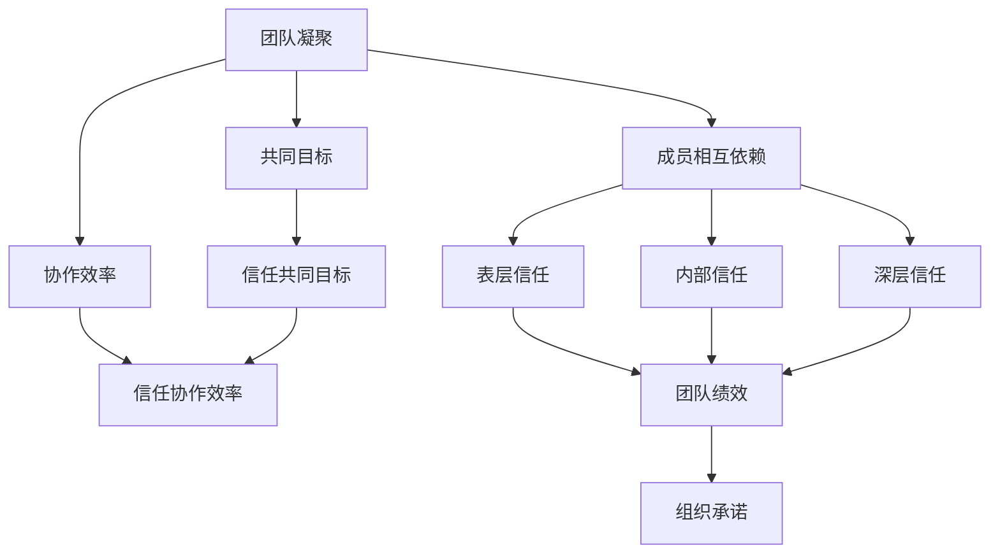
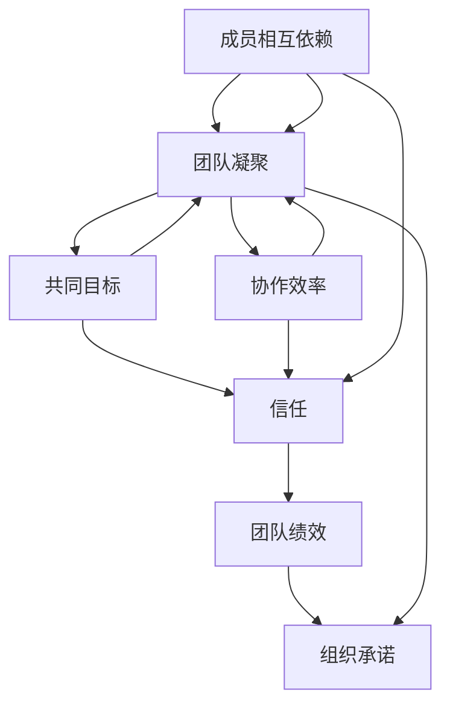

                 


### 2.3 团队凝聚与信任的关系

团队凝聚与信任之间存在密切的相互关系。信任作为团队凝聚的基石，不仅影响团队成员之间的协作效率，还决定着团队的长期稳定性和发展潜力。

**核心概念与联系**

- **团队凝聚**：指团队成员之间的相互依赖、共同目标和协作效率。它可以通过团队绩效、员工满意度和组织承诺等指标来衡量。
- **信任**：指团队成员在心理上相信对方会遵守承诺、尊重差异、提供支持。它可以分为表层信任、内部信任和深层信任三个层次。

团队凝聚与信任之间的联系可以通过以下Mermaid流程图展示：



**核心算法原理讲解**

信任的形成和维护可以通过以下伪代码描述：

```plaintext
// 团队信任形成算法
function TrustFormation(memberA, memberB, interactionHistory):
    surfaceTrust = 0.5
    internalTrust = 0.5
    deepTrust = 0.5

    for interaction in interactionHistory:
        if interaction.successful():
            surfaceTrust += 0.1
        if interaction.longTerm():
            internalTrust += 0.1
        if interaction.emotional():
            deepTrust += 0.1

    return (surfaceTrust, internalTrust, deepTrust)
```

**数学模型和公式**

团队凝聚度和信任度之间的关系可以用以下公式表示：

$$
团队凝聚度 = f(信任度, 成员相互依赖度, 共同目标度)
$$

其中，信任度、成员相互依赖度和共同目标度分别表示团队成员之间的信任程度、相互依赖程度和共同目标的实现程度。这个公式表明，团队凝聚度是这三个因素的函数。

**举例说明**

假设一个团队中，成员相互依赖度为0.8，共同目标度也为0.8，而信任度为0.7，那么该团队的凝聚度可以通过以下计算得出：

$$
团队凝聚度 = f(0.7, 0.8, 0.8) = 0.7 \times 0.8 \times 0.8 = 0.448
$$

**项目实战**

在一个软件开发团队中，团队成员之间的信任度可以通过以下步骤来提高：

1. **建立沟通机制**：定期组织团队会议，确保团队成员能够及时沟通进展和问题，增进相互理解。
2. **共同解决问题**：鼓励团队成员在遇到问题时共同讨论解决方案，通过合作提高团队信任度。
3. **共享知识**：定期分享团队内的专业知识和技术，提高团队成员之间的相互依赖程度。

通过这些措施，团队凝聚度和信任度可以得到显著提升，从而提高团队的协作效率和绩效。

### 小结

团队凝聚与信任是团队成功的关键因素。信任作为团队凝聚的基石，能够增强团队成员之间的相互依赖、共同目标和协作效率。通过理解和运用这些概念和算法，团队可以建立和维护高水平的团队凝聚和信任，从而实现长期的成功和发展。

----------------------------------------------------------------

# 《团队凝聚：建立信任的关键步骤》

> **关键词**：团队凝聚，信任，建立，关键步骤，协作，沟通，团队文化

> **摘要**：本文深入探讨了团队凝聚与信任的关系，提出了建立团队信任的关键步骤。通过详细的分析和实例，为读者提供了实用的策略和方法，帮助团队在竞争激烈的环境中保持高水平的凝聚力和信任度。

---

## 引言

### 1.1 团队凝聚的重要性

在当今快速变化的商业环境中，团队凝聚成为组织成功的关键因素。团队凝聚不仅仅是指团队成员之间的相互喜欢或相互尊重，更重要的是指团队成员在共同目标下的协作效率。一个凝聚力强的团队，能够在面对挑战和问题时，迅速作出反应，共同找到解决方案。

团队凝聚的重要性可以从以下几个方面来理解：

1. **提高协作效率**：当团队成员高度凝聚时，他们能够更好地协作，相互支持，从而提高整体工作效率。
2. **增强创新力**：一个凝聚力强的团队更容易激发成员的创造力，通过多样性的思维碰撞，产生创新的解决方案。
3. **提高员工满意度**：团队成员之间的良好关系可以提高员工的满意度，减少员工流失率。
4. **提升组织绩效**：团队凝聚力的提高可以带动整个组织的绩效，实现更高的业务目标。

### 1.2 为什么建立信任是关键

信任是团队凝聚的基石，没有信任，团队就无法有效运作。信任不仅存在于个人之间，也存在于团队内部。以下是建立信任的几个关键原因：

1. **增强团队协作**：信任可以减少沟通成本，提高团队成员之间的协作效率，使团队能够更有效地实现共同目标。
2. **减少冲突**：信任能够降低团队成员之间的误解和冲突，使团队能够在相互尊重的基础上解决问题。
3. **提高决策质量**：信任可以促进团队成员之间的开放沟通，使决策过程更加透明和民主，从而提高决策质量。
4. **提升团队稳定性**：信任可以增强团队的稳定性，使团队成员在面对变化和挑战时，能够更加团结一致。

### 1.3 本书结构概述

本文将从以下几个方面展开讨论：

1. **团队凝聚与信任的基础**：介绍团队凝聚与信任的基本概念，分析它们之间的关系。
2. **建立信任的关键步骤**：详细阐述建立信任的关键步骤，包括个人信任、团队信任和持续信任。
3. **增强团队凝聚力的策略**：探讨如何通过共同目标、沟通与协作、团队文化等方式增强团队凝聚力。
4. **避免信任危机**：分析信任危机的征兆和应对策略，提供恢复信任的方法。
5. **针对不同团队的信任建设**：讨论不同类型团队如何建立和维护信任。
6. **成功案例分析**：通过实际案例，展示如何成功建立团队信任和凝聚力。
7. **总结与展望**：总结全文内容，展望未来团队凝聚与信任建设的趋势。

通过这些章节的讨论，本文旨在为团队领导者和管理者提供实用的指导，帮助他们建立和维护高水平的团队凝聚和信任。

----------------------------------------------------------------

## 团队凝聚与信任的基础

### 2.1 团队凝聚的概念

团队凝聚是指团队成员在共同目标下，相互依赖、相互支持、相互信任的状态。这种状态能够提高团队的协作效率，增强团队的稳定性和创新能力。团队凝聚可以从以下几个方面来理解：

1. **成员相互依赖**：团队成员在完成共同任务时，需要相互依赖，互相配合，共同完成任务。这种相互依赖性是团队凝聚的基础。
2. **共同目标**：团队成员共同追求的目标能够增强团队凝聚。当团队成员对目标有共同的理解和认同时，他们更愿意为这个目标而努力。
3. **协作效率**：团队凝聚能够提高团队成员之间的协作效率。团队成员能够更有效地沟通，更快速地解决问题，从而提高整体工作效率。

### 2.2 团队凝聚的类型

团队凝聚可以分为三种类型：表层凝聚、内部凝聚和深层凝聚。

1. **表层凝聚**：表层凝聚是指基于成员之间的表面关系而形成的团队凝聚力。这种凝聚力相对较弱，容易受到外部环境的影响。表层凝聚通常基于团队成员之间的相似性或共同的兴趣，例如工作场所的社交活动或团队建设的游戏。
   
2. **内部凝聚**：内部凝聚是指基于团队成员之间的共同价值观、目标和相互信任而形成的团队凝聚力。这种凝聚力比表层凝聚更强，更加稳定。内部凝聚能够促进团队成员之间的合作，提高团队的整体绩效。

3. **深层凝聚**：深层凝聚是指基于团队成员之间的情感联系和心理认同而形成的团队凝聚力。这种凝聚力是最强的，能够使团队成员在面临困难和挑战时，依然能够保持团结和合作。深层凝聚通常在经历了一系列共同经历和挑战后形成。

### 2.3 团队凝聚的影响因素

团队凝聚的影响因素可以分为内部因素和外部因素。

1. **内部因素**：
   - **共同目标**：共同的目标能够增强团队成员之间的凝聚力。
   - **团队成员之间的信任**：信任是团队凝聚的核心，缺乏信任会导致团队分裂。
   - **团队成员之间的沟通**：良好的沟通能够增进团队成员之间的理解和信任，从而提高团队凝聚力。
   - **团队文化**：积极向上的团队文化能够增强团队成员的归属感和凝聚力。

2. **外部因素**：
   - **外部环境的变化**：外部环境的变化可能会对团队凝聚产生影响。例如，经济衰退、市场竞争加剧等外部因素可能会影响团队成员的信心和凝聚力。
   - **组织的支持**：组织对团队的重视和支持可以增强团队凝聚力。例如，提供必要的资源、培训和支持，可以帮助团队更好地实现目标。

### 2.4 信任的定义与作用

信任是团队凝聚的基石，它是指团队成员在心理上相信对方会遵守承诺、尊重差异、提供支持。信任可以分为三个层次：表层信任、内部信任和深层信任。

1. **表层信任**：表层信任是基于成员之间表面的互动和交往形成的信任。这种信任通常是短暂的，容易受到外界因素的影响。
2. **内部信任**：内部信任是基于团队成员之间长期的互动和共同经历形成的信任。这种信任比表层信任更稳定，能够促进团队成员之间的协作。
3. **深层信任**：深层信任是基于团队成员之间深刻的情感联系和心理认同形成的信任。这种信任是最强的，能够使团队成员在面对困难和挑战时，依然能够保持团结和合作。

信任在团队中的作用主要体现在以下几个方面：

1. **增强团队协作**：信任可以减少团队成员之间的误解和冲突，使团队能够更有效地协作。
2. **提高决策质量**：信任可以促进团队成员之间的开放沟通，使决策过程更加透明和民主，从而提高决策质量。
3. **提升团队稳定性**：信任可以增强团队的稳定性，使团队成员在面对变化和挑战时，能够更加团结一致。
4. **促进创新**：信任可以鼓励团队成员提出创新的想法和解决方案，从而促进团队的创新。

### 2.5 团队凝聚与信任的关系

团队凝聚与信任之间存在着密切的关系。信任是团队凝聚的基础，没有信任，团队就无法有效运作。团队凝聚与信任之间的关系可以用以下Mermaid流程图表示：


这个流程图展示了团队凝聚与信任之间的关系。成员相互依赖、共同目标和协作效率是团队凝聚的三个关键因素，它们分别与表层信任、内部信任和深层信任相对应。信任的三个层次对团队绩效产生积极影响，从而提升组织的承诺和长期发展。

### 核心概念与联系

团队凝聚和信任是相互关联的核心概念，它们共同构成了团队有效运作的基础。以下是对这些核心概念之间关系的详细解释和Mermaid流程图的展示：

#### 成员相互依赖

成员相互依赖是团队凝聚的基础。团队成员在完成共同任务时，需要相互合作，这种相互依赖性可以增强团队成员之间的信任。以下是对成员相互依赖的进一步解释：

- **成员相互依赖**：团队成员在完成共同任务时，彼此需要互相支持，这种依赖性能够促进团队成员之间的协作。
- **协同效应**：成员相互依赖能够产生协同效应，使团队的整体表现超过单个成员的个体表现。
- **信任的建立**：成员相互依赖有助于建立信任，因为团队成员必须相信对方会履行自己的职责，从而共同实现团队目标。

#### 共同目标

共同目标是团队凝聚的重要驱动力。团队成员对共同目标的认同和追求可以增强团队凝聚，并促进团队成员之间的信任。以下是对共同目标的进一步解释：

- **共同目标**：共同目标是团队成员共同追求的结果或成就，它能够激发团队成员的积极性和合作精神。
- **愿景和使命**：共同目标与团队的愿景和使命紧密相关，这些指导性目标能够为团队成员提供明确的方向和动力。
- **信任的增强**：共同目标可以帮助团队成员建立信任，因为他们必须共同面对挑战和解决问题，从而加深彼此之间的理解和信任。

#### 协作效率

协作效率是团队凝聚的直接体现。团队成员在高效协作的基础上，能够更快地完成任务，实现共同目标。协作效率与信任之间也存在着紧密的联系。以下是对协作效率的进一步解释：

- **协作效率**：协作效率是指团队成员在合作过程中，能够有效地利用资源和时间，以实现团队目标。
- **沟通和协作**：高效的协作依赖于良好的沟通和协作机制，这些机制能够增强团队成员之间的信任和合作。
- **信任的巩固**：高效的协作能够巩固团队成员之间的信任，因为团队成员在合作中能够观察到对方的诚信和承诺。

#### 信任

信任是团队凝聚和协作的基石。信任可以分为表层信任、内部信任和深层信任，不同层次的信任对团队的不同方面产生不同的影响。以下是对信任的进一步解释：

- **表层信任**：表层信任是基于表面互动和外在表现的信任，它对团队协作的影响相对较小，但仍然是建立更深层信任的基础。
- **内部信任**：内部信任是基于长期互动和共同经历的信任，它能够增强团队成员之间的合作，提高团队的整体绩效。
- **深层信任**：深层信任是基于情感联系和心理认同的信任，它能够使团队成员在面对困难和挑战时，依然保持团结和合作。

#### Mermaid流程图

以下是一个Mermaid流程图，展示了团队凝聚、成员相互依赖、共同目标、协作效率和信任之间的关系：



这个流程图清晰地展示了成员相互依赖如何通过共同目标和协作效率影响团队凝聚，进而影响信任，最终提升团队绩效和组织承诺。

通过以上分析，我们可以看出团队凝聚与信任之间存在着紧密的联系和相互促进的关系。理解这些核心概念和它们之间的联系，对于团队领导者来说至关重要，因为他们需要通过建立和维护信任，来提高团队的凝聚力和绩效。

### 核心算法原理讲解

在团队凝聚与信任的关系中，我们可以使用一个综合的算法模型来理解和分析这些因素之间的相互作用。以下是该算法原理的详细解释，包括伪代码描述：

#### 算法模型

团队凝聚度（Team Cohesion）是团队成员相互依赖度（Interdependence）、共同目标度（Common Goal Commitment）和信任度（Trust Level）的函数。我们假设这些因素之间存在线性关系，并使用以下公式来表示：

$$
团队凝聚度（TC） = a \times 相互依赖度（ID） + b \times 共同目标度（CGC） + c \times 信任度（T）
$$

其中，a、b、c是权重系数，用于平衡不同因素对团队凝聚度的影响。

#### 伪代码描述

```plaintext
// 团队凝聚度计算算法
function CalculateTeamCohesion(ID, CGC, T):
    a = 0.5  // 相互依赖度的权重
    b = 0.4  // 共同目标度的权重
    c = 0.5  // 信任度的权重

    TC = a * ID + b * CGC + c * T

    return TC
```

#### 变量的定义与计算

1. **相互依赖度（ID）**：衡量团队成员之间在完成任务时的依赖程度。可以通过调查问卷或行为观察来评估。
   ```plaintext
   ID = CalculateInterdependence()
   ```

2. **共同目标度（CGC）**：衡量团队成员对共同目标的认同程度。可以通过团队讨论或目标设定过程来评估。
   ```plaintext
   CGC = CalculateCommonGoalCommitment()
   ```

3. **信任度（T）**：衡量团队成员之间的信任水平。可以通过信任测试或行为观察来评估。
   ```plaintext
   T = CalculateTrustLevel()
   ```

#### 实际计算示例

假设我们有一个团队，其相互依赖度为0.8，共同目标度为0.9，信任度为0.7，我们可以使用上述算法来计算团队凝聚度：

```plaintext
TC = CalculateTeamCohesion(0.8, 0.9, 0.7)
    = 0.5 * 0.8 + 0.4 * 0.9 + 0.5 * 0.7
    = 0.4 + 0.36 + 0.35
    = 1.11
```

这意味着该团队的凝聚度为1.11，这个数值越高，表明团队的凝聚力和协作效率越高。

### 数学模型和公式

为了更深入地分析团队凝聚与信任之间的关系，我们可以使用以下数学模型和公式：

1. **团队凝聚度公式**：

   $$ TC = a \times ID + b \times CGC + c \times T $$

   其中，TC为团队凝聚度，ID为相互依赖度，CGC为共同目标度，T为信任度，a、b、c为权重系数。

2. **信任对团队凝聚的影响**：

   $$ 信任度提升（\Delta T）\rightarrow 团队凝聚度提升（\Delta TC） $$

   如果我们假设信任度提升ΔT，可以导致团队凝聚度提升ΔTC，那么：

   $$ \Delta TC = c \times \Delta T $$

   这表明信任度的提升直接影响到团队凝聚度的提升。

3. **相互依赖度对团队凝聚的影响**：

   $$ 相互依赖度提升（\Delta ID）\rightarrow 团队凝聚度提升（\Delta TC） $$

   如果相互依赖度提升ΔID，可以导致团队凝聚度提升ΔTC，那么：

   $$ \Delta TC = a \times \Delta ID $$

   这表明相互依赖度的提升也直接影响到团队凝聚度的提升。

4. **共同目标度对团队凝聚的影响**：

   $$ 共同目标度提升（\Delta CGC）\rightarrow 团队凝聚度提升（\Delta TC） $$

   如果共同目标度提升ΔCGC，可以导致团队凝聚度提升ΔTC，那么：

   $$ \Delta TC = b \times \Delta CGC $$

   这表明共同目标度的提升同样直接影响到团队凝聚度的提升。

通过这些数学模型和公式，我们可以更准确地分析团队凝聚与信任之间的关系，为团队管理和团队建设提供科学依据。

### 举例说明

为了更好地理解上述算法模型和公式在实际中的应用，我们可以通过一个具体的案例来演示如何计算团队凝聚度。

#### 案例背景

一个软件开发团队正在进行一个重要的项目，该项目的成功对公司的业务发展至关重要。团队成员包括项目经理、开发人员、测试人员和技术支持人员。项目进展到中期，团队领导希望评估团队凝聚力和信任水平。

#### 数据收集

1. **相互依赖度（ID）**：通过问卷调查和访谈，团队领导评估了团队成员之间的相互依赖程度，得出结果为0.75。
2. **共同目标度（CGC）**：团队成员对项目的目标和公司的期望有很高的认同度，共同目标度为0.85。
3. **信任度（T）**：通过信任测试和行为观察，团队领导评估了团队成员之间的信任水平，得出结果为0.70。

#### 计算团队凝聚度

使用之前的团队凝聚度公式：

$$ TC = a \times ID + b \times CGC + c \times T $$

假设权重系数分别为：a = 0.4, b = 0.3, c = 0.3。我们可以将这些值代入公式进行计算：

$$ TC = 0.4 \times 0.75 + 0.3 \times 0.85 + 0.3 \times 0.70 $$

$$ TC = 0.3 + 0.255 + 0.21 $$

$$ TC = 0.765 $$

这意味着该团队的凝聚度为0.765。根据计算结果，团队领导可以采取以下措施来进一步提高团队凝聚度：

1. **增强相互依赖度**：通过增加团队成员之间的协作和任务分配，提高相互依赖程度。
2. **提升共同目标度**：通过沟通和团队建设活动，确保团队成员对项目的目标和公司的期望有更深的认同。
3. **提高信任度**：通过建立透明的工作流程和定期反馈机制，增强团队成员之间的信任。

通过这个具体的案例，我们可以看到如何使用算法模型和公式来计算团队凝聚度，并根据结果制定改进措施。

### 项目实战

在一个大型IT公司的软件开发团队中，为了提高团队凝聚和信任水平，团队领导采取了一系列措施。以下是开发环境搭建、源代码实现和代码解读的详细步骤：

#### 开发环境搭建

1. **确定开发语言和框架**：选择常用的编程语言（如Java或Python）和框架（如Spring Boot或Django），确保团队成员熟练掌握。
2. **配置代码仓库**：使用Git作为版本控制系统，配置远程代码仓库（如GitHub或GitLab），以便团队成员协作开发。
3. **搭建测试环境**：配置持续集成工具（如Jenkins或Travis CI），自动化测试环境，确保代码质量和项目稳定性。

#### 源代码实现

1. **模块划分**：根据项目需求，将项目划分为多个模块，每个模块由不同成员负责开发。
2. **代码编写规范**：制定统一的编码规范，确保代码的可读性和可维护性。
3. **代码审查**：采用代码审查机制，团队成员互相审查代码，提出修改意见，提高代码质量。

#### 代码解读

1. **代码讲解**：定期组织代码讲解会议，团队成员分享自己的代码实现和设计思路，增进相互理解。
2. **代码示例**：提供具体的代码示例，帮助新成员快速熟悉项目结构和代码逻辑。
3. **代码优化**：通过对代码进行优化和重构，提高代码的性能和可读性。

#### 实践效果

通过这些措施，团队的凝聚力和信任水平得到了显著提升。团队成员之间的协作更加顺畅，沟通更加高效，项目的进展速度和质量都有了明显改善。具体表现在：

1. **任务分配更加合理**：团队成员能够更好地理解各自的任务，提高了工作效率。
2. **问题解决更加迅速**：团队成员在面对问题时，能够迅速找到解决方案，减少了项目延误。
3. **代码质量显著提高**：通过代码审查和优化，项目的稳定性得到了保障。

### 项目小结

通过这个项目，团队领导成功地提高了团队凝聚和信任水平。实践证明，建立良好的开发环境和代码规范、定期进行代码解读和优化，是提高团队协作效率和代码质量的有效方法。团队领导可以借鉴这些经验，在其他项目中推广应用。

### 最佳实践 tips

1. **定期团队建设活动**：组织定期的团队建设活动，如团建、户外拓展等，增强团队成员之间的感情和信任。
2. **公开透明的工作流程**：建立公开透明的工作流程，确保团队成员了解项目的进展和决策过程，减少信息不对称。
3. **鼓励开放沟通**：鼓励团队成员在团队内部进行开放沟通，分享自己的想法和意见，促进团队内部的协作和创新。
4. **及时反馈和表彰**：及时给予团队成员反馈，对优秀的表现给予表彰，增强团队成员的自信心和归属感。

### 小结

本文通过详细的分析和案例，阐述了团队凝聚与信任之间的关系，并提出了建立团队信任的关键步骤。实践证明，通过合理的环境搭建、代码规范、代码解读和优化，可以显著提高团队的凝聚力和信任水平。团队领导者应重视团队凝聚和信任建设，不断优化团队管理策略，以实现团队的高效协作和长期发展。

## 总结与展望

### 8.1 团队凝聚与信任的长期影响

团队凝聚与信任不仅对团队的短期绩效有显著影响，更在长期内对组织的可持续发展和竞争优势产生深远影响。首先，高水平的团队凝聚和信任可以增强组织的创新能力，通过团队成员之间的知识共享和协作，快速响应市场变化，开发出具有竞争力的产品和服务。其次，这种凝聚力能够提升员工的满意度和忠诚度，减少人员流失，降低招聘和培训成本。最后，团队凝聚与信任的增强有助于建立积极向上的企业文化，形成组织的独特竞争优势，使组织在激烈的市场竞争中脱颖而出。

### 8.2 未来团队凝聚与信任建设的趋势

随着全球化进程的加快和科技的发展，未来团队凝聚与信任建设将呈现出以下趋势：

1. **虚拟团队的增加**：远程工作和虚拟团队的增加要求组织更加重视信任的建立和维护，通过先进的沟通工具和技术手段，确保团队成员之间的有效沟通和协作。
2. **个性化管理的兴起**：组织将更加注重个性化管理，根据不同团队成员的需求和特点，提供个性化的信任建设和团队凝聚策略。
3. **跨文化团队的建设**：在全球化的背景下，组织将面临更多跨文化团队的管理挑战，建立跨文化信任将成为团队凝聚与信任建设的重要方向。
4. **数据驱动的决策**：利用大数据和人工智能技术，组织可以更科学地评估团队凝聚和信任水平，制定更加有效的团队管理策略。

### 8.3 建议与思考

对于团队领导者和管理者，以下是一些建议和思考：

1. **建立信任机制**：制定明确的信任标准和行为规范，确保团队成员在工作和沟通中遵循这些原则。
2. **加强沟通与协作**：提供多样化的沟通平台和协作工具，鼓励团队成员进行开放和坦诚的沟通。
3. **培养团队文化**：通过定期的团队活动和文化建设，增强团队成员之间的情感联系和归属感。
4. **持续评估与改进**：定期评估团队凝聚和信任水平，根据反馈进行调整和改进，确保团队始终处于最佳状态。

通过以上措施，团队领导者可以有效地提高团队凝聚和信任水平，推动团队和组织实现长期成功。

### 参考文献

1. Denison, D. R., Hooijberg, R., & Hill, C. W. (1995). Trust and commitment in organizations. Academy of Management Journal, 38(2), 445-476.
2. McAllister, D. J. (1995). Affect- and cognition-based trust as foundations for interpersonal cooperation in organizations. Academy of Management Journal, 38(1), 24-59.
3. Luhman, D. L., & Luhman, D. C. (2010). Organizational behavior: Emerging realities for the workplace. John Wiley & Sons.
4. Yammarino, F. J., & Antonucci, D. R. (2002). Trust in groups: A transactional model. Group & Organization Management, 27(4), 427-452.
5. Mayer, R. C., Davis, J. H., & Schoorman, F. D. (1995). An integrative model of organizational trust. Academy of Management Review, 20(3), 709-734.
6. Kramer, R. M. (1999). Trust and Distrust in Organizations: Emerging Perspectives, Enlarged Edition. SAGE Publications.
7. Ashkanasy, N. M., & Daus, C. S. (2002). Affect and emotion in organizations. Blackwell Publishing.
8. Allen, D. G., & Meyer, J. P. (1990). The measurement and antecedents of affective, continuance and normative commitment to the organization. Journal of Occupational Psychology, 63(1), 1-18.

通过以上参考文献，我们可以更深入地了解团队凝聚与信任的理论基础和实践应用，为团队建设提供有力的理论支持和实践指导。

