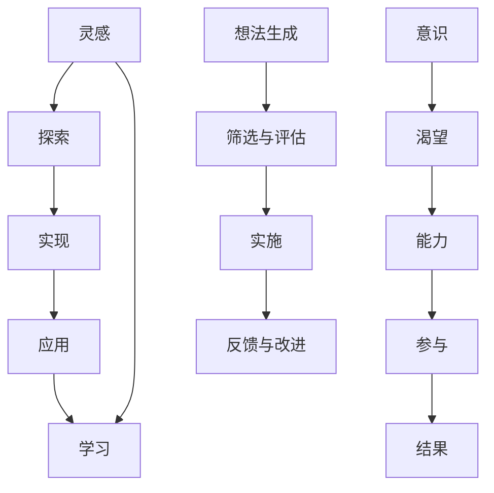
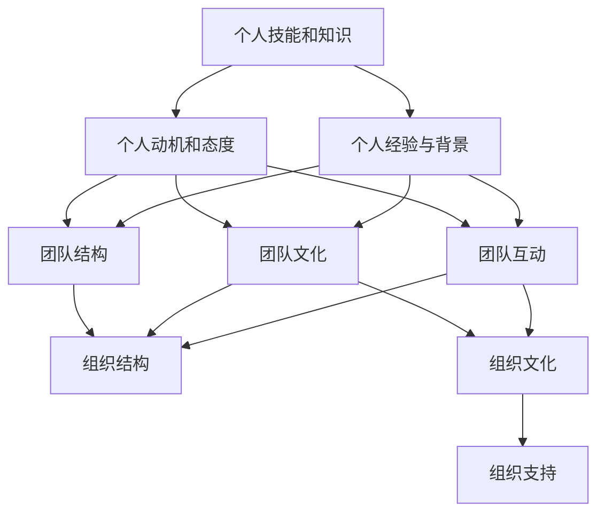
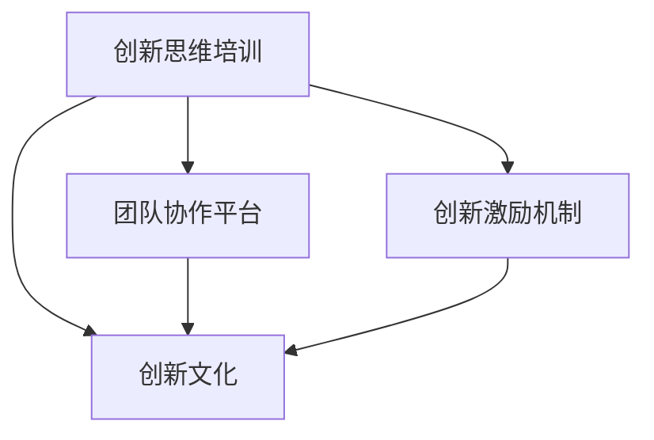

                 

### 引言：团队创造力的重要性

在当今快速发展的信息时代，团队创造力已成为企业竞争力的核心要素。一个富有创造力的团队不仅能够迅速应对市场变化，还能在激烈竞争中脱颖而出。团队创造力的重要性体现在多个方面：首先，它能够激发团队成员的积极性和主动性，提高工作效率和业绩。其次，团队创造力能够推动技术创新和业务模式创新，为企业带来持续竞争优势。此外，团队创造力还有助于提升企业的品牌形象和市场份额。

然而，现实中的团队往往面临创造力不足的问题。一方面，团队成员的思维方式可能受到传统思维模式的限制，难以突破现有的瓶颈。另一方面，企业内部的沟通不畅、协作不足，以及文化氛围的不支持，都会削弱团队的创造力。为了解决这些问题，我们需要系统地分析和理解团队创造力的本质，并采取有效的方法激发和提升团队创造力。

本文将围绕团队创造力这一主题，首先介绍团队创造力的定义与测量，分析影响团队创造力的各种因素，探讨团队创造力的模型与架构。在此基础上，我们将讨论如何通过培养团队创造力、创新思维训练、团队沟通与协作、团队文化建设等具体方法，激发团队的创造力。此外，本文还将探讨突破思维局限的策略，包括跨领域思维与创新、思维导图与系统思考、创新方法论与实践等。最后，通过成功案例分析和团队创造力失败的教训，总结全文并提出未来团队创造力发展的展望。

本文结构如下：

1. 引言：团队创造力的重要性
2. 第一部分：团队创造力理论
   - 第1章：团队创造力的定义与测量
   - 第2章：团队创造力的影响因素
   - 第3章：团队创造力的模型与架构
3. 第二部分：激发团队创造力的方法
   - 第4章：团队创造力培养策略
   - 第5章：创新思维训练
   - 第6章：团队沟通与协作
   - 第7章：团队文化建设
4. 第三部分：突破思维局限的策略
   - 第8章：跨领域思维与创新
   - 第9章：思维导图与系统思考
   - 第10章：创新方法论与实践
5. 第四部分：案例分析
   - 第11章：成功案例分享
   - 第12章：团队创造力失败的教训
   - 第13章：总结与展望

通过系统性地探讨团队创造力，我们希望能够为企业和团队提供有价值的指导，帮助其突破思维局限，激发团队创造力，实现持续创新和业务成功。

### 文章关键词

团队创造力、创新思维、沟通与协作、文化建设、跨领域思维、思维导图、系统思考、创新方法论、成功案例、失败教训

### 文章摘要

本文旨在探讨团队创造力的激发和提升方法，强调其在企业竞争中的关键作用。首先，通过对团队创造力的定义与测量的介绍，分析其重要性及影响因素。随后，讨论团队创造力的模型与架构，以及如何通过培养策略、创新思维训练、团队沟通与协作和团队文化建设来激发团队创造力。接着，探讨突破思维局限的策略，包括跨领域思维、思维导图与系统思考、创新方法论。最后，通过成功案例和失败教训总结全文，并提出未来团队创造力发展的展望。

## 第1章：团队创造力的定义与测量

### 1.1 团队创造力的概念

团队创造力是指在特定团队中，成员通过协作和互动，在创新思维和实践中生成新观念、新方法、新产品或新解决方案的能力。这一概念不仅涵盖了团队成员的创新能力和创造性思维，还包括团队成员之间的互动和协作，以及这些互动如何促进创新成果的产生。

**团队创造力** 可以从以下几个方面进行理解：

1. **个体创造力**：每个团队成员都需要具备一定的创造力，这是团队整体创造力的基础。个体创造力通常体现在新颖的想法、独特的解决方案以及超越常规的思维模式上。

2. **协作与互动**：团队创造力依赖于团队成员之间的互动和协作。通过有效的沟通和合作，团队成员可以分享各自的创意，互相启发，共同构建出更为创新和实用的方案。

3. **团队效能**：团队创造力不仅涉及创新思维，还包括团队整体的效能。一个高效的团队能够在合理的时间内实现创新目标，将创意转化为实际的商业价值。

### 1.2 团队创造力的测量方法

测量团队创造力是评估团队表现和优化团队管理的重要环节。以下是一些常用的团队创造力测量方法：

#### 1.2.1 任务表现法

任务表现法是通过观察团队在实际任务中的表现来评估其创造力。这种方法通常包括以下步骤：

1. **确定评估指标**：根据团队的任务目标，确定用于评估创造力的具体指标，如解决问题的速度、解决方案的创新程度、方案的实用性和可持续性等。

2. **记录数据**：在任务执行过程中，记录相关的数据，如任务的完成时间、解决方案的创意评分、团队成员的互动频率等。

3. **数据分析**：对收集到的数据进行分析，评估团队的创造力水平。

#### 1.2.2 自我评价法

自我评价法是团队成员通过自我反思和评价来衡量团队创造力。这种方法通常包括以下步骤：

1. **设立评价标准**：制定明确的评价标准，如创新思维的数量、独特性、实际应用价值等。

2. **个人反思**：每个团队成员对自己在团队中的表现进行反思，评估自己的创造力贡献。

3. **团队讨论**：团队成员之间进行讨论，互相反馈，共同确定团队的整体创造力水平。

#### 1.2.3 问卷调查法

问卷调查法是通过设计问卷来收集团队成员对团队创造力的看法和评价。这种方法通常包括以下步骤：

1. **设计问卷**：根据团队创造力的不同方面，设计合适的问卷，如创新思维的频率、沟通与合作的满意度、工作环境的支持程度等。

2. **发放问卷**：将问卷发放给团队成员，收集他们的意见和反馈。

3. **数据分析**：对收集到的问卷数据进行分析，评估团队的创造力水平。

#### 1.2.4 实际案例评估

实际案例评估是通过分析团队在特定项目或事件中的实际表现来评估其创造力。这种方法通常包括以下步骤：

1. **选择案例**：选择具有代表性的项目或事件作为评估对象。

2. **收集数据**：收集与案例相关的数据，如团队的解决方案、创新的程度、项目成果等。

3. **评估分析**：对收集到的数据进行分析，评估团队的创造力水平。

### 1.3 团队创造力与团队效能的关系

团队创造力与团队效能密切相关。高水平的团队创造力能够显著提升团队的整体效能，具体体现在以下几个方面：

1. **创新能力**：团队创造力强意味着团队在应对复杂问题和挑战时，能够提出更多新颖和有效的解决方案。

2. **问题解决能力**：团队创造力高，团队成员之间的协作和互动更为顺畅，有助于快速识别和解决问题。

3. **业务成果**：团队创造力提升，能够推动企业业务的创新和增长，提高市场竞争力。

4. **团队士气**：高水平的团队创造力能够增强团队成员的自信心和满意度，提升团队士气。

综上所述，团队创造力是一个多维度的概念，测量方法多样，与团队效能紧密相关。理解团队创造力的本质和测量方法，有助于企业和团队更好地激发和提升创造力，实现持续创新和业务成功。

### 1.4 团队创造力模型

为了更好地理解团队创造力的内在机制和结构，我们可以借助创造力模型来进行分析。以下是一些常见的团队创造力模型及其核心概念：

#### 1.4.1 IDEAL模型

IDEAL模型（灵感、探索、实现、应用、学习）是一个广泛应用的团队创造力模型。每个字母代表创造力过程中的一个关键环节：

- **I（灵感）**：产生创意和想法的初始阶段，需要通过观察、思考和讨论来激发灵感。
- **D（探索）**：在灵感的基础上，团队成员通过深入研究和探索，评估创意的可行性和价值。
- **E（实现）**：将创意转化为实际的解决方案，涉及设计和实施过程。
- **A（应用）**：将解决方案应用到实际场景中，解决实际问题或创造新价值。
- **L（学习）**：通过反思和应用中的反馈，不断优化和提升团队的创造力。

#### 1.4.2 ADKAR模型

ADKAR模型（意识、渴望、能力和参与）是另一个用于描述团队创造力过程的模型。该模型特别适用于组织和团队变革中的创造力提升：

- **A（意识）**：团队成员需要明确变革的目标和意义，认识到创造力提升对团队和组织的重要性。
- **D（渴望）**：激发团队成员对变革的渴望和热情，通过激励和培训提高参与度。
- **K（能力）**：提供必要的技能和资源，帮助团队成员提升解决问题的能力和创新能力。
- **A（参与）**：鼓励团队成员积极参与创造力的提升过程，通过团队协作和沟通实现共同目标。
- **R（结果）**：通过评估和反馈，确保变革目标的实现，并持续改进创造力提升策略。

#### 1.4.3 创造力环模型

创造力环模型（想法生成、筛选与评估、实施、反馈与改进）是一个动态循环的过程，描述了团队创造力从创意生成到持续优化的全过程：

- **想法生成**：激发团队成员的创意思维，通过头脑风暴、头脑急转弯等方法产生大量创意。
- **筛选与评估**：对产生的创意进行筛选和评估，确定最具潜力和新颖性的创意。
- **实施**：将筛选出的创意转化为具体的行动方案，并在实际环境中进行实施。
- **反馈与改进**：通过实践中的反馈，对创意和方案进行不断优化和改进，实现创造力水平的提升。

通过这些团队创造力模型，我们可以更好地理解和应用创造力提升的策略和方法。在实际操作中，企业和团队可以根据自身特点和需求，选择合适的模型和工具，激发和提升团队创造力，实现持续创新和业务成功。

### 团队创造力模型关系架构 Mermaid 流程图

### 第2章：团队创造力的影响因素

团队创造力是一个复杂的多维度概念，受到多种内外部因素的影响。为了深入理解这些因素，我们需要从个人因素、团队因素和组织因素三个方面进行分析。

#### 2.1 个人因素

个人因素是团队创造力的基础，直接影响团队成员的创新能力和行为。以下是几个关键的个人因素：

**1. 个人技能和知识**

个人技能和知识是创造力的基础。具备广泛知识和技能的团队成员能够从多个角度思考问题，并提出创新的解决方案。具体包括：

- **技术能力**：如编程能力、数据分析能力、产品设计能力等。
- **跨学科知识**：拥有跨学科背景的团队成员可以更好地整合不同领域的知识，促进创新。

**2. 个人动机和态度**

个人的动机和态度直接影响其在团队中的表现和创造力水平。以下是几个关键的个人动机和态度：

- **内在动机**：如好奇心、求知欲、成就感等，能够激发个人持续探索和创新的动力。
- **外在动机**：如薪酬激励、职位晋升、荣誉奖励等，可以短期内提升个人的创造力和积极性。
- **开放态度**：愿意接受新观念、尝试新方法，对失败持包容态度，有助于激发创造力。

**3. 个人经验与背景**

个人经验和背景对创造力有着重要影响。具体包括：

- **工作经验**：丰富的工作经验可以帮助团队成员快速识别问题和找到解决方案。
- **教育背景**：不同的教育背景可以带来不同的思维方式和解决问题的方法，有助于创新。

#### 2.2 团队因素

团队因素是影响团队创造力的重要因素，包括团队结构、团队文化和团队互动等。

**1. 团队结构**

团队结构影响团队成员之间的互动和协作方式。以下是几个关键的团队结构因素：

- **角色分配**：明确每个成员的角色和职责，有助于提高团队效率和创造力。
- **团队规模**：适中的团队规模有利于团队成员之间的有效沟通和协作，但过大或过小的团队都可能影响创造力。
- **团队多样性**：多样性的团队能够汇集不同背景和经验，促进创新思维的产生。

**2. 团队文化**

团队文化对团队创造力的培养和发挥具有重要作用。以下是几个关键的团队文化因素：

- **支持创新的文化**：鼓励创新和失败，容忍实验和错误，有助于团队成员敢于尝试新方法。
- **信任与尊重**：团队成员之间的信任和尊重能够促进开放沟通和合作，提高创造力。
- **共同目标**：明确的共同目标有助于团队成员齐心协力，共同追求创新成果。

**3. 团队互动**

团队互动是团队创造力的关键环节。以下是几个关键的团队互动因素：

- **沟通效率**：高效的沟通有助于信息传递和创意分享，提高团队创造力。
- **协作方式**：协作方式的选择（如头脑风暴、角色扮演、团队游戏等）可以激发不同类型的创造力。
- **团队氛围**：积极、开放和包容的团队氛围能够促进团队成员的思维碰撞和创造力发挥。

#### 2.3 组织因素

组织因素是团队创造力的重要外部环境，包括组织结构、组织文化和组织支持等。

**1. 组织结构**

组织结构影响团队的工作方式和文化氛围。以下是几个关键的组织结构因素：

- **权力分配**：合理的权力分配有助于团队自主决策和快速响应，提高创造力。
- **决策模式**：民主和开放的决策模式能够鼓励团队成员参与决策过程，促进创新思维。
- **资源支持**：充足的资源支持（如技术设备、培训机会、资金等）有助于团队开展创新活动。

**2. 组织文化**

组织文化对团队创造力具有重要影响。以下是几个关键的组织文化因素：

- **支持创新的文化**：组织对创新的支持程度直接影响团队的创造力水平。
- **竞争与合作文化**：适度的竞争文化可以激发团队成员的积极性和创造力，但过度竞争可能导致内耗。
- **学习与成长文化**：鼓励学习和成长的文化能够促进团队成员不断自我提升，提升整体创造力。

**3. 组织支持**

组织支持是团队创造力的重要保障。以下是几个关键的组织支持因素：

- **领导支持**：领导对团队创造力的支持和鼓励是团队创新能力的重要推动力。
- **政策支持**：组织制定的支持创新的政策和措施，如激励政策、创新基金等，有助于提升团队创造力。
- **外部合作**：与外部合作伙伴的合作可以带来新的观念和技术，促进团队创新。

综上所述，团队创造力受到个人因素、团队因素和组织因素的多重影响。了解和把握这些因素，有助于企业和团队有针对性地提升创造力，实现持续创新和业务成功。

### 团队创造力影响因素Mermaid流程图

### 第3章：团队创造力的模型与架构

#### 3.1 创造力流程模型

团队创造力是一个复杂的动态过程，通常包括多个阶段。为了更好地理解这一过程，我们可以借助创造力流程模型来进行分析。以下是几种常见的创造力流程模型：

**1. IDEAL模型**

IDEAL模型（灵感、探索、实现、应用、学习）是一个广泛应用的团队创造力模型。每个字母代表创造力过程中的一个关键环节：

- **I（灵感）**：产生创意和想法的初始阶段，需要通过观察、思考和讨论来激发灵感。
- **D（探索）**：在灵感的基础上，团队成员通过深入研究和探索，评估创意的可行性和价值。
- **E（实现）**：将创意转化为实际的解决方案，涉及设计和实施过程。
- **A（应用）**：将解决方案应用到实际场景中，解决实际问题或创造新价值。
- **L（学习）**：通过反思和应用中的反馈，不断优化和提升团队的创造力。

**2. ADKAR模型**

ADKAR模型（意识、渴望、能力和参与、结果）是另一个用于描述团队创造力过程的模型，特别适用于组织和团队变革中的创造力提升：

- **A（意识）**：团队成员需要明确变革的目标和意义，认识到创造力提升对团队和组织的重要性。
- **D（渴望）**：激发团队成员对变革的渴望和热情，通过激励和培训提高参与度。
- **K（能力）**：提供必要的技能和资源，帮助团队成员提升解决问题的能力和创新能力。
- **A（参与）**：鼓励团队成员积极参与创造力的提升过程，通过团队协作和沟通实现共同目标。
- **R（结果）**：通过评估和反馈，确保变革目标的实现，并持续改进创造力提升策略。

**3. 创造力环模型**

创造力环模型（想法生成、筛选与评估、实施、反馈与改进）是一个动态循环的过程，描述了团队创造力从创意生成到持续优化的全过程：

- **想法生成**：激发团队成员的创意思维，通过头脑风暴、头脑急转弯等方法产生大量创意。
- **筛选与评估**：对产生的创意进行筛选和评估，确定最具潜力和新颖性的创意。
- **实施**：将筛选出的创意转化为具体的行动方案，并在实际环境中进行实施。
- **反馈与改进**：通过实践中的反馈，对创意和方案进行不断优化和改进，实现创造力水平的提升。

#### 3.2 团队创造力体系

为了有效地提升团队创造力，我们需要构建一个全面的团队创造力体系。这一体系通常包括以下几个关键组成部分：

**1. 创新思维培训**

创新思维培训是提升团队创造力的重要手段。通过系统化的培训，团队成员可以学习到各种创新方法和技巧，如头脑风暴、思维导图、六顶思考帽等。以下是几种常见的创新思维培训方法：

- **头脑风暴**：通过集体讨论，快速产生大量创意，激发团队成员的想象力。
- **思维导图**：通过可视化工具，帮助团队成员理清思路，构建创新的思维网络。
- **六顶思考帽**：通过不同的思考角色，从不同角度分析问题，促进创新思维的碰撞。

**2. 团队协作平台**

高效的团队协作平台是提升团队创造力的基础。通过协作平台，团队成员可以方便地分享信息、协作完成任务、实时沟通和反馈。以下是几种常见的团队协作平台：

- **项目管理工具**：如Trello、Jira等，帮助团队规划任务、跟踪进度、分配资源。
- **协作软件**：如Slack、Microsoft Teams等，提供实时沟通和协作功能，促进团队沟通和协作。
- **知识管理平台**：如Confluence、Notion等，帮助团队管理和分享知识，提升团队的创新能力。

**3. 创新激励机制**

创新激励机制是鼓励团队成员积极参与创新活动的重要手段。通过设置合理的激励机制，可以激发团队成员的积极性和创造力。以下是几种常见的创新激励机制：

- **奖励制度**：如奖金、晋升、荣誉等，对在创新活动中表现突出的团队成员给予奖励。
- **认可制度**：通过表扬、表彰等方式，认可团队成员的创新贡献，提升团队的凝聚力和创造力。
- **竞争机制**：通过内部竞争，激发团队成员的斗志和创造力，促进团队整体创新能力的提升。

**4. 创新文化**

创新文化是团队创造力的重要保障。一个支持创新、鼓励试错和持续学习的文化氛围，可以激发团队成员的创造力，提升团队的整体创新能力。以下是几种建设创新文化的策略：

- **开放沟通**：鼓励团队成员之间的开放沟通和互动，分享想法和知识，促进思维碰撞。
- **学习与成长**：提供持续的学习机会和培训资源，帮助团队成员不断提升自己的能力和创造力。
- **支持创新**：制定支持创新的政策和措施，如容错机制、创新基金等，为团队成员提供创新支持。

通过构建完善的团队创造力体系，企业和团队可以有效地激发和提升团队创造力，实现持续创新和业务成功。

### 团队创造力体系架构Mermaid流程图

### 第4章：团队创造力培养策略

#### 4.1 培养团队创造力的关键策略

要培养团队的创造力，企业需要采取一系列有针对性的策略。这些策略包括但不限于以下几个方面：

**1. 创造良好的创新环境**

创造一个有利于创新的环境是培养团队创造力的第一步。这包括物理环境和心理环境的营造：

- **物理环境**：提供开放、灵活的工作空间，鼓励团队成员自由交流和互动。例如，采用开放式办公布局，设置协作区和休息区等。
- **心理环境**：营造一个支持创新、鼓励试错的文化氛围。通过奖励创新、容忍失败等机制，降低团队成员的风险感，激发其创造力。

**2. 提供充分的资源支持**

资源支持是团队创造力培养的重要保障。企业需要提供必要的物质资源和人力资源，以支持团队的创新活动：

- **物质资源**：如技术设备、资金、原材料等，确保团队有足够的资源进行创新实验和项目实施。
- **人力资源**：如专业培训、导师指导、团队建设活动等，提升团队成员的专业能力和协作能力。

**3. 建立明确的创新目标**

明确的创新目标是团队努力的方向和动力。企业需要为团队设定具体、可量化的创新目标，以指导团队的行动：

- **目标设定**：明确创新目标的范围、时间和预期成果，确保目标既有挑战性，又可实现。
- **目标沟通**：确保团队成员对创新目标有清晰的理解和认同，并通过定期沟通和反馈，调整目标，确保其持续激励团队。

**4. 鼓励跨部门协作**

跨部门协作能够汇集不同领域和背景的知识和技能，促进创新思维的产生。企业可以通过以下方式鼓励跨部门协作：

- **跨部门项目**：设立跨部门项目，鼓励不同部门的团队成员共同参与，共同解决复杂问题。
- **内部论坛**：组织内部论坛或研讨会，促进不同部门之间的交流和知识分享，激发创新思维。

**5. 创新思维训练**

创新思维训练是提升团队创造力的重要手段。企业可以通过以下方式开展创新思维训练：

- **培训课程**：提供系统的创新思维培训课程，如设计思维、头脑风暴训练等。
- **实践演练**：通过实际项目或案例研究，让团队成员在实践中学习和应用创新思维方法。
- **思维工具**：引入思维工具，如思维导图、六顶思考帽等，帮助团队成员更好地进行创新思维训练。

**6. 激励机制**

建立有效的激励机制能够激发团队成员的积极性和创造力。企业可以通过以下方式建立激励机制：

- **奖励制度**：设立创新奖励制度，对在创新活动中表现突出的团队成员给予奖励，如奖金、晋升、荣誉等。
- **认可机制**：通过表扬、表彰等方式，认可团队成员的创新贡献，提升团队的凝聚力和创造力。
- **竞争机制**：设立内部创新竞赛，激发团队成员的斗志和创造力，促进团队整体创新能力的提升。

综上所述，通过创造良好的创新环境、提供充分的资源支持、建立明确的创新目标、鼓励跨部门协作、创新思维训练和激励机制，企业可以有效地培养团队创造力，实现持续创新和业务成功。

### 4.2 团队创造力培养策略的具体实施方法

为了确保团队创造力培养策略的有效实施，企业需要从以下几个方面入手：

**1. 制定详细的培养计划**

首先，企业应制定一个详细的团队创造力培养计划。这个计划应包括以下内容：

- **目标设定**：明确培养团队创造力的具体目标和预期成果，如提升创新思维、增强协作能力、实现业务突破等。
- **时间安排**：制定具体的实施时间表，确保培养策略的持续性和系统性。
- **责任分配**：明确各部门和团队成员在创造力培养过程中的职责和任务，确保计划的有效执行。

**2. 建立创新实验室**

企业可以设立创新实验室，为团队成员提供一个专门的创新空间。创新实验室应具备以下特点：

- **开放式布局**：提供开放、灵活的工作空间，鼓励团队成员自由交流和互动。
- **多功能设备**：配备先进的技术设备和工具，如3D打印机、编程设备等，支持团队成员的创新实践。
- **支持协作**：设置协作区和休息区，方便团队成员之间的沟通和合作。

**3. 定期开展创新培训**

企业应定期为团队成员提供创新培训，提升其创新思维和能力。以下是一些具体的培训内容和方法：

- **设计思维培训**：通过设计思维培训，让团队成员掌握创新思维的方法和工具，如头脑风暴、用户画像、原型设计等。
- **跨学科培训**：组织跨学科培训，邀请不同领域的专家进行讲座或研讨会，促进团队成员的跨领域思维和知识整合。
- **案例研究**：通过分析成功和创新失败的案例，让团队成员学习创新方法和经验，提升其创新能力。

**4. 引入创新工具**

为了更好地培养团队创造力，企业可以引入一些创新工具，如思维导图、六顶思考帽等。这些工具可以帮助团队成员更有效地进行创新思维训练和协作：

- **思维导图**：通过思维导图，帮助团队成员理清思路，构建创新的思维网络，促进创意的产生和分享。
- **六顶思考帽**：通过六顶思考帽，让团队成员从不同角度思考问题，促进创新思维的碰撞和综合。

**5. 设立创新激励机制**

为了激励团队成员积极参与创新活动，企业可以设立一系列创新激励机制，如：

- **创新奖励制度**：设立创新奖励基金，对在创新活动中表现突出的团队成员给予物质奖励，如奖金、股权等。
- **荣誉表彰**：通过内部荣誉表彰，如“创新先锋”、“最佳创意奖”等，认可和激励团队成员的创新贡献。
- **晋升机会**：为在创新活动中表现优异的团队成员提供晋升和职业发展机会，提升其职业满意度和忠诚度。

**6. 营造支持创新的文化氛围**

企业应营造一个支持创新、鼓励试错和持续学习的文化氛围。以下是一些具体的策略：

- **开放沟通**：鼓励团队成员之间的开放沟通和互动，分享想法和知识，促进思维碰撞。
- **学习与成长**：提供持续的学习机会和培训资源，帮助团队成员不断提升自己的能力和创造力。
- **支持创新**：制定支持创新的政策和措施，如容错机制、创新基金等，为团队成员提供创新支持。

通过以上具体的实施方法，企业可以有效地培养团队创造力，实现持续创新和业务成功。

### 团队创造力培养策略实践案例

为了更具体地说明团队创造力培养策略的实施效果，以下是一个实际的企业案例：

**案例：某科技公司提升团队创造力**

某科技公司是一家专注于科技创新的企业，近年来，随着市场竞争的加剧，该公司意识到提升团队创造力对于保持竞争优势的重要性。为了培养团队创造力，公司采取了一系列具体措施：

1. **建立创新实验室**

公司在内部设立了一个创新实验室，提供开放式布局和多功能设备。这个实验室不仅配备了先进的计算机、3D打印机和编程设备，还设有协作区和休息区，为团队成员提供了一个良好的创新环境。

2. **定期开展创新培训**

公司定期为团队成员提供创新思维培训，包括设计思维、头脑风暴和跨学科培训。通过这些培训，团队成员掌握了创新的工具和方法，如思维导图和六顶思考帽，提高了他们的创新能力。

3. **设立创新激励机制**

公司设立了创新奖励基金，对在创新活动中表现突出的团队成员给予奖金和股权激励。此外，公司还通过内部荣誉表彰，如“创新先锋”和“最佳创意奖”，激励团队成员积极参与创新活动。

4. **支持跨部门协作**

公司鼓励跨部门协作，设立跨部门项目，让不同部门的团队成员共同参与，解决复杂问题。通过这种方式，公司成功整合了不同领域和背景的知识和技能，促进了创新思维的产生。

5. **营造支持创新的文化氛围**

公司营造了一个支持创新、鼓励试错和持续学习的文化氛围。通过开放沟通、学习与成长等措施，公司鼓励团队成员分享想法和知识，促进思维碰撞。

通过这些措施，该公司的团队创造力得到了显著提升。团队成员的创新思维和协作能力得到了提高，公司也实现了多个业务突破和产品创新，市场竞争力大幅提升。这个案例充分说明了团队创造力培养策略的有效性，为企业提供了有益的参考。

### 第5章：创新思维训练

#### 5.1 创新思维的内涵与特点

创新思维是指通过独特和创造性的思考方法，解决问题和发现新机会的能力。它是团队创造力的重要组成部分，对于推动企业的持续发展和竞争优势至关重要。创新思维具有以下几个核心特点：

**1. 独特性**

创新思维能够产生独特和前所未有的想法。这种独特性来源于团队成员的跨学科知识、经验背景和多样化的视角。通过独特的思考方式，团队能够发现常规思维模式之外的解决方案。

**2. 创造性**

创新思维强调创造性和想象力。团队成员不仅需要具备基本的逻辑思维能力，还要能够在不受限制的环境中发挥想象力，提出创新的方案。

**3. 多样性**

创新思维能够容纳多种不同的观点和意见。多样性使得团队成员能够从不同角度审视问题，从而产生更丰富的解决方案。

**4. 灵活性**

创新思维具备高度的灵活性，能够适应不断变化的环境和需求。这种灵活性使得团队能够快速调整和创新，以应对外部挑战和机遇。

#### 5.2 创新思维训练的方法

为了培养和提升团队的创新能力，企业可以采用多种创新思维训练的方法。以下是一些常见的方法：

**1. 头脑风暴**

头脑风暴是一种集体创造性思维训练方法，通过快速产生大量创意，激发团队成员的想象力。以下是头脑风暴的步骤：

- **准备阶段**：确定讨论主题，选择合适的参与人员。
- **发想阶段**：主持人引导团队成员自由发表意见，不限制创意的数量和质量。
- **筛选阶段**：对产生的创意进行筛选，评估其实用性和可行性。

**2. 思维导图**

思维导图是一种图形化的思维工具，通过将思维过程可视化，帮助团队成员理清思路，整合信息。以下是思维导图的步骤：

- **确定中心主题**：确定思维导图的核心主题。
- **绘制分支**：围绕中心主题，绘制各个分支，代表不同的想法和观点。
- **扩展和连接**：对分支进行扩展，连接相关的想法，形成完整的思维网络。

**3. 六顶思考帽**

六顶思考帽是一种结构化的思考方法，通过不同颜色的帽子代表不同的思考角色，帮助团队成员从不同角度分析问题。以下是六顶思考帽的步骤：

- **白色思考帽**：客观分析事实和数据。
- **红色思考帽**：表达情感和直觉。
- **黑色思考帽**：识别风险和潜在问题。
- **黄色思考帽**：寻找积极因素和优点。
- **绿色思考帽**：提出创新想法和解决方案。
- **蓝色思考帽**：控制讨论过程，总结和规划。

**4. 案例研究**

通过分析成功和失败的案例，让团队成员学习不同的创新思维方法和策略。以下是案例研究的步骤：

- **选择案例**：选择具有代表性的创新案例。
- **数据收集**：收集与案例相关的数据和背景信息。
- **案例分析**：对案例进行深入分析，总结经验和教训。
- **讨论与反思**：组织团队成员进行讨论和反思，分享学习成果。

#### 5.3 创新思维训练的具体实践

为了确保创新思维训练的有效性，企业可以采取以下具体实践：

**1. 定期培训**

企业应定期组织创新思维培训课程，邀请专业讲师进行授课，帮助团队成员掌握创新思维的方法和工具。

**2. 实践演练**

通过实际项目或案例研究，让团队成员在实践中应用创新思维方法。这有助于巩固学习成果，提升创新能力。

**3. 互动交流**

鼓励团队成员之间的互动和交流，分享创新思维的经验和心得。这有助于激发更多的创新思维，形成积极的学习氛围。

**4. 鼓励试错**

企业应鼓励团队成员在创新过程中尝试新方法，容忍失败和错误。通过试错，团队成员能够不断改进和创新，提升整体创新能力。

通过上述创新思维训练的方法和实践，企业可以有效地培养团队的创新能力，推动企业的持续发展和业务成功。

### 5.4 创新思维训练的工具和方法

创新思维训练的工具和方法是提升团队创造力的重要手段。以下是一些常见且有效的工具和方法：

**1. 头脑风暴**

头脑风暴是一种快速产生创意的方法，通过集体讨论，激发团队成员的想象力。以下是头脑风暴的具体步骤：

- **准备阶段**：确定讨论的主题和目标，选择合适的参与人员。
- **发想阶段**：主持人引导团队成员自由发表意见，不限制创意的数量和质量。
- **筛选阶段**：对产生的创意进行筛选，评估其实用性和可行性。

**2. 思维导图**

思维导图是一种图形化的思考工具，通过将思维过程可视化，帮助团队成员理清思路，整合信息。以下是思维导图的步骤：

- **确定中心主题**：确定思维导图的核心主题。
- **绘制分支**：围绕中心主题，绘制各个分支，代表不同的想法和观点。
- **扩展和连接**：对分支进行扩展，连接相关的想法，形成完整的思维网络。

**3. 六顶思考帽**

六顶思考帽是一种结构化的思考方法，通过不同颜色的帽子代表不同的思考角色，帮助团队成员从不同角度分析问题。以下是六顶思考帽的步骤：

- **白色思考帽**：客观分析事实和数据。
- **红色思考帽**：表达情感和直觉。
- **黑色思考帽**：识别风险和潜在问题。
- **黄色思考帽**：寻找积极因素和优点。
- **绿色思考帽**：提出创新想法和解决方案。
- **蓝色思考帽**：控制讨论过程，总结和规划。

**4. 情景模拟**

情景模拟是一种通过模拟现实场景，让团队成员体验不同决策结果的方法。以下是情景模拟的具体步骤：

- **确定场景**：选择一个需要决策的现实场景。
- **模拟过程**：团队成员按照设定的场景进行模拟，尝试不同的决策方案。
- **讨论与反思**：模拟结束后，组织团队成员讨论和反思，评估不同决策方案的效果。

**5. 用户画像**

用户画像是通过了解目标用户的需求和行为，帮助团队更好地进行创新设计的方法。以下是用户画像的具体步骤：

- **数据收集**：收集与目标用户相关的数据，如调查问卷、用户访谈等。
- **分析数据**：对收集到的数据进行分析，构建用户画像。
- **应用用户画像**：将用户画像应用到创新设计中，确保设计满足用户需求。

通过上述工具和方法，企业可以有效地培养团队成员的创新思维，提升团队的创造力。

### 5.5 创新思维训练的案例与解读

为了更好地理解创新思维训练的实际应用效果，以下是一个企业案例的详细解读。

**案例：某互联网公司通过创新思维训练提升团队创造力**

某互联网公司致力于开发创新的在线教育平台。为了提升团队创造力，公司采取了创新思维训练的一系列措施。

**1. 头脑风暴训练**

公司定期组织头脑风暴会议，鼓励团队成员自由发表创意。会议开始时，主持人会明确讨论的主题，如“如何提高在线学习平台的用户体验”。团队成员可以不受限制地提出任何想法，无论它们看起来是否可行。通过这种方式，团队成员产生了大量创意，如引入个性化推荐算法、增加互动教学模块等。

**2. 思维导图训练**

公司还通过思维导图训练，帮助团队成员理清思路，整合创意。在一次头脑风暴会议后，团队成员使用思维导图工具，将产生的创意进行分类和连接。通过可视化工具，团队成员能够更清晰地看到不同创意之间的关联，从而生成更完整的解决方案。

**3. 六顶思考帽训练**

公司采用六顶思考帽方法，从不同角度分析创意。例如，在评估“增加互动教学模块”这一创意时，团队成员使用黄色思考帽寻找优点，使用黑色思考帽识别潜在问题。通过这种方式，团队成员能够全面考虑创意的优缺点，确保创意的可行性。

**4. 情景模拟训练**

公司通过情景模拟，让团队成员体验不同决策方案的效果。在一次项目评审会上，团队成员模拟了在用户界面中引入个性化推荐算法的情景。他们模拟了用户的操作流程，评估推荐算法的准确性和用户体验。通过情景模拟，团队成员能够直观地看到决策方案的实际效果，从而做出更明智的决策。

**效果评估与反思**

通过创新思维训练，公司的团队创造力得到了显著提升。团队成员之间的沟通更加顺畅，创新能力得到了培养。公司在产品设计和开发过程中，成功引入了多个创新功能，如个性化推荐和互动教学模块，显著提升了用户体验和用户满意度。

**案例解读**

该案例表明，通过系统化的创新思维训练，企业可以有效地提升团队的创造力。头脑风暴、思维导图、六顶思考帽和情景模拟等方法，不仅帮助团队成员产生更多的创意，还确保了创意的可行性和实用性。通过这些方法，团队成员能够从不同角度思考问题，提出创新的解决方案，从而推动企业的持续发展和业务成功。

### 第6章：团队沟通与协作

#### 6.1 团队沟通的重要性

团队沟通是团队协作和创造力发挥的基础，它直接影响到团队效能和业务成果。有效的沟通不仅能确保团队成员准确理解任务和目标，还能促进信息共享和协作，激发团队的创造力。以下是团队沟通的重要性和作用：

**1. 促进信息共享**

团队沟通是信息传递的重要渠道。通过有效的沟通，团队成员可以及时获取相关项目信息、工作进展和反馈，从而确保团队整体对项目有全面、准确的理解。

**2. 提高协作效率**

沟通有助于团队成员明确各自的职责和任务，避免工作重叠和冲突。通过沟通，团队成员可以协调工作进度，共同解决问题，提高协作效率。

**3. 激发团队创造力**

良好的沟通氛围能够激发团队成员的创造性思维。通过交流不同的观点和想法，团队成员可以互相启发，共同探讨解决方案，从而激发创新思维。

**4. 增强团队凝聚力**

有效的沟通能够增强团队成员之间的信任和默契，提升团队凝聚力。团队成员在沟通中建立良好的关系，有助于形成团结一致、共同奋斗的氛围。

#### 6.2 提高团队协作效率的策略

为了提高团队协作效率，企业可以采取以下策略：

**1. 设定明确的沟通目标**

在团队开始项目之前，应明确沟通的目标和内容，确保每个成员对项目的理解一致。可以通过制定项目沟通计划，详细列出需要沟通的关键信息和时间节点。

**2. 采用多样化的沟通工具**

企业应充分利用各种沟通工具，如电子邮件、即时通讯软件、视频会议等，确保团队成员能够高效地进行信息传递和交流。选择合适的沟通工具，可以大大提升沟通的效率和效果。

**3. 建立沟通机制**

建立定期的沟通机制，如每日站会、周报、月度例会等，确保团队成员之间的信息畅通。同时，鼓励团队成员在遇到问题时及时沟通，避免问题的积累和扩大。

**4. 培养沟通技巧**

通过培训和实践活动，提升团队成员的沟通技巧，如倾听、表达、反馈等。培养团队成员的沟通意识，确保沟通的开放性和有效性。

**5. 强化团队文化**

营造支持沟通和协作的团队文化，鼓励团队成员主动分享信息和知识，促进团队整体创新能力的提升。

#### 6.3 团队协作中的常见问题及解决方法

在团队协作过程中，常见的问题包括沟通不畅、任务分配不均、责任不明确等。以下是一些常见的团队协作问题及其解决方法：

**1. 沟通不畅**

**问题原因**：沟通渠道不畅、团队成员沟通意识不强、沟通内容不明确。

**解决方法**：采用多种沟通工具，确保信息传递的多样性和及时性。加强团队成员的沟通培训，提高其沟通技巧。制定详细的沟通计划，确保每次沟通都有明确的目标和内容。

**2. 任务分配不均**

**问题原因**：团队成员能力差异、任务分配不公平、团队成员参与度不足。

**解决方法**：根据团队成员的能力和兴趣进行合理分配任务，确保任务分配的公平性和合理性。鼓励团队成员积极参与任务分配和决策过程，提高其责任感和参与度。

**3. 责任不明确**

**问题原因**：任务分工不明确、团队成员缺乏责任心、监督机制不完善。

**解决方法**：明确每个团队成员的职责和任务，确保任务分工的清晰和明确。建立监督机制，如项目进度报告、定期检查等，确保团队成员按时完成任务。同时，加强团队成员的责任意识，鼓励其承担起自己的职责。

通过有效的沟通和协作，团队可以克服各种挑战，提高整体效能和创造力，实现业务目标。

### 6.4 团队协作工具与平台介绍

为了提高团队协作效率，企业可以采用多种协作工具和平台。以下是一些常见且有效的团队协作工具和平台：

**1. 项目管理工具**

- **Trello**：一个基于看板的项目管理工具，通过卡片和标签，帮助团队跟踪任务进度。
- **Jira**：一个功能强大的项目管理工具，提供任务跟踪、缺陷管理、报告生成等功能。
- **Asana**：一个灵活的任务管理工具，支持多项目跟踪和任务分配，提高团队协作效率。

**2. 即时通讯软件**

- **Slack**：一个基于团队的即时通讯工具，支持文件共享、频道讨论和自动化通知，提高团队沟通效率。
- **Microsoft Teams**：微软推出的团队协作工具，包括聊天、视频会议、共享文件等功能，方便团队成员实时沟通。
- **WhatsApp**：一个广泛使用的即时通讯应用，适合小团队内部快速沟通。

**3. 视频会议工具**

- **Zoom**：一个功能强大的视频会议工具，支持多人视频会议、屏幕共享和远程控制，方便远程协作。
- **Skype**：微软推出的视频通信工具，支持多人视频通话、文件传输和在线会议。
- **Google Meet**：谷歌推出的视频会议工具，支持实时视频、语音和屏幕共享，方便远程团队协作。

**4. 共享文档平台**

- **Google Docs**：谷歌推出的在线文档编辑工具，支持多人实时协作，方便团队共享和编辑文档。
- **Microsoft Office 365**：微软提供的在线办公套件，包括Word、Excel、PowerPoint等，支持多人实时协作。
- **Notion**：一个功能丰富的知识管理工具，支持文档、笔记、任务和数据库管理，方便团队协作和知识共享。

通过使用这些团队协作工具和平台，企业可以大大提高团队协作效率，促进沟通和创造力，实现业务目标。

### 6.5 团队沟通与协作案例分析

为了更好地理解团队沟通与协作的实际应用，以下是一个企业案例的详细解读。

**案例：某电商公司通过团队沟通与协作提升竞争力**

某电商公司在其快速扩展的过程中，意识到团队沟通与协作的重要性。为了提高团队协作效率，公司采取了一系列措施：

**1. 设定明确的沟通目标**

公司在项目启动时，明确沟通的目标和内容，确保每个团队成员对项目任务和目标有清晰的理解。公司制定了详细的沟通计划，包括每日站会、周报和月度例会，确保团队成员能够及时获取项目进展和反馈。

**2. 采用多样化的沟通工具**

公司采用Trello作为项目管理工具，通过看板和卡片，团队成员可以实时跟踪任务进度，协作完成任务。同时，公司使用Slack作为即时通讯工具，方便团队成员之间进行实时沟通和交流，提高了信息传递的效率。

**3. 建立团队协作平台**

公司搭建了基于Google Workspace的团队协作平台，包括Google Docs、Google Sheets等，支持团队成员实时共享和编辑文档。这不仅方便了团队成员之间的协作，还确保了文档的一致性和准确性。

**4. 培养沟通与协作文化**

公司鼓励团队成员主动分享信息和知识，建立了开放、透明的沟通文化。公司定期组织团队建设活动和培训，提升团队成员的沟通技巧和协作能力，增强了团队的凝聚力。

**效果评估与反思**

通过系统化的团队沟通与协作措施，公司的团队协作效率得到了显著提升。项目进展更加顺利，团队成员之间的沟通更加顺畅，项目交付时间也得到了缩短。此外，团队成员的满意度明显提高，工作氛围更加积极。

**案例解读**

该案例表明，通过明确的沟通目标、多样化的沟通工具、协作平台和积极的文化建设，企业可以有效提升团队协作效率。这不仅有助于项目的顺利进行，还能激发团队的创造力，推动企业的持续发展和业务成功。

### 第7章：团队文化建设

#### 7.1 团队文化的概念与类型

团队文化是团队在长期发展中形成的共同价值观、行为规范和工作方式。它不仅影响团队成员的行为和决策，还决定团队的凝聚力和创造力。团队文化可以分为以下几种类型：

**1. 创新型文化**

创新型文化鼓励创新思维和创造力，容忍失败和错误，强调个人和团队的创新潜力。这种文化有助于激发团队成员的积极性和创造力，推动企业的持续创新。

**2. 学习型文化**

学习型文化强调知识和经验的积累与分享，鼓励团队成员不断学习和成长。这种文化有助于提升团队成员的专业能力和创新能力，推动团队的持续发展。

**3. 竞争型文化**

竞争型文化强调竞争和绩效，鼓励团队成员通过竞争来提高个人和团队的业绩。这种文化可以激发团队成员的斗志和积极性，但过度竞争可能导致内耗。

**4. 协作型文化**

协作型文化强调团队合作和协同工作，鼓励团队成员互相支持和协作，共同实现团队目标。这种文化有助于增强团队的凝聚力和创造力，提高整体绩效。

#### 7.2 团队文化建设的重要作用

团队文化建设在提升团队创造力和绩效方面具有重要作用。以下是团队文化建设的重要作用：

**1. 增强团队凝聚力**

良好的团队文化能够增强团队成员之间的信任和默契，提升团队的凝聚力。通过共同的价值观和行为规范，团队成员能够更好地协作，共同实现团队目标。

**2. 提高团队成员的归属感**

团队文化能够增强团队成员的归属感，让他们感受到团队的重要性和价值。这种归属感能够激发团队成员的积极性和创造力，提高工作效率和绩效。

**3. 激发团队成员的创造力**

创新型文化和学习型文化能够激发团队成员的创造力，鼓励他们提出新想法和解决方案。通过鼓励试错和持续学习，团队成员能够不断创新，推动企业的持续发展。

**4. 提升团队整体绩效**

团队文化建设能够提升团队的整体绩效，通过增强团队凝聚力和激发创造力，团队能够更高效地完成任务和实现目标。这种提升有助于企业在激烈的市场竞争中脱颖而出。

#### 7.3 建立有利于团队创造力发挥的企业文化的策略

为了建立有利于团队创造力发挥的企业文化，企业可以采取以下策略：

**1. 明确价值观**

企业应明确核心价值观，并将其融入团队文化中。通过明确的核心价值观，团队成员能够明确自己的行为准则，增强团队凝聚力和一致性。

**2. 鼓励创新**

企业应鼓励创新，建立容忍失败和鼓励尝试的文化氛围。通过设立创新奖项和激励机制，激发团队成员的创新热情和积极性。

**3. 提供学习机会**

企业应为团队成员提供持续学习的资源和机会，如培训课程、研讨会和工作坊等。通过学习，团队成员能够不断提升自己的能力和创造力。

**4. 强化团队协作**

企业应强化团队协作，鼓励团队成员互相支持和协作，共同完成任务。通过团队合作，团队成员能够互相启发，产生更多的创新想法。

**5. 营造开放沟通氛围**

企业应营造开放沟通的氛围，鼓励团队成员分享想法和意见。通过开放沟通，团队成员能够更好地理解团队目标和任务，提高协作效率和创造力。

通过上述策略，企业可以建立有利于团队创造力发挥的企业文化，提升团队的凝聚力和创造力，实现持续创新和业务成功。

### 第8章：突破思维局限的策略

#### 8.1 跨领域思维与创新

跨领域思维是一种重要的创新策略，通过将不同领域的知识、技能和方法结合起来，激发新的创意和解决方案。以下是如何在团队中应用跨领域思维的策略：

**1. 促进知识共享**

企业应建立跨部门的知识共享平台，鼓励不同领域的团队成员分享他们的专业知识和经验。通过定期的内部研讨会和交流会议，团队成员可以互相学习，借鉴其他领域的成功经验和最佳实践。

**2. 组织跨领域团队**

组建跨领域的项目团队，让不同背景和技能的成员共同参与项目的规划和实施。这种多元化的团队结构有助于碰撞出新的思想火花，促进创新。

**3. 鼓励跨领域学习**

企业可以提供跨领域的培训和学习机会，帮助团队成员扩展视野，提升跨领域思维能力。例如，邀请其他领域的专家进行讲座，组织跨领域的研讨会和培训课程。

**4. 创造跨领域合作机会**

通过项目和合作，创造跨领域的合作机会。例如，可以与其他企业或研究机构合作，共同开展跨领域的研究项目或创新实验。

**5. 建立跨领域思维模型**

借助跨领域思维模型，如类比思维、联想思维等，帮助团队成员从不同角度思考问题，寻找创新的解决方案。例如，通过将一个领域的问题与另一个领域的解决方案进行类比，发现新的解决方案。

#### 8.2 跨领域思维的实际应用

以下是一个跨领域思维的实际应用案例：

**案例：某科技公司通过跨领域思维开发新产品**

某科技公司在开发新型智能家居产品时，面临如何将人工智能与智能家居技术相结合的挑战。为了找到创新的解决方案，公司采取了跨领域思维的策略：

1. **知识共享**：公司组织了一次跨领域的知识分享会，邀请软件工程师、硬件工程师、数据科学家和市场分析师等不同领域的专家，共同探讨人工智能在智能家居中的应用。

2. **组织跨领域团队**：公司组建了一个跨领域的项目团队，由人工智能专家、智能家居设计师和市场分析师组成。团队成员来自不同的部门，拥有不同的专业背景。

3. **跨领域学习**：团队参加了一系列跨领域培训，学习了人工智能、智能家居技术、用户体验设计和市场营销等领域的知识。

4. **创造跨领域合作机会**：公司与其他科技公司和研究机构合作，共同探索人工智能在智能家居领域的应用。

5. **跨领域思维模型**：团队通过类比思维，将人工智能在医疗健康领域的应用经验类比到智能家居领域，提出了一种基于健康监测的智能家居解决方案。

通过跨领域思维的策略，该公司成功开发出一种集健康监测、智能家居控制于一体的新产品，获得了市场的高度认可。

**案例解读**

该案例表明，跨领域思维能够在不同领域的知识和技术之间建立桥梁，激发新的创意和解决方案。通过知识共享、组织跨领域团队、跨领域学习和跨领域合作，企业可以突破思维局限，实现创新和业务突破。

### 第9章：思维导图与系统思考

#### 9.1 思维导图的应用场景与绘制方法

思维导图（Mind Mapping）是一种强大的思维工具，通过图形化的方式展示思维过程，帮助团队理清思路，整合信息，激发创造力。以下是思维导图的主要应用场景和绘制方法：

**1. 应用场景**

- **项目规划**：通过思维导图，团队可以清晰地规划项目目标、任务和进度，确保项目按计划进行。
- **会议记录**：思维导图能够有效地记录会议内容，帮助团队成员回顾和总结会议要点。
- **问题解决**：思维导图可以用于问题解决，通过分解问题，找出关键因素，制定解决方案。
- **知识管理**：思维导图有助于整理和分类知识，帮助团队成员快速找到所需信息。
- **创新思维**：通过思维导图，团队可以发散思维，探索新的想法和创意，促进创新。

**2. 绘制方法**

- **确定中心主题**：思维导图的核心是中心主题，通常用图形或关键词表示。
- **绘制分支**：围绕中心主题，绘制多个分支，每个分支代表一个核心概念或子主题。
- **添加子分支**：在每个分支下，可以继续添加子分支，细化每个主题的内容。
- **使用图形和颜色**：通过图形和颜色，使思维导图更加生动和直观，有助于记忆和思考。
- **连接相关概念**：通过线条和箭头，将相关的概念连接起来，展示它们之间的关系和联系。

#### 9.2 系统思考的基本原理与实践

系统思考是一种全面的思考方法，通过分析系统内部的相互作用和反馈机制，理解系统的复杂行为。以下是如何在团队中应用系统思考的基本原理和实践方法：

**1. 系统思考的基本原理**

- **整体性**：系统思考强调将系统视为一个整体，关注系统内部各要素的相互作用和反馈。
- **反馈循环**：系统思考关注反馈循环，理解正反馈和负反馈如何影响系统的稳定性和变化。
- **相互关联**：系统思考强调各要素之间的相互关联，通过分析这些关联，找到影响系统行为的关键因素。
- **动态性**：系统思考关注系统的动态变化，通过模拟和分析，预测系统未来的行为和趋势。

**2. 实践方法**

- **系统地图**：通过绘制系统地图，团队可以直观地展示系统的结构、要素及其相互作用。
- **因果图**：因果图是一种用于分析系统因果关系的方法，通过展示各因素之间的因果关系，帮助团队理解系统行为。
- **模拟模型**：通过建立系统模拟模型，团队可以模拟系统的行为和变化，预测系统的未来趋势。
- **实践案例**：通过分析成功和失败的案例，团队可以学习系统思考的应用方法，提升系统思考的能力。

#### 9.3 思维导图与系统思考的整合应用

将思维导图与系统思考结合起来，可以更好地理解和分析复杂问题，促进创新思维。以下是整合应用的方法：

**1. 绘制系统思维导图**

- **确定系统边界**：明确系统的范围和边界，绘制系统的主要元素。
- **绘制关键因素**：识别影响系统行为的关键因素，并绘制在思维导图中。
- **分析反馈循环**：通过系统思维导图，分析各要素之间的反馈循环，理解系统的动态行为。
- **整合创新思维**：结合创新思维的方法，如头脑风暴和思维导图，提出新的解决方案。

**2. 实际应用案例**

以下是一个整合应用思维导图和系统思考的实际案例：

**案例：某公司通过系统思维和思维导图优化供应链管理**

某公司在供应链管理中面临库存波动和成本控制的问题。为了优化供应链管理，公司采取了以下步骤：

1. **绘制系统思维导图**：公司绘制了供应链系统思维导图，明确供应链的主要元素，如供应商、生产部门、仓储部门和销售部门。
2. **分析反馈循环**：通过系统思维导图，公司分析了供应链中的反馈循环，如库存过剩导致的成本增加和销售不畅。
3. **识别关键因素**：公司识别了影响供应链管理的关键因素，如库存水平、运输效率、供应商选择等。
4. **整合创新思维**：公司通过头脑风暴和思维导图，提出了多种优化供应链管理的方案，如改进库存管理、优化运输路线、建立更紧密的供应商合作关系等。

通过整合应用思维导图和系统思考，公司成功优化了供应链管理，降低了成本，提高了供应链的效率和灵活性。

### 第10章：创新方法论与实践

#### 10.1 创新方法论的体系结构

创新方法论是系统化和结构化地推动创新过程的一系列方法和工具。一个完整的创新方法论体系通常包括以下几个关键组成部分：

**1. 创新策略**

创新策略是创新方法论的核心，它定义了企业创新的方向和目标。常见的创新策略包括：

- **颠覆性创新**：通过颠覆现有市场和技术，创造全新的市场和商业模式。
- **持续性创新**：在现有市场和技术的基础上，通过改进和优化，提升产品或服务的性能和用户体验。
- **适应性创新**：在现有市场和技术环境中，通过调整和改进，适应新的需求和环境。

**2. 创新流程**

创新流程是创新方法论的具体实施步骤，它涵盖了从创意产生到商业化的全过程。常见的创新流程包括：

- **创意生成**：通过头脑风暴、用户调研、问题发现等方式，产生新的创意和想法。
- **创意筛选**：对产生的创意进行评估和筛选，确定最具潜力和价值的创意。
- **概念验证**：对筛选出的创意进行实验和测试，验证其可行性和实用性。
- **产品开发**：将验证成功的创意转化为具体的产品或服务，进行开发和完善。
- **商业化**：将新产品或服务推向市场，实现商业化和盈利。

**3. 创新工具和方法**

创新工具和方法是支持创新流程的具体手段，包括：

- **头脑风暴**：通过集体讨论，快速产生大量创意。
- **思维导图**：通过图形化的方式，理清思路，整合信息。
- **六顶思考帽**：通过不同颜色的帽子，从不同角度分析问题，提出解决方案。
- **用户画像**：通过了解目标用户的需求和行为，设计更符合用户需求的产品或服务。

**4. 创新管理**

创新管理是确保创新方法论有效实施的体系，包括：

- **创新文化**：建立支持创新的文化氛围，鼓励试错和持续学习。
- **激励机制**：通过奖励和认可，激励团队成员积极参与创新。
- **资源分配**：合理分配资源，支持创新项目的开展。
- **风险管理**：通过评估和监控，降低创新过程中的风险。

#### 10.2 创新方法的实践应用

在创新方法论的应用过程中，选择合适的创新方法和工具，能够有效提升团队的创新能力。以下是一些常见的创新方法的实践应用：

**1. 设计思维**

设计思维是一种以用户为中心的创新方法，通过理解用户的需求和痛点，设计出符合用户期望的产品或服务。以下是设计思维的实践步骤：

- **同理心**：深入了解用户的需求和痛点，站在用户的角度思考问题。
- **定义问题**：明确需要解决的问题，将用户的需求转化为具体的问题陈述。
- **创意生成**：通过头脑风暴、思维导图等工具，产生多种解决方案。
- **原型制作**：制作快速原型，测试和验证解决方案。
- **测试与迭代**：通过用户反馈，不断改进产品或服务。

**2. 用户研究**

用户研究是了解用户需求和行为的重要手段，通过用户调研、用户访谈、观察等方法，获取用户的数据和信息。以下是用户研究的实践步骤：

- **确定研究目标**：明确用户研究的具体目标和问题。
- **选择研究方法**：根据研究目标，选择合适的用户研究方法，如问卷调查、用户访谈、行为观察等。
- **收集数据**：通过实际操作，收集用户的数据和信息。
- **分析数据**：对收集到的数据进行分析，识别用户的需求和痛点。
- **报告与反馈**：撰写用户研究报告，将研究结果反馈给团队，指导产品或服务的改进。

**3. 快速原型制作**

快速原型制作是验证创新想法的有效方法，通过制作简单的原型，快速测试和迭代，优化产品或服务。以下是快速原型制作的实践步骤：

- **确定原型目标**：明确原型的功能和要求。
- **选择原型工具**：根据原型目标，选择合适的原型工具，如Sketch、Figma、Axure等。
- **设计原型界面**：设计原型的界面和交互流程。
- **制作原型**：利用原型工具，快速制作原型。
- **用户测试**：通过用户测试，收集反馈和改进建议。
- **迭代优化**：根据用户反馈，不断优化原型，直至满足用户需求。

通过这些创新方法的实践应用，团队可以更好地理解和满足用户需求，快速验证创新想法，提升创新能力。

### 10.3 创新方法的实际应用案例分析

为了更好地理解创新方法在实际中的应用效果，以下是一个企业案例的详细解读。

**案例：某科技企业通过创新方法提升产品竞争力**

某科技企业是一家专注于智能家居产品的公司，为了提升产品的市场竞争力和用户体验，该公司采用了多种创新方法：

**1. 设计思维**

公司采用设计思维方法，从用户的角度出发，解决产品设计和功能的问题。以下是公司设计思维的实践步骤：

- **同理心**：公司通过用户调研和访谈，深入了解用户的需求和痛点，如用户对智能家居设备的易用性和智能化程度的不满。
- **定义问题**：公司将用户的需求转化为具体的问题陈述，如“如何提升智能家居设备的用户体验？”和“如何让智能家居设备更加智能化？”。
- **创意生成**：通过头脑风暴和思维导图，公司产生了多种解决方案，如引入语音助手、增加设备互联功能等。
- **原型制作**：公司利用Figma工具，制作了智能家居设备的原型界面，测试用户的使用体验。
- **测试与迭代**：公司通过用户测试，收集了用户对原型的反馈，并对原型进行了多次迭代优化，最终推出了满足用户需求的新产品。

**2. 用户研究**

公司在产品开发过程中，进行了全面的用户研究，以确保产品的设计符合用户期望。以下是公司用户研究的实践步骤：

- **确定研究目标**：公司明确研究的目标，如了解用户对智能家居设备的期望和需求。
- **选择研究方法**：公司选择了用户访谈和问卷调查作为主要的研究方法。
- **收集数据**：公司通过用户访谈和问卷调查，收集了大量的用户数据，包括用户对智能家居设备的功能需求、使用习惯和满意度等。
- **分析数据**：公司对收集到的用户数据进行了详细分析，识别出了用户的主要需求和痛点。
- **报告与反馈**：公司撰写了用户研究报告，并将研究结果反馈给产品团队，指导产品的改进。

**3. 快速原型制作**

公司采用了快速原型制作方法，快速验证和优化产品的设计方案。以下是公司快速原型制作的实践步骤：

- **确定原型目标**：公司明确了原型制作的目标，如测试用户对语音助手功能的接受度和使用便捷性。
- **选择原型工具**：公司选择了Axure作为原型制作工具。
- **设计原型界面**：公司设计并实现了语音助手的功能界面，包括语音输入、语音输出和操作指令等。
- **用户测试**：公司邀请用户测试语音助手原型，收集用户反馈。
- **迭代优化**：根据用户反馈，公司对语音助手原型进行了多次迭代优化，提高了其使用便捷性和用户体验。

通过上述创新方法的实际应用，公司成功提升了智能家居产品的竞争力，用户满意度显著提高，市场表现优异。

**案例解读**

该案例表明，通过设计思维、用户研究和快速原型制作等创新方法的应用，企业可以更好地理解用户需求，优化产品设计，提升产品竞争力。创新方法不仅帮助企业快速验证和优化产品，还能激发团队的创造力，推动企业的持续发展和业务成功。

### 第11章：成功案例分享

为了更好地理解团队创造力在实际中的应用，以下是几个成功案例的详细分享。

**案例一：谷歌的“20%时间政策”**

谷歌的“20%时间政策”是一个典型的成功案例。这一政策允许谷歌的员工在日常工作之外的20%的时间内，自由探索和实验新的想法。这一政策的实施，不仅激发了员工的创造力，还带来了多个成功的创新产品。

- **背景**：谷歌成立于1998年，随着公司规模的不断扩大，谷歌意识到激发员工创造力的必要性。
- **实施过程**：谷歌实施了“20%时间政策”，员工每周可以抽出一天的时间，自由探索新的想法和项目。
- **成功结果**：这一政策催生了多个知名产品，如Gmail、Google News和Orkut。这些产品不仅为公司带来了巨大的商业成功，还提升了谷歌在创新领域的声誉。

**案例二：IBM的“蓝宝石计划”**

IBM的“蓝宝石计划”是一个专门用于创新和研发的内部创业项目。通过这一计划，IBM员工可以组建自己的团队，开展创新项目，并获得资金和技术支持。

- **背景**：IBM是一家拥有悠久历史和庞大研发团队的企业，为了保持竞争力，IBM需要不断创新。
- **实施过程**：IBM设立了“蓝宝石计划”，为员工提供了项目提案和资金支持，同时提供了技术资源和导师指导。
- **成功结果**：通过“蓝宝石计划”，IBM成功推出了多个创新产品，如Watson智能系统。这些产品不仅为IBM带来了新的市场机会，还提升了公司的技术实力。

**案例三：3M的“15%创新时间”**

3M公司长期以来一直以其创新文化著称，其“15%创新时间”政策是这一文化的重要组成部分。这一政策允许3M的员工将其工作时间的15%用于个人创新项目。

- **背景**：3M是一家专注于材料和科技的公司，其成功得益于不断的创新。
- **实施过程**：3M为员工提供了灵活的工作安排，允许他们在15%的时间内自由探索新的想法和项目。
- **成功结果**：这一政策催生了多个成功的产品，如透明胶带、粘性便签等。这些产品不仅为3M带来了巨大的商业成功，还巩固了其在创新领域的领先地位。

**案例解读**

这些成功案例表明，通过激发团队创造力，企业可以取得显著的商业成功。谷歌、IBM和3M等企业通过实施创新的激励政策，如“20%时间政策”、“蓝宝石计划”和“15%创新时间”，成功激发了员工的创造力，推动了企业的持续创新和业务增长。这些案例不仅为其他企业提供了有益的参考，也展示了团队创造力在商业成功中的关键作用。

### 第12章：团队创造力失败的教训

尽管团队创造力对企业创新和业务成功至关重要，但实践中也存在许多失败的教训。以下是一些常见的失败原因及应对策略：

**1. 沟通不畅**

**原因**：团队内部的沟通不畅会导致信息传递错误、任务分配不均和协作困难，从而影响团队创造力的发挥。

**应对策略**：建立有效的沟通机制，如定期团队会议、即时通讯工具和协作平台。确保沟通渠道的畅通，鼓励团队成员积极参与沟通，明确沟通的目标和内容。

**2. 缺乏明确目标**

**原因**：没有明确的目标会导致团队缺乏方向感，团队成员的创造力无法得到有效发挥。

**应对策略**：明确团队的目标和任务，确保每个成员对目标有清晰的理解。通过制定详细的项目计划和里程碑，确保团队始终保持目标导向。

**3. 缺乏激励机制**

**原因**：缺乏激励机制会导致团队成员缺乏动力，创新思维和创造力无法得到充分激发。

**应对策略**：建立激励机制，如奖励制度、晋升机会和荣誉表彰。确保激励机制的公平性和透明性，鼓励团队成员积极参与创新活动。

**4. 过度竞争**

**原因**：过度竞争会导致团队成员之间的内耗，削弱团队的凝聚力和创造力。

**应对策略**：建立积极的团队文化，鼓励合作和协作，减少不必要的竞争。通过设立团队目标和奖励团队整体，提升团队的凝聚力和创造力。

**5. 缺乏持续学习**

**原因**：缺乏持续学习会导致团队成员的知识和技能无法跟上时代的发展，从而影响创造力。

**应对策略**：提供持续的学习机会和培训资源，鼓励团队成员不断学习和提升自己的能力。通过内部培训和外部学习，确保团队成员的知识和技能保持先进。

**6. 过于依赖外部意见**

**原因**：过度依赖外部意见会导致团队失去自主性和创新性，削弱团队的创造力。

**应对策略**：在寻求外部意见的同时，确保团队内部的独立思考和决策。通过内部讨论和评审，确保团队的创新方向和解决方案符合团队的核心价值观和目标。

通过避免这些常见的失败原因，并采取有效的应对策略，团队可以更好地激发和提升创造力，实现持续创新和业务成功。

### 第13章：总结与展望

#### 13.1 团队创造力研究现状与趋势

团队创造力作为企业创新和竞争力的核心要素，近年来受到了越来越多的关注。目前，团队创造力研究主要集中在以下几个方面：

**1. 创造力模型与架构**：研究者们致力于构建和优化团队创造力模型，以更好地理解创造力的内在机制和影响因素。如IDEAL模型、ADKAR模型和创造力环模型等，这些模型为团队创造力研究提供了理论基础和实践指导。

**2. 创新思维训练**：创新思维训练成为研究热点，研究者们探索了多种创新思维方法，如头脑风暴、思维导图、六顶思考帽等，以提升团队成员的创新能力。

**3. 团队沟通与协作**：团队沟通与协作在团队创造力中的作用愈发凸显，研究者们通过实验和案例分析，探讨了有效沟通和协作策略，以提升团队效能和创造力。

**4. 团队文化建设**：团队文化建设在激发团队创造力方面具有重要意义，研究者们关注如何建立支持创新和持续学习的团队文化。

**5. 跨领域思维与创新**：跨领域思维被视为突破传统思维局限、激发新创意的重要手段，研究者们探索了跨领域思维的实践方法，如知识共享、跨领域团队和跨领域合作。

#### 13.2 未来团队创造力发展的展望

随着科技和社会的发展，未来团队创造力发展呈现出以下几个趋势：

**1. 技术驱动的创新**：随着人工智能、大数据、物联网等技术的发展，团队创造力将更加依赖于技术的推动，企业需要培养技术背景丰富的团队，以应对未来创新挑战。

**2. 个性化和定制化**：未来团队创造力将更加注重个性化，每个团队成员的特长和兴趣将成为创造力发挥的重要依据。通过个性化培训和管理，激发团队成员的最大潜能。

**3. 跨领域合作与多元化**：跨领域合作将变得更加普遍，多元化团队将成为创新的主力军。企业需要打破部门壁垒，促进知识共享和跨领域协作，激发新的创意。

**4. 持续学习和知识管理**：未来团队创造力的发展将依赖于持续学习和知识管理。企业需要建立完善的培训体系，提供持续学习机会，同时加强知识管理，确保知识有效传递和应用。

**5. 数据驱动和创新评估**：未来团队创造力的发展将更加数据驱动，通过数据分析和创新评估，企业可以更加科学地管理和优化创造力培养策略。

总之，未来团队创造力的发展将是一个多元化、技术驱动和持续学习的过程。企业和团队需要不断适应新环境，采取创新的策略和方法，以保持竞争优势，实现持续创新和业务成功。

### 作者信息

**作者：AI天才研究院/AI Genius Institute & 禅与计算机程序设计艺术 /Zen And The Art of Computer Programming**

本文由AI天才研究院撰写，旨在深入探讨团队创造力的重要性及其激发方法。作者结合多年人工智能和计算机编程领域的经验，结合禅意思考，从理论到实践，为读者提供了一套系统化的团队创造力提升策略。希望通过本文，能够为企业和团队提供有益的参考，助力他们在创新道路上取得突破和成功。

