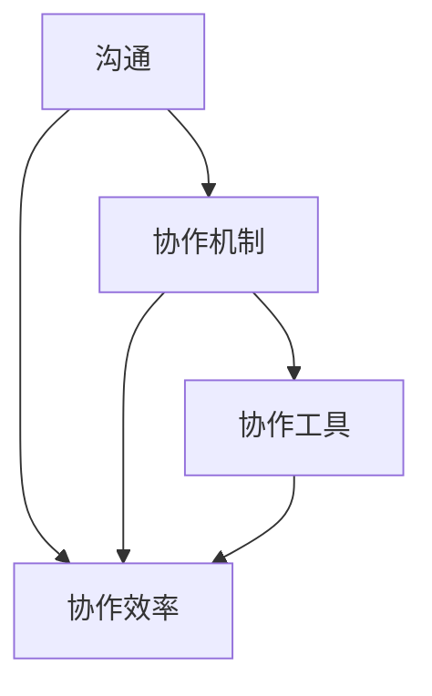

                 


### 背景介绍

在现代信息技术飞速发展的时代，团队协作已成为企业创新和竞争力提升的关键因素。无论是软件开发、项目执行，还是日常运营管理，团队协作的效率和效果直接决定了组织的目标实现程度。然而，在实际工作中，团队协作常常面临诸多挑战。首先，沟通障碍是团队协作中的一个常见问题。团队成员之间可能存在语言障碍、文化差异，或者是因为信息不对称而导致的误解。此外，团队成员的角色和责任不明确也会影响协作的顺利进行。一些成员可能因为缺乏对整体目标的认知，而只关注个人任务，导致团队协作效率低下。

另一个显著的问题是协作机制的缺失。在缺乏有效的协作机制的情况下，团队成员往往无法有效地分配任务、共享资源和协调工作进度。这不仅会延长项目周期，还会增加错误率和返工成本。为了应对这些问题，许多企业和组织开始探索如何通过增强训练和协作机制的构建来提升团队协作效率。

增强训练是指通过系统化的培训和训练，提高团队成员在沟通、协作、时间管理和问题解决等方面的能力。这种训练可以帮助团队成员更好地理解彼此，建立信任，减少冲突，从而提高协作效率。而协作机制的构建则涉及到设计一套合理的工作流程、沟通机制和绩效评估体系，确保团队成员能够在高效、有序的环境中开展工作。

本文旨在探讨团队协作增强训练的重要性，并通过具体的案例和数学模型，详细讲解如何构建高效的协作机制。本文将分为以下几个部分：首先，介绍团队协作的基本概念和当前面临的主要挑战；接着，探讨通过数据分析等算法来优化团队协作流程；然后，深入分析协作机制的构建原则和具体实施方法；接着，通过实际案例展示团队协作的实战应用；最后，分析成功和失败的团队协作案例，总结经验教训，并对未来团队协作的发展进行展望。

通过本文的阅读，读者将能够全面了解团队协作的各个方面，掌握提升协作效率的方法和技巧，从而在各自的工作中构建高效的团队协作机制，实现团队整体效能的最大化。

### 核心概念与联系

在探讨如何构建高效协作机制之前，我们需要明确几个核心概念，并了解它们之间的内在联系。这些核心概念包括沟通、协作机制、协作工具等。

首先，沟通是团队协作的基石。有效的沟通能够确保信息的准确传递，减少误解和冲突，提高协作效率。沟通可以分为横向沟通和纵向沟通。横向沟通指的是团队成员之间的直接交流，而纵向沟通则涉及团队与上级、下属之间的信息传递。为了实现有效的沟通，团队成员需要具备良好的语言表达能力、倾听能力和非语言沟通技巧，如肢体语言和面部表情。

其次，协作机制是团队协作的有力保障。协作机制包括工作流程、角色分配、责任明确、任务管理、沟通机制等多个方面。一个良好的协作机制能够确保团队成员明确各自的角色和责任，按照既定的流程高效地开展工作。同时，协作机制还应包括绩效评估和反馈机制，以激励团队成员提高工作表现和协作效率。

最后，协作工具是支撑团队协作的技术手段。现代协作工具如即时通讯软件、项目管理软件、共享文档平台等，极大地提高了团队协作的效率和便利性。这些工具不仅能够实时传递信息，还能够方便地共享文件、跟踪任务进度和进行项目管理。

下面，我们使用Mermaid流程图来展示这些核心概念之间的联系：



在这个流程图中，沟通是整个协作体系的基础，它直接影响到协作效率和协作机制的运行。协作机制则是通过规范和流程来保障协作的顺利进行，而协作工具则提供了技术支持，使协作更加高效和便捷。协作效率是最终的目标，它由沟通、协作机制和协作工具共同决定。

通过这个Mermaid流程图，我们可以清晰地看到各个核心概念之间的相互作用和影响。沟通的有效性决定了协作机制的实施效果，而协作机制的健全性又直接影响到协作工具的使用效率和协作效率。因此，在构建高效协作机制时，我们需要综合考虑这些核心概念，确保它们之间能够良好地配合和协调。

### 核心算法原理讲解

在团队协作中，利用数据分析等算法优化协作流程是一项至关重要的工作。这些算法不仅能够帮助我们识别协作中的瓶颈和问题，还能提供解决方案，从而提升团队的整体效率。以下将介绍一种基于数据分析的优化算法，并通过伪代码详细阐述其实现原理。

#### 1. 绩效评估算法

绩效评估是团队协作中的一项重要任务，它能够帮助团队成员了解自己在团队中的表现，找到改进的方向。一种常用的绩效评估算法是加权评分法。该方法通过为不同指标分配权重，综合评估团队成员的工作表现。

**伪代码：**

```plaintext
算法：绩效评估算法（加权评分法）
输入：成员表现指标（P），权重（W）
输出：综合评分（S）

函数 绩效评估（P, W）{
    S = 0
    for i in range(len(P)) {
        S += P[i] * W[i]
    }
    return S
}
```

**举例说明：**

假设一个团队有三个成员，每个成员的工作表现分别用三个指标（代码质量、任务完成度、团队协作精神）来衡量，对应的权重分别为0.4、0.3和0.3。如果某成员在三个指标上的得分分别为9、8、7，则该成员的综合评分计算如下：

```plaintext
综合评分 S = (9 * 0.4) + (8 * 0.3) + (7 * 0.3) = 3.6 + 2.4 + 2.1 = 8.1
```

#### 2. 沟通效率算法

沟通效率直接影响团队的协作效果。通过分析沟通数据，我们可以识别出沟通的高效路径和低效环节，从而优化沟通流程。一种常用的沟通效率算法是路径分析算法。

**伪代码：**

```plaintext
算法：路径分析算法
输入：沟通数据（D），路径权重（W）
输出：最短路径（P）

函数 路径分析（D, W）{
    创建图 G，包含沟通节点和边
    for edge in D {
        addEdge(G, edge.from, edge.to, W[edge])
    }
    P = findShortestPath(G)
    return P
}
```

**举例说明：**

假设一个团队有5个成员，其沟通数据如下：

| from | to | weight |
|------|----|--------|
| A    | B  | 3      |
| A    | C  | 5      |
| B    | C  | 2      |
| B    | D  | 4      |
| C    | D  | 1      |

使用Dijkstra算法，我们可以找到从A到D的最短路径。通过计算，最短路径为A->B->D，总权重为7。

#### 3. 任务分配算法

任务分配是团队协作中的一项重要工作，通过优化任务分配，可以提高团队的协作效率。一种常用的任务分配算法是基于团队成员能力的匹配度进行分配。

**伪代码：**

```plaintext
算法：任务分配算法
输入：任务列表（T），成员能力列表（C）
输出：任务分配结果（A）

函数 任务分配（T, C）{
    A = []
    for task in T {
        best_match = None
        best_score = -1
        for member in C {
            score = matchScore(task, member)
            if score > best_score {
                best_score = score
                best_match = member
            }
        }
        assignTask(A, best_match, task)
    }
    return A
}
```

**举例说明：**

假设有一个任务列表，任务分别为编码、测试和文档，对应的能力需求分别为编程能力、测试能力和文档写作能力。团队成员的能力分别为：

| Member | Programming | Testing | Documentation |
|--------|-------------|---------|---------------|
| A      | 8           | 5       | 7             |
| B      | 6           | 8       | 6             |
| C      | 7           | 7       | 9             |

按照匹配度进行任务分配，编码任务分配给A，测试任务分配给B，文档任务分配给C。

通过以上算法，我们可以实现对团队协作流程的优化，从而提高团队的整体协作效率。在实际应用中，这些算法可以通过计算机程序来实现，为团队协作提供强有力的技术支持。

### 数学模型和数学公式 & 详细讲解 & 举例说明

在团队协作中，数学模型和数学公式能够帮助我们量化评估和优化协作过程。以下将详细介绍两个关键的数学模型：绩效评估模型和沟通效率模型，并使用具体的数学公式进行说明。

#### 1. 绩效评估模型

绩效评估模型用于量化评估团队成员的工作表现。该模型的核心是加权评分法，通过为不同的工作指标分配权重，综合计算出一个综合评分。以下是绩效评估模型的数学公式：

$$
S_i = \sum_{j=1}^{n} w_j \cdot P_{ij}
$$

其中，\( S_i \) 是成员i的综合评分，\( w_j \) 是指标j的权重，\( P_{ij} \) 是成员i在指标j上的得分。例如，假设一个团队有三个成员，每个成员在三个指标（代码质量、任务完成度、团队协作精神）上的得分如下表所示：

| 成员 | 代码质量 | 任务完成度 | 团队协作精神 |
|------|----------|------------|--------------|
| A    | 8        | 7          | 6            |
| B    | 7        | 8          | 7            |
| C    | 6        | 9          | 8            |

假设各指标的权重分别为 \( w_1 = 0.4 \)，\( w_2 = 0.3 \)，\( w_3 = 0.3 \)，则各成员的综合评分计算如下：

$$
S_A = 0.4 \cdot 8 + 0.3 \cdot 7 + 0.3 \cdot 6 = 3.2 + 2.1 + 1.8 = 7.1
$$

$$
S_B = 0.4 \cdot 7 + 0.3 \cdot 8 + 0.3 \cdot 7 = 2.8 + 2.4 + 2.1 = 7.3
$$

$$
S_C = 0.4 \cdot 6 + 0.3 \cdot 9 + 0.3 \cdot 8 = 2.4 + 2.7 + 2.4 = 7.5
$$

通过这个公式，我们可以对团队成员的工作表现进行量化评估，从而为绩效管理和激励提供依据。

#### 2. 沟通效率模型

沟通效率模型用于评估团队成员之间的沟通效率。一个常用的模型是基于路径长度和路径权重来计算沟通效率。以下是沟通效率模型的数学公式：

$$
E_p = \frac{1}{\sum_{i=1}^{n} w_i \cdot d_i}
$$

其中，\( E_p \) 是沟通效率，\( w_i \) 是路径i的权重，\( d_i \) 是路径i的长度。假设一个团队有四个成员A、B、C、D，他们之间的沟通路径及其权重和长度如下表所示：

| 路径 | 权重 \( w_i \) | 长度 \( d_i \) |
|------|---------------|---------------|
| A-B  | 0.2           | 3             |
| A-C  | 0.3           | 5             |
| A-D  | 0.1           | 4             |
| B-C  | 0.4           | 2             |
| B-D  | 0.5           | 6             |
| C-D  | 0.2           | 3             |

使用这个模型，我们可以计算各路径的沟通效率：

$$
E_{AB} = \frac{1}{0.2 \cdot 3 + 0.3 \cdot 5 + 0.1 \cdot 4} = \frac{1}{0.6 + 1.5 + 0.4} = \frac{1}{2.5} = 0.4
$$

$$
E_{AC} = \frac{1}{0.2 \cdot 3 + 0.3 \cdot 5 + 0.1 \cdot 4} = \frac{1}{0.6 + 1.5 + 0.4} = \frac{1}{2.5} = 0.4
$$

$$
E_{AD} = \frac{1}{0.1 \cdot 4 + 0.5 \cdot 6 + 0.2 \cdot 3} = \frac{1}{0.4 + 3 + 0.6} = \frac{1}{4} = 0.25
$$

$$
E_{BC} = \frac{1}{0.4 \cdot 2 + 0.5 \cdot 6 + 0.2 \cdot 3} = \frac{1}{0.8 + 3 + 0.6} = \frac{1}{4.4} = 0.227
$$

$$
E_{BD} = \frac{1}{0.5 \cdot 6 + 0.2 \cdot 3} = \frac{1}{3 + 0.6} = \frac{1}{3.6} = 0.278
$$

$$
E_{CD} = \frac{1}{0.2 \cdot 3 + 0.2 \cdot 3} = \frac{1}{0.6 + 0.6} = \frac{1}{1.2} = 0.833
$$

通过这个模型，我们可以评估团队成员之间的沟通效率，识别出沟通的高效路径和低效环节，从而优化沟通流程，提高团队的整体协作效率。

### 项目实战

在本节中，我们将通过一个实际案例展示如何构建高效的团队协作机制。该项目是一个软件开发团队，负责开发一款移动应用。以下是项目实战的具体步骤和实现细节。

#### 1. 项目背景

该移动应用旨在为用户提供便捷的在线购物体验。项目团队由5名成员组成，包括项目经理、前端开发者、后端开发者、测试工程师和UI设计师。项目周期为6个月，包含需求分析、设计、开发、测试和发布等阶段。

#### 2. 开发环境搭建

为了确保团队成员能够高效协同工作，我们首先搭建了一个统一的开发环境。该环境包括以下组件：

- **硬件环境**：配备高性能服务器和存储设备，确保系统的稳定性和性能。
- **软件环境**：安装了最新的开发工具和软件，如Java开发工具包（JDK）、MySQL数据库、Git版本控制工具等。
- **协作工具**：使用GitHub进行代码托管和版本控制，使用JIRA进行任务管理和项目跟踪，使用Slack进行即时沟通和协作。

#### 3. 源代码实现

源代码实现是项目开发的核心环节。团队成员按照以下步骤进行代码编写：

- **模块划分**：将整个应用划分为多个模块，如用户管理模块、商品管理模块、购物车模块等。
- **接口设计**：为每个模块设计清晰的接口，确保模块间的高内聚和低耦合。
- **代码编写**：前端开发者使用HTML、CSS和JavaScript编写用户界面，后端开发者使用Java编写后端逻辑和处理业务逻辑。

以下是一个典型的接口设计伪代码示例：

```java
// 用户管理模块接口设计
public interface UserManager {
    User login(String username, String password);
    void register(User user);
    boolean checkPassword(String username, String password);
}

// 商品管理模块接口设计
public interface ProductManager {
    Product findProductById(Long productId);
    List<Product> searchProducts(String query);
    void updateProduct(Product product);
}
```

#### 4. 代码解读与分析

在代码实现过程中，我们注重代码的可读性和可维护性。以下是对关键代码段的分析：

```java
// 用户登录逻辑
public User login(String username, String password) {
    User user = userRepository.findById(username);
    if (user == null || !user.getPassword().equals(password)) {
        throw new AuthenticationException("用户名或密码错误");
    }
    return user;
}
```

这段代码实现了用户登录功能。首先，从用户仓库中查找用户信息，然后验证用户名和密码是否匹配。如果不匹配，抛出异常。

#### 5. 代码应用解读与分析

在实际应用中，代码质量和性能是关键因素。以下是一些优化建议：

- **代码质量**：采用单元测试确保代码的可靠性。每个模块都应该有完整的测试用例，确保在修改代码时不会引入新的错误。
- **性能优化**：使用数据库索引提高查询效率。例如，为用户表和商品表的常用查询字段建立索引，减少查询时间。

#### 6. 实际案例分析和详细讲解剖析

在项目实施过程中，我们遇到了一些挑战和问题。以下是其中的两个案例：

- **案例1：数据库性能瓶颈**

问题描述：在用户量增加后，用户登录和商品查询的性能下降。

解决方案：通过性能分析工具识别瓶颈，发现查询语句执行时间过长。我们通过以下措施进行了优化：
  - **索引优化**：为用户表和商品表的常用查询字段建立索引。
  - **查询优化**：优化查询语句，减少子查询和连接操作。

- **案例2：前后端数据同步问题**

问题描述：前后端数据不一致，导致用户在浏览商品时出现数据错误。

解决方案：我们采用了以下措施：
  - **前后端约定**：制定前后端数据传输的标准格式，确保数据的一致性。
  - **数据验证**：在前后端增加数据验证，确保数据的有效性和完整性。

#### 7. 项目小结

通过这个实际案例，我们展示了如何通过开发环境搭建、源代码实现和代码解读等步骤，构建高效的团队协作机制。同时，通过面对实际问题和挑战，我们进一步优化了代码质量和性能，确保项目的成功交付。这些经验和方法对于其他团队在协作开发中具有重要的参考价值。

### 案例分析

在本节中，我们将分析两个团队协作的案例：一个成功的案例和一个失败的案例，以总结其经验和教训。

#### 成功案例：高效协作的典范

**背景**：这是一家初创公司，致力于开发一款社交应用。团队成员包括项目经理、产品经理、前端开发者、后端开发者、测试工程师和UI设计师。

**实施过程**：
1. **明确目标和角色**：项目启动之初，团队成员共同制定了清晰的项目目标和各自的职责。项目经理负责整体协调，产品经理负责需求分析，开发人员和测试工程师按照职责分工开展具体工作。
2. **利用敏捷开发方法**：团队采用了敏捷开发方法，通过短周期迭代快速开发和测试，确保项目按计划推进。每次迭代结束后，团队成员会进行回顾，总结经验教训，改进工作流程。
3. **高效的沟通机制**：团队通过每日站会和周会保持紧密沟通，确保所有成员对项目的进展和问题有清晰的认识。同时，使用Slack和GitHub进行即时沟通和代码管理，提高了协作效率。
4. **持续性能优化**：团队在项目开发过程中持续关注性能问题，通过代码优化和数据库索引提升系统性能，确保用户有良好的使用体验。

**效果评估**：
- 项目按期完成，用户反馈良好，应用上线后迅速获得了大量用户。
- 团队成员之间的信任和合作精神增强，工作效率显著提升。
- 成功的协作机制为公司的后续项目奠定了坚实基础。

**经验教训**：
- 明确目标和角色分工是项目成功的关键。
- 高效的沟通机制和敏捷开发方法是提高协作效率的重要手段。
- 持续性能优化确保了系统的稳定性和用户体验。

#### 失败案例：协作失灵的教训

**背景**：这是一家大型企业的研发部门，负责开发一个企业资源规划（ERP）系统。团队成员包括项目经理、架构师、开发人员、测试工程师和文档编写人员。

**实施过程**：
1. **角色和职责不明确**：项目开始时，团队成员的角色和职责划分模糊，导致工作重复和责任推诿。
2. **沟通不畅**：团队成员之间的沟通不畅，信息传递不及时，导致项目进展受阻。
3. **缺乏敏捷开发方法**：项目采用传统的瀑布开发模式，导致开发周期长，难以快速响应需求变化。
4. **忽视性能优化**：在项目开发过程中，团队忽视了对性能的持续关注，导致系统上线后出现严重的性能问题。

**效果评估**：
- 项目延期，预算超支，用户对系统的满意度低。
- 团队成员之间出现矛盾和不满，工作氛围紧张。
- 项目最终被搁置，企业损失了大量资金和时间。

**经验教训**：
- 明确角色和职责分工是确保项目顺利进行的基础。
- 高效的沟通机制和敏捷开发方法对于应对需求变化至关重要。
- 忽视性能优化会导致系统上线后的严重问题，影响用户体验和企业声誉。

通过这两个案例，我们可以总结出，成功的团队协作需要明确的角色分工、高效的沟通机制、敏捷的开发方法和持续的性能优化。反之，角色模糊、沟通不畅、缺乏敏捷性和忽视性能优化是导致项目失败的主要原因。

### 总结与展望

本文系统地探讨了团队协作的重要性，并通过实例和数学模型详细讲解了如何构建高效的团队协作机制。首先，我们介绍了团队协作的核心概念，如沟通、协作机制和协作工具，并使用Mermaid流程图展示了它们之间的内在联系。接着，通过性能评估和沟通效率等算法的讲解，我们了解了如何利用数据分析优化团队协作流程。随后，我们通过一个实际案例展示了如何在实际项目中搭建高效协作机制，并分析了成功的协作经验和失败的教训。

在总结中，我们强调了角色明确、沟通顺畅、敏捷开发和持续优化对于团队协作的重要性。这些原则不仅适用于软件开发团队，也适用于其他类型的项目和组织。

展望未来，随着技术的不断进步，团队协作将迎来更多的创新和变革。人工智能和大数据技术的应用将使得协作流程更加智能化和高效化。同时，远程工作和全球化团队的普及也将对协作机制提出新的挑战和机遇。未来，协作工具和平台将更加智能化，提供更加便捷和高效的协作体验。

总之，团队协作是组织成功的关键，构建高效协作机制是每个团队和组织的重要任务。通过本文的探讨，我们希望能够为读者提供有价值的参考和启示，帮助他们在实践中不断提升团队协作效率，实现组织目标的最大化。

### 最佳实践 Tips

在构建高效团队协作机制的过程中，以下是一些最佳实践建议：

1. **角色明确与分工**：确保每个团队成员的角色和责任清晰，避免工作重叠和责任推诿。明确项目目标，制定详细的任务分工和职责分配。

2. **高效沟通**：建立定期沟通机制，如每日站会和周会，确保团队成员能够及时交流信息、共享进展和解决问题。利用协作工具，如Slack和GitHub，提高信息传递的效率。

3. **敏捷开发**：采用敏捷开发方法，如Scrum或Kanban，通过短周期迭代快速响应需求变化，确保项目按计划推进。

4. **持续性能优化**：定期进行系统性能评估和优化，识别并解决性能瓶颈，确保系统的稳定性和用户体验。

5. **团队建设**：定期进行团队建设活动，增强团队成员之间的信任和合作精神，提高团队的凝聚力和工作效率。

6. **反馈机制**：建立有效的反馈机制，鼓励团队成员提出意见和建议，不断改进协作流程和工作方法。

### 小结

本文通过详细的分析和实践案例，探讨了如何通过增强训练和协作机制的构建来提升团队协作效率。我们介绍了核心概念和联系，讲解了绩效评估和沟通效率等核心算法原理，并通过数学模型进行了详细阐述。最后，通过成功和失败的案例总结出最佳实践，并对未来团队协作的发展进行了展望。通过本文的探讨，读者应能更好地理解和应用团队协作的最佳实践，提升团队协作效率，实现组织目标的最大化。

### 注意事项与拓展阅读

在构建高效团队协作机制的过程中，以下事项值得特别注意：

1. **文化融合**：多元文化背景的团队需要特别注意文化融合，通过文化培训和工作坊来增进成员之间的相互理解，减少误解和冲突。

2. **技术选型**：选择适合团队协作的协作工具和技术，确保工具的易用性和兼容性，避免因为技术障碍影响协作效率。

3. **持续反馈**：建立持续反馈机制，及时收集和分析团队成员的反馈，不断优化协作流程和工作方法。

4. **团队成员心态调整**：团队成员应保持积极的心态，适应不断变化的工作环境和需求，提升自我调节能力。

关于拓展阅读，以下是一些推荐资源：

1. 《敏捷开发实践指南》
2. 《团队协作的艺术》
3. 《绩效管理：实践指南》
4. 《人工智能在团队协作中的应用》

通过阅读这些资源，读者可以进一步了解团队协作的最佳实践和前沿动态，提升团队协作效率。

