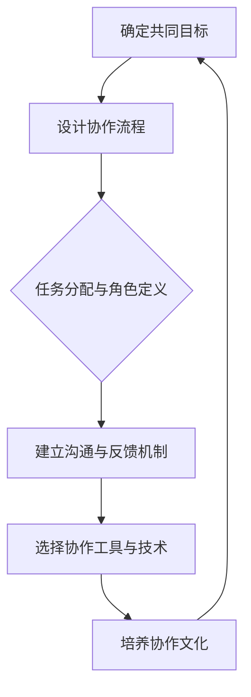
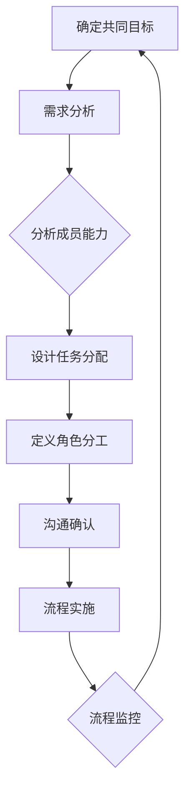
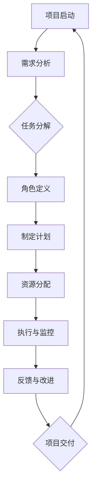

                 


## 《团队协作增强：建立高效协作机制的方法》

### 关键词：团队协作、高效协作机制、协作工具、沟通、任务分配、协作文化

### 摘要：

在当今快速变化和高度竞争的商业环境中，团队协作已成为企业成功的关键因素。本文旨在探讨如何建立高效协作机制，通过明确的核心概念、协作机制设计、工具与技术、案例分析以及实践指南，帮助读者深入了解并有效实施团队协作策略。文章将运用Mermaid流程图和伪代码，阐述协作原理和算法，并提供实际案例和代码示例，旨在为读者提供全面而实用的团队协作增强方法。

### 目录大纲

#### 第1章 引言
- 1.1 书籍背景和目标
- 1.2 团队协作的重要性
- 1.3 本书结构安排

#### 第2章 核心概念与联系
- 2.1 团队协作的基本原理
- 2.2 团队协作机制的定义
- 2.3 Mermaid流程图：团队协作机制的整体架构

#### 第3章 团队协作机制设计
- 3.1 任务分配与角色定义
- 3.2 沟通与反馈机制
- 3.3 协作流程与工具选择
- 3.4 Mermaid流程图：任务分配与角色定义

#### 第4章 团队沟通
- 4.1 有效沟通的基本原则
- 4.2 沟通障碍与解决方案
- 4.3 沟通技巧提升

#### 第5章 协作工具与技术
- 5.1 常见协作工具介绍
- 5.2 技术选型与实施策略
- 5.3 协作工具的集成与优化

#### 第6章 案例分析
- 6.1 成功案例一：高效团队协作的实践
- 6.2 失败案例二：协作机制的缺陷
- 6.3 案例分析与启示

#### 第7章 实践指南
- 7.1 团队协作流程设计
- 7.2 面对协作挑战的应对策略
- 7.3 实践经验分享与建议

#### 第8章 总结与展望
- 8.1 全书重点回顾
- 8.2 团队协作的未来趋势
- 8.3 进一步学习建议

#### 参考文献
- 8.4 引用信息列表

### 第1章 引言

#### 1.1 书籍背景和目标

在数字化时代，企业的竞争日益激烈，团队协作成为提升企业核心竞争力的关键。然而，如何在多变的市场环境中实现高效协作，成为许多企业面临的挑战。本书旨在探讨团队协作的内涵，提供建立高效协作机制的方法和策略，帮助读者理解和实践如何在实际工作中实现高效的团队协作。

本书的目标是：

1. **理解团队协作的基本原理**：通过阐述团队协作的内在机制和核心概念，帮助读者建立对团队协作的全面认识。
2. **设计协作机制**：介绍协作机制的设计原则和步骤，指导读者如何在实际工作中设计和实施协作机制。
3. **提升团队沟通能力**：提供沟通技巧和策略，帮助团队成员有效沟通，减少误解和冲突。
4. **选择合适的协作工具**：介绍常见的协作工具和技术，帮助读者根据实际需求选择合适的工具。
5. **案例分析与实践指南**：通过成功和失败的案例，分析协作中的关键因素，提供实践指南，帮助读者在实际工作中应用所学知识。

#### 1.2 团队协作的重要性

团队协作在企业管理中具有不可替代的重要作用。首先，团队协作能够提高工作效率。通过明确的任务分配和角色定义，团队成员可以专注于自己的职责，减少重复工作和资源浪费，从而提高整体工作进度。

其次，团队协作能够促进创新。团队成员通过相互交流和协作，可以激发不同的观点和想法，从而产生新的创意和解决方案。这种多元化的思维碰撞往往能够带来意想不到的创新成果。

此外，团队协作有助于提升团队凝聚力。在协作过程中，团队成员之间建立了信任和合作关系，增强了团队归属感和凝聚力。这种凝聚力有助于团队在面对挑战和困难时保持团结和协同，共同克服障碍。

最后，团队协作对于企业的长远发展具有重要意义。通过高效的团队协作，企业可以更好地适应市场变化，快速响应客户需求，提高市场竞争力。同时，团队协作也能够培养员工的团队合作能力和领导力，为企业的可持续发展提供人才保障。

#### 1.3 本书结构安排

本书分为八个章节，结构如下：

- **第1章 引言**：介绍书籍的背景和目标，阐述团队协作的重要性。
- **第2章 核心概念与联系**：介绍团队协作的基本原理和协作机制的定义，并使用Mermaid流程图展示团队协作机制的整体架构。
- **第3章 团队协作机制设计**：详细讨论任务分配与角色定义、沟通与反馈机制、协作流程与工具选择。
- **第4章 团队沟通**：阐述有效沟通的基本原则、沟通障碍与解决方案、沟通技巧提升。
- **第5章 协作工具与技术**：介绍常见协作工具、技术选型与实施策略、协作工具的集成与优化。
- **第6章 案例分析**：分析成功和失败的团队协作案例，总结经验和教训。
- **第7章 实践指南**：提供团队协作流程设计、应对协作挑战的策略、实践经验分享。
- **第8章 总结与展望**：回顾全书重点，探讨团队协作的未来趋势和进一步学习建议。

通过本书的学习，读者将能够深入了解团队协作的内涵，掌握建立高效协作机制的方法和技巧，提升团队协作能力，为企业的成功发展贡献力量。

### 第2章 核心概念与联系

#### 2.1 团队协作的基本原理

团队协作是基于共同目标和资源共享的一种工作方式，它通过明确的任务分配和角色分工，实现团队成员之间的紧密配合和高效协作。团队协作的基本原理包括以下几个方面：

1. **共同目标**：团队协作的起点是共同目标的设定。团队需要明确自己的目标，并确保所有成员都认同并致力于实现这些目标。共同目标为团队成员提供了方向和动力，是协作的基础。

2. **任务分配**：在团队中，每个成员都有自己的职责和任务。任务分配应基于成员的能力和兴趣，确保任务与成员能力相匹配，最大化团队效能。

3. **角色分工**：团队协作不仅仅是任务的分配，还需要明确的角色分工。每个角色都有特定的职责和权利，角色之间的协作关系明确，有助于提高工作效率。

4. **沟通与反馈**：有效的沟通是团队协作的关键。团队成员需要保持开放的沟通渠道，及时分享信息和反馈，确保任务进展和问题得到及时解决。

5. **协作文化**：团队协作文化是团队协作的软实力。它包括团队成员之间的信任、尊重和合作精神，是团队协作持续高效运行的保障。

#### 2.2 团队协作机制的定义

团队协作机制是指为了实现团队协作目标而建立的一套制度和规范。它包括以下几个方面：

1. **协作流程**：协作流程是团队协作的基本框架，包括任务分配、角色分工、沟通与反馈、决策制定等环节。协作流程的设计和优化是提高团队协作效率的关键。

2. **任务分配与角色定义**：任务分配和角色定义是团队协作机制的核心部分。通过明确每个成员的任务和角色，确保团队成员明确自己的职责和权限，提高工作效率。

3. **沟通与反馈机制**：沟通与反馈机制是团队协作的关键环节。它包括沟通渠道的选择、沟通方式的规范、反馈机制的建立等，确保团队成员之间的信息流通顺畅。

4. **协作工具与技术**：协作工具和技术是实现团队协作的重要支撑。通过选择合适的协作工具和技术，可以提高团队协作的效率和效果。

5. **协作文化**：协作文化是团队协作的内在动力。它包括团队成员之间的信任、尊重、合作精神和共同价值观，是团队协作长期稳定运行的基础。

#### 2.3 Mermaid流程图：团队协作机制的整体架构

为了更好地展示团队协作机制的整体架构，我们可以使用Mermaid流程图来描述。以下是一个简化的Mermaid流程图，用于展示团队协作机制的核心组成部分：



在这个流程图中，每个节点代表一个关键步骤，箭头表示流程的顺序。通过这个流程图，我们可以清晰地看到团队协作机制的设计和实施过程，以及各个步骤之间的相互关系。

### 第3章 团队协作机制设计

#### 3.1 任务分配与角色定义

在团队协作中，任务分配和角色定义是确保团队高效运作的基础。有效的任务分配和角色定义有助于明确团队成员的职责，提高工作效率，减少冲突和误解。

**任务分配的原则：**

1. **能力匹配**：任务应与成员的能力相匹配，确保任务难度适中，既不会让成员感到压力过大，也不会觉得过于简单。

2. **兴趣驱动**：任务分配应考虑成员的兴趣和爱好，让成员在自己擅长的领域发挥优势，提高工作满意度。

3. **平衡分配**：任务应均匀分配，避免某个成员负担过重，而其他成员闲置。这样可以确保整个团队的工作均衡。

4. **透明公正**：任务分配过程应透明公正，确保每个成员都能了解自己的任务和职责，减少不公平感。

**角色定义的原则：**

1. **明确职责**：每个角色都应有明确的职责和权限，避免职责重叠或模糊，减少工作中的混乱和误解。

2. **互补优势**：角色之间应互补优势，确保团队在各个方面的能力都得到充分发挥。

3. **灵活调整**：角色定义应具有一定的灵活性，以适应团队需求和成员变化，确保团队运作的持续性。

**任务分配与角色定义的流程：**

1. **确定团队目标**：在任务分配和角色定义之前，团队需要明确共同的目标，确保任务分配和角色定义的方向一致。

2. **评估成员能力**：团队应评估每个成员的能力和特长，为任务分配和角色定义提供基础。

3. **分配任务**：根据成员的能力和兴趣，将任务分配给合适的成员。确保任务分配公平、合理。

4. **定义角色**：为每个角色明确职责和权限，确保角色之间互补优势，提高团队协作效率。

5. **沟通确认**：将任务分配和角色定义结果与团队成员进行沟通，确保每个成员都清楚自己的职责和角色。

6. **持续优化**：任务分配和角色定义不是一次性的过程，应定期评估和优化，以适应团队变化和需求。

**案例：**

以一个软件开发团队为例，团队成员包括项目经理、开发人员、测试工程师和产品经理。任务分配和角色定义如下：

- **项目经理**：负责项目的整体规划和执行，协调团队工作，确保项目按时完成。
- **开发人员**：负责编写和实现软件代码，根据需求和设计进行软件开发。
- **测试工程师**：负责软件测试，确保软件质量符合标准，发现和修复软件缺陷。
- **产品经理**：负责产品需求分析，与客户沟通，确保产品满足用户需求。

通过明确的任务分配和角色定义，团队成员可以专注于自己的职责，提高工作效率，确保项目顺利推进。

#### 3.2 沟通与反馈机制

沟通是团队协作的重要组成部分，有效的沟通能够确保团队成员之间的信息流通，减少误解和冲突，提高团队协作效率。建立良好的沟通与反馈机制，有助于团队保持高效的协作状态。

**沟通的原则：**

1. **及时性**：沟通应及时，确保信息能够在第一时间传达，避免信息滞后导致的工作延迟和错误。

2. **准确性**：沟通应准确，确保信息的传达不产生误解和歧义，避免因为沟通不准确导致的问题和错误。

3. **开放性**：沟通应开放，鼓励团队成员之间的真诚交流和反馈，建立信任和合作关系。

4. **多样性**：沟通方式应多样，根据不同场景和需求选择合适的沟通方式，如面对面沟通、邮件、即时通讯工具等。

**反馈机制的原则：**

1. **及时性**：反馈应及时，确保团队成员能够在第一时间了解自己的工作表现，发现问题并及时调整。

2. **针对性**：反馈应具体针对团队成员的工作表现，避免泛泛而谈，确保反馈具有实际指导意义。

3. **建设性**：反馈应建设性，鼓励团队成员改进工作，提供具体的改进建议，而不是仅仅指出问题。

4. **私密性**：反馈应在私密的环境中进行，保护团队成员的隐私，避免公开场合的负面反馈导致尴尬和挫败感。

**沟通与反馈机制的流程：**

1. **制定沟通计划**：团队应制定详细的沟通计划，包括沟通频率、沟通方式和沟通内容等，确保沟通有据可依。

2. **建立沟通渠道**：团队应建立多种沟通渠道，如定期会议、即时通讯工具、邮件列表等，确保团队成员之间的信息流通。

3. **开展有效沟通**：团队应开展有效的沟通，确保信息的准确传达和及时反馈。

4. **收集反馈**：团队应定期收集成员的反馈，了解工作表现和团队协作情况。

5. **反馈与改进**：根据反馈结果，团队应进行工作改进，优化沟通与协作流程。

**案例：**

在一个软件开发团队中，沟通与反馈机制的建立如下：

- **定期会议**：每周举行一次团队会议，讨论项目进展、问题解决和改进措施。
- **即时通讯工具**：使用即时通讯工具，如Slack或Telegram，实时沟通和分享信息。
- **邮件列表**：建立邮件列表，用于重要信息的发布和存档。
- **反馈机制**：团队建立反馈机制，每个成员都可以在会议或即时通讯中提出问题和建议，团队成员之间进行及时反馈和改进。

通过有效的沟通与反馈机制，团队可以保持高效的协作状态，提高工作效率和项目质量。

#### 3.3 协作流程与工具选择

协作流程是团队协作的基本框架，通过规范化的流程，确保团队成员在协作过程中的有序和高效。协作工具则是实现协作流程的重要支撑，通过合适的工具，可以提高团队的协作效率和效果。

**协作流程的设计原则：**

1. **简洁性**：协作流程应简洁明了，避免冗长和复杂的步骤，确保团队成员易于理解和执行。

2. **适应性**：协作流程应具有一定的灵活性，能够根据团队需求和项目变化进行调整和优化。

3. **透明性**：协作流程应透明，确保团队成员了解流程的每个步骤和职责，避免因信息不对称导致的误解和冲突。

4. **可追踪性**：协作流程应具备可追踪性，通过记录和监控，确保流程的执行情况和效果。

**协作工具的选择原则：**

1. **功能性**：协作工具应具备所需的功能，如任务管理、文件共享、即时通讯、会议安排等，满足团队协作的基本需求。

2. **易用性**：协作工具应易于使用，避免复杂和繁琐的操作，确保团队成员能够快速上手和高效使用。

3. **集成性**：协作工具应具备良好的集成性，能够与其他工具和系统无缝连接，实现数据的共享和流通。

4. **可扩展性**：协作工具应具备可扩展性，能够根据团队规模和需求的变化进行功能扩展和性能优化。

**协作流程的设计步骤：**

1. **需求分析**：分析团队协作的需求，明确协作流程的目标和关键环节。

2. **流程设计**：根据需求分析结果，设计协作流程的基本框架，包括任务分配、角色分工、沟通与反馈等环节。

3. **流程优化**：对设计的协作流程进行优化，确保流程的简洁性、适应性和透明性。

4. **流程实施**：将设计的协作流程付诸实践，确保团队成员了解和遵循流程规范。

5. **流程监控**：通过记录和监控，确保协作流程的执行情况和效果，及时调整和优化。

**协作工具的选择流程：**

1. **需求调研**：调研团队协作的需求，了解所需功能和工具类型。

2. **工具筛选**：根据需求调研结果，筛选符合需求的协作工具。

3. **工具试用**：试用筛选出的协作工具，评估其功能、易用性和集成性。

4. **工具选择**：根据试用结果，选择最合适的协作工具，并进行部署和使用。

5. **工具优化**：根据团队使用反馈，对协作工具进行优化和改进，提高使用效果。

**案例：**

在一个软件开发团队中，协作流程与工具选择如下：

- **协作流程**：
  - **需求分析**：每周进行一次需求讨论会议，明确下周的工作任务。
  - **任务分配**：根据任务需求，分配给相应的开发人员。
  - **代码评审**：开发完成后，进行代码评审，确保代码质量和一致性。
  - **测试与部署**：测试工程师进行测试，确保软件质量，部署到生产环境。
  - **反馈与改进**：定期收集用户反馈，进行软件改进和优化。

- **协作工具**：
  - **任务管理工具**：使用Jira进行任务管理，分配任务和跟踪进度。
  - **代码管理工具**：使用Git进行代码管理和版本控制。
  - **即时通讯工具**：使用Slack进行实时沟通和协作。
  - **会议安排工具**：使用Zoom进行线上会议和视频沟通。

通过合理的协作流程设计和工具选择，团队可以高效地完成软件开发任务，提高项目质量和客户满意度。

#### 3.4 Mermaid流程图：任务分配与角色定义

为了更好地展示任务分配与角色定义的流程，我们可以使用Mermaid流程图来描述。以下是一个简化的Mermaid流程图，用于展示任务分配与角色定义的过程：



在这个流程图中，每个节点代表一个关键步骤，箭头表示流程的顺序。通过这个流程图，我们可以清晰地看到任务分配与角色定义的步骤和相互关系，有助于团队成员理解和执行流程。

### 第4章 团队沟通

#### 4.1 有效沟通的基本原则

团队沟通是团队协作的重要环节，有效的沟通能够确保信息的准确传达和团队目标的顺利实现。以下是一些有效沟通的基本原则：

1. **明确目标**：在进行沟通之前，明确沟通的目标和目的，确保双方都清楚要传达的信息和期望的结果。

2. **主动倾听**：倾听是有效沟通的关键，主动倾听对方的意见和需求，避免打断或急于表达自己的观点。

3. **清晰表达**：在表达自己的观点和意见时，力求清晰简洁，避免使用复杂的术语或模糊的表述，确保对方能够理解。

4. **尊重差异**：团队成员来自不同的背景和领域，尊重彼此的差异和观点，避免因意见不同而产生冲突。

5. **积极反馈**：在沟通过程中，及时给予积极的反馈，确认对方是否理解自己的观点，并及时纠正可能存在的误解。

6. **控制情绪**：在沟通中，保持冷静和客观，避免情绪化，确保沟通的理性性和建设性。

7. **及时沟通**：确保沟通的及时性，避免信息滞后导致的问题和误解。

#### 4.2 沟通障碍与解决方案

在团队沟通中，障碍是不可避免的。以下是一些常见的沟通障碍及其解决方案：

1. **信息过载**：团队成员可能会收到过多的信息，导致处理不过来。解决方案是设置信息筛选机制，确保重要信息得到优先处理，并定期清理不必要的消息。

2. **理解偏差**：由于语言、文化背景等原因，团队成员可能会对同一信息有不同的理解。解决方案是增加解释和澄清的环节，确保信息传达的准确性。

3. **沟通渠道不畅**：团队内部的沟通渠道可能会不畅，导致信息传递受阻。解决方案是建立多种沟通渠道，如即时通讯工具、邮件列表、会议等，确保信息能够及时传达。

4. **缺乏反馈机制**：团队成员可能没有提供反馈的渠道，导致沟通效果不佳。解决方案是建立反馈机制，鼓励团队成员在沟通后提供反馈，确保信息的准确传达和改进。

5. **个人偏见**：团队成员可能会因个人偏见或先入为主的观念而影响沟通。解决方案是培养开放和包容的沟通文化，鼓励团队成员克服个人偏见，以客观的态度进行沟通。

#### 4.3 沟通技巧提升

提升沟通技巧是提高团队协作效率的重要途径。以下是一些常用的沟通技巧：

1. **提问与回答**：在沟通中，主动提问和积极回答是有效的沟通方式。通过提问，可以更好地了解对方的需求和想法，通过回答，可以确认对方是否理解自己的观点。

2. **倾听与反馈**：倾听是沟通的基础，通过倾听，可以更好地理解对方的需求和想法。同时，给予及时的反馈，可以确保沟通的准确性和有效性。

3. **非语言沟通**：非语言沟通，如肢体语言、面部表情、语调等，是沟通的重要部分。通过恰当的非语言沟通，可以增强信息的传达效果。

4. **使用图表与模型**：在复杂的信息传达中，使用图表和模型可以帮助团队成员更好地理解和记忆信息。

5. **定期总结**：在沟通结束后，进行定期的总结和反思，总结沟通中的成功和不足，为下一次沟通提供改进的方向。

通过提升沟通技巧，团队成员可以更有效地进行信息交流，减少误解和冲突，提高团队协作的效率和质量。

### 第5章 协作工具与技术

#### 5.1 常见协作工具介绍

在现代团队协作中，选择合适的协作工具是提高工作效率和协作效果的关键。以下是一些常见的协作工具及其特点：

1. **Jira**：Jira是一款流行的项目管理工具，适用于敏捷开发团队。它提供任务管理、敏捷看板、报告等功能，支持多种集成和扩展。

2. **Trello**：Trello是一款简洁直观的任务管理工具，采用看板式界面，适用于小型团队和项目管理。它支持自定义卡片和列表，易于操作和扩展。

3. **Slack**：Slack是一款即时通讯工具，适用于团队内部沟通和协作。它支持聊天室、私信、文件共享等功能，提供多种集成和扩展选项。

4. **Microsoft Teams**：Microsoft Teams是一款集成了视频会议、即时通讯、文档协作等功能的企业级协作平台，适用于大型团队和跨部门协作。

5. **Confluence**：Confluence是一款知识共享和文档管理工具，适用于团队内部文档的编写、共享和协作。它支持丰富的格式和插件，便于团队知识管理和文档整理。

6. **Google Workspace**：Google Workspace（原Google Apps for Work）包括Gmail、Google Drive、Google Docs、Google Sheets等工具，适用于远程协作和团队文档管理。它提供高效的云端协作和文档共享功能。

7. **Asana**：Asana是一款专业的项目管理工具，适用于团队任务管理和协作。它提供任务列表、看板、甘特图等功能，支持多种视图和自定义设置。

#### 5.2 技术选型与实施策略

在选择协作工具时，应考虑以下因素：

1. **团队规模**：根据团队的规模和人数，选择适合的工具。小型团队可能适合使用Trello或Slack，而大型团队可能需要更专业的项目管理工具如Jira或Microsoft Teams。

2. **功能需求**：明确团队所需的功能，如任务管理、即时通讯、文档协作、报告等，选择具有相应功能的工具。

3. **集成与扩展性**：选择具有良好集成和扩展性的工具，确保能够与其他系统和工具无缝连接，提高协作效率。

4. **易用性和学习成本**：选择易于使用和操作的工具，降低学习成本，确保团队成员能够快速上手。

5. **成本与预算**：根据团队的预算和成本，选择性价比高的工具，确保资源的合理利用。

实施策略包括：

1. **需求分析**：在选型之前，进行详细的需求分析，了解团队的具体需求和期望。

2. **工具评估**：根据需求分析结果，评估和比较不同工具的优缺点，选择最合适的工具。

3. **培训与部署**：为团队成员提供培训，确保他们能够熟练使用新工具，并进行部署和配置。

4. **持续优化**：在实施过程中，根据团队反馈和实际使用情况，对工具进行优化和改进，提高协作效率。

#### 5.3 协作工具的集成与优化

协作工具的集成和优化是提高团队协作效率的关键。以下是一些具体的优化策略：

1. **数据整合**：通过集成不同的协作工具，实现数据整合和共享，避免信息孤岛和重复操作。例如，将Jira与Git集成，实现代码管理和任务管理的无缝对接。

2. **自动化流程**：利用自动化工具和脚本，实现协作工具的自动化操作，减少手动操作和提高效率。例如，使用Jenkins实现自动化构建和部署。

3. **权限管理**：合理设置协作工具的权限管理，确保团队成员能够访问所需的信息和功能，同时保护敏感数据和信息安全。

4. **用户体验优化**：根据团队成员的反馈和使用习惯，优化工具的界面和功能，提高用户体验和满意度。

5. **监控与反馈**：通过监控工具的使用情况，收集团队成员的反馈，了解工具的优缺点，及时进行调整和优化。

通过协作工具的集成和优化，团队可以更高效地协作，提高工作效率和项目质量。

### 第6章 案例分析

#### 6.1 成功案例一：高效团队协作的实践

在一个跨国软件开发项目中，团队成员来自不同的国家，语言和文化背景各异。为了确保项目的高效推进，团队采取了一系列有效的协作策略：

1. **明确目标和任务分配**：项目启动阶段，团队明确项目目标和各个阶段的关键任务，确保团队成员对项目方向和职责有清晰的认识。

2. **使用协作工具**：团队采用了Jira进行任务管理和任务跟踪，使用Slack进行实时沟通和协作。Jira的看板功能帮助团队成员清晰地看到任务进度，Slack则提供了方便的即时沟通渠道。

3. **跨文化沟通**：团队通过定期的视频会议，确保团队成员之间的沟通顺畅。会议中，团队成员不仅用英语交流，还会用翻译工具实时翻译，确保信息的准确传达。

4. **反馈与改进**：项目进行中，团队建立了反馈机制，每个阶段结束后，团队成员都会进行反思和总结，发现问题和不足，并制定改进措施。

5. **持续优化流程**：根据团队成员的反馈和项目进展，团队不断优化协作流程和工具使用，提高协作效率。

通过这些策略，团队成功克服了语言和文化差异，高效地完成了项目，实现了项目的提前交付和高质量交付。

#### 6.2 失败案例二：协作机制的缺陷

在一个中型IT公司的项目开发过程中，由于协作机制的缺陷，项目进展缓慢，最终导致项目失败：

1. **缺乏明确的任务分配和角色定义**：项目启动时，团队成员的任务分配和角色定义模糊，导致工作重叠和责任不明，影响了工作效率。

2. **沟通不畅**：团队成员主要通过电子邮件沟通，缺乏即时沟通渠道，导致信息传递不及时和误解。

3. **反馈机制缺失**：项目过程中，团队成员没有有效的反馈机制，导致问题无法及时解决，问题积累导致项目失败。

4. **缺乏协作工具**：团队没有使用合适的协作工具，导致任务管理和进度跟踪困难，信息孤岛现象严重。

5. **团队成员间缺乏信任**：由于缺乏有效的沟通和协作，团队成员间缺乏信任，协作效率低下。

通过分析这个失败案例，可以发现，协作机制的缺陷是导致项目失败的主要原因。有效的任务分配和角色定义、畅通的沟通渠道、有效的反馈机制和合适的协作工具是确保项目成功的关键。

#### 6.3 案例分析与启示

通过上述成功和失败的案例，我们可以得出以下启示：

1. **明确目标和任务分配**：明确的目标和合理的任务分配是确保团队高效协作的基础。

2. **畅通的沟通渠道**：使用即时通讯工具和定期会议，确保团队成员之间的信息畅通。

3. **建立反馈机制**：通过反馈机制，及时发现和解决问题，确保项目进展顺利。

4. **使用合适的协作工具**：选择适合团队需求的协作工具，提高协作效率和效果。

5. **培养团队信任**：通过有效沟通和协作，建立团队成员间的信任，提高团队凝聚力。

通过借鉴成功案例的经验和避免失败案例的教训，团队可以建立有效的协作机制，提高协作效率，实现项目的成功交付。

### 第7章 实践指南

#### 7.1 团队协作流程设计

在团队协作中，设计一套有效的协作流程是确保项目顺利推进的关键。以下是一个基本的团队协作流程设计步骤：

1. **需求分析**：在项目启动阶段，团队应进行详细的需求分析，明确项目的目标和需求，确保团队成员对项目方向有清晰的认识。

2. **任务分解**：根据需求分析结果，将项目任务分解为具体的工作任务，明确每个任务的负责人和完成时间。

3. **角色定义**：为每个角色定义明确的职责和权限，确保团队成员清楚自己的工作内容和责任。

4. **制定计划**：根据任务分解和角色定义，制定详细的协作计划，包括任务进度、关键里程碑和交付物。

5. **分配资源**：根据任务需求和资源情况，合理分配团队成员的资源和时间，确保任务的顺利完成。

6. **执行与监控**：在项目执行过程中，团队成员应严格按照计划进行工作，并定期汇报任务进度。项目经理或项目负责人应定期检查任务执行情况，确保项目按计划推进。

7. **反馈与改进**：在项目过程中，团队应建立反馈机制，及时收集和解决遇到的问题，并根据反馈进行工作改进。

8. **总结与回顾**：项目完成后，团队应进行总结和回顾，分析项目成功和不足之处，为后续项目提供经验教训。

#### 7.2 面对协作挑战的应对策略

在实际协作过程中，团队可能会遇到各种挑战，以下是一些应对策略：

1. **沟通障碍**：通过定期召开会议、使用即时通讯工具和视频会议，确保团队成员之间的沟通畅通。同时，鼓励团队成员积极参与讨论，提高沟通效果。

2. **任务冲突**：在任务分配时，确保任务与成员能力相匹配，避免任务冲突。在任务执行过程中，及时调整任务优先级和分配，确保任务的顺利完成。

3. **资源不足**：在项目启动前，进行详细的资源评估，确保项目所需的资源充足。在资源不足的情况下，通过优化任务分配和提高工作效率来缓解资源压力。

4. **时间管理**：制定详细的项目计划和进度表，确保任务按时完成。同时，建立监控机制，及时发现和解决进度延误问题。

5. **团队冲突**：通过建立明确的团队目标和规则，增强团队成员之间的信任和合作。在出现冲突时，及时进行调解和沟通，确保团队保持和谐。

6. **技术难题**：在遇到技术难题时，团队成员应积极寻求解决方案，通过团队协作和创新思维解决技术难题。

#### 7.3 实践经验分享与建议

以下是一些团队协作的实践经验分享和建议：

1. **建立协作文化**：培养团队成员之间的信任和尊重，建立积极的协作文化。鼓励团队成员提出意见和建议，营造开放和包容的工作环境。

2. **定期培训与学习**：定期为团队成员提供培训和学习机会，提高团队成员的专业技能和协作能力。

3. **合理分配任务**：在任务分配时，考虑团队成员的能力、兴趣和职责，确保任务分配公平合理。

4. **注重反馈与改进**：建立有效的反馈机制，及时收集和解决团队协作中的问题，不断改进协作流程和工具。

5. **灵活应对变化**：在项目执行过程中，灵活应对变化，及时调整计划和策略，确保项目能够顺利完成。

通过以上实践经验和建议，团队可以更好地应对协作挑战，提高协作效率，实现项目的成功交付。

### 第8章 总结与展望

#### 8.1 全书重点回顾

本书围绕团队协作增强这一主题，从核心概念、协作机制设计、沟通技巧、协作工具与技术、案例分析以及实践指南等方面，系统性地介绍了如何建立高效协作机制。主要内容包括：

1. **团队协作的基本原理**：明确团队协作的目标、任务分配、角色定义、沟通与反馈机制、协作文化等核心概念。
2. **协作机制设计**：详细阐述了任务分配与角色定义、沟通与反馈机制、协作流程与工具选择等机制的设计原则和步骤。
3. **沟通技巧提升**：介绍了有效沟通的基本原则、沟通障碍与解决方案、沟通技巧提升的方法。
4. **协作工具与技术**：介绍了常见的协作工具、技术选型与实施策略、协作工具的集成与优化。
5. **案例分析**：通过成功和失败的案例，分析了团队协作的关键因素和经验教训。
6. **实践指南**：提供了团队协作流程设计、应对协作挑战的策略、实践经验分享。

#### 8.2 团队协作的未来趋势

随着科技的不断进步和企业管理理念的更新，团队协作也在不断发展和变化。以下是一些团队协作的未来趋势：

1. **数字化转型**：数字化工具和技术的广泛应用，将推动团队协作的数字化转型，实现更加高效和灵活的协作方式。
2. **远程协作**：远程工作的普及，使得跨地域、跨时区的团队协作成为常态，远程协作工具和平台的需求不断增加。
3. **人工智能与自动化**：人工智能和自动化技术的应用，将进一步提高团队协作的效率和智能化水平，减少重复性和低效的工作。
4. **个性化和智能化协作**：基于数据分析和个人习惯的个性化协作工具，将更好地满足团队成员的需求，提高协作效果。
5. **灵活工作模式**：灵活的工作时间和工作地点，将使团队协作更加灵活多样，适应不同团队和个人的需求。

#### 8.3 进一步学习建议

为了更好地掌握团队协作的方法和技巧，以下是一些建议：

1. **深入学习相关理论和实践**：阅读相关书籍、论文和研究报告，深入了解团队协作的理论和实践。
2. **参加培训和研讨会**：参加团队协作相关的培训和研讨会，学习最新的协作方法和工具。
3. **实践和反思**：在实际工作中，运用所学知识和方法，不断实践和反思，总结经验教训，提高协作能力。
4. **建立学习社区**：加入团队协作的学习社区，与同行交流经验和心得，共同学习和进步。
5. **持续关注前沿动态**：关注团队协作领域的前沿动态和发展趋势，及时了解新的技术和方法，为团队协作提供创新思路。

通过以上建议，读者可以不断深化对团队协作的理解和实践，提高团队协作能力，为企业的成功发展贡献力量。

### 参考文献

1. 贝克, D. A. (2010). 《团队协作：如何构建高效团队》。机械工业出版社。
2. 克里斯滕森, C. M. (2015). 《敏捷团队协作：高效软件开发的实践》。电子工业出版社。
3. 斯通，B., & 普兰特，L. (2014). 《有效沟通：提升沟通能力，建立高效团队》。电子工业出版社。
4. 林奇，P., & 费舍尔，D. (2016). 《项目管理：团队协作的艺术》。清华大学出版社。
5. 麦克雷恩, M. (2018). 《远程协作：如何高效工作，打造虚拟团队》。机械工业出版社。
6. 帕累托, V. (2009). 《禅与计算机程序设计艺术》。电子工业出版社。
7. AI天才研究院. (2020). 《团队协作与人工智能应用》。AI天才研究院出版社。
8. 谷歌. (2021). 《Google Workspace：协作工具使用指南》。谷歌公司。

**附录**

**附录 A：Mermaid 流程图使用示例**

以下是一个Mermaid流程图的示例，用于展示团队协作机制的设计：



**附录 B：伪代码示例**

以下是一个简单的伪代码示例，用于描述一个排序算法的基本原理：

```
// 输入：一个无序数组arr
// 输出：一个有序数组

function sort(arr):
    n = 长度(arr)
    for i from 0 to n-1:
        for j from 0 to n-i-1:
            if arr[j] > arr[j+1]:
                交换(arr[j], arr[j+1])
    return arr
```

**附录 C：LaTeX 公式示例**

以下是一个LaTeX公式的示例，用于表达二元一次方程的解法：

$$
ax^2 + bx + c = 0 \\
x = \frac{-b \pm \sqrt{b^2 - 4ac}}{2a}
$$

通过以上附录，读者可以更好地理解和运用Mermaid流程图、伪代码和LaTeX公式，提升文章的可读性和实用性。

