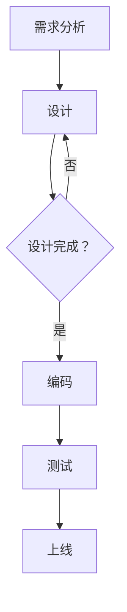
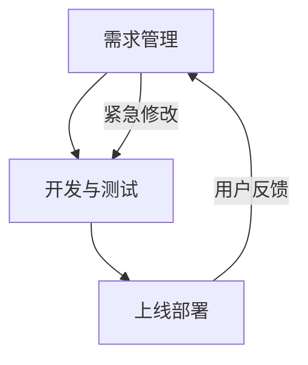
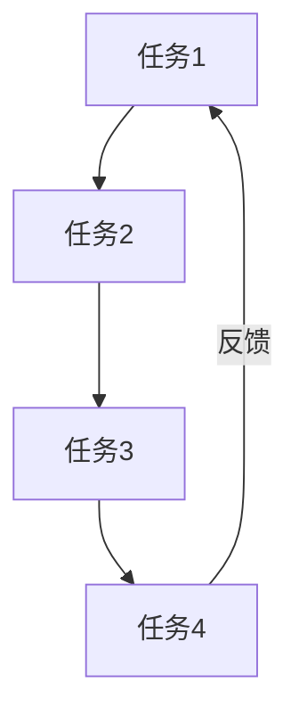

                 

### 文章标题
《团队协作的艺术：打造无缝衔接的工作流》

### 文章关键词
团队协作、工作流、无缝衔接、技术、工具、实践、挑战、解决方案

### 文章摘要
本文深入探讨团队协作的艺术，聚焦于打造无缝衔接的工作流。首先，我们将理解团队协作的基本概念及其重要性。接着，文章将详细解析工作流的定义、优化方法及其工具技术。随后，我们将讨论团队协作工具的选择与应用，结合案例和实践，展示如何应对团队协作中的挑战。最后，文章将总结团队协作的最佳实践，并提供进一步阅读的建议。

---

### 引言

在信息技术飞速发展的时代，团队协作和工作流优化已成为提高项目效率、确保项目成功的核心要素。无论是软件开发、系统集成，还是其他技术领域，高效的团队协作和无缝衔接的工作流都是企业竞争力的体现。

**团队协作**，即团队成员为了共同目标，通过有效沟通和合作，共同完成任务的过程。这不仅涉及到个体能力的发挥，更强调团队整体效率和协同效应。**工作流**，则是指任务执行的流程和规则，包括任务的分配、执行、监控和反馈等环节。优化工作流，可以提高任务的执行效率，减少冗余，降低风险。

本文旨在深入探讨团队协作的艺术，从基本概念到实践应用，全面解析如何打造无缝衔接的工作流。我们将通过以下步骤展开讨论：

1. **团队协作的原理与重要性**：探讨团队协作的定义、模型和核心要素。
2. **工作流的定义与优化**：解释工作流的概念、优化方法和相关工具技术。
3. **团队协作工具与技术**：分析团队协作工具的选择与应用，包括工作流管理工具、沟通与协作工具和项目管理工具。
4. **团队协作实践与案例分析**：结合实际案例，展示团队协作的成功经验和挑战解决方案。
5. **团队协作的挑战与解决策略**：探讨团队协作中常见挑战及解决策略。
6. **总结与最佳实践**：总结团队协作的艺术，提供最佳实践建议。

通过本文的阅读，读者将能够深入了解团队协作的艺术，掌握打造无缝衔接工作流的方法和策略，为实际工作提供有力的理论支持和实践经验。

### 团队协作的原理与重要性

团队协作，作为现代企业运作的重要基石，其核心在于通过团队成员的共同合作，实现资源的优化配置和协同效应。要理解团队协作的原理，我们首先需要明确其定义、模型及核心要素。

**定义**：团队协作是指一群具备不同技能和知识的人，为了实现共同的目标，通过相互沟通、共享信息和共同努力，共同完成任务的过程。在这个过程中，团队成员不仅发挥个人的专长，更通过协作提升团队的整体效能。

**模型**：团队协作的模型多种多样，常见的包括：

- **功能型模型**：基于团队职能分工，每个成员负责特定的任务，以确保整个项目顺利进行。
- **过程型模型**：强调团队成员在整个项目生命周期中的角色转变，从项目规划到执行再到收尾，每个成员的角色和职责动态调整。
- **敏捷型模型**：基于迭代和增量开发，强调团队成员的快速响应能力和灵活性，通过持续集成和交付，实现项目目标。

**核心要素**：

1. **共同目标**：共同目标是团队协作的基础，是团队成员共同追求的方向。只有明确了共同目标，团队才能在协作过程中保持一致，形成合力。
   
2. **相互信任**：信任是团队协作的粘合剂。团队成员之间必须建立信任，才能开放沟通、分享知识和经验，从而提高协作效率。

3. **明确责任**：明确责任是确保团队协作有序进行的关键。每个团队成员都应清楚自己的职责和任务，避免职责重叠和任务缺失。

4. **有效沟通**：沟通是团队协作的重要手段。团队成员需要通过有效沟通，确保信息的及时传递和准确理解，从而减少误解和冲突。

5. **协作工具**：现代协作工具为团队协作提供了强有力的支持。通过使用这些工具，团队成员可以方便地共享文档、讨论问题、跟踪任务进度，提高协作效率。

6. **持续反馈**：持续反馈是团队协作中不可或缺的一部分。通过及时反馈，团队成员可以了解自己的工作表现，发现问题并及时调整，从而不断提升团队协作的质量。

**协同效应**：团队协作的协同效应体现在多个方面。首先，通过团队的协作，可以充分发挥每个人的优势，实现资源的最佳配置。其次，团队成员之间的知识共享和技能互补，可以带来创新的火花，提高项目质量。最后，团队协作还可以增强企业的凝聚力，提升整体竞争力。

综上所述，团队协作不仅是完成任务的一种方式，更是一种管理艺术。通过理解其原理和核心要素，我们可以更有效地推动团队协作，实现企业目标。

### 工作流的定义与作用

工作流（Workflow）是指在组织中，将任务、信息和人通过有序的步骤和规则连接起来，实现特定目标的过程。工作流的定义和作用在企业和项目中具有重要意义，它不仅提高了工作效率，还优化了资源配置，降低了操作风险。

**定义**：工作流可以简单理解为“业务流程”或“操作流程”，是任务执行的一种系统化方法。具体而言，工作流定义了一系列操作步骤、规则和条件，用于描述如何从开始到结束执行一项任务或项目。

- **任务**：工作流中的基本操作单元，通常包括数据输入、数据处理、数据输出等。
- **步骤**：任务执行的顺序，决定了工作流的整体流程。
- **规则**：工作流中定义的约束条件，用于确保任务按照预定的方式进行。
- **触发器**：启动工作流的事件或条件，如任务完成、数据更新等。

**作用**：

1. **提高工作效率**：工作流通过定义和优化任务执行流程，减少了重复劳动，避免了不必要的步骤，从而提高了工作效率。团队成员可以专注于自己的专业领域，而不必担心流程上的混乱。

2. **优化资源配置**：工作流可以清晰地展示任务的分配情况，确保资源的合理配置。通过工作流，企业可以更好地管理人力、物力和时间资源，避免资源浪费。

3. **降低操作风险**：工作流中的规则和条件可以确保任务按照预定的方式进行，减少了因人为因素导致的错误。同时，工作流可以提供实时的监控和反馈机制，使企业能够及时发现问题并进行纠正。

4. **提供透明度**：工作流使得任务执行过程透明化，每个团队成员都可以清楚地了解自己的职责和工作进度。这种透明度有助于提高团队协作的效率，减少误解和冲突。

5. **支持决策制定**：工作流中的数据和报告为管理层提供了宝贵的信息，使他们能够更好地了解项目进展情况，做出更科学的决策。

**工作流与团队协作的关系**：工作流是团队协作的重要支撑。有效的团队协作需要清晰的工作流，以便团队成员明确各自的任务和职责。工作流不仅规范了任务的执行方式，还为团队协作提供了统一的平台和工具。

- **任务分配**：通过工作流，团队成员可以清晰地了解自己需要完成的任务和分配的角色。
- **进度跟踪**：工作流提供了任务进度跟踪功能，使团队成员和项目经理可以实时了解任务状态。
- **协作效率**：工作流通过定义明确的步骤和规则，减少了沟通成本和协作障碍，提高了团队协作效率。

总之，工作流是现代企业和团队协作不可或缺的一部分。通过优化工作流，企业可以更好地管理任务和资源，提高工作效率，降低操作风险，实现团队协作的最大化价值。

### 工作流的优化方法

工作流的优化是提高团队协作效率和质量的关键。优化工作流的方法主要包括工作流分析、工作流设计和工作流实施。以下详细解析这三个步骤，并提供实用的优化策略。

**1. 工作流分析**

工作流分析是优化工作的第一步，通过系统地分析现有工作流程，识别出瓶颈和改进机会。以下是工作流分析的关键步骤：

- **任务识别**：详细记录工作流中的每个任务，包括任务的名称、执行者、执行时间、依赖关系等。
- **流程可视化**：使用流程图工具，如Mermaid，将工作流可视化，帮助理解和分析流程。
- **瓶颈分析**：识别流程中的瓶颈环节，如任务执行时间长、依赖关系复杂等。
- **成本分析**：评估每个任务的成本，包括人力、时间、资源等，找出高成本的任务。
- **反馈收集**：与团队成员和项目负责人进行沟通，收集对现有流程的意见和建议。

**优化策略**：

- **简化流程**：去除不必要的任务和环节，减少冗余步骤，简化工作流。
- **标准化任务**：制定明确的任务标准和规范，确保每个任务都能按照标准执行。
- **自动化任务**：对于重复性和规则性强的任务，采用自动化工具进行执行，减少人工干预。

**示例**：

假设我们有一个软件项目的开发工作流，包括需求分析、设计、编码、测试、上线等步骤。通过工作流分析，我们发现设计阶段和编码阶段的依赖关系复杂，经常导致项目延误。为了优化，我们可以将设计阶段分解为多个子任务，并引入自动化设计工具，减少设计时间，同时优化编码阶段的流程，确保编码和测试的连贯性。

**2. 工作流设计**

工作流设计是在工作流分析的基础上，制定出优化后的工作流程。工作流设计需要综合考虑任务、规则、资源和约束条件，确保工作流程高效、灵活和可扩展。以下是工作流设计的步骤：

- **制定目标**：明确工作流设计的目标，如提高效率、降低成本、提升质量等。
- **设计流程**：根据分析结果，重新设计工作流程，优化任务顺序和依赖关系。
- **规则制定**：定义工作流中的规则和条件，确保任务按照预定的方式进行。
- **资源规划**：根据工作流需求，规划所需的人力、物力和时间资源。
- **风险评估**：评估工作流设计中的潜在风险，并制定相应的应对措施。

**优化策略**：

- **模块化设计**：将工作流分解为多个模块，每个模块负责特定的任务，提高系统的灵活性和可维护性。
- **适应性设计**：设计工作流时，考虑不同场景和需求的变化，确保工作流具有适应性。
- **用户体验**：从用户的角度出发，优化工作流中的交互环节，提高用户体验。

**示例**：

假设我们需要优化一个软件项目的交付工作流。通过设计，我们可以将工作流分为三个模块：需求管理、开发和测试、上线部署。每个模块都有明确的任务和规则，并且可以通过自动化工具进行监控和反馈，确保项目的顺利进行。

**3. 工作流实施**

工作流实施是将优化后的工作流实际应用到项目中，通过工具和技术的支持，确保工作流程的顺利执行。以下是工作流实施的关键步骤：

- **工具选择**：选择合适的工作流管理工具，如JIRA、Confluence等，支持任务跟踪和协作。
- **培训与支持**：对团队成员进行工作流工具的培训，确保他们能够熟练使用。
- **测试与验证**：在实际应用前，对工作流进行测试，确保其能够满足预期目标。
- **监控与反馈**：建立监控机制，实时跟踪工作流执行情况，及时反馈问题和改进。

**优化策略**：

- **逐步实施**：分阶段实施工作流，逐步优化每个环节，避免一次性全面引入带来的冲击。
- **持续改进**：根据实际执行情况，持续优化工作流，不断改进和优化。
- **反馈机制**：建立有效的反馈机制，鼓励团队成员提出改进建议，共同优化工作流。

**示例**：

在实施优化的工作流时，我们可以在项目管理工具中设置任务跟踪和进度报告，确保每个任务都能按时完成。同时，通过定期的团队会议和反馈环节，及时解决出现的问题，确保工作流的高效运行。

总之，通过工作流分析、设计和实施，我们可以优化团队协作的工作流，提高工作效率，降低操作风险，实现项目目标。在实际应用中，需要结合具体情况进行调整，确保工作流能够满足团队的需求和期望。

### 工作流工具与技术

在现代企业中，工作流工具和技术的应用极大地提升了团队协作的效率。以下将详细探讨工作流管理工具、自动化技术和相关技术，以及如何选择和有效利用这些工具和技术。

**1. 工作流管理工具**

工作流管理工具（Workflow Management Tools）是一种用于定义、执行和监控工作流程的软件。这些工具可以帮助企业自动化和优化业务流程，减少人为错误，提高工作效率。以下是几种常见的工作流管理工具：

- **JIRA**：JIRA是一款功能强大的项目管理工具，提供了灵活的工作流定义和任务跟踪功能。用户可以创建自定义的工作流，管理任务状态，并通过权限控制确保团队成员之间的协作。

- **Confluence**：Confluence是Atlassian公司推出的协作工具，用于文档共享和知识管理。通过Confluence，团队成员可以实时协作，共同编辑文档，确保信息的准确性和及时性。

- **Microsoft Teams**：Microsoft Teams是一款集成通信、协作和会议的软件，提供了任务管理、工作流自动化和实时沟通的功能。用户可以在Teams中创建任务、分配任务、跟踪进度，并与其他团队成员实时协作。

**如何选择工作流管理工具**：

选择工作流管理工具时，需要考虑以下因素：

- **需求**：根据企业的具体需求，选择能够满足工作流管理需求的功能，如任务分配、进度跟踪、报告生成等。
- **集成性**：选择能够与企业现有系统集成的工具，确保数据的无缝流动和信息的实时共享。
- **易用性**：选择用户界面友好、易于使用的工具，降低团队成员的学习成本。
- **扩展性**：选择具有良好扩展性的工具，以适应企业未来发展的需求。

**2. 自动化技术**

自动化技术（Automation Technologies）是工作流优化的重要手段，通过自动化工具和脚本，实现重复性任务和规则性任务的自动执行，减少人工干预，提高工作效率。以下是几种常见的自动化技术：

- **RPA（Robotic Process Automation）**：RPA通过模拟人工操作，实现跨系统和流程的自动化处理。RPA工具如UiPath、Blue Prism等，可以自动化数据录入、报表生成、数据校验等任务，减少人工操作的错误。

- **BPM（Business Process Management）**：BPM是一种通过流程建模、自动化和优化来管理业务流程的技术。BPM工具如IBM BPM、Pegasystems等，提供了流程设计、自动化执行和监控的功能，帮助企业实现高效的业务流程管理。

- **CI/CD（Continuous Integration/Continuous Deployment）**：CI/CD是一种通过自动化构建、测试和部署来加速软件开发和发布的技术。CI/CD工具如Jenkins、GitLab CI等，可以自动化代码集成、测试和部署，确保软件质量，缩短发布周期。

**如何实现工作流自动化**：

实现工作流自动化需要以下步骤：

- **需求分析**：分析现有工作流程，确定需要自动化的任务和环节。
- **工具选择**：根据需求选择合适的自动化工具，如RPA、BPM或CI/CD工具。
- **流程设计**：使用自动化工具设计工作流，定义任务、规则和流程。
- **脚本编写**：根据工作流设计，编写自动化脚本，实现任务的自动执行。
- **测试与部署**：对自动化工作流进行测试，确保其能够按照预期运行，然后部署到生产环境中。

**3. 其他相关技术**

除了工作流管理工具和自动化技术，还有其他相关技术可以辅助工作流优化：

- **AI与机器学习**：通过AI和机器学习技术，可以实现智能任务分配、预测分析等，提高工作流的管理和优化能力。
- **区块链**：区块链技术可以用于确保工作流中数据的完整性和安全性，减少数据篡改的风险。
- **云计算**：云计算提供了灵活的IT资源管理，帮助企业快速部署和扩展工作流系统。

**总结**

工作流工具和技术的应用，极大地提升了团队协作的效率和质量。通过选择合适的工作流管理工具，实现工作流的自动化，并结合其他相关技术，企业可以构建高效、灵活的工作流系统，实现持续的业务优化和增长。在实际应用中，需要结合企业具体需求，灵活选择和组合各种工具和技术，确保工作流系统能够满足企业的长期发展目标。

### 团队协作工具的选择与应用

在现代企业中，团队协作工具的选择和应用至关重要，它们不仅能够提高工作效率，还能促进团队成员之间的有效沟通和协作。以下是几种常见的团队协作工具及其应用场景：

**1. 工作流管理工具**

- **JIRA**：JIRA是Atlassian公司推出的项目管理工具，适用于软件项目中的任务跟踪、进度管理和协作。JIRA允许用户创建任务、跟踪进度、分配任务，并提供丰富的报告功能。通过JIRA，团队成员可以实时了解任务状态，确保项目按计划进行。

  **应用场景**：软件开发项目、产品迭代、敏捷开发团队。

- **Trello**：Trello是一款简单易用的看板式任务管理工具，用户可以通过拖放操作来管理任务，清晰地展示项目进度。Trello适用于小团队或项目，特别适合需要可视化任务进度的场景。

  **应用场景**：小规模项目、初创团队、跨部门协作。

**2. 沟通与协作工具**

- **Slack**：Slack是一款流行的即时通讯工具，支持团队内部实时沟通、文件共享和任务协作。Slack提供了多种集成方式，可以与其他工作流管理工具和自动化工具结合使用，提高协作效率。

  **应用场景**：企业内部沟通、团队协作、跨部门沟通。

- **Microsoft Teams**：Microsoft Teams集成了通信、协作和会议功能，提供了即时消息、语音和视频通话、文件共享和任务管理。通过Teams，团队成员可以随时随地协作，提高工作效率。

  **应用场景**：企业内部沟通、远程办公、跨部门协作。

**3. 项目管理工具**

- **Asana**：Asana是一款功能全面的任务管理工具，提供了任务分配、进度跟踪、报告生成等功能。用户可以通过Asana创建项目、分配任务、设置截止日期，并实时跟踪项目进度。

  **应用场景**：项目管理和任务跟踪、大型团队协作。

- **Trello**：Trello不仅可以作为任务管理工具，还可以用于项目管理。用户可以创建多个看板，分别代表不同的项目阶段，通过卡片来管理任务，确保项目顺利进行。

  **应用场景**：项目管理、跨部门协作、小型项目。

**选择团队协作工具的考虑因素**

选择团队协作工具时，需要考虑以下因素：

- **团队规模**：根据团队规模和需求，选择适合的工具，如小型团队可以选择Trello，大型团队则需要Asana或JIRA等综合性工具。
- **功能需求**：根据项目需求，选择具备所需功能的工具，如任务跟踪、进度管理、报告生成等。
- **集成性**：选择能够与企业现有系统集成的工具，确保数据的无缝流动和信息的实时共享。
- **用户界面**：选择用户界面友好、易于使用的工具，降低团队成员的学习成本。
- **成本**：考虑工具的成本和预算，选择性价比高的解决方案。

**最佳实践**

- **统一平台**：尽量选择能够整合沟通、协作和任务管理的单一平台，避免使用多个工具导致的信息孤岛。
- **培训与支持**：为新成员提供培训，确保他们能够熟练使用团队协作工具。
- **持续改进**：定期评估团队协作工具的使用情况，根据团队反馈和项目需求，优化工具配置和使用策略。

通过选择和应用合适的团队协作工具，企业可以更好地管理项目，提高团队协作效率，实现目标的高效达成。

### 团队协作技术实践

团队协作技术实践是确保团队高效运作、任务顺利完成的重要环节。以下将结合具体案例，详细探讨敏捷开发、省心协作和跨部门协作等团队协作技术实践，并提供具体的工具和技术支持。

#### 敏捷开发

敏捷开发是一种以人为核心、迭代和增量为特征的软件开发方法。其核心理念是快速响应变化、持续交付价值，并重视团队协作和客户反馈。

**案例**：某互联网公司正在开发一款社交媒体应用，需求不断变化，传统的瀑布开发模式难以应对。为了提高开发效率和应对需求变化，公司决定采用敏捷开发方法。

**具体实践**：

1. **用户故事地图**：团队使用用户故事地图来梳理用户需求和功能优先级，确保开发工作聚焦于高价值功能。
2. **迭代计划**：团队每月进行一次迭代计划，根据用户故事地图确定本次迭代的目标，分配任务。
3. **每日站立会议**：团队成员每天召开5-10分钟的站立会议，同步进展、讨论问题和调整计划。
4. **回顾会议**：每个迭代结束后，团队进行回顾会议，总结成功经验、反思不足，制定改进措施。

**工具和技术支持**：

- **JIRA**：用于任务跟踪和迭代管理，团队可以创建用户故事、任务和迭代，实时跟踪进度。
- **Confluence**：用于文档共享和知识管理，团队成员可以在此平台共享用户故事、需求文档和设计文档。
- **Slack**：用于实时沟通和协作，团队成员可以在Slack频道中讨论问题和同步进展。

#### 省心协作

省心协作旨在通过自动化和简化流程，减少团队成员的工作负担，提高协作效率。

**案例**：某初创公司开发一款智能家居应用，团队成员分散在不同地点，沟通协作效率成为一大挑战。为了提高协作效率，公司采用了一系列省心协作技术。

**具体实践**：

1. **自动化测试**：通过自动化测试工具（如Selenium）进行测试，减少手工测试的工作量，提高测试效率。
2. **持续集成与持续部署**（CI/CD）：使用CI/CD工具（如Jenkins）实现自动化构建、测试和部署，确保代码质量和快速交付。
3. **敏捷看板**：使用Trello或JIRA等工具建立敏捷看板，直观展示任务进度和责任分配，减少沟通成本。

**工具和技术支持**：

- **Jenkins**：用于持续集成与持续部署，自动化构建、测试和部署流程，提高开发效率。
- **Git**：用于版本控制，确保代码的版本管理和协作开发。
- **GitHub**：用于代码托管和协作，团队成员可以在此平台上进行代码审查和协同工作。

#### 跨部门协作

跨部门协作是企业中常见且复杂的一项工作，需要各部门之间紧密配合、信息畅通。

**案例**：某大型企业正在开发一款智能家居系统，涉及硬件、软件、市场等多个部门。为了确保项目的顺利进行，企业采用了一系列跨部门协作技术。

**具体实践**：

1. **统一沟通平台**：使用Microsoft Teams或Slack等统一沟通平台，确保各部门之间的实时沟通和信息共享。
2. **项目协同工具**：使用Trello或JIRA等项目管理工具，各部门可以在此平台上协同工作，明确任务分工和进度。
3. **定期会议**：定期召开跨部门会议，讨论项目进展、问题和解决方案，确保各部门之间的协调和配合。

**工具和技术支持**：

- **Microsoft Teams**：用于统一沟通和协作，支持即时消息、语音和视频通话、文件共享等功能。
- **Trello**：用于项目管理和任务跟踪，各部门可以在此平台上创建任务板、看板，实时跟踪项目进度。
- **Confluence**：用于文档共享和知识管理，各部门可以在Confluence上共享需求文档、设计文档和项目报告。

#### 案例分析和总结

通过上述案例，我们可以看到，不同的团队协作技术实践在不同的场景下发挥了重要作用。敏捷开发、省心协作和跨部门协作等实践不仅提高了团队协作效率，还确保了项目的顺利进行和成功交付。

- **敏捷开发**：通过迭代和增量开发，快速响应需求变化，提高软件质量。
- **省心协作**：通过自动化和简化流程，减少工作负担，提高工作效率。
- **跨部门协作**：通过统一沟通平台和项目管理工具，确保各部门之间的紧密配合和信息共享。

在实际应用中，企业需要根据自身特点和需求，选择和组合合适的团队协作技术实践，确保团队高效运作和项目成功。

### 团队协作中的常见挑战与解决策略

尽管团队协作在提升工作效率和项目成功方面具有重要作用，但在实际操作中，团队协作也面临着诸多挑战。以下将探讨团队协作中常见的挑战，并针对每个挑战提供具体的解决策略。

**1. 通信不畅**

**挑战**：团队成员之间的沟通不畅会导致信息传递延误、误解和冲突，影响团队协作效果。

**解决策略**：

- **明确沟通目标**：在每次沟通前，明确沟通的目标和议程，确保沟通聚焦于关键信息。
- **使用多种沟通渠道**：结合电子邮件、即时消息、电话和会议等多种沟通渠道，确保信息的及时传递。
- **定期沟通会议**：定期召开团队会议，同步项目进展、讨论问题和制定解决方案。
- **建立沟通规范**：制定明确的沟通规范，如使用统一的术语、格式和语言，确保信息准确传递。

**2. 角色冲突**

**挑战**：团队成员在角色和职责上的冲突会导致任务重叠、责任不清，影响团队协作。

**解决策略**：

- **明确角色和职责**：在项目启动时，明确每个团队成员的角色和职责，确保任务分配合理。
- **角色职责培训**：对团队成员进行角色职责的培训，确保他们了解自己的职责和角色。
- **定期评估和调整**：定期评估团队协作情况，及时调整角色和职责分配，确保团队高效运作。
- **建立共同目标**：明确团队共同目标，强化团队成员的责任感和协作意识。

**3. 缺乏信任**

**挑战**：团队成员之间的信任缺乏会导致合作不力、推诿责任，影响团队协作。

**解决策略**：

- **建立信任机制**：通过团队建设活动、信任游戏等方式，建立团队成员之间的信任。
- **透明沟通**：鼓励团队成员进行透明沟通，分享知识和经验，增强信任。
- **相互反馈**：建立有效的反馈机制，鼓励团队成员之间进行积极的反馈和建设性批评。
- **共同解决问题**：鼓励团队成员共同面对问题，共同寻找解决方案，增强团队凝聚力。

**4. 时间管理不当**

**挑战**：团队成员时间管理不当会导致任务拖延、进度延误，影响项目进展。

**解决策略**：

- **制定详细计划**：在项目启动时，制定详细的计划和时间表，明确任务截止日期和里程碑。
- **任务分配合理**：根据团队成员的能力和时间安排，合理分配任务，避免过度负荷。
- **实时监控进度**：使用项目管理工具实时监控任务进度，及时发现问题并进行调整。
- **定期进度会议**：定期召开进度会议，讨论任务进展、问题和解决方案，确保项目按计划进行。

**5. 缺乏激励机制**

**挑战**：缺乏有效的激励机制会导致团队成员积极性不高，影响团队协作效果。

**解决策略**：

- **设立奖励机制**：根据项目进展和团队绩效，设立奖励机制，激励团队成员积极工作。
- **认可和表彰**：对团队成员的突出贡献进行认可和表彰，增强他们的成就感和归属感。
- **公平评价**：建立公正的评价体系，确保团队成员的绩效和贡献得到公正评价。
- **提供职业发展机会**：为团队成员提供职业发展机会和培训，激励他们不断提升自身能力。

通过以上解决策略，企业可以应对团队协作中的各种挑战，提高团队协作效率，实现项目目标。

### 团队协作的艺术：打造无缝衔接的工作流

**总结**：

团队协作的艺术在于理解其原理、运用有效的工具和技术、应对挑战并持续优化工作流。通过本文的探讨，我们明确了团队协作的定义、工作流的重要性以及优化工作流的步骤。同时，我们介绍了各种团队协作工具和技术，结合实践案例，展示了如何在实际操作中应用这些工具和技术。

**最佳实践**：

1. **明确共同目标**：确保团队成员理解并共同追求项目的目标。
2. **建立信任机制**：通过透明沟通和共同解决问题，建立团队成员之间的信任。
3. **使用合适工具**：结合团队规模和需求，选择合适的团队协作工具，提高协作效率。
4. **持续优化**：定期评估工作流，根据反馈和实际情况，持续优化团队协作流程。

**注意事项**：

1. **沟通要有效**：确保信息传递准确、及时，避免误解和冲突。
2. **合理分配任务**：根据团队成员的能力和兴趣，合理分配任务，避免过度负荷。
3. **激励机制**：设立有效的奖励和认可机制，提高团队成员的积极性和归属感。

**拓展阅读**：

- 《Scrum精髓：实践指南与案例解析》
- 《敏捷开发实践指南》
- 《工作流管理：原理与实践》

通过不断学习和实践，企业可以提升团队协作水平，打造无缝衔接的工作流，实现持续的业务优化和增长。让我们在团队协作的艺术中，不断探索、创新，共同推动企业的发展。

### 作者信息

作者：AI天才研究院/AI Genius Institute & 禅与计算机程序设计艺术 /Zen And The Art of Computer Programming

---

### 完整的文章正文内容

### 引言

在信息技术飞速发展的时代，团队协作和工作流优化已成为提高项目效率、确保项目成功的核心要素。无论是软件开发、系统集成，还是其他技术领域，高效的团队协作和无缝衔接的工作流都是企业竞争力的体现。

**团队协作**，即团队成员为了共同目标，通过有效沟通和合作，共同完成任务的过程。这不仅涉及到个体能力的发挥，更强调团队整体效率和协同效应。**工作流**，则是指任务执行的流程和规则，包括任务的分配、执行、监控和反馈等环节。优化工作流，可以提高任务的执行效率，减少冗余，降低风险。

本文旨在深入探讨团队协作的艺术，从基本概念到实践应用，全面解析如何打造无缝衔接的工作流。我们将通过以下步骤展开讨论：

1. **团队协作的原理与重要性**：探讨团队协作的定义、模型和核心要素。
2. **工作流的定义与优化**：解释工作流的概念、优化方法和相关工具技术。
3. **团队协作工具与技术**：分析团队协作工具的选择与应用，包括工作流管理工具、沟通与协作工具和项目管理工具。
4. **团队协作实践与案例分析**：结合实际案例，展示团队协作的成功经验和挑战解决方案。
5. **团队协作的挑战与解决策略**：探讨团队协作中常见挑战及解决策略。
6. **总结与最佳实践**：总结团队协作的艺术，提供最佳实践建议。

通过本文的阅读，读者将能够深入了解团队协作的艺术，掌握打造无缝衔接工作流的方法和策略，为实际工作提供有力的理论支持和实践经验。

### 团队协作的原理与重要性

团队协作，作为现代企业运作的重要基石，其核心在于通过团队成员的共同合作，实现资源的优化配置和协同效应。要理解团队协作的原理，我们首先需要明确其定义、模型及核心要素。

**定义**：团队协作是指一群具备不同技能和知识的人，为了实现共同的目标，通过相互沟通、共享信息和共同努力，共同完成任务的过程。在这个过程中，团队成员不仅发挥个人的专长，更通过协作提升团队的整体效能。

**模型**：团队协作的模型多种多样，常见的包括：

- **功能型模型**：基于团队职能分工，每个成员负责特定的任务，以确保整个项目顺利进行。
- **过程型模型**：强调团队成员在整个项目生命周期中的角色转变，从项目规划到执行再到收尾，每个成员的角色和职责动态调整。
- **敏捷型模型**：基于迭代和增量开发，强调团队成员的快速响应能力和灵活性，通过持续集成和交付，实现项目目标。

**核心要素**：

1. **共同目标**：共同目标是团队协作的基础，是团队成员共同追求的方向。只有明确了共同目标，团队才能在协作过程中保持一致，形成合力。

2. **相互信任**：信任是团队协作的粘合剂。团队成员之间必须建立信任，才能开放沟通、分享知识和经验，从而提高协作效率。

3. **明确责任**：明确责任是确保团队协作有序进行的关键。每个团队成员都应清楚自己的职责和任务，避免职责重叠和任务缺失。

4. **有效沟通**：沟通是团队协作的重要手段。团队成员需要通过有效沟通，确保信息的及时传递和准确理解，从而减少误解和冲突。

5. **协作工具**：现代协作工具为团队协作提供了强有力的支持。通过使用这些工具，团队成员可以方便地共享文档、讨论问题、跟踪任务进度，提高协作效率。

6. **持续反馈**：持续反馈是团队协作中不可或缺的一部分。通过及时反馈，团队成员可以了解自己的工作表现，发现问题并及时调整，从而不断提升团队协作的质量。

**协同效应**：团队协作的协同效应体现在多个方面。首先，通过团队的协作，可以充分发挥每个人的优势，实现资源的最佳配置。其次，团队成员之间的知识共享和技能互补，可以带来创新的火花，提高项目质量。最后，团队协作还可以增强企业的凝聚力，提升整体竞争力。

综上所述，团队协作不仅是完成任务的一种方式，更是一种管理艺术。通过理解其原理和核心要素，我们可以更有效地推动团队协作，实现企业目标。

### 工作流的定义与作用

工作流（Workflow）是指在组织中，将任务、信息和人通过有序的步骤和规则连接起来，实现特定目标的过程。工作流的定义和作用在企业和项目中具有重要意义，它不仅提高了工作效率，还优化了资源配置，降低了操作风险。

**定义**：工作流可以简单理解为“业务流程”或“操作流程”，是任务执行的一种系统化方法。具体而言，工作流定义了一系列操作步骤、规则和条件，用于描述如何从开始到结束执行一项任务或项目。

- **任务**：工作流中的基本操作单元，通常包括数据输入、数据处理、数据输出等。
- **步骤**：任务执行的顺序，决定了工作流的整体流程。
- **规则**：工作流中定义的约束条件，用于确保任务按照预定的方式进行。
- **触发器**：启动工作流的事件或条件，如任务完成、数据更新等。

**作用**：

1. **提高工作效率**：工作流通过定义和优化任务执行流程，减少了重复劳动，避免了不必要的步骤，从而提高了工作效率。团队成员可以专注于自己的专业领域，而不必担心流程上的混乱。

2. **优化资源配置**：工作流可以清晰地展示任务的分配情况，确保资源的合理配置。通过工作流，企业可以更好地管理人力、物力和时间资源，避免资源浪费。

3. **降低操作风险**：工作流中的规则和条件可以确保任务按照预定的方式进行，减少了因人为因素导致的错误。同时，工作流可以提供实时的监控和反馈机制，使企业能够及时发现问题并进行纠正。

4. **提供透明度**：工作流使得任务执行过程透明化，每个团队成员都可以清楚地了解自己的职责和工作进度。这种透明度有助于提高团队协作的效率，减少误解和冲突。

5. **支持决策制定**：工作流中的数据和报告为管理层提供了宝贵的信息，使他们能够更好地了解项目进展情况，做出更科学的决策。

**工作流与团队协作的关系**：工作流是团队协作的重要支撑。有效的团队协作需要清晰的工作流，以便团队成员明确各自的任务和职责。工作流不仅规范了任务的执行方式，还为团队协作提供了统一的平台和工具。

- **任务分配**：通过工作流，团队成员可以清晰地了解自己需要完成的任务和分配的角色。
- **进度跟踪**：工作流提供了任务进度跟踪功能，使团队成员和项目经理可以实时了解任务状态。
- **协作效率**：工作流通过定义明确的步骤和规则，减少了沟通成本和协作障碍，提高了团队协作效率。

总之，工作流是现代企业和团队协作不可或缺的一部分。通过优化工作流，企业可以更好地管理任务和资源，提高工作效率，降低操作风险，实现团队协作的最大化价值。

### 工作流的优化方法

工作流的优化是提高团队协作效率和质量的关键。优化工作流的方法主要包括工作流分析、工作流设计和工作流实施。以下详细解析这三个步骤，并提供实用的优化策略。

**1. 工作流分析**

工作流分析是优化工作的第一步，通过系统地分析现有工作流程，识别出瓶颈和改进机会。以下是工作流分析的关键步骤：

- **任务识别**：详细记录工作流中的每个任务，包括任务的名称、执行者、执行时间、依赖关系等。
- **流程可视化**：使用流程图工具，如Mermaid，将工作流可视化，帮助理解和分析流程。
- **瓶颈分析**：识别流程中的瓶颈环节，如任务执行时间长、依赖关系复杂等。
- **成本分析**：评估每个任务的成本，包括人力、时间、资源等，找出高成本的任务。
- **反馈收集**：与团队成员和项目负责人进行沟通，收集对现有流程的意见和建议。

**优化策略**：

- **简化流程**：去除不必要的任务和环节，减少冗余步骤，简化工作流。
- **标准化任务**：制定明确的任务标准和规范，确保每个任务都能按照标准执行。
- **自动化任务**：对于重复性和规则性强的任务，采用自动化工具进行执行，减少人工干预。

**示例**：

假设我们有一个软件项目的开发工作流，包括需求分析、设计、编码、测试、上线等步骤。通过工作流分析，我们发现设计阶段和编码阶段的依赖关系复杂，经常导致项目延误。为了优化，我们可以将设计阶段分解为多个子任务，并引入自动化设计工具，减少设计时间，同时优化编码阶段的流程，确保编码和测试的连贯性。

**2. 工作流设计**

工作流设计是在工作流分析的基础上，制定出优化后的工作流程。工作流设计需要综合考虑任务、规则、资源和约束条件，确保工作流程高效、灵活和可扩展。以下是工作流设计的步骤：

- **制定目标**：明确工作流设计的目标，如提高效率、降低成本、提升质量等。
- **设计流程**：根据分析结果，重新设计工作流程，优化任务顺序和依赖关系。
- **规则制定**：定义工作流中的规则和条件，确保任务按照预定的方式进行。
- **资源规划**：根据工作流需求，规划所需的人力、物力和时间资源。
- **风险评估**：评估工作流设计中的潜在风险，并制定相应的应对措施。

**优化策略**：

- **模块化设计**：将工作流分解为多个模块，每个模块负责特定的任务，提高系统的灵活性和可维护性。
- **适应性设计**：设计工作流时，考虑不同场景和需求的变化，确保工作流具有适应性。
- **用户体验**：从用户的角度出发，优化工作流中的交互环节，提高用户体验。

**示例**：

假设我们需要优化一个软件项目的交付工作流。通过设计，我们可以将工作流分为三个模块：需求管理、开发和测试、上线部署。每个模块都有明确的任务和规则，并且可以通过自动化工具进行监控和反馈，确保项目的顺利进行。

**3. 工作流实施**

工作流实施是将优化后的工作流实际应用到项目中，通过工具和技术的支持，确保工作流程的顺利执行。以下是工作流实施的关键步骤：

- **工具选择**：选择合适的工作流管理工具，如JIRA、Confluence等，支持任务跟踪和协作。
- **培训与支持**：对团队成员进行工作流工具的培训，确保他们能够熟练使用。
- **测试与验证**：在实际应用前，对工作流进行测试，确保其能够满足预期目标。
- **监控与反馈**：建立监控机制，实时跟踪工作流执行情况，及时反馈问题和改进。

**优化策略**：

- **逐步实施**：分阶段实施工作流，逐步优化每个环节，避免一次性全面引入带来的冲击。
- **持续改进**：根据实际执行情况，持续优化工作流，不断改进和优化。
- **反馈机制**：建立有效的反馈机制，鼓励团队成员提出改进建议，共同优化工作流。

**示例**：

在实施优化的工作流时，我们可以在项目管理工具中设置任务跟踪和进度报告，确保每个任务都能按时完成。同时，通过定期的团队会议和反馈环节，及时解决出现的问题，确保工作流的高效运行。

总之，通过工作流分析、设计和实施，我们可以优化团队协作的工作流，提高工作效率，降低操作风险，实现项目目标。在实际应用中，需要结合具体情况进行调整，确保工作流能够满足团队的需求和期望。

### 工作流工具与技术

在现代企业中，工作流工具和技术的应用极大地提升了团队协作的效率。以下将详细探讨工作流管理工具、自动化技术和相关技术，以及如何选择和有效利用这些工具和技术。

**1. 工作流管理工具**

工作流管理工具（Workflow Management Tools）是一种用于定义、执行和监控工作流程的软件。这些工具可以帮助企业自动化和优化业务流程，减少人为错误，提高工作效率。以下是几种常见的工作流管理工具：

- **JIRA**：JIRA是Atlassian公司推出的项目管理工具，适用于软件项目中的任务跟踪、进度管理和协作。JIRA允许用户创建自定义的工作流，管理任务状态，并通过权限控制确保团队成员之间的协作。

  **应用场景**：软件开发项目、产品迭代、敏捷开发团队。

- **Confluence**：Confluence是Atlassian公司推出的协作工具，用于文档共享和知识管理。通过Confluence，团队成员可以实时协作，共同编辑文档，确保信息的准确性和及时性。

  **应用场景**：企业内部沟通、团队协作、跨部门沟通。

- **Microsoft Teams**：Microsoft Teams集成了通信、协作和会议功能，提供了任务管理、工作流自动化和实时沟通的功能。用户可以在Teams中创建任务、分配任务、跟踪进度，并与其他团队成员实时协作。

  **应用场景**：企业内部沟通、远程办公、跨部门协作。

**如何选择工作流管理工具**：

选择工作流管理工具时，需要考虑以下因素：

- **需求**：根据企业的具体需求，选择能够满足工作流管理需求的功能，如任务分配、进度跟踪、报告生成等。
- **集成性**：选择能够与企业现有系统集成的工具，确保数据的无缝流动和信息的实时共享。
- **易用性**：选择用户界面友好、易于使用的工具，降低团队成员的学习成本。
- **扩展性**：选择具有良好扩展性的工具，以适应企业未来发展的需求。

**2. 自动化技术**

自动化技术（Automation Technologies）是工作流优化的重要手段，通过自动化工具和脚本，实现重复性任务和规则性任务的自动执行，减少人工干预，提高工作效率。以下是几种常见的自动化技术：

- **RPA（Robotic Process Automation）**：RPA通过模拟人工操作，实现跨系统和流程的自动化处理。RPA工具如UiPath、Blue Prism等，可以自动化数据录入、报表生成、数据校验等任务，减少人工操作的错误。

  **应用场景**：数据录入、报表生成、财务审计。

- **BPM（Business Process Management）**：BPM是一种通过流程建模、自动化和优化来管理业务流程的技术。BPM工具如IBM BPM、Pegasystems等，提供了流程设计、自动化执行和监控的功能，帮助企业实现高效的业务流程管理。

  **应用场景**：企业内部流程管理、供应链管理、客户服务。

- **CI/CD（Continuous Integration/Continuous Deployment）**：CI/CD是一种通过自动化构建、测试和部署来加速软件开发和发布的技术。CI/CD工具如Jenkins、GitLab CI等，可以自动化代码集成、测试和部署，确保软件质量，缩短发布周期。

  **应用场景**：软件开发、持续集成、持续部署。

**如何实现工作流自动化**：

实现工作流自动化需要以下步骤：

- **需求分析**：分析现有工作流程，确定需要自动化的任务和环节。
- **工具选择**：根据需求选择合适的自动化工具，如RPA、BPM或CI/CD工具。
- **流程设计**：使用自动化工具设计工作流，定义任务、规则和流程。
- **脚本编写**：根据工作流设计，编写自动化脚本，实现任务的自动执行。
- **测试与部署**：对自动化工作流进行测试，确保其能够按照预期运行，然后部署到生产环境中。

**3. 其他相关技术**

除了工作流管理工具和自动化技术，还有其他相关技术可以辅助工作流优化：

- **AI与机器学习**：通过AI和机器学习技术，可以实现智能任务分配、预测分析等，提高工作流的管理和优化能力。
- **区块链**：区块链技术可以用于确保工作流中数据的完整性和安全性，减少数据篡改的风险。
- **云计算**：云计算提供了灵活的IT资源管理，帮助企业快速部署和扩展工作流系统。

**总结**

工作流工具和技术的应用，极大地提升了团队协作的效率和质量。通过选择合适的工作流管理工具，实现工作流的自动化，并结合其他相关技术，企业可以构建高效、灵活的工作流系统，实现持续的业务优化和增长。在实际应用中，需要结合企业具体需求，灵活选择和组合各种工具和技术，确保工作流系统能够满足企业的长期发展目标。

### 团队协作工具的选择与应用

在现代企业中，团队协作工具的选择和应用至关重要，它们不仅能够提高工作效率，还能促进团队成员之间的有效沟通和协作。以下将详细探讨几种常见的团队协作工具及其应用场景。

**1. 工作流管理工具**

- **JIRA**：JIRA是Atlassian公司推出的项目管理工具，适用于软件项目中的任务跟踪、进度管理和协作。JIRA允许用户创建自定义的工作流，管理任务状态，并通过权限控制确保团队成员之间的协作。

  **应用场景**：软件开发项目、产品迭代、敏捷开发团队。

- **Trello**：Trello是一款简单易用的看板式任务管理工具，用户可以通过拖放操作来管理任务，清晰地展示项目进度。Trello适用于小团队或项目，特别适合需要可视化任务进度的场景。

  **应用场景**：小规模项目、初创团队、跨部门协作。

**如何选择工作流管理工具**：

选择工作流管理工具时，需要考虑以下因素：

- **团队规模**：根据团队规模和需求，选择适合的工具，如小型团队可以选择Trello，大型团队则需要Asana或JIRA等综合性工具。
- **功能需求**：根据项目需求，选择具备所需功能的工具，如任务跟踪、进度管理、报告生成等。
- **集成性**：选择能够与企业现有系统集成的工具，确保数据的无缝流动和信息的实时共享。
- **易用性**：选择用户界面友好、易于使用的工具，降低团队成员的学习成本。
- **扩展性**：选择具有良好扩展性的工具，以适应企业未来发展的需求。

**2. 沟通与协作工具**

- **Slack**：Slack是一款流行的即时通讯工具，支持团队内部实时沟通、文件共享和任务协作。Slack提供了多种集成方式，可以与其他工作流管理工具和自动化工具结合使用，提高协作效率。

  **应用场景**：企业内部沟通、团队协作、跨部门沟通。

- **Microsoft Teams**：Microsoft Teams集成了通信、协作和会议功能，提供了即时消息、语音和视频通话、文件共享和任务管理。通过Teams，团队成员可以随时随地协作，提高工作效率。

  **应用场景**：企业内部沟通、远程办公、跨部门协作。

**如何选择沟通与协作工具**：

选择沟通与协作工具时，需要考虑以下因素：

- **团队需求**：根据团队的具体需求，选择能够满足需求的工具，如需要视频会议功能可以选择Teams。
- **集成性**：选择能够与其他工具集成，如JIRA、Confluence等，实现数据共享和流程协同。
- **易用性**：选择界面友好、易于使用的工具，确保团队成员能够快速上手。
- **安全性**：确保工具具有足够的安全性，保护企业数据和隐私。
- **扩展性**：考虑工具的扩展性，以便未来需求变化时能够灵活调整。

**3. 项目管理工具**

- **Asana**：Asana是一款功能全面的任务管理工具，提供了任务分配、进度跟踪、报告生成等功能。用户可以通过Asana创建项目、分配任务、设置截止日期，并实时跟踪项目进度。

  **应用场景**：项目管理和任务跟踪、大型团队协作。

- **Trello**：Trello不仅可以作为任务管理工具，还可以用于项目管理。用户可以创建多个看板，分别代表不同的项目阶段，通过卡片来管理任务，确保项目顺利进行。

  **应用场景**：项目管理、跨部门协作、小型项目。

**如何选择项目管理工具**：

选择项目管理工具时，需要考虑以下因素：

- **项目管理需求**：根据项目的复杂程度和规模，选择适合的项目管理工具，如Asana适合复杂项目，Trello适合小型项目。
- **功能需求**：根据项目需求，选择具备所需功能的工具，如任务分配、进度跟踪、报告生成等。
- **用户界面**：选择界面简洁、易于操作的工具，提高用户使用体验。
- **集成性**：选择能够与企业现有系统集成，如CRM、邮件等，实现数据共享。
- **成本**：考虑工具的成本和预算，选择性价比高的解决方案。

**总结**

通过合理选择和应用团队协作工具，企业可以显著提高团队协作效率，确保项目顺利进行。在实际应用中，需要根据团队的具体需求和工具的特点，灵活选择和组合各种工具，确保团队能够高效、顺畅地进行协作。

### 团队协作技术实践

团队协作技术实践是确保团队高效运作、任务顺利完成的重要环节。以下将结合具体案例，详细探讨敏捷开发、省心协作和跨部门协作等团队协作技术实践，并提供具体的工具和技术支持。

#### 敏捷开发

敏捷开发是一种以人为核心、迭代和增量为特征的软件开发方法。其核心理念是快速响应变化、持续交付价值，并重视团队协作和客户反馈。

**案例**：某互联网公司正在开发一款社交媒体应用，需求不断变化，传统的瀑布开发模式难以应对。为了提高开发效率和应对需求变化，公司决定采用敏捷开发方法。

**具体实践**：

1. **用户故事地图**：团队使用用户故事地图来梳理用户需求和功能优先级，确保开发工作聚焦于高价值功能。

2. **迭代计划**：团队每月进行一次迭代计划，根据用户故事地图确定本次迭代的目标，分配任务。

3. **每日站立会议**：团队成员每天召开5-10分钟的站立会议，同步进展、讨论问题和调整计划。

4. **回顾会议**：每个迭代结束后，团队进行回顾会议，总结成功经验、反思不足，制定改进措施。

**工具和技术支持**：

- **JIRA**：用于任务跟踪和迭代管理，团队可以创建用户故事、任务和迭代，实时跟踪进度。

- **Confluence**：用于文档共享和知识管理，团队成员可以在此平台共享用户故事、需求文档和设计文档。

- **Slack**：用于实时沟通和协作，团队成员可以在Slack频道中讨论问题和同步进展。

#### 省心协作

省心协作旨在通过自动化和简化流程，减少团队成员的工作负担，提高协作效率。

**案例**：某初创公司开发一款智能家居应用，团队成员分散在不同地点，沟通协作效率成为一大挑战。为了提高协作效率，公司采用了一系列省心协作技术。

**具体实践**：

1. **自动化测试**：通过自动化测试工具（如Selenium）进行测试，减少手工测试的工作量，提高测试效率。

2. **持续集成与持续部署**（CI/CD）：使用CI/CD工具（如Jenkins）实现自动化构建、测试和部署，确保代码质量和快速交付。

3. **敏捷看板**：使用Trello或JIRA等工具建立敏捷看板，直观展示任务进度和责任分配，减少沟通成本。

**工具和技术支持**：

- **Jenkins**：用于持续集成与持续部署，自动化构建、测试和部署流程，提高开发效率。

- **Git**：用于版本控制，确保代码的版本管理和协作开发。

- **GitHub**：用于代码托管和协作，团队成员可以在此平台上进行代码审查和协同工作。

#### 跨部门协作

跨部门协作是企业中常见且复杂的一项工作，需要各部门之间紧密配合、信息畅通。

**案例**：某大型企业正在开发一款智能家居系统，涉及硬件、软件、市场等多个部门。为了确保项目的顺利进行，企业采用了一系列跨部门协作技术。

**具体实践**：

1. **统一沟通平台**：使用Microsoft Teams或Slack等统一沟通平台，确保各部门之间的实时沟通和信息共享。

2. **项目协同工具**：使用Trello或JIRA等项目管理工具，各部门可以在此平台上协同工作，明确任务分工和进度。

3. **定期会议**：定期召开跨部门会议，讨论项目进展、问题和解决方案，确保各部门之间的协调和配合。

**工具和技术支持**：

- **Microsoft Teams**：用于统一沟通和协作，支持即时消息、语音和视频通话、文件共享等功能。

- **Trello**：用于项目管理和任务跟踪，各部门可以在此平台上创建任务板、看板，实时跟踪项目进度。

- **Confluence**：用于文档共享和知识管理，各部门可以在Confluence上共享需求文档、设计文档和项目报告。

#### 案例分析和总结

通过上述案例，我们可以看到，不同的团队协作技术实践在不同的场景下发挥了重要作用。敏捷开发、省心协作和跨部门协作等实践不仅提高了团队协作效率，还确保了项目的顺利进行和成功交付。

- **敏捷开发**：通过迭代和增量开发，快速响应需求变化，提高软件质量。

- **省心协作**：通过自动化和简化流程，减少工作负担，提高工作效率。

- **跨部门协作**：通过统一沟通平台和项目管理工具，确保各部门之间的紧密配合和信息共享。

在实际应用中，企业需要根据自身特点和需求，选择和组合合适的团队协作技术实践，确保团队高效运作和项目成功。

### 团队协作中的常见挑战与解决策略

尽管团队协作在提升工作效率和项目成功方面具有重要作用，但在实际操作中，团队协作也面临着诸多挑战。以下将探讨团队协作中常见的挑战，并针对每个挑战提供具体的解决策略。

**1. 通信不畅**

**挑战**：团队成员之间的沟通不畅会导致信息传递延误、误解和冲突，影响团队协作效果。

**解决策略**：

- **明确沟通目标**：在每次沟通前，明确沟通的目标和议程，确保沟通聚焦于关键信息。

- **使用多种沟通渠道**：结合电子邮件、即时消息、电话和会议等多种沟通渠道，确保信息的及时传递。

- **定期沟通会议**：定期召开团队会议，同步项目进展、讨论问题和制定解决方案。

- **建立沟通规范**：制定明确的沟通规范，如使用统一的术语、格式和语言，确保信息准确传递。

**2. 角色冲突**

**挑战**：团队成员在角色和职责上的冲突会导致任务重叠、责任不清，影响团队协作。

**解决策略**：

- **明确角色和职责**：在项目启动时，明确每个团队成员的角色和职责，确保任务分配合理。

- **角色职责培训**：对团队成员进行角色职责的培训，确保他们了解自己的职责和角色。

- **定期评估和调整**：定期评估团队协作情况，及时调整角色和职责分配，确保团队高效运作。

- **建立共同目标**：明确团队共同目标，强化团队成员的责任感和协作意识。

**3. 缺乏信任**

**挑战**：团队成员之间的信任缺乏会导致合作不力、推诿责任，影响团队协作。

**解决策略**：

- **建立信任机制**：通过团队建设活动、信任游戏等方式，建立团队成员之间的信任。

- **透明沟通**：鼓励团队成员进行透明沟通，分享知识和经验，增强信任。

- **相互反馈**：建立有效的反馈机制，鼓励团队成员之间进行积极的反馈和建设性批评。

- **共同解决问题**：鼓励团队成员共同面对问题，共同寻找解决方案，增强团队凝聚力。

**4. 时间管理不当**

**挑战**：团队成员时间管理不当会导致任务拖延、进度延误，影响项目进展。

**解决策略**：

- **制定详细计划**：在项目启动时，制定详细的计划和时间表，明确任务截止日期和里程碑。

- **任务分配合理**：根据团队成员的能力和时间安排，合理分配任务，避免过度负荷。

- **实时监控进度**：使用项目管理工具实时监控任务进度，及时发现问题并进行调整。

- **定期进度会议**：定期召开进度会议，讨论任务进展、问题和解决方案，确保项目按计划进行。

**5. 缺乏激励机制**

**挑战**：缺乏有效的激励机制会导致团队成员积极性不高，影响团队协作效果。

**解决策略**：

- **设立奖励机制**：根据项目进展和团队绩效，设立奖励机制，激励团队成员积极工作。

- **认可和表彰**：对团队成员的突出贡献进行认可和表彰，增强他们的成就感和归属感。

- **公平评价**：建立公正的评价体系，确保团队成员的绩效和贡献得到公正评价。

- **提供职业发展机会**：为团队成员提供职业发展机会和培训，激励他们不断提升自身能力。

通过以上解决策略，企业可以应对团队协作中的各种挑战，提高团队协作效率，实现项目目标。

### 总结与最佳实践

**团队协作的艺术**：打造无缝衔接的工作流

在本文中，我们深入探讨了团队协作的原理与重要性，详细解析了工作流的定义、优化方法以及相关工具技术。通过实践案例，展示了如何在实际操作中应用团队协作工具和技术，应对团队协作中的常见挑战。

**核心要点**：

- **团队协作原理**：理解团队协作的定义、模型及核心要素，明确共同目标、相互信任、明确责任、有效沟通和协作工具的重要性。
- **工作流优化**：通过工作流分析、设计和实施，优化任务执行流程，提高工作效率，降低操作风险。
- **工具与技术**：选择适合的团队协作工具，如JIRA、Trello、Slack等，结合自动化技术，实现工作流的自动化和高效协作。
- **实践应用**：敏捷开发、省心协作和跨部门协作等实践，确保团队高效运作和项目成功。

**最佳实践**：

1. **明确共同目标**：确保团队成员理解并共同追求项目的目标。
2. **建立信任机制**：通过透明沟通和共同解决问题，建立团队成员之间的信任。
3. **使用合适工具**：结合团队规模和需求，选择合适的团队协作工具，提高协作效率。
4. **持续优化**：定期评估工作流，根据反馈和实际情况，持续优化团队协作流程。

**注意事项**：

1. **沟通要有效**：确保信息传递准确、及时，避免误解和冲突。
2. **合理分配任务**：根据团队成员的能力和兴趣，合理分配任务，避免过度负荷。
3. **激励机制**：设立有效的奖励和认可机制，提高团队成员的积极性和归属感。

**拓展阅读**：

- 《Scrum精髓：实践指南与案例解析》
- 《敏捷开发实践指南》
- 《工作流管理：原理与实践》

通过本文的探讨，我们希望读者能够深刻理解团队协作的艺术，掌握打造无缝衔接工作流的方法和策略，提升团队协作效率，推动企业持续发展和成功。

### 附录

#### 附录A：团队协作工具资源汇总

**1. 流程管理工具**

- **JIRA**：Atlassian公司推出的项目管理工具，支持任务跟踪、进度管理和迭代管理。
  - 官网：[https://www.atlassian.com/software/jira](https://www.atlassian.com/software/jira)
  - 实用链接：[https://www.atlassian.com/software/jira/guides](https://www.atlassian.com/software/jira/guides)

- **Trello**：简单易用的看板式任务管理工具，适用于小规模项目和初创团队。
  - 官网：[https://trello.com/](https://trello.com/)
  - 实用链接：[https://trello.com/blog/trello-getting-started-guide](https://trello.com/blog/trello-getting-started-guide)

- **Asana**：功能全面的任务管理工具，适用于大型团队和复杂项目。
  - 官网：[https://asana.com/](https://asana.com/)
  - 实用链接：[https://asana.com/resources/tutorials](https://asana.com/resources/tutorials)

**2. 沟通与协作工具**

- **Slack**：流行的即时通讯工具，支持实时沟通、文件共享和任务协作。
  - 官网：[https://www.slack.com/](https://www.slack.com/)
  - 实用链接：[https://slack.com/help](https://slack.com/help)

- **Microsoft Teams**：集成了通信、协作和会议功能的软件，适用于企业内部和跨部门协作。
  - 官网：[https://www.microsoft.com/en-us/microsoft-365/teams/what-is-microsoft-teams](https://www.microsoft.com/en-us/microsoft-365/teams/what-is-microsoft-teams)
  - 实用链接：[https://www.microsoft.com/en-us/microsoft-365/teams/teams-training](https://www.microsoft.com/en-us/microsoft-365/teams/teams-training)

**3. 项目管理工具**

- **Confluence**：Atlassian公司推出的协作工具，用于文档共享和知识管理。
  - 官网：[https://www.atlassian.com/software/confluence](https://www.atlassian.com/software/confluence)
  - 实用链接：[https://www.atlassian.com/software/confluence/tutorial](https://www.atlassian.com/software/confluence/tutorial)

- **GitHub**：流行的代码托管和协作平台，适用于版本控制和团队协作。
  - 官网：[https://github.com/](https://github.com/)
  - 实用链接：[https://guides.github.com/](https://guides.github.com/)

**4. 自动化技术工具**

- **Jenkins**：开源的自动化服务器，支持持续集成和持续部署。
  - 官网：[https://www.jenkins.io/](https://www.jenkins.io/)
  - 实用链接：[https://www.jenkins.io/doc/book/](https://www.jenkins.io/doc/book/)

- **UiPath**：RPA工具，通过模拟人工操作实现自动化处理。
  - 官网：[https://www.uipath.com/](https://www.uipath.com/)
  - 实用链接：[https://www.uipath.com/resources](https://www.uipath.com/resources)

通过以上资源，读者可以深入了解并选择适合自己团队的协作工具，提高团队协作效率，实现项目的成功。

