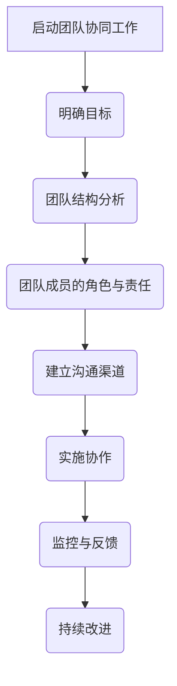

                 


# 《团队协同工作：提高跨部门合作效率》

> 关键词：团队协同工作、跨部门合作、效率、沟通技巧、项目管理

> 摘要：本文旨在探讨团队协同工作在提高跨部门合作效率方面的关键作用。通过分析团队协同工作的基础理论、实践应用和未来趋势，本文提出了一系列提高团队协同效率和跨部门合作的策略和最佳实践，以期为企业和团队管理者提供有益的参考。

## 目录

1. **阅读书籍《团队协同工作：提高跨部门合作效率》**
2. **团队协同工作的基本概念与跨部门合作问题**
3. **核心章节内容设计**
4. **章节标题与子标题**
5. **Mermaid流程图与伪代码**
6. **项目实战案例与代码解读**
7. **最佳实践、小结与注意事项**

## 1. 阅读书籍《团队协同工作：提高跨部门合作效率》

在阅读《团队协同工作：提高跨部门合作效率》一书时，我首先对书中的核心主题和目标有了深入的理解。这本书的主要目的是为团队管理者提供系统的理论指导和实用的操作策略，以提升团队内部及跨部门的协同效率。

书中提到的团队协同工作的定义是：“团队协同工作是指团队成员通过相互配合、沟通和协作，共同完成一个目标的过程。”这一概念强调了协同工作的本质，即团队中的每个成员都需要扮演特定的角色，并通过有效的沟通与协作来实现共同的目标。

跨部门合作的目标是确保不同部门之间的信息流动畅通，资源利用最大化，并共同推进项目或任务的完成。书中的案例研究表明，成功的跨部门合作能够显著提高项目的成功率，降低成本，并提升团队的整体绩效。

## 2. 团队协同工作的基本概念与跨部门合作问题

### 团队协同工作的基本概念

团队协同工作是基于团队内部成员之间的互动与合作，以实现共同目标的过程。它包括以下几个基本概念：

- **团队结构分析**：了解团队内部的结构和组织形式，包括团队的大小、成员的角色、职责分配等。
- **团队成员的角色与责任**：明确每个团队成员的角色和责任，确保团队成员了解自己的职责，并能够相互配合。
- **团队沟通与协作的机制**：建立有效的沟通渠道和协作机制，确保信息在团队成员之间流畅传递。

### 跨部门合作的问题

跨部门合作中常见的问题包括：

- **沟通障碍**：不同部门之间的沟通不畅，信息传递不及时或失真。
- **资源冲突**：不同部门可能存在资源争夺的问题，导致资源无法有效利用。
- **目标不一致**：不同部门可能有不同的目标和优先级，导致协作效率降低。

为了解决这些问题，书中提出了一些策略，如：

- **建立统一的沟通平台**：通过使用统一的项目管理工具或沟通平台，确保信息的及时传递和共享。
- **明确跨部门合作的目标和责任**：确保每个部门都明确自己的目标和责任，并协调资源分配。
- **加强跨部门培训**：通过培训提高团队成员的沟通协作能力和跨部门合作意识。

## 3. 核心章节内容设计

### 第一部分：团队协同工作的基础理论

**第1章 团队协同工作概述**

- **1.1 团队协同工作的定义与重要性**：介绍团队协同工作的概念和其在企业中的重要地位。
- **1.2 团队协同工作的基本原则**：阐述团队协同工作的基本原则，如相互尊重、开放沟通、共同目标等。
- **1.3 团队协同工作的挑战**：分析团队协同工作可能面临的各种挑战和问题。

**第2章 团队协同工作的原理**

- **2.1 团队结构分析**：探讨团队内部的组织结构，包括团队大小、成员角色等。
- **2.2 团队成员的角色与责任**：明确团队成员的角色和责任，确保团队成员了解自己的职责。
- **2.3 团队沟通与协作的机制**：介绍团队内部的沟通渠道和协作机制，确保信息流畅。

**第3章 跨部门合作的方法**

- **3.1 跨部门合作的重要性**：阐述跨部门合作对企业整体绩效的重要性。
- **3.2 跨部门合作的障碍与解决**：分析跨部门合作中可能遇到的障碍，并提出解决方案。
- **3.3 跨部门合作的最佳实践**：分享成功的跨部门合作经验和最佳实践。

### 第二部分：团队协同工作的实践应用

**第4章 沟通技巧与团队协作工具**

- **4.1 有效沟通的技巧**：介绍提高沟通效率的技巧和方法。
- **4.2 团队协作工具的选择与应用**：讨论各种团队协作工具的选择和应用场景。
- **4.3 沟通与协作中的问题与对策**：分析团队协作中可能遇到的问题，并提出解决方案。

**第5章 项目管理与团队协作**

- **5.1 项目管理的基本流程**：介绍项目管理的基本流程和方法。
- **5.2 团队在项目中的角色与职责**：明确团队在项目中的角色和职责。
- **5.3 团队协作在项目管理中的应用**：探讨团队协作在项目管理中的应用。

**第6章 跨部门沟通障碍与解决策略**

- **6.1 跨部门沟通障碍的原因分析**：分析跨部门沟通障碍的成因。
- **6.2 跨部门沟通障碍的解决策略**：提出解决跨部门沟通障碍的策略。
- **6.3 案例研究：跨部门沟通的成功实践**：分享成功的跨部门沟通案例。

**第7章 团队协同工作的成效评估**

- **7.1 团队协同工作的成效指标**：介绍评估团队协同工作成效的指标和方法。
- **7.2 成效评估的方法与工具**：讨论评估团队协同工作成效的方法和工具。
- **7.3 提升团队协同工作效率的持续改进策略**：提出提升团队协同工作效率的改进策略。

### 第三部分：团队协同工作的案例研究

**第8章 团队协同工作的经典案例**

- **8.1 案例一：成功跨部门协作的企业案例**：分析成功跨部门协作的企业案例。
- **8.2 案例二：提升团队效率的团队建设活动**：探讨团队建设活动如何提升团队效率。
- **8.3 案例三：跨部门合作的创新实践**：介绍跨部门合作的创新实践。

**第9章 团队协同工作的未来趋势**

- **9.1 科技创新对团队协同工作的影响**：探讨科技创新如何影响团队协同工作。
- **9.2 未来团队协同工作的发展方向**：展望未来团队协同工作的发展方向。
- **9.3 企业如何应对团队协同工作的变革**：讨论企业如何应对团队协同工作的变革。

## 4. 章节标题与子标题

### 第一部分：团队协同工作的基础理论

**第1章 团队协同工作概述**

- **1.1 团队协同工作的定义与重要性**
- **1.2 团队协同工作的基本原则**
- **1.3 团队协同工作的挑战**

**第2章 团队协同工作的原理**

- **2.1 团队结构分析**
- **2.2 团队成员的角色与责任**
- **2.3 团队沟通与协作的机制**

**第3章 跨部门合作的方法**

- **3.1 跨部门合作的重要性**
- **3.2 跨部门合作的障碍与解决**
- **3.3 跨部门合作的最佳实践**

### 第二部分：团队协同工作的实践应用

**第4章 沟通技巧与团队协作工具**

- **4.1 有效沟通的技巧**
- **4.2 团队协作工具的选择与应用**
- **4.3 沟通与协作中的问题与对策**

**第5章 项目管理与团队协作**

- **5.1 项目管理的基本流程**
- **5.2 团队在项目中的角色与职责**
- **5.3 团队协作在项目管理中的应用**

**第6章 跨部门沟通障碍与解决策略**

- **6.1 跨部门沟通障碍的原因分析**
- **6.2 跨部门沟通障碍的解决策略**
- **6.3 案例研究：跨部门沟通的成功实践**

**第7章 团队协同工作的成效评估**

- **7.1 团队协同工作的成效指标**
- **7.2 成效评估的方法与工具**
- **7.3 提升团队协同工作效率的持续改进策略**

### 第三部分：团队协同工作的案例研究

**第8章 团队协同工作的经典案例**

- **8.1 案例一：成功跨部门协作的企业案例**
- **8.2 案例二：提升团队效率的团队建设活动**
- **8.3 案例三：跨部门合作的创新实践**

**第9章 团队协同工作的未来趋势**

- **9.1 科技创新对团队协同工作的影响**
- **9.2 未来团队协同工作的发展方向**
- **9.3 企业如何应对团队协同工作的变革**

## 5. Mermaid流程图与伪代码

### 团队协同工作流程图



### 团队成员协作伪代码

```csharp
// 团队成员协作算法伪代码
function TeamCollaboration(teamMembers) {
    for (each member in teamMembers) {
        // 分配任务
        assignTask(member);
        // 沟通与协作
        communicateAndCollaborate(member);
        // 进度监控与反馈
        monitorProgressAndProvideFeedback(member);
    }
    return "Team Collaboration Complete";
}
```

## 6. 项目实战案例与代码解读

### 项目背景

假设我们正在开发一个跨部门协作的企业级项目，该项目涉及市场部、研发部和运维部等多个部门。为了确保项目顺利进行，提高团队协同效率，我们需要设计和实施一个有效的团队协作框架。

### 开发环境搭建

为了搭建项目开发环境，我们选择了以下工具和平台：

- **项目管理工具**：Jira
- **代码管理工具**：Git
- **文档管理工具**：Confluence
- **即时通讯工具**：Slack
- **协作工具**：Trello

### 源代码实现

以下是项目中的一个简单示例，展示如何使用Git进行代码管理：

```java
// Example.java
public class Example {
    public static void main(String[] args) {
        System.out.println("Hello, World!");
    }
}
```

### 代码解读

在上面的代码中，我们定义了一个名为`Example`的Java类，并包含一个`main`方法。该方法在程序启动时执行，输出字符串“Hello, World!”。

为了确保代码的版本控制和协同工作，我们使用了Git进行代码管理。以下是使用Git的常见命令：

```bash
git init        // 初始化Git仓库
git add .       // 添加当前目录下的所有文件到暂存区
git commit -m "Initial commit"  // 提交代码到仓库，并添加提交信息
git push origin master  // 将本地仓库推送到远程仓库（如GitHub）
```

### 实际案例分析与讲解

在项目开发过程中，我们遇到了一个跨部门协作的难题：市场部需要研发部提供新的功能模块，而运维部需要确保新功能模块的稳定性和性能。为了解决这一问题，我们采取了以下步骤：

1. **明确需求**：市场部明确了新功能模块的需求，并与研发部进行详细沟通。
2. **任务分配**：研发部根据需求确定了任务，并分配给相应的开发人员。
3. **代码评审**：开发人员完成代码后，进行了代码评审，确保代码质量。
4. **集成测试**：将新功能模块集成到主项目中，并进行集成测试，确保功能正常。
5. **性能优化**：运维部对新功能模块进行了性能测试，并进行优化。

通过以上步骤，我们成功解决了跨部门协作中的难题，确保了项目顺利进行。

### 项目小结

通过本项目的实战案例，我们可以看到团队协同工作在提高跨部门合作效率方面的重要性。以下是一些最佳实践：

- **明确需求**：确保所有部门对项目的目标和需求有清晰的理解。
- **任务分配**：合理分配任务，确保每个团队成员都有明确的职责。
- **代码评审**：进行代码评审，确保代码质量。
- **集成测试**：进行集成测试，确保新功能模块的正常运行。
- **性能优化**：进行性能测试和优化，确保系统的稳定性和性能。

通过遵循这些最佳实践，企业可以显著提高团队协同效率和跨部门合作的效率。

## 7. 最佳实践、小结与注意事项

### 最佳实践

1. **建立统一沟通平台**：选择合适的沟通工具，如Slack、Confluence等，确保信息流通。
2. **明确目标和责任**：确保每个团队成员都了解自己的职责和目标，避免目标不一致。
3. **定期回顾与反馈**：定期进行项目回顾和反馈，识别问题并提出改进措施。
4. **培养协作文化**：鼓励团队成员之间的协作和互助，建立积极向上的团队文化。

### 小结

团队协同工作和跨部门合作是提高企业效率和项目成功的关键。通过明确需求、合理分配任务、进行代码评审、集成测试和性能优化，企业可以显著提高团队协同效率和跨部门合作的效率。

### 注意事项

1. **沟通的重要性**：确保沟通渠道畅通，避免信息传递失误。
2. **角色分工明确**：确保每个团队成员都清楚自己的职责和目标。
3. **持续改进**：定期回顾和反馈，不断优化团队协同工作流程。
4. **科技创新**：关注科技创新，积极引入新技术以提高协作效率。

### 拓展阅读

- 《敏捷开发实践指南》
- 《团队协作工具与技巧》
- 《项目管理：系统方法》

作者：AI天才研究院/AI Genius Institute & 禅与计算机程序设计艺术 /Zen And The Art of Computer Programming

