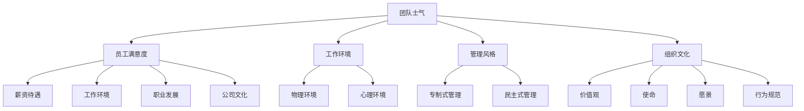
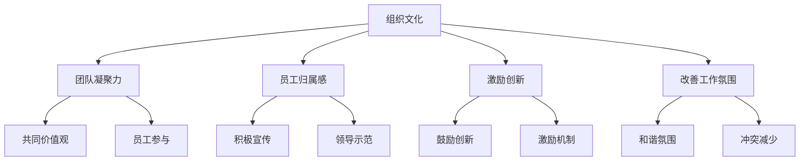

                 

**背景介绍：**

团队士气是团队管理中的一个关键因素，它直接影响团队的工作效率、创新能力以及整体的绩效表现。在现代企业中，团队士气不仅关系到日常工作的顺利进行，还对企业文化的建设、员工满意度和忠诚度有着深远的影响。

### 1.1 团队士气定义

#### 1.1.1 团队士气的概念

团队士气是指团队成员在工作过程中所表现出的一种精神状态，包括对工作的热情、积极性、自信以及对团队目标的认同感。它是团队心理健康的体现，也是团队协作能力的基础。

团队士气与士气之间的关系可以看作是一个层级结构。士气是团队士气的核心，它反映了团队的整体状态和氛围。而团队士气则是在士气的基础上，通过团队成员的互动和协作所体现出来的具体表现。

#### 1.1.2 团队士气的衡量标准

衡量团队士气的方法有多种，常见的方法包括问卷调查、绩效指标和员工反馈等。

- **问卷调查**：通过设计针对性的问卷，收集团队成员对工作环境、管理风格和同事关系的看法。这种方法可以量化团队士气，从而提供具体的数据支持。

- **绩效指标**：团队士气往往通过团队的整体绩效来体现。通过分析团队的绩效指标，如项目完成度、创新成果和客户满意度等，可以间接衡量团队士气。

- **员工反馈**：直接向团队成员收集反馈信息，了解他们对团队士气的真实感受。这种方法更为直观，但需要确保反馈渠道的开放性和保密性。

### 1.2 团队士气与企业绩效的关系

#### 1.2.1 团队士气与企业成功的关系

团队士气与企业绩效之间存在密切的正相关关系。高团队士气通常意味着团队成员工作积极性高、协作良好、创新能力强，这些因素都有助于提高企业的绩效。

研究表明，高团队士气可以显著提高团队的生产效率、减少错误率、增强团队成员的主动性和责任感。同时，高团队士气也有助于提高企业的创新能力，因为团队成员更愿意分享自己的想法和观点，从而推动创新。

#### 1.2.2 研究支持与案例说明

多项研究支持了团队士气与企业绩效之间的关系。例如，一项针对IT行业团队的研究发现，团队士气越高，项目的成功率也越高。此外，一些成功企业的案例也表明，重视团队士气建设的企业在市场竞争中往往更具优势。

例如，谷歌公司以其独特的公司文化而闻名，这种文化强调员工自由、创新和团队合作，从而形成了高团队士气。这种高团队士气不仅提高了员工的工作满意度，还推动了谷歌在技术创新和业务扩展方面的成功。

### 1.3 影响团队士气的主要因素

#### 1.3.1 员工满意度

员工满意度是影响团队士气的重要因素之一。当员工感到满意时，他们更可能表现出高团队士气。员工满意度受多种因素影响，包括薪资待遇、工作环境、职业发展机会和公司文化等。

#### 1.3.2 工作环境

工作环境也是影响团队士气的重要因素。一个良好的工作环境可以提高员工的工作效率和满意度，从而提升团队士气。工作环境包括物理环境和心理环境两个方面。

- **物理环境**：良好的办公设施、舒适的办公空间和合理的布局等都能提高员工的工作体验。

- **心理环境**：一个支持性和鼓励性的工作氛围，以及公平公正的管理风格，都有助于提升团队士气。

#### 1.3.3 管理风格

管理风格直接影响团队士气。不同的管理风格会对团队士气产生不同的影响。例如，专制式管理可能导致员工不满和恐惧，而民主式管理则可以激发员工的积极性和创造力。

#### 1.3.4 组织文化

组织文化是影响团队士气的重要因素之一。一个积极向上的组织文化可以激发员工的归属感和自豪感，从而提升团队士气。组织文化包括价值观、使命、愿景和行为规范等方面。

**Mermaid 流程图：团队士气的影响因素**

通过以上分析，我们可以看到团队士气是一个复杂的系统，它受到多种因素的影响。了解这些因素，并采取相应的策略来提升团队士气，对于企业来说至关重要。

**小结：**

团队士气是团队管理中的一个关键因素，它对企业绩效、员工满意度和企业文化建设都有着深远的影响。通过定义团队士气、分析其与企业绩效的关系以及识别影响团队士气的主要因素，我们可以更好地理解和提升团队士气，从而创造一个积极向上的工作氛围。

### 1.2 团队士气与企业绩效的关系

#### 1.2.1 团队士气与企业成功的关系

团队士气与企业成功之间存在密切的正相关关系。高团队士气通常意味着团队成员工作积极性高、协作良好、创新能力强，这些因素都有助于提高企业的绩效。当团队成员感受到积极的工作氛围和支持性的工作环境时，他们更有可能发挥出自己的潜力，从而推动企业的发展。

研究表明，团队士气对企业成功的影响体现在多个方面。首先，高团队士气可以提高团队成员的工作效率和生产力。当团队成员士气高昂时，他们更愿意投入更多的精力和时间来完成工作，从而提高工作效率和产出。其次，高团队士气有助于增强团队的协作能力。团队成员之间的积极互动和合作可以提高团队的整体绩效，从而推动企业的成功。最后，高团队士气还可以提高企业的创新能力。团队成员之间的积极交流和分享可以激发新的想法和创意，从而推动企业的创新和发展。

#### 1.2.2 研究支持与案例说明

多项研究支持了团队士气与企业绩效之间的关系。例如，一项针对IT行业团队的研究发现，团队士气越高，项目的成功率也越高。研究人员通过对多个IT项目团队的数据进行分析，发现团队士气是影响项目成功的关键因素之一。当团队士气较高时，团队成员之间的沟通和协作更加顺畅，项目的进度和质量也更有保障。

另一个案例是谷歌公司。谷歌以其独特的公司文化而闻名，这种文化强调员工自由、创新和团队合作，从而形成了高团队士气。这种高团队士气不仅提高了员工的工作满意度，还推动了谷歌在技术创新和业务扩展方面的成功。谷歌的研究表明，高团队士气有助于提高员工的创新能力和工作效率，从而推动企业的持续发展。

此外，还有其他企业的案例也证明了团队士气对企业绩效的积极影响。例如，强生公司通过一系列措施提升团队士气，如提供职业发展机会、改善工作环境和管理风格等。这些措施有效地提高了员工的工作满意度，从而推动了企业的绩效提升。

### 1.3 影响团队士气的主要因素

#### 1.3.1 员工满意度

员工满意度是影响团队士气的重要因素之一。当员工感到满意时，他们更可能表现出高团队士气。员工满意度受多种因素影响，包括薪资待遇、工作环境、职业发展机会和公司文化等。

- **薪资待遇**：合理的薪资待遇是员工满意度的基本保障。当员工认为他们的薪资与其工作量和工作质量相匹配时，他们更有可能感到满意。

- **工作环境**：良好的工作环境可以提高员工的工作效率和满意度。这包括舒适的办公空间、良好的设施和设备、安全的工作环境等。

- **职业发展机会**：员工希望能够在工作中获得成长和提升。提供良好的职业发展机会，如培训、晋升和职业规划等，可以增强员工的工作满意度。

- **公司文化**：积极向上的公司文化可以激发员工的积极性和归属感。一个支持性和鼓励性的工作氛围，以及公平公正的管理风格，都有助于提升团队士气。

#### 1.3.2 工作环境

工作环境也是影响团队士气的重要因素。一个良好的工作环境可以提高员工的工作效率和满意度，从而提升团队士气。工作环境包括物理环境和心理环境两个方面。

- **物理环境**：良好的办公设施、舒适的办公空间和合理的布局等都能提高员工的工作体验。

- **心理环境**：一个支持性和鼓励性的工作氛围，以及公平公正的管理风格，都有助于提升团队士气。这需要企业注重团队建设，通过定期的团队活动、沟通会议和团队建设培训等方式，增强团队成员之间的互信和合作。

#### 1.3.3 管理风格

管理风格直接影响团队士气。不同的管理风格会对团队士气产生不同的影响。例如，专制式管理可能导致员工不满和恐惧，而民主式管理则可以激发员工的积极性和创造力。

- **专制式管理**：专制式管理强调权威和控制，可能导致员工缺乏自主性和创新精神，从而影响团队士气。

- **民主式管理**：民主式管理强调员工参与和决策的平等，有助于激发员工的积极性和创造力，从而提升团队士气。

#### 1.3.4 组织文化

组织文化是影响团队士气的重要因素之一。一个积极向上的组织文化可以激发员工的归属感和自豪感，从而提升团队士气。组织文化包括价值观、使命、愿景和行为规范等方面。

- **价值观**：共同的价值观可以增强团队成员的认同感和凝聚力，从而提升团队士气。

- **使命**：明确的使命可以激发员工的动力和热情，从而提高团队士气。

- **愿景**：清晰的愿景可以指引团队成员朝着共同的目标努力，从而增强团队士气。

- **行为规范**：良好的行为规范可以规范员工的行为，促进团队成员之间的合作和互信，从而提升团队士气。

**Mermaid 流程图：团队士气的影响因素**

通过以上分析，我们可以看到团队士气是一个复杂的系统，它受到多种因素的影响。了解这些因素，并采取相应的策略来提升团队士气，对于企业来说至关重要。

### 1.3.4 组织文化

组织文化是团队士气的一个重要组成部分，它不仅塑造了员工的行为和态度，还影响了团队成员之间的相互关系和工作氛围。一个积极向上的组织文化可以显著提升团队士气，从而促进企业的长期成功。

#### 1.3.4.1 组织文化的定义与特征

组织文化是指企业在长期发展过程中形成的共同价值观、信念、行为规范和工作方式的总和。它包括以下几个方面：

- **价值观**：组织核心价值观是企业文化的基石，它决定了企业如何看待员工、客户、合作伙伴和社会等各个方面的关系。

- **信念**：组织信念是企业对某些基本事实的信仰，如员工的能力、创新的重要性等。

- **行为规范**：行为规范是组织文化的一部分，它规定了员工应该如何行事，以符合组织的价值观和目标。

- **工作方式**：组织文化会影响员工的工作方式，包括工作流程、沟通方式、决策过程等。

#### 1.3.4.2 组织文化对团队士气的影响

组织文化对团队士气有着深远的影响，它可以通过以下几个方面来实现：

- **增强团队凝聚力**：共同的价值观和行为规范可以增强团队成员之间的凝聚力，使团队成员更加团结一致，共同为团队的目标努力。

- **提升员工归属感**：积极向上的组织文化可以增强员工的归属感，使员工感受到自己是团队不可或缺的一部分，从而提高团队士气。

- **激励创新和主动性**：一个鼓励创新和主动性的组织文化可以激发员工的创造力和积极性，提高团队士气。

- **改善工作氛围**：良好的组织文化可以营造一个积极、和谐的工作氛围，减少负面情绪和冲突，从而提升团队士气。

#### 1.3.4.3 组织文化的建设

要建设积极向上的组织文化，企业可以采取以下措施：

- **领导者的示范作用**：领导者是组织文化的传播者和践行者，他们的一言一行都会影响员工的行为和态度。

- **员工参与**：鼓励员工参与组织文化的建设，如通过员工意见调查、团队建设活动等方式，增强员工的参与感和归属感。

- **文化宣传**：通过内部培训、企业内刊、社交媒体等方式，宣传和强化组织文化，使员工深刻理解和认同组织文化。

- **激励机制**：建立与组织文化相一致的激励机制，如表彰和奖励与组织文化相符的行为和员工，以强化组织文化的价值。

**Mermaid 流程图：组织文化对团队士气的影响**

通过以上措施，企业可以逐步建设一个积极向上的组织文化，从而提升团队士气，促进企业的长期发展。

### 1.4 团队士气下降的原因分析

#### 1.4.1 内部压力与不满

内部压力和不满是导致团队士气下降的主要原因之一。当团队成员面临工作压力、任务过重、工作无趣、薪酬不满意等问题时，他们可能会感到沮丧和不满，进而影响团队士气。

- **工作压力**：高工作压力可能导致团队成员疲惫不堪，影响工作效率和士气。企业需要合理安排工作任务，确保员工的工作负担在可承受范围内。

- **任务过重**：当团队成员的工作任务过多时，他们可能会感到疲惫和不满，从而影响团队士气。企业应该根据员工的能力和需求来分配任务，避免过度劳累。

- **工作无趣**：重复性和单调的工作内容可能导致员工感到乏味和缺乏动力，从而影响团队士气。企业可以通过多样化的工作任务和挑战来激发员工的工作热情。

- **薪酬不满意**：不合理的薪酬制度可能导致员工感到不公平和不满意，从而影响团队士气。企业应该建立公平、合理的薪酬体系，确保员工的付出与回报相匹配。

#### 1.4.2 管理问题

管理问题是导致团队士气下降的另一个重要原因。不恰当的管理风格、沟通不畅、缺乏明确的目标和方向等都可能影响团队士气。

- **管理风格**：专制式管理、高压管理、缺乏激励等都会影响团队士气。企业应该采用民主式管理，鼓励员工参与决策，提供必要的支持和激励。

- **沟通不畅**：有效的沟通是团队士气的重要保障。当团队成员之间存在沟通障碍时，可能会引发误解和冲突，影响团队士气。企业应该建立开放的沟通渠道，鼓励团队成员表达自己的想法和意见。

- **缺乏明确的目标和方向**：当团队成员不清楚企业的目标和方向时，他们可能会感到迷茫和无所适从，从而影响团队士气。企业应该明确传达目标和方向，确保团队成员了解并为之努力。

#### 1.4.3 外部环境变化

外部环境的变化也可能导致团队士气下降。例如，市场变化、竞争对手的压力、经济形势等都会影响团队士气。

- **市场变化**：当市场环境发生变化时，企业可能需要调整战略和业务方向，这可能导致团队成员感到不确定和不安，从而影响团队士气。

- **竞争对手的压力**：激烈的竞争环境可能导致团队成员感到压力和焦虑，从而影响团队士气。

- **经济形势**：经济形势的好坏直接影响企业的运营和员工的工作稳定感。在经济不景气时期，团队成员可能会对未来的工作稳定性感到担忧，从而影响团队士气。

为了应对这些外部环境变化，企业需要保持灵活性和适应性，及时调整战略和业务方向，同时为团队成员提供必要的支持和激励，帮助他们应对变化和挑战。

### 1.5 提升团队士气的策略与方法

#### 1.5.1 营造积极的工作环境

营造积极的工作环境是提升团队士气的重要策略之一。一个良好的工作环境可以提高员工的工作效率和工作满意度，从而提升团队士气。

- **改善物理环境**：企业应该提供舒适、整洁、安全的办公环境，包括舒适的座椅、充足的光线和良好的通风等。这些物理环境的改善可以提高员工的工作舒适度和幸福感。

- **优化社会环境**：企业应该营造一个支持性和鼓励性的社会环境，包括建立积极的团队氛围、鼓励员工之间的合作和互助等。通过定期的团队活动、庆祝会、团队建设培训等方式，增强团队成员之间的联系和互动。

- **提供职业发展机会**：企业应该为员工提供职业发展机会，包括培训、晋升和职业规划等。通过提供这些机会，可以帮助员工实现个人成长和职业发展，从而提高他们的工作满意度和士气。

#### 1.5.2 激励员工

激励员工是提升团队士气的重要手段之一。有效的激励机制可以激发员工的工作热情和积极性，从而提升团队士气。

- **物质激励**：物质激励包括奖金、提成、股票期权等。通过设置合理的物质激励机制，可以激励员工追求更高的绩效和贡献。

- **非物质激励**：非物质激励包括表彰、荣誉、培训、休假等。非物质激励可以满足员工的心理需求，增强他们的成就感和自豪感，从而提升团队士气。

- **个性化激励**：企业应该根据员工的个性和需求，提供个性化的激励措施。例如，对于喜欢挑战的员工，可以提供具有挑战性的工作任务；对于注重家庭生活的员工，可以提供灵活的工作时间和远程工作的机会。

#### 1.5.3 沟通与反馈

沟通与反馈是提升团队士气的重要环节。有效的沟通和及时的反馈可以帮助团队成员了解工作进展、明确目标、解决冲突，从而提升团队士气。

- **开放沟通**：企业应该建立开放的沟通渠道，鼓励员工表达自己的想法和意见。通过定期的团队会议、意见调查等方式，可以让员工感受到企业的关怀和支持。

- **及时反馈**：企业应该提供及时的反馈，帮助员工了解自己的工作表现和改进方向。通过定期的绩效评估、工作反馈等方式，可以帮助员工不断提升自己的能力，从而提高团队士气。

- **建设性反馈**：在提供反馈时，企业应该注重建设性，避免批评和指责。通过肯定员工的优点和努力，指出改进的方向，可以帮助员工建立自信，提升团队士气。

### 1.6 领导力在提升团队士气中的作用

#### 1.6.1 领导风格与团队士气

领导风格对团队士气有着重要的影响。不同的领导风格会对团队士气产生不同的影响。

- **民主式领导**：民主式领导强调员工的参与和决策的平等，可以激发员工的积极性和创造力，从而提升团队士气。

- **专制式领导**：专制式领导强调权威和控制，可能导致员工缺乏自主性和创新精神，从而影响团队士气。

- **参与式领导**：参与式领导鼓励员工参与决策和项目管理，可以增强员工的参与感和归属感，从而提升团队士气。

#### 1.6.2 领导者的自我提升

领导者需要不断提升自己的能力和素质，以更好地发挥领导作用，提升团队士气。

- **学习与成长**：领导者应该不断学习新的知识和技能，保持对行业动态和趋势的敏感度，从而为团队提供更好的指导和决策。

- **自我反思**：领导者应该定期进行自我反思，了解自己的优点和不足，从而不断提升自己的领导能力。

- **心理素质**：领导者需要具备良好的心理素质，如抗压能力、情绪管理和沟通能力等，以应对工作中的各种挑战。

#### 1.6.3 团队领导力的培养

培养团队领导力是提升团队士气的重要策略之一。以下是一些具体的培养方法：

- **领导力培训**：企业可以提供领导力培训，帮助员工了解领导力的重要性，掌握领导技巧和方法。

- **导师制度**：建立导师制度，让有经验的员工成为新员工的导师，帮助他们快速融入团队，提升领导能力。

- **实践机会**：提供员工实践领导角色的机会，如项目负责、团队领导等，通过实践提升员工的领导能力。

- **团队建设**：通过定期的团队建设活动，增强团队成员之间的信任和协作，提高团队的整体领导力。

### 1.7 应对挑战，保持团队士气

#### 1.7.1 管理危机情况

在面临危机时，保持团队士气至关重要。以下是一些应对危机的方法：

- **及时沟通**：及时向团队成员传达危机信息，让他们了解实际情况，减少恐慌和不确定性。

- **保持冷静**：领导者需要保持冷静，做出明智的决策，为团队树立榜样。

- **提供支持**：为团队成员提供必要的支持和资源，帮助他们应对危机。

- **调整策略**：根据危机情况，及时调整策略和目标，确保团队目标的实现。

#### 1.7.2 面对变革保持士气

变革是企业发展不可避免的过程，但可能会对团队士气产生影响。以下是一些应对变革的方法：

- **提前沟通**：在变革前，提前与团队成员沟通变革的原因和目的，让他们了解变革的必要性。

- **提供培训**：为团队成员提供相关的培训，帮助他们适应变革。

- **鼓励反馈**：鼓励团队成员表达对变革的看法和建议，让他们参与到变革的过程中。

- **保持积极**：领导者需要保持积极的态度，为团队树立信心，帮助他们应对变革带来的挑战。

#### 1.7.3 保持团队士气在远程工作环境中的挑战

随着远程工作的普及，保持团队士气成为了一个新的挑战。以下是一些应对远程工作环境中团队士气下降的方法：

- **建立沟通机制**：建立有效的沟通机制，确保团队成员之间的信息畅通。

- **定期的线上会议**：定期组织线上会议，增强团队成员之间的联系和互动。

- **虚拟团队活动**：组织虚拟团队活动，如在线游戏、小组讨论等，增强团队凝聚力。

- **关注员工心理健康**：关注员工的远程工作心理健康，提供必要的支持和帮助。

通过以上策略和方法，企业可以有效地应对各种挑战，保持团队士气，促进企业的长期发展。

### 附录

#### A. 团队士气提升工具与资源推荐

为了帮助企业和团队更好地提升团队士气，以下是一些实用的工具和资源推荐：

- **团队士气调查工具**：如SurveyMonkey、Google表单等，用于收集团队成员的反馈和意见。

- **员工反馈平台**：如Slack、Trello等，用于建立团队成员之间的沟通和协作。

- **员工培训资源**：如Coursera、Udemy等在线学习平台，提供各种专业培训课程。

- **心理健康支持**：如Moodfit、Headspace等心理健康应用，提供心理健康支持和咨询服务。

- **团队建设活动资源**：如TeamBonding、Team building games等网站，提供各种团队建设活动和游戏。

通过这些工具和资源，企业可以更好地提升团队士气，促进团队的长期发展。

### 总结

团队士气是团队管理中的一个关键因素，它直接影响团队的工作效率、创新能力和整体绩效。通过了解团队士气的重要性、影响因素和提升策略，企业可以采取有效的措施来提升团队士气，创造一个积极向上的工作氛围。

在本章中，我们分析了团队士气的定义、与企业绩效的关系、影响团队士气的主要因素以及提升团队士气的策略和方法。我们探讨了如何通过改善工作环境、激励员工、沟通与反馈、领导力建设和应对挑战来提升团队士气。

通过本章的内容，企业可以更好地认识到团队士气的重要性，并采取实际行动来提升团队士气，从而促进企业的长期发展。希望读者能够结合自己的实际情况，运用本章提供的方法和策略，为团队士气提升做出贡献。

### 文章标题

# 团队士气提升：创造积极向上的工作氛围

### 关键词

- 团队士气
- 企业绩效
- 工作环境
- 领导力
- 员工满意度
- 沟通与反馈
- 激励策略

### 摘要

本文探讨了团队士气的重要性以及影响团队士气的主要因素。通过分析团队士气与企业绩效之间的关系，以及工作环境、管理风格和组织文化对团队士气的影响，本文提出了提升团队士气的策略与方法。包括营造积极的工作环境、激励员工、沟通与反馈、领导力建设和应对挑战等方面。通过本文的内容，企业可以更好地认识到团队士气的重要性，并采取有效的措施提升团队士气，创造一个积极向上的工作氛围。希望本文能为企业在团队管理方面提供有价值的参考和指导。

