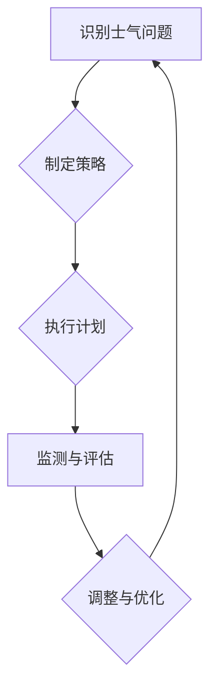

                 

### 《团队士气管理高级课程：保持长期工作热情》

#### 关键词：团队士气管理，长期工作热情，激励理论，沟通协作，团队文化，绩效提升

#### 摘要：
本文旨在探讨团队士气管理的高级课程，特别关注如何保持团队长期的工作热情。通过分析团队士气管理的理论基础、策略与实践，以及案例分析，本文为读者提供了系统的指导，帮助团队领导者提升团队士气，实现长期的工作热情与绩效提升。

---

#### 目录

## 引言

在当今快节奏和高压力的工作环境中，团队士气成为影响组织绩效和员工满意度的重要因素。团队士气不仅仅是员工对工作环境和工作的基本满意程度，更是他们在工作中保持热情、积极和高效的动力源泉。然而，如何有效管理和提升团队士气，特别是在长期工作中保持员工的热情，成为许多团队领导者面临的挑战。本文将从理论、策略和实践三个层面，探讨团队士气管理的高级课程，提供实用的方法和工具，以帮助团队领导者保持团队长期的工作热情。

---

## 第一部分：理论基础

### 第1章：团队士气管理概述

#### 1.1 团队士气管理的重要性

团队士气管理是一个多维度的过程，它不仅仅关乎员工的满意度，更涉及到员工的忠诚度、创造力和整体绩效。一个士气高涨的团队往往能够更高效地完成任务，更具有创新精神，并且能够更好地应对挑战和变化。因此，团队士气管理对于组织成功至关重要。

#### 1.2 团队士气的影响因素

团队士气受到多种因素的影响，包括：

- **组织文化**：一个开放、包容和积极的文化能够提升员工的归属感和士气。
- **工作环境**：舒适和安全的工作环境有助于提高员工的满意度和士气。
- **领导风格**：领导者的风格和行为对团队士气有着直接的影响。
- **个人因素**：员工的个性、价值观和生活状况也会影响他们的士气。

#### 1.3 团队士气管理的挑战

团队士气管理面临的主要挑战包括：

- **变化与适应性**：快速变化的工作环境和市场需求要求团队具有高度的适应性和灵活性。
- **多样性管理**：在多元文化的团队中，如何确保每个成员都感受到尊重和认同。
- **持续激励**：如何在长期工作中保持员工的激励和热情。

### 第2章：核心概念与联系

#### 2.1 团队士气的定义与分类

团队士气是指团队成员在团队中的情感状态和工作态度。根据其性质和作用，团队士气可以大致分为以下几种类型：

- **任务士气**：与具体任务或项目的完成相关。
- **社会士气**：与团队成员之间的关系和互动相关。
- **组织士气**：与整个组织的价值观、使命和愿景相关。

#### 2.2 团队士气与员工满意度

员工满意度是团队士气的一个重要指标。高满意度的员工往往表现出更高的士气，而高士气的团队也往往能够提升员工的满意度。

#### 2.3 团队士气与绩效

团队士气对绩效有着显著的影响。士气高涨的团队能够更有效地协作，更快地解决问题，并更具有创新精神。因此，提升团队士气是提高绩效的重要手段。

#### 2.4 团队士气管理流程图

为了更好地理解团队士气管理的过程，我们可以使用Mermaid流程图来展示其核心流程：

### 小结

本章从理论基础的角度探讨了团队士气管理的重要性、影响因素和挑战。通过定义和分类团队士气，以及阐述其与员工满意度、绩效的关系，本章为后续的讨论提供了坚实的基础。

---

## 第二部分：策略与实践

### 第3章：团队士气提升策略

#### 3.1 设定明确的团队目标

一个明确的团队目标能够帮助团队成员聚焦于共同的目标，增强团队凝聚力，并提升士气。为了确保目标的有效性，目标应当具备SMART特点（具体、可衡量、可实现、相关、有时限）。

#### 3.2 增强团队沟通与协作

沟通是团队士气管理的关键。通过有效的沟通，团队成员能够更好地理解彼此的期望、需求和贡献。为了增强团队沟通，可以采取以下措施：

- **定期会议**：组织定期的团队会议，确保信息共享和问题解决。
- **透明度**：确保信息的透明度，让团队成员了解组织的战略和决策。
- **反馈机制**：建立有效的反馈机制，鼓励团队成员表达意见和建议。

#### 3.3 激励与奖励机制

激励是提升团队士气的重要手段。通过设立合理的激励和奖励机制，可以激发团队成员的积极性和创造力。以下是一些有效的激励策略：

- **目标导向的奖励**：根据团队和个人的目标完成情况，提供奖励。
- **认可与赞赏**：及时对团队成员的贡献进行认可和赞赏。
- **职业发展机会**：提供职业发展的机会和路径，帮助员工实现个人成长。

#### 3.4 创造积极的团队文化

团队文化是影响团队士气的重要因素。一个积极的团队文化能够激发员工的热情和创造力。以下措施可以帮助创造积极的团队文化：

- **团队建设活动**：定期组织团队建设活动，增强团队成员之间的联系。
- **共同价值观**：明确并传播团队的共同价值观，确保团队成员对团队目标和文化的认同。
- **公平与公正**：确保团队内部的管理和决策是公平和公正的。

### 第4章：实践案例分析

#### 4.1 案例一：有效沟通提升士气

在一个软件开发团队中，由于项目进度紧张，团队成员经常因为任务分配和职责不清而产生矛盾。团队领导意识到沟通问题对士气的影响，于是采取了以下措施：

- **定期站会**：每天早晨举行短暂的站会，让团队成员汇报进展、问题和需求。
- **透明进度板**：在团队工作区设立进度板，实时更新项目进度和任务状态。
- **即时沟通工具**：鼓励团队成员使用即时沟通工具，如Slack或Microsoft Teams，及时解决问题。

这些措施有效提升了团队的沟通效率，减少了误解和冲突，从而提升了团队士气。

#### 4.2 案例二：目标设定与绩效激励

某销售团队在季度末面临业绩压力。团队领导意识到仅靠压力无法提升绩效，于是采取了以下策略：

- **设定具体目标**：根据公司业绩指标，为团队成员设定具体的销售目标。
- **奖励机制**：对于达成或超额完成目标的团队成员，提供奖金和其他奖励。
- **团队竞赛**：组织团队竞赛，鼓励团队成员相互竞争，共同提升业绩。

通过这些措施，团队士气得到了显著提升，业绩也实现了大幅增长。

#### 4.3 案例三：团队建设活动

在一个跨部门的团队中，由于团队成员来自不同的背景和领域，相互之间缺乏了解。为了增强团队凝聚力，团队领导组织了一次户外拓展活动：

- **团队合作任务**：设计一系列需要团队合作的任务，如攀岩、划船等。
- **团队讨论**：活动结束后，组织团队成员进行讨论，分享彼此的感受和体会。
- **团队建设总结**：活动结束后，团队领导总结活动中的亮点和不足，提出改进建议。

这次团队建设活动不仅增强了团队成员之间的了解和信任，也提升了团队的士气。

### 小结

本章通过具体的实践案例，展示了如何通过沟通、目标设定、激励和团队建设活动来提升团队士气。这些策略不仅适用于软件团队，也适用于其他类型的团队。

---

## 第三部分：案例分析

### 第5章：长期工作热情保持策略

#### 5.1 职业发展路径规划

为了保持长期工作热情，团队领导者需要为团队成员提供清晰的职业发展路径。这包括：

- **技能提升**：提供培训和学习机会，帮助团队成员提升技能。
- **晋升机会**：为表现出色的员工提供晋升机会，激励他们持续努力。
- **职业规划咨询**：定期为员工提供职业规划咨询，帮助他们设定个人目标。

#### 5.2 职业满足感与士气提升

职业满足感是保持长期工作热情的关键因素。为了提升员工的职业满足感，团队领导者可以采取以下措施：

- **工作与生活平衡**：确保员工有足够的时间休息和家庭生活。
- **工作意义**：帮助员工理解他们的工作对组织和社会的贡献，提升工作意义。
- **反馈与认可**：及时给予员工反馈和认可，让他们感受到自己的价值。

#### 5.3 工作与生活的平衡

在长期工作中，工作与生活的平衡对于保持工作热情至关重要。团队领导者可以通过以下方式帮助员工实现平衡：

- **灵活工作时间**：提供灵活的工作时间安排，让员工有更多自主权。
- **远程工作选项**：在条件允许的情况下，提供远程工作选项，减少通勤时间。
- **心理健康支持**：提供心理健康支持和咨询服务，帮助员工缓解工作压力。

### 第6章：团队士气评估与改进

#### 6.1 士气评估方法

为了有效管理团队士气，团队领导者需要定期进行士气评估。常用的评估方法包括：

- **问卷调查**：通过匿名问卷了解员工的满意度和士气水平。
- **面谈**：与员工进行一对一的面谈，了解他们的感受和需求。
- **行为观察**：通过观察员工的行为和态度，评估团队的士气状况。

#### 6.2 士气问题诊断与解决

一旦发现士气问题，团队领导者需要迅速诊断并采取行动。以下是一些常用的诊断和解决方法：

- **问题定位**：通过数据分析和行为观察，确定士气问题的根源。
- **沟通与反馈**：与员工进行沟通，了解他们的意见和建议。
- **改进措施**：制定并实施具体的改进措施，解决士气问题。

#### 6.3 持续改进与反馈循环

团队士气管理是一个持续的过程。团队领导者需要建立反馈循环，确保改进措施的有效性和可持续性。以下是一些具体的做法：

- **定期回顾**：定期回顾团队的士气状况，评估改进措施的效果。
- **员工参与**：鼓励员工参与士气管理的决策过程，提升他们的参与感和归属感。
- **持续学习**：关注业界最佳实践，持续学习和改进团队士气管理方法。

### 小结

本章通过探讨职业发展路径规划、职业满足感和工作与生活平衡等策略，以及团队士气评估与改进方法，为团队领导者提供了保持团队长期工作热情的具体路径。

---

## 第四部分：持续改进与评估

### 第7章：团队士气管理的未来趋势

#### 7.1 新技术对团队士气的影响

随着新技术的不断发展，如人工智能、虚拟现实和远程办公技术的应用，团队士气管理也面临着新的挑战和机遇。这些技术不仅改变了工作方式，也对团队士气的管理和提升提出了更高的要求。

#### 7.2 跨文化团队士气管理

全球化带来了跨文化团队的普遍存在。如何管理跨文化团队士气，确保团队成员之间的有效沟通和协作，成为团队领导者需要面对的重要问题。

#### 7.3 未来团队士气管理的发展方向

未来团队士气管理的发展方向包括：

- **个性化管理**：根据不同团队成员的特点和需求，提供个性化的管理和服务。
- **智能化工具**：利用大数据和人工智能技术，实现团队士气管理的智能化和精准化。
- **持续学习**：鼓励团队领导者持续学习和更新团队士气管理知识，以应对不断变化的工作环境。

### 第8章：总结与展望

#### 8.1 主要发现与结论

本文通过对团队士气管理的理论、策略和实践进行深入探讨，得出以下主要发现和结论：

- **团队士气管理对组织绩效和员工满意度有显著影响。**
- **有效的沟通、目标设定和激励策略是提升团队士气的关键。**
- **职业发展路径规划、职业满足感和工作与生活平衡是保持长期工作热情的重要策略。**
- **持续的评估和改进是团队士气管理不可或缺的环节。

#### 8.2 团队士气管理的应用前景

随着工作环境的不断变化和技术的进步，团队士气管理在未来将具有更广泛的应用前景。团队领导者需要不断学习新知识、新技能，以应对新的挑战。

#### 8.3 推荐进一步阅读资源

- **《激励原理与应用》**
- **《团队领导力》**
- **《远程工作与团队管理》**
- **《心理学与团队士气》**

### 小结

本文通过系统分析和案例分析，为团队士气管理提供了全面的指导。未来，团队领导者需要不断创新和改进，以适应快速变化的工作环境，保持团队长期的工作热情。

---

## 作者信息

作者：AI天才研究院/AI Genius Institute & 禅与计算机程序设计艺术 /Zen And The Art of Computer Programming

---

通过上述结构化的内容，本文为团队士气管理提供了一个全面的指南，旨在帮助团队领导者提升团队士气，保持长期的工作热情。

