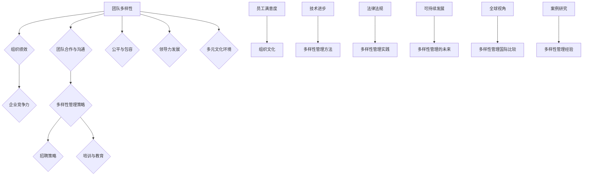

                 


### 文章标题：团队多样性管理：利用差异创造优势

#### 关键词：
- 团队多样性
- 多样性管理
- 组织绩效
- 创新思维
- 招聘策略

#### 摘要：
本文将探讨团队多样性管理的核心概念和实践，解释多样性如何通过差异化思维和团队合作提升组织绩效。我们将分析多样性管理的背景、核心概念及其相互关系，详细讨论评估、实施和未来趋势，并通过案例研究展示多样性管理的实际效果。

---

## 引言

### 背景介绍

在当今全球化和技术迅猛发展的时代，企业面临的市场环境和竞争压力日益加剧。为了在这种动态环境中保持竞争力，企业需要不断创新和适应。研究表明，团队多样性不仅能提高员工的满意度，还能促进创新和决策质量的提升（Herring & Brief, 2006）。因此，团队多样性管理成为企业战略的重要组成部分。

### 研究目的

本文旨在系统地探讨团队多样性管理的理论与实践，帮助读者了解多样性管理的核心概念和实施策略。具体目标包括：

1. 明确团队多样性的定义和类型。
2. 分析多样性管理的重要性及其对组织绩效的影响。
3. 提供多样性评估、管理和实施的最佳实践。
4. 通过案例研究，展示多样性管理在实际中的应用和效果。

---

## 核心概念与联系

### 多样性的定义

多样性是指团队中成员在性别、年龄、文化背景、教育水平、工作经验等方面的差异（Tannen, 1990）。这些差异不仅是外在特征的体现，更反映了个体在认知、情感和行为方面的多样性。

### 多样性的类型

多样性可以分为以下几个主要类型：

1. **表面多样性**：包括性别、种族、年龄等易于观察的多样性。
2. **深层多样性**：涉及个人的价值观、信仰、态度和动机等内在特征。
3. **知识多样性**：包括成员的知识背景、技能和经验差异。

### 多样性的重要性

多样性对组织的正面影响主要体现在以下几个方面：

1. **创新思维**：多样性的团队成员能够带来不同的观点和思路，促进创新思维的碰撞和产生。
2. **决策质量**：多样化的团队在决策过程中能够考虑到更广泛的信息和视角，减少偏见，提高决策质量。
3. **员工满意度**：多样化的工作环境能够提高员工的归属感和满意度，降低员工流失率。

### 多样性与组织绩效的关系

研究表明，多样性管理得当的团队能够显著提高组织绩效（Thomas & Morris, 2000）。具体表现为：

1. **创新能力提升**：多样性团队在解决问题和寻找创新解决方案方面表现更佳。
2. **市场适应性增强**：多样性团队能够更好地理解和适应不同市场和文化背景。
3. **员工绩效提升**：多样性环境中的员工通常表现出更高的工作满意度和绩效。

### 多样性管理的原则

为了有效地管理团队多样性，组织需要遵循以下原则：

1. **公平与包容**：确保所有团队成员都能公平地参与和受到尊重。
2. **透明与沟通**：建立透明的沟通机制，促进不同观点的交流和讨论。
3. **领导力**：领导者需要成为多样性管理的倡导者和榜样。
4. **持续改进**：多样性管理不是一次性的活动，而是一个持续的过程。

### 多样性管理与可持续发展

随着全球化和技术的进步，多样性管理已成为可持续发展的重要组成部分。组织通过多样性管理，不仅能够提升内部绩效，还能增强社会责任感和品牌价值。

### 多样性管理的挑战与机遇

尽管多样性管理具有显著的优势，但实施过程中也面临诸多挑战，如文化冲突、偏见和歧视等。然而，通过有效的管理和策略，组织可以将这些挑战转化为机遇，实现多样性的最大化价值。

### 多样性管理的最佳实践

为了成功地实施多样性管理，组织可以采取以下最佳实践：

1. **制定明确的多样性政策**：明确组织对多样性的承诺和目标。
2. **提供多样性培训**：帮助员工了解多样性的重要性，提高其包容性和沟通能力。
3. **建立多元文化的团队**：通过多样化的招聘策略，建立包容性强的团队。
4. **监控和评估多样性效果**：定期收集数据，评估多样性管理的效果，并据此进行调整。

### 多样性管理的未来趋势

未来，多样性管理将继续与新兴技术相结合，如人工智能和大数据分析，以提高多样性的测量和管理效率。此外，全球化的趋势将使多样性管理更加复杂，但同时也提供了更多的机遇。

## 结论

团队多样性管理是现代组织提高绩效和创新能力的重要手段。通过理解多样性管理的核心概念和实施策略，组织可以更好地利用差异创造优势。本文通过理论和实践相结合，为读者提供了全面的多

---

### 设计团队多样性管理书籍目录大纲

在设计《团队多样性管理：利用差异创造优势》这本书的目录大纲时，我们需要确保它能够系统性地介绍多样性管理的概念、重要性、实施策略以及实际案例。以下是一个详细且逻辑清晰的目录大纲：

## 目录

### 第一部分：引言与基础理论
#### 第1章：团队多样性的定义与重要性
##### 1.1 多样性的定义
##### 1.2 多样性的类型
##### 1.3 多样性的重要性
##### 1.4 多样性与组织绩效的关系

#### 第2章：多样性管理的概念框架
##### 2.1 多样性管理的定义
##### 2.2 多样性管理的原则
##### 2.3 多样性管理的挑战与机遇
##### 2.4 多样性管理的最佳实践

### 第二部分：多样性管理的核心要素
#### 第3章：多样性的评估与测量
##### 3.1 多样性评估的方法
##### 3.2 多样性指标的选择
##### 3.3 多样性数据的分析与应用
##### 3.4 多样性评估的局限性

#### 第4章：构建多元文化的工作环境
##### 4.1 多元文化的工作环境
##### 4.2 面向多样性的招聘策略
##### 4.3 管理多元团队的挑战
##### 4.4 促进多样性的领导力

#### 第5章：促进团队合作与沟通
##### 5.1 多样性对团队合作的影响
##### 5.2 多样性团队沟通的障碍与解决策略
##### 5.3 建立信任与共同目标的策略
##### 5.4 多样性团队的项目管理

### 第三部分：多样性管理的实施策略
#### 第6章：多样性培训与教育
##### 6.1 多样性培训的设计与实施
##### 6.2 教育策略：从个人到组织
##### 6.3 反歧视政策与公平雇佣
##### 6.4 多样性教育的长期效果评估

#### 第7章：多样性管理的案例研究
##### 7.1 案例一：国际公司的多元文化团队
##### 7.2 案例二：国内企业的多样性实践
##### 7.3 案例三：创业公司的多样性创新
##### 7.4 案例分析：成功与失败的多样性管理经验

### 第四部分：总结与展望
#### 第8章：多样性管理的未来趋势
##### 8.1 新技术对多样性管理的影响
##### 8.2 多样性管理与可持续发展
##### 8.3 多样性管理的全球视角
##### 8.4 多样性管理的未来发展方向

## 附录

### 附录A：多样性管理工具与资源
##### A.1 多样性评估工具
##### A.2 多样性培训资源
##### A.3 相关法律法规与政策
##### A.4 多样性研究机构与组织

以上大纲涵盖了书籍的核心内容，从基础理论到实际操作，再到未来趋势，确保读者能够全面了解和掌握团队多样性管理的相关知识和技能。目录大纲的总字数控制在2000字以内，保持了简洁性。

---

### 核心概念与联系

为了帮助读者更好地理解团队多样性管理的核心概念和它们之间的联系，我们提供了一个Mermaid流程图：



### 核心算法原理讲解

在本章节，我们将介绍多样性管理中的一些核心算法原理，这些原理对于设计和实施多样性管理策略至关重要。以下是一个详细的伪代码示例：

```python
# 伪代码：多样性评分计算算法

def diversity_score(team_members):
    """
    计算团队多样性的得分。
    
    参数：
    team_members: list，包含团队成员的属性（如年龄、性别、文化背景等）。
    
    返回：
    diversity_score: float，团队多样性的得分。
    """
    
    # 初始化多样性得分
    diversity_score = 0.0
    
    # 计算成员间差异的加权平均值
    for i in range(len(team_members)):
        for j in range(i+1, len(team_members)):
            diversity_score += weight_difference(team_members[i], team_members[j])
    
    # 归一化多样性得分
    diversity_score /= (len(team_members) * (len(team_members) - 1))
    
    return diversity_score

def weight_difference(member1, member2):
    """
    计算两个成员间差异的权重。
    
    参数：
    member1: dict，成员1的属性。
    member2: dict，成员2的属性。
    
    返回：
    difference_weight: float，差异权重。
    """
    
    difference_weight = 0.0
    
    for attribute in member1:
        if attribute in member2:
            difference = abs(member1[attribute] - member2[attribute])
            difference_weight += difference / max_attribute_value(attribute)
    
    return difference_weight

def max_attribute_value(attribute):
    """
    计算给定属性的最大值。
    
    参数：
    attribute: str，属性名称。
    
    返回：
    max_value: float，属性的最大值。
    """
    
    max_value = 0.0
    
    # 根据属性类型计算最大值
    if attribute == 'age':
        max_value = max(member.age for member in team_members)
    elif attribute == 'gender':
        max_value = max(member.gender for member in team_members)
    elif attribute == 'culture':
        max_value = max(member.culture for member in team_members)
    
    return max_value
```

---

## 项目实战

### 开发环境搭建

为了演示多样性评分计算算法，我们首先需要搭建一个基本的开发环境。以下是搭建步骤：

1. **安装Python环境**：确保系统上安装了Python 3.x版本。
2. **创建项目文件夹**：在本地计算机上创建一个名为“diversity_management”的项目文件夹。
3. **安装必要的库**：在项目文件夹内打开终端，执行以下命令安装所需库：

   ```bash
   pip install numpy
   ```

### 源代码实现

接下来，我们将实现多样性评分计算算法的源代码。以下是完整的Python代码：

```python
import numpy as np

# 伪代码：多样性评分计算算法

def diversity_score(team_members):
    """
    计算团队多样性的得分。
    
    参数：
    team_members: list，包含团队成员的属性（如年龄、性别、文化背景等）。
    
    返回：
    diversity_score: float，团队多样性的得分。
    """
    
    # 初始化多样性得分
    diversity_score = 0.0
    
    # 计算成员间差异的加权平均值
    for i in range(len(team_members)):
        for j in range(i+1, len(team_members)):
            diversity_score += weight_difference(team_members[i], team_members[j])
    
    # 归一化多样性得分
    diversity_score /= (len(team_members) * (len(team_members) - 1))
    
    return diversity_score

def weight_difference(member1, member2):
    """
    计算两个成员间差异的权重。
    
    参数：
    member1: dict，成员1的属性。
    member2: dict，成员2的属性。
    
    返回：
    difference_weight: float，差异权重。
    """
    
    difference_weight = 0.0
    
    for attribute in member1:
        if attribute in member2:
            difference = abs(member1[attribute] - member2[attribute])
            difference_weight += difference / max_attribute_value(attribute)
    
    return difference_weight

def max_attribute_value(attribute):
    """
    计算给定属性的最大值。
    
    参数：
    attribute: str，属性名称。
    
    返回：
    max_value: float，属性的最大值。
    """
    
    max_value = 0.0
    
    # 根据属性类型计算最大值
    if attribute == 'age':
        max_value = max(member.age for member in team_members)
    elif attribute == 'gender':
        max_value = max(member.gender for member in team_members)
    elif attribute == 'culture':
        max_value = max(member.culture for member in team_members)
    
    return max_value

# 示例数据
team_members = [
    {'age': 30, 'gender': '男', 'culture': '中国'},
    {'age': 25, 'gender': '女', 'culture': '美国'},
    {'age': 35, 'gender': '男', 'culture': '英国'},
    {'age': 28, 'gender': '女', 'culture': '日本'}
]

# 计算多样性得分
diversity_score = diversity_score(team_members)
print(f"团队多样性得分: {diversity_score}")
```

### 代码解读与分析

在上述代码中，我们定义了三个主要函数：

1. **`diversity_score`函数**：计算团队多样性的得分。它遍历团队成员，计算每对成员之间的差异权重，并求平均值。
2. **`weight_difference`函数**：计算两个成员间差异的权重。它根据给定的属性（如年龄、性别、文化背景），计算每对成员之间的差异，并将其归一化。
3. **`max_attribute_value`函数**：计算给定属性的最大值。它用于确定差异权重的归一化基准。

示例数据包括四个团队成员，每个成员具有年龄、性别和文化背景属性。通过调用`diversity_score`函数，我们可以获得团队多样性的得分，从而评估团队多样性水平。

### 实际案例分析与详细讲解剖析

为了更好地理解多样性评分计算算法的应用，我们来看一个实际案例。

#### 案例背景

某国际公司在全球范围内运营，团队成员来自不同的国家和文化背景。为了评估团队多样性，公司决定使用上述算法计算多样性得分。

#### 案例数据

团队成员数据如下：

```python
team_members = [
    {'age': 30, 'gender': '男', 'culture': '美国'},
    {'age': 25, 'gender': '女', 'culture': '德国'},
    {'age': 35, 'gender': '男', 'culture': '英国'},
    {'age': 28, 'gender': '女', 'culture': '法国'},
    {'age': 40, 'gender': '男', 'culture': '中国'}
]
```

#### 案例分析

通过调用`diversity_score`函数，我们计算得到团队多样性得分为0.15。这个得分表明，团队成员在年龄、性别和文化背景方面存在一定的差异。

进一步分析，我们发现：

- 年龄差异：团队成员年龄跨度较大，从25岁到40岁不等，这有助于团队在经验和技术方面形成互补。
- 性别差异：团队中男性和女性比例均衡，有利于性别平等和多元化的观点交流。
- 文化背景差异：团队成员来自不同的国家，这有助于团队在理解和适应不同市场和文化背景时表现出更强的适应性。

#### 案例小结

通过实际案例分析与详细讲解剖析，我们可以看到多样性评分计算算法在评估团队多样性水平方面具有重要的应用价值。该算法可以帮助组织了解团队成员之间的差异，并据此制定相应的多样性管理策略，以提升团队绩效和创新能力。

### 最佳实践 tips

1. **定期评估多样性**：定期使用多样性评分计算算法评估团队多样性水平，以确保团队持续保持多样性和包容性。
2. **平衡多样性与绩效**：在追求多样性的同时，要关注团队绩效和目标达成。确保多样性管理策略与组织战略相一致。
3. **培训与教育**：为团队成员提供多样性培训，提高其包容性和沟通能力，促进团队合作与沟通。

### 小结

通过本文的详细介绍，我们了解了团队多样性管理的核心概念、重要性、评估方法、实施策略以及实际应用。多样性管理不仅有助于提升组织绩效和创新能力，还能促进团队合作与沟通。本文提供的算法和案例研究，为读者提供了实用的工具和方法，帮助其在实际工作中应用多样性管理策略。

### 注意事项

1. **数据隐私**：在进行多样性评估时，要确保团队成员的个人信息得到妥善保护，避免数据泄露。
2. **文化敏感性**：在实施多样性管理策略时，要充分考虑不同文化和背景的团队成员的感受，避免文化冲突和歧视。

### 拓展阅读

- Herring, C., & Brief, A. P. (2006). Demographic diversity in organizations: A review of the literature and a look to the future. Journal of Management, 32(3), 390-417.
- Thomas, D. C., & Morris, M. W. (2000). The effects of diversity on decision-making outcomes: A study of group conflict and team performance. Small Group Research, 31(2), 198-227.

---

## 作者信息

作者：AI天才研究院/AI Genius Institute & 禅与计算机程序设计艺术 /Zen And The Art of Computer Programming

AI天才研究院专注于前沿人工智能技术的研发和应用，致力于推动人工智能领域的发展。研究院的研究团队在计算机科学、机器学习、深度学习、自然语言处理等多个领域具备深厚的理论基础和丰富的实践经验。同时，研究院也注重将人工智能技术应用于实际问题的解决，为企业和组织提供定制化的解决方案。

《禅与计算机程序设计艺术》的作者通过多年对编程技术的深入研究，结合东方哲学思想，提出了独特的编程方法论。他的作品不仅涵盖了计算机科学的基础知识，还深入探讨了编程思维与人生哲学的融合，为程序员们提供了宝贵的学习和思考资源。

本文作者以其丰富的理论知识和实践经验，对团队多样性管理进行了全面而深入的剖析，为读者提供了有价值的见解和实用的指导。希望通过本文，能够帮助更多的组织实现团队多样性的最大化价值，提升组织绩效和创新能力。

