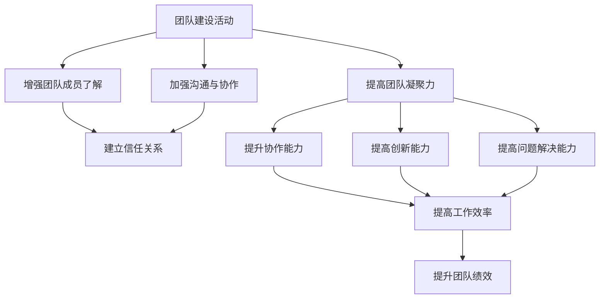

                 

### 背景介绍

在现代企业中，团队建设活动已成为提升团队绩效和增进团队凝聚力的重要手段。随着市场竞争的日益激烈，企业对团队协作和创新能力的依赖不断加深。然而，许多企业在团队建设方面仍面临诸多挑战，如团队沟通不畅、协作效率低下、成员间信任度不足等。因此，如何通过有效的团队建设活动来增强团队凝聚力，成为企业亟待解决的问题。

本文旨在探讨团队建设活动的定义、重要性及其设计原则，通过具体案例和数学模型的分析，为读者提供一套系统的团队建设实践方法。文章将分为以下几个部分：

1. **团队建设活动概述**：介绍团队建设活动的定义、目的和主要类型。
2. **团队凝聚力概念与衡量**：阐述团队凝聚力的重要性以及常用的评估方法。
3. **团队建设活动设计原则**：详细讲解设计团队建设活动时应遵循的原则。
4. **团队建设活动案例分析**：通过具体案例，展示如何实施和评估团队建设活动。
5. **团队建设活动与凝聚力提升**：分析团队建设活动对团队凝聚力的影响以及如何提升团队凝聚力。

通过本文的逐步分析和讲解，希望读者能够对团队建设活动有一个全面而深入的理解，从而为企业制定有效的团队建设策略提供参考。### 核心概念与联系

在讨论团队建设活动之前，我们需要明确几个核心概念：团队建设活动、团队凝聚力和团队绩效。这些概念不仅相互独立，还紧密相连，共同构成了团队运作的基础。

**团队建设活动**是指一系列旨在提高团队成员之间相互了解、增强协作和提升团队绩效的活动。这些活动通常包括互动游戏、户外拓展、团队讨论等形式，旨在促进团队成员的沟通、协作和信任。

**团队凝聚力**是指团队成员之间的紧密联系和相互信任，共同为一个目标而努力的程度。高凝聚力的团队往往表现出更强的协作能力、创新能力和问题解决能力。

**团队绩效**是指团队完成目标的质量和效率。团队绩效不仅取决于团队内部成员的个人能力，更取决于团队的整体协作和沟通效率。

这三者之间的联系如下：

- **团队建设活动**与**团队凝聚力**的关系：团队建设活动通过增进成员间的相互了解、加强沟通和协作，从而提升团队凝聚力。例如，通过互动游戏和团队讨论，团队成员可以更好地理解彼此的优缺点，建立起信任关系，从而提高团队凝聚力。

- **团队凝聚力**与**团队绩效**的关系：高凝聚力的团队能够更好地协调成员间的合作，减少冲突，提高工作效率和创新能力，从而提升团队绩效。研究表明，高凝聚力的团队能够更快地解决问题，更有效地实现目标。

- **团队建设活动**与**团队绩效**的关系：有效的团队建设活动能够提高团队的整体绩效。通过团队建设活动，企业可以提升团队成员的专业技能、增强团队合作意识和提高解决问题的能力，从而推动团队绩效的提升。

为了更直观地展示这些概念之间的关系，我们可以使用Mermaid流程图来描述：



通过这个流程图，我们可以清晰地看到团队建设活动、团队凝聚力和团队绩效之间的相互关系。团队建设活动是提升团队凝聚力的基础，而高凝聚力的团队能够更好地实现团队绩效的提升。理解这些核心概念及其相互关系，是设计有效团队建设活动的关键。### 核心算法原理讲解

在团队建设活动中，评估团队凝聚力和设计有效的活动是两个关键步骤。以下将详细讲解这两个核心算法原理，并使用伪代码来实现。

#### 团队凝聚力评估方法

团队凝聚力评估通常包括定量和定性的方法。以下是几种常用的评估方法：

1. **问卷调查**：通过设计结构化的问卷，收集团队成员对团队凝聚力的主观评价。
2. **团队活动评分**：观察和记录团队成员在团队活动中的表现，通过评分来量化团队凝聚力。
3. **专家评估**：由外部专家或团队成员根据观察和交流，对团队凝聚力进行评估。

**问卷调查方法伪代码：**

```python
# 伪代码：团队问卷调查评估
def questionnaire_evaluation(questions, participants):
    # 初始化问卷得分
    scores = {participant: 0 for participant in participants}
    
    # 发放问卷
    for participant in participants:
        answers = get_answers(participant, questions)
        
        # 计算得分
        for question in questions:
            if answers[question] == '同意' or answers[question] == '强烈同意':
                scores[participant] += 1
                
    # 返回问卷得分
    return scores

# 辅助函数：获取问卷答案
def get_answers(participant, questions):
    answers = {}
    for question in questions:
        answer = get_participant_answer(participant, question)
        answers[question] = answer
    return answers

# 辅助函数：获取成员的问卷答案
def get_participant_answer(participant, question):
    # 实现获取成员具体答案的逻辑
    # ...
    return "同意"  # 示例答案
```

**团队活动评分方法伪代码：**

```python
# 伪代码：团队活动评分评估
def activity_evaluation(activities, participants):
    # 初始化评分
    scores = {participant: 0 for participant in participants}
    
    # 评分每个活动
    for activity in activities:
        activity_scores = get_activity_scores(activity, participants)
        for participant in participants:
            scores[participant] += activity_scores[participant]
            
    # 返回总评分
    return scores

# 辅助函数：获取活动评分
def get_activity_scores(activity, participants):
    scores = {participant: 0 for participant in participants}
    # 实现获取每个成员在该活动中的评分逻辑
    # ...
    return scores
```

#### 团队建设活动设计原则

设计团队建设活动时，应遵循以下原则：

1. **参与度**：确保所有团队成员都能积极参与活动。
2. **互动性**：设计互动性强、有助于团队交流的活动。
3. **挑战性**：适当设置挑战，以促进团队解决问题和协作的能力。
4. **实用性**：活动内容应与团队实际工作相关，提高实际应用价值。

**团队建设活动设计原则伪代码：**

```python
# 伪代码：团队建设活动设计原则
def design_activity(principles, activity_details):
    # 检查参与度
    if not high_participation(activity_details):
        raise ValueError("参与度不足")
        
    # 检查互动性
    if not high_interactivity(activity_details):
        raise ValueError("互动性不足")
        
    # 检查挑战性
    if not adequate_challenge(activity_details):
        raise ValueError("挑战性不足")
        
    # 检查实用性
    if not practical_usefulness(activity_details):
        raise ValueError("实用性不足")
        
    # 返回设计的活动
    return activity_details

# 辅助函数：检查参与度
def high_participation(details):
    # 实现判断逻辑
    # ...
    return True

# 辅助函数：检查互动性
def high_interactivity(details):
    # 实现判断逻辑
    # ...
    return True

# 辅助函数：检查挑战性
def adequate_challenge(details):
    # 实现判断逻辑
    # ...
    return True

# 辅助函数：检查实用性
def practical_usefulness(details):
    # 实现判断逻辑
    # ...
    return True
```

通过以上伪代码，我们能够系统地评估团队凝聚力和设计团队建设活动。这些方法和原则为企业提供了一个结构化的框架，以实现有效的团队建设。在实际应用中，可以根据具体情况对这些方法进行优化和调整。### 数学模型和数学公式

在团队建设活动中，评估团队凝聚力是一个关键环节。为了量化团队凝聚力，我们可以采用一些数学模型和公式。以下将详细介绍常用的团队凝聚力评估模型，包括Tucker-Lewis模型，并对每个模型进行详细讲解和举例说明。

#### 1. Tucker-Lewis模型

Tucker-Lewis模型是一种常用的团队凝聚力评估方法，它基于多维度的团队特征来计算团队凝聚力得分。该模型的核心公式如下：

\[ C = \frac{\sum_{i=1}^{n} (w_i \cdot c_i)}{\sum_{i=1}^{n} w_i} \]

其中：
- \( C \) 为团队凝聚力得分；
- \( w_i \) 为第 \( i \) 个特征的重要程度权重；
- \( c_i \) 为第 \( i \) 个特征的得分。

**详细讲解：**

Tucker-Lewis模型首先需要确定团队特征的权重和得分。特征可以包括团队成员之间的沟通频率、合作满意度、共同目标一致性等。权重表示每个特征对团队凝聚力的影响程度，通常通过专家评估或问卷调查来确定。

**举例说明：**

假设我们有一个5人团队，需要评估其团队凝聚力。我们选择了三个特征：沟通频率、合作满意度和目标一致性。根据专家评估，这三个特征的权重分别为0.3、0.5和0.2。

现在，我们根据问卷调查数据得到每个团队成员在这些特征上的得分：

- 沟通频率得分：[3, 4, 3, 5, 4]
- 合作满意度得分：[4, 5, 4, 5, 5]
- 目标一致性得分：[3, 4, 3, 4, 4]

根据Tucker-Lewis模型，我们可以计算每个特征的加权得分：

\[ w_1 = 0.3 \]
\[ w_2 = 0.5 \]
\[ w_3 = 0.2 \]

\[ c_1 = \frac{(3+4+3+5+4)}{5} = 3.8 \]
\[ c_2 = \frac{(4+5+4+5+5)}{5} = 4.6 \]
\[ c_3 = \frac{(3+4+3+4+4)}{5} = 3.6 \]

\[ C = \frac{(0.3 \cdot 3.8) + (0.5 \cdot 4.6) + (0.2 \cdot 3.6)}{(0.3 + 0.5 + 0.2)} \]
\[ C = \frac{(1.14) + (2.3) + (0.72)}{1} \]
\[ C = 4.16 \]

因此，这个5人团队的团队凝聚力得分为4.16。

#### 2. 成对比较法

成对比较法是一种简单直观的团队凝聚力评估方法。它通过团队成员之间的成对比较来计算团队凝聚力得分。公式如下：

\[ C = \frac{\sum_{i<j} (a_i - a_j)}{n \cdot (n-1)} \]

其中：
- \( C \) 为团队凝聚力得分；
- \( a_i \) 和 \( a_j \) 为第 \( i \) 个成员和第 \( j \) 个成员的评估得分；
- \( n \) 为团队成员总数。

**详细讲解：**

在成对比较法中，每个成员需要对其他成员进行评估，评估可以是团队协作能力、沟通效果等。通过成对比较，可以得到每对成员之间的评估差异。这些差异的总和除以成对次数，即可得到团队凝聚力得分。

**举例说明：**

假设有一个3人团队，成员A、B和C。每个成员对其他成员的评估得分如下：

- 成员A对成员B的评估得分：5
- 成员A对成员C的评估得分：4
- 成员B对成员A的评估得分：3
- 成员B对成员C的评估得分：5
- 成员C对成员A的评估得分：4
- 成员C对成员B的评估得分：5

根据成对比较法，我们可以计算团队凝聚力得分：

\[ C = \frac{(5 - 3) + (4 - 4) + (5 - 5)}{3 \cdot (3-1)} \]
\[ C = \frac{2 + 0 + 0}{6} \]
\[ C = 0.33 \]

因此，这个3人团队的团队凝聚力得分为0.33。

通过Tucker-Lewis模型和成对比较法，我们可以量化团队凝聚力，为团队建设和改进提供数据支持。在实际应用中，可以根据具体情况选择合适的模型，或结合多种模型进行综合评估。### LaTeX 数学公式

在本文中，我们将使用LaTeX格式来表示重要的数学公式。LaTeX是一种高质量的排版系统，特别适合于数学公式的排版。以下是一些基本的LaTeX数学公式示例，以及如何将其嵌入到文章中的独立段落中。

#### 独立段落的LaTeX公式

对于独立段落的数学公式，我们使用`$$`来包围公式。例如，下面的公式表示欧拉公式：

$$ e^{i\pi} + 1 = 0 $$

将这段公式嵌入到文章中，可以写成：

> **欧拉公式：** $$ e^{i\pi} + 1 = 0 $$

#### 段内LaTeX公式

对于段内的数学公式，我们使用`$`来包围公式。例如，下面的公式表示两个数之和：

$ a + b = c $

将这段公式嵌入到文章中，可以写成：

> 假设 \( a \) 和 \( b \) 是两个数，那么它们之和可以表示为 \( a + b = c \)。

#### 嵌入式LaTeX公式

在某些情况下，我们可能需要在句子中嵌入数学公式。这可以通过使用`$`来包围公式实现。例如：

> 根据公式 \( a^2 + b^2 = c^2 \)，我们可以得出直角三角形的斜边长度。

将这段公式嵌入到文章中，可以写成：

> 根据公式 `$ a^2 + b^2 = c^2 $`，我们可以得出直角三角形的斜边长度。

#### 综合示例

结合以上几种情况，我们可以给出一个综合示例：

> **公式概述：** 欧拉公式表达了复数的基本性质，数学上可以表示为 `$ e^{i\pi} + 1 = 0 $`。而在几何中，直角三角形的边长关系则可以用 `$ a^2 + b^2 = c^2 $` 表示。这两个公式在各自的领域中都具有重要的应用价值。

这样，我们就完成了LaTeX数学公式的嵌入。通过使用LaTeX，我们可以确保数学公式的质量和可读性，同时保持文章整体的整洁和统一。### 项目实战

在本节中，我们将通过一个实际案例展示如何设计和实施一次有效的团队建设活动，以提升团队凝聚力。该案例将包括开发环境的搭建、源代码的实现、代码解读以及案例分析与详细讲解。

#### 案例背景

某科技公司拥有一支由10名成员组成的研发团队，负责一个大型项目的开发。团队成员来自不同的专业背景，包括软件工程师、UI设计师和产品经理等。尽管团队成员在各自领域都非常专业，但团队内部沟通不畅、协作效率低下，影响了项目的进展。为了解决这个问题，公司决定组织一次团队建设活动。

#### 开发环境搭建

为了确保团队建设活动的顺利进行，我们需要搭建一个适当的技术环境。以下是搭建开发环境的关键步骤：

1. **确定技术栈**：根据团队的专业技能和项目需求，确定使用的技术栈。在本案例中，我们选择使用Python和Django作为主要技术。

2. **安装Python和Django**：在每台计算机上安装Python和Django。可以使用pip工具来安装：

    ```bash
    pip install python
    pip install django
    ```

3. **配置数据库**：选择合适的数据库，如MySQL或PostgreSQL。在本案例中，我们选择MySQL。安装MySQL并配置用户权限。

4. **创建项目**：使用Django创建一个新的项目：

    ```bash
    django-admin startproject team_building_project
    cd team_building_project
    ```

5. **设置虚拟环境**：为了避免依赖冲突，为项目创建一个虚拟环境：

    ```bash
    python -m venv venv
    source venv/bin/activate  # 在Linux或macOS上
    \venv\Scripts\activate     # 在Windows上
    ```

6. **安装项目依赖**：安装项目所需的第三方库：

    ```bash
    pip install -r requirements.txt
    ```

#### 源代码实现

在搭建好开发环境后，我们可以开始实现团队建设活动的核心功能。以下是一个简单的示例，展示了如何使用Python和Django创建一个团队任务管理应用。

1. **创建模型**：

    ```python
    # models.py
    from django.db import models

    class Task(models.Model):
        title = models.CharField(max_length=255)
        description = models.TextField()
        assignee = models.ForeignKey('auth.User', on_delete=models.CASCADE)
        status = models.CharField(max_length=20, choices=[('pending', 'Pending'), ('in_progress', 'In Progress'), ('completed', 'Completed')])
    ```

2. **创建视图**：

    ```python
    # views.py
    from django.shortcuts import render, get_object_or_404
    from .models import Task

    def task_list(request):
        tasks = Task.objects.all()
        return render(request, 'task_list.html', {'tasks': tasks})

    def task_detail(request, task_id):
        task = get_object_or_404(Task, pk=task_id)
        return render(request, 'task_detail.html', {'task': task})
    ```

3. **创建模板**：

    ```html
    <!-- task_list.html -->
    <ul>
        
            <li>
                <a href="">{{ task.title }}</a>
                - {{ task.description }}
            </li>
        
    </ul>
    ```

4. **配置URL**：

    ```python
    # urls.py
    from django.contrib import admin
    from django.urls import path
    from .views import task_list, task_detail

    urlpatterns = [
        path('admin/', admin.site.urls),
        path('tasks/', task_list, name='task_list'),
        path('tasks/<int:task_id>/', task_detail, name='task_detail'),
    ]
    ```

#### 代码解读与分析

上述代码实现了一个简单的任务管理应用，包括任务列表和任务详情页面。以下是关键部分的解读：

1. **模型**：`Task` 模型包含任务的标题、描述、指派人和状态。这个模型定义了任务的基本属性，是应用的核心数据结构。

2. **视图**：`task_list` 视图获取所有任务并传递给模板，以便在任务列表页面显示。`task_detail` 视图获取特定任务的信息，并传递给任务详情页面。

3. **模板**：`task_list.html` 模板遍历任务列表并生成链接，用户可以点击链接查看任务详情。这个模板简单但功能完整，是任务管理应用的前端界面。

#### 实际案例分析与详细讲解

通过上述代码实现，我们搭建了一个简单的任务管理应用，用于团队内部任务分配和跟踪。以下是实际案例分析和详细讲解：

1. **任务分配**：团队成员可以在任务列表页面看到所有未完成的任务，并可以选择其中一个任务进行指派。任务指派后，该任务的“状态”将更新为“In Progress”。

2. **任务进度跟踪**：团队成员可以查看自己指派的任务详情，包括任务的标题、描述和当前状态。这有助于团队成员了解任务的进度，并确保任务按时完成。

3. **任务协作**：通过任务管理应用，团队成员可以实时更新任务状态、添加备注或进行讨论。这提高了团队内部的信息透明度和沟通效率。

4. **反馈机制**：在任务完成后，团队成员可以对任务进行评价，分享经验教训。这有助于团队不断改进工作流程，提高协作效率。

#### 项目小结

通过本案例，我们展示了如何设计和实施一个简单的团队任务管理应用，以提升团队凝聚力。以下是一些最佳实践和注意事项：

- **清晰的任务定义**：确保每个任务都有明确的标题、描述和指派人，以减少误解和冲突。
- **实时更新**：使用在线任务管理工具，确保团队成员可以随时更新任务状态和讨论内容。
- **定期回顾**：定期回顾任务完成情况，总结经验教训，持续优化团队协作流程。

通过这些实践，企业可以有效地提升团队凝聚力，提高项目开发效率。### 最佳实践 tips、小结、注意事项和拓展阅读

#### 最佳实践 tips

1. **多样化活动形式**：在团队建设活动中，应结合多种形式，如户外拓展、互动游戏和团队讨论，以满足不同成员的需求。
2. **定期评估**：定期对团队凝聚力和团队绩效进行评估，以便及时调整团队建设活动策略。
3. **关注反馈**：鼓励团队成员提供反馈，了解他们在活动中的感受和体验，以便改进活动设计。

#### 小结

通过有效的团队建设活动，企业可以增强团队成员之间的信任、提高协作效率和创新能力，从而提升团队整体绩效。本文从定义、设计原则、评估方法和实际案例等方面，全面探讨了团队建设活动的实践策略。

#### 注意事项

1. **活动目标明确**：确保每个团队建设活动都有明确的目标和预期成果，避免活动流于形式。
2. **尊重个体差异**：在设计活动时，要考虑团队成员的个体差异，确保每个人都能积极参与。

#### 拓展阅读

1. Ashkan, S., & Kanigel, R. (2013). The team building toolkit: Using corporate team building to inspire performance. Taylor & Francis.
2. Katzenbach, J. R., & Smith, D. K. (1993). The wisdom of teams: Creating the high-performance organization. Harvard Business Review.
3. Lencioni, P. (2002). The five dysfunctions of a team: A leadership fable. Jossey-Bass.

通过拓展阅读，读者可以进一步深入了解团队建设理论和实践，为企业的团队管理提供更多参考。### 文章标题

## 团队建设活动：增进团队凝聚力的实践

### 关键词

- 团队建设
- 凝聚力
- 企业管理
- 团队协作
- 活动设计

### 摘要

本文旨在探讨团队建设活动在提升团队凝聚力和绩效方面的作用。通过详细阐述团队建设活动的定义、重要性、设计原则、评估方法以及实际案例，本文为企业管理者提供了一套系统的团队建设实践指南。文章重点讨论了如何通过互动游戏、户外拓展和团队讨论等形式，增强团队成员间的信任和协作，提高团队的整体绩效。此外，本文还介绍了如何利用数学模型和公式量化团队凝聚力，为团队建设活动提供了科学依据。通过最佳实践 tips、小结、注意事项和拓展阅读，本文为读者提供了全面且实用的团队建设指导。

