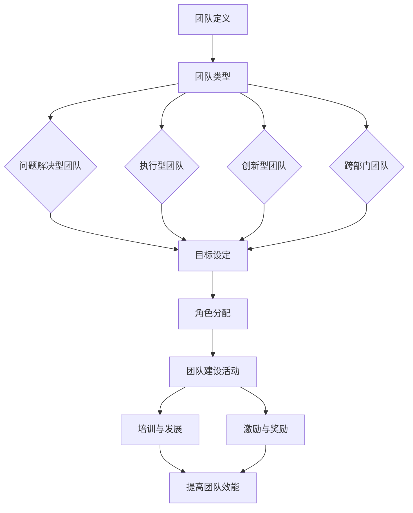

                 


### 文章标题
《团队建设：从招聘到培养的全流程管理》

### 关键词
团队建设、招聘、培养、全流程管理、组织效能、算法原理、数学模型、项目实战

### 摘要
本文旨在深入探讨团队建设的全流程管理，从招聘到培养的各个环节。我们将以逻辑清晰、结构紧凑、简单易懂的专业语言，逐一分析团队建设中的核心概念、算法原理、数学模型和实战案例，为读者提供全面、系统的团队建设指导。文章将涵盖团队建设的重要性、核心概念与联系、招聘流程管理、培养计划制定、团队效能评估与提升、核心算法原理讲解、数学模型和数学公式、项目实战等多个方面，旨在帮助读者更好地理解和实践团队建设。

### 引言
团队建设是任何组织成功的关键因素之一。一个高效的团队能够实现协同作战，提高整体组织效能，从而在竞争激烈的市场中脱颖而出。然而，团队建设并非易事，涉及多个环节，包括招聘、培养、评估和提升等。本文将围绕团队建设从招聘到培养的全流程管理，进行深入探讨，帮助读者全面理解团队建设的重要性和方法。

#### 团队建设的重要性
团队建设的重要性在于它能够促进组织内部成员之间的协作和沟通，提高团队的凝聚力和执行力。一个优秀的团队不仅能够共同应对挑战，还能够发挥出各自的优势，实现1+1>2的效果。以下是团队建设的重要性体现：

1. **提高组织效能**：高效的团队能够提高整体组织的工作效率，减少资源浪费，从而提升组织在市场中的竞争力。
2. **促进个人成长**：团队成员在团队中可以互相学习、共同进步，实现个人能力的提升。
3. **增强团队凝聚力**：团队建设有助于增强成员之间的信任和合作关系，提高团队凝聚力。
4. **提升创新能力**：团队建设鼓励团队成员之间的交流和合作，有助于创新思维的碰撞和产生。

#### 团队建设的常见问题与挑战
尽管团队建设的重要性显而易见，但在实际操作中，组织常常面临一系列问题和挑战。以下是一些常见的团队建设问题：

1. **招聘难题**：找到与组织文化和需求相匹配的人才并非易事，特别是在竞争激烈的市场中。
2. **培养困境**：团队成员的培训和培养往往难以达到预期效果，培养计划不够系统或执行不到位。
3. **团队协作**：团队成员之间的沟通不畅、目标不一致等问题会影响团队协作效果。
4. **效能评估**：如何科学、公正地评估团队效能，以便进行有效的改进和优化，是团队建设中的重要挑战。

#### 团队建设的基本概念
在探讨团队建设之前，有必要了解一些基本概念，包括团队的定义、类型和目标等。

1. **团队的定义**：
团队是一组相互依赖的个体，为了共同实现一个目标而合作的工作群体。团队成员之间有明确的分工和协作关系，共同承担工作责任。

2. **团队的类型**：
团队可以根据不同的标准进行分类，如根据目标的不同可分为问题解决型团队、执行型团队、创新型团队等；根据成员之间的关系可分为功能型团队、项目型团队、跨部门团队等。

3. **团队建设的目标**：
团队建设的目标包括提高团队效能、增强团队凝聚力、促进团队成员的个人成长等。具体而言，团队建设的目标如下：
   - 提高团队效能：通过优化团队结构、流程和协作机制，提高团队的整体工作效能。
   - 增强团队凝聚力：通过培养团队成员之间的信任和合作关系，增强团队的凝聚力。
   - 促进个人成长：为团队成员提供培训和成长机会，帮助他们在团队中实现个人价值的提升。

#### 本书的目的和结构
本书旨在为读者提供一套全面、系统的团队建设指导，从招聘到培养的全流程管理。本书结构如下：

1. **核心概念与联系**：介绍团队建设的基本概念、团队建设与组织效能的关系以及团队建设过程中的关键环节。
2. **团队建设全流程管理**：详细讲解团队建设全流程的管理方法，包括招聘流程管理、培养计划制定和团队效能评估与提升。
3. **核心算法原理讲解**：介绍团队决策算法、沟通技巧和团队效能评估模型，并提供数学模型和数学公式。
4. **项目实战**：通过实际案例分析和详细讲解，帮助读者更好地理解和实践团队建设。
5. **附录**：提供团队建设工具与资源、常见问题解答等辅助内容。

通过本书的学习，读者将能够系统地掌握团队建设的方法和技巧，提高团队效能，为组织的发展做出贡献。

### 核心概念与联系
在深入探讨团队建设之前，我们需要了解一些核心概念，并理解它们之间的联系。这些核心概念包括团队的定义、类型、目标以及团队建设与组织效能的关系。

#### 团队的定义
团队是由一组相互依赖的个体组成的协作群体，共同追求一个共同的目标。团队成员之间有明确的分工和协作关系，共同承担工作责任。团队的特征包括以下几个方面：

1. **共同目标**：团队成员共同追求一个目标，这使得团队成员在行动上保持一致。
2. **相互依赖**：团队成员之间有密切的协作关系，彼此依赖，共同完成任务。
3. **明确的分工**：团队成员有明确的职责和角色，各司其职，协同工作。
4. **共享责任**：团队成员共同承担工作责任，出现问题时要共同面对。

#### 团队的类型
团队可以根据不同的标准进行分类，如根据目标的不同可分为以下类型：

1. **问题解决型团队**：这类团队的主要任务是解决特定的业务问题，如产品研发、市场分析等。
2. **执行型团队**：这类团队负责执行上级分配的任务，确保任务按时、按质完成。
3. **创新型团队**：这类团队专注于创新和创造，推动组织的技术进步和业务模式创新。
4. **跨部门团队**：这类团队由不同部门的人员组成，负责解决跨部门协作中的问题。

#### 团队建设的目标
团队建设的核心目标是提高团队效能、增强团队凝聚力、促进团队成员的个人成长。具体而言，团队建设的目标包括：

1. **提高团队效能**：通过优化团队结构、流程和协作机制，提高团队的整体工作效能。
2. **增强团队凝聚力**：通过培养团队成员之间的信任和合作关系，增强团队的凝聚力。
3. **促进个人成长**：为团队成员提供培训和成长机会，帮助他们在团队中实现个人价值的提升。

#### 团队建设与组织效能的关系
团队建设与组织效能之间存在密切的关系。高效的团队能够显著提高组织的整体效能，而组织效能的提高又有助于团队建设。具体而言，团队建设对组织效能的影响体现在以下几个方面：

1. **提高工作效率**：高效的团队能够提高工作效率，减少资源浪费，从而提高组织的竞争力。
2. **促进创新**：团队建设鼓励团队成员之间的交流和合作，有助于创新思维的碰撞和产生，推动组织的技术进步和业务模式创新。
3. **增强团队凝聚力**：团队建设有助于增强团队成员之间的信任和合作关系，提高团队的凝聚力，从而提高组织的整体效能。
4. **提高员工满意度**：团队建设有助于提升员工的工作满意度和归属感，从而提高员工的工作积极性和忠诚度。

#### 团队建设过程中的关键环节
团队建设是一个系统性的过程，涉及多个关键环节。以下是一些重要的团队建设环节：

1. **招聘**：招聘是团队建设的基础，找到与组织文化和需求相匹配的人才至关重要。
2. **培养**：培养是团队建设的重要环节，通过培训和发展计划，提高团队成员的技能和能力。
3. **评估**：评估是团队建设的重要环节，通过科学、公正的评估方法，了解团队和团队成员的绩效，为改进提供依据。
4. **激励**：激励是团队建设的关键，通过合理的激励机制，激发团队成员的积极性和创造力。
5. **沟通**：沟通是团队建设的核心，良好的沟通机制有助于团队成员之间的信息传递和协作。

#### 团队建设的方法与策略
团队建设的方法和策略多种多样，组织应根据自身特点和需求选择合适的方法。以下是一些常见的团队建设方法和策略：

1. **目标设定**：明确团队的目标和期望，确保团队成员共同追求一个共同的目标。
2. **角色分配**：根据团队成员的特长和兴趣，合理分配角色和职责，确保每个成员都能发挥自己的优势。
3. **团队建设活动**：通过团队建设活动，增强团队成员之间的信任和合作关系。
4. **培训与发展**：为团队成员提供培训和成长机会，提高他们的技能和能力。
5. **激励与奖励**：通过合理的激励机制，激发团队成员的积极性和创造力。

#### 团队建设的基本概念联系流程图
为了更清晰地展示团队建设的基本概念及其联系，我们可以使用Mermaid流程图进行描述：



通过上述流程图，我们可以看到团队建设的基本概念及其之间的联系，从而更好地理解团队建设的过程。

### 团队建设全流程管理
团队建设是一个复杂且系统性的过程，涉及从招聘到培养的各个环节。有效的团队建设需要科学的管理方法和策略，以确保团队的目标得到实现。以下我们将详细探讨团队建设全流程管理，包括招聘流程管理、培养计划制定和团队效能评估与提升。

#### 招聘流程管理
招聘是团队建设的首要环节，找到合适的人才对于团队的成功至关重要。以下是招聘流程管理的几个关键步骤：

1. **招聘需求分析**：
   - 分析团队当前的人员结构，确定需要补充的职位和人数。
   - 明确新岗位的职责和要求，包括技能、经验、教育背景等。
   - 与各部门沟通，了解他们的需求和预期。

2. **招聘策略制定**：
   - 根据招聘需求，制定招聘策略，包括招聘渠道的选择、招聘方式和时间安排。
   - 确定招聘预算，合理分配招聘资源。

3. **招聘渠道选择**：
   - 内部招聘：利用公司内部推荐、内部调动等方式。
   - 外部招聘：通过招聘网站、猎头公司、社交媒体等渠道。
   - 校园招聘：与高校合作，招聘应届毕业生。

4. **候选人筛选**：
   - 设计合适的招聘流程，包括简历筛选、面试、评估等环节。
   - 采用多轮面试，确保候选人的能力和素质与岗位要求相符。

5. **录用决策**：
   - 综合评估候选人，确定最终录用人选。
   - 与候选人沟通，确定录用条件和待遇。

#### 培养计划制定
招聘到合适的人才只是团队建设的第一步，培养人才是确保团队长期发展的关键。以下是培养计划制定的几个关键步骤：

1. **培养目标设定**：
   - 根据团队的发展需求和员工的职业规划，设定培养目标。
   - 确定培养重点，如专业技能、管理能力、创新能力等。

2. **培养策略选择**：
   - 设计个性化的培养方案，包括内部培训、外部培训、轮岗等。
   - 选择合适的培训内容和形式，如线上课程、讲座、实操等。

3. **培养效果评估**：
   - 设定评估指标，如知识掌握度、技能提升、工作表现等。
   - 定期对培养效果进行评估，调整培养计划。

#### 团队效能评估与提升
团队效能评估是团队建设的重要环节，通过评估可以了解团队的工作表现，发现问题和不足，从而进行有针对性的改进。以下是团队效能评估与提升的几个关键步骤：

1. **效能评估指标设定**：
   - 设定科学的评估指标，如工作效率、项目完成率、客户满意度等。
   - 确保评估指标与团队目标和业务需求相符。

2. **效能评估方法选择**：
   - 采用定量和定性相结合的评估方法，如问卷调查、绩效评估、360度反馈等。
   - 选择合适的评估周期，如季度、半年或年度。

3. **效能提升策略**：
   - 根据评估结果，制定有针对性的提升策略，如改进工作流程、优化团队结构、加强培训等。
   - 实施提升策略，并跟踪效果。

4. **持续改进**：
   - 团队效能提升不是一蹴而就的，需要持续改进和优化。
   - 建立反馈机制，及时收集团队成员的反馈和建议，不断调整和完善团队建设策略。

### 案例分析
为了更好地理解团队建设全流程管理，我们可以通过一个实际案例进行分析。

**案例：某互联网公司团队建设全流程管理**

1. **招聘流程管理**：
   - 需求分析：公司研发部门需要补充5名高级软件工程师。
   - 招聘策略：内部推荐+外部招聘。
   - 招聘渠道：公司官网、招聘网站、社交媒体。
   - 候选人筛选：通过多轮面试，包括技术面试、行为面试、项目演练等，最终录用3名候选人。

2. **培养计划制定**：
   - 培养目标：提高高级软件工程师的技术能力、项目管理和创新能力。
   - 培养策略：内部培训、外部培训（如参加行业技术研讨会）、项目轮岗。
   - 培养效果评估：定期进行技能测试和项目评估，确保培养目标的实现。

3. **团队效能评估与提升**：
   - 效能评估指标：项目完成率、客户满意度、技术难题解决率。
   - 效能评估方法：360度反馈、项目报告分析。
   - 效能提升策略：优化项目管理流程、加强技术交流和分享、引入敏捷开发方法。

通过以上案例，我们可以看到，团队建设全流程管理涉及多个环节，包括招聘、培养和效能评估。每个环节都需要科学的管理方法和策略，以确保团队的目标得到实现。

### 核心算法原理讲解
在团队建设中，运用算法原理来优化管理流程是非常重要的。以下将介绍几种核心算法原理，包括团队决策算法、沟通技巧和团队效能评估模型，并提供伪代码和数学模型的详细讲解。

#### 团队决策算法
团队决策算法是团队在面临复杂决策时使用的工具，旨在通过数据分析、概率模型和优化算法，帮助团队做出最优决策。以下是一种基于决策树算法的团队决策框架：

**决策树算法伪代码：**

```python
def DecisionTree(data, target_attribute):
    if data中所有记录都属于同一类别：
        return 类别
    else:
        选择最好的划分属性A
        创建节点A
        对于数据中的每一个可能的划分：
            划分数据D1, D2
            创建子节点A1, A2
            DecisionTree(D1, target_attribute)
            DecisionTree(D2, target_attribute)
        return 节点A
```

**数学模型：**
假设团队面临一个多目标决策问题，设有m个决策变量x1, x2, ..., xm，每个变量都有不同的权重w1, w2, ..., wm。目标函数可以表示为：

$$
\max \sum_{i=1}^{m} w_i \cdot f_i(x_i)
$$

其中，f_i(x_i)是第i个决策变量的目标函数。

#### 沟通技巧
沟通是团队协作中不可或缺的一部分，良好的沟通技巧能够提高团队效能。以下是一种基于贝叶斯网络的沟通模型：

**贝叶斯网络模型伪代码：**

```python
def CommunicationModel(message, sender, receiver):
    P(sender|message) = P(message|sender) \* P(sender) / P(message)
    P(receiver|message) = P(message|receiver) \* P(receiver) / P(message)
    return P(message)
```

**数学模型：**
假设发送者A发出一个消息m，接收者B接收到消息m'，且消息传递过程中存在噪声。概率模型可以表示为：

$$
P(m'|m) = \sum_{n} P(m'|n, m) \cdot P(n|m)
$$

其中，n是噪声变量。

#### 团队效能评估模型
团队效能评估是团队建设的重要环节，通过科学的方法评估团队的工作表现，有助于团队优化管理和提升效能。以下是一种基于数据分析的团队效能评估模型：

**数据分析模型伪代码：**

```python
def TeamPerformance(data):
    CalculateAverage(data, "efficiency")
    CalculateStandardDeviation(data, "efficiency")
    CalculateCorrelation(data, "efficiency", "completion_rate")
    return performance_report
```

**数学模型：**
假设团队效能可以用效率（efficiency）和完成率（completion_rate）来衡量，两个指标的数学模型可以表示为：

$$
efficiency = \frac{completion_rate}{time_spent}
$$

$$
standard_deviation(efficiency) = \sqrt{\frac{1}{N-1} \sum_{i=1}^{N} (efficiency_i - \bar{efficiency})^2}
$$

$$
correlation(efficiency, completion_rate) = \frac{\sum_{i=1}^{N} (efficiency_i - \bar{efficiency}) \cdot (completion_rate_i - \bar{completion_rate})}{\sqrt{\sum_{i=1}^{N} (efficiency_i - \bar{efficiency})^2} \cdot \sqrt{\sum_{i=1}^{N} (completion_rate_i - \bar{completion_rate})^2}}
```

通过上述算法原理的讲解，我们可以看到，团队决策、沟通技巧和效能评估是团队建设中至关重要的方面。通过运用这些算法原理，团队可以更加科学和高效地进行决策、沟通和评估，从而提升整体效能。

### 数学模型和数学公式
在团队建设中，运用数学模型和公式可以更准确地衡量和评估团队的效能，为团队管理提供科学依据。以下将详细讲解一些关键的数学模型和公式，包括团队绩效指标、人才选拔模型以及如何使用这些模型和公式进行实际应用。

#### 团队绩效指标
团队绩效指标是衡量团队工作效果的重要工具。常见的团队绩效指标包括工作效率、完成率、客户满意度等。以下是这些指标的具体数学模型和计算方法。

1. **工作效率**：
   工作效率是指团队在一定时间内完成的工作量。其数学模型可以表示为：
   $$
   工作效率 = \frac{完成工作量}{工作时间}
   $$
   例如，如果一个团队在8小时内完成了100个任务，则其工作效率为：
   $$
   工作效率 = \frac{100}{8} = 12.5（个/小时）
   $$

2. **完成率**：
   完成率是指团队在一定时间内完成任务的比例。其数学模型可以表示为：
   $$
   完成率 = \frac{完成任务数}{总任务数}
   $$
   例如，如果一个团队共分配了50个任务，实际完成了40个任务，则其完成率为：
   $$
   完成率 = \frac{40}{50} = 0.8 或 80%
   $$

3. **客户满意度**：
   客户满意度是衡量团队服务质量的重要指标。其数学模型可以表示为：
   $$
   客户满意度 = \frac{满意客户数}{总客户数}
   $$
   例如，如果一个团队的服务对象中有20人表示满意，总共有25人接受了服务，则其客户满意度为：
   $$
   客户满意度 = \frac{20}{25} = 0.8 或 80%
   $$

#### 人才选拔模型
人才选拔是团队建设中的关键环节，通过科学的方法选拔合适的人才，可以提升团队的效能。以下是一种常见的人才选拔模型，包括选拔指标、评分标准和选拔策略。

1. **选拔指标**：
   人才选拔模型通常包括以下指标：
   - 技能水平
   - 经验背景
   - 教育背景
   - 沟通能力
   - 团队协作能力

2. **评分标准**：
   对于每个选拔指标，可以设定不同的评分标准，如：
   - 技能水平：优秀（90-100分）、良好（80-89分）、一般（70-79分）
   - 经验背景：丰富（90-100分）、中等（80-89分）、不足（70-79分）
   - 教育背景：硕士及以上（90-100分）、本科（80-89分）、大专及以下（70-79分）
   - 沟通能力：优秀（90-100分）、良好（80-89分）、一般（70-79分）
   - 团队协作能力：优秀（90-100分）、良好（80-89分）、一般（70-79分）

3. **选拔策略**：
   人才选拔模型的具体应用策略包括：
   - 确定选拔岗位的要求和标准，明确每个选拔指标的重要性。
   - 对候选人进行综合评估，计算总分，根据总分排名选出合适的人才。
   - 实施多轮选拔，如面试、笔试、实操等，确保选拔过程的公平和公正。

#### 实际应用举例
以下是一个实际应用人才选拔模型的过程：

1. **确定岗位要求**：
   假设公司招聘一个项目经理，要求如下：
   - 技能水平：90分以上
   - 经验背景：5年以上
   - 教育背景：本科及以上
   - 沟通能力：90分以上
   - 团队协作能力：90分以上

2. **评估候选人**：
   对候选人A进行评估：
   - 技能水平：95分
   - 经验背景：6年
   - 教育背景：硕士
   - 沟通能力：95分
   - 团队协作能力：95分

   候选人A的总分为：
   $$
   总分 = 95 + 6 \times 10 + 100 + 95 + 95 = 455分
   $$

3. **选拔决策**：
   根据选拔策略，候选人A的总分高于90分，符合岗位要求。因此，公司决定录用候选人A。

通过以上数学模型和公式的讲解，以及实际应用举例，我们可以看到，运用数学模型和公式可以科学、客观地评估团队绩效和选拔人才。这不仅有助于提高团队效能，也为团队管理提供了有力支持。

### 项目实战
为了更好地理解团队建设中的具体实践方法，我们通过一个实际项目案例进行详细讲解，包括开发环境搭建、源代码实现、代码解读和实际案例分析。

#### 项目背景
某互联网公司计划开发一款面向用户的在线教育平台，该项目涉及多个技术模块，包括用户管理系统、课程管理系统、订单管理系统等。为了确保项目的顺利进行，公司决定组建一个跨部门的团队，由前端开发、后端开发、测试和项目经理等多方面人员组成。

#### 开发环境搭建
1. **软件环境**：
   - 服务器：Linux操作系统，Apache服务器
   - 开发工具：IDEA、VSCode
   - 数据库：MySQL
   - 消息队列：RabbitMQ

2. **硬件环境**：
   - 服务器配置：CPU 4核，内存8GB，硬盘1TB
   - 网络环境：稳定互联网连接

3. **开发流程**：
   - 使用Git进行代码版本控制
   - 定期进行代码评审，确保代码质量
   - 实施敏捷开发，采用Scrum方法

#### 源代码实现
以下是一个简单的用户管理系统的源代码示例：

```java
// 用户管理类
public class UserManager {
    private Map<String, User> users;

    public UserManager() {
        this.users = new HashMap<>();
    }

    public void addUser(String username, User user) {
        users.put(username, user);
    }

    public User getUser(String username) {
        return users.get(username);
    }

    public void deleteUser(String username) {
        users.remove(username);
    }
}

// 用户类
public class User {
    private String username;
    private String password;
    private String email;

    public User(String username, String password, String email) {
        this.username = username;
        this.password = password;
        this.email = email;
    }

    // 省略getter和setter方法
}
```

#### 代码解读
以上代码实现了一个简单的用户管理系统，包括用户类（User）和用户管理类（UserManager）。用户管理类提供了添加用户（addUser）、获取用户（getUser）和删除用户（deleteUser）的方法。用户类包含了用户的基本信息，如用户名（username）、密码（password）和邮箱（email）。

#### 实际案例分析
1. **需求分析**：
   根据项目需求，用户管理系统需要支持用户注册、登录、信息修改和删除等功能。为了满足这些需求，团队进行了详细的需求分析和功能设计。

2. **功能实现**：
   - 用户注册：实现用户添加功能，确保用户名和密码的有效性。
   - 用户登录：验证用户身份，确保只有合法用户可以登录系统。
   - 用户信息修改：允许用户修改个人信息，如邮箱和密码。
   - 用户删除：实现用户删除功能，确保用户数据的安全。

3. **性能优化**：
   - 数据库优化：使用索引和优化查询语句，提高数据访问速度。
   - 系统安全：采用加密算法保护用户数据，防止数据泄露。

4. **团队协作**：
   - 团队成员定期召开会议，讨论项目进展和问题。
   - 采用敏捷开发，确保项目按计划推进。

#### 项目小结
通过以上项目实战，我们可以看到团队建设在项目开发中的重要性。一个高效、协作的团队能够确保项目的顺利进行，提高项目质量和效率。以下是一些项目小结：

- **明确目标**：团队建设需要明确项目目标和团队目标，确保团队成员共同奋斗。
- **有效沟通**：团队协作需要良好的沟通机制，确保信息传递畅通。
- **科学管理**：采用科学的管理方法和工具，如项目管理软件、代码评审等，提高管理效率。
- **持续改进**：项目过程中不断进行评估和优化，确保团队效能持续提升。

通过以上项目实战，团队可以更好地理解团队建设的具体实践方法，为未来的项目提供有益的经验和参考。

### 最佳实践 Tips
在团队建设中，以下是一些最佳实践Tips，可以帮助团队更高效地开展工作：

1. **建立明确的团队目标**：确保所有团队成员对目标有清晰的认识，有助于提高团队的凝聚力。

2. **加强沟通与协作**：建立有效的沟通机制，如定期会议、即时通讯工具，确保信息传递畅通。

3. **持续培训与发展**：为团队成员提供培训机会，提高技能水平，促进个人成长。

4. **建立激励机制**：通过合理的激励机制，如奖励、晋升等，激发团队成员的积极性和创造力。

5. **优化团队结构**：根据项目需求和团队特点，合理分配角色和职责，提高团队效能。

6. **重视团队文化建设**：培养良好的团队文化，如诚信、尊重、合作，有助于增强团队凝聚力。

7. **科学评估与反馈**：定期对团队和成员的工作进行评估，提供反馈，帮助团队不断改进。

通过遵循这些最佳实践，团队可以更好地实现目标，提高工作效率，为组织的发展做出贡献。

### 小结
本文详细探讨了团队建设的全流程管理，从招聘到培养的各个环节。通过核心概念与联系、招聘流程管理、培养计划制定、团队效能评估与提升、核心算法原理讲解、数学模型和数学公式、项目实战等多个方面的分析，我们了解了团队建设的重要性以及如何科学、有效地进行团队建设。团队建设不仅关乎组织的整体效能，还影响团队成员的个人成长和满意度。通过本文的学习，读者可以系统地掌握团队建设的知识和方法，为组织的发展提供有力支持。

### 注意事项
在进行团队建设时，需要注意以下几点：

1. **明确目标**：确保团队成员对目标有清晰的认识。
2. **优化沟通**：建立有效的沟通机制，确保信息畅通。
3. **合理分配资源**：根据项目需求合理分配人力和物力资源。
4. **持续评估**：定期对团队和成员的工作进行评估，及时调整策略。

### 拓展阅读
想要深入了解团队建设的更多细节和实战经验，以下是一些推荐的拓展阅读：

1. 《团队协作的力量：如何打造高效团队》
2. 《敏捷团队实践指南：敏捷开发中的团队管理》
3. 《项目管理实战：从入门到精通》
4. 《人月神话》
5. 《禅与计算机程序设计艺术》

通过阅读这些书籍，读者可以进一步深化对团队建设的理解和应用。

