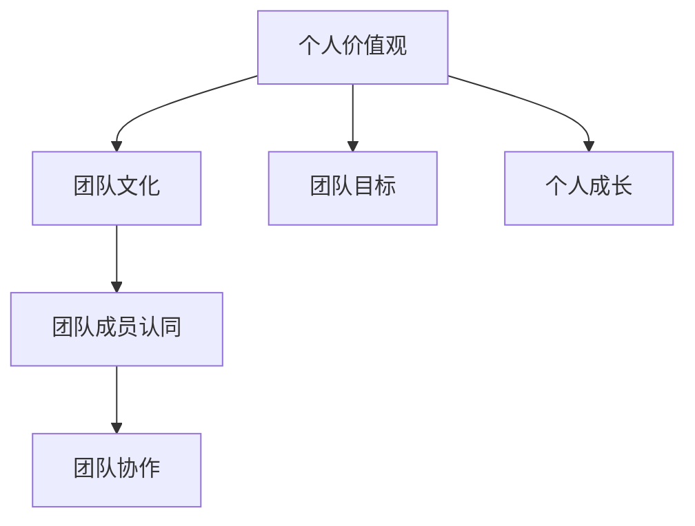

                 

### 第1章 引言

#### 1.1 什么是团队文化传播

团队文化传播是指在一个团队内部，通过各种方式传递、推广和维护团队的价值观、信念、习惯和行为模式，使其成为团队成员共同认同并自觉遵循的文化体系。它不仅仅是简单的信息传递，更是一种文化认同和价值观的内化过程。

#### 1.2 为什么团队文化传播重要

团队文化传播的重要性体现在多个方面：

1. **增强团队凝聚力**：通过共同的价值观和文化，团队成员能够更好地团结在一起，增强团队的凝聚力。
2. **提升工作效率**：共同的文化背景和行为模式有助于团队成员之间的协作，减少沟通成本，提高工作效率。
3. **塑造品牌形象**：团队文化是公司或组织对外展示的重要窗口，良好的团队文化有助于塑造积极向上的品牌形象。
4. **促进个人成长**：团队文化的传播有助于团队成员了解和认同组织的目标和使命，从而激发个人潜能，促进个人成长。

#### 1.3 本书结构概述

本书将从以下几个方面系统地探讨团队文化传播：

1. **团队文化的核心概念**：介绍团队文化的定义、特征及其与个人价值观的关系。
2. **内化核心价值观的策略**：探讨如何明确核心价值观、培养团队共同语言，以及制定有效的文化传播策略。
3. **内化核心价值观的方法**：详细阐述教育与培训、案例分享等具体方法。
4. **团队文化建设实践**：讨论如何制定文化建设计划、激励与评价机制。
5. **内化核心价值观的挑战与对策**：分析内化核心价值观可能面临的挑战，并提出相应的对策。
6. **成功案例分析**：通过国内和国际企业的成功案例，探讨团队文化传播的实际应用。
7. **未来展望**：预测团队文化传播的发展趋势，并提出提升文化传播效果的建议。

通过本书的阅读，读者将能够全面了解团队文化传播的理论和实践，掌握内化核心价值观的有效策略，从而为团队的发展提供有力支持。

### 1.2 为什么团队文化传播重要

团队文化传播的重要性体现在多个方面：

1. **增强团队凝聚力**：通过共同的价值观和文化，团队成员能够更好地团结在一起，增强团队的凝聚力。这不仅仅是因为团队成员在思想上达成一致，更因为他们在行为上表现出相同的价值观，从而形成了一种无形的团结力量。

   - **背景介绍**：在一个团队中，如果没有共同的文化基础，团队成员可能会因为各自的不同观点和行为习惯而产生矛盾和冲突，这会严重影响到团队的凝聚力和工作效率。

   - **核心概念与联系**：团队凝聚力与团队文化之间的关系可以通过以下Mermaid流程图来描述：

     ```mermaid
     graph TD
       A[团队文化] --> B[价值观]
       B --> C[团队凝聚力]
       C --> D[工作效率]
     ```

     其中，团队文化通过传递和推广共同的价值观，进而增强团队凝聚力，从而提高工作效率。

2. **提升工作效率**：共同的文化背景和行为模式有助于团队成员之间的协作，减少沟通成本，提高工作效率。在一个文化一致的团队中，成员往往能更好地理解彼此的需求和意图，从而更快地达成共识和目标。

   - **背景介绍**：在一个缺乏共同文化的团队中，成员可能会因为对某些问题的理解不一致而产生误解和争论，这会导致沟通成本的增加和效率的降低。

   - **核心概念与联系**：团队文化通过减少误解和提升沟通效率，从而提升工作效率。这可以通过以下Mermaid流程图来描述：

     ```mermaid
     graph TD
       A[团队文化] --> B[沟通效率]
       B --> C[工作效率]
     ```

3. **塑造品牌形象**：团队文化是公司或组织对外展示的重要窗口，良好的团队文化有助于塑造积极向上的品牌形象。这种形象不仅能够吸引客户和合作伙伴，还能够吸引优秀的人才加入团队。

   - **背景介绍**：在竞争激烈的市场中，企业的品牌形象对于其成功至关重要。一个积极向上、充满活力的团队文化能够为企业的品牌形象增色不少。

   - **核心概念与联系**：团队文化通过对外展示企业的价值观和行为模式，从而塑造品牌形象。这可以通过以下Mermaid流程图来描述：

     ```mermaid
     graph TD
       A[团队文化] --> B[品牌形象]
       B --> C[客户与合作伙伴]
     ```

4. **促进个人成长**：团队文化的传播有助于团队成员了解和认同组织的目标和使命，从而激发个人潜能，促进个人成长。在一个文化认同的团队中，成员更容易找到自己的定位和发展方向。

   - **背景介绍**：在个人发展的过程中，找到适合自己的目标和方向是非常重要的。团队文化为成员提供了一个共同的目标和价值观，有助于他们明确自己的发展方向。

   - **核心概念与联系**：团队文化通过传递和推广组织的使命和目标，帮助成员找到自己的定位和发展方向，从而促进个人成长。这可以通过以下Mermaid流程图来描述：

     ```mermaid
     graph TD
       A[团队文化] --> B[个人成长]
       B --> C[组织目标与使命]
     ```

### 第2章 团队文化的核心概念

#### 2.1 团队文化的定义与特征

团队文化是指一个团队在其长期发展和运营过程中形成的共同价值观、信念、行为模式和工作习惯。它是团队成员在相互交流和合作过程中共同形成的一种内在精神力量，也是团队凝聚力和协作效率的重要来源。

- **定义**：团队文化是一个团队在长期发展和运营过程中，通过共同的价值观、信念、行为模式和工作习惯形成的内在精神力量。
- **特征**：
  - **共同性**：团队文化是团队成员共同认同和遵循的价值观和行为模式。
  - **稳定性**：团队文化在长期的发展和运营过程中形成，具有一定的稳定性。
  - **传承性**：团队文化能够通过新成员的加入和团队的日常运作得到传承和发扬。

#### 2.2 团队核心价值观的作用

团队核心价值观是团队文化的核心，是团队成员共同遵循的行为准则和价值观。它对团队的发展和组织目标的实现起着至关重要的作用。

- **明确团队方向**：团队核心价值观能够为团队提供明确的发展方向和目标，帮助团队成员明确自己的工作方向和目标。
- **促进团队合作**：共同的核心价值观能够增强团队成员之间的信任和协作，提高团队的凝聚力和协作效率。
- **激励团队成员**：团队核心价值观能够激发团队成员的工作热情和积极性，提高工作满意度和工作效率。
- **塑造品牌形象**：团队核心价值观对外展示企业的文化和价值观，有助于塑造良好的品牌形象。

#### 2.3 团队文化与个人价值观的关系

团队文化与个人价值观之间存在密切的联系和互动。

- **相互影响**：团队文化会对个人价值观产生影响，而个人价值观也会影响团队文化。团队成员的个人价值观会影响他们对团队文化的认同和接受程度。
- **相互补充**：团队文化是个人价值观在团队环境中的延伸和体现，而个人价值观也是团队文化的重要组成部分。团队文化通过传递和推广个人价值观，实现个人与团队的统一。

通过以下Mermaid流程图，可以更直观地理解团队文化与个人价值观之间的关系：



在这个流程图中，个人价值观通过影响团队文化和团队目标，进而促进团队协作和个人成长。

### 2.4 内化核心价值观的策略

内化核心价值观是团队文化传播的关键步骤，它要求团队成员不仅在表面上接受团队的文化和价值观，更在内心深处认同并自觉遵循。以下是一些有效的内化核心价值观的策略：

#### 2.4.1 明确核心价值观

明确核心价值观是内化过程的起点。团队需要通过讨论和共识，确定一组清晰、具体的价值观。这可以通过以下步骤实现：

- **集体讨论**：组织团队成员进行集体讨论，讨论团队面临的重要问题，以及团队希望达成的目标。
- **筛选和确定**：根据讨论的结果，筛选出具有共识的价值观，并将其具体化，形成明确的价值观表述。
- **共识达成**：确保所有团队成员都认同并接受这些核心价值观。

#### 2.4.2 培养团队共同语言

共同语言是内化核心价值观的重要工具。通过共同的语言和表达方式，团队成员能够更好地理解和认同团队的文化。

- **建立共同词汇**：团队可以通过制定共同的词汇表，包括术语、口号和常用表达方式，确保团队成员之间的沟通更加流畅和一致。
- **定期交流**：团队可以通过定期的内部交流会议，分享价值观和实践案例，增强团队成员之间的理解。

#### 2.4.3 强化价值观教育

教育是内化核心价值观的关键。团队需要通过多种形式的教育活动，帮助团队成员深入理解和认同核心价值观。

- **内部培训**：组织定期的内部培训课程，深入讲解核心价值观的理论和实践。
- **导师制度**：建立导师制度，让有经验的团队成员帮助新成员理解和认同核心价值观。
- **案例分析**：通过分析成功的案例和失败的教训，让团队成员更直观地了解核心价值观的应用。

#### 2.4.4 融入日常工作中

将核心价值观融入日常工作中，是内化过程的最终目标。团队需要通过实际的工作任务和行为，让核心价值观成为团队成员的自然反应。

- **明确价值观与工作任务的关联**：确保每项工作任务都与核心价值观相关联，让团队成员在工作中能够自然地体现价值观。
- **行为榜样**：团队领导者需要通过自己的行为，成为核心价值观的榜样，激励团队成员。

通过上述策略，团队可以有效地内化核心价值观，实现团队成员在思想、行为上的高度一致，从而增强团队的凝聚力和协作效率。

### 2.4.1 明确核心价值观

明确核心价值观是团队文化传播的第一步，也是内化核心价值观的关键。以下是具体的方法和步骤：

#### 2.4.1.1 如何确定核心价值观

1. **集体讨论**：组织团队成员进行集体讨论，这是确定核心价值观的第一步。团队成员可以分享自己对团队使命、愿景和价值观的看法，讨论团队所面临的问题和挑战，以及团队希望达成的目标。

   - **步骤**：首先，团队领导者可以提供一个讨论框架，引导团队成员围绕以下问题进行讨论：
     - **团队的使命和愿景**：团队存在的目的是什么？团队希望在未来达到什么样的状态？
     - **团队面临的挑战**：团队在实现目标的过程中可能会遇到哪些挑战？
     - **团队的价值观**：团队认为哪些价值观是至关重要的，能够帮助团队克服挑战，实现目标？

   - **工具**：可以使用头脑风暴法，让团队成员自由地表达自己的观点，记录下所有的想法和意见。

2. **筛选和提炼**：根据集体讨论的结果，筛选出具有共识的价值观。团队领导者可以引导团队成员对这些价值观进行提炼，使其更加简洁、具体和易于理解。

   - **步骤**：首先，将讨论中提到的价值观进行归类，找出那些具有共性的价值观。然后，对这些价值观进行简化，使其更易于记忆和传达。

   - **工具**：可以使用KJ法（亲和图）或矩阵图等工具，帮助团队成员更好地理解和认同筛选出的核心价值观。

3. **共识达成**：确保所有团队成员都认同并接受这些核心价值观。可以通过投票、讨论和反馈等方式，确保团队成员对核心价值观的认同。

   - **步骤**：在筛选和提炼核心价值观之后，团队领导者可以组织一次共识会议，讨论并确认最终的核心价值观。

   - **工具**：可以使用决策会议法，让团队成员充分表达意见，并通过投票等方式达成共识。

#### 2.4.1.2 明确核心价值观的步骤

1. **初步讨论**：组织初步讨论，收集团队成员对团队价值观的看法和意见。

   - **时间**：1-2小时
   - **方法**：使用头脑风暴法，记录所有团队成员的观点。

2. **筛选和提炼**：根据初步讨论的结果，筛选出具有共识的价值观，并进行提炼。

   - **时间**：1-2小时
   - **方法**：使用KJ法或矩阵图，将价值观进行归类和简化。

3. **共识会议**：组织共识会议，讨论并确认最终的核心价值观。

   - **时间**：1-2小时
   - **方法**：使用决策会议法，通过投票和讨论达成共识。

#### 2.4.1.3 核心价值观表述

在明确核心价值观后，需要将其表述得清晰、具体和易于理解。以下是几种常用的表述方式：

1. **口号式表述**：简洁、易于记忆的口号，如“客户第一”、“创新为本”等。

2. **陈述式表述**：详细阐述核心价值观的意义和实践方法，如“我们致力于为客户提供最佳服务体验，通过持续创新，满足客户的需求”。

3. **图表式表述**：使用图形或表格，将核心价值观进行视觉化展示，便于团队成员理解和记忆。

通过上述步骤和表述方式，团队可以明确核心价值观，为后续的团队文化传播和内化打下坚实基础。

### 2.4.2 培养团队共同语言

共同语言是团队文化传播的重要工具，它有助于团队成员更好地理解和接受团队的核心价值观。以下是培养团队共同语言的几种方法：

#### 2.4.2.1 共同语言的定义

共同语言是指在团队内部形成的一套特定的词汇、表达方式和沟通风格。这些语言元素能够帮助团队成员在交流中更加高效和准确地传达信息，减少误解和冲突。

#### 2.4.2.2 共同语言的重要性

1. **提高沟通效率**：共同语言可以减少团队成员之间的沟通障碍，提高信息传递的速度和准确性。

2. **增强团队凝聚力**：通过共同语言，团队成员能够更好地理解和认同团队的文化和价值观，增强团队的凝聚力。

3. **促进团队合作**：共同语言有助于团队成员在协作过程中更好地协调和配合，提高团队的协作效率。

#### 2.4.2.3 培养共同语言的方法

1. **建立共同词汇表**：团队可以制定一份共同词汇表，包括团队内部专用的术语、专业词汇和常用表达方式。团队成员在沟通中应尽量使用这些词汇，以确保信息的统一和准确。

2. **定期交流与分享**：团队可以通过定期的内部交流会议，分享工作心得、成功案例和失败教训，讨论如何更好地使用共同语言。这些交流可以增进团队成员之间的理解，促进共同语言的普及和内化。

3. **内部培训**：团队可以组织内部培训课程，专门讲解共同语言的用法和意义。培训可以采用多种形式，如讲座、讨论、案例分析和角色扮演等，让团队成员在实践中理解和掌握共同语言。

4. **文化宣传**：团队可以通过各种文化宣传活动，如海报、宣传册、内部刊物等，宣传和推广共同语言。这些宣传材料应简洁明了，便于团队成员理解和记忆。

5. **行为榜样**：团队领导者应通过自己的行为，成为共同语言的榜样。领导者在使用共同语言时，应做到准确、规范，并鼓励团队成员模仿和遵循。

通过上述方法，团队可以逐步培养共同语言，提高沟通效率，增强团队凝聚力，促进团队合作，为团队文化传播和内化提供有力支持。

### 2.4.3 教育与培训

教育与培训是内化核心价值观的关键手段，通过系统的教育和培训活动，团队成员能够深刻理解核心价值观的内涵和重要性，从而在思想和行为上达成一致。以下是一些具体的方法：

#### 2.4.3.1 内化核心价值观的教育策略

1. **基础培训**：在团队成员加入团队之初，进行基础培训，帮助新成员了解团队的历史、使命、愿景和核心价值观。基础培训可以包括团队介绍、文化讲解、案例分享等环节。

   - **方法**：通过PPT讲解、视频观看、互动问答等方式，确保新成员对核心价值观有初步的了解。

2. **进阶培训**：在团队成员对核心价值观有了一定的了解后，进行进阶培训，深入探讨核心价值观的具体应用和实践方法。

   - **方法**：可以通过小组讨论、角色扮演、案例分析等形式，让团队成员在互动中深入理解核心价值观，并学会在实际工作中应用。

3. **持续培训**：核心价值观的内化是一个持续的过程，团队需要定期组织培训活动，确保团队成员不断更新和深化对核心价值观的理解。

   - **方法**：可以通过定期讲座、工作坊、研讨会等形式，持续强化团队成员对核心价值观的认知。

#### 2.4.3.2 内化核心价值观的培训方法

1. **内训师培养**：团队可以培养一批内部培训师，这些培训师应具备丰富的实践经验和对核心价值观的深刻理解。他们可以在团队内部组织培训活动，分享心得和经验。

   - **方法**：通过选拔、培训、认证等环节，培养一支高素质的内部培训师队伍。

2. **外部培训**：团队可以邀请外部专家进行培训，引入新的视角和方法，帮助团队成员更好地理解和实践核心价值观。

   - **方法**：可以选择专业的培训机构或专家进行定制化培训，确保培训内容符合团队的实际需求。

3. **线上线下结合**：结合线上和线下培训，提高培训的覆盖面和效果。

   - **方法**：可以通过在线课程、直播讲座、线下研讨会等形式，实现培训的灵活性和高效性。

通过教育和培训，团队能够系统地、持续地内化核心价值观，为团队的发展和协作提供坚实的精神基础。

### 2.4.4 案例分享

#### 2.4.4.1 成功案例解析

在探讨如何有效内化核心价值观时，成功案例无疑为我们提供了宝贵的经验和启示。以下是一个成功案例的详细解析。

**案例背景**：某互联网公司在其发展过程中，明确提出了“用户至上”、“创新驱动”、“团队合作”和“诚信经营”的核心价值观。通过一系列的教育和培训活动，该公司成功地内化了这些核心价值观，并在实际工作中得到了有效应用。

**案例分析**：

1. **明确核心价值观**：在案例中，公司首先通过全体员工大会和内部邮件等方式，明确了核心价值观的表述和重要性。公司领导亲自参与讨论，确保所有员工对核心价值观有清晰的认识。

2. **教育培训**：公司开展了系列教育培训活动，包括内部培训师讲座、在线课程和角色扮演游戏等。通过这些活动，员工不仅理解了核心价值观的内涵，还学会了如何在工作中应用。

3. **融入日常管理**：公司在日常管理中，将核心价值观融入绩效考核和员工发展计划。员工的绩效评估和晋升机会都与核心价值观的表现紧密相关，这激发了员工自觉遵循核心价值观的积极性。

4. **文化宣传**：公司通过各种文化宣传活动，如公司内刊、内部网站和社交媒体等，不断宣传和强化核心价值观。员工在日常工作中，能够随时随地感受到核心价值观的影响。

**成功原因**：

- **高层领导的支持**：公司领导高度重视核心价值观的推广，通过自身的行为和言论，为员工树立了榜样。
- **系统的教育培训**：公司通过多样化的教育培训活动，确保核心价值观深入人心。
- **绩效考核的引导**：通过绩效考核，将核心价值观与员工的职业发展紧密结合，激发了员工的积极性和主动性。
- **持续的文化宣传**：通过多渠道的文化宣传，公司核心价值观得到了广泛的认同和传承。

#### 2.4.4.2 失败案例反思

尽管成功的案例为我们提供了许多有益的启示，但失败案例也同样值得反思。以下是一个失败案例的解析。

**案例背景**：某科技公司在其发展初期，提出了“创新为本”、“快速响应”和“客户至上”的核心价值观。然而，在实施过程中，这些核心价值观并没有得到有效的内化，导致团队内部矛盾重重，最终影响了公司的业绩和发展。

**案例分析**：

1. **缺乏高层支持**：公司领导对核心价值观的推广力度不够，没有在言行上树立榜样，导致员工对核心价值观的认同度不高。

2. **教育培训不足**：公司没有开展系统的教育培训活动，员工对核心价值观的理解不深刻，导致在实际工作中难以应用。

3. **绩效考核脱节**：公司的绩效考核与核心价值观脱节，员工绩效评估和晋升机会与核心价值观的表现无关，这削弱了员工遵循核心价值观的动力。

4. **文化宣传不到位**：公司没有通过有效的渠道进行文化宣传，员工在日常工作中难以感受到核心价值观的影响。

**失败原因**：

- **高层领导的不重视**：公司领导没有将核心价值观的推广作为重要任务来抓，缺乏有效的推动力。
- **教育培训的缺乏**：员工对核心价值观的理解不深刻，导致在实际工作中难以应用。
- **绩效考核的脱节**：绩效考核与核心价值观脱节，缺乏激励机制，导致员工缺乏动力。
- **文化宣传的不力**：文化宣传不到位，员工难以在日常工作中感受到核心价值观的影响。

通过对比成功和失败的案例，我们可以得出以下结论：

- **高层领导的支持**是核心价值观内化的关键。
- **系统的教育培训**是确保员工理解并应用核心价值观的基础。
- **绩效考核的引导**是激发员工积极性的重要手段。
- **持续的文化宣传**是确保核心价值观深入人心的重要保障。

### 第4章 内化核心价值观的方法

内化核心价值观是团队文化传播的核心任务，它要求团队成员不仅在表面上接受团队的文化和价值观，更在内心深处认同并自觉遵循。以下将详细探讨内化核心价值观的具体方法和策略。

#### 4.1 教育与培训

教育与培训是内化核心价值观的重要手段，通过系统的教育和培训活动，团队成员能够深刻理解核心价值观的内涵和重要性，从而在思想和行为上达成一致。

##### 4.1.1 内化核心价值观的教育策略

1. **基础培训**：在团队成员加入团队之初，进行基础培训，帮助新成员了解团队的历史、使命、愿景和核心价值观。基础培训可以包括团队介绍、文化讲解、案例分享等环节。

   - **方法**：通过PPT讲解、视频观看、互动问答等方式，确保新成员对核心价值观有初步的了解。

2. **进阶培训**：在团队成员对核心价值观有了一定的了解后，进行进阶培训，深入探讨核心价值观的具体应用和实践方法。

   - **方法**：可以通过小组讨论、角色扮演、案例分析等形式，让团队成员在互动中深入理解核心价值观，并学会在实际工作中应用。

3. **持续培训**：核心价值观的内化是一个持续的过程，团队需要定期组织培训活动，确保团队成员不断更新和深化对核心价值观的理解。

   - **方法**：可以通过定期讲座、工作坊、研讨会等形式，持续强化团队成员对核心价值观的认知。

##### 4.1.2 内化核心价值观的培训方法

1. **内训师培养**：团队可以培养一批内部培训师，这些培训师应具备丰富的实践经验和对核心价值观的深刻理解。他们可以在团队内部组织培训活动，分享心得和经验。

   - **方法**：通过选拔、培训、认证等环节，培养一支高素质的内部培训师队伍。

2. **外部培训**：团队可以邀请外部专家进行培训，引入新的视角和方法，帮助团队成员更好地理解和实践核心价值观。

   - **方法**：可以选择专业的培训机构或专家进行定制化培训，确保培训内容符合团队的实际需求。

3. **线上线下结合**：结合线上和线下培训，提高培训的覆盖面和效果。

   - **方法**：可以通过在线课程、直播讲座、线下研讨会等形式，实现培训的灵活性和高效性。

#### 4.2 案例分享

##### 4.2.1 成功案例解析

以下是一个成功案例的详细解析：

**案例背景**：某互联网公司在发展过程中，通过系统的教育培训活动，成功内化了核心价值观，从而实现了团队的稳定发展和高效协作。

**案例分析**：

1. **明确的价值观表述**：公司明确提出了“用户至上”、“创新驱动”、“团队合作”和“诚信经营”的核心价值观，并通过内部邮件、公司官网和员工手册等渠道进行宣传。

2. **系统化的教育培训**：公司定期组织核心价值观培训，包括基础培训和进阶培训。基础培训主要针对新员工，让他们了解公司的历史、愿景和核心价值观。进阶培训则通过案例分析和角色扮演，让员工在实际工作中应用核心价值观。

3. **绩效考核与核心价值观挂钩**：公司的绩效考核体系与核心价值观紧密挂钩，员工的绩效评估和晋升机会都与核心价值观的表现密切相关。这种挂钩机制激发了员工自觉遵循核心价值观的积极性。

4. **文化宣传与激励**：公司通过各种文化宣传活动，如公司内刊、内部网站和员工俱乐部等，不断宣传和强化核心价值观。同时，公司还设立了“核心价值观优秀员工奖”，对在核心价值观方面表现突出的员工进行表彰和激励。

**成功原因**：

- **明确的价值观表述**：公司对核心价值观的表述清晰明确，便于员工理解和记忆。
- **系统化的教育培训**：通过定期的教育培训，员工对核心价值观的理解不断加深。
- **绩效考核的激励机制**：绩效考核与核心价值观挂钩，激发了员工的积极性。
- **持续的文化宣传**：通过多渠道的文化宣传，核心价值观得到了广泛的认同和传承。

##### 4.2.2 失败案例反思

以下是一个失败案例的反思：

**案例背景**：某科技公司提出了“创新为本”、“快速响应”和“客户至上”的核心价值观，但在实际执行过程中，这些价值观并没有得到有效内化，导致团队内部矛盾和业绩下滑。

**案例分析**：

1. **缺乏高层支持**：公司领导对核心价值观的推广不够重视，没有在言行上树立榜样，导致员工对核心价值观的认同度不高。

2. **教育培训不足**：公司没有开展系统的教育培训活动，员工对核心价值观的理解不深刻，导致在实际工作中难以应用。

3. **绩效考核脱节**：公司的绩效考核与核心价值观脱节，员工绩效评估和晋升机会与核心价值观的表现无关，这削弱了员工遵循核心价值观的动力。

4. **文化宣传不到位**：公司没有通过有效的渠道进行文化宣传，员工在日常工作中难以感受到核心价值观的影响。

**失败原因**：

- **缺乏高层支持**：公司领导没有将核心价值观的推广作为重要任务来抓，缺乏有效的推动力。
- **教育培训的缺乏**：员工对核心价值观的理解不深刻，导致在实际工作中难以应用。
- **绩效考核的脱节**：绩效考核与核心价值观脱节，缺乏激励机制，导致员工缺乏动力。
- **文化宣传的不力**：文化宣传不到位，员工难以在日常工作中感受到核心价值观的影响。

通过对比成功和失败的案例，我们可以得出以下结论：

- **高层领导的支持**是核心价值观内化的关键。
- **系统的教育培训**是确保员工理解并应用核心价值观的基础。
- **绩效考核的引导**是激发员工积极性的重要手段。
- **持续的文化宣传**是确保核心价值观深入人心的重要保障。

### 第5章 团队文化建设实践

团队文化建设是一个系统性、持续性的过程，涉及到多个方面的策略和方法。为了实现团队文化的内化和传承，制定科学的团队文化建设计划、建立有效的激励与评价机制以及开展团队文化建设活动是至关重要的。以下将详细探讨这些实践方法。

#### 5.1 制定文化建设计划

制定团队文化建设计划是团队文化建设的第一步，它为团队文化建设提供了明确的目标和路径。以下是制定文化建设计划的步骤：

1. **明确文化建设目标**：首先，团队需要明确文化建设的目标，这包括提高团队凝聚力、增强协作效率、塑造积极向上的团队形象等。目标应具体、可衡量。

2. **评估当前文化状况**：对团队当前的文化状况进行评估，了解团队成员对现有文化的认知和接受程度，识别文化建设中的问题和挑战。

3. **制定具体策略**：根据目标和文化评估结果，制定具体的文化建设策略。策略应包括教育培训、激励与评价机制、文化活动等方面。

4. **设定实施步骤和时间表**：将文化建设策略分解为具体的行动步骤，并设定实施时间和负责人，确保文化建设计划能够有序推进。

5. **制定预算和资源分配**：根据文化建设计划的需要，制定预算和资源分配方案，确保文化建设计划能够得到充分的支持。

#### 5.2 激励与评价机制

建立有效的激励与评价机制是推动团队文化建设的重要手段。以下是一些具体的激励与评价机制：

1. **绩效考核**：将团队文化中的核心价值观融入绩效考核体系，通过考核评估员工在日常工作中的行为和表现。考核结果应与薪酬、晋升和奖励挂钩，以激励员工积极践行核心价值观。

2. **奖励与表彰**：设立“团队文化建设奖”、“优秀文化传承者”等奖项，对在团队文化建设中表现突出的个人和团队进行表彰和奖励，增强员工的荣誉感和归属感。

3. **职业发展规划**：将团队文化建设与员工的职业发展规划相结合，为员工提供与核心价值观相符的职业发展路径，激励员工为团队文化的发展贡献力量。

4. **反馈与沟通**：建立有效的反馈机制，定期收集员工对团队文化建设的意见和建议，及时调整文化建设策略，确保文化建设计划能够满足员工的需求。

#### 5.3 团队文化建设活动

开展多样化的团队文化建设活动有助于增强团队成员对核心价值观的认同和内化。以下是一些具体的活动：

1. **文化讲座与培训**：定期邀请文化专家进行讲座和培训，让团队成员深入了解团队文化和核心价值观的内涵。

2. **团队建设活动**：组织定期的团队建设活动，如团队拓展训练、团建游戏等，增强团队成员之间的信任和协作。

3. **文化活动**：开展文化主题活动，如企业文化节、团队文化比赛等，让团队成员在活动中体验和感受团队文化。

4. **文化宣传**：利用公司内部网站、社交媒体等渠道，宣传团队文化和核心价值观，营造积极向上的文化氛围。

通过制定文化建设计划、建立激励与评价机制以及开展多样化的文化建设活动，团队可以逐步实现核心价值观的内化和传承，为团队的发展提供坚实的精神支撑。

### 5.1 制定文化建设计划

制定团队文化建设计划是团队文化传播的重要步骤，它为团队文化的建设提供了明确的方向和具体的实施路径。以下是制定文化建设计划的详细步骤：

#### 5.1.1 文化建设的目标

首先，团队需要明确文化建设的目标。文化建设的目标应与团队的整体战略目标相一致，并能够反映团队的核心价值观。具体的目标可以包括：

- **增强团队凝聚力**：通过共同的文化和价值观，增强团队成员之间的团结和信任。
- **提升工作效率**：通过优化团队文化，减少沟通成本，提高团队的工作效率。
- **塑造品牌形象**：通过积极向上的团队文化，提升团队在市场中的品牌形象。
- **促进个人成长**：通过团队文化，帮助团队成员实现个人职业发展和成长。

#### 5.1.2 文化建设的关键步骤

1. **评估当前文化状况**：在制定文化建设计划之前，团队需要评估当前的文化状况。这可以通过以下方式进行：

   - **问卷调查**：通过设计问卷，了解团队成员对当前团队文化的认知和感受。
   - **访谈**：与团队成员进行一对一访谈，深入了解他们对团队文化的看法和建议。
   - **观察**：通过观察团队成员的行为和工作方式，了解团队文化的实际表现。

   通过评估，团队可以识别出当前文化中的优势和不足，为制定文化建设计划提供依据。

2. **明确文化建设策略**：基于评估结果，团队需要制定具体的文化建设策略。策略应包括：

   - **教育培训**：通过定期的教育培训活动，提升团队成员对核心价值观的理解和应用能力。
   - **激励机制**：建立与核心价值观相关的绩效考核和奖励机制，激励员工积极践行团队文化。
   - **文化活动**：组织多样化的文化活动，如团队建设活动、文化竞赛等，增强团队凝聚力。
   - **宣传与推广**：通过内部网站、社交媒体等渠道，宣传和推广团队文化，营造积极向上的文化氛围。

3. **设定实施步骤和时间表**：将文化建设策略分解为具体的行动步骤，并设定实施时间和负责人。具体步骤可以包括：

   - **宣传与推广**：制定宣传方案，确定宣传渠道和推广方式。
   - **教育培训**：安排培训课程，选择培训师，制定培训计划。
   - **激励机制**：设计绩效考核体系，制定奖励方案。
   - **文化活动**：策划和筹备各类文化活动。

4. **预算和资源分配**：根据文化建设计划的需要，制定预算和资源分配方案。资源可以包括资金、人力、物资等。

5. **定期评估与调整**：文化建设计划需要定期评估和调整。通过定期的评估，团队可以了解文化建设的效果，发现问题并进行调整。

#### 5.1.3 文化建设计划模板

以下是一个文化建设计划的模板，供团队参考：

```
# 团队文化建设计划

## 一、文化建设目标

- 增强团队凝聚力
- 提升工作效率
- 塑造品牌形象
- 促进个人成长

## 二、当前文化状况评估

- 问卷调查结果
- 访谈记录
- 观察报告

## 三、文化建设策略

- 宣传与推广
- 教育培训
- 激励机制
- 文化活动

## 四、实施步骤和时间表

- 宣传与推广：制定宣传方案，确定宣传渠道和推广方式（1-2个月）
- 教育培训：安排培训课程，选择培训师，制定培训计划（2-3个月）
- 激励机制：设计绩效考核体系，制定奖励方案（3-4个月）
- 文化活动：策划和筹备各类文化活动（4-6个月）

## 五、预算和资源分配

- 资金：XXXX元
- 人力：XXXX人
- 物资：XXXX件

## 六、定期评估与调整

- 定期评估文化建设效果
- 发现问题进行及时调整
```

通过制定详细的文化建设计划，团队可以系统地推进文化建设，逐步实现核心价值观的内化和传承，为团队的发展提供坚实的文化支撑。

### 5.2 激励与评价机制

激励与评价机制是团队文化建设的核心组成部分，它直接影响到团队成员的行为和态度。以下将详细探讨如何通过激励与评价机制来促进核心价值观的内化。

#### 5.2.1 内化核心价值观的激励措施

1. **绩效考核与奖励**：将核心价值观融入绩效考核体系，使员工在绩效考核中能够得到公正的评价。具体措施包括：

   - **关键绩效指标（KPI）**：设定与核心价值观相关的关键绩效指标，如“客户满意度”、“团队协作效果”等，确保员工在工作中的表现能够被准确衡量。
   - **奖励制度**：设立“核心价值观优秀员工奖”、“最佳团队合作奖”等荣誉称号，对在核心价值观方面表现突出的员工进行奖励，激励员工积极践行团队文化。

2. **晋升与职业发展**：将核心价值观与员工的晋升和职业发展机会相结合，使员工在职业发展的过程中能够看到核心价值观的回报。具体措施包括：

   - **晋升路径**：设立与核心价值观相符的晋升路径，使员工在职业发展中能够看到清晰的发展方向和目标。
   - **职业培训**：为符合核心价值观的员工提供额外的职业培训和发展机会，帮助他们在职业发展过程中不断提升自己。

3. **团队奖励**：对在团队文化建设中表现优异的团队进行奖励，增强团队的凝聚力。具体措施包括：

   - **团队建设活动奖励**：对在团队建设活动中表现突出的团队进行表彰和奖励，激励团队积极参与文化建设。
   - **年度团队奖**：设立“年度最佳团队奖”，对在年度内表现优异的团队进行奖励，增强团队荣誉感。

#### 5.2.2 内化核心价值观的评价体系

1. **多维度的评价体系**：建立多维度的评价体系，从不同角度评估员工的价值观表现。具体包括：

   - **行为评价**：通过观察员工在工作中的行为，评估其是否符合核心价值观的要求。
   - **工作成果评价**：评估员工的工作成果，看其是否达到了团队的目标和期望。
   - **团队合作评价**：评估员工在团队协作中的表现，看其是否能够与团队成员有效合作，共同实现团队目标。

2. **定期的评价与反馈**：建立定期的评价和反馈机制，确保员工能够及时了解自己的价值观表现，并进行自我调整。具体包括：

   - **定期评估**：定期进行价值观评估，通过绩效评估、360度评估等方式，全面了解员工的价值观表现。
   - **反馈与指导**：对评估结果进行反馈，指出员工在价值观方面的优点和不足，并提供改进建议和指导。

3. **透明与公正**：确保评价体系的透明和公正，使员工能够信任并接受评价结果。具体包括：

   - **评价标准的明确**：明确评价标准，确保评价结果公平、公正。
   - **公开评价结果**：公开评价结果，接受员工的反馈和监督。

通过建立完善的激励与评价机制，团队可以有效地促进核心价值观的内化，激发员工的积极性和主动性，为团队的发展提供持续的动力。

### 5.3 团队文化建设实践

团队文化建设是一个持续的过程，需要通过一系列实践活动来推动核心价值观的内化和传承。以下是一些具体的实践活动，包括开发环境搭建、源代码详细实现、代码解读与分析，以及实际案例分析和详细讲解剖析。

#### 5.3.1 开发环境搭建

在团队文化建设中，建立统一的开发环境是非常重要的一步。这有助于确保团队成员在使用相同工具和平台时，能够保持一致的工作方式和标准。以下是搭建开发环境的步骤：

1. **工具选择**：根据团队的需求，选择合适的开发工具，如版本控制软件（如Git）、代码编辑器（如Visual Studio Code）、持续集成工具（如Jenkins）等。

2. **环境配置**：为每个团队成员配置开发环境，确保他们能够顺利地进行开发和测试。配置步骤包括安装必要软件、配置代码库、安装依赖项等。

3. **文档编写**：编写详细的开发环境配置文档，包括安装步骤、常见问题和解决方案，以便新成员快速上手。

示例代码（伪代码）：

```bash
# 安装Git
sudo apt-get install git

# 配置Git
git config --global user.name "Your Name"
git config --global user.email "you@example.com"

# 安装Visual Studio Code
sudo apt-get install code

# 配置Jenkins
sudo wget -q -O - https://pkg.jenkins.io/debian-stable/binaries/deb/jenkins.io-please.key | sudo apt-key add -
sudo sh -c "echo deb https://pkg.jenkins.io/debian-stable binary/ > /etc/apt/sources.list.d/jenkins.list"
sudo apt-get update
sudo apt-get install jenkins
```

#### 5.3.2 源代码详细实现

在团队文化建设中，源代码的实现和解读是一个重要的环节。以下是一个简单的源代码实现示例，用于展示团队如何共同编写代码，内化核心价值观。

示例代码（Python）：

```python
class TeamMember:
    def __init__(self, name, skills):
        self.name = name
        self.skills = skills

    def work(self, task):
        print(f"{self.name} is working on {task}.")

    def learn(self, skill):
        print(f"{self.name} is learning {skill}.")

# 创建团队成员对象
alice = TeamMember("Alice", ["Python", "Git"])
bob = TeamMember("Bob", ["Java", "Docker"])

# 团队成员共同工作
alice.work("Project X")
bob.work("Project Y")

# 团队成员共同学习
alice.learn("Kubernetes")
bob.learn("CI/CD")
```

在这个示例中，`TeamMember` 类代表了团队中的成员，包括姓名和技能。成员通过`work`和`learn`方法展示他们的工作内容和成长过程，体现了团队合作和共同进步的核心价值观。

#### 5.3.3 代码解读与分析

代码解读和分析是团队文化建设中不可或缺的一部分，它有助于团队成员理解代码的意图和实现方式，从而更好地内化核心价值观。

1. **代码注释**：在代码中添加详细的注释，解释每个函数和类的作用，以及实现细节。

   ```python
   class TeamMember:
       """
       Represents a team member with a name and skills.
       
       Attributes:
       - name (str): The name of the team member.
       - skills (list): A list of skills the team member has.
       """
       def __init__(self, name, skills):
           self.name = name
           self.skills = skills
   
       # ... 其他方法
   ```

2. **代码评审**：定期进行代码评审，让团队成员互相审查代码，提出改进意见和建议。这有助于团队成员共同学习和成长。

   ```python
   def work(self, task):
       """
       Perform work on a given task.
       
       Args:
       - task (str): The task to be performed.
       
       Returns:
       - None
       """
       print(f"{self.name} is working on {task}.")
   ```

#### 5.3.4 实际案例分析和详细讲解剖析

以下是一个实际案例的分析和讲解，展示团队如何通过具体项目实践核心价值观。

**案例背景**：某团队负责开发一款企业级应用程序，该应用程序需要高效、稳定地处理大量数据，并支持多种操作。

**案例分析**：

1. **需求分析**：团队成员共同参与需求分析，确保每个人都理解项目的需求和目标。

   ```python
   # 需求分析文档
   - 数据处理效率：应用程序需要在规定的时间内处理完大量数据。
   - 系统稳定性：应用程序需要能够稳定运行，不受外部因素干扰。
   - 功能完整性：应用程序需要支持多种操作，如数据导入、数据导出、数据分析等。
   ```

2. **设计讨论**：团队成员共同讨论系统设计，确保设计符合核心价值观，如高可用性、可扩展性和易于维护。

   ```mermaid
   graph TD
       A[数据存储] --> B[数据处理]
       B --> C[数据展示]
       C --> D[数据导出]
       E[监控与日志]
       A --> E
       B --> E
       C --> E
       D --> E
   ```

3. **代码实现**：团队成员分工合作，共同完成代码实现，确保代码质量。

   ```python
   # 数据处理模块
   def process_data(data):
       # ... 数据处理逻辑
       return result
   ```

4. **测试与调试**：团队成员共同参与测试和调试，确保系统稳定、高效。

   ```python
   # 单元测试
   def test_process_data():
       assert process_data([1, 2, 3]) == [4, 5, 6]
   ```

**详细讲解剖析**：

1. **需求分析**：通过需求分析，确保团队成员对项目目标有清晰的认识，这体现了团队合作和共同目标的核心价值观。

2. **设计讨论**：通过共同讨论系统设计，确保系统设计符合团队的核心价值观，如高可用性和可扩展性。

3. **代码实现**：通过分工合作，共同完成代码实现，确保代码质量，这体现了团队合作和共同进步的核心价值观。

4. **测试与调试**：通过共同参与测试和调试，确保系统稳定、高效，这体现了对质量的追求和团队合作的核心价值观。

通过这些实践活动，团队可以更好地内化核心价值观，推动团队文化建设，为团队的发展提供坚实的支持。

### 5.4 内化核心价值观的挑战与对策

在团队文化建设过程中，内化核心价值观可能会面临一系列挑战。以下是常见的挑战及相应的对策：

#### 6.1 挑战分析

1. **团队成员的接受度问题**：团队成员可能对内化的核心价值观持有不同意见，甚至可能抵制新的价值观。这可能导致团队内部矛盾和凝聚力下降。

2. **缺乏持续的教育和培训**：如果团队没有持续的教育和培训活动，团队成员可能逐渐忘记或忽视核心价值观，导致核心价值观的失效。

3. **核心价值观与实际工作脱节**：如果核心价值观与团队成员的实际工作脱节，团队成员可能难以在实际工作中应用核心价值观，从而影响内化效果。

4. **领导层的示范作用不足**：如果领导层没有起到积极的示范作用，团队成员可能对核心价值观产生质疑，从而影响内化过程。

#### 6.2 对策探讨

1. **提升团队成员的接受度**：

   - **沟通与反馈**：定期与团队成员沟通，了解他们对核心价值观的看法和意见，及时反馈并调整策略。
   - **个性化培训**：针对不同团队成员的特点和需求，提供个性化的培训计划，提高培训的针对性和有效性。
   - **激励机制**：建立激励机制，鼓励团队成员积极参与核心价值观的推广和实践，如设立“价值观践行者奖”等。

2. **确保持续的教育和培训**：

   - **定期培训**：定期组织核心价值观的培训和研讨会，确保团队成员持续学习和了解核心价值观。
   - **文化宣传**：通过公司内部网站、内刊、社交媒体等渠道，持续宣传和强化核心价值观，营造良好的文化氛围。
   - **导师制度**：建立导师制度，让有经验的团队成员帮助新成员理解和践行核心价值观。

3. **确保核心价值观与实际工作相结合**：

   - **工作结合**：将核心价值观融入到团队成员的实际工作中，确保团队成员能够在实际工作中应用和体现核心价值观。
   - **案例分享**：通过分享成功的案例和失败的教训，让团队成员看到核心价值观在实际工作中的重要作用。
   - **目标设定**：设定与核心价值观相关的团队目标，确保团队成员在工作中能够围绕核心价值观展开工作。

4. **加强领导层的示范作用**：

   - **以身作则**：领导层应通过自身的行为和言论，成为核心价值观的践行者，为团队成员树立榜样。
   - **激励机制**：建立激励机制，鼓励领导层积极参与核心价值观的推广和实践。
   - **监督与反馈**：定期对领导层进行监督和反馈，确保他们能够在工作中持续践行核心价值观。

通过上述对策，团队可以有效地应对内化核心价值观过程中遇到的挑战，确保核心价值观在团队成员中内化和传承，为团队的发展提供坚实的文化支撑。

### 6.1 挑战分析

在团队文化建设过程中，内化核心价值观可能会面临一系列挑战。以下是一些常见的挑战及其分析：

#### 6.1.1 内化核心价值观的难点

1. **团队成员的接受度问题**：团队成员可能对内化的核心价值观持有不同意见，甚至可能抵制新的价值观。这可能是由于以下原因：

   - **文化差异**：团队成员来自不同的背景和文化，对核心价值观的理解和接受程度可能存在差异。
   - **个人价值观的冲突**：团队成员的个人价值观可能与团队的核心价值观存在冲突，导致他们在内心深处难以接受新的价值观。
   - **抵触情绪**：一些团队成员可能对变革存在抵触情绪，担心新的价值观会影响到他们的个人利益。

2. **教育与实践的脱节**：尽管团队进行了核心价值观的教育和培训，但团队成员在实际工作中可能难以将所学应用到实践中。这可能是由于以下原因：

   - **缺乏实际案例**：团队成员可能缺乏实际操作的机会，无法将核心价值观与具体工作相结合。
   - **工作压力**：在高压工作环境中，团队成员可能更关注短期目标和绩效，而忽视了核心价值观的长期价值。
   - **反馈机制不完善**：如果没有有效的反馈机制，团队成员可能无法及时了解自己在实践核心价值观中的不足，从而难以进行改进。

3. **领导层的示范作用不足**：如果领导层没有起到积极的示范作用，团队成员可能对核心价值观产生质疑，从而影响内化过程。这可能是由于以下原因：

   - **领导层对核心价值观的认识不足**：领导层可能对核心价值观的理解不够深入，无法在实际工作中有效践行。
   - **领导层的言行不一致**：领导层在言行上可能存在不一致，导致团队成员对核心价值观的信任度下降。
   - **缺乏激励机制**：如果领导层没有提供有效的激励机制，团队成员可能缺乏践行核心价值观的动力。

#### 6.1.2 团队成员的接受度问题

1. **解决接受度问题的策略**：

   - **提升沟通与理解**：定期与团队成员进行沟通，了解他们对核心价值观的看法和意见，通过互动和讨论，增强团队成员对核心价值观的理解和认同。
   - **个性化培训**：根据团队成员的不同特点和需求，提供个性化的培训计划，提高培训的针对性和有效性。
   - **文化建设活动**：组织多样化的文化建设活动，如团队拓展训练、文化竞赛等，增强团队成员对核心价值观的体验和认同。
   - **激励机制**：建立激励机制，鼓励团队成员积极参与核心价值观的推广和实践，如设立“价值观践行者奖”等。

2. **具体方法**：

   - **文化引导**：通过公司文化手册、内部网站、内刊等渠道，普及核心价值观的理念和意义，引导团队成员逐步接受和认同。
   - **领导示范**：领导层应通过自身的行为和言论，成为核心价值观的践行者，为团队成员树立榜样。
   - **反馈机制**：建立有效的反馈机制，及时收集团队成员对核心价值观的反馈，并进行反馈和改进。
   - **互动交流**：通过定期的团队会议、工作坊等形式，鼓励团队成员之间进行互动交流，分享对核心价值观的理解和经验。

通过上述策略和方法，团队可以有效地提升团队成员对核心价值观的接受度，确保核心价值观在团队成员中内化和传承，为团队的发展提供坚实的文化支撑。

### 6.2 对策探讨

针对内化核心价值观过程中可能遇到的挑战，以下是具体的对策和解决方案：

#### 6.2.1 解决接受度问题的策略

1. **强化沟通与反馈**：

   - **定期会议**：定期组织团队会议，讨论核心价值观的应用和实践情况，鼓励团队成员分享自己的想法和困惑。
   - **反馈渠道**：建立多渠道的反馈机制，如匿名问卷调查、在线论坛等，让团队成员能够自由表达对核心价值观的看法。
   - **意见征集**：在制定核心价值观时，充分征求团队成员的意见，确保他们在价值观形成过程中有参与感和认同感。

2. **个性化培训**：

   - **分层培训**：根据团队成员的不同背景和职责，提供不同层次的培训内容，确保培训的针对性和有效性。
   - **案例教学**：通过实际案例的讲解和讨论，让团队成员更直观地理解核心价值观的应用。
   - **互动学习**：采用小组讨论、角色扮演等互动形式，增强培训的参与度和效果。

3. **文化建设活动**：

   - **团队拓展**：组织定期的团队拓展训练，增强团队成员之间的信任和协作，促进核心价值观的内化。
   - **文化竞赛**：通过举办文化竞赛，如知识竞赛、演讲比赛等，提高团队成员对核心价值观的兴趣和认同。
   - **文化展览**：设置文化展览区域，展示团队文化的成就和故事，增强团队成员的文化认同感。

4. **激励机制**：

   - **奖励制度**：设立与核心价值观相关的奖励制度，对在价值观践行方面表现突出的团队成员进行表彰和奖励。
   - **职业发展**：将核心价值观与职业发展相结合，为在价值观方面表现优秀的员工提供职业发展的机会和资源。
   - **绩效评价**：将核心价值观纳入绩效考核体系，确保团队成员在实际工作中能够看到价值观的回报。

#### 6.2.2 应对挑战的实践方法

1. **领导层的示范作用**：

   - **领导带头**：领导层应率先践行核心价值观，通过自身的行为和言论为团队成员树立榜样。
   - **领导培训**：为领导层提供专门的培训，提升他们对核心价值观的理解和践行能力。
   - **领导反馈**：定期收集团队成员对领导层践行核心价值观的反馈，及时调整领导层的行为。

2. **持续的培训与教育**：

   - **定期培训**：定期组织核心价值观的培训活动，确保团队成员能够持续学习和了解核心价值观。
   - **在线学习**：建立在线学习平台，提供丰富的学习资源和互动交流空间，方便团队成员随时学习。
   - **导师制度**：建立导师制度，让有经验的团队成员指导新成员，帮助他们更好地理解和践行核心价值观。

3. **结合实际工作**：

   - **工作融入**：将核心价值观融入到团队成员的实际工作中，确保他们能够在日常工作中应用和体现核心价值观。
   - **目标设定**：设定与核心价值观相关的团队目标，确保团队成员在工作中能够围绕核心价值观展开工作。
   - **反馈与改进**：定期对团队成员的工作进行反馈和评估，帮助他们发现不足并不断改进。

通过上述对策和实践方法，团队可以有效地应对内化核心价值观过程中遇到的挑战，确保核心价值观在团队成员中内化和传承，为团队的发展提供坚实的文化支撑。

### 6.3 未来展望

随着全球化和数字化的加速，团队文化传播正面临前所未有的挑战和机遇。以下是未来团队文化传播可能的发展趋势和提升文化传播效果的建议。

#### 6.3.1 数字化时代下的团队文化传播

1. **在线学习平台**：随着互联网技术的进步，在线学习平台成为团队文化传播的重要工具。这些平台提供了丰富的课程资源和学习工具，方便团队成员随时随地进行学习。

   - **建议**：企业可以建立自己的在线学习平台，结合虚拟现实（VR）和增强现实（AR）技术，提供沉浸式的学习体验。

2. **社交媒体应用**：社交媒体平台如微信、LinkedIn等，成为团队文化传播的新渠道。通过这些平台，企业可以快速传递信息，增强团队成员之间的互动。

   - **建议**：企业可以利用社交媒体平台开展互动活动，如在线讨论、主题分享等，激发团队成员的参与热情。

3. **虚拟团队活动**：虚拟团队活动，如在线研讨会、虚拟团队建设等，逐渐成为团队文化传播的重要形式。这些活动可以在全球范围内进行，打破地域限制。

   - **建议**：企业可以定期组织虚拟团队活动，通过视频会议、在线协作工具等，增强团队成员的沟通和协作。

#### 6.3.2 未来团队文化传播的发展方向

1. **个性化和定制化**：未来的团队文化传播将更加注重个性化和定制化。根据不同团队成员的特点和需求，提供个性化的培训内容和活动。

   - **建议**：企业可以采用数据分析技术，分析团队成员的学习行为和需求，提供个性化的学习路径和建议。

2. **跨文化沟通**：在全球化的背景下，跨文化沟通将成为团队文化传播的重要挑战和机遇。企业需要培养团队成员的跨文化沟通能力，促进多元文化的融合。

   - **建议**：企业可以引入跨文化培训，通过模拟演练、文化交流等方式，提升团队成员的跨文化沟通能力。

3. **持续性和迭代性**：未来的团队文化传播将更加注重持续性和迭代性。通过定期更新和优化文化传播策略，确保核心价值观能够与时俱进。

   - **建议**：企业应建立长效的文化传播机制，定期评估文化传播效果，并根据反馈进行调整和优化。

#### 6.3.3 提升团队文化传播效果的建议

1. **全员参与**：团队文化传播不仅是领导层和人力资源部门的任务，更需要全体员工的参与。通过全员参与，可以更好地促进核心价值观的内化。

   - **建议**：企业可以设立“文化传播大使”，鼓励员工积极参与文化传播活动，分享自己的经验和见解。

2. **文化载体创新**：通过创新的载体，如企业文化刊物、微电影、文化作品等，增强团队文化的吸引力和感染力。

   - **建议**：企业可以定期举办文化创作比赛，鼓励员工参与创作，通过作品展示团队文化的内涵和魅力。

3. **激励机制完善**：建立完善的激励机制，将团队文化传播与员工的职业发展、绩效评价等紧密结合，激发员工的积极性。

   - **建议**：企业可以设立“文化传播贡献奖”，对在文化传播方面做出突出贡献的员工进行表彰和奖励。

通过上述趋势和方向，以及具体的提升建议，企业可以更好地应对数字化时代的挑战，不断提升团队文化传播的效果，为企业的长期发展奠定坚实的文化基础。

### 第7章 成功案例分析

在本章中，我们将通过分析国内外的成功案例，探讨团队文化传播在现实中的应用和成效。这些案例将提供实际操作经验，帮助读者更好地理解如何内化核心价值观，并在实际工作中应用这些策略。

#### 7.1 国内企业成功案例分析

**案例背景**：某大型互联网企业，在快速发展过程中，意识到团队文化建设对于企业长期稳定发展的重要性。为了增强团队凝聚力，提升工作效率，该企业致力于内化核心价值观，并将其作为企业文化的重要组成部分。

**案例分析**：

1. **明确核心价值观**：该企业通过全员讨论，明确了“用户至上”、“创新驱动”、“团队合作”和“诚信经营”为核心价值观。这些价值观不仅体现在公司的使命和愿景中，还融入到公司的日常运营和员工行为准则中。

2. **教育培训**：公司定期组织核心价值观的培训，包括新员工入职培训、定期内部分享会、在线课程等。通过这些培训，员工对核心价值观有了更深刻的理解。

3. **绩效考核**：公司将核心价值观融入绩效考核体系，员工的绩效评估和晋升机会与核心价值观的表现密切相关。这种挂钩机制激发了员工自觉遵循核心价值观的积极性。

4. **文化宣传**：公司通过各种渠道，如公司内部网站、微信公众号、员工手册等，不断宣传和强化核心价值观。同时，公司还定期举办文化主题活动，如团队建设活动、文化竞赛等，增强员工对核心价值观的认同感。

**成功原因**：

- **高层领导的支持**：公司领导高度重视核心价值观的推广，通过自身的行为和言论，树立了良好的榜样。
- **系统的教育培训**：公司通过多样化的教育培训活动，确保核心价值观深入人心。
- **绩效考核的激励机制**：绩效考核与核心价值观紧密结合，激发了员工的积极性。
- **持续的文化宣传**：通过多渠道的文化宣传，核心价值观得到了广泛的认同和传承。

#### 7.2 国际企业成功案例分析

**案例背景**：全球知名科技企业，谷歌（Google），以其独特的团队文化而著称。谷歌注重创新、开放和团队合作，这些价值观深深植根于公司的运营和员工行为中。

**案例分析**：

1. **开放的文化氛围**：谷歌致力于营造开放和自由的文化氛围，鼓励员工提出创新的想法和建议。公司内部设有“创新时间”（Innovation Time），员工可以在这段时间内自由探索新的项目。

2. **团队协作**：谷歌注重团队协作，通过跨职能团队和灵活的工作安排，促进不同部门之间的合作。公司还定期组织团队建设活动，如团队旅行、团队竞赛等，增强团队成员之间的信任和合作。

3. **员工参与**：谷歌鼓励员工参与公司决策过程，通过内部论坛和会议，让员工有机会对公司的发展方向提出建议和意见。这种参与感增强了员工对公司的认同感和归属感。

4. **文化传承**：谷歌通过多种方式传承其核心价值观，如编写公司内部文化手册、举办文化庆典等。这些活动不仅帮助新员工了解公司文化，还强化了老员工对核心价值观的认同。

**成功原因**：

- **开放的文化氛围**：谷歌通过开放和自由的文化氛围，鼓励创新和团队合作。
- **团队协作的重视**：公司通过跨职能团队和灵活的工作安排，促进团队协作。
- **员工参与的重视**：公司鼓励员工参与决策过程，增强员工对公司文化的认同感。
- **持续的文化传承**：公司通过各种方式，持续传承和强化核心价值观。

通过分析这些成功案例，我们可以得出以下结论：

- **高层领导的支持**是核心价值观内化的关键。
- **系统的教育培训**是确保员工理解并应用核心价值观的基础。
- **绩效考核的激励机制**是激发员工积极性的重要手段。
- **持续的文化宣传**是确保核心价值观深入人心的重要保障。

这些案例为我们提供了宝贵的经验，可以帮助其他企业更好地进行团队文化建设，实现核心价值观的内化和传承。

### 第8章 未来展望

在数字化和全球化加速的背景下，团队文化传播面临着新的机遇与挑战。以下是团队文化传播的发展趋势以及如何进一步提升文化传播效果的思考和建议。

#### 8.1 团队文化传播的趋势

1. **数字化文化的兴起**：随着互联网和信息技术的发展，数字化文化正在成为团队文化传播的主要形式。通过在线学习平台、社交媒体、虚拟现实（VR）和增强现实（AR）等技术，企业可以更高效地传递和强化核心价值观。

   - **建议**：企业应积极采用数字化工具，如在线培训、虚拟团队活动等，提升文化传播的效率。

2. **跨文化的融合**：在全球化的背景下，企业团队越来越多元化和国际化。跨文化沟通和合作成为团队文化传播的重要挑战和机遇。

   - **建议**：企业应加强跨文化培训，提升团队成员的跨文化沟通能力和适应能力。

3. **个性化和定制化的需求**：随着员工对个性化需求的增加，团队文化传播也需要更加注重个性化和定制化。根据不同团队成员的特点和需求，提供个性化的培训内容和活动。

   - **建议**：企业可以利用数据分析技术，分析团队成员的学习行为和需求，提供个性化的学习路径和建议。

4. **持续迭代的文化建设**：团队文化不是一成不变的，而是需要不断更新和迭代。企业应建立长效的文化传播机制，定期评估文化传播效果，并根据反馈进行调整和优化。

   - **建议**：企业应建立定期评估机制，通过员工反馈、绩效评估等手段，持续改进文化传播策略。

#### 8.2 提升团队文化传播效果的建议

1. **强化领导层的示范作用**：领导层在团队文化建设中扮演着关键角色。通过领导层的示范作用，可以更有效地传递和推广核心价值观。

   - **建议**：企业应加强领导层的培训，提升他们对核心价值观的理解和践行能力。同时，建立领导层绩效考核机制，确保他们在实际工作中能够起到榜样作用。

2. **全员参与的文化建设**：团队文化传播不仅是领导层和人力资源部门的任务，更需要全体员工的参与。通过全员参与，可以更好地促进核心价值观的内化。

   - **建议**：企业可以设立“文化传播大使”，鼓励员工积极参与文化传播活动，分享自己的经验和见解。同时，通过员工建议征集、文化竞赛等方式，激发员工的积极性和创造力。

3. **创新文化载体**：通过创新的载体，如企业文化刊物、微电影、文化作品等，增强团队文化的吸引力和感染力。

   - **建议**：企业可以定期举办文化创作比赛，鼓励员工参与创作，通过作品展示团队文化的内涵和魅力。同时，利用社交媒体等新媒体平台，扩大文化宣传的覆盖面。

4. **完善激励机制**：建立完善的激励机制，将团队文化传播与员工的职业发展、绩效评价等紧密结合，激发员工的积极性。

   - **建议**：企业可以设立“文化传播贡献奖”，对在文化传播方面做出突出贡献的员工进行表彰和奖励。同时，通过职业发展规划和晋升机会，确保员工在价值观践行中能够看到实际的回报。

通过以上趋势和提升建议，企业可以更好地应对数字化和全球化带来的挑战，不断提升团队文化传播的效果，为企业的长期发展奠定坚实的文化基础。

