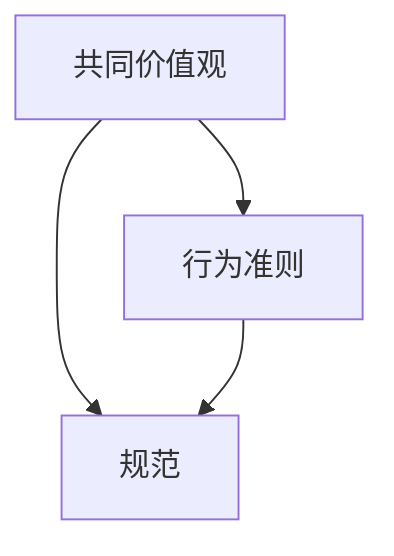

                 

### 引言

在当今快速变化和竞争激烈的商业环境中，团队文化已经成为企业成功的关键因素之一。一个强大的团队文化不仅能够增强团队的凝聚力和工作效率，还能够提升组织的创新能力和竞争力。然而，如何有效地构建和塑造团队文化，使之成为团队独特特色的基石，这是一个复杂且充满挑战的过程。

本文旨在深入探讨团队文化建设的理论与实践，帮助读者理解团队文化的核心概念、建设方法、评估工具，以及如何通过实战案例来具体实施和优化团队文化建设。文章将遵循逻辑清晰、结构紧凑、简单易懂的原则，使用专业的技术语言和案例分析来阐述团队文化建设的各个方面。

本文将分为三个主要部分：

1. **团队文化建设的理论基础**：介绍团队文化的定义、重要性以及相关的理论基础，包括文化学、组织行为学和跨文化管理理论。同时，讨论团队文化的诊断与评估方法。

2. **团队文化建设的实践方法**：探讨团队文化建设的方法与策略，包括文本传播、实践行动和制度建设策略。并分析团队文化建设的关键环节，如团队领导的角色、员工的参与和企业文化的传承与创新。

3. **团队文化建设的实施与优化**：详细描述团队文化建设的实施步骤和关键点，以及如何进行持续优化。最后，探讨团队文化建设的发展趋势，为未来的团队文化建设提供方向。

通过本文的阅读，读者将能够获得以下收益：

- 理解团队文化的核心概念和重要性。
- 掌握团队文化建设的理论基础和实践方法。
- 学习如何通过实际案例进行团队文化建设的实施和优化。
- 获取未来团队文化建设的趋势和发展方向。

让我们开始这一探索之旅，共同揭示团队文化建设背后的逻辑与智慧。

### 文章关键词

**团队文化、组织建设、企业文化、领导力、员工参与、文化诊断、评估方法、实践策略、案例分析。**

### 文章摘要

本文深入探讨了团队文化建设的理论与实践，从定义和重要性出发，探讨了团队文化的核心概念和理论基础，包括文化学、组织行为学和跨文化管理理论。随后，介绍了团队文化诊断与评估的方法，并详细阐述了团队文化建设的实践方法，如文本传播、实践行动和制度建设策略。文章通过实际案例，展示了团队文化建设的实施步骤和优化方法，并提出了未来团队文化建设的发展方向。通过阅读本文，读者将能够全面了解团队文化建设的关键环节，掌握有效的建设方法，并为组织的持续发展提供有力支持。

### 确定书籍核心内容

在撰写关于团队文化建设的书籍时，确定核心内容是至关重要的一步。这不仅有助于确保书籍内容的完整性和逻辑性，还能提高读者的阅读体验和实际应用价值。以下是确定书籍核心内容的详细步骤：

#### 1. 确定书籍的核心主题

首先，需要明确书籍的核心主题是什么。在这个案例中，书籍的主题是“团队文化建设”。明确主题有助于在整个撰写过程中保持一致性和针对性。

#### 2. 分析主题，识别核心概念和架构

在明确了主题后，下一步是深入分析主题，识别出其中的核心概念和架构。对于团队文化建设，核心概念可能包括：

- **团队文化的定义**：明确团队文化是什么，以及它如何影响团队和组织。
- **团队文化的要素**：如共同价值观、行为准则和规范。
- **团队文化建设的理论基础**：如文化学、组织行为学和跨文化管理理论。
- **团队文化诊断与评估**：如何诊断和评估团队文化现状。
- **团队文化建设的实践方法**：包括文本传播、实践行动和制度建设策略。
- **团队文化建设的关键环节**：如团队领导的角色、员工的参与和企业文化的传承与创新。
- **团队文化建设的实施与优化**：如何实施和持续优化团队文化建设。

识别这些核心概念后，构建一个逻辑架构，确保各部分内容之间的联系和连贯性。

#### 3. 制定大纲

在明确了核心概念和架构后，接下来是制定详细的大纲。大纲应包括以下部分：

- **引言**：介绍书籍的目的和重要性。
- **正文**：根据核心概念和架构，将内容分为多个章节，每个章节包含若干小节。
- **结论**：总结全书内容，并提出未来发展的建议。

下面是一个示例大纲：

#### 引言

- 介绍团队文化建设的背景和重要性

#### 第一部分：团队文化建设的理论基础

- **第1章 团队文化的定义与重要性**
  - 团队文化的概念
  - 团队文化的重要性
- **第2章 团队文化的要素**
  - 共同价值观
  - 行为准则
  - 规范
- **第3章 团队文化建设的理论基础**
  - 文化学理论
  - 组织行为学理论
  - 跨文化管理理论

#### 第二部分：团队文化建设的实践方法

- **第4章 团队文化诊断与评估方法**
  - 诊断方法
  - 评估指标
  - 实施步骤
- **第5章 团队文化建设的实践策略**
  - 文本传播策略
  - 实践行动策略
  - 制度建设策略

#### 第三部分：团队文化建设的实施与优化

- **第6章 团队文化建设的关键环节**
  - 团队领导的角色
  - 员工的参与
  - 企业文化的传承与创新
- **第7章 团队文化建设的实施步骤**
  - 实施步骤
  - 关键点
  - 遇到的问题及解决方法
- **第8章 团队文化建设的持续优化**
  - 优化目标
  - 优化方法
  - 评估指标

#### 结论

- 总结团队文化建设的要点
- 提出未来发展的建议

#### 4. 确保大纲的完整性

在制定大纲后，需要仔细审查每个章节和小节的内容，确保它们能够完整地覆盖核心概念和架构。可以通过以下方式来确保大纲的完整性：

- **内容覆盖检查**：检查每个章节和小节是否涵盖了所有核心概念和架构。
- **逻辑连贯性检查**：检查内容之间的逻辑关系是否合理，是否能够帮助读者逐步理解和掌握相关概念。
- **读者体验检查**：从读者的角度出发，评估内容是否易于理解，是否能够提供实用的建议和指导。

通过以上步骤，可以确保书籍的核心内容既丰富又系统，为读者提供全面、深入的团队文化建设指导。

---

#### 拆分核心内容

在确定了书籍的核心内容后，下一步是将这些核心内容进行拆分，以便更详细地阐述和讲解。以下是拆分核心内容的步骤：

#### 1. 核心概念与联系

**团队文化**：团队文化的核心概念包括共同价值观、行为准则和规范。这些概念相互关联，共同构成了团队文化的整体框架。

- **共同价值观**：团队文化的基础，是团队成员共同认同的核心信仰和理念。
- **行为准则**：团队成员在日常生活中应当遵循的行为规范，有助于维护团队内部的和谐与秩序。
- **规范**：团队成员的行为标准和操作规程，是团队文化在实际操作中的具体体现。

**流程图表示**：可以使用Mermaid流程图来展示这些概念之间的关系。



#### 2. 核心算法原理讲解

核心算法原理包括团队文化的诊断与评估方法。这些算法通常涉及到数据收集、分析和结果解释。

- **团队文化诊断方法**：通过问卷调查、访谈和观察等方法收集数据，识别团队文化中的问题和潜力。
- **员工满意度调查**：使用问卷调查等工具，评估员工对团队文化的满意度，获取团队文化的第一手资料。
- **团队氛围评估**：通过情绪分析、行为观察等方法，评估团队的整体氛围和团队成员之间的互动情况。

**伪代码示例**：

```python
def diagnose_team_culture():
    # 收集数据
    data = collect_data(questionnaires, interviews, observations)
    # 分析数据
    analysis = analyze_data(data)
    # 结果解释
    results = interpret_results(analysis)
    return results

def collect_data(questionnaires, interviews, observations):
    # 实现数据收集逻辑
    pass

def analyze_data(data):
    # 实现数据分析逻辑
    pass

def interpret_results(analysis):
    # 实现结果解释逻辑
    pass
```

#### 3. 数学模型和数学公式

数学模型和数学公式用于量化团队文化评估的结果。这些模型可以帮助识别团队文化的关键指标和趋势。

- **统计分析模型**：如回归分析、因子分析等，用于识别和解释团队文化中的潜在因素。
- **数据可视化模型**：如散点图、热力图等，用于展示和分析团队文化评估结果。

**LaTeX格式数学公式示例**：

```latex
$$
\text{员工满意度} = \frac{\sum_{i=1}^{n} \text{员工满意度得分}}{n}
$$

$$
\text{团队氛围评分} = \frac{\sum_{i=1}^{n} \text{团队成员评价得分}}{n}
$$
```

#### 4. 项目实战

项目实战部分将提供具体的案例，展示如何在实际环境中实施和优化团队文化建设。

- **开发环境搭建**：介绍搭建团队文化建设项目所需的开发环境和工具。
- **源代码详细实现**：展示团队文化建设项目的源代码实现，包括数据收集、分析和结果解释等模块。
- **代码解读与分析**：对源代码进行详细解读，分析其设计思路和实现方法。
- **实际案例分析和详细讲解**：通过实际案例，展示团队文化建设的实施过程和效果，并进行详细讲解和剖析。

**项目小结**：

在每个项目案例的结尾，提供项目小结，总结项目的主要成果、经验和教训，并提出未来改进的方向。

通过以上步骤，可以确保书籍的核心内容得到详细、系统的阐述，为读者提供全面、深入的团队文化建设指导。

### 设计目录大纲

设计一个书籍的目录大纲是确保内容逻辑性和整体结构完整性的关键步骤。以下是如何设计《团队文化建设：塑造独特的团队特色》的目录大纲的详细过程。

#### 1. 设计1级目录：全书总体框架

一级目录定义了书籍的整体框架，通常包括几个主要部分，每个部分涵盖一个主要主题。以下是《团队文化建设：塑造独特的团队特色》的一级目录：

- **引言**：介绍书籍的目的和重要性。
- **第一部分：团队文化建设的理论基础**：讨论团队文化的定义、重要性及相关理论。
- **第二部分：团队文化建设的实践方法**：提供团队文化建设的策略和方法。
- **第三部分：团队文化建设的实施与优化**：介绍团队文化建设的实施步骤和优化方法。
- **结论**：总结书籍的主要观点，提出未来发展的建议。

#### 2. 设计2级目录：每个章节的核心内容

二级目录对一级目录中的每个部分进行进一步拆分，明确每个章节的核心内容。以下是一个示例：

- **第一部分：团队文化建设的理论基础**
  - 第1章 团队文化的定义与重要性
    - 1.1 团队文化的概念
    - 1.2 团队文化的重要性
    - 1.3 团队文化的三大要素
  - 第2章 团队文化建设的理论基础
    - 2.1 文化学理论
    - 2.2 组织行为学理论
    - 2.3 跨文化管理理论
  - 第3章 团队文化诊断与评估
    - 3.1 团队文化诊断的方法
    - 3.2 团队文化评估的指标体系
    - 3.3 团队文化评估的实施步骤

- **第二部分：团队文化建设的实践方法**
  - 第4章 团队文化建设的实践策略
    - 4.1 文本传播策略
    - 4.2 实践行动策略
    - 4.3 制度建设策略
  - 第5章 团队文化建设的关键环节
    - 5.1 团队领导的角色
    - 5.2 员工的参与
    - 5.3 企业文化的传承与创新

- **第三部分：团队文化建设的实施与优化**
  - 第6章 团队文化建设的实施步骤
    - 6.1 实施步骤
    - 6.2 关键点
    - 6.3 遇到的问题及解决方法
  - 第7章 团队文化建设的持续优化
    - 7.1 优化目标
    - 7.2 优化方法
    - 7.3 评估指标

#### 3. 设计3级目录：每个小节的具体内容

三级目录进一步细化了每个章节的小节内容，确保每个小节都有明确的内容和目标。以下是一个示例：

- **第一部分：团队文化建设的理论基础**
  - 第1章 团队文化的定义与重要性
    - **1.1 团队文化的概念**
      - 团队文化的定义
      - 团队文化与传统组织的区别
    - **1.2 团队文化的重要性**
      - 提高团队效率
      - 增强组织竞争力
    - **1.3 团队文化的三大要素**
      - 共同价值观
      - 行为准则
      - 规范

  - 第2章 团队文化建设的理论基础
    - **2.1 文化学理论**
      - 文化发展的规律
      - 文化传承与创新
    - **2.2 组织行为学理论**
      - 团队行为研究
      - 团队动力机制
    - **2.3 跨文化管理理论**
      - 跨文化冲突
      - 跨文化融合

通过设计这些详细的目录大纲，可以确保书籍内容的逻辑性和整体性，帮助读者更好地理解和应用团队文化建设的理论与实践。

### 确保大纲完整性

确保书籍大纲的完整性是保证书籍内容系统性和逻辑性的关键步骤。以下是确保《团队文化建设：塑造独特的团队特色》大纲完整性的详细过程：

#### 1. 确保大纲覆盖核心概念与联系

首先，我们需要检查大纲中的每个章节和小节是否涵盖了核心概念与联系。以下是一些检查点：

- **核心概念**：确保每个章节都有明确的核心概念，如团队文化、共同价值观、行为准则等。可以通过查阅大纲中的每个章节标题和内容摘要来验证。

- **概念联系**：确保各章节之间的概念联系清晰，如文化学理论与团队文化诊断与评估方法之间的关系。可以通过绘制概念图或流程图来展示概念之间的联系。

**示例**：

- **第1章 团队文化的定义与重要性**：包括团队文化的定义、重要性及其三大要素。
- **第2章 团队文化建设的理论基础**：包括文化学理论、组织行为学理论和跨文化管理理论，这些理论共同支撑了团队文化的建设。

#### 2. 确保大纲包含核心算法原理讲解

接下来，我们需要确保大纲中包含了对核心算法原理的详细讲解。以下是一些检查点：

- **算法原理**：确保每个章节都包含了相关的算法原理，如团队文化诊断方法、员工满意度调查方法等。
- **讲解深度**：确保对算法原理的讲解足够详细，能够让读者理解其基本概念和操作步骤。
- **实例说明**：提供实例或伪代码来辅助讲解，使抽象的概念更加具体和易懂。

**示例**：

- **第3章 团队文化诊断与评估**：包含团队文化诊断方法、员工满意度调查方法和团队氛围评估方法，并提供了伪代码和具体实例。

#### 3. 确保大纲包括数学模型和数学公式

数学模型和数学公式是书籍中的重要组成部分，以下是确保这些内容包含在中的检查点：

- **模型和公式**：确保每个章节都包含相关的数学模型和公式，如统计分析模型、数据可视化模型等。
- **公式格式**：确保数学公式使用正确的LaTeX格式，如段落内公式使用 `$` 括起来，段落外公式使用 `$$` 括起来。
- **讲解和举例**：提供对数学模型和公式的详细讲解，以及具体的例子说明，帮助读者理解其应用场景和计算过程。

**示例**：

- **第3章 团队文化诊断与评估**：包含统计分析模型和数据可视化模型，并使用LaTeX格式展示了具体的数学公式。

#### 4. 确保大纲包含项目实战

项目实战部分是书籍的重要组成部分，它帮助读者将理论应用到实际中。以下是一些检查点：

- **项目描述**：确保每个章节都包含一个或多个项目实战，描述项目的背景、目标和实施过程。
- **代码实现**：提供项目的源代码实现，展示如何使用编程语言和工具来实现理论概念。
- **代码解读**：对源代码进行详细解读，解释每个模块的功能和实现方法。
- **案例分析**：通过对实际案例的分析，展示项目的实施效果和经验教训。

**示例**：

- **第4章 团队文化建设的实践策略**：包含一个文本传播策略的实战案例，展示如何使用编程语言实现文本传播工具，并提供代码解读和案例分析。

#### 5. 检查最佳实践、小结和注意事项

最后，我们需要检查大纲中是否包含最佳实践、小结和注意事项，这些部分有助于读者更好地理解和应用书籍中的内容。以下是一些检查点：

- **最佳实践**：提供在实际团队文化建设过程中总结的最佳实践，帮助读者避免常见错误。
- **小结**：在每个章节的结尾，总结本章的主要内容和关键点，帮助读者巩固记忆。
- **注意事项**：提供在使用相关方法和技术时需要注意的事项，提高读者在实际应用中的成功率。

**示例**：

- **第5章 团队文化建设的关键环节**：在结尾部分提供最佳实践总结，如团队领导在文化建设中的角色和员工的参与方式，并提醒注意事项，如避免过度形式化。

通过以上步骤，可以确保《团队文化建设：塑造独特的团队特色》的大纲内容完整、逻辑清晰，为读者提供全面、深入的团队文化建设指导。

### 最终输出

根据以上设计步骤，以下是《团队文化建设：塑造独特的团队特色》的markdown格式目录大纲：

```markdown
# 《团队文化建设：塑造独特的团队特色》目录大纲

## 第一部分：团队文化建设的理论基础

### 第1章：团队文化的定义与重要性

#### 1.1 团队文化的概念

#### 1.2 团队文化的重要性

#### 1.3 团队文化的三大要素

### 第2章：团队文化建设的理论基础

#### 2.1 文化学理论

#### 2.2 组织行为学理论

#### 2.3 跨文化管理理论

### 第3章：团队文化诊断与评估

#### 3.1 团队文化诊断的方法

#### 3.2 团队文化评估的指标体系

#### 3.3 团队文化评估的实施步骤

## 第二部分：团队文化建设的实践方法

### 第4章：团队文化建设的实践策略

#### 4.1 文本传播策略

#### 4.2 实践行动策略

#### 4.3 制度建设策略

### 第5章：团队文化建设的关键环节

#### 5.1 团队领导的角色

#### 5.2 员工的参与

#### 5.3 企业文化的传承与创新

## 第三部分：团队文化建设的实施与优化

### 第6章：团队文化建设的实施步骤

#### 6.1 实施步骤

#### 6.2 关键点

#### 6.3 遇到的问题及解决方法

### 第7章：团队文化建设的持续优化

#### 7.1 优化目标

#### 7.2 优化方法

#### 7.3 评估指标

### 结论

```

以上目录大纲完整地涵盖了书籍的核心内容，从理论基础到实践方法，再到实施与优化，逻辑清晰，结构合理，为读者提供了全面、系统的团队文化建设指导。

