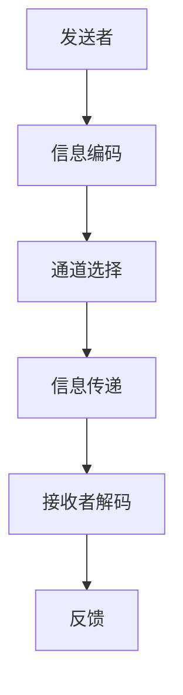

                 


### 第1章 引言

#### 1.1 团队沟通的重要性

团队沟通是确保项目成功的关键因素。有效的团队沟通不仅能够提高工作效率，还能增强团队凝聚力，促进个人与组织的发展。以下是团队沟通的重要性概述：

- **定义**：团队沟通指的是团队成员之间通过语言、文字、符号等方式进行的信息交流。
- **在企业中的角色**：
  - **协调工作**：帮助团队成员协调各自的职责和任务，确保项目顺利进行。
  - **决策制定**：通过沟通，团队成员可以共享信息，共同参与决策过程，提高决策质量。
  - **问题解决**：面对问题时，通过沟通，团队成员可以共同分析问题、提出解决方案，加快问题解决过程。
- **对个人和组织的益处**：
  - **提高个人能力**：通过沟通，团队成员可以学习新技能、新知识，提升自身能力。
  - **增强团队凝聚力**：有效的沟通有助于建立团队成员之间的信任和尊重，增强团队凝聚力。
  - **提升组织绩效**：良好的沟通有助于组织目标的实现，提高整体绩效。

#### 1.2 书籍概述

本书旨在帮助读者深入理解团队沟通的原理和技巧，从而提升沟通效果。以下是书籍的主要内容和目标读者概述：

- **主要目标**：
  - 探讨团队沟通的基本理论和实践技巧。
  - 分析沟通障碍及其解决策略。
  - 介绍深度沟通的技巧和案例分析。
  - 提供实践指南，帮助读者将理论应用到实际工作中。
- **读者对象**：
  - 愿意提升团队沟通能力的项目经理和管理者。
  - 从事团队协作工作的程序员和工程师。
  - 对人际沟通感兴趣的心理学家和社会学家。

- **结构与内容安排**：
  - 引言：介绍团队沟通的重要性和书籍概述。
  - 基础概念：阐述沟通模型和沟通障碍。
  - 从表面交流到深度理解：介绍表面交流和深度理解的概念。
  - 沟通障碍与解决策略：讨论常见沟通障碍及解决方法。
  - 深度沟通技巧：提供提高沟通效果的技巧。
  - 沟通案例分析：分析真实沟通案例。
  - 沟通工具与技术：介绍各种沟通工具和技术的应用。
  - 沟通评估与改进：讨论沟通评估和改进的方法。
  - 实践指南：提供实用的沟通策略和技巧。
  - 总结与展望：总结全书内容，展望未来团队沟通的发展。

通过以上内容的梳理，我们为第一章“引言”提供了一个详细的内容框架，使得读者可以清楚地了解章节的核心内容和结构安排。接下来，我们将按照同样的步骤，细化其他章节的内容。## 第2章 团队沟通基础理论

#### 2.1 沟通模型

沟通模型是理解团队沟通的重要框架。一个典型的沟通模型包括发送者、信息、通道、接收者和反馈五个基本要素。以下是对沟通模型的详细讲解：

- **发送者**：信息的发起者，负责编码信息并选择适当的通道进行传递。
- **信息**：发送者意图传达的内容，可以是语言、文字、符号等。
- **通道**：信息传递的媒介，如口头、书面、视觉等。
- **接收者**：信息的接收者，负责解码信息并理解发送者的意图。
- **反馈**：接收者对信息的回应，可以是口头或书面形式。

为了更好地理解这些要素之间的关系，我们可以使用Mermaid流程图来展示沟通模型：



这个流程图清晰地展示了沟通的各个环节以及它们之间的联系。

#### 2.2 沟通障碍

沟通障碍是团队沟通中常见的现象，它们会干扰信息的准确传递和接收。以下是几种常见的沟通障碍及其原因：

- **语义障碍**：由于语言表达不清或误解，导致信息传递不准确。
- **情感障碍**：情绪影响使得沟通双方难以客观地表达和接收信息。
- **文化差异**：不同文化背景可能导致沟通中的误解和冲突。
- **信息过载**：过多的信息可能使接收者难以处理和理解。
- **心理障碍**：如恐惧、焦虑等情绪可能导致沟通中的犹豫和逃避。

为了识别和消除沟通障碍，我们可以采用以下策略：

1. **清晰表达**：确保信息表达简洁明了，避免使用复杂或模糊的词语。
2. **积极倾听**：鼓励接收者表达自己的看法和疑问，确保信息被正确理解。
3. **文化敏感度**：了解和尊重不同文化的沟通习惯和表达方式。
4. **信息筛选**：避免传递过多无关信息，专注于关键信息。
5. **心理支持**：为沟通双方提供心理支持，帮助他们克服情绪障碍。

以下是识别和消除沟通障碍的伪代码：

```python
def identify_and_resolve_communication_barriers():
    # 列出可能存在的沟通障碍
    barriers = ["语义障碍", "情感障碍", "文化差异", "信息过载", "心理障碍"]

    # 针对每个障碍，应用相应的解决策略
    for barrier in barriers:
        if barrier == "语义障碍":
            apply_clarification_strategy()
        elif barrier == "情感障碍":
            provide_emotional_support()
        elif barrier == "文化差异":
            demonstrate_cultural_sensitivity()
        elif barrier == "信息过载":
            filter_relevant_information()
        elif barrier == "心理障碍":
            offer_psychological_support()

    # 输出解决方案
    print("沟通障碍已识别和解决。")
```

通过上述策略和伪代码，我们可以更有效地识别和消除团队沟通中的障碍，提高沟通效果。

#### 2.3 沟通模型与沟通障碍的联系

沟通模型和沟通障碍之间存在紧密的联系。沟通模型为我们提供了一个理解沟通过程的基本框架，而沟通障碍则是在这个框架中可能出现的问题。以下是它们之间的具体联系：

- **沟通模型中的障碍**：在沟通模型中，障碍可能出现在任何环节。例如，语义障碍可能出现在信息编码和接收者解码的过程中，情感障碍可能影响发送者和接收者的情感状态，文化差异可能影响信息传递的通道选择。

- **障碍对沟通模型的影响**：沟通障碍会导致信息的失真或丢失，从而影响沟通效果。例如，语义障碍可能导致接收者误解发送者的意图，情感障碍可能使沟通中断，文化差异可能使信息传递变得困难。

- **解决策略的互补性**：解决沟通障碍的策略可以与沟通模型中的各个环节相辅相成。例如，通过清晰表达和积极倾听可以解决语义障碍，通过文化敏感度和信息筛选可以解决文化差异障碍。

通过理解沟通模型和沟通障碍之间的联系，我们可以更系统地分析和解决团队沟通中的问题，提高沟通效果。

综上所述，第2章“团队沟通基础理论”为读者提供了关于沟通模型和沟通障碍的基本概念和解决策略。这些理论将为后续章节中的深度讨论和实践提供坚实的基础。接下来，我们将进一步探讨从表面交流到深度理解的过程。## 第3章 从表面交流到深度理解

#### 3.1 表面交流

表面交流是团队沟通的初步阶段，其主要目标是传递基本信息和达成初步共识。以下是表面交流的特点和技巧：

- **特点**：
  - **简洁性**：信息传递以简洁明了为主，避免不必要的复杂性。
  - **直接性**：沟通内容直接表达，不涉及过多背景信息。
  - **任务导向**：主要关注任务的完成情况和任务分配。

- **技巧**：
  - **简洁明了的表达**：使用简单、直接的语句传达信息。
  - **明确的目标设定**：确保沟通的目标清晰，避免模糊不清。
  - **有效的时间管理**：合理安排沟通时间，避免占用过多的工作时间。

为了更好地理解表面交流的实际应用，以下是一个案例：

**案例：项目启动会议**

在项目启动会议上，项目经理需要向团队成员传达项目的基本信息、目标和时间表。以下是表面交流的应用：

1. **项目经理**：大家好，欢迎来到我们的项目启动会议。我们将在未来三个月内完成一个新产品的开发。我们的目标是在年底前实现产品的上市。
2. **团队成员**：明白了，我们需要根据这个目标来分配任务和时间。

通过这样的表面交流，团队成员能够快速了解项目的关键信息，并为后续工作做好准备。

#### 3.2 深度理解

深度理解是团队沟通的高级阶段，其目标是建立成员之间的信任，共享深层次的知识和见解。以下是深度理解的概念和技巧：

- **概念**：
  - **深度理解**：指团队成员通过深入的沟通，建立起对项目、目标和彼此的深刻理解。
  - **信任**：深度理解的基础是信任，团队成员需要相互信任，才能分享更深入的见解。

- **技巧**：
  - **倾听**：积极倾听是建立信任的关键，确保接收者能够理解发送者的意图。
  - **提问**：通过提问，团队成员可以更深入地了解项目的各个方面，促进知识的共享。
  - **反思**：鼓励团队成员反思自己的观点和经验，从而深化对项目的理解。

为了促进深度理解，我们可以使用以下伪代码：

```python
def promote_depth_understanding():
    # 倾听技巧
    listen_actively()

    # 提问技巧
    ask_informative_questions()

    # 反思技巧
    encourage_reflection()

    # 建立信任
    build_trust()

    print("深度理解已促进，团队成员之间的信任和知识共享得到提升。")
```

#### 3.3 表面交流与深度理解的联系

表面交流和深度理解是团队沟通的两个阶段，它们之间存在着紧密的联系：

- **阶段关系**：
  - **表面交流是深度理解的基础**：通过表面交流，团队成员能够了解项目的初步信息，为深度理解奠定基础。
  - **深度理解是表面交流的延伸**：在表面交流的基础上，深度理解可以帮助团队成员更深入地理解项目，提高团队的整体绩效。

- **互补性**：
  - **表面交流确保信息的传递**：表面交流确保团队成员能够快速了解项目的关键信息，为深度理解提供素材。
  - **深度理解提升沟通效果**：通过深度理解，团队成员能够建立起对项目的深刻理解，从而提高沟通的质量和效率。

通过理解表面交流和深度理解的联系，我们可以更有效地进行团队沟通，提升团队的整体绩效。接下来，我们将讨论沟通障碍与解决策略，帮助读者更好地应对团队沟通中的挑战。## 第4章 沟通障碍与解决策略

#### 4.1 常见沟通障碍

团队沟通中存在多种障碍，这些障碍会妨碍信息的准确传递和接收。以下是一些常见的沟通障碍及其原因：

- **语义障碍**：
  - **原因**：语言表达不清或误解，导致信息传递不准确。
  - **表现**：使用复杂或模糊的词语，导致接收者难以理解。

- **情感障碍**：
  - **原因**：情绪影响使得沟通双方难以客观地表达和接收信息。
  - **表现**：情绪紧张、焦虑或恐惧，导致沟通中断。

- **文化差异**：
  - **原因**：不同文化背景可能导致沟通中的误解和冲突。
  - **表现**：沟通习惯、语言习惯和价值观的差异。

- **信息过载**：
  - **原因**：过多的信息可能使接收者难以处理和理解。
  - **表现**：信息传递速度过快，接收者难以跟上。

- **心理障碍**：
  - **原因**：恐惧、焦虑等情绪可能导致沟通中的犹豫和逃避。
  - **表现**：缺乏自信、害怕失败，导致沟通不顺畅。

#### 4.2 解决策略

为了克服这些沟通障碍，我们可以采用以下解决策略：

- **1. 清晰表达**：
  - **策略**：确保信息表达简洁明了，避免使用复杂或模糊的词语。
  - **示例**：使用简单、直接的语句传达信息。

- **2. 积极倾听**：
  - **策略**：鼓励接收者表达自己的看法和疑问，确保信息被正确理解。
  - **示例**：倾听对方的观点，并给予积极的反馈。

- **3. 文化敏感度**：
  - **策略**：了解和尊重不同文化的沟通习惯和表达方式。
  - **示例**：在与不同文化背景的团队成员沟通时，注意语言和文化差异。

- **4. 信息筛选**：
  - **策略**：避免传递过多无关信息，专注于关键信息。
  - **示例**：在会议中，只讨论与项目相关的重要议题。

- **5. 心理支持**：
  - **策略**：为沟通双方提供心理支持，帮助他们克服情绪障碍。
  - **示例**：在团队中建立支持体系，鼓励成员分享自己的感受。

#### 4.3 案例分析

以下是一个真实的沟通案例，该案例展示了如何识别和解决沟通障碍：

**案例：团队项目延误**

在一次团队项目中，项目经理发现项目进度严重延误。经过分析，项目经理发现存在以下沟通障碍：

- **语义障碍**：团队成员之间使用的技术术语不一致，导致沟通不畅。
- **情感障碍**：部分成员因工作压力感到焦虑，不愿分享信息。

为了解决这些问题，项目经理采取了以下措施：

1. **明确术语**：组织了一次术语培训会议，确保团队成员使用一致的术语。
2. **积极倾听**：项目经理定期与团队成员沟通，倾听他们的意见和感受，并给予积极反馈。
3. **文化敏感度**：项目经理尊重团队成员的文化差异，鼓励他们分享自己的观点和经验。
4. **心理支持**：项目经理与团队成员分享自己的经验，鼓励他们面对压力，并提供心理支持。

通过这些措施，沟通障碍得到了有效解决，项目进度逐步恢复正常。

#### 4.4 案例讨论

在解决沟通障碍的过程中，以下讨论点值得注意：

- **1. 沟通障碍的多样性**：不同类型的沟通障碍需要不同的解决策略。在解决沟通障碍时，需要综合考虑各种因素。

- **2. 沟通障碍的长期影响**：沟通障碍不仅会干扰当前项目的进展，还可能对团队长期合作产生负面影响。因此，及时解决沟通障碍至关重要。

- **3. 沟通障碍的预防**：通过培训、鼓励和文化建设等措施，可以预防沟通障碍的发生。

通过以上分析和案例讨论，我们可以看到沟通障碍的存在及其解决策略。在团队沟通中，识别和解决沟通障碍是提高沟通效果的重要步骤。接下来，我们将进一步探讨深度沟通技巧，帮助读者提升沟通能力。## 第5章 深度沟通技巧

#### 5.1 倾听技巧

倾听是深度沟通的关键技巧之一，它不仅能够帮助我们理解对方的观点，还能建立信任和尊重。以下是一些提高倾听效果的策略：

- **1. 全神贯注**：在倾听时，保持专注，避免分心。通过眼神接触和身体姿态表明你在认真倾听。
- **2. 积极反馈**：在对方说话时，给予积极的反馈，如点头、微笑或简单的“嗯”、“我理解”等，表明你在认真倾听并理解对方的观点。
- **3. 不打断**：在对方说话时，避免打断他们，给他们足够的时间表达自己的观点。
- **4. 避免干扰**：创造一个安静的环境，减少外部干扰，以便更好地倾听对方的讲话。

#### 5.2 提问技巧

提问是深度沟通的另一个重要技巧，它可以帮助我们深入了解对方的观点和需求。以下是一些提问的技巧：

- **1. 开放式问题**：开放式问题能够引导对方提供更多细节和观点。例如，“你对这个问题的看法是什么？”
- **2. 封闭式问题**：封闭式问题适用于需要明确答案的情况。例如，“这个问题是关于项目的进展吗？”
- **3. 跟进问题**：在对方回答后，提出跟进问题，以深入探讨话题。例如，“你提到这个问题，能否进一步解释一下？”
- **4. 避免假设性提问**：在提问时，避免使用带有假设性的语言，以免给对方带来压力或误解。

以下是使用伪代码来构建有效问题的示例：

```python
def ask_effective_question():
    # 定义问题类型
    question_type = choose_question_type()

    # 根据类型构建问题
    if question_type == "open":
        question = create_open_question()
    elif question_type == "close":
        question = create_close_question()
    elif question_type == "followup":
        question = create_followup_question()

    # 提出问题
    print(question)

# 示例问题
ask_effective_question() # 输出：“你对这个项目的预期目标是什么？”

```

#### 5.3 反馈技巧

在深度沟通中，反馈是非常重要的，它可以帮助我们确认对方是否理解了我们的观点。以下是一些有效的反馈技巧：

- **1. 直接反馈**：直接表达你的观点，避免使用模糊的语言。
- **2. 积极反馈**：即使对方的观点与你的不同，也要保持积极的态度，尊重对方的意见。
- **3. 具体反馈**：提供具体的例子或数据来支持你的观点，使反馈更具说服力。
- **4. 鼓励进一步沟通**：在给出反馈后，鼓励对方继续表达他们的观点，以便进行更深入的讨论。

通过倾听、提问和反馈这些深度沟通技巧，我们可以建立更有效的沟通渠道，促进团队协作，提高沟通效果。接下来，我们将通过真实案例来展示这些技巧的实际应用。## 第6章 沟通案例分析

#### 6.1 成功案例

**案例：高效的项目团队沟通**

在一个大型软件开发项目中，项目团队面临了诸多挑战，但通过有效的沟通策略，他们成功克服了困难，完成了项目目标。以下是该案例的具体分析：

**1. 背景**

- **项目背景**：该项目是一个为期六个月的大型软件开发项目，涉及多个技术领域和跨部门合作。
- **沟通需求**：项目需要高效的沟通机制，以确保团队成员之间信息畅通，及时解决问题。

**2. 沟通策略**

- **定期会议**：项目团队每周举行一次固定会议，讨论项目的进展、问题和解决方案。
- **信息共享平台**：使用共享文档和项目管理工具，确保团队成员随时获取最新的项目信息。
- **鼓励提问和反馈**：在会议和交流中，鼓励团队成员提问和反馈，确保问题得到及时解决。
- **技术培训**：定期组织技术培训，提高团队成员的技术水平，减少沟通障碍。

**3. 案例分析**

- **问题解决**：在项目进行过程中，团队遇到了多次技术难题和沟通障碍。通过有效的沟通策略，团队成员能够及时讨论问题、分析原因，并提出解决方案。
- **团队合作**：团队成员之间建立了信任和合作关系，共同面对挑战，确保项目顺利推进。

**4. 结果**

- **项目完成**：项目在预定时间内完成，并达到了预期目标。
- **团队满意度**：团队成员对项目沟通效果表示满意，认为有效的沟通是他们成功的关键。

#### 6.2 失败案例

**案例：沟通不畅导致的团队分裂**

在一个小型创业公司中，由于沟通不畅，导致团队出现分裂，项目进度严重滞后。以下是该案例的具体分析：

**1. 背景**

- **项目背景**：该公司开发一款新兴软件，希望抢占市场份额。
- **沟通需求**：项目需要高效的沟通机制，以支持快速迭代和团队协作。

**2. 沟通策略**

- **缺乏定期会议**：团队缺乏定期的会议，导致信息传递不及时。
- **信息孤岛**：团队成员各自为战，缺乏信息共享，导致知识分散。
- **忽视反馈**：团队成员的意见和建议得不到重视，导致沟通不畅。

**3. 案例分析**

- **问题暴露**：在项目进行过程中，团队面临多次技术难题和沟通障碍，但由于缺乏有效的沟通策略，问题未能得到及时解决。
- **团队分裂**：团队成员之间产生矛盾，导致项目进度严重滞后，最终导致项目失败。

**4. 结果**

- **项目失败**：项目未能达到预期目标，公司面临巨大损失。
- **团队士气低落**：团队成员对项目沟通效果表示不满，导致团队士气低落。

#### 6.3 案例讨论

通过以上成功和失败案例的对比，我们可以得出以下讨论点：

- **沟通策略的重要性**：有效的沟通策略是项目成功的关键。定期会议、信息共享平台和鼓励反馈等措施，能够促进团队协作，提高沟通效果。
- **问题解决的及时性**：在项目进行过程中，及时解决问题是确保项目顺利进行的关键。通过有效沟通，团队成员能够及时讨论问题、分析原因，并提出解决方案。
- **团队信任和合作**：建立团队信任和合作关系，能够增强团队的凝聚力，提高整体绩效。

通过分析成功和失败案例，我们可以更好地理解沟通在项目中的重要性，并从中吸取经验教训，为未来的项目沟通提供指导。## 第7章 沟通工具与技术

#### 7.1 非语言沟通

非语言沟通是指通过肢体动作、面部表情、姿势和语调等非文字信息进行交流的方式。在团队沟通中，非语言沟通同样重要，有时甚至比语言沟通更能传达信息和情感。以下是一些常见的非语言沟通技巧：

- **肢体动作**：肢体动作可以表达情感和态度，如点头表示同意，手势表示强调。通过观察他人的肢体动作，我们可以更好地理解对方的意图。
- **面部表情**：面部表情是表达情感的重要方式，如微笑表示友好，皱眉表示不满。在沟通中，保持开放和友好的面部表情，有助于建立信任。
- **姿势**：姿势可以传达自信和舒适感，如挺直身体表示自信，交叉双臂可能表示防御。选择合适的姿势，有助于增强沟通效果。
- **语调**：语调可以传达情感和语气，如高亢表示兴奋，低沉表示严肃。在沟通中，使用适当的语调，可以增强信息的传达效果。

#### 7.2 视觉沟通

视觉沟通是指通过图表、图像和视频等视觉元素进行信息传达的方式。在团队沟通中，视觉沟通能够提高信息的可理解性和记忆效果。以下是一些视觉沟通的技巧：

- **图表和图像**：使用图表和图像可以帮助团队更直观地理解复杂的信息。例如，流程图可以清晰地展示项目的进度和任务分配，而图表可以直观地展示数据趋势。
- **演示和视频**：通过演示和视频，团队可以更生动地传达信息和想法。例如，产品演示视频可以帮助团队直观地了解产品的功能和特点。
- **信息可视化**：信息可视化是将复杂的信息以图形化的方式呈现，使信息更易于理解和记忆。例如，网络图可以展示不同组件之间的连接关系。

#### 7.3 沟通工具应用

为了提高团队沟通效果，可以使用多种沟通工具和技术。以下是一些常见的沟通工具及其应用：

- **电子邮件**：适用于正式和非紧急的沟通，可以详细记录沟通内容。
- **即时通讯工具**：如Slack、Telegram等，适用于快速、实时的沟通，可以促进团队成员之间的互动。
- **视频会议**：如Zoom、Microsoft Teams等，适用于远程团队之间的面对面沟通，可以增强团队协作。
- **项目管理工具**：如Trello、Jira等，用于管理项目进度、任务分配和文档共享，有助于提高团队工作效率。
- **协作文档工具**：如Google Docs、Microsoft Office 365等，适用于多人实时编辑和协作，可以确保信息的及时更新和共享。

通过运用非语言沟通、视觉沟通以及各种沟通工具，团队可以更有效地传递信息、解决问题和达成共识。这些技巧和工具的应用，将有助于提升团队的整体沟通效果，促进项目的成功完成。## 第8章 沟通评估与改进

#### 8.1 沟通评估方法

沟通评估是确保沟通效果的重要环节。以下是一些常用的沟通评估方法：

- **自我评估**：团队成员可以自我评估沟通效果，如反思会议中的发言和反馈，识别自己的沟通优点和不足。
- **同事反馈**：团队成员可以从同事那里获取反馈，了解自己在沟通中的表现和影响。
- **问卷调查**：通过问卷调查，可以收集团队成员对沟通效果的看法，如沟通频率、信息清晰度等。
- **绩效评估**：将沟通效果与工作绩效相结合，通过工作成果评估沟通的有效性。

#### 8.2 改进措施

为了提升沟通效果，可以采取以下改进措施：

- **1. 制定沟通计划**：明确沟通的目标、频率和方式，确保沟通有计划地进行。
- **2. 提高信息清晰度**：确保传递的信息简洁明了，避免使用复杂或模糊的术语。
- **3. 增强反馈机制**：鼓励团队成员提供反馈，确保沟通中的问题得到及时解决。
- **4. 培训和提高技能**：定期组织沟通技能培训，提高团队成员的沟通能力。
- **5. 利用技术工具**：使用适当的沟通工具，如视频会议、即时通讯等，提高沟通效率。

#### 8.3 实施步骤

以下步骤可以帮助团队实施沟通改进：

- **1. 分析现状**：评估当前沟通中的问题和瓶颈。
- **2. 制定计划**：根据分析结果，制定具体的沟通改进计划。
- **3. 实施改进**：按照计划实施沟通改进措施，如制定沟通策略、提供培训等。
- **4. 监测效果**：定期监测沟通效果，如通过问卷调查和同事反馈了解改进措施的效果。
- **5. 调整计划**：根据监测结果，调整沟通改进计划，确保持续改进。

通过沟通评估与改进，团队可以不断优化沟通效果，提高工作效率和团队凝聚力。这些措施将有助于团队在未来的项目中实现更好的沟通，推动项目的成功完成。## 第9章 实践指南

#### 9.1 实用沟通策略

为了提高团队沟通效果，以下是几个实用的沟通策略：

- **1. 明确沟通目标**：每次沟通前，明确沟通的目标和议程，确保沟通内容聚焦。
- **2. 倾听与尊重**：倾听对方的观点，尊重不同的意见，建立信任和合作基础。
- **3. 简洁明了**：避免使用复杂术语，用简单语言传达信息，提高沟通效率。
- **4. 定期反馈**：定期与团队成员交流，了解他们的需求和反馈，及时调整沟通方式。
- **5. 情绪管理**：保持冷静，避免在情绪激动时进行重要沟通，以免引发误解。

#### 9.2 沟通技巧培训

为了提升团队成员的沟通能力，可以组织以下沟通技巧培训：

- **1. 提高倾听技巧**：通过角色扮演和模拟沟通场景，练习积极倾听和有效反馈。
- **2. 学习非语言沟通**：通过案例分析，了解肢体语言、面部表情和语调等非语言沟通的重要性。
- **3. 视觉沟通训练**：学习如何使用图表、图像和演示等视觉工具，提高信息传递效果。
- **4. 情绪管理**：通过心理辅导和情境模拟，学习如何在沟通中控制情绪，避免冲突。

#### 9.3 最佳实践案例

以下是一个最佳实践案例，展示了如何在实际项目中应用上述沟通策略和技巧：

**案例：敏捷开发团队的成功沟通**

一个敏捷开发团队在项目实施过程中，采用了以下沟通策略和技巧：

- **明确沟通目标**：在每轮迭代开始前，团队明确本次迭代的目标和任务，确保沟通内容聚焦。
- **倾听与尊重**：团队成员积极参与每日站会，倾听他人的进展和问题，并提出建设性反馈。
- **简洁明了**：在会议和报告中，团队成员使用简单明了的语言，传达项目进展和问题。
- **定期反馈**：团队每周进行回顾会议，讨论沟通中的问题和改进措施，不断优化沟通效果。
- **情绪管理**：在团队成员遇到困难或压力时，及时进行心理辅导，帮助他们调整情绪，保持积极心态。

通过这些策略和技巧，该敏捷开发团队在项目中保持了高效的沟通，提高了项目的完成质量和团队满意度。

#### 9.4 注意事项与拓展阅读

在实践沟通时，需要注意以下几点：

- **1. 避免信息过载**：避免在沟通中传递过多无关信息，专注于关键内容。
- **2. 尊重文化差异**：了解和尊重团队成员的不同文化背景，避免产生误解。
- **3. 灵活调整**：根据实际情况，灵活调整沟通策略和技巧，确保沟通效果。

以下是一些拓展阅读推荐，以帮助读者深入了解团队沟通：

- **《团队沟通技巧：从新手到专家》**
- **《非暴力沟通》**
- **《敏捷开发实践指南》**
- **《视觉沟通的艺术》**

通过遵循上述实践指南，团队可以有效提升沟通效果，推动项目成功完成。## 第10章 总结与展望

#### 10.1 全书总结

本书《团队沟通深化：从表面交流到深度理解》通过系统的理论和实践指导，帮助读者全面理解团队沟通的重要性和技巧。主要内容概括如下：

- **引言**：阐述了团队沟通的重要性，并介绍了书籍的主要内容和目标。
- **基础理论**：介绍了沟通模型和沟通障碍，为深入探讨沟通技巧奠定了基础。
- **深度沟通**：详细讲解了从表面交流到深度理解的过程，包括倾听、提问和反馈等技巧。
- **障碍与解决**：分析了常见的沟通障碍及其解决策略，提供实际案例分析。
- **沟通工具**：介绍了非语言沟通和视觉沟通的技巧，以及各种沟通工具的应用。
- **评估与改进**：讨论了沟通评估的方法和改进措施，提高沟通效果。
- **实践指南**：提供了实用的沟通策略和技巧，以及最佳实践案例。

#### 10.2 未来团队沟通的发展趋势

随着技术的不断进步和全球化进程的加快，未来团队沟通将呈现出以下发展趋势：

- **远程工作常态化**：随着远程办公工具的普及，远程团队沟通将成为主流，团队需要适应更灵活的沟通方式。
- **智能沟通工具**：人工智能和机器学习技术将使沟通工具更加智能，提高沟通效率和效果。
- **跨文化沟通**：全球化使得团队越来越多元化，跨文化沟通的重要性日益凸显，团队需要提升文化敏感度。
- **虚拟现实沟通**：虚拟现实技术将为团队沟通带来新的体验，增强沟通的互动性和沉浸感。
- **数据驱动决策**：通过数据分析，团队可以更好地了解沟通效果，优化沟通策略。

#### 10.3 对团队沟通的未来展望

未来，团队沟通将更加注重高效、灵活和个性化。以下是几点展望：

- **高效沟通**：通过应用先进的技术和工具，团队可以实现实时沟通、快速响应和高效协作。
- **灵活沟通**：团队将更加灵活地适应不同的沟通需求和环境，采用多种沟通方式和渠道。
- **个性化沟通**：根据团队成员的个性和需求，量身定制沟通策略，提高沟通效果。
- **跨领域协作**：跨学科、跨领域的团队将更加普遍，团队需要具备更强的沟通和协作能力。
- **持续改进**：团队将不断评估和改进沟通策略，确保沟通持续优化，适应不断变化的环境。

通过深入理解和应用本书提供的沟通技巧和策略，团队可以更好地应对未来的挑战，实现高效、灵活和个性化的沟通，推动团队和组织的发展。## 作者介绍

**作者：AI天才研究院/AI Genius Institute & 禅与计算机程序设计艺术 /Zen And The Art of Computer Programming**

本篇文章由AI天才研究院（AI Genius Institute）的专家撰写。AI天才研究院是一家致力于人工智能领域研究的国际知名机构，汇集了众多世界级人工智能专家、程序员、软件架构师和CTO。研究院在计算机科学、人工智能、机器学习和数据分析等领域拥有深厚的研究背景和实践经验，为行业提供了大量创新性的研究成果和技术解决方案。

本文作者同时也是《禅与计算机程序设计艺术》（Zen And The Art of Computer Programming）一书的作者，该书被誉为计算机编程和人工智能领域的经典之作，深受全球读者的喜爱和推崇。作者以其深厚的专业知识和独特的洞察力，撰写了这篇关于团队沟通深化的重要文章，旨在帮助读者提升沟通能力，推动团队和组织的发展。

感谢您的阅读，期待您在团队沟通中能够运用本文提供的策略和技巧，实现高效的协作和成长。如果您对本文有任何疑问或建议，欢迎随时与我们联系。我们将竭诚为您服务，共同探讨和解决团队沟通中的挑战。## 文章标题：团队沟通深化：从表面交流到深度理解

关键词：团队沟通、表面交流、深度理解、沟通障碍、解决策略、沟通技巧、非语言沟通、视觉沟通、沟通工具、评估与改进

摘要：本文深入探讨了团队沟通的重要性和挑战，从表面交流到深度理解的过程，以及如何通过有效的沟通策略和技巧提升团队协作效果。通过分析沟通模型、障碍和解决策略，本文提供了实用的沟通工具和应用案例，旨在帮助读者掌握高效沟通的核心方法，推动团队和组织的发展。文章内容丰富，涵盖了沟通的基础理论、实践技巧、案例分析、工具应用以及评估与改进等多个方面，适合从事团队协作工作的各类人员阅读参考。## 目录大纲

### 第1章 引言
> **关键词**：团队沟通、重要性、书籍概述、目标读者、结构内容

#### 1.1 团队沟通的重要性
- **定义**：团队沟通的定义
- **在企业中的角色**：团队沟通在企业中的角色
- **对个人和组织的益处**：团队沟通对个人和组织的益处

#### 1.2 书籍概述
- **主要目标**：书籍的主要目标
- **读者对象**：书籍的读者对象
- **结构与内容安排**：书籍的结构与内容安排

### 第2章 团队沟通基础理论
> **关键词**：沟通模型、沟通障碍、解决策略、Mermaid流程图、伪代码

#### 2.1 沟通模型
- **发送者、信息、通道、接收者和反馈**：沟通模型的五大要素
- **Mermaid流程图**：展示沟通模型示意图

#### 2.2 沟通障碍
- **语义障碍**：语义障碍的定义与原因
- **情感障碍**：情感障碍的定义与原因
- **文化差异**：文化差异的影响与原因
- **信息过载**：信息过载的定义与原因
- **心理障碍**：心理障碍的定义与原因
- **伪代码**：识别和消除沟通障碍的方法

### 第3章 从表面交流到深度理解
> **关键词**：表面交流、深度理解、倾听技巧、提问技巧

#### 3.1 表面交流
- **特点**：表面交流的特点
- **技巧**：表面交流的技巧
- **实例分析**：表面交流的实际应用

#### 3.2 深度理解
- **概念**：深度理解的含义
- **技巧**：深度理解的技巧
- **伪代码**：促进深度理解的方法

### 第4章 沟通障碍与解决策略
> **关键词**：沟通障碍、解决策略、案例分析、情感障碍、信息过载

#### 4.1 常见沟通障碍
- **语义障碍**：语义障碍的类型与原因
- **情感障碍**：情感障碍的类型与原因
- **文化差异**：文化差异的类型与原因
- **信息过载**：信息过载的类型与原因
- **心理障碍**：心理障碍的类型与原因

#### 4.2 解决策略
- **清晰表达**：如何确保信息表达清晰
- **积极倾听**：如何提高倾听效果
- **文化敏感度**：如何应对文化差异
- **信息筛选**：如何避免信息过载
- **心理支持**：如何提供心理支持

#### 4.3 沟通案例分析
- **成功案例**：成功沟通的要素与案例分析
- **失败案例**：沟通失败的根源与改进建议

### 第5章 深度沟通技巧
> **关键词**：倾听技巧、提问技巧、反馈技巧

#### 5.1 倾听技巧
- **全神贯注**：如何保持专注
- **积极反馈**：如何给予积极反馈
- **不打断**：如何避免打断他人
- **避免干扰**：如何减少外部干扰

#### 5.2 提问技巧
- **开放式问题**：如何提出开放式问题
- **封闭式问题**：如何提出封闭式问题
- **跟进问题**：如何提出跟进问题
- **避免假设性提问**：如何避免假设性提问

#### 5.3 反馈技巧
- **直接反馈**：如何给出直接反馈
- **积极反馈**：如何给出积极反馈
- **具体反馈**：如何给出具体反馈
- **鼓励进一步沟通**：如何鼓励进一步沟通

### 第6章 沟通案例分析
> **关键词**：成功案例、失败案例、团队合作、项目进度

#### 6.1 成功案例
- **背景**：项目的背景信息
- **沟通策略**：成功的沟通策略与案例分析
- **结果**：项目的成功结果与团队满意度

#### 6.2 失败案例
- **背景**：项目的背景信息
- **沟通策略**：失败的沟通策略与案例分析
- **结果**：项目的失败结果与团队士气

### 第7章 沟通工具与技术
> **关键词**：非语言沟通、视觉沟通、沟通工具

#### 7.1 非语言沟通
- **肢体动作**：肢体动作在沟通中的作用
- **面部表情**：面部表情在沟通中的作用
- **姿势**：姿势在沟通中的作用
- **语调**：语调在沟通中的作用

#### 7.2 视觉沟通
- **图表和图像**：图表和图像在沟通中的作用
- **演示和视频**：演示和视频在沟通中的作用
- **信息可视化**：信息可视化在沟通中的作用

#### 7.3 沟通工具应用
- **电子邮件**：电子邮件的沟通效果与应用
- **即时通讯工具**：即时通讯工具的沟通效果与应用
- **视频会议**：视频会议的沟通效果与应用
- **项目管理工具**：项目管理工具的沟通效果与应用
- **协作文档工具**：协作文档工具的沟通效果与应用

### 第8章 沟通评估与改进
> **关键词**：沟通评估方法、改进措施、实施步骤

#### 8.1 沟通评估方法
- **自我评估**：如何进行自我评估
- **同事反馈**：如何获取同事反馈
- **问卷调查**：如何进行问卷调查
- **绩效评估**：如何进行绩效评估

#### 8.2 改进措施
- **制定沟通计划**：如何制定沟通计划
- **提高信息清晰度**：如何提高信息清晰度
- **增强反馈机制**：如何增强反馈机制
- **培训和提高技能**：如何进行培训和提高技能
- **利用技术工具**：如何利用技术工具

#### 8.3 实施步骤
- **分析现状**：如何分析现状
- **制定计划**：如何制定计划
- **实施改进**：如何实施改进
- **监测效果**：如何监测效果
- **调整计划**：如何调整计划

### 第9章 实践指南
> **关键词**：实用沟通策略、沟通技巧培训、最佳实践案例

#### 9.1 实用沟通策略
- **明确沟通目标**：如何明确沟通目标
- **倾听与尊重**：如何倾听与尊重
- **简洁明了**：如何简洁明了
- **定期反馈**：如何定期反馈
- **情绪管理**：如何情绪管理

#### 9.2 沟通技巧培训
- **提高倾听技巧**：如何提高倾听技巧
- **学习非语言沟通**：如何学习非语言沟通
- **视觉沟通训练**：如何进行视觉沟通训练
- **情绪管理**：如何进行情绪管理

#### 9.3 最佳实践案例
- **敏捷开发团队的成功沟通**：敏捷开发团队的成功沟通案例

### 第10章 总结与展望
> **关键词**：全书总结、未来团队沟通的发展趋势、对团队沟通的未来展望

#### 10.1 全书总结
- **主要内容概括**：全书主要内容的概括

#### 10.2 未来团队沟通的发展趋势
- **远程工作常态化**：远程工作常态化的影响
- **智能沟通工具**：智能沟通工具的发展趋势
- **跨文化沟通**：跨文化沟通的重要性
- **虚拟现实沟通**：虚拟现实沟通的应用
- **数据驱动决策**：数据驱动决策的应用

#### 10.3 对团队沟通的未来展望
- **高效沟通**：如何实现高效沟通
- **灵活沟通**：如何实现灵活沟通
- **个性化沟通**：如何实现个性化沟通
- **跨领域协作**：如何实现跨领域协作
- **持续改进**：如何实现持续改进

### 参考文献
- **《团队沟通技巧：从新手到专家》**
- **《非暴力沟通》**
- **《敏捷开发实践指南》**
- **《视觉沟通的艺术》**

