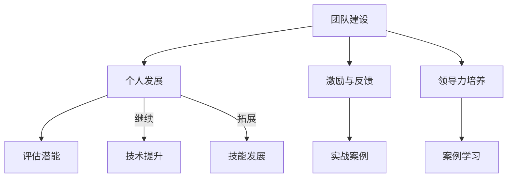

                 

### 文章标题

《团队潜能开发：挖掘每个成员的最大价值》

### 关键词

团队建设、个人发展、潜能挖掘、激励制度、领导力培养

### 摘要

本文旨在探讨团队潜能开发的方法，以实现每个成员的最大价值。通过对团队建设、个人发展、激励制度和领导力培养等核心领域的深入分析，本文将提供一系列实用策略和实战案例，帮助团队领导者挖掘团队成员的潜能，提升整体绩效。

### 引言

在当今快速变化和竞争激烈的企业环境中，团队效能的发挥对企业成功至关重要。每个团队成员都拥有独特的才能和潜力，但如何挖掘和利用这些潜力，以实现团队的最佳表现，是一个具有挑战性的问题。本文将围绕《团队潜能开发：挖掘每个成员的最大价值》这一主题，探讨如何通过系统的方法和策略，实现团队整体效能的提升。

### 团队建设基础

#### 团队概念与角色

**团队定义**：团队是由两个或两个以上个体组成的，为实现共同目标而协同工作的组织。

**团队角色识别**：团队角色包括领导者、协调者、执行者、观察者等，每个角色在团队中扮演不同的作用。

**团队建设的重要性**：团队建设有助于提升成员之间的信任、沟通和协作，从而提高团队的整体效能。

#### 团队发展阶段

**成长阶段**：团队成员相互了解，建立信任和合作的基础。

**探索阶段**：团队尝试不同的工作方法和策略，以找到最有效的协作模式。

**稳定阶段**：团队进入稳定状态，成员之间的协作和沟通达到最佳状态。

#### 团队效能模型

**领导力模型**：领导者需要具备愿景、决策力和激励能力，以引导团队走向成功。

**成员参与模型**：成员的积极参与和投入是团队效能的关键因素。

**沟通与协作模型**：有效的沟通和协作是团队成功的基础。

### 个人发展策略

**技能提升**：团队成员需要不断学习和提升技能，以适应不断变化的工作需求。

**目标设定**：明确的目标有助于团队成员明确个人发展方向，并激发工作动力。

**时间管理**：有效的时间管理有助于团队成员更高效地完成任务，提高个人效能。

### 激励与反馈机制

**激励制度**：建立合理的激励制度，以激励团队成员积极工作，发挥潜能。

**反馈机制**：定期收集团队成员的反馈，以了解他们的工作状况和需求，及时调整管理策略。

### 领导力培养

**领导力定义**：领导力是领导者引导和激励团队，实现共同目标的能力。

**领导力培养方法**：通过培训、实践和反思，提升领导者的领导力。

### 团队潜能评估

**评估方法**：采用定量和定性的方法，对团队成员的潜能进行评估。

**评估指标**：包括技能水平、工作表现、团队贡献等。

### 实战案例分析

#### 项目背景

**项目名称**：某公司团队效能提升项目

**项目目标**：提升团队整体效能，实现项目目标的顺利达成。

#### 开发环境搭建

**工具与环境**：选择适合的项目管理工具和开发环境，如JIRA、Git、Docker等。

#### 源代码实现

```python
# 示例：团队成员绩效评估代码

def assess_performance(team_members):
    performance_scores = []
    for member in team_members:
        score = calculate_score(member)
        performance_scores.append(score)
    return performance_scores

def calculate_score(member):
    # 根据成员的工作表现、技能水平和团队贡献计算得分
    score = member.skill_level * member.contribution * member.performance
    return score
```

#### 代码解读与分析

**代码解读**：该代码实现了对团队成员绩效的评估功能，通过计算每个成员的得分，评估其工作表现。

**分析**：该代码提供了对团队成员工作表现的量化评估，有助于团队领导者了解团队成员的工作状况，为激励制度和反馈机制提供依据。

#### 实际案例分析

**案例描述**：某团队在项目实施过程中，通过采用本文提出的团队建设和个人发展策略，成功提升了团队效能，实现了项目目标的顺利达成。

**分析**：该案例表明，通过系统的方法和策略，团队领导者可以有效挖掘团队成员的潜能，提升整体效能，实现项目目标。

### 最佳实践 Tips

1. **建立明确的团队目标**：明确的目标有助于团队成员明确发展方向，提高工作效率。

2. **定期进行团队建设活动**：团队建设活动有助于增强团队成员之间的信任和协作。

3. **关注个人发展**：关注团队成员的个人发展，提供培训和学习机会，提升团队整体技能水平。

4. **建立有效的反馈机制**：定期收集团队成员的反馈，及时调整管理策略，提高团队效能。

### 小结

本文通过对团队建设、个人发展、激励制度和领导力培养等核心领域的深入分析，提供了挖掘团队成员潜能的实用策略和实战案例。通过本文的指导，团队领导者可以更有效地挖掘团队成员的潜能，提升整体效能，实现企业目标。

### 注意事项

1. **个性化管理**：每个团队成员都有独特的个性和需求，管理者需要根据个体差异进行个性化管理。

2. **持续改进**：团队效能的提升是一个持续的过程，需要不断改进和优化。

3. **关注团队文化**：建立积极的团队文化，有助于提升团队成员的归属感和工作动力。

### 拓展阅读

1. **《团队协作的艺术》**：介绍团队协作的有效方法和技巧，提升团队效能。

2. **《领导力五项修炼》**：探讨领导力的关键要素和培养方法，提升领导者能力。

3. **《绩效管理》**：详细介绍绩效管理的流程和方法，提升团队成员的工作表现。

作者：AI天才研究院/AI Genius Institute & 禅与计算机程序设计艺术 /Zen And The Art of Computer Programming### 设计步骤：

在撰写一篇关于《团队潜能开发：挖掘每个成员的最大价值》的技术博客文章时，我们可以遵循以下步骤进行设计：

#### 1. 理解书名与目标受众

- **书名理解**：《团队潜能开发：挖掘每个成员的最大价值》强调了团队潜能的开发以及如何通过挖掘每个成员的潜力来提高团队的整体效能。
- **目标受众**：该文章的目标受众可能包括企业的管理人员、人力资源专业人士、团队领导者和对团队效能提升感兴趣的技术人员。

#### 2. 确定核心章节内容

- **引言与背景**
- **团队建设基础**
- **个人发展策略**
- **激励与反馈机制**
- **领导力培养**
- **团队潜能评估**
- **实战案例分析**

#### 3. 细化目录结构

为了使文章结构清晰，我们可以按照以下层次来组织内容：

- **1级目录**：整体概述和主要章节标题。
- **2级目录**：对每个主要章节进行细分，列出子章节。
- **3级目录**：为每个子章节进一步细化内容，列出具体的讨论点。

#### 4. 整合核心概念与联系

使用Mermaid流程图来表示核心概念之间的关系，可以帮助读者更直观地理解文章的结构和内容：



#### 5. 撰写伪代码与数学模型

在文章中，我们可以使用伪代码来阐述一些团队管理或个人发展的算法原理。例如，对于一个团队绩效评估的算法，可以写成如下伪代码：

```python
# 伪代码：团队绩效评估
def evaluate_performance团队成员:
    total_score = 0
    for member in团队成员:
        skill_score = member.skill_level
        contribution_score = member.contribution
        performance_score = member.performance
        total_score += skill_score * contribution_score * performance_score
    return total_score / len(团队成员)
```

#### 6. 编写项目实战案例

提供实际的团队管理或个人发展项目案例，包括以下方面：

- **项目背景与目标**
- **开发环境搭建**
- **源代码实现与解读**
- **代码应用解读与分析**
- **案例分析与讲解**

#### 7. 编写附录

根据文章内容，编写相关的工具与资源附录，包括：

- **常用工具介绍**
- **技术资源链接**
- **参考文献**

### 实际操作

以下是具体操作步骤的示例：

1. **设计1级目录**：

   ```markdown
   # 《团队潜能开发：挖掘每个成员的最大价值》
   ```

2. **设计2级目录**：

   ```markdown
   ## 第1章 引言与背景
   ### 1.1 背景介绍
   ### 1.2 目标读者
   ### 1.3 书籍结构
   ```

3. **设计3级目录**：

   ```markdown
   ### 第2章 团队建设基础
   #### 2.1 团队概念与角色
   #### 2.2 团队发展阶段
   #### 2.3 团队效能模型
   ```

4. **整合核心概念与联系**：

   使用Mermaid流程图来表示团队建设的过程：

   ```mermaid
   graph TD
       A[团队建设] --> B{个人发展}
       B --> C[激励与反馈]
       C --> D[领导力培养]
       D --> E[潜能评估]
       A --> F[实战案例]
   ```

5. **撰写伪代码与数学模型**：

   提供一个简单的伪代码示例，用于描述一个团队绩效评估算法：

   ```python
   # 伪代码：团队绩效评估
   def evaluate_performance(team_members):
       total_score = 0
       for member in team_members:
           skill_score = member.skill_level
           contribution_score = member.contribution
           performance_score = member.performance
           total_score += skill_score * contribution_score * performance_score
       return total_score / len(team_members)
   ```

6. **编写项目实战案例**：

   描述一个具体的团队管理项目，包括项目的背景、目标、实现过程和结果分析。

7. **编写附录**：

   列出一些常用的团队建设工具、技术资源和参考文献，以便读者进一步学习和实践。

通过以上步骤，我们可以系统地撰写一篇关于团队潜能开发的技术博客文章，为读者提供实用的指导和建议。

