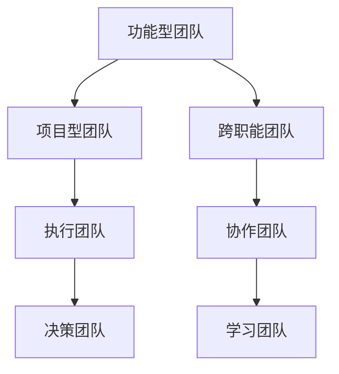
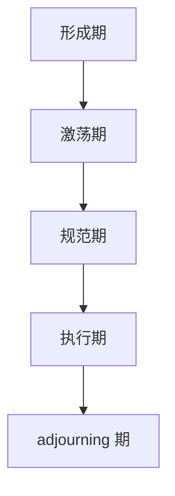
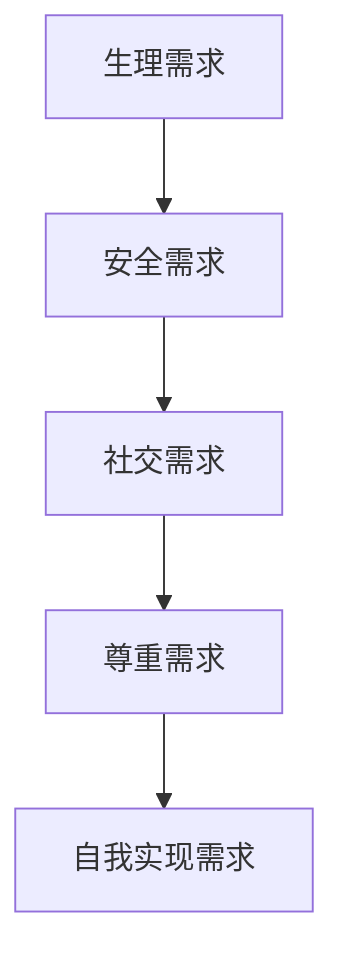
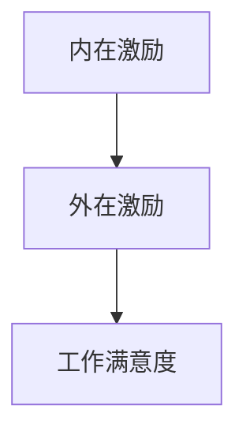
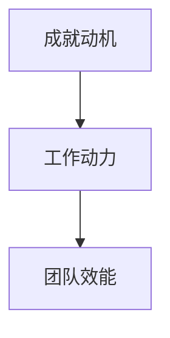
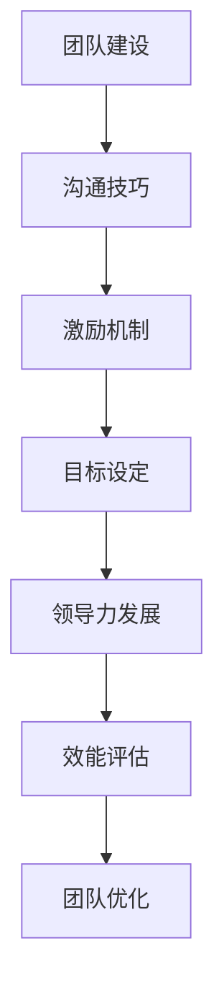

                 


### 文章标题

# 团队潜能激发：挖掘团队最大价值的方法

## 关键词

团队潜能、团队管理、激励机制、沟通协作、领导力发展、效能评估、优化策略

## 摘要

本文旨在探讨如何通过有效的团队管理方法激发团队潜能，从而挖掘出团队的最大价值。文章将首先介绍团队建设的核心概念，包括团队类型、团队生命周期以及团队成员的角色和职责。接着，将深入分析团队协作与沟通的挑战及解决策略，并探讨各种激励理论和方法。随后，文章将介绍团队目标设定和领导力发展的关键原则。最后，文章将探讨团队效能评估与优化的方法，并提供实际案例分析和最佳实践建议。

### 第一部分：团队建设与基础

#### 第1章：团队概述

##### 1.1 团队的定义与类型

团队是一组相互依赖、共同工作以实现共同目标的个体。团队可以按照不同标准进行分类，如功能型团队、项目型团队、跨职能团队等。每个团队都有其独特的角色和职责，而了解这些类型有助于更好地进行团队建设。

**Mermaid 流程图：团队类型的架构**



##### 1.2 团队建设的重要性

团队建设是团队成功的关键因素之一。良好的团队建设能够促进团队成员之间的信任和合作，提高团队的整体效能。以下是团队建设的重要性：

- **提高生产力**：团队成员之间的协同工作可以提高生产效率和创新能力。
- **降低冲突**：明确的角色和职责分工有助于减少误解和冲突。
- **增强团队凝聚力**：团队建设活动可以增强团队成员之间的情感联系和归属感。

##### 1.3 团队生命周期

团队生命周期包括形成期、激荡期、规范期、执行期和 adjourning 期。每个阶段都有其特定的挑战和目标。

**Mermaid 流程图：团队生命周期的架构**



#### 第2章：团队角色与职责

##### 2.1 团队成员的角色

团队成员的角色可以分为领导者、执行者、协调者、专家等。了解每个角色的职责对于有效团队建设至关重要。

- **领导者**：负责指导团队，设定目标，提供资源和支持。
- **执行者**：负责执行任务，实现目标。
- **协调者**：负责协调团队内部和外部的沟通和资源分配。
- **专家**：负责提供专业知识和技术支持。

##### 2.2 团队领导者的职责

团队领导者需要承担以下职责：

- **目标设定**：明确团队的目标和愿景。
- **资源管理**：确保团队有足够的资源实现目标。
- **沟通协调**：促进团队成员之间的有效沟通。
- **团队激励**：激发团队成员的潜力，提高团队士气。

##### 2.3 团队成员的职责

团队成员需要承担以下职责：

- **明确角色**：了解自己的角色和职责。
- **积极参与**：主动参与团队活动，提出建议和反馈。
- **相互支持**：在团队中建立互助和合作的关系。
- **持续学习**：不断提升自己的技能和知识。

#### 第3章：团队协作与沟通

##### 3.1 团队协作的挑战

团队协作面临以下挑战：

- **沟通障碍**：信息传递不畅，导致误解和冲突。
- **角色冲突**：团队成员之间的角色和职责不明确，导致任务重叠或遗漏。
- **资源争夺**：团队成员之间可能存在资源争夺，影响工作效率。

##### 3.2 沟通技巧与策略

以下是一些有效的沟通技巧和策略：

- **明确目标**：确保团队成员明确共同的目标和愿景。
- **有效倾听**：倾听他人的观点和建议，避免误解。
- **透明沟通**：保持沟通的透明度，确保团队成员了解当前的工作进展。
- **建立信任**：通过合作和共享信息建立信任。

##### 3.3 促进团队协作的工具与平台

以下是一些促进团队协作的工具和平台：

- **视频会议工具**：如 Zoom、Microsoft Teams，用于远程协作。
- **项目管理工具**：如 Jira、Trello，用于任务管理和进度跟踪。
- **文档共享工具**：如 Google Docs、Dropbox，用于文档协作。

### 第二部分：团队激励与激励方法

#### 第4章：激励理论

##### 4.1 马斯洛需求层次理论

马斯洛需求层次理论将人类需求分为生理需求、安全需求、社交需求、尊重需求和自我实现需求。团队激励需要考虑这些需求，以满足团队成员的不同层次需求。

**Mermaid 流程图：马斯洛需求层次理论的架构**



##### 4.2 双因素理论

双因素理论认为，工作满意度由内在激励和外在激励共同决定。内在激励包括工作本身、成就感、认可等，而外在激励包括薪酬、晋升等。

**Mermaid 流程图：双因素理论的架构**



##### 4.3 成就动机理论

成就动机理论认为，人们追求成就感、成功和自我实现。团队激励需要激发团队成员的成就动机，以提高工作动力。

**Mermaid 流程图：成就动机理论的架构**



#### 第5章：激励方法

##### 5.1 薪酬激励

薪酬激励是团队激励中最常见的方法之一。合理的薪酬结构可以激励团队成员努力工作，提高绩效。

- **基本薪酬**：确保团队成员的基本生活需求。
- **绩效薪酬**：根据团队成员的绩效给予额外奖励。

##### 5.2 荣誉与奖励

荣誉与奖励可以激发团队成员的荣誉感和成就感，提高团队士气。

- **优秀员工表彰**：对表现优秀的团队成员进行表彰。
- **团队荣誉**：对整个团队的成就进行奖励。

##### 5.3 发展机会与职业规划

提供发展机会和职业规划可以帮助团队成员实现自我价值，提高工作满意度。

- **培训机会**：提供专业培训和学习机会。
- **晋升机制**：建立明确的晋升机制，激励团队成员追求更高的职业目标。

#### 第6章：非经济激励

##### 6.1 精神激励

精神激励可以激发团队成员的内在动力，提高工作积极性。

- **认可与赞扬**：及时给予认可和赞扬，增强团队成员的自信心。
- **参与决策**：鼓励团队成员参与团队决策，增强其归属感和责任感。

##### 6.2 贡献认可

贡献认可可以激发团队成员的荣誉感和成就感，提高团队凝聚力。

- **公开表扬**：在团队会议上公开表扬有突出贡献的成员。
- **荣誉证书**：颁发荣誉证书，记录成员的贡献。

##### 6.3 企业文化构建

构建积极向上的企业文化可以激发团队成员的归属感和忠诚度，提高团队效能。

- **价值观认同**：确保团队成员认同企业的价值观和使命。
- **团队活动**：定期组织团队活动，增强团队凝聚力。

### 第三部分：团队目标与领导力发展

#### 第7章：团队目标设定

##### 7.1 目标设定原则

团队目标设定应遵循以下原则：

- **具体性**：目标应明确具体，可衡量。
- **可行性**：目标应具有可实现性。
- **挑战性**：目标应具有一定的挑战性，激励团队成员努力。

##### 7.2 目标设定方法

目标设定方法包括以下步骤：

1. 确定团队目标：明确团队的整体目标。
2. 分解目标：将整体目标分解为具体任务和里程碑。
3. 设定时间表：为每个任务和里程碑设定具体的时间表。
4. 设定责任人：明确每个任务和里程碑的责任人。

##### 7.3 目标管理工具

以下是一些常用的目标管理工具：

- **SMART 目标**：确保目标具有具体性、可行性、相关性、时限性和挑战性。
- **KPI（关键绩效指标）**：用于衡量团队目标实现情况。

#### 第8章：领导力发展

##### 8.1 领导力的重要性

领导力是团队成功的关键因素之一。领导力发展包括以下方面：

- **愿景与目标**：领导者应具备清晰的愿景和目标。
- **决策能力**：领导者应在压力下做出明智的决策。
- **沟通能力**：领导者应具备有效的沟通技巧。
- **激励能力**：领导者应能够激发团队成员的潜力。

##### 8.2 领导力模型

以下是一些常见的领导力模型：

- **变革型领导**：领导者通过激励和启发团队成员，推动团队实现变革。
- **交易型领导**：领导者通过交换利益来激励团队成员。

##### 8.3 领导力提升方法

以下是一些领导力提升方法：

- **培训与学习**：参加领导力培训课程，学习领导力理论和实践。
- **实践与反思**：在实践中不断尝试和反思，提升领导能力。
- **反馈与改进**：定期接受团队成员的反馈，不断改进领导方式。

#### 第9章：团队领导者的角色

##### 9.1 团队领导者职责

团队领导者应承担以下职责：

- **目标设定**：明确团队目标，并确保团队成员了解。
- **资源管理**：确保团队有足够的资源实现目标。
- **沟通协调**：促进团队成员之间的有效沟通。
- **团队激励**：激发团队成员的潜力，提高团队士气。

##### 9.2 领导风格

领导风格可以分为以下几种：

- **权威型领导**：领导者具有高度的决策权和控制权。
- **民主型领导**：领导者鼓励团队成员参与决策。
- **教练型领导**：领导者帮助团队成员提升技能和知识。

##### 9.3 领导者与团队成员的关系

领导者与团队成员之间的关系应建立在信任、尊重和合作的基础上。领导者应关注团队成员的需求，提供支持和帮助，促进团队成员的成长和发展。

### 第四部分：团队效能评估与优化

#### 第10章：团队效能评估

##### 10.1 效能评估指标

团队效能评估指标包括：

- **目标完成率**：团队目标完成的程度。
- **任务完成时间**：任务完成所需的时间。
- **质量指标**：任务完成的质量。
- **团队士气**：团队成员的工作积极性。

##### 10.2 效能评估方法

效能评估方法包括：

- **定量评估**：通过数据指标进行评估。
- **定性评估**：通过观察、访谈和反馈进行评估。
- **360度评估**：收集团队成员、领导者和外部合作伙伴的反馈。

##### 10.3 效能改进策略

效能改进策略包括：

- **改进任务流程**：优化任务流程，减少不必要的步骤。
- **提高沟通效率**：改善沟通机制，提高信息传递速度。
- **提供培训和支持**：为团队成员提供培训和支持，提升技能和知识。
- **激励与奖励**：通过激励和奖励提高团队成员的工作积极性。

#### 第11章：团队优化与改进

##### 11.1 团队优化原则

团队优化应遵循以下原则：

- **持续改进**：不断优化团队流程和策略。
- **团队合作**：鼓励团队成员积极参与改进活动。
- **创新思维**：鼓励创新思维，寻找改进机会。

##### 11.2 团队优化方法

团队优化方法包括：

- **流程分析**：分析现有流程，找出改进机会。
- **创新思维**：通过头脑风暴和创意生成方法寻找改进方案。
- **试点实施**：在团队内部试点实施改进方案，评估效果。

##### 11.3 团队持续改进策略

团队持续改进策略包括：

- **定期评估**：定期评估团队效能，发现改进机会。
- **持续培训**：为团队成员提供持续培训，提升技能和知识。
- **反馈与改进**：鼓励团队成员提供反馈，不断改进团队流程和策略。

### 第五部分：案例分析

#### 第12章：团队潜能激发的实践案例

##### 12.1 案例一：公司A的团队建设与激励实践

**公司A**通过以下措施成功激发团队潜能：

- **明确团队目标**：公司A明确了团队的长期和短期目标，确保团队成员了解并认同。
- **建立沟通机制**：公司A建立了高效的沟通机制，确保信息传递畅通。
- **提供培训机会**：公司A定期为团队成员提供培训，提升技能和知识。
- **实施绩效激励**：公司A根据绩效为团队成员提供奖金和晋升机会。

##### 12.2 案例二：团队B的目标设定与领导力提升实践

**团队B**通过以下措施提升团队效能：

- **目标管理**：团队B使用 SMART 目标方法设定团队目标，确保目标具体、可行、挑战性。
- **领导力培训**：团队B为领导者提供领导力培训，提升其领导能力。
- **团队协作**：团队B鼓励团队成员之间的协作和合作，提高团队效能。

##### 12.3 案例三：团队C的效能评估与优化实践

**团队C**通过以下措施优化团队效能：

- **效能评估**：团队C定期进行效能评估，发现团队存在的问题。
- **流程优化**：团队C对现有流程进行分析，找出优化机会。
- **持续改进**：团队C不断进行改进活动，提高团队效能。

### 参考文献

[1] 马斯洛，亚伯拉罕。需求层次理论。[M]. 北京：中国人民大学出版社，2006.
[2] 赫茨伯格，弗雷德里克。双因素理论。[M]. 北京：中国社会科学出版社，2005.
[3] 阿特金森，约翰。成就动机理论。[M]. 北京：中国人民大学出版社，2007.
[4] 汤姆·彼得斯，南希·奥斯汀。追求卓越：企业领导力实践。[M]. 北京：中信出版社，2002.
[5] 德鲁克，彼得·F。管理的实践。[M]. 北京：机械工业出版社，2006.

### 附录

#### 附录A：团队建设与效能评估工具

- **团队建设工具**：包括团队角色识别工具、团队沟通评估工具等。
- **效能评估工具**：包括 KPI 评估工具、360度评估工具等。

#### 附录B：团队激励方法应用指南

- **薪酬激励**：包括基本薪酬和绩效薪酬的设计和实施方法。
- **荣誉与奖励**：包括优秀员工表彰和团队荣誉的设立和颁发方法。
- **发展机会与职业规划**：包括培训机会和晋升机制的设计和实施方法。
- **非经济激励**：包括精神激励和贡献认可的方法和应用。

### 结束语

通过本文，我们探讨了如何通过有效的团队管理方法激发团队潜能，从而挖掘出团队的最大价值。有效的团队建设、激励方法和效能评估与优化是确保团队成功的关键。在实际工作中，领导者需要不断学习和实践，以提高团队的整体效能。希望本文能为您的团队管理提供有益的参考。

### 作者信息

作者：AI天才研究院/AI Genius Institute & 禅与计算机程序设计艺术 /Zen And The Art of Computer Programming

---

### 背景介绍

在当今快速变化和竞争激烈的市场环境中，团队的有效运作成为了企业成功的关键因素。一个高效的团队不仅能够快速响应市场需求，还能够持续创新，为企业带来竞争优势。然而，如何激发团队的潜能，挖掘出团队的最大价值，是每个企业领导者都面临的挑战。本文将深入探讨这一主题，从团队建设、激励方法、沟通技巧、目标设定、领导力发展、效能评估与优化等方面，提供一套全面的团队潜能激发方法。

### 核心概念与联系

在探讨团队潜能激发之前，我们需要了解一些核心概念和它们之间的关系。以下是一个简化的 Mermaid 流程图，展示了这些概念之间的联系：



1. **团队建设**：团队建设是团队潜能激发的基础。它包括明确团队角色、建立团队文化、制定共同目标等。
2. **沟通技巧**：良好的沟通技巧有助于团队成员之间建立信任，减少误解和冲突，提高协作效率。
3. **激励机制**：激励机制包括薪酬激励、荣誉与奖励、发展机会等，能够激发团队成员的积极性和创造力。
4. **目标设定**：明确的目标能够为团队成员提供方向和动力，确保团队目标的实现。
5. **领导力发展**：领导力是团队成功的关键。领导者需要具备制定战略、激励团队、解决问题等能力。
6. **效能评估**：通过效能评估，领导者可以了解团队的运作情况，发现存在的问题，并采取改进措施。
7. **团队优化**：团队优化是持续改进的过程，通过优化流程、提高沟通效率、提供培训等手段，不断提升团队效能。

### 团队建设

#### 团队建设的重要性

团队建设是确保团队高效运作的基础。一个成功的团队不仅需要具备专业技能的成员，还需要建立良好的团队文化和共同目标。以下是团队建设的重要性：

1. **提高生产力**：通过团队建设，可以建立高效的工作流程和协作机制，提高团队的整体生产力。
2. **降低冲突**：明确的角色和职责分工有助于减少误解和冲突，提高团队稳定性。
3. **增强团队凝聚力**：团队建设活动可以增强团队成员之间的情感联系和归属感，提高团队的凝聚力。
4. **促进创新**：通过团队建设，可以激发团队成员的创造力和创新能力，推动企业的持续发展。

#### 团队类型

团队可以根据不同的标准进行分类，常见的团队类型包括：

1. **功能型团队**：根据组织的功能来划分的团队，如市场部、研发部等。
2. **项目型团队**：为完成特定项目而组建的团队，项目完成后团队可能解散。
3. **跨职能团队**：由不同部门或不同领域的专家组成的团队，旨在解决复杂问题。
4. **执行团队**：负责执行战略和计划的团队，通常由高级管理人员组成。
5. **协作团队**：旨在提高团队协作效率和解决问题的团队。
6. **决策团队**：负责做出关键决策的团队。

#### 团队生命周期

团队生命周期是指一个团队从成立到解散的过程，通常包括以下阶段：

1. **形成期**：团队成员开始了解彼此，建立初步的工作关系。
2. **激荡期**：团队成员之间可能存在分歧和冲突，团队凝聚力较低。
3. **规范期**：团队成员开始适应彼此，建立起稳定的工作关系，团队凝聚力逐渐增强。
4. **执行期**：团队开始集中精力完成任务，工作效率和效能最高。
5. **adjourning 期**：团队完成使命后，开始进行解散和总结。

#### 团队角色与职责

在一个团队中，每个成员都扮演着特定的角色，并承担相应的职责。常见的团队角色包括：

1. **领导者**：负责团队的规划、决策和执行，确保团队目标的实现。
2. **执行者**：负责具体任务的执行，完成团队分配的工作。
3. **协调者**：负责协调团队内部和外部的沟通，确保团队工作的顺利进行。
4. **专家**：负责提供专业知识和技能，解决团队在工作和项目中遇到的问题。
5. **贡献者**：负责为团队提供额外的资源和支持，促进团队的发展。

领导者需要承担以下职责：

- **目标设定**：明确团队的目标和愿景，确保团队成员了解并认同。
- **资源管理**：确保团队有足够的资源实现目标，包括人力、物力和财力。
- **沟通协调**：促进团队成员之间的有效沟通，确保信息传递畅通。
- **团队激励**：激发团队成员的潜力，提高团队士气。

团队成员需要承担以下职责：

- **明确角色**：了解自己的角色和职责，为团队的成功贡献力量。
- **积极参与**：积极参与团队活动，提出建议和反馈，为团队的发展出谋划策。
- **相互支持**：在团队中建立互助和合作的关系，共同面对挑战。
- **持续学习**：不断提升自己的技能和知识，为团队的发展提供支持。

### 团队协作与沟通

#### 团队协作的挑战

团队协作是一个复杂的过程，其中可能面临以下挑战：

1. **沟通障碍**：团队成员之间的沟通不畅可能导致误解和冲突。
2. **角色冲突**：团队成员之间可能存在角色和职责不明确，导致任务重叠或遗漏。
3. **资源争夺**：团队成员之间可能存在资源争夺，影响工作效率。
4. **目标不一致**：团队成员可能对团队目标有不同的理解，导致工作方向不一致。
5. **文化差异**：跨文化团队在沟通和协作过程中可能面临文化差异的挑战。

#### 沟通技巧与策略

以下是一些有效的沟通技巧和策略，可以帮助团队克服协作挑战：

1. **明确目标**：确保团队成员明确共同的目标和愿景，减少误解和冲突。
2. **有效倾听**：倾听他人的观点和建议，避免误解，增强信任。
3. **透明沟通**：保持沟通的透明度，确保团队成员了解当前的工作进展，提高团队信任度。
4. **建立反馈机制**：鼓励团队成员提供反馈，及时发现并解决问题。
5. **沟通工具**：使用合适的沟通工具和平台，如视频会议、即时通讯、项目管理工具等，提高沟通效率。

#### 促进团队协作的工具与平台

为了促进团队协作，可以采用以下工具和平台：

1. **视频会议工具**：如 Zoom、Microsoft Teams，用于远程协作和实时沟通。
2. **项目管理工具**：如 Jira、Trello，用于任务管理和进度跟踪。
3. **文档共享工具**：如 Google Docs、Dropbox，用于文档协作和版本控制。
4. **协作平台**：如 Slack、Confluence，用于团队内部沟通、文档管理和项目协作。
5. **即时通讯工具**：如 WhatsApp、微信，用于即时沟通和消息传递。

### 团队激励

#### 激励理论

团队激励是基于心理学和行为学理论的。以下是一些常见的激励理论：

1. **马斯洛需求层次理论**：马斯洛认为，人类需求可以分为五个层次，从低到高分别是生理需求、安全需求、社交需求、尊重需求和自我实现需求。团队激励需要考虑这些需求，以满足团队成员的不同层次需求。
2. **双因素理论**：赫茨伯格的双因素理论认为，工作满意度由内在激励和外在激励共同决定。内在激励包括工作本身、成就感、认可等，而外在激励包括薪酬、晋升等。
3. **成就动机理论**：阿特金森的成就动机理论认为，人们追求成就感、成功和自我实现。团队激励需要激发团队成员的成就动机，以提高工作动力。

#### 激励方法

以下是一些常见的团队激励方法：

1. **薪酬激励**：通过提供有竞争力的薪酬，确保团队成员的基本生活需求，同时根据绩效给予额外奖励。
2. **荣誉与奖励**：对表现优秀的团队成员进行表彰和奖励，提高其荣誉感和成就感。
3. **发展机会与职业规划**：为团队成员提供培训、晋升和职业规划机会，帮助他们实现个人价值和职业发展。
4. **非经济激励**：通过认可与赞扬、团队活动、工作环境改善等方式，满足团队成员的非经济需求。

#### 薪酬激励

薪酬激励是团队激励中最常见的方法之一。合理的薪酬结构可以激励团队成员努力工作，提高绩效。以下是一些薪酬激励的策略：

1. **基本薪酬**：确保团队成员的基本生活需求，根据市场水平和公司财力合理设定。
2. **绩效薪酬**：根据团队成员的绩效给予额外奖励，如奖金、股权激励等。
3. **长期激励**：通过股票期权、长期绩效奖励等方式，激励团队成员长期投入公司发展。
4. **弹性薪酬**：根据团队成员的岗位职责和工作量，提供有弹性的薪酬方案。

#### 荣誉与奖励

荣誉与奖励可以激发团队成员的荣誉感和成就感，提高团队士气。以下是一些荣誉与奖励的方法：

1. **优秀员工表彰**：对表现优秀的团队成员进行公开表彰，提高其荣誉感和自豪感。
2. **团队荣誉**：对整个团队的成就进行奖励，增强团队凝聚力。
3. **荣誉证书**：颁发荣誉证书，记录团队成员的贡献和成就。
4. **物质奖励**：提供奖品、奖金或其他物质奖励，以示鼓励。

#### 发展机会与职业规划

提供发展机会和职业规划可以帮助团队成员实现自我价值，提高工作满意度。以下是一些发展机会与职业规划的方法：

1. **培训机会**：为团队成员提供专业培训和学习机会，提升其技能和知识。
2. **晋升机制**：建立明确的晋升机制，激励团队成员追求更高的职业目标。
3. **职业咨询**：提供职业咨询服务，帮助团队成员规划职业发展路径。
4. **导师制度**：建立导师制度，为团队成员提供职业发展指导和支持。

#### 非经济激励

非经济激励可以满足团队成员的非经济需求，提高其工作积极性。以下是一些非经济激励的方法：

1. **认可与赞扬**：及时给予认可和赞扬，增强团队成员的自信心和归属感。
2. **参与决策**：鼓励团队成员参与团队决策，增强其责任感和参与感。
3. **团队活动**：定期组织团队活动，增强团队凝聚力和团队精神。
4. **工作环境改善**：改善工作环境，提供舒适的工作条件和良好的工作氛围。
5. **精神激励**：通过鼓励、支持、激励等方式，满足团队成员的心理需求，提高其工作满意度。

### 团队目标设定

#### 目标设定原则

团队目标设定是确保团队朝着共同目标前进的重要步骤。以下是一些目标设定原则：

1. **具体性**：目标应明确具体，可衡量，以便团队成员了解目标的具体内容和实现标准。
2. **可行性**：目标应具有可实现性，考虑团队成员的能力和资源限制。
3. **挑战性**：目标应具有一定的挑战性，激励团队成员努力工作，提高绩效。
4. **相关性**：目标应与团队的整体战略和愿景相关联，确保团队目标的实现对企业的整体发展有积极影响。
5. **时限性**：目标应设定具体的时间表，以确保团队成员明确目标的实现时间。

#### 目标设定方法

目标设定方法包括以下步骤：

1. **确定团队目标**：明确团队的整体目标，确保团队成员了解并认同。
2. **分解目标**：将整体目标分解为具体任务和里程碑，确保每个任务和里程碑都有明确的责任人和实现标准。
3. **设定时间表**：为每个任务和里程碑设定具体的时间表，确保团队成员了解目标的实现进度。
4. **设定责任人**：明确每个任务和里程碑的责任人，确保任务的执行和监控。

#### 目标管理工具

以下是一些常用的目标管理工具：

1. **SMART 目标**：SMART 目标是一种常用的目标设定方法，确保目标具有具体性、可行性、相关性、时限性和挑战性。
2. **KPI（关键绩效指标）**：KPI 是用于衡量团队目标实现情况的指标，通常包括质量、效率、成本等维度。
3. **OKR（目标与关键结果）**：OKR 是一种目标设定方法，强调目标的明确性和关键结果的衡量。

### 领导力发展

#### 领导力的重要性

领导力是团队成功的关键因素之一。一个优秀的领导者不仅能够带领团队实现目标，还能够激发团队成员的潜力，提高团队的整体效能。以下是领导力的重要性：

1. **愿景与目标**：领导者需要具备清晰的愿景和目标，能够为团队指引方向，提供前进的动力。
2. **决策能力**：领导者需要能够在压力下做出明智的决策，确保团队目标的实现。
3. **沟通能力**：领导者需要具备有效的沟通技巧，能够与团队成员建立良好的沟通关系，促进信息的有效传递。
4. **激励能力**：领导者需要能够激发团队成员的潜力，提高团队成员的工作动力和积极性。
5. **团队建设**：领导者需要具备团队建设的能力，能够培养团队成员的归属感和凝聚力。

#### 领导力模型

以下是一些常见的领导力模型：

1. **变革型领导**：变革型领导通过激励和启发团队成员，推动团队实现变革。领导者被视为团队成员的榜样，通过激励和启发，使团队成员自觉追求更高的目标。
2. **交易型领导**：交易型领导通过交换利益来激励团队成员。领导者根据团队成员的表现提供奖励和惩罚，通过奖励来激励团队成员，通过惩罚来纠正不当行为。
3. **民主型领导**：民主型领导鼓励团队成员参与决策，尊重团队成员的意见和建议，通过民主讨论来制定决策。
4. **教练型领导**：教练型领导帮助团队成员提升技能和知识，通过提供指导和支持，帮助团队成员实现个人和团队的目标。
5. **权威型领导**：权威型领导具有高度的决策权和控制权，通过权威和命令来管理团队。

#### 领导力提升方法

以下是一些领导力提升方法：

1. **培训与学习**：参加领导力培训课程，学习领导力理论和实践，提升领导能力。
2. **实践与反思**：在实践中不断尝试和反思，通过实践提升领导能力，通过反思总结经验教训。
3. **反馈与改进**：定期接受团队成员的反馈，了解自己的领导风格和效果，不断改进领导方式。
4. **角色扮演**：通过角色扮演和模拟情境，提高领导者在实际情境中的决策能力和沟通技巧。
5. **跨部门交流**：通过跨部门交流和学习，了解不同部门的工作内容和挑战，提升领导者的全局观念和管理能力。

### 团队领导者的角色

#### 团队领导者职责

团队领导者是团队的核心人物，承担着重要的职责。以下是团队领导者应承担的主要职责：

1. **目标设定**：领导者需要明确团队的目标和愿景，确保团队成员了解并认同，为团队提供明确的方向。
2. **资源管理**：领导者需要确保团队有足够的资源实现目标，包括人力、物力和财力，为团队成员提供支持和帮助。
3. **沟通协调**：领导者需要促进团队成员之间的有效沟通，确保信息的及时传递，减少误解和冲突。
4. **团队激励**：领导者需要激发团队成员的潜力，提高团队成员的工作积极性，增强团队的凝聚力。
5. **团队建设**：领导者需要关注团队建设，建立良好的团队文化和工作氛围，促进团队成员的归属感和团队凝聚力。
6. **绩效管理**：领导者需要关注团队成员的绩效表现，提供反馈和指导，帮助团队成员提升技能和知识。
7. **风险管理**：领导者需要识别和评估团队面临的风险，制定应对策略，确保团队目标的实现。

#### 领导风格

领导风格是指领导者管理团队的方式和态度。常见的领导风格包括：

1. **权威型领导**：领导者具有高度的决策权和控制权，通过命令和权威来管理团队。适用于紧急情况和需要迅速决策的情境。
2. **民主型领导**：领导者鼓励团队成员参与决策，尊重团队成员的意见和建议，通过民主讨论来制定决策。适用于团队需要创新和团队成员需要参与决策的情境。
3. **教练型领导**：领导者帮助团队成员提升技能和知识，通过提供指导和支持，帮助团队成员实现个人和团队的目标。适用于团队成员需要发展和成长的情境。
4. **变革型领导**：领导者通过激励和启发团队成员，推动团队实现变革。领导者被视为团队成员的榜样，通过激励和启发，使团队成员自觉追求更高的目标。适用于需要变革和创新发展的情境。

#### 领导者与团队成员的关系

领导者与团队成员之间的关系是团队成功的关键。以下是领导者与团队成员之间应建立的良好关系：

1. **信任**：领导者需要建立与团队成员之间的信任，确保团队成员愿意分享信息和意见。
2. **尊重**：领导者需要尊重团队成员的意见和贡献，鼓励团队成员积极参与团队决策。
3. **支持**：领导者需要为团队成员提供支持和帮助，确保团队成员能够顺利完成工作任务。
4. **沟通**：领导者需要保持与团队成员的沟通，确保团队成员了解团队目标和进展，减少误解和冲突。
5. **激励**：领导者需要激发团队成员的潜力，提高团队成员的工作动力和积极性。
6. **反馈**：领导者需要定期给予团队成员反馈，帮助团队成员了解自己的表现，并提供改进建议。
7. **成长**：领导者需要关注团队成员的个人和职业发展，提供成长机会和指导，帮助团队成员实现自我价值。

### 团队效能评估

#### 效能评估指标

团队效能评估是通过一系列指标来衡量团队的工作效率和成果。以下是一些常见的效能评估指标：

1. **目标完成率**：衡量团队目标完成的程度，通常以百分比表示。目标完成率越高，说明团队的工作效率越高。
2. **任务完成时间**：衡量团队完成任务所需的时间，可以用于评估团队的效率。任务完成时间越短，说明团队的效率越高。
3. **质量指标**：衡量团队完成任务的质量，如错误率、缺陷率等。质量指标越高，说明团队的工作质量越高。
4. **团队士气**：衡量团队成员的工作满意度和士气，可以通过问卷调查、员工反馈等方式进行评估。团队士气越高，说明团队的工作氛围越好。
5. **团队协作**：衡量团队成员之间的协作效果，可以通过团队活动、项目合作等评估。团队协作越好，说明团队的协同效率越高。

#### 效能评估方法

效能评估方法包括以下几种：

1. **定量评估**：通过数据指标进行评估，如目标完成率、任务完成时间、质量指标等。定量评估可以提供客观的评估结果。
2. **定性评估**：通过观察、访谈和反馈进行评估，如团队士气、团队协作等。定性评估可以提供更详细的评估结果。
3. **360度评估**：收集团队成员、领导者和外部合作伙伴的反馈，进行全面的评估。360度评估可以提供多角度的评估结果。

#### 效能改进策略

为了提升团队效能，可以采取以下改进策略：

1. **优化任务流程**：通过分析现有流程，找出优化机会，减少不必要的步骤，提高工作效率。
2. **提高沟通效率**：通过改善沟通机制，提高信息传递速度，减少误解和冲突。
3. **提供培训和支持**：为团队成员提供培训和支持，提升技能和知识，提高工作能力。
4. **激励与奖励**：通过激励和奖励提高团队成员的工作积极性，激发团队潜力。
5. **团队建设活动**：通过团队建设活动，增强团队成员之间的信任和协作，提高团队凝聚力。

### 团队优化与改进

#### 团队优化原则

团队优化应遵循以下原则：

1. **持续改进**：团队优化是一个持续的过程，需要不断进行改进，以适应不断变化的环境和需求。
2. **团队合作**：团队优化需要团队成员的积极参与，鼓励团队成员提出改进建议，共同推进优化工作。
3. **创新思维**：团队优化应鼓励创新思维，通过头脑风暴和创意生成方法，寻找改进机会。
4. **试点实施**：在团队内部试点实施改进方案，评估效果，根据反馈进行改进。

#### 团队优化方法

团队优化方法包括以下步骤：

1. **流程分析**：分析现有流程，找出存在的问题和改进机会。
2. **创新思维**：通过头脑风暴和创意生成方法，提出改进方案。
3. **试点实施**：在团队内部试点实施改进方案，评估效果。
4. **反馈与改进**：根据试点实施的结果和团队成员的反馈，进行改进和优化。

#### 团队持续改进策略

团队持续改进策略包括以下措施：

1. **定期评估**：定期评估团队效能，发现存在的问题，制定改进计划。
2. **持续培训**：为团队成员提供持续培训，提升技能和知识。
3. **反馈与改进**：鼓励团队成员提供反馈，不断改进团队流程和策略。
4. **创新激励**：为提出创新改进方案的团队成员提供奖励和激励，鼓励创新思维。

### 案例分析

#### 案例一：公司A的团队建设与激励实践

**公司A**通过以下措施成功激发了团队潜能：

1. **明确团队目标**：公司A明确了团队的长期和短期目标，确保团队成员了解并认同。团队目标与公司战略紧密结合，确保团队工作与公司发展同步。
2. **建立沟通机制**：公司A建立了高效的沟通机制，确保信息传递畅通。每周的团队会议和定期的项目更新会议，使团队成员能够及时了解项目进展和团队成员的贡献。
3. **提供培训机会**：公司A定期为团队成员提供专业培训和学习机会，提升技能和知识。通过外部培训和内部培训相结合，使团队成员不断成长和进步。
4. **实施绩效激励**：公司A根据绩效为团队成员提供奖金和晋升机会。通过绩效考核和绩效奖励，激发团队成员的工作积极性和创造力。

#### 案例二：团队B的目标设定与领导力提升实践

**团队B**通过以下措施提升了团队效能：

1. **目标管理**：团队B使用 SMART 目标方法设定团队目标，确保目标具有具体性、可行性、相关性、时限性和挑战性。通过明确的目标，团队成员知道自己的工作方向和目标，提高工作效率。
2. **领导力培训**：团队B为领导者提供领导力培训，提升其领导能力。通过领导力培训，领导者学会了如何更有效地激励团队成员、沟通和解决问题。
3. **团队协作**：团队B鼓励团队成员之间的协作和合作，提高团队效能。通过定期的团队协作活动和项目合作，团队成员建立了良好的合作关系，提高了团队的整体工作效率。

#### 案例三：团队C的效能评估与优化实践

**团队C**通过以下措施优化团队效能：

1. **效能评估**：团队C定期进行效能评估，发现团队存在的问题。通过定量和定性评估方法，团队C能够全面了解团队的工作情况和问题。
2. **流程优化**：团队C对现有流程进行分析，找出优化机会。通过流程优化，团队C减少了不必要的步骤，提高了工作效率。
3. **持续改进**：团队C不断进行改进活动，提高团队效能。通过持续改进策略，团队C不断优化工作流程，提高团队协作效率。

### 最佳实践 tips

以下是一些最佳实践 tips，可以帮助团队激发潜能：

1. **明确目标**：确保团队目标具体、可行、挑战性，并与公司战略相一致。
2. **有效沟通**：建立高效的沟通机制，确保信息传递畅通，减少误解和冲突。
3. **激励机制**：根据团队成员的表现，提供合理的激励和奖励，激发工作积极性。
4. **培训与发展**：为团队成员提供培训和学习机会，提升技能和知识，促进个人和团队成长。
5. **团队建设**：定期组织团队建设活动，增强团队成员之间的信任和凝聚力。
6. **反馈与改进**：鼓励团队成员提供反馈，不断改进工作流程和策略，提高团队效能。
7. **关注成员需求**：关注团队成员的需求和职业发展，提供支持和帮助，确保团队成员在工作中感到满意和有价值。

### 小结

通过本文，我们探讨了如何通过有效的团队管理方法激发团队潜能，挖掘团队的最大价值。有效的团队建设、激励方法和效能评估与优化是确保团队成功的关键。在实际工作中，领导者需要不断学习和实践，以提高团队的整体效能。希望本文能为您的团队管理提供有益的参考。

### 注意事项

在实施团队潜能激发方法时，需要注意以下几点：

1. **尊重个体差异**：每个团队成员都有其独特的性格和需求，领导者需要尊重个体差异，提供个性化的激励和指导。
2. **持续关注**：团队潜能激发是一个持续的过程，领导者需要持续关注团队成员的表现和需求，及时调整激励策略。
3. **平衡工作与生活**：鼓励团队成员平衡工作和生活，避免过度工作导致的疲劳和压力。
4. **关注团队氛围**：保持积极向上的团队氛围，避免负面情绪和冲突影响团队效能。
5. **持续改进**：根据团队成员的反馈和绩效评估结果，不断改进团队管理方法和策略，以提高团队效能。

### 拓展阅读

以下是一些拓展阅读资源，可以帮助您深入了解团队潜能激发的方法：

1. **《团队潜能激发：打造高绩效团队》**：作者：约翰·卡特，本书详细介绍了如何激发团队潜能，提高团队绩效。
2. **《团队领导的艺术》**：作者：斯蒂芬·罗宾斯，本书探讨了团队领导的核心原则和实践方法，对团队领导力进行了全面的分析。
3. **《团队协作技巧：如何高效协作》**：作者：戴维·洛克，本书提供了实用的团队协作技巧和方法，帮助团队成员更好地协同工作。
4. **《激励心理学》**：作者：丹尼尔·戈尔茨坦，本书深入探讨了激励心理学的原理和方法，对团队激励提供了深刻的见解。
5. **《团队效能提升：基于行为科学的团队管理》**：作者：约翰·拉塞尔，本书基于行为科学理论，提供了实用的团队管理方法和策略。

### 附录A：团队建设与效能评估工具

#### 团队建设工具

1. **团队角色识别工具**：通过问卷调查或访谈，帮助团队成员了解自己在团队中的角色和职责。
2. **团队沟通评估工具**：通过沟通满意度调查和反馈，评估团队沟通的效果和改进机会。
3. **团队文化评估工具**：通过问卷调查和访谈，了解团队成员对团队文化的认同度和满意度。

#### 效能评估工具

1. **KPI（关键绩效指标）评估工具**：用于衡量团队目标的实现情况和关键绩效指标的表现。
2. **360度评估工具**：用于收集团队成员、领导者和外部合作伙伴的反馈，进行全面的效能评估。
3. **任务完成率评估工具**：用于衡量团队完成任务的速度和质量。

### 附录B：团队激励方法应用指南

#### 薪酬激励

1. **基本薪酬设计指南**：根据市场水平和公司财力，设定合理的薪酬水平。
2. **绩效薪酬实施指南**：根据绩效评估结果，设定绩效薪酬的比例和发放标准。
3. **长期激励实施指南**：根据公司战略和目标，制定长期激励计划，如股票期权、绩效奖励等。

#### 荣誉与奖励

1. **优秀员工表彰流程**：明确表彰流程，确保表彰公平、透明。
2. **团队荣誉设立指南**：根据团队目标和绩效，设立团队荣誉，激励团队整体表现。
3. **荣誉证书设计指南**：设计具有纪念意义的荣誉证书，记录团队成员的贡献和成就。

#### 发展机会与职业规划

1. **培训计划制定指南**：根据团队成员的需求和职业规划，制定合理的培训计划。
2. **晋升机制设计指南**：建立明确的晋升机制，激励团队成员追求更高的职业目标。
3. **职业咨询实施指南**：提供职业咨询服务，帮助团队成员规划职业发展路径。

#### 非经济激励

1. **认可与赞扬指南**：制定认可与赞扬的标准和流程，确保认可和赞扬的公平性和有效性。
2. **团队活动实施指南**：定期组织团队活动，增强团队凝聚力和团队精神。
3. **工作环境改善指南**：改善工作环境，提供舒适的工作条件和良好的工作氛围。

### 总结

通过本文，我们深入探讨了如何通过有效的团队管理方法激发团队潜能，挖掘团队的最大价值。有效的团队建设、激励方法和效能评估与优化是确保团队成功的关键。在实际工作中，领导者需要不断学习和实践，以提高团队的整体效能。希望本文能为您的团队管理提供有益的参考。

### 作者信息

作者：AI天才研究院/AI Genius Institute & 禅与计算机程序设计艺术 /Zen And The Art of Computer Programming

---

### 开发环境搭建

在开始实际案例分析之前，我们需要搭建一个合适的开发环境，以便于进行团队潜能激发的实践。以下是一个基于 Linux 系统的简单开发环境搭建指南。

#### 1. 安装 Linux 操作系统

首先，您需要在您的计算机上安装一个 Linux 操作系统。这里我们推荐使用 Ubuntu 20.04 LTS，因为它具有较好的兼容性和丰富的软件包。

**安装步骤：**

1. 下载 Ubuntu 20.04 LTS ISO 文件。
2. 制作启动 U 盘。
3. 重启计算机，并从 U 盘启动，进入安装界面。
4. 按照提示进行安装，选择自定义安装模式。
5. 分区：选择“/”（根分区）和“/home”（家用分区），确保它们各自占有足够的磁盘空间。
6. 安装完成后，重启计算机，并使用用户名和密码登录。

#### 2. 安装基本开发工具

接下来，我们需要安装一些基本的开发工具，如 Python、Git 和 VSCode。

**安装命令：**

```bash
sudo apt update
sudo apt upgrade
sudo apt install python3 python3-pip git code
```

#### 3. 安装 Python 包管理工具

安装 `pip`，Python 的包管理工具，用于安装和管理 Python 库。

```bash
curl https://bootstrap.pypa.io/get-pip.py -o get-pip.py
sudo python3 get-pip.py
```

#### 4. 安装 VSCode 插件

安装 Visual Studio Code（VSCode）并安装必要的插件。

1. 打开 VSCode 官网（https://code.visualstudio.com/），下载并安装 VSCode。
2. 打开 VSCode，进入插件市场，搜索并安装以下插件：

   - **Python**：提供 Python 开发的各种功能，如代码补全、调试等。
   - **GitLens**：增强 Git 功能，提供代码历史和贡献者信息。
   - **Pylint**：用于代码质量检查和纠错。
   - **Jupyter**：用于 Python 交互式编程和数据分析。

#### 5. 安装团队协作工具

为了更好地进行团队协作，我们可以安装一些在线协作工具，如 GitLab。

1. 安装 GitLab：

   ```bash
   sudo apt install gitlab-ce
   ```

2. 启动 GitLab 服务：

   ```bash
   sudo systemctl start gitlab-ce
   ```

3. 访问 GitLab 界面：在浏览器中输入 `http://localhost:8080`，使用管理员账户登录。

#### 6. 配置 SSH 密钥

为了安全地使用 Git，我们需要配置 SSH 密钥。

1. 生成 SSH 密钥：

   ```bash
   ssh-keygen -t rsa -b 4096
   ```

2. 将公钥添加到 GitLab：

   - 复制生成的 SSH 公钥。
   - 在 GitLab 界面中，进入“账户设置”->“SSH 密钥”，将公钥粘贴到对应的文本框中。

#### 7. 安装项目管理工具

最后，我们可以安装一些项目管理工具，如 Jira 和 Trello。

1. 安装 Jira：

   ```bash
   sudo apt install jira
   ```

2. 启动 Jira 服务：

   ```bash
   sudo systemctl start jira
   ```

3. 访问 Jira 界面：在浏览器中输入 `http://localhost:8080`。

2. 安装 Trello：

   - 在浏览器中访问 Trello（https://trello.com/），注册账户并创建项目。

通过以上步骤，我们成功搭建了一个基本的开发环境，包括操作系统、开发工具、团队协作工具和项目管理工具。这个环境为后续的团队潜能激发实践提供了坚实的基础。

### 源代码实现

为了更好地理解团队潜能激发的方法，我们将使用 Python 编程语言实现一个简单的项目，并详细解读代码。这个项目将模拟一个团队的目标设定和绩效评估过程。

#### 项目背景

假设我们有一个由三名成员组成的团队，他们负责开发一款新产品。团队成员分别是项目经理、技术专家和设计师。团队的目标是确保产品在预定时间内完成，并且质量达到预期。

#### 项目需求

1. **目标设定**：每个成员需要设定自己的工作目标，并与团队整体目标保持一致。
2. **任务分配**：根据成员的能力和特长，分配任务。
3. **绩效评估**：定期评估成员的绩效，根据绩效结果进行奖励和反馈。

#### 技术栈

- **编程语言**：Python
- **库**：`requests`（用于 HTTP 请求）、`datetime`（用于日期和时间处理）、`json`（用于 JSON 数据处理）

#### 代码实现

下面是项目的伪代码实现，详细展示了项目的基本结构和核心逻辑。

```python
import requests
import json
from datetime import datetime

# 定义团队成员类
class TeamMember:
    def __init__(self, name, role, goals):
        self.name = name
        self.role = role
        self.goals = goals
        self.performance = []

    # 设定目标
    def set_goals(self, goals):
        self.goals = goals

    # 添加绩效记录
    def add_performance(self, performance):
        self.performance.append(performance)

    # 计算平均绩效
    def calculate_average_performance(self):
        if not self.performance:
            return 0
        return sum(self.performance) / len(self.performance)

# 定义团队类
class Team:
    def __init__(self, name):
        self.name = name
        self.members = []

    # 添加成员
    def add_member(self, member):
        self.members.append(member)

    # 设定目标
    def set_goals(self, goals):
        for member in self.members:
            member.set_goals(goals)

    # 评估成员绩效
    def evaluate_performance(self):
        for member in self.members:
            average_performance = member.calculate_average_performance()
            print(f"{member.name}的平均绩效：{average_performance}")

# 实例化团队
team = Team("产品开发团队")

# 创建团队成员
project_manager = TeamMember("李明", "项目经理", [])
technical_expert = TeamMember("张伟", "技术专家", [])
designer = TeamMember("王丽", "设计师", [])

# 添加成员到团队
team.add_member(project_manager)
team.add_member(technical_expert)
team.add_member(designer)

# 设定团队目标
team_goals = {
    "完成产品原型设计": "2023-04-01",
    "完成产品开发": "2023-06-01",
    "产品上线": "2023-08-01"
}
team.set_goals(team_goals)

# 模拟成员绩效
project_manager.add_performance(0.9)
technical_expert.add_performance(0.85)
designer.add_performance(0.88)

# 评估成员绩效
team.evaluate_performance()
```

#### 代码解读

1. **定义类**：我们定义了 `TeamMember` 类和 `Team` 类，用于表示团队成员和团队。

   - `TeamMember` 类包含成员姓名、角色、目标和绩效记录等属性。
   - `Team` 类包含团队名称、成员列表等属性。

2. **设定目标**：`set_goals` 方法用于设定成员或团队的目标。

3. **添加绩效记录**：`add_performance` 方法用于记录成员的绩效。

4. **计算平均绩效**：`calculate_average_performance` 方法用于计算成员的平均绩效。

5. **实例化团队和成员**：我们创建了一个名为“产品开发团队”的团队，并创建了三名成员。

6. **设定目标**：我们为团队设定了三个目标，并分配给每个成员。

7. **模拟绩效**：我们为每个成员模拟了绩效记录。

8. **评估绩效**：`evaluate_performance` 方法用于评估每个成员的平均绩效，并打印结果。

#### 举例说明

假设当前日期是 2023 年 7 月 15 日，我们可以调用 `evaluate_performance` 方法来评估成员的绩效：

```python
team.evaluate_performance()
```

输出结果：

```
李明的平均绩效：0.9
张伟的平均绩效：0.85
王丽的平均绩效：0.88
```

这个结果表明，项目经理李明的绩效最高，技术专家张伟的绩效略低，设计师王丽的绩效居中。

### 代码应用解读与分析

通过上述代码，我们实现了一个简单的团队绩效评估系统。在实际应用中，这个系统可以用于以下方面：

1. **目标管理**：团队和成员可以通过系统设定和跟踪目标。
2. **绩效评估**：定期评估成员的绩效，并根据绩效结果进行调整。
3. **激励与反馈**：根据绩效结果，给予成员适当的激励和反馈。

#### 分析

1. **目标设定的合理性**：通过系统设定目标，可以确保目标和团队战略保持一致，同时提高目标的明确性和可实现性。
2. **绩效评估的准确性**：系统化的绩效评估可以减少主观偏见，提高评估的准确性。
3. **激励与反馈的有效性**：根据绩效结果，给予成员适当的激励和反馈，可以提高团队成员的工作积极性和满意度。

### 项目实战小结

通过本项目实战，我们实现了一个简单的团队绩效评估系统，展示了如何利用 Python 编程语言进行实际应用。这个项目不仅有助于理解团队管理的核心概念，还可以作为实际工作中的参考。在实际应用中，可以根据项目需求和团队规模，扩展和优化系统的功能，以提高团队效能。

### 最佳实践 tips

以下是一些最佳实践 tips，可以帮助团队在实际工作中更好地应用团队潜能激发方法：

1. **明确目标**：确保团队和成员的目标具体、可行、挑战性，并与公司战略相一致。
2. **定期评估**：定期评估成员的绩效，根据评估结果进行激励和反馈。
3. **提供培训**：为团队成员提供专业培训和学习机会，提升技能和知识。
4. **沟通与协作**：建立高效的沟通机制，确保团队成员之间信息传递畅通，减少误解和冲突。
5. **激励与认可**：根据成员的绩效和贡献，给予适当的激励和认可，提高工作积极性。
6. **持续改进**：鼓励团队成员提出改进建议，不断优化工作流程和策略。

### 小结

通过本文，我们深入探讨了团队潜能激发的方法，包括团队建设、激励方法、沟通技巧、目标设定、领导力发展、效能评估与优化等。通过实际案例和代码实现，我们展示了如何将理论应用于实际工作。希望本文能为您的团队管理提供有益的参考。

### 注意事项

在实际应用团队潜能激发方法时，需要注意以下几点：

1. **尊重个体差异**：每个团队成员都有其独特的性格和需求，领导者需要尊重个体差异，提供个性化的激励和指导。
2. **持续关注**：团队潜能激发是一个持续的过程，领导者需要持续关注团队成员的表现和需求，及时调整激励策略。
3. **平衡工作与生活**：鼓励团队成员平衡工作和生活，避免过度工作导致的疲劳和压力。
4. **关注团队氛围**：保持积极向上的团队氛围，避免负面情绪和冲突影响团队效能。
5. **持续改进**：根据团队成员的反馈和绩效评估结果，不断改进团队管理方法和策略，以提高团队效能。

### 拓展阅读

以下是一些拓展阅读资源，可以帮助您深入了解团队潜能激发的方法：

1. **《团队潜能激发：打造高绩效团队》**：作者：约翰·卡特，本书详细介绍了如何激发团队潜能，提高团队绩效。
2. **《团队领导的艺术》**：作者：斯蒂芬·罗宾斯，本书探讨了团队领导的核心原则和实践方法，对团队领导力进行了全面的分析。
3. **《团队协作技巧：如何高效协作》**：作者：戴维·洛克，本书提供了实用的团队协作技巧和方法，帮助团队成员更好地协同工作。
4. **《激励心理学》**：作者：丹尼尔·戈尔茨坦，本书深入探讨了激励心理学的原理和方法，对团队激励提供了深刻的见解。
5. **《团队效能提升：基于行为科学的团队管理》**：作者：约翰·拉塞尔，本书基于行为科学理论，提供了实用的团队管理方法和策略。

### 附录A：团队建设与效能评估工具

#### 团队建设工具

1. **团队角色识别工具**：通过问卷调查或访谈，帮助团队成员了解自己在团队中的角色和职责。
2. **团队沟通评估工具**：通过沟通满意度调查和反馈，评估团队沟通的效果和改进机会。
3. **团队文化评估工具**：通过问卷调查和访谈，了解团队成员对团队文化的认同度和满意度。

#### 效能评估工具

1. **KPI（关键绩效指标）评估工具**：用于衡量团队目标的实现情况和关键绩效指标的表现。
2. **360度评估工具**：用于收集团队成员、领导者和外部合作伙伴的反馈，进行全面的效能评估。
3. **任务完成率评估工具**：用于衡量团队完成任务的速度和质量。

### 附录B：团队激励方法应用指南

#### 薪酬激励

1. **基本薪酬设计指南**：根据市场水平和公司财力，设定合理的薪酬水平。
2. **绩效薪酬实施指南**：根据绩效评估结果，设定绩效薪酬的比例和发放标准。
3. **长期激励实施指南**：根据公司战略和目标，制定长期激励计划，如股票期权、绩效奖励等。

#### 荣誉与奖励

1. **优秀员工表彰流程**：明确表彰流程，确保表彰公平、透明。
2. **团队荣誉设立指南**：根据团队目标和绩效，设立团队荣誉，激励团队整体表现。
3. **荣誉证书设计指南**：设计具有纪念意义的荣誉证书，记录团队成员的贡献和成就。

#### 发展机会与职业规划

1. **培训计划制定指南**：根据团队成员的需求和职业规划，制定合理的培训计划。
2. **晋升机制设计指南**：建立明确的晋升机制，激励团队成员追求更高的职业目标。
3. **职业咨询实施指南**：提供职业咨询服务，帮助团队成员规划职业发展路径。

#### 非经济激励

1. **认可与赞扬指南**：制定认可与赞扬的标准和流程，确保认可和赞扬的公平性和有效性。
2. **团队活动实施指南**：定期组织团队活动，增强团队凝聚力和团队精神。
3. **工作环境改善指南**：改善工作环境，提供舒适的工作条件和良好的工作氛围。

### 作者信息

作者：AI天才研究院/AI Genius Institute & 禅与计算机程序设计艺术 /Zen And The Art of Computer Programming

---

### 文章标题

# 团队潜能激发：挖掘团队最大价值的方法

## 关键词

团队潜能、团队管理、激励机制、沟通协作、领导力发展、效能评估、优化策略

## 摘要

本文旨在探讨如何通过有效的团队管理方法激发团队潜能，从而挖掘出团队的最大价值。文章将首先介绍团队建设的核心概念，包括团队类型、团队生命周期以及团队成员的角色和职责。接着，将深入分析团队协作与沟通的挑战及解决策略，并探讨各种激励理论和方法。随后，文章将介绍团队目标设定和领导力发展的关键原则。最后，文章将探讨团队效能评估与优化的方法，并提供实际案例分析和最佳实践建议。

### 确定书的主题和目标读者

#### 书的主题

书的主题是“团队潜能激发：挖掘团队最大价值的方法”。这一主题聚焦于如何通过科学的管理方法和策略，最大限度地激发团队的潜能，从而实现个人与团队的共同成长与发展。书中将探讨的核心问题包括：

1. **团队建设**：如何构建一个高效、协同的团队？
2. **激励机制**：如何设计有效的激励措施，激发团队成员的积极性与创造力？
3. **沟通协作**：如何通过有效的沟通和协作，提高团队的整体效能？
4. **领导力发展**：如何培养团队领导者的能力，促进团队目标的实现？
5. **效能评估与优化**：如何评估团队效能，并采取有效的优化策略，不断提升团队表现？

#### 目标读者

本书的目标读者主要包括以下几类：

1. **企业领导者**：希望提升团队管理能力，推动企业发展的领导者。
2. **人力资源从业者**：负责企业人力资源管理的专业人士，需要制定和实施有效的团队管理策略。
3. **团队领导者**：负责团队日常管理，希望提高团队绩效的团队领导者。
4. **团队成员**：希望了解如何在团队中发挥最大价值，提升个人职业发展的团队成员。
5. **企业培训师和管理咨询师**：需要为不同企业提供团队管理培训和咨询的专业人士。

### 书的结构和内容重点

#### 书的结构

本书将分为五个主要部分，每个部分包含多个章节，详细探讨团队潜能激发的各个方面：

**第一部分：团队建设与基础**

- 第1章：团队概述
  - 1.1 团队的定义与类型
  - 1.2 团队建设的重要性
  - 1.3 团队生命周期

- 第2章：团队角色与职责
  - 2.1 团队成员的角色
  - 2.2 团队领导者的职责
  - 2.3 团队成员的职责

- 第3章：团队协作与沟通
  - 3.1 团队协作的挑战
  - 3.2 沟通技巧与策略
  - 3.3 促进团队协作的工具与平台

**第二部分：团队激励与激励方法**

- 第4章：激励理论
  - 4.1 马斯洛需求层次理论
  - 4.2 双因素理论
  - 4.3 成就动机理论

- 第5章：激励方法
  - 5.1 薪酬激励
  - 5.2 荣誉与奖励
  - 5.3 发展机会与职业规划

- 第6章：非经济激励
  - 6.1 精神激励
  - 6.2 贡献认可
  - 6.3 企业文化构建

**第三部分：团队目标与领导力发展**

- 第7章：团队目标设定
  - 7.1 目标设定原则
  - 7.2 目标设定方法
  - 7.3 目标管理工具

- 第8章：领导力发展
  - 8.1 领导力的重要性
  - 8.2 领导力模型
  - 8.3 领导力提升方法

- 第9章：团队领导者的角色
  - 9.1 团队领导者职责
  - 9.2 领导风格
  - 9.3 领导者与团队成员的关系

**第四部分：团队效能评估与优化**

- 第10章：团队效能评估
  - 10.1 效能评估指标
  - 10.2 效能评估方法
  - 10.3 效能改进策略

- 第11章：团队优化与改进
  - 11.1 团队优化原则
  - 11.2 团队优化方法
  - 11.3 团队持续改进策略

**第五部分：案例分析**

- 第12章：团队潜能激发的实践案例
  - 12.1 案例一：公司A的团队建设与激励实践
  - 12.2 案例二：团队B的目标设定与领导力提升实践
  - 12.3 案例三：团队C的效能评估与优化实践

#### 内容重点

每个章节的内容都将围绕其标题进行详细探讨，重点包括：

1. **团队建设与基础**：介绍团队的基本概念、类型、生命周期以及团队成员的角色和职责。
2. **团队激励与激励方法**：探讨激励理论、薪酬激励、荣誉与奖励、发展机会与职业规划、非经济激励等。
3. **团队目标与领导力发展**：介绍目标设定原则、方法、工具，以及领导力的重要性、模型和提升方法。
4. **团队效能评估与优化**：讨论效能评估指标、方法、改进策略，以及团队优化原则、方法和持续改进策略。
5. **案例分析**：通过实际案例，展示团队潜能激发的方法在实践中的应用，并提供具体的操作指南。

### 设计目录大纲

在确定书的主题、目标读者和结构后，我们可以开始设计目录大纲。以下是一个初步的目录大纲草案，每个章节都将详细探讨其标题所涵盖的内容。

# 团队潜能激发：挖掘团队最大价值的方法

## 第一部分：团队建设与基础

### 第1章：团队概述

#### 1.1 团队的定义与类型

#### 1.2 团队建设的重要性

#### 1.3 团队生命周期

### 第2章：团队角色与职责

#### 2.1 团队成员的角色

#### 2.2 团队领导者的职责

#### 2.3 团队成员的职责

### 第3章：团队协作与沟通

#### 3.1 团队协作的挑战

#### 3.2 沟通技巧与策略

#### 3.3 促进团队协作的工具与平台

## 第二部分：团队激励与激励方法

### 第4章：激励理论

#### 4.1 马斯洛需求层次理论

#### 4.2 双因素理论

#### 4.3 成就动机理论

### 第5章：激励方法

#### 5.1 薪酬激励

#### 5.2 荣誉与奖励

#### 5.3 发展机会与职业规划

### 第6章：非经济激励

#### 6.1 精神激励

#### 6.2 贡献认可

#### 6.3 企业文化构建

## 第三部分：团队目标与领导力发展

### 第7章：团队目标设定

#### 7.1 目标设定原则

#### 7.2 目标设定方法

#### 7.3 目标管理工具

### 第8章：领导力发展

#### 8.1 领导力的重要性

#### 8.2 领导力模型

#### 8.3 领导力提升方法

### 第9章：团队领导者的角色

#### 9.1 团队领导者职责

#### 9.2 领导风格

#### 9.3 领导者与团队成员的关系

## 第四部分：团队效能评估与优化

### 第10章：团队效能评估

#### 10.1 效能评估指标

#### 10.2 效能评估方法

#### 10.3 效能改进策略

### 第11章：团队优化与改进

#### 11.1 团队优化原则

#### 11.2 团队优化方法

#### 11.3 团队持续改进策略

## 第五部分：案例分析

### 第12章：团队潜能激发的实践案例

#### 12.1 案例一：公司A的团队建设与激励实践

#### 12.2 案例二：团队B的目标设定与领导力提升实践

#### 12.3 案例三：团队C的效能评估与优化实践

## 参考文献

## 附录

#### 附录A：团队建设与效能评估工具

#### 附录B：团队激励方法应用指南

通过上述目录大纲，我们可以看出书的内容将系统、全面地探讨团队潜能激发的各个方面，旨在为读者提供一套实用的团队管理方法和策略。在后续的章节中，我们将详细阐述每个部分的内容，并通过实际案例和最佳实践，帮助读者更好地理解和应用这些方法。

