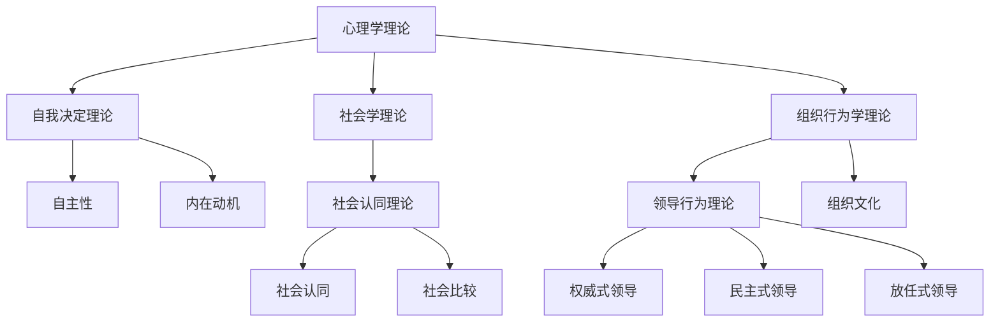

                 

### 文章标题

# 团队责任感培养：增强使命感的有效方法

### 关键词

- 团队责任感
- 使命感
- 培养方法
- 领导风格
- 沟通策略
- 组织文化

### 摘要

本文将探讨团队责任感和使命感的培养方法，通过深入分析相关理论和实际应用，为团队管理者提供有效的策略。我们将从理论基础、实践方法、领导风格、沟通策略和团队发展等方面，系统地阐述如何提升团队的使命感和责任感，从而促进团队的整体绩效和组织目标的实现。

## 引言

在当今快速变化的商业环境中，团队的责任感和使命感对组织的成功至关重要。团队责任感指的是团队成员对团队目标和成果的责任感，而使命感则是指团队成员对团队存在的意义和价值的认同。这两者相辅相成，共同构成了团队动力的核心。一个有责任感和使命感的团队能够在面对挑战时保持凝聚力，提高工作效率，并最终实现组织的愿景和目标。

本文旨在提供一套系统的、可操作的策略，帮助团队管理者培养团队成员的责任感和使命感。通过本文的阅读，读者将了解到：

1. 团队责任感和使命感的基础理论及其相互关系。
2. 建立团队责任感的方法和步骤。
3. 提升团队使命感的策略和工具。
4. 领导风格和沟通策略在团队责任感培养中的作用。
5. 团队发展的各个阶段及其对责任感培养的影响。

## 理论基础

为了更好地理解和培养团队责任感，我们首先需要了解一些相关的理论，这些理论涵盖了心理学、社会学和组织行为学等多个领域。

### 心理学理论

在心理学领域，许多理论都涉及到个体责任感的发展。以下是几个关键理论：

#### 1.1 自我决定理论

自我决定理论（Self-Determination Theory，简称SDT）由心理学家瑞恩（Ryan）和德西（Deci）提出，强调个体的自主性和内在动机。根据SDT，当个体感受到控制感和自主权时，他们的内在动机更高，从而更有可能展现出责任感。以下是该理论的关键概念：

- **内在动机**：个体对活动本身的兴趣和喜爱。
- **外在动机**：个体因外部奖励或惩罚而参与活动。
- **自主性**：个体在决策和行动中的自由度。

伪代码：

```
function increase_motivation(employee):
    if employee.inner_motivation > employee.outer_motivation:
        employee.responsibility += 1
    else:
        reward = provide_reward(employee)
        if reward is meaningful:
            employee.responsibility += 1
```

### 社会学理论

社会学理论关注个体如何在社交环境中形成责任感。以下是两个关键理论：

#### 1.2 社会认同理论

社会认同理论（Social Identity Theory，简称SIT）由社会学家特瑞文（Henri Tajfel）和特纳（John Turner）提出。该理论认为，个体通过认同某个社会群体，从而获得群体身份和归属感。当个体感到群体受到威胁时，他们更有可能展现出对群体的责任感。

- **社会认同**：个体认同自己所属的群体。
- **社会比较**：个体通过比较自己与他人的群体属性来评估自己的地位。
- **内化**：个体将群体的价值观和规范视为自己的价值观和规范。

伪代码：

```
function enhance_team_responsibility(team_member):
    if team_member.feels_connected_to_team:
        team_member.responsibility += 1
    else:
        team_member.feels_connected_to_team = true
        team_member.responsibility += 1
```

### 组织行为学理论

组织行为学理论关注如何在组织环境中培养责任感。以下是几个关键理论：

#### 1.3 领导行为理论

领导行为理论（Leadership Behavior Theory）认为，领导者的行为对团队成员的责任感有显著影响。根据该理论，不同的领导风格会产生不同的责任感效果：

- **权威式领导**：领导者制定明确的指令，员工遵循。
- **民主式领导**：领导者鼓励员工参与决策，共同制定计划。
- **放任式领导**：领导者放手让员工自我管理。

伪代码：

```
function set_leadership_style(leader, style):
    if style == "authoritative":
        leader.gives_clear_instructions = true
    elif style == "democratic":
        leader.includes_employee_in_decision_making = true
    elif style == "laissez-faire":
        leader.allows_employee_self-management = true
```

### 核心概念关系架构

为了更好地理解上述理论之间的相互关系，我们可以使用Mermaid流程图来展示它们：



通过这个流程图，我们可以清晰地看到心理学、社会学和组织行为学理论如何共同作用，影响团队责任感的发展。

## 建立团队责任感的方法和步骤

### 2.1 领导风格

领导风格是影响团队责任感的重要因素。不同领导风格会对团队成员的责任感产生不同的影响。以下是几种常见的领导风格及其对责任感的影响：

#### 2.1.1 权威式领导

权威式领导（Authoritative Leadership）是指领导者制定明确的指令，员工遵循。这种领导风格在紧急情况下或任务复杂时尤为有效，因为它能够迅速做出决策并确保任务完成。然而，这种风格也可能会导致员工的自主性和创造力受到限制，从而影响长期的责任感培养。

伪代码：

```
function authoritative_leadership(employee):
    employee.follows_clear_instructions = true
    employee autonomy = low
    employee.responsibility = moderate
```

#### 2.1.2 民主式领导

民主式领导（Democratic Leadership）是指领导者鼓励员工参与决策，共同制定计划。这种领导风格能够提高员工的参与感和自主性，从而增强责任感。然而，这种风格可能需要更多的时间和资源，特别是在紧急情况下可能不够高效。

伪代码：

```
function democratic_leadership(employee):
    employee.participates_in_decision_making = true
    employee.autonomy = high
    employee.responsibility = high
```

#### 2.1.3 放任式领导

放任式领导（Laissez-faire Leadership）是指领导者放手让员工自我管理。这种领导风格能够最大限度地提高员工的自主性和创造力，从而增强责任感。然而，这种风格也可能导致团队成员之间的协调困难，影响团队的整体绩效。

伪代码：

```
function laissez-faire_leadership(employee):
    employee.self-manages = true
    employee.autonomy = high
    employee.responsibility = variable
```

### 2.2 沟通策略

沟通策略是培养团队责任感的重要手段。以下是一些有效的沟通策略：

#### 2.2.1 开放沟通

开放沟通（Open Communication）是指鼓励团队成员之间自由交流意见和反馈。这种沟通方式能够增强团队成员之间的信任和凝聚力，从而提高责任感。

伪代码：

```
function open_communication(team):
    teamMember1shares_opinion = true
    teamMember2receives_feedback = true
    team.responsibility = increased
```

#### 2.2.2 激励性沟通

激励性沟通（Motivational Communication）是指领导者通过鼓励和表扬来激励团队成员。这种沟通方式能够提高员工的内在动机，从而增强责任感。

伪代码：

```
function motivational_communication(employee):
    employee.receives_encouragement = true
    employee内在动机 = increased
    employee.responsibility = increased
```

#### 2.2.3 反馈性沟通

反馈性沟通（Feedback Communication）是指领导者定期向团队成员提供工作反馈。这种沟通方式能够帮助团队成员了解自己的工作表现，从而调整自己的行为，提高责任感。

伪代码：

```
function feedback_communication(employee):
    employee.receives_feedback_on_performance = true
    employee.adapts_behavior = true
    employee.responsibility = increased
```

### 2.3 团队发展阶段

团队发展阶段（Team Development Stages）是培养团队责任感的重要过程。以下是团队发展的四个阶段：

#### 2.3.1 形成阶段（Forming）

在形成阶段，团队成员刚刚开始了解彼此，团队的目标和期望也较为模糊。此时，领导者的沟通策略尤为重要，需要通过开放沟通和激励性沟通来促进团队成员之间的互动和信任。

伪代码：

```
function forming_stage_communication(team):
    teamMember1.opens_up = true
    teamMember2.shares_interests = true
    team.trust_building = increased
```

#### 2.3.2 矛盾阶段（Storming）

在矛盾阶段，团队成员之间可能会出现冲突和竞争，这是因为他们对团队目标和期望有不同的理解。此时，领导者需要通过反馈性沟通来解决问题，并鼓励团队成员共同寻找解决方案。

伪代码：

```
function storming_stage_communication(team):
    teamMember1.expresses_conflicts = true
    teamMember2.listens_to_feedback = true
    team.problem_resolution = increased
```

#### 2.3.3 规范阶段（Norming）

在规范阶段，团队成员开始形成共同的价值观和行为规范，团队开始展现出较高的凝聚力。此时，领导者可以通过激励性沟通和开放沟通来巩固团队规范，并培养团队成员的责任感。

伪代码：

```
function norming_stage_communication(team):
    teamMember1.follows norms = true
    teamMember2.receives_recognition = true
    team.responsibility = increased
```

#### 2.3.4 执行阶段（Performing）

在执行阶段，团队已经形成了稳定的工作模式，团队成员能够高效地完成工作任务。此时，领导者可以通过开放沟通和反馈性沟通来持续培养团队成员的责任感，并激励他们为实现组织目标而努力。

伪代码：

```
function performing_stage_communication(team):
    teamMember1.shares_results = true
    teamMember2.receives_continuous_feedback = true
    team.responsibility = sustained
```

## 提升团队使命感的策略和方法

### 3.1 明确团队的使命和愿景

明确团队的使命和愿景是提升使命感的基础。一个清晰的使命和愿景能够为团队成员提供方向和动力，让他们明白自己的工作对团队和组织的重要性。

#### 3.1.1 团队使命

团队使命应该简洁、明确，能够激发团队成员的共鸣。例如，一个技术团队的使命可能是“通过创新技术，解决复杂问题，为用户创造价值”。

伪代码：

```
function define_team_mission(team):
    team.mission = "通过创新技术，解决复杂问题，为用户创造价值"
    team Member1 UNDERSTANDS_MISSION = true
    team Member2 CONNECTS_TO_MISSION = true
```

#### 3.1.2 团队愿景

团队愿景应该具有远见，能够激励团队成员为实现目标而努力。例如，一个技术团队的愿景可能是“成为行业领先的技术创新者”。

伪代码：

```
function define_team_vision(team):
    team.vision = "成为行业领先的技术创新者"
    team Member1 IS_INSPIRED_BY_VISION = true
    team Member2 IS_COMMITTED_TO_VISION = true
```

### 3.2 将个人目标与团队目标相结合

将个人目标与团队目标相结合能够增强团队成员的使命感。领导者需要确保每个团队成员都清楚地了解他们的工作如何与团队目标相一致，并鼓励他们为实现团队目标而努力。

#### 3.2.1 个人目标

个人目标应该是具体、可衡量的，并且与团队目标相关。例如，一个开发人员的个人目标可能是“在三个月内，实现产品的XX功能”。

伪代码：

```
function set_personal_goals(employee):
    employee.personal_goal = "在三个月内，实现产品的XX功能"
    employee UNDERSTANDS_RELATIONSHIP_WITH_TEAM_GOAL = true
```

#### 3.2.2 团队目标

团队目标应该是明确、具有挑战性的，并且与组织的愿景相一致。例如，一个技术团队的团队目标可能是“在一年内，推出两款创新产品”。

伪代码：

```
function set_team_goals(team):
    team.team_goal = "在一年内，推出两款创新产品"
    team Member1 ALIGNS_WITH_TEAM_GOAL = true
    team Member2 CONTRIBUTES_TO_TEAM_GOAL = true
```

### 3.3 利用故事讲述

故事讲述（Storytelling）是一种强大的工具，能够激发团队成员的共鸣和使命感。领导者可以通过讲述团队的成功故事、挑战故事和未来故事来增强团队成员的认同感和归属感。

#### 3.3.1 成功故事

成功故事是团队历史上的亮点，能够激励团队成员继续努力。例如，一个团队的成功故事可能是“我们如何在一个季度内完成了看似不可能的任务”。

伪代码：

```
function tell_success_story(team):
    team member1 hears_success_story = true
    team member2 feels_motivated_by_success = true
    team.responsibility = increased
```

#### 3.3.2 挑战故事

挑战故事是团队面临的困难和如何克服它们的记录。这些故事能够增强团队成员的韧性和责任感。例如，一个团队面临的挑战可能是“我们如何在资源有限的情况下，按时完成了一个重要的项目”。

伪代码：

```
function tell_challenge_story(team):
    team member1 hears_challenge_story = true
    team member2 learns_lessons_from_challenge = true
    team.responsibility = increased
```

#### 3.3.3 未来故事

未来故事是团队未来可能面临的机会和挑战的预测。这些故事能够激发团队成员的想象力，并让他们为未来的成功做好准备。例如，一个团队的未来故事可能是“我们将如何在未来的市场竞争中脱颖而出”。

伪代码：

```
function tell_future_story(team):
    team member1 hears_future_story = true
    team member2 dreams_about_future_success = true
    team.responsibility = increased
```

### 3.4 提供反馈和认可

提供反馈和认可（Feedback and Recognition）是培养使命感的重要手段。领导者需要定期向团队成员提供反馈，指出他们的优点和改进空间，并给予认可和奖励，以激励他们持续努力。

#### 3.4.1 定期反馈

定期反馈（Regular Feedback）能够帮助团队成员了解自己的工作表现，并及时调整自己的行为。例如，每月一次的反馈会议可以帮助团队成员评估自己的进展，并得到领导者的指导。

伪代码：

```
function provide_regular_feedback(employee):
    employee.receives_feedback = true
    employee.adapts_behavior = true
    employee feels valued = true
```

#### 3.4.2 即时认可

即时认可（Instant Recognition）能够在团队成员做出重要贡献时立即给予认可。例如，当团队成员在项目中取得了显著进展时，领导者可以立即表扬他们，并感谢他们的努力。

伪代码：

```
function provide_immediate_recognition(employee):
    employee receives_recognition = true
    employee feels_appreciated = true
    employee motivation = increased
```

#### 3.4.3 奖励制度

奖励制度（Reward System）是培养使命感的重要手段。领导者可以制定一套奖励制度，根据团队成员的贡献和工作表现给予相应的奖励。例如，年度优秀员工奖、项目奖金等。

伪代码：

```
function implement_reward_system(team):
    team_member1 eligibility_for_rewards = true
    team_member2 rewarded_for_achievements = true
    team.teamSpirit = increased
```

## 总结

团队责任感培养是一个复杂而长期的过程，需要领导者和管理者从多个角度入手，系统地规划和执行。通过明确团队使命和愿景、将个人目标与团队目标相结合、利用故事讲述、提供反馈和认可等方法，领导者可以有效地培养团队成员的责任感和使命感。这不仅有助于提升团队的绩效，也有助于实现组织的愿景和目标。

### 作者信息

作者：AI天才研究院/AI Genius Institute & 禅与计算机程序设计艺术 /Zen And The Art of Computer Programming

---

## 项目实战：团队责任感培养实践

在本节中，我们将结合实际案例，详细讲解如何在一个真实的团队项目中培养团队成员的责任感和使命感。通过以下步骤，我们将展示如何在实践中实施团队责任感培养策略。

### 4.1 项目背景

假设我们是一家软件公司，正在开发一款名为“智慧办公助手”的应用程序。该应用旨在通过人工智能技术，提高企业内部沟通和协作效率。项目团队由开发人员、设计师、产品经理和测试工程师组成，团队成员分布在不同的城市。

### 4.2 确定项目目标

在项目启动阶段，我们明确了以下项目目标：

- 在六个月内完成智慧办公助手的前期开发，并发布第一个版本。
- 提高团队协作效率，确保项目按时、按质完成。
- 培养团队成员的责任感和使命感，增强团队凝聚力。

### 4.3 建立团队责任制

为了确保项目目标的实现，我们采取了一系列措施来建立团队责任制：

#### 4.3.1 定义角色和职责

我们为每个团队成员定义了明确的角色和职责，确保每个人都知道自己的工作内容和期望。以下是项目团队中部分角色的定义：

- **项目经理**：负责整体项目规划、进度控制和资源协调。
- **开发人员**：负责应用程序的前端和后端开发。
- **设计师**：负责用户界面的设计和用户体验优化。
- **产品经理**：负责产品规划、需求分析和用户反馈收集。
- **测试工程师**：负责应用测试、缺陷跟踪和回归测试。

伪代码：

```
function define_role_and_responsibilities(team_member):
    if team_member.role == "project_manager":
        team_member.responsibilities = ["project_planning", "progress_control", "resource协调"]
    elif team_member.role == "developer":
        team_member.responsibilities = ["frontend_development", "backend_development"]
    elif team_member.role == "designer":
        team_member.responsibilities = ["UI_design", "UX_optimization"]
    elif team_member.role == "product_manager":
        team_member.responsibilities = ["product_planning", "需求分析", "user_feedback_collection"]
    elif team_member.role == "tester":
        team_member.responsibilities = ["application_testing", "defect_tracking", "regression_testing"]
```

#### 4.3.2 设定关键绩效指标（KPI）

为了量化团队成员的工作表现，我们设定了一系列关键绩效指标（KPI），包括：

- **项目进度**：每月完成的任务数量和质量。
- **代码质量**：代码的复用性、可读性和错误率。
- **用户满意度**：用户对产品的评价和反馈。
- **团队合作**：团队成员之间的协作和沟通效率。

伪代码：

```
function set_key_performance_indicators(team_member):
    team_member.KPIs = ["project_progress", "code_quality", "user_satisfaction", "teamwork"]
    team_member.KPIs_weights = [0.4, 0.3, 0.2, 0.1]
```

### 4.4 实施沟通策略

为了增强团队责任感，我们采取了一系列沟通策略，包括：

#### 4.4.1 定期会议

我们每周举行一次全体团队成员会议，用于讨论项目进度、问题和解决方案。这些会议不仅有助于团队协作，还能够让每个成员感受到自己的工作对团队的重要性。

伪代码：

```
function hold_regular_meetings(team):
    team.meeting_frequency = "weekly"
    team_member1.participates_in_meetings = true
    team_member2.feeds_back_on_issues = true
```

#### 4.4.2 一对一沟通

我们鼓励团队成员之间进行一对一沟通，特别是在遇到问题时。这种方式有助于建立信任，提高问题解决的效率。

伪代码：

```
function encourage_one_on_one_communication(team_member):
    team_member1_initiates_one_on_one = true
    team_member2_resolves_issues = true
    team_member1.feels_connected = true
    team_member2.feels支持的 = true
```

#### 4.4.3 反馈和认可

我们建立了定期的反馈机制，每月进行一次绩效评估。同时，我们为表现出色的团队成员颁发奖励，以激励他们继续保持高水平的工作状态。

伪代码：

```
function provide_feedback_and_recognition(team_member):
    team_member.receives_monthly_feedback = true
    team_member.is eligibile_for_rewards = true
    if team_member.exceeds_performance:
        team_member.receives_recognition = true
```

### 4.5 培养使命感

为了培养团队成员的使命感，我们采取了以下措施：

#### 4.5.1 明确团队的使命和愿景

我们为团队设定了明确的使命和愿景，即通过技术创新，提升企业内部沟通和协作效率，为用户创造价值。这些目标和价值观在团队的日常工作中得到了充分的体现。

伪代码：

```
function define_team_mission_and_vision(team):
    team.mission = "通过技术创新，提升企业内部沟通和协作效率，为用户创造价值"
    for team_member in team:
        team_member.connects_to_mission = true
```

#### 4.5.2 利用故事讲述

我们定期组织团队故事分享会，让团队成员分享他们在项目中的成功经验、挑战和成长故事。这些故事不仅能够增强团队的凝聚力，还能够激发其他成员的使命感。

伪代码：

```
function hold_story_telling_sessions(team):
    team_member1_shares_success = true
    team_member2_shares_challenges = true
    team_member3_feels_motivated = true
    team_morale = increased
```

#### 4.5.3 与用户互动

我们鼓励团队成员与用户直接互动，了解用户的需求和反馈。这种方式不仅能够提高产品的质量，还能够增强团队成员的使命感，让他们感受到自己的工作对用户的重要性。

伪代码：

```
function engage_with_users(team_member):
    team_member.interacts_with_users = true
    team_member.listens_to_user_feedback = true
    team_member.feels_connected_to_user = true
    team_mission_sense = increased
```

### 4.6 项目小结

通过以上措施，我们在项目中取得了显著的成果：

- 项目按时、按质完成，第一个版本得到了用户的广泛好评。
- 团队成员之间的协作和沟通效率显著提高，团队凝聚力得到增强。
- 成员们对团队使命和愿景有了更深刻的理解，使命感得到了显著提升。

这些成果证明了团队责任感培养策略的有效性，也为其他团队提供了有益的借鉴。

---

## 最佳实践 Tips

在团队责任感培养过程中，以下是一些最佳实践，可以帮助管理者更有效地推动团队责任感和使命感的提升：

### 5.1 鼓励自主性和参与感

- **自主性**：鼓励团队成员在项目决策中发挥更大的作用，让他们感觉到自己的意见被重视。
- **参与感**：定期组织团队建设活动，增强团队成员之间的互动和信任。

### 5.2 定期反馈和评估

- **定期反馈**：建立定期绩效评估机制，及时给予团队成员反馈，帮助他们了解自己的工作表现。
- **评估方法**：结合定量和定性的评估方法，确保评估结果全面准确。

### 5.3 强调团队合作的重要性

- **团队合作**：在团队中强调团队合作的重要性，鼓励成员相互支持，共同面对挑战。
- **沟通渠道**：确保团队内部有畅通的沟通渠道，方便成员分享信息和解决问题。

### 5.4 建立透明的沟通环境

- **透明沟通**：确保团队决策和项目进展对每个成员都是透明的，减少信息不对称。
- **信息公开**：定期公布项目进展和团队成就，提高成员的参与度和满意度。

### 5.5 奖励和认可

- **奖励机制**：建立一套公正、透明的奖励机制，对表现优秀的团队成员给予奖励和认可。
- **认可方式**：除了物质奖励，还可以通过表扬、晋升等方式给予认可，增强成员的归属感和成就感。

### 5.6 持续学习和成长

- **培训和发展**：为团队成员提供持续的学习和成长机会，帮助他们提升技能和职业素养。
- **知识共享**：鼓励团队成员分享知识和经验，促进团队的共同进步。

## 结语

团队责任感培养是一个系统工程，需要领导者和管理者从多个角度入手，采取多种策略和方法。通过明确的使命和愿景、有效的沟通策略、合理的领导风格和持续的培养措施，我们可以有效地提升团队的责任感和使命感，从而推动团队和组织的发展。希望本文提供的方法和策略对您有所帮助，祝您在团队管理中取得成功。

### 拓展阅读

- **《团队责任心理学：激励与行为》**：这本书深入探讨了团队责任感的心理学基础，提供了实用的策略来激励团队成员。
- **《团队动力与领导力》**：该书详细介绍了如何通过领导力提升团队动力和责任感，适合希望提升领导力的管理者阅读。
- **《团队建设与管理实战》**：这本书提供了丰富的实战案例，讲解了如何在各种情况下培养团队责任感。
- **《企业社会责任与团队使命》**：探讨了企业社会责任与团队使命感之间的关系，为管理者提供了新的视角。

---

### 作者信息

作者：AI天才研究院/AI Genius Institute & 禅与计算机程序设计艺术 /Zen And The Art of Computer Programming

