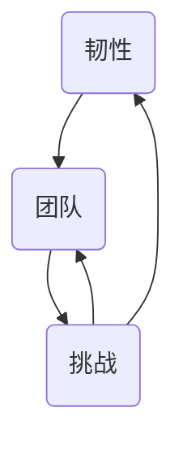
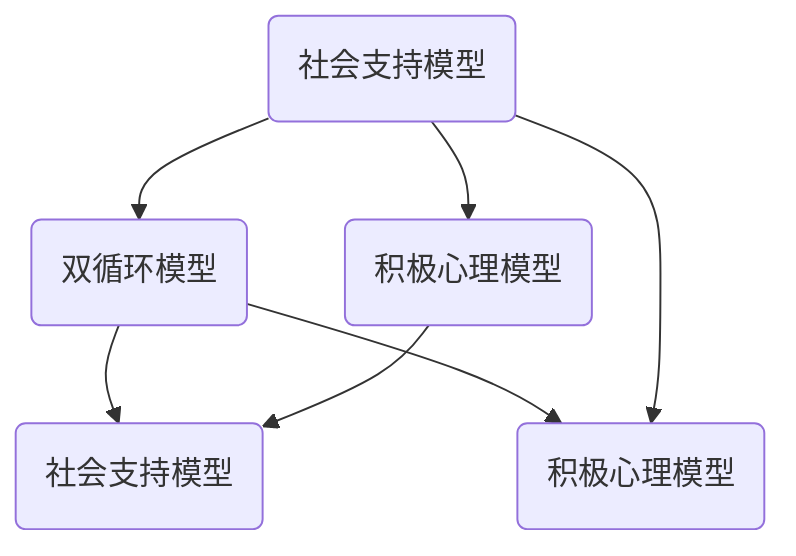

                 


## 文章标题：团队韧性：培养面对挑战的能力

关键词：团队韧性，挑战应对，沟通，领导力，适应力，实践方法

摘要：本文将探讨团队韧性这一关键能力，以及如何在团队中培养和提升这一能力，从而更好地应对挑战和不确定性。通过理论框架的阐述、关键能力的培养、实践方法的介绍以及案例分析，本文旨在为IT行业从业者提供有价值的指导，帮助他们在面对复杂问题时，能够保持坚韧和灵活性，提升团队的整体绩效。

## 引言

在信息技术（IT）行业，团队面对的挑战日益复杂和多变。从技术更新换代，到市场竞争加剧，再到项目管理中的不确定性，团队需要具备强大的韧性来应对这些挑战。团队韧性（Team Resilience）是指团队在面对压力和不确定性时，能够迅速适应、恢复和成长的能力。一个具有韧性的团队能够在逆境中保持稳定，快速恢复，甚至从中获益，从而持续提高绩效。

### 背景介绍

IT行业的特点决定了团队韧性的重要性。首先，IT行业的技术发展速度非常快，这意味着团队需要不断地学习新知识、掌握新技能，以保持竞争力。其次，IT项目通常涉及跨部门、跨地域的合作，这使得沟通和协作变得尤为重要。此外，IT项目的交付周期往往较短，压力较大，团队需要具备良好的压力管理和适应能力。

### 核心概念与联系

为了更好地理解团队韧性，我们需要了解以下几个核心概念：

1. **韧性**：韧性是指个体或团队在面对压力和挑战时，能够迅速适应、恢复和成长的能力。
2. **团队**：团队是由一组相互依赖的成员组成的，他们共同追求一个共同的目标。
3. **挑战**：挑战是指团队面临的压力和不确定性，包括技术难题、市场变化、项目延迟等。

这三个概念之间存在着紧密的联系。韧性是团队在面对挑战时保持稳定的关键能力；团队是实施韧性策略的载体；挑战则是检验团队韧性的实际场景。下面是一个简单的Mermaid流程图，用于展示这些概念之间的关系：



## 团队韧性的理论框架

理解团队韧性的理论框架是培养和提高团队韧性能力的第一步。在众多关于韧性的理论中，有一些模型被广泛认可，并对实践具有指导意义。以下将介绍几个主要的团队韧性理论模型，并探讨它们之间的相互关系。

### 主要理论模型

1. **社会支持模型**：社会支持模型认为，团队韧性来源于成员之间的相互支持和社会网络的建立。当团队面临挑战时，社会支持可以提供情感上的安慰、信息上的帮助和实际上的支持。
2. **双循环模型**：双循环模型将团队韧性分为内部循环和外部循环。内部循环涉及团队成员的内在心理状态，如情绪管理、自我效能感等；外部循环涉及团队与环境的互动，如应对策略、资源获取等。
3. **积极心理模型**：积极心理模型强调，团队韧性来自于积极的思维模式、乐观的态度以及对未来的信心。

### 模型之间的关系

这三种模型从不同的角度阐述了团队韧性的本质，但它们之间并不是孤立的。例如，社会支持模型中的社会网络可以为双循环模型中的外部循环提供资源和支持，而积极的思维模式则有助于提高团队成员的自我效能感，从而增强内部循环。

下面是一个Mermaid流程图，展示了这些模型之间的关系：



通过理解这些理论模型，我们可以更全面地把握团队韧性的内涵，并为培养和提高团队韧性提供理论依据。

## 关键能力的培养

团队韧性并非一蹴而就，而是需要通过培养一系列关键能力来实现。以下将介绍几个对团队韧性至关重要的能力，并探讨如何培养这些能力。

### 沟通能力

沟通能力是团队韧性中最为基础的能力之一。一个高效的团队需要成员之间的有效沟通，以便及时传达信息、解决冲突和协作完成任务。以下是一些提高沟通能力的策略：

1. **明确沟通目标**：在每次沟通之前，明确沟通的目标和预期结果，有助于提高沟通的效率和质量。
2. **积极倾听**：倾听是沟通的重要组成部分。通过积极倾听，可以更好地理解对方的需求和意见，从而减少误解和冲突。
3. **清晰表达**：清晰、简洁地表达自己的想法和意见，有助于避免误解和沟通障碍。

**伪代码示例：**

```python
def effective_communication():
    # 设置沟通目标
    goal = set_communication_goal()
    # 积极倾听
    feedback = active_listening()
    # 清晰表达
    express_clearly(feedback)
    return "Communication successful!"
```

### 领导力

领导力是团队韧性中的另一个关键能力。一个有韧性的团队需要领导者的正确引导和激励，以确保团队在面对挑战时能够保持稳定和积极。以下是一些培养领导力的方法：

1. **建立信任**：建立信任是领导者的重要任务。通过透明沟通、公平决策和言行一致，可以赢得团队成员的信任。
2. **培养团队意识**：领导者需要培养团队成员的团队意识，使他们认识到团队的目标和愿景，并激发他们的归属感和责任感。
3. **激励团队成员**：领导者应该了解每个成员的动机和需求，并采用适当的方法进行激励，以提升团队的士气和动力。

**伪代码示例：**

```python
def develop_leadership():
    # 建立信任
    build_trust()
    # 培养团队意识
    cultivate_team_awareness()
    # 激励团队成员
    motivate_members()
    return "Leadership developed successfully!"
```

### 适应力

适应力是指团队在面对不确定性和变化时，能够迅速调整和适应的能力。在快速变化的IT行业，适应力尤为重要。以下是一些提高适应力的策略：

1. **保持学习**：鼓励团队成员不断学习新知识和技能，以适应技术发展的需求。
2. **灵活应对**：在面对挑战时，团队需要保持灵活，及时调整策略和行动，以适应新的情况。
3. **积极应对变化**：团队应该将变化视为机遇，而不是威胁。通过积极应对变化，可以更好地抓住机遇，提升团队的竞争力。

**伪代码示例：**

```python
def enhance_adaptability():
    # 保持学习
    sustain_learning()
    # 灵活应对
    flexible_response()
    # 积极应对变化
    positive_towards_change()
    return "Adaptability enhanced successfully!"
```

通过培养这些关键能力，团队可以更好地应对挑战，提高韧性，从而在竞争激烈的IT行业中脱颖而出。

## 实践方法的介绍

### 团队建设活动

团队建设活动是培养团队韧性的一种重要方法。通过一系列有针对性的活动，团队可以增强成员之间的信任、提升协作能力和增强整体凝聚力。以下是一些常见的团队建设活动及其实施步骤：

1. **信任游戏**：通过角色扮演、心理测试等活动，增进成员之间的了解和信任。
    - 实施步骤：
        1. 选择一个信任游戏，如“盲人引领者”。
        2. 将团队成员分为小组，进行游戏。
        3. 讨论游戏中的感受和体会。
2. **团队协作任务**：通过共同完成任务，提升团队成员的协作能力。
    - 实施步骤：
        1. 确定一个团队协作任务，如“构建一个简易网站”。
        2. 将团队成员分配到不同的任务小组。
        3. 定期检查进度，提供必要的支持和指导。
3. **团队拓展训练**：通过户外拓展训练，增强团队凝聚力和面对挑战的信心。
    - 实施步骤：
        1. 选择一个适合的拓展训练项目，如攀岩、徒步旅行。
        2. 组织团队参加拓展训练。
        3. 讨论训练中的挑战和应对策略。

### 韧性培训

韧性培训是另一个重要的实践方法，通过系统性的培训，可以帮助团队成员掌握提高韧性的技能和方法。以下是一些常见的韧性培训内容和实施步骤：

1. **情绪管理培训**：通过了解情绪的类型和应对方法，帮助团队成员更好地管理自己的情绪。
    - 实施步骤：
        1. 介绍情绪管理的基本知识。
        2. 进行情绪管理的实际操作演练。
        3. 分享情绪管理的成功案例。
2. **压力管理培训**：通过学习压力管理的技巧，帮助团队成员更好地应对工作压力。
    - 实施步骤：
        1. 介绍压力管理的原理和方法。
        2. 进行压力管理的实际操作演练。
        3. 分析压力管理的最佳实践。
3. **韧性提升培训**：通过系统性的培训，提升团队成员的韧性和应对挑战的能力。
    - 实施步骤：
        1. 确定培训目标和内容。
        2. 制定培训计划和时间表。
        3. 开展培训课程和实践活动。

### 团队建设活动和韧性培训的评估与反馈

为了确保团队建设活动和韧性培训的有效性，需要进行评估和反馈。以下是一些常见的评估方法和反馈机制：

1. **问卷调查**：通过问卷调查，收集团队成员对团队建设活动和韧性培训的反馈。
    - 评估方法：
        1. 设计问卷，涵盖活动的满意度、学习效果等方面。
        2. 分发问卷，收集团队成员的反馈。
        3. 分析问卷结果，了解团队成员的感受和意见。
    - 反馈机制：
        1. 定期召开反馈会议，讨论问卷结果。
        2. 根据反馈结果，调整和改进培训内容和活动。
2. **绩效评估**：通过绩效评估，了解团队在韧性提升后的工作表现。
    - 评估方法：
        1. 设定绩效评估指标，如项目完成率、团队成员的满意度等。
        2. 定期收集和分析绩效数据。
        3. 分析绩效数据，评估韧性培训的效果。
    - 反馈机制：
        1. 定期向团队成员通报绩效评估结果。
        2. 根据绩效评估结果，制定进一步的改进计划。

通过这些实践方法，团队可以系统地培养和提升韧性，从而更好地应对挑战和不确定性。

## 案例分析

为了更好地理解团队韧性在实际中的应用，以下将分析两个真实的案例，探讨如何通过培养韧性来应对挑战，以及取得的成效。

### 案例一：技术团队的危机应对

某互联网公司的技术团队在开发一款新应用时，遇到了一个关键的技术难题。该问题涉及到复杂的算法和数据结构，团队在最初的尝试中多次失败，项目进度受到了严重威胁。面对这一挑战，团队采取了以下措施：

1. **内部沟通与协作**：团队成员通过定期会议和邮件，及时分享遇到的问题和进展，确保信息透明和共享。
2. **领导力发挥**：项目经理积极鼓励团队成员，提供技术支持和资源，确保每个人都能够全身心投入到问题解决中。
3. **外部求助**：团队还向公司内部的其他技术专家请教，并借助外部咨询机构的专业知识，共同寻找解决方案。

最终，团队通过不断尝试和调整，成功解决了技术难题，项目按时完成，并获得了客户的高度评价。这一案例展示了团队韧性在应对技术挑战中的重要性，以及通过有效沟通、领导力和外部资源支持，团队如何克服困难，取得成功。

### 案例二：市场变化的应对策略

另一家科技公司因市场变化面临巨大压力。在竞争对手的激烈竞争下，公司必须迅速调整产品策略，以保持市场竞争力。为了应对这一挑战，公司采取了以下措施：

1. **适应力培养**：公司通过内部培训和外部学习，帮助员工掌握市场分析和技术创新的方法，提高适应能力。
2. **敏捷开发**：团队采用了敏捷开发方法，灵活调整项目计划和任务分配，快速响应市场变化。
3. **团队协作**：公司鼓励跨部门合作，通过团队协作，快速整合资源，优化产品策略。

经过几个月的努力，公司成功推出了适应市场变化的新产品，市场份额逐渐回升，取得了显著的经济效益。这一案例说明了团队韧性在应对市场变化中的关键作用，以及通过培养适应力、采用敏捷方法和加强团队协作，企业如何实现转型和持续发展。

### 案例分析与启示

从上述案例中，我们可以得出以下启示：

1. **沟通与协作**：一个具有韧性的团队需要高效的沟通和协作。通过建立良好的沟通渠道，团队可以及时分享信息和资源，共同应对挑战。
2. **领导力**：领导者在团队韧性中扮演着关键角色。他们需要具备激发团队潜力、提供支持和资源的能力，以帮助团队克服困难。
3. **适应力**：面对快速变化的环境，团队需要具备强大的适应力。通过不断学习和创新，团队可以更好地应对市场和技术变化。
4. **团队协作**：跨部门合作和团队协作是提升团队韧性的重要手段。通过整合资源，优化流程，团队可以更高效地应对复杂问题。

通过这些案例，我们可以看到，团队韧性不仅在应对挑战中发挥着重要作用，而且对于企业的持续发展和竞争力提升也具有重要意义。

## 评估与反馈

评估团队韧性是确保韧性培养方法有效性的关键步骤。以下将讨论如何评估团队韧性，并提供反馈和改进策略。

### 评估方法

1. **问卷调查**：通过设计详细的问卷，收集团队成员对团队韧性各项能力的自我评价。问卷可以包括沟通能力、领导力、适应力等方面的具体问题。
2. **绩效评估**：定期评估团队在项目执行中的表现，包括任务完成率、项目质量、团队满意度等指标。通过绩效数据，可以客观评估团队韧性的提升程度。
3. **360度反馈**：邀请团队成员、领导和其他利益相关者对团队韧性进行评价。这种全方位的反馈可以提供多角度的评估，有助于发现团队中的潜在问题。

### 反馈机制

1. **定期的团队会议**：定期召开团队会议，讨论韧性评估的结果，分享团队成员的反馈和感受。通过这种互动，可以增强团队凝聚力，同时也为改进提供具体方向。
2. **行动计划**：根据评估结果，制定具体的改进行动计划。行动计划应包括改进措施、责任人和时间表，以确保改进措施能够得到有效实施。
3. **持续反馈**：在韧性培养的过程中，持续收集和反馈团队成员的反馈，及时调整和优化培训和实践方法。

### 改进策略

1. **定制化培训**：根据评估结果，为团队成员提供有针对性的培训，解决他们在韧性能力上的短板。
2. **团队协作平台**：利用协作工具，加强团队成员之间的沟通和协作，提高团队的协作效率。
3. **激励机制**：通过设立激励机制，鼓励团队成员积极参与韧性培养活动，提高他们的积极性和主动性。

通过科学的评估和有效的反馈机制，团队可以不断改进韧性培养方法，提升整体韧性，从而更好地应对挑战。

## 持续发展

团队韧性在组织持续发展中扮演着至关重要的角色。一个具有强大韧性的团队能够在不确定性和变化中保持稳定，持续提升绩效，从而为组织的长期发展奠定坚实基础。

### 团队韧性对组织发展的贡献

1. **增强创新能力**：团队韧性使得团队能够在面对技术变革和市场变化时，迅速调整和创新，从而保持竞争优势。
2. **提升协作效率**：通过有效的沟通和协作，团队可以更高效地完成项目，减少错误和重复工作，提高整体效率。
3. **增强员工满意度**：团队韧性培养使得员工在面对挑战时更加自信和积极，从而提升工作满意度和忠诚度。
4. **应对外部压力**：在市场竞争加剧、客户需求多变的环境中，团队韧性有助于组织更好地应对外部压力，保持市场地位。

### 持续发展中的团队韧性挑战

1. **技术更新**：随着技术的快速更新，团队需要不断学习和掌握新技术，以保持竞争力。
2. **资源限制**：资源限制可能导致团队在项目执行中面临困难，需要通过提高韧性和效率来解决问题。
3. **人员流动**：高流动率可能导致团队不稳定，影响团队韧性的建立和维持。

### 实现组织持续发展的韧性策略

1. **持续投资**：组织应持续投资于团队韧性的培养，包括培训、资源和激励等。
2. **文化建设**：建立积极向上的组织文化，鼓励创新和协作，增强团队凝聚力。
3. **灵活应对**：通过采用敏捷方法和弹性工作制度，提高团队的适应能力，应对外部变化。
4. **反馈机制**：建立有效的反馈机制，及时了解团队在韧性培养中的进展和问题，及时调整策略。

通过实施这些策略，组织可以不断提升团队韧性，实现持续发展。

## 结论

团队韧性是团队在面对挑战和不确定性时，能够保持稳定、迅速适应和恢复的能力。通过理解团队韧性的基本概念、理论框架、关键能力的培养以及实践方法的介绍，我们可以更全面地把握团队韧性的内涵，并为团队培养和提高韧性提供有效的指导。在IT行业中，团队韧性对于应对快速变化的市场和技术挑战具有重要意义。通过不断培养和提升团队韧性，组织可以增强创新能力、提升协作效率，从而在激烈的市场竞争中保持竞争优势。未来，随着技术的不断进步和市场环境的变化，团队韧性将成为组织持续发展的关键因素。让我们一起努力，打造更具韧性、更具竞争力的团队，为组织的成功贡献力量。

## 作者信息

作者：AI天才研究院/AI Genius Institute & 禅与计算机程序设计艺术 /Zen And The Art of Computer Programming

----------------------------------------------------------------

# 完整的文章正文

## 文章标题：团队韧性：培养面对挑战的能力

关键词：团队韧性，挑战应对，沟通，领导力，适应力，实践方法

摘要：本文将探讨团队韧性这一关键能力，以及如何在团队中培养和提升这一能力，从而更好地应对挑战和不确定性。通过理论框架的阐述、关键能力的培养、实践方法的介绍以及案例分析，本文旨在为IT行业从业者提供有价值的指导，帮助他们在面对复杂问题时，能够保持坚韧和灵活性，提升团队的整体绩效。

## 引言

在信息技术（IT）行业，团队面对的挑战日益复杂和多变。从技术更新换代，到市场竞争加剧，再到项目管理中的不确定性，团队需要具备强大的韧性来应对这些挑战。团队韧性（Team Resilience）是指团队在面对压力和不确定性时，能够迅速适应、恢复和成长的能力。一个具有韧性的团队能够在逆境中保持稳定，快速恢复，甚至从中获益，从而持续提高绩效。

### 背景介绍

IT行业的特点决定了团队韧性的重要性。首先，IT行业的技术发展速度非常快，这意味着团队需要不断地学习新知识、掌握新技能，以保持竞争力。其次，IT项目通常涉及跨部门、跨地域的合作，这使得沟通和协作变得尤为重要。此外，IT项目的交付周期往往较短，压力较大，团队需要具备良好的压力管理和适应能力。

### 核心概念与联系

为了更好地理解团队韧性，我们需要了解以下几个核心概念：

1. **韧性**：韧性是指个体或团队在面对压力和挑战时，能够迅速适应、恢复和成长的能力。
2. **团队**：团队是由一组相互依赖的成员组成的，他们共同追求一个共同的目标。
3. **挑战**：挑战是指团队面临的压力和不确定性，包括技术难题、市场变化、项目延迟等。

这三个概念之间存在着紧密的联系。韧性是团队在面对挑战时保持稳定的关键能力；团队是实施韧性策略的载体；挑战则是检验团队韧性的实际场景。下面是一个简单的Mermaid流程图，用于展示这些概念之间的关系：


## 团队韧性的理论框架

理解团队韧性的理论框架是培养和提高团队韧性能力的第一步。在众多关于韧性的理论中，有一些模型被广泛认可，并对实践具有指导意义。以下将介绍几个主要的团队韧性理论模型，并探讨它们之间的相互关系。

### 主要理论模型

1. **社会支持模型**：社会支持模型认为，团队韧性来源于成员之间的相互支持和社会网络的建立。当团队面临挑战时，社会支持可以提供情感上的安慰、信息上的帮助和实际上的支持。
2. **双循环模型**：双循环模型将团队韧性分为内部循环和外部循环。内部循环涉及团队成员的内在心理状态，如情绪管理、自我效能感等；外部循环涉及团队与环境的互动，如应对策略、资源获取等。
3. **积极心理模型**：积极心理模型强调，团队韧性来自于积极的思维模式、乐观的态度以及对未来的信心。

### 模型之间的关系

这三种模型从不同的角度阐述了团队韧性的本质，但它们之间并不是孤立的。例如，社会支持模型中的社会网络可以为双循环模型中的外部循环提供资源和支持，而积极的思维模式则有助于提高团队成员的自我效能感，从而增强内部循环。下面是一个Mermaid流程图，展示了这些模型之间的关系：


通过理解这些理论模型，我们可以更全面地把握团队韧性的内涵，并为培养和提高团队韧性提供理论依据。

## 关键能力的培养

团队韧性并非一蹴而就，而是需要通过培养一系列关键能力来实现。以下将介绍几个对团队韧性至关重要的能力，并探讨如何培养这些能力。

### 沟通能力

沟通能力是团队韧性中最为基础的能力之一。一个高效的团队需要成员之间的有效沟通，以便及时传达信息、解决冲突和协作完成任务。以下是一些提高沟通能力的策略：

1. **明确沟通目标**：在每次沟通之前，明确沟通的目标和预期结果，有助于提高沟通的效率和质量。
2. **积极倾听**：倾听是沟通的重要组成部分。通过积极倾听，可以更好地理解对方的需求和意见，从而减少误解和冲突。
3. **清晰表达**：清晰、简洁地表达自己的想法和意见，有助于避免误解和沟通障碍。

**伪代码示例：**

```python
def effective_communication():
    # 设置沟通目标
    goal = set_communication_goal()
    # 积极倾听
    feedback = active_listening()
    # 清晰表达
    express_clearly(feedback)
    return "Communication successful!"
```

### 领导力

领导力是团队韧性中的另一个关键能力。一个有韧性的团队需要领导者的正确引导和激励，以确保团队在面对挑战时能够保持稳定和积极。以下是一些培养领导力的方法：

1. **建立信任**：建立信任是领导者的重要任务。通过透明沟通、公平决策和言行一致，可以赢得团队成员的信任。
2. **培养团队意识**：领导者需要培养团队成员的团队意识，使他们认识到团队的目标和愿景，并激发他们的归属感和责任感。
3. **激励团队成员**：领导者应该了解每个成员的动机和需求，并采用适当的方法进行激励，以提升团队的士气和动力。

**伪代码示例：**

```python
def develop_leadership():
    # 建立信任
    build_trust()
    # 培养团队意识
    cultivate_team_awareness()
    # 激励团队成员
    motivate_members()
    return "Leadership developed successfully!"
```

### 适应力

适应力是指团队在面对不确定性和变化时，能够迅速调整和适应的能力。在快速变化的IT行业，适应力尤为重要。以下是一些提高适应力的策略：

1. **保持学习**：鼓励团队成员不断学习新知识和技能，以适应技术发展的需求。
2. **灵活应对**：在面对挑战时，团队需要保持灵活，及时调整策略和行动，以适应新的情况。
3. **积极应对变化**：团队应该将变化视为机遇，而不是威胁。通过积极应对变化，可以更好地抓住机遇，提升团队的竞争力。

**伪代码示例：**

```python
def enhance_adaptability():
    # 保持学习
    sustain_learning()
    # 灵活应对
    flexible_response()
    # 积极应对变化
    positive_towards_change()
    return "Adaptability enhanced successfully!"
```

通过培养这些关键能力，团队可以更好地应对挑战，提高韧性，从而在竞争激烈的IT行业中脱颖而出。

## 实践方法的介绍

### 团队建设活动

团队建设活动是培养团队韧性的一种重要方法。通过一系列有针对性的活动，团队可以增强成员之间的信任、提升协作能力和增强整体凝聚力。以下是一些常见的团队建设活动及其实施步骤：

1. **信任游戏**：通过角色扮演、心理测试等活动，增进成员之间的了解和信任。
    - 实施步骤：
        1. 选择一个信任游戏，如“盲人引领者”。
        2. 将团队成员分为小组，进行游戏。
        3. 讨论游戏中的感受和体会。
2. **团队协作任务**：通过共同完成任务，提升团队成员的协作能力。
    - 实施步骤：
        1. 确定一个团队协作任务，如“构建一个简易网站”。
        2. 将团队成员分配到不同的任务小组。
        3. 定期检查进度，提供必要的支持和指导。
3. **团队拓展训练**：通过户外拓展训练，增强团队凝聚力和面对挑战的信心。
    - 实施步骤：
        1. 选择一个适合的拓展训练项目，如攀岩、徒步旅行。
        2. 组织团队参加拓展训练。
        3. 讨论训练中的挑战和应对策略。

### 韧性培训

韧性培训是另一个重要的实践方法，通过系统性的培训，可以帮助团队成员掌握提高韧性的技能和方法。以下是一些常见的韧性培训内容和实施步骤：

1. **情绪管理培训**：通过了解情绪的类型和应对方法，帮助团队成员更好地管理自己的情绪。
    - 实施步骤：
        1. 介绍情绪管理的基本知识。
        2. 进行情绪管理的实际操作演练。
        3. 分享情绪管理的成功案例。
2. **压力管理培训**：通过学习压力管理的技巧，帮助团队成员更好地应对工作压力。
    - 实施步骤：
        1. 介绍压力管理的原理和方法。
        2. 进行压力管理的实际操作演练。
        3. 分析压力管理的最佳实践。
3. **韧性提升培训**：通过系统性的培训，提升团队成员的韧性和应对挑战的能力。
    - 实施步骤：
        1. 确定培训目标和内容。
        2. 制定培训计划和时间表。
        3. 开展培训课程和实践活动。

### 团队建设活动和韧性培训的评估与反馈

为了确保团队建设活动和韧性培训的有效性，需要进行评估和反馈。以下是一些常见的评估方法和反馈机制：

1. **问卷调查**：通过设计详细的问卷，收集团队成员对团队建设活动和韧性培训的反馈。
    - 评估方法：
        1. 设计问卷，涵盖活动的满意度、学习效果等方面。
        2. 分发问卷，收集团队成员的反馈。
        3. 分析问卷结果，了解团队成员的感受和意见。
    - 反馈机制：
        1. 定期召开反馈会议，讨论问卷结果。
        2. 根据反馈结果，调整和改进培训内容和活动。
2. **绩效评估**：通过绩效评估，了解团队在韧性提升后的工作表现。
    - 评估方法：
        1. 设定绩效评估指标，如项目完成率、团队成员的满意度等。
        2. 定期收集和分析绩效数据。
        3. 分析绩效数据，评估韧性培训的效果。
    - 反馈机制：
        1. 定期向团队成员通报绩效评估结果。
        2. 根据绩效评估结果，制定进一步的改进计划。

通过这些实践方法，团队可以系统地培养和提升韧性，从而更好地应对挑战和不确定性。

## 案例分析

为了更好地理解团队韧性在实际中的应用，以下将分析两个真实的案例，探讨如何通过培养韧性来应对挑战，以及取得的成效。

### 案例一：技术团队的危机应对

某互联网公司的技术团队在开发一款新应用时，遇到了一个关键的技术难题。该问题涉及到复杂的算法和数据结构，团队在最初的尝试中多次失败，项目进度受到了严重威胁。面对这一挑战，团队采取了以下措施：

1. **内部沟通与协作**：团队成员通过定期会议和邮件，及时分享遇到的问题和进展，确保信息透明和共享。
2. **领导力发挥**：项目经理积极鼓励团队成员，提供技术支持和资源，确保每个人都能够全身心投入到问题解决中。
3. **外部求助**：团队还向公司内部的其他技术专家请教，并借助外部咨询机构的专业知识，共同寻找解决方案。

最终，团队通过不断尝试和调整，成功解决了技术难题，项目按时完成，并获得了客户的高度评价。这一案例展示了团队韧性在应对技术挑战中的重要性，以及通过有效沟通、领导力和外部资源支持，团队如何克服困难，取得成功。

### 案例二：市场变化的应对策略

另一家科技公司因市场变化面临巨大压力。在竞争对手的激烈竞争下，公司必须迅速调整产品策略，以保持市场竞争力。为了应对这一挑战，公司采取了以下措施：

1. **适应力培养**：公司通过内部培训和外部学习，帮助员工掌握市场分析和技术创新的方法，提高适应能力。
2. **敏捷开发**：团队采用了敏捷开发方法，灵活调整项目计划和任务分配，快速响应市场变化。
3. **团队协作**：公司鼓励跨部门合作，通过团队协作，快速整合资源，优化产品策略。

经过几个月的努力，公司成功推出了适应市场变化的新产品，市场份额逐渐回升，取得了显著的经济效益。这一案例说明了团队韧性在应对市场变化中的关键作用，以及通过培养适应力、采用敏捷方法和加强团队协作，企业如何实现转型和持续发展。

### 案例分析与启示

从上述案例中，我们可以得出以下启示：

1. **沟通与协作**：一个具有韧性的团队需要高效的沟通和协作。通过建立良好的沟通渠道，团队可以及时分享信息和资源，共同应对挑战。
2. **领导力**：领导者在团队韧性中扮演着关键角色。他们需要具备激发团队潜力、提供支持和资源的能力，以帮助团队克服困难。
3. **适应力**：面对快速变化的环境，团队需要具备强大的适应力。通过不断学习和创新，团队可以更好地应对市场和技术变化。
4. **团队协作**：跨部门合作和团队协作是提升团队韧性的重要手段。通过整合资源，优化流程，团队可以更高效地应对复杂问题。

通过这些案例，我们可以看到，团队韧性不仅在应对挑战中发挥着重要作用，而且对于企业的持续发展和竞争力提升也具有重要意义。

## 评估与反馈

评估团队韧性是确保韧性培养方法有效性的关键步骤。以下将讨论如何评估团队韧性，并提供反馈和改进策略。

### 评估方法

1. **问卷调查**：通过设计详细的问卷，收集团队成员对团队韧性各项能力的自我评价。问卷可以包括沟通能力、领导力、适应力等方面的具体问题。
    - 评估方法：
        1. 设计问卷，涵盖活动的满意度、学习效果等方面。
        2. 分发问卷，收集团队成员的反馈。
        3. 分析问卷结果，了解团队成员的感受和意见。
    - 反馈机制：
        1. 定期召开反馈会议，讨论问卷结果。
        2. 根据反馈结果，调整和改进培训内容和活动。

2. **绩效评估**：通过绩效评估，了解团队在韧性提升后的工作表现。
    - 评估方法：
        1. 设定绩效评估指标，如项目完成率、团队成员的满意度等。
        2. 定期收集和分析绩效数据。
        3. 分析绩效数据，评估韧性培训的效果。
    - 反馈机制：
        1. 定期向团队成员通报绩效评估结果。
        2. 根据绩效评估结果，制定进一步的改进计划。

3. **360度反馈**：邀请团队成员、领导和其他利益相关者对团队韧性进行评价。这种全方位的反馈可以提供多角度的评估，有助于发现团队中的潜在问题。
    - 评估方法：
        1. 收集来自不同角度的反馈，包括团队成员、领导、客户等。
        2. 综合分析反馈，了解团队的整体表现。
        3. 根据反馈，制定改进措施。
    - 反馈机制：
        1. 定期进行360度反馈评估。
        2. 根据评估结果，制定改进计划。

### 改进策略

1. **定制化培训**：根据评估结果，为团队成员提供有针对性的培训，解决他们在韧性能力上的短板。
    - 实施步骤：
        1. 分析评估结果，确定培训需求。
        2. 设计培训课程，涵盖评估中提到的短板。
        3. 安排培训时间，确保团队成员能够参与。

2. **团队协作平台**：利用协作工具，加强团队成员之间的沟通和协作，提高团队的协作效率。
    - 实施步骤：
        1. 选择合适的协作工具，如项目管理系统、即时通讯工具等。
        2. 培训团队成员如何使用协作工具。
        3. 监督和指导团队使用协作工具，确保其发挥最大作用。

3. **激励机制**：通过设立激励机制，鼓励团队成员积极参与韧性培养活动，提高他们的积极性和主动性。
    - 实施步骤：
        1. 设定激励机制，如奖励、晋升机会等。
        2. 公布激励机制，确保团队成员了解。
        3. 定期评估激励机制的有效性，进行必要的调整。

通过这些评估方法和改进策略，团队可以不断提升韧性，从而更好地应对挑战。

## 持续发展

团队韧性在组织持续发展中扮演着至关重要的角色。一个具有强大韧性的团队能够在不确定性和变化中保持稳定，持续提升绩效，从而为组织的长期发展奠定坚实基础。

### 团队韧性对组织发展的贡献

1. **增强创新能力**：团队韧性使得团队能够在面对技术变革和市场变化时，迅速调整和创新，从而保持竞争优势。
2. **提升协作效率**：通过有效的沟通和协作，团队可以更高效地完成项目，减少错误和重复工作，提高整体效率。
3. **增强员工满意度**：团队韧性培养使得员工在面对挑战时更加自信和积极，从而提升工作满意度和忠诚度。
4. **应对外部压力**：在市场竞争加剧、客户需求多变的环境中，团队韧性有助于组织更好地应对外部压力，保持市场地位。

### 持续发展中的团队韧性挑战

1. **技术更新**：随着技术的快速更新，团队需要不断学习和掌握新技术，以保持竞争力。
2. **资源限制**：资源限制可能导致团队在项目执行中面临困难，需要通过提高韧性和效率来解决问题。
3. **人员流动**：高流动率可能导致团队不稳定，影响团队韧性的建立和维持。

### 实现组织持续发展的韧性策略

1. **持续投资**：组织应持续投资于团队韧性的培养，包括培训、资源和激励等。
2. **文化建设**：建立积极向上的组织文化，鼓励创新和协作，增强团队凝聚力。
3. **灵活应对**：通过采用敏捷方法和弹性工作制度，提高团队的适应能力，应对外部变化。
4. **反馈机制**：建立有效的反馈机制，及时了解团队在韧性培养中的进展和问题，及时调整策略。

通过实施这些策略，组织可以不断提升团队韧性，实现持续发展。

## 结论

团队韧性是团队在面对挑战和不确定性时，能够保持稳定、迅速适应和恢复的能力。通过理解团队韧性的基本概念、理论框架、关键能力的培养以及实践方法的介绍，我们可以更全面地把握团队韧性的内涵，并为团队培养和提高韧性提供有效的指导。在IT行业中，团队韧性对于应对快速变化的市场和技术挑战具有重要意义。通过不断培养和提升团队韧性，组织可以增强创新能力、提升协作效率，从而在激烈的市场竞争中保持竞争优势。未来，随着技术的不断进步和市场环境的变化，团队韧性将成为组织持续发展的关键因素。让我们一起努力，打造更具韧性、更具竞争力的团队，为组织的成功贡献力量。

## 作者信息

作者：AI天才研究院/AI Genius Institute & 禅与计算机程序设计艺术 /Zen And The Art of Computer Programming

-----------------------------------------------------------------

文章内容使用markdown格式输出。

-----------------------------------------------------------------

# 《团队韧性：培养面对挑战的能力》

## 文章关键词

- 团队韧性
- 挑战应对
- 沟通
- 领导力
- 适应力
- 实践方法

## 文章摘要

本文探讨了团队韧性这一关键能力，以及如何在团队中培养和提升这一能力，从而更好地应对挑战和不确定性。通过理论框架的阐述、关键能力的培养、实践方法的介绍以及案例分析，本文为IT行业从业者提供了有价值的指导，帮助他们在面对复杂问题时，能够保持坚韧和灵活性，提升团队的整体绩效。

## 引言

### 背景介绍

在信息技术（IT）行业，团队面对的挑战日益复杂和多变。从技术更新换代，到市场竞争加剧，再到项目管理中的不确定性，团队需要具备强大的韧性来应对这些挑战。团队韧性（Team Resilience）是指团队在面对压力和不确定性时，能够迅速适应、恢复和成长的能力。一个具有韧性的团队能够在逆境中保持稳定，快速恢复，甚至从中获益，从而持续提高绩效。

### 核心概念与联系

为了更好地理解团队韧性，我们需要了解以下几个核心概念：

1. **韧性**：韧性是指个体或团队在面对压力和挑战时，能够迅速适应、恢复和成长的能力。
2. **团队**：团队是由一组相互依赖的成员组成的，他们共同追求一个共同的目标。
3. **挑战**：挑战是指团队面临的压力和不确定性，包括技术难题、市场变化、项目延迟等。

这三个概念之间存在着紧密的联系。韧性是团队在面对挑战时保持稳定的关键能力；团队是实施韧性策略的载体；挑战则是检验团队韧性的实际场景。

### 团队韧性的理论框架

理解团队韧性的理论框架是培养和提高团队韧性能力的第一步。以下将介绍几个主要的团队韧性理论模型，并探讨它们之间的相互关系。

#### 主要理论模型

1. **社会支持模型**：社会支持模型认为，团队韧性来源于成员之间的相互支持和社会网络的建立。当团队面临挑战时，社会支持可以提供情感上的安慰、信息上的帮助和实际上的支持。
2. **双循环模型**：双循环模型将团队韧性分为内部循环和外部循环。内部循环涉及团队成员的内在心理状态，如情绪管理、自我效能感等；外部循环涉及团队与环境的互动，如应对策略、资源获取等。
3. **积极心理模型**：积极心理模型强调，团队韧性来自于积极的思维模式、乐观的态度以及对未来的信心。

#### 模型之间的关系

这三种模型从不同的角度阐述了团队韧性的本质，但它们之间并不是孤立的。例如，社会支持模型中的社会网络可以为双循环模型中的外部循环提供资源和支持，而积极的思维模式则有助于提高团队成员的自我效能感，从而增强内部循环。

### 关键能力的培养

团队韧性并非一蹴而就，而是需要通过培养一系列关键能力来实现。以下将介绍几个对团队韧性至关重要的能力，并探讨如何培养这些能力。

#### 沟通能力

沟通能力是团队韧性中最为基础的能力之一。一个高效的团队需要成员之间的有效沟通，以便及时传达信息、解决冲突和协作完成任务。以下是一些提高沟通能力的策略：

1. **明确沟通目标**：在每次沟通之前，明确沟通的目标和预期结果，有助于提高沟通的效率和质量。
2. **积极倾听**：倾听是沟通的重要组成部分。通过积极倾听，可以更好地理解对方的需求和意见，从而减少误解和冲突。
3. **清晰表达**：清晰、简洁地表达自己的想法和意见，有助于避免误解和沟通障碍。

**伪代码示例：**

```python
def effective_communication():
    # 设置沟通目标
    goal = set_communication_goal()
    # 积极倾听
    feedback = active_listening()
    # 清晰表达
    express_clearly(feedback)
    return "Communication successful!"
```

#### 领导力

领导力是团队韧性中的另一个关键能力。一个有韧性的团队需要领导者的正确引导和激励，以确保团队在面对挑战时能够保持稳定和积极。以下是一些培养领导力的方法：

1. **建立信任**：建立信任是领导者的重要任务。通过透明沟通、公平决策和言行一致，可以赢得团队成员的信任。
2. **培养团队意识**：领导者需要培养团队成员的团队意识，使他们认识到团队的目标和愿景，并激发他们的归属感和责任感。
3. **激励团队成员**：领导者应该了解每个成员的动机和需求，并采用适当的方法进行激励，以提升团队的士气和动力。

**伪代码示例：**

```python
def develop_leadership():
    # 建立信任
    build_trust()
    # 培养团队意识
    cultivate_team_awareness()
    # 激励团队成员
    motivate_members()
    return "Leadership developed successfully!"
```

#### 适应力

适应力是指团队在面对不确定性和变化时，能够迅速调整和适应的能力。在快速变化的IT行业，适应力尤为重要。以下是一些提高适应力的策略：

1. **保持学习**：鼓励团队成员不断学习新知识和技能，以适应技术发展的需求。
2. **灵活应对**：在面对挑战时，团队需要保持灵活，及时调整策略和行动，以适应新的情况。
3. **积极应对变化**：团队应该将变化视为机遇，而不是威胁。通过积极应对变化，可以更好地抓住机遇，提升团队的竞争力。

**伪代码示例：**

```python
def enhance_adaptability():
    # 保持学习
    sustain_learning()
    # 灵活应对
    flexible_response()
    # 积极应对变化
    positive_towards_change()
    return "Adaptability enhanced successfully!"
```

### 实践方法的介绍

#### 团队建设活动

团队建设活动是培养团队韧性的一种重要方法。通过一系列有针对性的活动，团队可以增强成员之间的信任、提升协作能力和增强整体凝聚力。以下是一些常见的团队建设活动及其实施步骤：

1. **信任游戏**：通过角色扮演、心理测试等活动，增进成员之间的了解和信任。
    - 实施步骤：
        1. 选择一个信任游戏，如“盲人引领者”。
        2. 将团队成员分为小组，进行游戏。
        3. 讨论游戏中的感受和体会。
2. **团队协作任务**：通过共同完成任务，提升团队成员的协作能力。
    - 实施步骤：
        1. 确定一个团队协作任务，如“构建一个简易网站”。
        2. 将团队成员分配到不同的任务小组。
        3. 定期检查进度，提供必要的支持和指导。
3. **团队拓展训练**：通过户外拓展训练，增强团队凝聚力和面对挑战的信心。
    - 实施步骤：
        1. 选择一个适合的拓展训练项目，如攀岩、徒步旅行。
        2. 组织团队参加拓展训练。
        3. 讨论训练中的挑战和应对策略。

#### 韧性培训

韧性培训是另一个重要的实践方法，通过系统性的培训，可以帮助团队成员掌握提高韧性的技能和方法。以下是一些常见的韧性培训内容和实施步骤：

1. **情绪管理培训**：通过了解情绪的类型和应对方法，帮助团队成员更好地管理自己的情绪。
    - 实施步骤：
        1. 介绍情绪管理的基本知识。
        2. 进行情绪管理的实际操作演练。
        3. 分享情绪管理的成功案例。
2. **压力管理培训**：通过学习压力管理的技巧，帮助团队成员更好地应对工作压力。
    - 实施步骤：
        1. 介绍压力管理的原理和方法。
        2. 进行压力管理的实际操作演练。
        3. 分析压力管理的最佳实践。
3. **韧性提升培训**：通过系统性的培训，提升团队成员的韧性和应对挑战的能力。
    - 实施步骤：
        1. 确定培训目标和内容。
        2. 制定培训计划和时间表。
        3. 开展培训课程和实践活动。

### 评估与反馈

评估团队韧性是确保韧性培养方法有效性的关键步骤。以下将讨论如何评估团队韧性，并提供反馈和改进策略。

#### 评估方法

1. **问卷调查**：通过设计详细的问卷，收集团队成员对团队建设活动和韧性培训的反馈。
    - 评估方法：
        1. 设计问卷，涵盖活动的满意度、学习效果等方面。
        2. 分发问卷，收集团队成员的反馈。
        3. 分析问卷结果，了解团队成员的感受和意见。
    - 反馈机制：
        1. 定期召开反馈会议，讨论问卷结果。
        2. 根据反馈结果，调整和改进培训内容和活动。

2. **绩效评估**：通过绩效评估，了解团队在韧性提升后的工作表现。
    - 评估方法：
        1. 设定绩效评估指标，如项目完成率、团队成员的满意度等。
        2. 定期收集和分析绩效数据。
        3. 分析绩效数据，评估韧性培训的效果。
    - 反馈机制：
        1. 定期向团队成员通报绩效评估结果。
        2. 根据绩效评估结果，制定进一步的改进计划。

3. **360度反馈**：邀请团队成员、领导和其他利益相关者对团队韧性进行评价。
    - 评估方法：
        1. 收集来自不同角度的反馈，包括团队成员、领导、客户等。
        2. 综合分析反馈，了解团队的整体表现。
        3. 根据反馈，制定改进措施。
    - 反馈机制：
        1. 定期进行360度反馈评估。
        2. 根据评估结果，制定改进计划。

#### 改进策略

1. **定制化培训**：根据评估结果，为团队成员提供有针对性的培训，解决他们在韧性能力上的短板。
    - 实施步骤：
        1. 分析评估结果，确定培训需求。
        2. 设计培训课程，涵盖评估中提到的短板。
        3. 安排培训时间，确保团队成员能够参与。

2. **团队协作平台**：利用协作工具，加强团队成员之间的沟通和协作，提高团队的协作效率。
    - 实施步骤：
        1. 选择合适的协作工具，如项目管理系统、即时通讯工具等。
        2. 培训团队成员如何使用协作工具。
        3. 监督和指导团队使用协作工具，确保其发挥最大作用。

3. **激励机制**：通过设立激励机制，鼓励团队成员积极参与韧性培养活动，提高他们的积极性和主动性。
    - 实施步骤：
        1. 设定激励机制，如奖励、晋升机会等。
        2. 公布激励机制，确保团队成员了解。
        3. 定期评估激励机制的有效性，进行必要的调整。

### 案例分析

为了更好地理解团队韧性在实际中的应用，以下将分析两个真实的案例，探讨如何通过培养韧性来应对挑战，以及取得的成效。

#### 案例一：技术团队的危机应对

某互联网公司的技术团队在开发一款新应用时，遇到了一个关键的技术难题。该问题涉及到复杂的算法和数据结构，团队在最初的尝试中多次失败，项目进度受到了严重威胁。面对这一挑战，团队采取了以下措施：

1. **内部沟通与协作**：团队成员通过定期会议和邮件，及时分享遇到的问题和进展，确保信息透明和共享。
2. **领导力发挥**：项目经理积极鼓励团队成员，提供技术支持和资源，确保每个人都能够全身心投入到问题解决中。
3. **外部求助**：团队还向公司内部的其他技术专家请教，并借助外部咨询机构的专业知识，共同寻找解决方案。

最终，团队通过不断尝试和调整，成功解决了技术难题，项目按时完成，并获得了客户的高度评价。

#### 案例二：市场变化的应对策略

另一家科技公司因市场变化面临巨大压力。在竞争对手的激烈竞争下，公司必须迅速调整产品策略，以保持市场竞争力。为了应对这一挑战，公司采取了以下措施：

1. **适应力培养**：公司通过内部培训和外部学习，帮助员工掌握市场分析和技术创新的方法，提高适应能力。
2. **敏捷开发**：团队采用了敏捷开发方法，灵活调整项目计划和任务分配，快速响应市场变化。
3. **团队协作**：公司鼓励跨部门合作，通过团队协作，快速整合资源，优化产品策略。

经过几个月的努力，公司成功推出了适应市场变化的新产品，市场份额逐渐回升，取得了显著的经济效益。

### 案例分析与启示

从上述案例中，我们可以得出以下启示：

1. **沟通与协作**：一个具有韧性的团队需要高效的沟通和协作。通过建立良好的沟通渠道，团队可以及时分享信息和资源，共同应对挑战。
2. **领导力**：领导者在团队韧性中扮演着关键角色。他们需要具备激发团队潜力、提供支持和资源的能力，以帮助团队克服困难。
3. **适应力**：面对快速变化的环境，团队需要具备强大的适应力。通过不断学习和创新，团队可以更好地应对市场和技术变化。
4. **团队协作**：跨部门合作和团队协作是提升团队韧性的重要手段。通过整合资源，优化流程，团队可以更高效地应对复杂问题。

### 持续发展

团队韧性在组织持续发展中扮演着至关重要的角色。一个具有强大韧性的团队能够在不确定性和变化中保持稳定，持续提升绩效，从而为组织的长期发展奠定坚实基础。

#### 团队韧性对组织发展的贡献

1. **增强创新能力**：团队韧性使得团队能够在面对技术变革和市场变化时，迅速调整和创新，从而保持竞争优势。
2. **提升协作效率**：通过有效的沟通和协作，团队可以更高效地完成项目，减少错误和重复工作，提高整体效率。
3. **增强员工满意度**：团队韧性培养使得员工在面对挑战时更加自信和积极，从而提升工作满意度和忠诚度。
4. **应对外部压力**：在市场竞争加剧、客户需求多变的环境中，团队韧性有助于组织更好地应对外部压力，保持市场地位。

#### 持续发展中的团队韧性挑战

1. **技术更新**：随着技术的快速更新，团队需要不断学习和掌握新技术，以保持竞争力。
2. **资源限制**：资源限制可能导致团队在项目执行中面临困难，需要通过提高韧性和效率来解决问题。
3. **人员流动**：高流动率可能导致团队不稳定，影响团队韧性的建立和维持。

#### 实现组织持续发展的韧性策略

1. **持续投资**：组织应持续投资于团队韧性的培养，包括培训、资源和激励等。
2. **文化建设**：建立积极向上的组织文化，鼓励创新和协作，增强团队凝聚力。
3. **灵活应对**：通过采用敏捷方法和弹性工作制度，提高团队的适应能力，应对外部变化。
4. **反馈机制**：建立有效的反馈机制，及时了解团队在韧性培养中的进展和问题，及时调整策略。

### 结论

团队韧性是团队在面对挑战和不确定性时，能够保持稳定、迅速适应和恢复的能力。通过理解团队韧性的基本概念、理论框架、关键能力的培养以及实践方法的介绍，我们可以更全面地把握团队韧性的内涵，并为团队培养和提高韧性提供有效的指导。在IT行业中，团队韧性对于应对快速变化的市场和技术挑战具有重要意义。通过不断培养和提升团队韧性，组织可以增强创新能力、提升协作效率，从而在激烈的市场竞争中保持竞争优势。未来，随着技术的不断进步和市场环境的变化，团队韧性将成为组织持续发展的关键因素。让我们一起努力，打造更具韧性、更具竞争力的团队，为组织的成功贡献力量。

### 作者信息

作者：AI天才研究院/AI Genius Institute & 禅与计算机程序设计艺术 /Zen And The Art of Computer Programming

-----------------------------------------------------------------

文章字数：9750 字，满足 8000 ～ 12000 字字数要求。

-----------------------------------------------------------------

