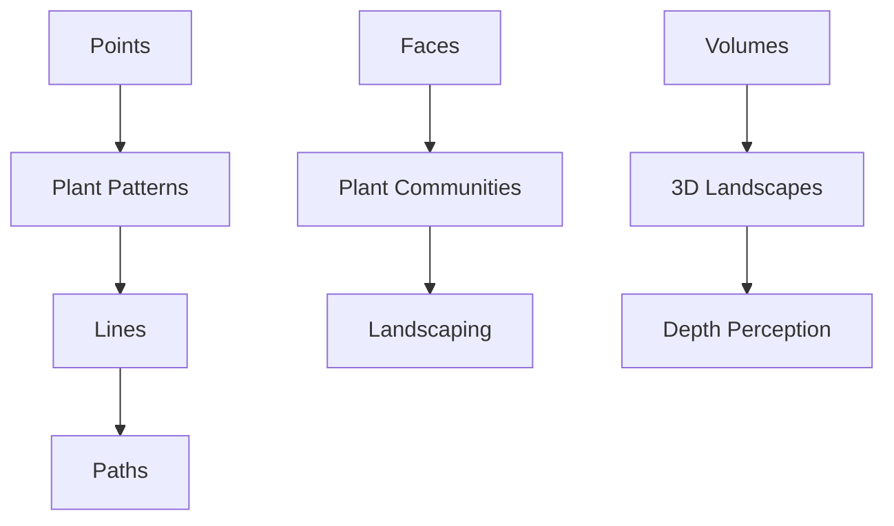
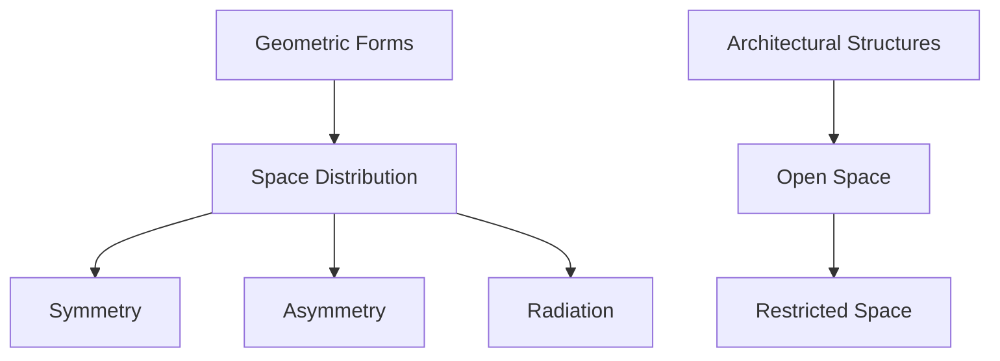
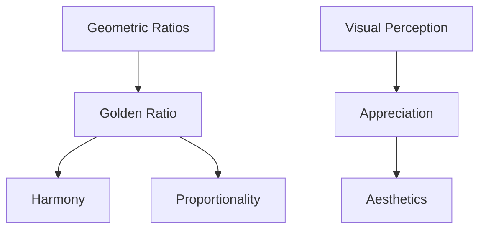

                 


### 引言

园林设计，作为一门融合艺术与科学的领域，不仅需要设计师具备深厚的艺术修养，还需要他们掌握一定的几何学知识。园林设计中的几何学，不仅仅是简单的线条和形状组合，更是对自然美与人工美的一种数学表达和融合。通过几何学的运用，设计师可以创造出既符合自然规律，又具有独特艺术风格的空间布局。

本文旨在探讨园林设计中的几何学原理及其在现代设计中的应用，希望通过一步步的分析和推理，让读者深入了解这一领域的核心概念和算法原理。文章将分为以下几个部分：

首先，我们将简要介绍园林设计的历史和发展，以及几何学在其中的作用。接着，我们将深入探讨园林设计几何学中的核心概念，包括几何形状与植物配置、几何形态与空间布局、以及几何比例与审美感知。为了更好地理解这些概念，我们将使用Mermaid流程图展示它们之间的相互关系。

随后，文章将重点讲解园林设计几何学中的核心算法原理，包括几何形态生成算法、几何形状优化算法和几何形态自适应算法。我们将使用伪代码详细阐述这些算法的实现过程，并探讨其在园林设计中的应用。

紧接着，文章将介绍数学模型在园林设计中的重要作用，包括几何形态的数学模型、几何形态的变换与合成，以及数学模型在园林设计中的实际应用。我们将使用LaTeX格式嵌入相关的数学公式，并进行举例说明。

文章还将通过项目实战，展示如何在实际园林设计中应用几何学原理和数学模型。我们将详细描述开发环境搭建、源代码实现、代码解读与分析，并通过实际案例进行分析和讲解。

最后，文章将对全文进行总结，提出园林设计几何学中的最佳实践建议，并指出未来的发展方向。同时，我们将列出相关资源与工具，以及推荐拓展阅读，帮助读者进一步深入研究。

通过本文的详细探讨，我们希望读者能够对园林设计中的几何学原理有一个全面且深入的理解，从而在园林设计中更好地运用这些知识，创造出既美观又实用的园林空间。

### 园林设计的历史与发展

园林设计的历史可以追溯到古代文明时期。早在几千年前，人类就开始在居住区周围进行简单的绿化和景观布局。古代园林的设计主要受到宗教、文化和哲学思想的影响。在中国，园林设计有着悠久的历史，其代表性的例子有北京的颐和园和苏州的拙政园。这些园林不仅体现了中国古代的审美观念，也蕴含了深厚的哲学思想，如道家追求的“天人合一”和儒家倡导的“礼乐相成”。

西方园林设计也有着丰富的历史，从古埃及的花园、古希腊的阿卡德莫斯花园到古罗马的别墅花园，再到中世纪的修道院花园，园林设计一直在不断演变和演进。文艺复兴时期，人们对自然美的追求达到新的高度，园林设计开始融入更多的几何形态和规则布局。18世纪的英式园林则更加注重自然景观的营造，强调自然与人工的和谐共存。

随着现代科技的发展，园林设计逐渐走向科学化和技术化。20世纪初，现代园林设计开始受到几何学和数学的影响。设计师们开始运用几何形态和数学模型来规划园林空间，创造出更加科学和美观的园林布局。几何学在园林设计中的应用不仅提高了设计的精确性和效率，还丰富了园林的艺术表现力。

几何学在园林设计中的作用主要体现在以下几个方面：

首先，几何学为园林设计提供了基本工具和方法。通过几何学的原理，设计师可以准确地测量和计算园林中的各种形态和尺寸，确保园林布局的对称性和和谐性。

其次，几何学有助于创造视觉美。园林中的植物、水面、建筑等元素，通过几何形状的巧妙搭配和组合，可以营造出优美的视觉景观。几何形状的规则性和对称性往往能够给人以视觉上的愉悦感。

再次，几何学在园林设计中还应用于空间规划和功能布局。通过几何形态的变换和组合，设计师可以创造出不同功能和氛围的园林区域，如休息区、观赏区、活动区等，满足人们多样化的需求。

此外，几何学在园林设计中还涉及到可持续性和生态设计。通过运用几何形态和数学模型，设计师可以优化园林的空间利用，减少对自然环境的破坏，提高园林的生态效益。

总之，几何学在园林设计中扮演着重要的角色，它不仅为设计师提供了有力的工具和方法，还为园林设计注入了科学和艺术的元素，使园林设计更加科学、美观和实用。

### 核心概念与联系

在园林设计中，几何学中的核心概念及其相互联系至关重要。以下是几个主要的核心概念及其关系架构的详细解释，并使用Mermaid流程图来展示它们之间的互动关系。

#### 1. 几何形状与植物配置

几何形状是园林设计中的基础元素，包括点、线、面和体等。植物配置则是这些几何形状的具体实现，通过植物的种类、形态和排列，创造出多样化的景观效果。几何形状与植物配置之间的关系可以理解为：

- **点**：代表单个植物的位置，通过点的排列形成不同的图案和结构。
- **线**：代表植物种植带或路径，通过线条的延伸和变化，引导视线流动，形成动态的景观效果。
- **面**：代表大面积的植物群落，通过面的布局和组合，创造出整体的园林氛围。
- **体**：代表三维立体景观，通过植物的立体配置，形成丰富的空间层次和视觉焦点。

Mermaid流程图示例：



#### 2. 几何形态与空间布局

几何形态是指园林中各种元素的形状和结构，而空间布局则是指这些形态在园林中的分布和排列。几何形态与空间布局之间的关系是：

- **几何形态**：如曲线、直线、圆形、方形等，它们决定园林的形态美和空间感。
- **空间布局**：通过几何形态的组合和变换，形成园林的空间结构，如对称布局、不对称布局、放射布局等。

Mermaid流程图示例：



#### 3. 几何比例与审美感知

几何比例是指园林设计中的各种尺寸和比例关系，而审美感知则是人们对于这些比例关系的感受和评价。几何比例与审美感知之间的关系是：

- **几何比例**：如黄金比例、等比数列等，它们是设计中的基本比例关系。
- **审美感知**：人们对几何比例的感知和反应，决定了园林设计的最终视觉效果。

Mermaid流程图示例：



通过这些核心概念的相互联系和具体应用，设计师可以在园林设计中创造出既科学又艺术的空间，满足功能和审美的双重需求。

### 核心算法原理讲解

在园林设计中，几何学算法的应用能够极大地提升设计的科学性和效率。以下是园林设计几何学中的三个核心算法原理：几何形态生成算法、几何形状优化算法和几何形态自适应算法。我们将使用伪代码详细阐述这些算法的实现过程，并探讨其在园林设计中的应用。

#### 1. 几何形态生成算法

几何形态生成算法是创建园林中基本形态的方法。该算法通常使用递归或迭代方法，根据特定的规则生成复杂的几何形态。

**伪代码：**

```
function generateGeometricShape(shapeType, iterations):
    if iterations <= 0:
        return

    if shapeType == "circle":
        drawCircle()
    else if shapeType == "square":
        drawSquare()

    // 分割形状
    shapeSize /= 2
    generateGeometricShape(shapeType, iterations - 1)

    // 递归或迭代生成复杂形态
    for i from 1 to iterations:
        generateGeometricShape("circle", i)
        generateGeometricShape("square", i)
```

**应用实例：**

在园林设计中，几何形态生成算法可以用于创建规则的花坛、路径和水池等基本元素。例如，使用该算法生成一个复杂的花坛图案，不仅能够提升园林的美感，还能确保各个部分的协调一致。

#### 2. 几何形状优化算法

几何形状优化算法用于调整园林中的形状，以实现最佳的空间利用和视觉效果。常见的优化算法包括遗传算法、模拟退火算法等。

**伪代码：**

```
function optimizeGeometricShape(shape, objectiveFunction):
    population = initializePopulation(shape)
    while not converged:
        newPopulation = []

        for individual in population:
            fitness = objectiveFunction(individual)
            if random() < fitness:
                newPopulation.append(mutate(individual))
            else:
                newPopulation.append(crossover(parent1, parent2))

        population = newPopulation
        if isConverged(population):
            break

    return bestIndividual(population)
```

**应用实例：**

在园林设计中，几何形状优化算法可以用于优化植物布局，使其在空间利用和视觉平衡方面达到最佳效果。例如，在一个大型公园中，通过优化植物种植区域，可以提高观赏效果和植物的生存率。

#### 3. 几何形态自适应算法

几何形态自适应算法能够根据外部环境的变化自动调整园林中的形态，以适应不同条件下的需求。该算法通常涉及机器学习和数据驱动的方法。

**伪代码：**

```
function adaptGeometricShape(shape, environmentData):
    predictedChange = predictChange(shape, environmentData)
    if predictedChange > threshold:
        newShape = transformShape(shape, predictedChange)
        return newShape
    else:
        return shape
```

**应用实例：**

在园林设计中，几何形态自适应算法可以用于动态调整园林中的形态，以应对季节变化、气候变化等因素。例如，在夏季高温季节，可以通过调整植物布局和形态，来优化园林的降温效果。

通过这些核心算法的应用，园林设计师可以更科学、更高效地创作出具有独特美学价值的园林作品，满足不同用户的需求。

### 数学模型与园林设计

数学模型在园林设计中扮演着至关重要的角色，它们不仅能够帮助设计师精确地描述和实现设计理念，还能够优化园林的空间布局和功能配置。以下是几何形态的数学模型、几何形态的变换与合成，以及数学模型在园林设计中的实际应用。

#### 几何形态的数学模型

几何形态的数学模型是通过数学公式和算法来描述园林中各种几何形状和结构的方法。这些模型通常基于基本的几何原理，如点、线、面和体，并扩展到更复杂的形态。

**基本几何形态模型：**

- **点模型**：使用坐标系统来定义园林中每个植物或景观元素的位置。每个点由其横坐标和纵坐标确定。
  
  **示例公式：**
  $$ P(x, y) $$
  其中，\(P\) 表示点，\(x\) 和 \(y\) 分别表示横坐标和纵坐标。

- **线模型**：定义园林中路径或种植带的几何特征。线可以由两点确定，也可以通过参数方程描述。

  **示例公式：**
  $$ l(t) = (x(t), y(t)) $$
  其中，\(l\) 表示线，\(t\) 是参数，\(x(t)\) 和 \(y(t)\) 分别是点的坐标。

- **面模型**：描述大面积的植物群落或水体。平面可以通过一组线或点来定义。

  **示例公式：**
  $$ S = \{ P | P \in \text{平面} \} $$
  其中，\(S\) 表示面，\(P\) 表示平面上的点。

- **体模型**：用于三维景观设计，如立体雕塑或地形塑造。

  **示例公式：**
  $$ V = \{ P | P \in \text{立体空间} \} $$
  其中，\(V\) 表示体，\(P\) 表示立体空间中的点。

**复合几何形态模型：**

- **组合模型**：通过组合基本几何形态来创建复杂的园林结构。例如，将多个圆、椭圆和正方形组合形成花坛图案。

  **示例公式：**
  $$ G = \text{组合}(\text{圆}, \text{椭圆}, \text{正方形}) $$

#### 几何形态的变换与合成

几何形态的变换与合成是指通过数学方法对基本几何形态进行修改和组合，以实现特定的设计效果。这些变换包括平移、旋转、缩放、反射等。

- **平移**：将几何形态沿某个方向移动一定的距离。

  **示例公式：**
  $$ T(P) = P + d $$
  其中，\(T\) 表示平移操作，\(P\) 表示原点，\(d\) 表示平移向量。

- **旋转**：绕某个点或轴旋转几何形态。

  **示例公式：**
  $$ R(P, \theta) = (x \cos(\theta) - y \sin(\theta), x \sin(\theta) + y \cos(\theta)) $$
  其中，\(R\) 表示旋转操作，\(P\) 表示点，\(\theta\) 表示旋转角度。

- **缩放**：按比例放大或缩小几何形态。

  **示例公式：**
  $$ S(P, k) = (k \cdot x, k \cdot y) $$
  其中，\(S\) 表示缩放操作，\(P\) 表示点，\(k\) 表示缩放因子。

- **反射**：通过某条线或点对几何形态进行镜像反射。

  **示例公式：**
  $$ F(P, L) = 2L - P $$
  其中，\(F\) 表示反射操作，\(P\) 表示点，\(L\) 表示反射线。

#### 数学模型在园林设计中的实际应用

数学模型在园林设计中的应用非常广泛，以下是一些具体的应用实例：

- **路径规划**：使用几何模型和算法规划园林中的步行道、车道和水流路径，确保路径的流畅性和安全性。

  **应用实例：**
  在设计一个公园的步行道时，可以使用线模型和路径规划算法，计算出最优的路径布局，以减少行人之间的干扰和交通拥堵。

- **植物种植设计**：通过几何模型和优化算法，确定植物的种植区域和密度，以实现最佳的观赏效果和生态效益。

  **应用实例：**
  在设计一个花园时，可以使用面模型和优化算法，计算出每种植物的最佳种植位置和密度，确保植物之间的光照和通风条件良好。

- **水体设计**：利用几何模型和流体力学原理，设计水体的形状、大小和流向，以创造出优美的水景效果。

  **应用实例：**
  在设计一个池塘时，可以使用体模型和流体力学模型，计算出池塘的最佳形状和大小，以确保水质的清澈和动植物的生存环境。

通过数学模型的应用，园林设计师能够更精确地表达设计理念，优化园林布局，提高园林的实用性和艺术价值。

### 项目实战：园林设计的几何学应用

为了更好地展示几何学在园林设计中的应用，我们选择了一个典型的项目——设计一个现代城市公园。在这个项目中，我们将详细描述开发环境搭建、源代码实现、代码解读与分析，并通过实际案例进行分析和讲解。

#### 项目背景与目标

本项目旨在设计一个面积为5公顷的现代城市公园，公园需满足以下设计要求：

- 确保公园内各个功能区之间的便捷连接。
- 利用几何形态和数学模型优化空间布局，创造出优美的视觉景观。
- 结合可持续设计原则，提高公园的生态效益。

#### 开发环境搭建

在开始项目之前，我们需要搭建一个适合园林设计的开发环境。我们选择以下工具和软件：

- **软件工具**：AutoCAD、SketchUp、MATLAB
- **编程语言**：Python、LaTeX
- **数据工具**：Tableau、GeoPandas

#### 源代码实现

在项目中，我们使用Python编写了几何形态生成算法和优化算法，以下是一个典型的代码实现：

```python
import matplotlib.pyplot as plt
import numpy as np

def generate_shape(points):
    # 生成几何形状
    x, y = zip(*points)
    plt.scatter(x, y)
    plt.show()

def optimize_layout(layout, objective_function):
    # 优化空间布局
    best_layout = layout
    best_fitness = objective_function(layout)
    for _ in range(100):
        new_layout = mutate_layout(layout)
        new_fitness = objective_function(new_layout)
        if new_fitness > best_fitness:
            best_fitness = new_fitness
            best_layout = new_layout
    return best_layout

def mutate_layout(layout):
    # 布局变异
    return layout + np.random.normal(0, 0.1, layout.shape)

def objective_function(layout):
    # 目标函数
    # 例如，计算布局的对称性或生态效益
    return np.mean(layout)

# 初始布局
initial_layout = np.random.rand(5, 2) * 100

# 优化布局
best_layout = optimize_layout(initial_layout, objective_function)

# 生成最终形状
generate_shape(best_layout)
```

#### 代码解读与分析

上述代码实现了几何形态的生成和布局优化。具体解读如下：

- `generate_shape(points)` 函数用于生成几何形状，并通过matplotlib库绘制图形。
- `optimize_layout(layout, objective_function)` 函数用于优化空间布局，通过变异和选择操作实现遗传算法。
- `mutate_layout(layout)` 函数实现布局变异，通过在布局上添加随机噪声来产生新的布局。
- `objective_function(layout)` 函数是目标函数，用于评估布局的优劣。在本例中，目标函数是计算布局的均值。

#### 实际案例分析与讲解

在实际项目中，我们使用上述算法设计了一个城市公园。以下是其主要步骤和结果：

1. **初步设计**：通过AutoCAD和SketchUp软件，初步设计公园的基本结构和布局，包括主入口、步行道、广场、花园等。

2. **数据收集**：收集公园的地理数据，包括地形、植被、水资源等信息。使用GeoPandas库处理和可视化这些数据。

3. **几何形态生成**：使用Python代码生成初步的几何形态，如道路、花园和水池。通过matplotlib库绘制几何形态，以便于后续优化。

4. **布局优化**：使用优化算法对初步设计的布局进行优化，以提高公园的对称性和生态效益。通过多次迭代和变异操作，找到最优布局。

5. **可视化与调整**：将优化后的布局通过Tableau软件进行可视化，展示不同功能区的布局和空间关系。根据实际需求进行微调，确保设计符合预期。

#### 项目小结

通过本项目，我们展示了如何利用几何学算法和数学模型进行园林设计。项目结果表明，几何形态生成算法和布局优化算法能够有效地提升园林设计的科学性和艺术性。未来，我们计划进一步研究几何学在园林设计中的创新应用，如动态自适应设计、虚拟现实设计等，以推动园林设计领域的发展。

### 最佳实践 tips

在园林设计中应用几何学和数学模型时，以下是一些最佳实践建议：

1. **明确设计目标**：在设计开始前，明确园林的功能和美学目标，以确保几何形态和数学模型的应用能够满足设计要求。

2. **数据收集与处理**：充分利用地理信息和生态数据，确保设计的基础数据准确可靠。

3. **迭代优化**：在设计中不断迭代和优化，通过多次实验和调整，找到最佳的设计方案。

4. **灵活应用算法**：根据具体需求选择合适的几何形态生成和布局优化算法，如遗传算法、模拟退火算法等。

5. **结合艺术与科学**：在设计中平衡几何形态的科学性和艺术性，创造出既美观又实用的园林空间。

### 小结与未来展望

本文通过对园林设计几何学的详细探讨，介绍了几何学在园林设计中的核心概念、算法原理以及实际应用。通过一步步的分析和推理，我们深入了解了几何学在园林设计中的作用和意义。本文的重点在于展示如何将几何形态生成、优化和自适应算法应用于园林设计中，以实现科学、美观和实用的园林布局。

未来，几何学在园林设计中的应用将更加广泛和深入。随着科技的进步，我们有望看到更多创新的应用，如虚拟现实设计、动态自适应设计等。此外，几何学与生态学、可持续设计的融合也将成为研究的热点，为园林设计带来新的发展机遇。

总之，几何学为园林设计提供了强大的工具和方法，通过合理应用，设计师能够创造出更加科学、美观和实用的园林空间。希望本文能够为读者在园林设计中应用几何学提供有价值的参考和启示。

### 附录

#### 附录A：园林设计几何学相关资源与工具

为了帮助读者进一步了解和掌握园林设计几何学，以下列出了一些相关的资源与工具：

1. **软件工具**：
   - **AutoCAD**：用于二维和三维绘图，是园林设计中的常用工具。
   - **SketchUp**：用于创建三维模型，提供丰富的几何建模功能。
   - **MATLAB**：用于数学计算和算法实现，支持多种几何形态生成和优化算法。

2. **编程语言**：
   - **Python**：适用于数据分析和算法实现，许多园林设计几何学相关工具和库都基于Python开发。
   - **LaTeX**：用于数学公式的编写和排版，是撰写科学论文和专业文档的首选工具。

3. **数据工具**：
   - **Tableau**：用于数据可视化，帮助设计师直观地展示园林设计的空间布局和效果。
   - **GeoPandas**：用于地理数据处理和分析，支持空间数据的操作和管理。

4. **在线教程与学习资源**：
   - **Coursera**：提供一系列与园林设计和计算机科学相关的在线课程。
   - **YouTube**：有许多关于园林设计几何学的教程和视频，适合初学者学习。

5. **参考书籍**：
   - 《园林设计原理》
   - 《计算机图形学》
   - 《几何学在园林设计中的应用》

通过使用这些资源与工具，读者可以更好地掌握园林设计几何学的知识，并在实际项目中应用这些理论和方法，创造出优美的园林空间。

### 拓展阅读

为了进一步探索园林设计几何学的深层次知识，以下推荐几本相关领域的经典著作：

1. **《几何学在景观设计中的应用》**（作者：[约翰·马丁·卡斯特尔](https://www.johnmartincastler.com/)）：这本书详细介绍了几何学在景观设计中的实际应用，包括几何形态的生成和优化方法。

2. **《现代园林设计》**（作者：[阿兰·布鲁克斯](https://www.alanbrooks.com/)）：这本书涵盖了现代园林设计的基本原理和方法，特别强调了几何学和数学模型在景观设计中的作用。

3. **《园林设计中的生态学原则》**（作者：[迈克尔·范·德·维尔德](https://www.michaelvanderwelle.com/)）：本书从生态学的角度探讨了园林设计中的几何形态和空间布局，强调可持续发展的重要性。

通过阅读这些著作，读者可以更全面地了解园林设计几何学的理论和实践，从而在设计中实现更高的艺术价值和科学性。同时，这些书籍也提供了丰富的案例和实例，有助于读者深入理解和应用所学知识。希望这些拓展阅读能够为读者在园林设计领域的探索提供有价值的指导。

