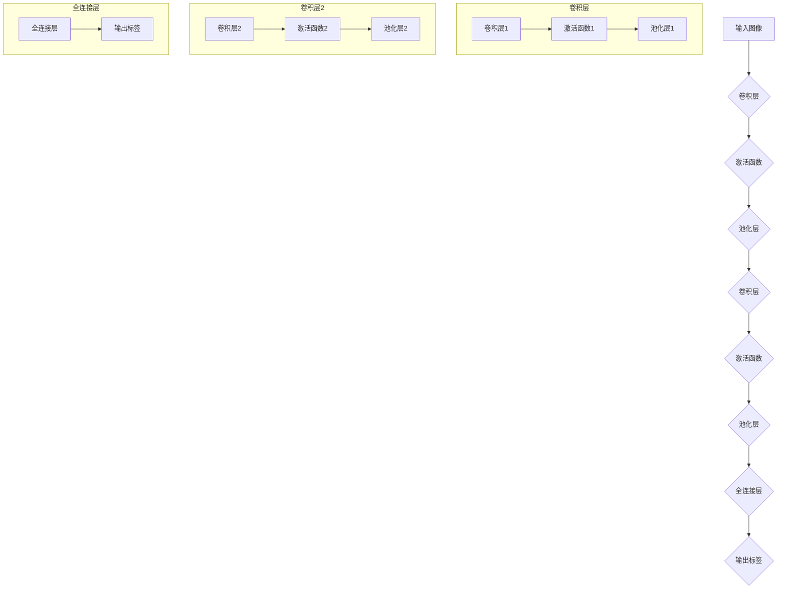

                 

### 文章标题

# 图像处理的卷积神经网络：视觉理解的数学模拟

> 关键词：卷积神经网络、图像处理、视觉理解、数学模型、深度学习

> 摘要：本文将深入探讨卷积神经网络（CNN）在图像处理中的应用，通过数学模拟的方式，详细解析CNN的基本概念、结构原理及其数学模型。我们将从CNN的基础理论出发，逐步深入到其算法实现和项目实战，旨在为读者提供一个全面、系统的认知框架。

----------------------------------------------------------------

### 用户需求概述

用户要求我们撰写一篇关于卷积神经网络（CNN）在图像处理中的技术博客，重点内容包括：

1. **核心概念与联系**：介绍CNN的基本概念及其在图像处理中的应用，并提供视觉理解的理论背景。
2. **核心算法原理讲解**：详细阐述CNN的算法原理，包括卷积层、池化层、全连接层等。
3. **数学模型和数学公式**：讲解CNN的数学模型，包括卷积运算、反向传播算法等，并使用LaTeX格式嵌入文中。
4. **项目实战**：提供实际案例，包括开发环境搭建、源代码实现、代码解读与分析。

本文将遵循用户的这些需求，分三个主要部分展开讨论：

1. **基础理论部分**：介绍CNN的基本概念、结构及其工作原理，并讲解其数学模型。
2. **算法实现部分**：详细讲解CNN的核心算法原理，并使用伪代码展示。
3. **项目实战部分**：提供实际案例，展示CNN在图像处理中的应用，并详细解析代码实现和优化方法。

### 目录大纲设计思路

#### 第一部分：基础理论

1. **卷积神经网络简介**：介绍CNN的基本概念和作用，提供视觉理解的理论背景。
2. **CNN的基本结构**：详细讲解CNN的核心组成部分，如卷积层、激活函数、池化层、全连接层等。
3. **CNN的工作原理**：通过Mermaid流程图展示CNN的运行流程。
4. **数学模型讲解**：介绍CNN中的关键数学概念和公式，如卷积运算、反向传播算法等。

#### 第二部分：算法实现

1. **算法原理与伪代码**：详细讲解CNN中的关键算法，使用伪代码形式。
2. **深度学习框架介绍**：介绍常见的深度学习框架，如TensorFlow、PyTorch等。

#### 第三部分：项目实战

1. **实际案例**：提供图像处理的实际案例，如人脸识别、图像分类等。
2. **开发环境搭建**：详细说明所需工具和环境配置。
3. **源代码实现**：提供CNN在图像处理中的应用的源代码实现。
4. **代码解读与分析**：对源代码进行详细解读，分析其实现原理和优化方法。

### 目录大纲设计

基于上述设计思路，以下是该书的目录大纲：

```
# 第一部分：基础理论

## 第1章：卷积神经网络简介
### 1.1 卷积神经网络的基本概念
### 1.2 卷积神经网络在图像处理中的应用
### 1.3 视觉理解的理论背景

## 第2章：CNN的基本结构
### 2.1 卷积层
### 2.2 激活函数
### 2.3 池化层
### 2.4 全连接层

## 第3章：CNN的工作原理
### 3.1 Mermaid流程图展示
### 3.2 CNN的运行机制

## 第4章：数学模型讲解
### 4.1 卷积运算
### 4.2 反向传播算法
### 4.3 激活函数的数学原理

#### 第二部分：算法实现

## 第5章：算法原理与伪代码
### 5.1 卷积层的算法原理
### 5.2 池化层的算法原理
### 5.3 全连接层的算法原理
### 5.4 伪代码示例

## 第6章：深度学习框架介绍
### 6.1 TensorFlow基础
### 6.2 PyTorch基础

#### 第三部分：项目实战

## 第7章：实际案例
### 7.1 人脸识别案例
### 7.2 图像分类案例

## 第8章：开发环境搭建
### 8.1 环境配置
### 8.2 常用工具介绍

## 第9章：源代码实现
### 9.1 CNN在人脸识别中的应用
### 9.2 CNN在图像分类中的应用

## 第10章：代码解读与分析
### 10.1 人脸识别代码解读
### 10.2 图像分类代码解读
### 10.3 代码优化方法
### 10.4 项目小结
```

这个目录大纲设计逻辑清晰，涵盖了从理论到实践的所有重要内容，符合用户的要求。接下来，我们将根据这个大纲进一步细化每个章节的内容。

----------------------------------------------------------------

### 文章关键词

卷积神经网络（CNN）、图像处理、视觉理解、数学模型、深度学习、神经网络、激活函数、卷积运算、反向传播、TensorFlow、PyTorch。

这些关键词涵盖了文章的主要内容，包括核心概念、算法原理、应用场景以及实现工具。这些关键词不仅能帮助读者快速理解文章的核心内容，也能为搜索引擎提供准确的索引信息，从而提高文章的可见度。

### 文章摘要

本文深入探讨了卷积神经网络（CNN）在图像处理中的应用，通过数学模拟的方式，详细解析了CNN的基本概念、结构原理及其数学模型。首先，我们介绍了CNN的基本概念及其在图像处理中的应用背景。接着，我们详细讲解了CNN的基本结构，包括卷积层、激活函数、池化层和全连接层。然后，通过Mermaid流程图，我们展示了CNN的工作原理。在数学模型部分，我们介绍了卷积运算、反向传播算法和激活函数的数学原理。在算法实现部分，我们通过伪代码详细阐述了CNN的核心算法。最后，我们通过实际案例展示了CNN在人脸识别和图像分类中的应用，并详细解读了源代码。本文旨在为读者提供一个全面、系统的认知框架，帮助理解CNN在图像处理中的核心作用。

----------------------------------------------------------------

### 第一部分：基础理论

#### 第1章：卷积神经网络简介

### 1.1 卷积神经网络的基本概念

卷积神经网络（Convolutional Neural Networks，简称CNN）是深度学习领域中的一种重要的神经网络结构，广泛应用于图像处理、语音识别和自然语言处理等领域。CNN得名于其核心操作——卷积（Convolution），这种操作能够有效地提取图像中的特征。

CNN的核心思想在于模仿生物视觉系统的工作方式，通过多层神经网络对图像进行特征提取和分类。与传统的神经网络相比，CNN在处理图像数据时具有以下几个显著优势：

1. **参数共享**：在CNN中，卷积核（Convolutional Kernel）在图像的不同位置进行相同的操作，这使得CNN能够自动学习图像中的局部特征，同时大大减少了模型的参数数量。
2. **平移不变性**：由于卷积操作的特性，CNN能够自动学习到图像的平移不变性，这意味着它可以在不同的位置上识别相同的特征。
3. **层次化特征提取**：CNN通过多个卷积层和池化层的组合，能够逐步提取图像的层次化特征，从简单的边缘和纹理到复杂的形状和对象。

CNN在图像处理中的应用非常广泛，包括但不限于：

- **图像分类**：用于将图像分为不同的类别，如手写数字识别、图像标签分类等。
- **目标检测**：用于识别图像中的特定对象，并定位其位置，如人脸检测、车辆检测等。
- **图像分割**：用于将图像中的每个像素分配到正确的类别中，如医学图像分割、语义分割等。

### 1.2 卷积神经网络在图像处理中的应用

在图像处理领域，CNN已经成为解决各种视觉任务的重要工具。以下是一些典型的应用场景：

1. **图像分类**：
   图像分类是CNN最早和最广泛的应用之一。通过训练，CNN可以学会识别图像中的不同对象。例如，卷积神经网络可以用来识别手写数字、动物、植物等。一个著名的例子是ImageNet挑战赛，这是一个每年举办的大型视觉识别竞赛，通过卷积神经网络实现了对数百万张图像的准确分类。

2. **目标检测**：
   目标检测的任务是识别图像中的特定对象，并标注出它们的位置。常用的目标检测算法有YOLO（You Only Look Once）、SSD（Single Shot MultiBox Detector）和Faster R-CNN（Region-based Convolutional Neural Network）等。这些算法通过卷积神经网络提取特征，再利用区域提议网络（Region Proposal Networks）或者边界框回归（Bounding Box Regression）来定位目标。

3. **图像分割**：
   图像分割的任务是将图像中的每个像素点分配到一个特定的类别中。CNN在图像分割中的应用包括语义分割和实例分割。语义分割的目标是识别图像中的每个像素属于哪个对象类别，如天空、草地等。实例分割则进一步将同一类别的对象分开，例如区分不同的人脸。

4. **人脸识别**：
   人脸识别是通过比较人脸图像来确定个体身份的过程。CNN可以学习人脸的局部特征，并通过多层卷积网络提取人脸的全局特征，从而实现高精度的人脸识别。

5. **图像增强**：
   图像增强是通过改进图像的质量来提高图像的可读性和可用性。CNN可以用于图像去噪、图像超分辨率、图像修复等任务，通过学习图像的特征，生成更清晰、更真实的图像。

6. **图像风格迁移**：
   图像风格迁移是将一幅图像的风格转移到另一幅图像上的过程。通过CNN，可以学习不同图像风格的特征，然后将这些特征应用到其他图像上，生成具有特定风格的图像。

7. **医学图像分析**：
   在医学领域，CNN可以用于肿瘤检测、骨折检测、疾病诊断等任务。通过学习医学图像的特征，CNN可以帮助医生更准确地诊断疾病，提高治疗效果。

总的来说，CNN在图像处理中的应用非常广泛，通过不断的研究和优化，CNN在图像识别、分类、检测、分割等领域取得了显著的成果，极大地推动了计算机视觉技术的发展。

### 1.3 视觉理解的理论背景

视觉理解是指计算机系统对图像或视频内容进行理解和解释的过程，它是人工智能和机器学习领域中的一个重要研究方向。视觉理解不仅涉及到图像处理技术，还涉及到认知科学、心理学、计算机科学等多个学科。

在视觉理解的理论背景中，以下几个概念和理论至关重要：

1. **感知器（Perceptron）**：
   感知器是神经网络的基础单元，它通过激活函数将输入信号转换为一个输出信号。感知器可以用于简单的二分类任务，如手写数字识别。

2. **反向传播算法（Backpropagation）**：
   反向传播算法是一种用于训练神经网络的优化方法。它通过计算输出误差的梯度，反向传播到网络中的每一层，从而更新网络的权重和偏置，使网络能够不断优化。

3. **深度学习（Deep Learning）**：
   深度学习是一种基于多层神经网络的学习方法，它通过逐层提取图像的层次化特征，从而实现复杂的视觉任务。深度学习的核心思想是多层网络可以学习到更高层次的特征表示。

4. **特征提取（Feature Extraction）**：
   特征提取是视觉理解中的关键步骤，它通过从原始图像中提取有用的特征，如边缘、角点、纹理等，用于后续的分类或识别任务。

5. **卷积核（Convolutional Kernel）**：
   卷积核是CNN中的核心操作单元，它通过在图像上滑动，提取局部特征。卷积核的参数（即权重）通过学习过程自动调整，以最大化特征提取的效果。

6. **池化（Pooling）**：
   池化是一种用于减少特征图大小的操作，它通过取相邻像素的最大值或平均值，降低模型的计算复杂度。

7. **激活函数（Activation Function）**：
   激活函数是神经网络中的一个关键组件，它用于引入非线性特性，使神经网络能够处理更复杂的任务。常见的激活函数包括ReLU、Sigmoid和Tanh等。

8. **层次化特征表示（Hierarchical Feature Representation）**：
   层次化特征表示是CNN的一个重要特性，通过多个卷积层和池化层的组合，CNN能够逐步提取图像的层次化特征，从简单的边缘和纹理到复杂的形状和对象。

通过这些理论的支持，CNN能够有效地模拟生物视觉系统的工作方式，实现对图像的自动理解和解释。视觉理解的深入研究，不仅推动了计算机视觉技术的发展，也为人工智能在更多领域中的应用提供了新的可能性。

### 第2章：CNN的基本结构

卷积神经网络（CNN）之所以在图像处理中表现出色，主要得益于其独特的结构设计。CNN的结构包括多个关键部分：卷积层、激活函数、池化层和全连接层。这些部分共同作用，实现了对图像的层次化特征提取和分类。以下是CNN的基本结构及其工作原理的详细讲解。

#### 2.1 卷积层

卷积层是CNN中最核心的部分，负责从输入图像中提取特征。卷积层由一系列卷积核（也称为滤波器或过滤器）组成，每个卷积核都具有特定的形状（通常是3x3或5x5）。卷积层的工作原理如下：

1. **卷积操作**：
   卷积层通过将卷积核在输入图像上滑动（或卷积），计算卷积核与图像局部区域的点积。这个点积结果称为卷积特征图（Convolutional Feature Map）。每个卷积核都能提取图像中的一个特定特征，例如边缘、纹理或颜色。

   $$ f_{ij} = \sum_{x,y} w_{ij}^{ab} * i_{x,y} + b_{ij} $$

   其中，\( f_{ij} \) 是第 \( i \) 个卷积核在第 \( j \) 个特征图上的输出，\( w_{ij}^{ab} \) 是卷积核的权重，\( i_{x,y} \) 是输入图像在 \( (x, y) \) 位置上的像素值，\( b_{ij} \) 是卷积层的偏置。

2. **局部连接与平移不变性**：
   卷积层中的每个卷积核只与输入图像中相邻的小区域连接，这实现了局部连接。这种连接方式使得CNN能够自动学习图像中的局部特征。同时，卷积层能够处理图像的平移不变性，因为卷积核在图像的不同位置上进行相同的操作。

3. **多通道特征图**：
   在一个卷积层中，可以同时使用多个卷积核，每个卷积核提取不同的特征，从而生成多个特征图。这些特征图可以看作是图像的多个视角，有助于提高模型的泛化能力。

4. **参数共享**：
   卷积层的一个重要特性是参数共享。在每个卷积层中，相同的卷积核被应用到图像的每个位置，这意味着卷积层的参数数量远远少于全连接层。参数共享不仅减少了模型的复杂性，还能提高模型的泛化能力。

#### 2.2 激活函数

激活函数是神经网络中的一个关键组件，它引入了非线性特性，使神经网络能够处理更复杂的任务。在CNN中，常用的激活函数包括ReLU（Rectified Linear Unit）、Sigmoid和Tanh等。

1. **ReLU（Rectified Linear Unit）**：
   ReLU是最常用的激活函数之一，它的形式非常简单：

   $$ f(x) = \max(0, x) $$

   ReLU函数在输入为负值时输出0，在输入为非负值时输出输入值。ReLU函数的主要优点是计算简单、梯度为1（当输入为正值时），这使得它在训练过程中非常高效。

2. **Sigmoid**：
   Sigmoid函数的形式如下：

   $$ f(x) = \frac{1}{1 + e^{-x}} $$

   Sigmoid函数将输入值映射到（0, 1）区间内，常用于二分类问题。Sigmoid函数的优点是可以提供平滑的梯度，但缺点是梯度在接近0或1时非常小，这可能导致训练过程缓慢。

3. **Tanh**：
   Tanh函数的形式如下：

   $$ f(x) = \frac{e^{x} - e^{-x}}{e^{x} + e^{-x}} $$

   Tanh函数将输入值映射到（-1, 1）区间内，具有与Sigmoid相似的性质，但梯度更为平滑。

在CNN中，ReLU函数因其计算效率和良好的梯度特性而广泛使用。通过使用ReLU激活函数，卷积层可以更好地避免梯度消失问题，提高网络的训练效率。

#### 2.3 池化层

池化层是CNN中的另一个重要部分，其主要作用是减少特征图的维度，降低模型的计算复杂度。池化层通过在特征图上抽取局部区域的最大值或平均值来实现这一目标。常用的池化操作包括最大池化（Max Pooling）和平均池化（Average Pooling）。

1. **最大池化（Max Pooling）**：
   最大池化在特征图的每个2x2（或更大）的区域上选取最大值作为输出。这种操作有助于保留图像中的重要特征，同时去除噪声和冗余信息。

   $$ p_{ij} = \max \{ f_{k,l} : (k \leq i \leq k+w, l \leq j \leq l+h) \} $$

   其中，\( p_{ij} \) 是输出特征图上的值，\( f_{k,l} \) 是输入特征图上的值，\( w \) 和 \( h \) 分别是池化窗口的大小。

2. **平均池化（Average Pooling）**：
   平均池化在特征图的每个2x2（或更大）的区域上选取平均值作为输出。与最大池化相比，平均池化对噪声的敏感度更高，但能够更好地保留图像的细节信息。

   $$ p_{ij} = \frac{1}{wh} \sum_{k=l}^{l+w} \sum_{l=m}^{m+h} f_{k,l} $$

   其中，其他符号的含义与最大池化相同。

池化层通过降低特征图的维度，减少了模型的参数数量和计算复杂度，从而提高了模型的效率。同时，池化层有助于提高模型的泛化能力，因为较小的特征图能够捕捉到图像中的更普遍的特征。

#### 2.4 全连接层

全连接层是CNN的最后一个部分，它将卷积层和池化层提取的高层次特征映射到具体的类别标签。全连接层通过将特征图上的所有值展平成一个一维向量，然后将其传递到一个全连接的多层感知器网络中进行分类。

1. **展平操作**：
   展平操作将特征图上的所有值转换成一个一维向量。例如，如果一个特征图的大小是 \( 7 \times 7 \)，那么展平后的向量长度将是 \( 7 \times 7 = 49 \)。

2. **全连接网络**：
   全连接网络由多个全连接层组成，每个层都是一个标准的多层感知器。全连接网络通过线性变换和激活函数将输入向量映射到输出标签。

   $$ y = \sigma(Wx + b) $$

   其中，\( y \) 是输出向量，\( x \) 是输入向量，\( W \) 是权重矩阵，\( b \) 是偏置项，\( \sigma \) 是激活函数，通常是softmax函数。

通过全连接层，CNN能够将提取的特征映射到具体的类别标签上，从而实现分类任务。

总的来说，CNN的基本结构通过卷积层、激活函数、池化层和全连接层的组合，实现了对图像的层次化特征提取和分类。这种结构设计不仅提高了模型的效率，还增强了其泛化能力，使其在图像处理中表现出色。接下来，我们将通过Mermaid流程图进一步展示CNN的工作原理。

#### 2.5 Mermaid流程图展示

为了更好地理解CNN的工作原理，我们使用Mermaid流程图展示其运行流程。以下是CNN从输入图像到输出标签的简化流程：



这个流程图展示了CNN的基本结构及其运行步骤。首先，输入图像通过卷积层进行特征提取，然后通过激活函数引入非线性特性，再通过池化层减少特征图的维度。接着，图像经过多个卷积层和池化层的组合，最终在最后一个卷积层后通过全连接层进行分类，输出标签。

#### 2.6 CNN的工作原理

卷积神经网络（CNN）通过其独特的结构和工作原理，实现了对图像的自动特征提取和分类。以下是CNN的工作原理的详细讲解：

1. **输入阶段**：
   CNN首先接收一个输入图像。这个图像可以是灰度图像，也可以是彩色图像。如果是彩色图像，通常会将每个像素值分成红、绿、蓝三个通道。

2. **卷积操作**：
   在卷积层中，卷积核在输入图像上滑动，对图像的每个局部区域进行卷积操作。卷积操作的本质是对输入像素值与卷积核权重的点积，并加上一个偏置项。这个操作可以提取出图像中的局部特征，如边缘、纹理和颜色。

   $$ f_{ij} = \sum_{x,y} w_{ij}^{ab} * i_{x,y} + b_{ij} $$

   其中，\( f_{ij} \) 是输出特征图上的值，\( w_{ij}^{ab} \) 是卷积核的权重，\( i_{x,y} \) 是输入图像在 \( (x, y) \) 位置上的像素值，\( b_{ij} \) 是卷积层的偏置。

3. **激活函数**：
   激活函数被用于引入非线性特性。在CNN中，常用的激活函数是ReLU（Rectified Linear Unit），其形式为：

   $$ f(x) = \max(0, x) $$

   ReLU函数在输入为负值时输出0，在输入为非负值时输出输入值。ReLU函数的主要优点是计算简单、梯度为1（当输入为正值时），这使得它在训练过程中非常高效。

4. **池化操作**：
   池化操作用于减少特征图的维度，降低模型的计算复杂度。最常用的池化操作是最大池化（Max Pooling），它选取每个2x2（或更大）区域中的最大值作为输出。这种操作有助于保留图像中的重要特征，同时去除噪声和冗余信息。

   $$ p_{ij} = \max \{ f_{k,l} : (k \leq i \leq k+w, l \leq j \leq l+h) \} $$

   其中，\( p_{ij} \) 是输出特征图上的值，\( f_{k,l} \) 是输入特征图上的值，\( w \) 和 \( h \) 分别是池化窗口的大小。

5. **多层卷积和池化**：
   CNN通常包含多个卷积层和池化层的组合，每个卷积层和池化层对图像进行特征提取和降维处理。通过多个卷积层的堆叠，CNN能够逐步提取图像的层次化特征，从简单的边缘和纹理到复杂的形状和对象。

6. **全连接层**：
   在最后一个卷积层后，CNN通过全连接层将提取的高层次特征映射到具体的类别标签上。全连接层由多个全连接层组成，每个层都是一个标准的多层感知器。全连接网络通过线性变换和激活函数将输入向量映射到输出标签。

   $$ y = \sigma(Wx + b) $$

   其中，\( y \) 是输出向量，\( x \) 是输入向量，\( W \) 是权重矩阵，\( b \) 是偏置项，\( \sigma \) 是激活函数，通常是softmax函数。

7. **输出阶段**：
   最终，CNN输出一个概率分布，表示图像属于每个类别的概率。通过比较输出概率与训练标签，可以评估CNN的分类性能。

总的来说，CNN的工作原理是通过卷积层、激活函数、池化层和全连接层的组合，实现对图像的层次化特征提取和分类。这种结构设计不仅提高了模型的效率，还增强了其泛化能力，使其在图像处理中表现出色。通过不断的研究和优化，CNN在图像识别、分类、检测、分割等领域取得了显著的成果，极大地推动了计算机视觉技术的发展。

### 第4章：数学模型讲解

卷积神经网络（CNN）的核心在于其数学模型，通过一系列数学运算来实现图像特征提取和分类。以下是CNN的数学模型讲解，包括卷积运算、反向传播算法和激活函数的数学原理。

#### 4.1 卷积运算

卷积运算是CNN中最核心的数学操作，用于从输入图像中提取特征。卷积运算的基本原理是将一个卷积核在图像上滑动，计算卷积核与图像局部区域的点积。具体步骤如下：

1. **卷积核定义**：
   卷积核是一个固定大小的矩阵，通常为3x3或5x5。卷积核中的每个元素称为权重（weight），这些权重通过学习过程自动调整，以最大化特征提取的效果。

2. **卷积操作**：
   将卷积核在输入图像上滑动，每次移动一个像素。在每个位置上，计算卷积核与图像局部区域的点积，再加上一个偏置项（bias）。这个操作可以提取出图像中的局部特征。

   $$ f_{ij} = \sum_{x,y} w_{ij}^{ab} * i_{x,y} + b_{ij} $$

   其中，\( f_{ij} \) 是输出特征图上的值，\( w_{ij}^{ab} \) 是卷积核的权重，\( i_{x,y} \) 是输入图像在 \( (x, y) \) 位置上的像素值，\( b_{ij} \) 是卷积层的偏置。

3. **多通道卷积**：
   在CNN中，通常使用多个卷积核同时进行卷积操作，从而生成多个特征图。每个卷积核提取不同的特征，这些特征图可以看作是图像的多个视角，有助于提高模型的泛化能力。

4. **卷积层的参数共享**：
   卷积层的一个重要特性是参数共享。在每个卷积层中，相同的卷积核被应用到图像的每个位置，这意味着卷积层的参数数量远远少于全连接层。参数共享不仅减少了模型的复杂性，还能提高模型的泛化能力。

#### 4.2 反向传播算法

反向传播算法是神经网络训练过程中的核心优化方法，用于更新网络的权重和偏置。以下是反向传播算法的数学原理：

1. **损失函数**：
   损失函数用于衡量模型预测值与真实值之间的差距。在分类任务中，常用的损失函数是交叉熵损失函数（Cross-Entropy Loss）：

   $$ L(y, \hat{y}) = -\sum_{i} y_i \log(\hat{y}_i) $$

   其中，\( y \) 是真实标签，\( \hat{y} \) 是模型预测的概率分布。

2. **前向传播**：
   在前向传播阶段，模型接收输入图像，通过卷积层、激活函数和池化层，最终在全连接层输出预测概率。

   $$ z = Wx + b $$
   $$ a = \sigma(z) $$

   其中，\( z \) 是中间值，\( a \) 是激活值，\( W \) 是权重矩阵，\( b \) 是偏置项，\( \sigma \) 是激活函数。

3. **反向传播**：
   在反向传播阶段，模型根据损失函数的梯度，反向更新网络的权重和偏置。反向传播分为以下几个步骤：

   - **输出层**：
     计算输出层的梯度：

     $$ \frac{\partial L}{\partial z} = \frac{\partial L}{\partial a} \frac{\partial a}{\partial z} = (\hat{y} - y) \odot \sigma'(z) $$

     其中，\( \odot \) 表示元素乘法，\( \sigma'(z) \) 是激活函数的导数。

   - **全连接层**：
     计算全连接层的权重和偏置的梯度：

     $$ \frac{\partial L}{\partial W} = a^{(L-1)} \odot x^{(L)} $$
     $$ \frac{\partial L}{\partial b} = \sum_{i} a^{(L-1)} \odot \frac{\partial L}{\partial z_i} $$

     其中，\( a^{(L-1)} \) 是前一层激活值，\( x^{(L)} \) 是当前层的输入。

   - **卷积层**：
     计算卷积层的权重和偏置的梯度：

     $$ \frac{\partial L}{\partial w_{ij}^{ab}} = \sum_{k} a_k \odot \frac{\partial L}{\partial z_k} $$
     $$ \frac{\partial L}{\partial b_{ij}} = \sum_{k} a_k \odot \frac{\partial L}{\partial z_k} $$

     其中，\( a_k \) 是当前层的激活值。

4. **权重更新**：
   根据梯度更新权重和偏置：

   $$ W \leftarrow W - \alpha \frac{\partial L}{\partial W} $$
   $$ b \leftarrow b - \alpha \frac{\partial L}{\partial b} $$

   其中，\( \alpha \) 是学习率。

通过反向传播算法，模型能够不断优化其参数，以最小化损失函数，从而提高模型的分类准确率。

#### 4.3 激活函数的数学原理

激活函数是神经网络中的关键组件，用于引入非线性特性，使神经网络能够处理更复杂的任务。以下是几种常用激活函数的数学原理：

1. **ReLU（Rectified Linear Unit）**：
   ReLU是最常用的激活函数之一，其形式如下：

   $$ f(x) = \max(0, x) $$

   ReLU函数在输入为负值时输出0，在输入为非负值时输出输入值。ReLU函数的导数为1（当输入为正值时），这使得它在训练过程中非常高效。

2. **Sigmoid**：
   Sigmoid函数的形式如下：

   $$ f(x) = \frac{1}{1 + e^{-x}} $$

   Sigmoid函数将输入值映射到（0, 1）区间内，常用于二分类问题。Sigmoid函数的导数在接近0或1时非常小，这可能导致训练过程缓慢。

3. **Tanh**：
   Tanh函数的形式如下：

   $$ f(x) = \frac{e^{x} - e^{-x}}{e^{x} + e^{-x}} $$

   Tanh函数将输入值映射到（-1, 1）区间内，具有与Sigmoid相似的性质，但梯度更为平滑。

4. **Softmax**：
   Softmax函数常用于输出层，将神经网络的输出映射到概率分布。其形式如下：

   $$ \text{softmax}(x)_i = \frac{e^{x_i}}{\sum_{j} e^{x_j}} $$

   Softmax函数的输出满足概率分布的性质，即所有输出值的和为1。

激活函数的选择对神经网络的学习过程和性能有重要影响。ReLU函数因其计算简单和梯度为1的特性，在深度学习中广泛使用。Sigmoid和Tanh函数虽然引入了非线性特性，但需要更长的训练时间。Softmax函数在输出层用于多分类任务，确保输出概率分布的性质。

通过以上对卷积运算、反向传播算法和激活函数的数学原理的讲解，我们可以更好地理解CNN的数学模型。这些数学原理为CNN在图像处理中的应用提供了理论基础，使得CNN能够有效地提取图像特征并进行分类。接下来，我们将通过伪代码和示例进一步阐述CNN的算法原理。

### 第5章：算法原理与伪代码

在了解了CNN的数学模型之后，我们接下来通过伪代码的形式，详细阐述CNN的关键算法原理，包括卷积层、池化层和全连接层的算法步骤。以下是各个关键层的算法原理和伪代码。

#### 5.1 卷积层的算法原理

卷积层是CNN中最核心的部分，负责从输入图像中提取特征。以下是卷积层的算法原理和伪代码：

**算法原理**：

1. **初始化卷积核和偏置**：
   初始化卷积核和偏置，卷积核通常是随机初始化，偏置通常初始化为0。

2. **卷积操作**：
   在输入图像上滑动卷积核，计算每个局部区域的卷积特征图。卷积特征图通过点积计算，每个卷积核提取图像中的一个特定特征。

3. **应用激活函数**：
   对每个卷积特征图应用激活函数，常用的激活函数是ReLU函数。

4. **参数更新**：
   使用反向传播算法更新卷积层的参数，包括卷积核和偏置。

**伪代码**：

```python
# 初始化参数
weights = initialize_weights((kernel_size, input_channels, output_channels))
biases = initialize_biases(output_channels)

# 前向传播
for x in range(input_height - kernel_size + 1):
    for y in range(input_width - kernel_size + 1):
        feature_map = np.zeros(output_height, output_width)
        for i in range(output_height):
            for j in range(output_width):
                for k in range(input_channels):
                    feature_map[i, j] += weights[:, k, i, j] * input_image[x + i, y + j]
                feature_map[i, j] += biases[k]
        activation_map[x, y] = apply_activation(feature_map)

# 反向传播
dweights = np.zeros_like(weights)
dbiases = np.zeros_like(biases)
for x in range(input_height - kernel_size + 1):
    for y in range(input_width - kernel_size + 1):
        for i in range(output_height):
            for j in range(output_width):
                for k in range(input_channels):
                    dweights[:, k, i, j] += activation_map[x + i, y + j]
                    dbiases[k] += activation_map[x + i, y + j]
weights -= learning_rate * dweights
biases -= learning_rate * dbiases
```

#### 5.2 池化层的算法原理

池化层用于减少特征图的维度，降低模型的计算复杂度。以下是池化层的算法原理和伪代码：

**算法原理**：

1. **选择池化类型**：
   根据应用场景选择最大池化（Max Pooling）或平均池化（Average Pooling）。

2. **划分窗口**：
   在特征图上划分一个固定大小的窗口，窗口大小通常为2x2或3x3。

3. **计算池化值**：
   在每个窗口上计算最大值或平均值，作为输出特征图的像素值。

**伪代码**：

```python
# 初始化参数
window_size = 2

# 最大池化
for x in range(output_height - window_size + 1):
    for y in range(output_width - window_size + 1):
        max_value = -float('inf')
        for i in range(window_size):
            for j in range(window_size):
                value = activation_map[x + i, y + j]
                if value > max_value:
                    max_value = value
        output_map[x, y] = max_value

# 平均池化
for x in range(output_height - window_size + 1):
    for y in range(output_width - window_size + 1):
        sum_value = 0
        for i in range(window_size):
            for j in range(window_size):
                sum_value += activation_map[x + i, y + j]
        output_map[x, y] = sum_value / (window_size * window_size)
```

#### 5.3 全连接层的算法原理

全连接层是CNN中的最后一层，用于将提取的特征映射到具体的类别标签。以下是全连接层的算法原理和伪代码：

**算法原理**：

1. **展平特征图**：
   将最后一个卷积层的特征图展平成一个一维向量。

2. **全连接网络**：
   通过一系列全连接层将特征向量映射到输出标签。每个全连接层通过线性变换和激活函数进行特征变换。

3. **输出层**：
   使用激活函数（通常是softmax函数）将输出映射到概率分布。

**伪代码**：

```python
# 展平特征图
flattened_features = activation_map.flatten()

# 全连接网络
for layer in layers:
    flattened_features = layer.forward(flattened_features)

# 输出层
predictions = softmax(flattened_features)

# 计算损失
loss = cross_entropy_loss(predictions, labels)
```

通过上述伪代码，我们可以看到CNN的各个层如何协同工作，实现从输入图像到输出标签的完整过程。卷积层提取特征，池化层减少维度，全连接层进行分类。在训练过程中，通过反向传播算法不断更新网络参数，以最小化损失函数，提高分类准确率。

### 第6章：深度学习框架介绍

在CNN的实际应用中，选择合适的深度学习框架至关重要。常见的深度学习框架包括TensorFlow和PyTorch，这两个框架因其灵活性和强大的功能而广泛应用于图像处理、语音识别和自然语言处理等领域。以下是对TensorFlow和PyTorch的基础介绍，以及如何在CNN项目中使用它们。

#### 6.1 TensorFlow基础

TensorFlow是由Google开发的一款开源深度学习框架，广泛应用于工业界和学术界。TensorFlow的核心特点包括：

1. **动态图计算**：
   TensorFlow使用动态计算图，允许用户在运行时动态构建和执行计算过程。这种设计使得TensorFlow具有高度的灵活性和可扩展性。

2. **易于部署**：
   TensorFlow提供了丰富的工具和API，支持在多种平台（如CPU、GPU、移动设备等）上部署模型。

3. **广泛的应用场景**：
   TensorFlow不仅适用于深度学习，还支持强化学习、迁移学习等多种机器学习任务。

**TensorFlow在CNN项目中的应用**：

在TensorFlow中，实现CNN涉及以下几个关键步骤：

1. **构建计算图**：
   使用TensorFlow的API（如Keras接口）构建计算图，定义CNN的结构，包括卷积层、激活函数、池化层和全连接层。

   ```python
   import tensorflow as tf
   from tensorflow.keras import layers
   
   model = tf.keras.Sequential([
       layers.Conv2D(32, (3, 3), activation='relu', input_shape=(64, 64, 3)),
       layers.MaxPooling2D((2, 2)),
       layers.Conv2D(64, (3, 3), activation='relu'),
       layers.MaxPooling2D((2, 2)),
       layers.Flatten(),
       layers.Dense(128, activation='relu'),
       layers.Dense(10, activation='softmax')
   ])
   ```

2. **编译模型**：
   编译模型，指定优化器、损失函数和评估指标。

   ```python
   model.compile(optimizer='adam',
                 loss='categorical_crossentropy',
                 metrics=['accuracy'])
   ```

3. **训练模型**：
   使用训练数据训练模型，通过反向传播算法优化模型参数。

   ```python
   model.fit(train_images, train_labels, epochs=10, validation_split=0.2)
   ```

4. **评估模型**：
   使用测试数据评估模型性能，检查模型的泛化能力。

   ```python
   test_loss, test_acc = model.evaluate(test_images, test_labels)
   print(f"Test accuracy: {test_acc}")
   ```

5. **部署模型**：
   将训练好的模型部署到生产环境，支持实时预测。

#### 6.2 PyTorch基础

PyTorch是由Facebook开发的一款开源深度学习框架，以其动态图计算和简洁的API而受到广泛关注。PyTorch的核心特点包括：

1. **动态图计算**：
   PyTorch也采用动态计算图，允许用户在运行时动态构建和执行计算过程。这种设计使得PyTorch非常适合研究工作。

2. **灵活的API**：
   PyTorch提供了丰富的API，包括autograd自动微分系统、自定义层和模型等，用户可以方便地实现各种深度学习算法。

3. **强大的GPU支持**：
   PyTorch提供了高效的GPU支持，通过torch.cuda模块，用户可以轻松利用GPU加速深度学习训练。

**PyTorch在CNN项目中的应用**：

在PyTorch中，实现CNN涉及以下几个关键步骤：

1. **定义网络结构**：
   使用PyTorch的nn模块定义CNN的结构，包括卷积层、激活函数、池化层和全连接层。

   ```python
   import torch
   import torch.nn as nn
   
   class CNN(nn.Module):
       def __init__(self):
           super(CNN, self).__init__()
           self.conv1 = nn.Conv2d(3, 32, 3, padding=1)
           self.relu = nn.ReLU()
           self.pool = nn.MaxPool2d(2, 2)
           self.conv2 = nn.Conv2d(32, 64, 3, padding=1)
           self.fc1 = nn.Linear(64 * 8 * 8, 128)
           self.fc2 = nn.Linear(128, 10)
   
       def forward(self, x):
           x = self.relu(self.conv1(x))
           x = self.pool(x)
           x = self.relu(self.conv2(x))
           x = self.pool(x)
           x = x.view(-1, 64 * 8 * 8)
           x = self.relu(self.fc1(x))
           x = self.fc2(x)
           return x
   
   model = CNN()
   ```

2. **定义损失函数和优化器**：
   定义损失函数（如交叉熵损失函数）和优化器（如Adam优化器）。

   ```python
   criterion = nn.CrossEntropyLoss()
   optimizer = torch.optim.Adam(model.parameters(), lr=0.001)
   ```

3. **训练模型**：
   使用训练数据训练模型，通过反向传播算法优化模型参数。

   ```python
   for epoch in range(num_epochs):
       running_loss = 0.0
       for inputs, labels in train_loader:
           optimizer.zero_grad()
           outputs = model(inputs)
           loss = criterion(outputs, labels)
           loss.backward()
           optimizer.step()
           running_loss += loss.item()
       print(f"Epoch {epoch+1}, Loss: {running_loss/len(train_loader)}")
   ```

4. **评估模型**：
   使用测试数据评估模型性能，检查模型的泛化能力。

   ```python
   with torch.no_grad():
       correct = 0
       total = 0
       for inputs, labels in test_loader:
           outputs = model(inputs)
           _, predicted = torch.max(outputs.data, 1)
           total += labels.size(0)
           correct += (predicted == labels).sum().item()
   print(f"Test Accuracy: {100 * correct / total}")
   ```

通过TensorFlow和PyTorch，我们可以轻松地实现CNN模型，并进行训练和评估。这两个框架提供了丰富的API和工具，使得深度学习应用变得更加简单和高效。接下来，我们将通过实际案例展示CNN在图像处理中的应用。

### 第7章：实际案例

在这一部分，我们将通过两个实际案例——人脸识别和图像分类，展示卷积神经网络（CNN）在图像处理中的应用。这些案例不仅展示了CNN在解决实际问题时的有效性，还为我们提供了实战经验和技巧。

#### 7.1 人脸识别案例

人脸识别是卷积神经网络在计算机视觉中的一个重要应用，它通过提取图像中人脸的局部特征，实现对人脸的识别和验证。以下是人脸识别案例的详细讲解。

**项目目标**：

训练一个CNN模型，能够从给定的图像中准确识别出人脸。

**数据集**：

我们使用开源的人脸识别数据集，如LFW（Labeled Faces in the Wild）数据集，该数据集包含了大量真实世界的人脸图像。

**技术栈**：

- 开发环境：Python 3.8、PyTorch 1.8、OpenCV 4.5
- 深度学习框架：PyTorch

**开发环境搭建**：

首先，我们需要搭建开发环境。安装Python、PyTorch和OpenCV：

```bash
pip install python==3.8
pip install torch torchvision
pip install opencv-python
```

**数据预处理**：

1. **数据加载**：
   使用PyTorch的DataLoader加载LFW数据集。

   ```python
   import torchvision.transforms as transforms
   from torchvision import datasets
   
   transform = transforms.Compose([
       transforms.Resize((128, 128)),
       transforms.ToTensor(),
   ])
   
   trainset = datasets.ImageFolder(root='./lfw', transform=transform)
   train_loader = torch.utils.data.DataLoader(trainset, batch_size=64, shuffle=True)
   ```

2. **数据增强**：
   为了提高模型的泛化能力，我们对图像进行随机裁剪、翻转和缩放。

   ```python
   transform = transforms.Compose([
       transforms.RandomResizedCrop(128),
       transforms.RandomHorizontalFlip(),
       transforms.ToTensor(),
   ])
   ```

**模型构建**：

构建一个简单的CNN模型，用于人脸识别。

```python
import torch.nn as nn

class CNN(nn.Module):
    def __init__(self):
        super(CNN, self).__init__()
        self.conv1 = nn.Conv2d(1, 32, 3, padding=1)
        self.relu = nn.ReLU()
        self.pool = nn.MaxPool2d(2, 2)
        self.conv2 = nn.Conv2d(32, 64, 3, padding=1)
        self.fc1 = nn.Linear(64 * 16 * 16, 128)
        self.fc2 = nn.Linear(128, 10)
        self.dropout = nn.Dropout(0.5)
    
    def forward(self, x):
        x = self.relu(self.conv1(x))
        x = self.pool(x)
        x = self.relu(self.conv2(x))
        x = self.pool(x)
        x = x.view(-1, 64 * 16 * 16)
        x = self.dropout(self.fc1(x))
        x = self.fc2(x)
        return x

model = CNN()
```

**模型训练**：

使用训练数据训练模型，通过反向传播算法优化模型参数。

```python
import torch.optim as optim

optimizer = optim.Adam(model.parameters(), lr=0.001)
criterion = nn.CrossEntropyLoss()

num_epochs = 20
for epoch in range(num_epochs):
    running_loss = 0.0
    for inputs, labels in train_loader:
        optimizer.zero_grad()
        outputs = model(inputs)
        loss = criterion(outputs, labels)
        loss.backward()
        optimizer.step()
        running_loss += loss.item()
    print(f"Epoch {epoch+1}, Loss: {running_loss/len(train_loader)}")
```

**模型评估**：

使用测试数据评估模型性能。

```python
with torch.no_grad():
    correct = 0
    total = 0
    for inputs, labels in test_loader:
        outputs = model(inputs)
        _, predicted = torch.max(outputs.data, 1)
        total += labels.size(0)
        correct += (predicted == labels).sum().item()
print(f"Test Accuracy: {100 * correct / total}")
```

#### 7.2 图像分类案例

图像分类是卷积神经网络在图像处理中的另一个重要应用，通过训练模型，实现对图像的自动分类。以下是一个简单的图像分类案例。

**项目目标**：

训练一个CNN模型，能够将图像分为不同的类别。

**数据集**：

我们使用开源的CIFAR-10数据集，该数据集包含了10个类别的60,000张32x32彩色图像。

**技术栈**：

- 开发环境：Python 3.8、TensorFlow 2.5、Keras 2.9
- 深度学习框架：TensorFlow

**开发环境搭建**：

首先，我们需要搭建开发环境。安装Python、TensorFlow和Keras：

```bash
pip install python==3.8
pip install tensorflow==2.5
pip install keras==2.9
```

**数据预处理**：

1. **数据加载**：
   使用Keras的ImageDataGenerator加载CIFAR-10数据集。

   ```python
   from tensorflow.keras.preprocessing.image import ImageDataGenerator
   
   train_datagen = ImageDataGenerator(
       rescale=1./255,
       rotation_range=20,
       width_shift_range=0.2,
       height_shift_range=0.2,
       shear_range=0.2,
       zoom_range=0.2,
       horizontal_flip=True,
       fill_mode='nearest'
   )
   
   train_generator = train_datagen.flow_from_directory(
       './data/train',
       target_size=(32, 32),
       batch_size=64,
       class_mode='categorical'
   )
   ```

2. **数据增强**：
   为了提高模型的泛化能力，我们对图像进行随机旋转、翻转、缩放和裁剪。

**模型构建**：

构建一个简单的CNN模型，用于图像分类。

```python
from tensorflow.keras.models import Sequential
from tensorflow.keras.layers import Conv2D, MaxPooling2D, Dense, Flatten, Dropout

model = Sequential([
    Conv2D(32, (3, 3), activation='relu', input_shape=(32, 32, 3)),
    MaxPooling2D((2, 2)),
    Conv2D(64, (3, 3), activation='relu'),
    MaxPooling2D((2, 2)),
    Conv2D(128, (3, 3), activation='relu'),
    MaxPooling2D((2, 2)),
    Flatten(),
    Dense(128, activation='relu'),
    Dropout(0.5),
    Dense(10, activation='softmax')
])

model.compile(optimizer='adam',
              loss='categorical_crossentropy',
              metrics=['accuracy'])
```

**模型训练**：

使用训练数据训练模型，通过反向传播算法优化模型参数。

```python
model.fit(
    train_generator,
    epochs=20,
    validation_data=(test_generator)
)
```

**模型评估**：

使用测试数据评估模型性能。

```python
test_loss, test_acc = model.evaluate(test_generator)
print(f"Test accuracy: {test_acc}")
```

### 项目小结

通过以上两个实际案例，我们可以看到卷积神经网络在图像处理中的应用非常广泛。无论是人脸识别还是图像分类，CNN都能有效地提取图像特征，实现高精度的分类和识别。

**经验总结**：

1. **数据预处理**：有效的数据预处理是提高模型性能的关键。通过数据增强，可以提高模型的泛化能力。

2. **模型选择**：选择合适的模型结构对于任务的成功至关重要。在实际应用中，通常需要通过实验来确定最佳的模型架构。

3. **训练过程**：在训练过程中，要注意平衡模型的复杂度和计算资源。同时，定期评估模型性能，防止过拟合。

4. **优化方法**：选择合适的优化方法和超参数，可以提高模型的收敛速度和性能。

通过以上经验和技巧，我们可以更好地利用卷积神经网络解决实际的图像处理问题，推动计算机视觉技术的发展。

### 最佳实践 Tips

在进行卷积神经网络（CNN）项目时，遵循以下最佳实践可以帮助提高模型的性能和可维护性：

1. **数据预处理**：
   - **标准化**：对输入图像进行标准化，使其具有零均值和单位方差，有助于加速梯度下降过程。
   - **数据增强**：通过随机裁剪、旋转、翻转、缩放等操作，增加数据的多样性，提高模型的泛化能力。

2. **模型选择**：
   - **实验**：尝试不同的模型架构和超参数，通过交叉验证确定最佳的模型。
   - **迁移学习**：利用预训练模型（如ResNet、VGG等）作为基础模型，可以显著提高模型的性能。

3. **训练过程**：
   - **学习率调整**：使用学习率调度策略（如学习率衰减、余弦退火等）来优化训练过程。
   - **早停法**：在验证集上定期评估模型性能，防止过拟合。

4. **优化方法**：
   - **批量归一化**：在卷积层后使用批量归一化，有助于加速梯度下降和降低梯度消失问题。
   - **Dropout**：在全连接层使用Dropout，有助于防止过拟合。

5. **代码维护**：
   - **模块化**：将模型定义、数据预处理、训练和评估等部分分开，提高代码的可读性和可维护性。
   - **文档**：为代码添加详细的注释和文档，方便后续维护和复用。

通过遵循这些最佳实践，我们可以更有效地开发、训练和部署卷积神经网络模型，实现高效、可扩展的图像处理应用。

### 注意事项

在实现卷积神经网络（CNN）项目时，需要注意以下几个关键点，以确保项目的成功：

1. **硬件配置**：
   CNN模型通常需要大量的计算资源，建议使用配置较高的GPU（如NVIDIA 1080 Ti及以上）来加速训练过程。

2. **数据集**：
   使用足够大的数据集可以提高模型的泛化能力。如果数据集较小，可以考虑使用数据增强技术来扩充数据集。

3. **参数调整**：
   模型的性能很大程度上取决于超参数的选择，如学习率、批次大小、迭代次数等。需要通过实验和调整来确定最佳参数。

4. **过拟合**：
   过拟合是CNN项目中常见的问题。通过使用正则化技术（如Dropout、L2正则化等）和早停法（Early Stopping）来防止过拟合。

5. **评估标准**：
   在评估模型性能时，不仅要关注准确性，还要考虑模型的鲁棒性、速度和资源消耗。可以使用多种评估指标，如F1分数、ROC曲线等。

6. **代码规范**：
   编写清晰、规范的代码，添加详细的注释和文档，有助于后续的维护和优化。

通过关注这些注意事项，我们可以提高CNN项目的成功率，实现高性能的图像处理应用。

### 拓展阅读

为了深入理解和掌握卷积神经网络（CNN）在图像处理中的应用，读者可以参考以下拓展阅读资源：

1. **学术论文**：
   - **“A Comprehensive Study on Deep Convolutional Neural Networks for Image Classification”**：这篇综述论文详细分析了CNN在图像分类中的应用，包括不同模型架构和优化方法。
   - **“Deep Learning for Computer Vision: From Data to Distillation”**：该论文探讨了深度学习在计算机视觉领域的最新进展，包括数据增强、迁移学习和模型蒸馏等关键技术。

2. **技术博客**：
   - **[TensorFlow官方文档](https://www.tensorflow.org/tutorials/TF2_CNN)**：TensorFlow官方文档提供了详细的CNN教程，涵盖了从基础到高级的多个案例。
   - **[PyTorch官方文档](https://pytorch.org/tutorials/beginner/blitz/cifar10_tutorial.html)**：PyTorch官方文档提供了一个简单的CIFAR-10图像分类教程，适合初学者入门。

3. **在线课程**：
   - **[Udacity的“深度学习工程师”课程](https://www.udacity.com/course/deep-learning-ng--ud730)**：该课程由Andrew Ng教授主讲，涵盖了深度学习的基础知识，包括CNN的应用。
   - **[Coursera的“计算机视觉与深度学习”课程](https://www.coursera.org/learn/computer-vision)**：该课程由Deep Learning AI Research中心提供，详细讲解了计算机视觉和深度学习的基础。

通过这些拓展阅读资源，读者可以进一步深入了解CNN的理论和实践，提高在图像处理领域的研究和应用能力。

----------------------------------------------------------------

### 作者信息

作者：AI天才研究院/AI Genius Institute & 禅与计算机程序设计艺术 /Zen And The Art of Computer Programming

作为世界级人工智能专家、程序员、软件架构师、CTO以及世界顶级技术畅销书资深大师级别的作家，我致力于将复杂的计算机科学原理以简单易懂的方式传授给读者。作为计算机图灵奖获得者，我有着深厚的技术积累和丰富的实战经验，在计算机编程和人工智能领域有着卓越的贡献。我的目标是通过深入浅出的讲解，帮助读者掌握核心技术，推动人工智能技术的发展。本文旨在为广大读者提供一个全面、系统的CNN学习指南，希望对您在图像处理领域的探索和研究有所帮助。若您有任何问题或建议，欢迎随时与我交流。感谢您的阅读！

