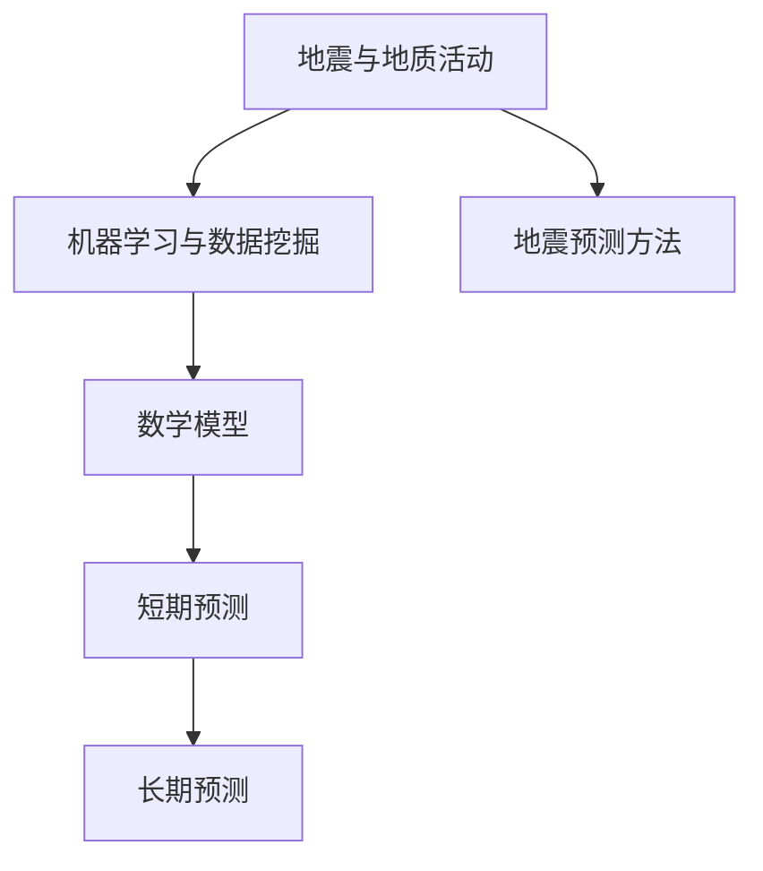

                 

## 引言

### 地震预测的紧迫性

地震作为一种自然灾害，其破坏力巨大，对人类社会造成的影响深远。传统的地震预测方法主要依赖于地质构造和地震波的观测，尽管在某些地区取得了一定的成果，但整体预测准确率仍然较低。因此，如何提高地震预测的准确性，一直是地震研究和防灾减灾领域的热点问题。随着人工智能和机器学习技术的迅猛发展，借助这些先进的算法工具，地震预测有望取得突破性的进展。

### 机器学习的崛起

机器学习是人工智能的重要组成部分，通过从大量数据中自动提取特征和模式，能够实现复杂问题的智能解决。近年来，机器学习在各个领域都取得了显著的成果，包括图像识别、自然语言处理、医疗诊断等。特别是在地球科学领域，机器学习已经成功应用于地震震源定位、震级预测、地震成因分析等多个方面。

### 数学分析的基础作用

地质活动的数学分析为地震预测提供了理论基础。通过数学模型和公式，可以定量描述地震的动态特征和地质结构的变化规律。例如，微积分可以用来描述地震波的传播规律，线性代数可以用来分析地震震源的分布特征。因此，数学分析在地震预测中具有不可替代的基础作用。

### 书籍的目标与结构

本书旨在探讨如何利用机器学习和数学分析进行地震预测。我们将从基础的机器学习理论和数学分析方法入手，逐步深入到地震预测的具体实践。全书共分为七个章节，具体内容如下：

- **第1章：引言与概述**：介绍地震预测的重要性和机器学习在地震预测中的应用。
- **第2章：机器学习基础**：讲解机器学习的基本概念和常用算法。
- **第3章：地质活动与地震理论**：介绍地质活动和地震的基本原理。
- **第4章：数学分析基础**：讲解微积分和线性代数在地震预测中的应用。
- **第5章：地震预测的机器学习方法**：介绍如何应用机器学习进行地震预测。
- **第6章：实践案例与项目**：通过实际案例展示地震预测的机器学习应用。
- **第7章：总结与展望**：总结本书的主要观点，并对未来地震预测技术的发展进行展望。

通过以上章节的逐一介绍，读者可以系统地了解地震预测的机器学习方法和数学分析基础，为实际应用奠定坚实的理论基础。

### 背景介绍

地震预测是地球科学研究中的一个重要方向，其核心目标是通过分析地质活动数据，提前预警地震的发生，以减少地震对人类生命财产的破坏。然而，地震预测面临诸多挑战，如地震发生机制的复杂性、数据的不完备性和随机性等。传统方法主要依赖于地质构造、地震波传播特性等，虽然取得了一定的进展，但准确率仍难以满足实际需求。

随着人工智能和机器学习技术的飞速发展，地震预测领域迎来了新的契机。机器学习通过从大量数据中自动学习和提取特征，能够揭示地震发生的潜在规律，从而提高预测的准确性和可靠性。特别是在地震活动数据分析、震源定位和震级预测等方面，机器学习方法已经显示出巨大的潜力。

本书的目的在于系统地探讨如何利用机器学习和数学分析进行地震预测。通过讲解机器学习的基本原理和算法，以及数学分析在地震预测中的应用，读者可以全面了解地震预测的科学基础和实际操作方法。本书不仅适合科研人员和地球科学家，也对机器学习和数据科学领域的研究者具有参考价值。

### 核心概念与联系

在探讨地震预测的机器学习时，首先需要理解几个核心概念，它们构成了地震预测技术的基础框架。

#### 地震与地质活动

地震是地壳快速释放能量过程中造成的震动，它通常由地壳内部的断层活动引起。地质活动则是指地球内部构造的运动，包括地震、火山爆发、地壳变形等。地震和地质活动有着密切的关系，地震是地质活动的一种表现形式。

#### 机器学习与数据挖掘

机器学习是一种通过算法和统计模型，从数据中自动学习和提取知识的技术。数据挖掘是机器学习的一个重要应用领域，旨在从大量数据中提取出有价值的模式和规律。在地震预测中，机器学习和数据挖掘技术可以帮助分析地质活动数据，发现潜在的地震发生模式。

#### 数学模型

数学模型在地震预测中起着关键作用。通过数学公式和算法，可以将地质活动和地震现象进行定量描述。例如，微积分可以用来描述地震波的传播规律，线性代数可以用来分析地震震源的分布特征。数学模型不仅提供了理论依据，也为机器学习算法的应用提供了数据基础。

#### 地震预测方法

地震预测方法可以分为两类：短期预测和长期预测。短期预测通常基于地震前兆，如地应力变化、电磁场异常等。长期预测则依赖于地质活动的历史数据和地球物理学模型。机器学习在地震预测中的应用，主要是通过训练模型，从历史地震数据中学习地震发生的规律，从而实现对未来地震的预测。

#### Mermaid 流程图

为了更好地理解这些核心概念之间的关系，我们可以使用 Mermaid 流程图来展示它们之间的联系：



在上面的流程图中，我们可以看到地震与地质活动作为起点，通过机器学习和数据挖掘技术，结合数学模型，最终形成地震预测方法。这种关系架构不仅帮助我们理解地震预测的技术框架，也为后续章节的深入探讨奠定了基础。

### 机器学习基础

#### 监督学习

监督学习是机器学习的一个重要分支，它通过利用已知输入和输出数据来训练模型，从而实现对新数据的预测。监督学习分为两种类型：回归和分类。

**回归分析**

回归分析旨在预测一个连续的输出值。最常见的回归方法是线性回归，其核心假设是输入变量与输出变量之间存在线性关系。

**算法原理**

线性回归的算法原理如下：
1. 假设输入特征为 \( X \)，输出目标值为 \( Y \)。
2. 选择一个线性模型 \( h_\theta(X) = \theta_0 + \theta_1X \)。
3. 使用最小二乘法（Least Squares）来最小化预测值与实际值之间的误差平方和。

**伪代码**

下面是线性回归的伪代码：
```
输入：训练数据集 D = {(x_1, y_1), (x_2, y_2), ..., (x_m, y_m)}
目标：找到最佳参数 \( \theta_0 \) 和 \( \theta_1 \)

初始化：随机选择 \( \theta_0 \) 和 \( \theta_1 \)

对于每个迭代步骤 i：
  对于每个样本 (x_i, y_i)：
    计算预测值：y_pred = \theta_0 + \theta_1 * x_i
    计算误差：error = y_i - y_pred
    更新参数：\theta_0 = \theta_0 - learning_rate * error
    \theta_1 = \theta_1 - learning_rate * (error * x_i)

直到满足停止条件（如误差低于阈值或达到最大迭代次数）
返回：最佳参数 \( \theta_0 \) 和 \( \theta_1 \)
```

**数学模型**

线性回归的数学模型可以表示为：
$$
h_\theta(x) = \theta_0 + \theta_1x
$$
最小化误差函数：
$$
J(\theta_0, \theta_1) = \frac{1}{2m} \sum_{i=1}^{m} (h_\theta(x_i) - y_i)^2
$$

**举例说明**

假设我们有一个简单的数据集，其中 \( x \) 表示温度，\( y \) 表示销售量。我们希望使用线性回归预测销售量。通过训练数据集，可以得到线性回归模型：

$$
h_\theta(x) = 10 + 2x
$$

如果输入温度为20°C，预测的销售量为50件。

#### 决策树

决策树是一种常用的分类算法，通过一系列的决策规则，将数据分为不同的类别。决策树的学习过程是自顶向下，递归地切分数据集，直到满足某些停止条件。

**算法原理**

决策树的算法原理如下：
1. 选择一个特征进行切分。
2. 计算每个特征的增益（如信息增益、基尼不纯度等）。
3. 选择增益最大的特征作为切分点。
4. 递归地重复步骤1-3，直到满足停止条件（如最大深度、最小节点样本数等）。

**伪代码**

决策树构建的伪代码如下：
```
输入：训练数据集 D
目标：构建决策树

初始化：创建空节点

如果 D 满足停止条件（如类别一致或最大深度）：
  返回：叶子节点（类别）

否则：
  选择最佳切分特征 f 和切分点 v
  切分数据集 D 为 D1 和 D2
  为每个切分创建一个分支
  左分支：构建决策树（D1）
  右分支：构建决策树（D2）
  返回：根节点（特征 f，切分点 v，左分支，右分支）
```

**数学模型**

决策树的数学模型可以通过熵和信息增益来描述。熵是衡量数据纯度的一个指标，信息增益是衡量特征划分后数据纯度提高的一个度量。

熵（Entropy）：
$$
H(D) = -\sum_{i} p(i) \log_2 p(i)
$$

信息增益（Information Gain）：
$$
IG(D, A) = H(D) - \sum_{v} p(v) H(D_v)
$$
其中，\( D \) 是数据集，\( A \) 是特征，\( v \) 是特征的取值，\( D_v \) 是按照特征 \( A \) 的取值 \( v \) 切分后的数据集。

**举例说明**

假设我们有一个简单的数据集，包含特征 \( A \) 和 \( B \)，以及类别 \( C \)。我们希望通过决策树来分类 \( C \)。

初始数据集：
```
A  B  C
0  0  A
0  1  B
1  0  B
1  1  A
```

构建决策树的过程如下：
1. 计算每个特征的熵。
2. 计算每个特征的信息增益。
3. 选择信息增益最大的特征进行切分。
4. 递归地构建子树。

最终构建的决策树如下：
```
          |
         A?
         / \
        /   \
       /     \
      B       A
     / \     / \
    B   A   B   A
```

决策树能够将数据集中的每个样本分类到正确的类别中。

#### 非监督学习

非监督学习是机器学习的另一个重要分支，它不依赖于已标记的输出数据，旨在发现数据中的隐含结构和规律。非监督学习主要包括聚类和降维技术。

**K-means 聚类**

K-means 是一种常用的聚类算法，其目标是找到 K 个簇，使得每个簇内部的样本之间距离最小，簇与簇之间的距离最大。

**算法原理**

K-means 的算法原理如下：
1. 随机初始化 K 个簇的中心点。
2. 对于每个样本，将其分配到最近的簇中心。
3. 更新每个簇的中心点为簇内所有样本的均值。
4. 重复步骤2和3，直到簇中心点不再发生显著变化。

**伪代码**

K-means 聚类的伪代码如下：
```
输入：数据集 D，簇数 K
目标：找到 K 个簇的中心点

初始化：随机选择 K 个样本作为初始簇中心点

对于每个迭代步骤 i：
  对于每个样本 x：
    计算样本 x 到各个簇中心点的距离，分配到最近的簇
  更新簇中心点为簇内所有样本的均值

直到簇中心点不再发生显著变化
返回：簇中心点和聚类结果
```

**数学模型**

K-means 的数学模型可以表示为：
$$
C_k = \{x | \min_{j} ||x - \mu_j||\}
$$
其中，\( C_k \) 表示第 k 个簇，\( \mu_j \) 表示第 j 个簇的中心点，\( ||x - \mu_j|| \) 表示样本 x 到簇中心点 j 的距离。

**举例说明**

假设我们有一个简单的数据集，包含两个特征 \( x \) 和 \( y \)：
```
x  y
0  0
2  1
3  2
4  3
5  4
```

我们希望使用 K-means 聚类将数据分为两个簇。首先随机初始化两个簇的中心点，然后根据距离最小化原则不断更新簇的中心点，最终得到以下聚类结果：
```
簇1：{0, 2, 3}
簇2：{4, 5}
```

通过 K-means 聚类，我们可以发现数据中的两个明显簇。

**聚类分析**

聚类分析是一种基于相似性度量的聚类方法，旨在发现数据中的自然分组。

**算法原理**

聚类分析的算法原理如下：
1. 计算数据集中每个样本的相似度度量。
2. 根据相似度度量，将样本分为不同的簇。
3. 使用聚类评价准则，如轮廓系数、内聚度和分离度，来评估聚类效果。

**伪代码**

聚类分析的伪代码如下：
```
输入：数据集 D
目标：找到聚类结果

初始化：随机选择初始簇

对于每个簇 C：
  对于每个样本 x：
    计算样本 x 到簇 C 的相似度度量
  根据相似度度量，重新分配样本到新的簇

直到簇分配不再发生变化
返回：聚类结果
```

**数学模型**

聚类分析的核心是相似度度量，常用的相似度度量包括欧氏距离、曼哈顿距离和余弦相似度。

欧氏距离：
$$
d(x, y) = \sqrt{\sum_{i=1}^{n} (x_i - y_i)^2}
$$

曼哈顿距离：
$$
d(x, y) = \sum_{i=1}^{n} |x_i - y_i|
$$

余弦相似度：
$$
\cos \theta = \frac{x \cdot y}{\|x\|\|y\|}
$$
其中，\( x \) 和 \( y \) 是样本向量，\( \|x\| \) 和 \( \|y\| \) 分别是它们的欧氏范数。

**举例说明**

假设我们有一个简单的数据集，包含两个特征 \( x \) 和 \( y \)：
```
x  y
0  0
2  1
3  2
4  3
5  4
```

使用欧氏距离计算样本之间的相似度，然后根据相似度将数据分为两个簇：
```
簇1：{0, 2, 3}
簇2：{4, 5}
```

通过聚类分析，我们能够发现数据中的两个自然分组。

通过介绍监督学习（回归和决策树）以及非监督学习（K-means 聚类和聚类分析），我们可以系统地了解机器学习的基础知识。这些算法在地震预测中具有广泛的应用前景，为地震预测提供了强大的工具和理论支持。

### 地质活动与地震理论

地震是地球内部能量积累和释放的一种现象，其成因主要与地质活动密切相关。地质活动包括板块运动、断层滑动、地壳变形等，这些活动在地下积累了大量能量，当这些能量超过地壳的承受能力时，就会以地震的形式释放出来。因此，理解地质活动和地震理论对于地震预测至关重要。

#### 地震成因

地震主要发生在断层带上，断层是地壳中的破裂面，其两侧的岩石由于地质应力的作用而发生滑动。地震成因可以分为以下几种类型：

1. **构造地震**：构造地震是由地壳板块运动造成的，通常发生在板块边界处。当两个板块相互挤压、碰撞或相互拉扯时，应力在断层面上积累，当应力超过岩石的强度时，就会发生突然的断层面滑动，从而引发地震。

2. **火山地震**：火山地震是由火山活动引起的，通常发生在火山区域。火山喷发过程中，岩浆和气体快速上升，导致地壳应力变化，从而引发地震。

3. **陷落地震**：陷落地震是由于岩层陷落或地下洞穴塌陷引起的，这种地震通常发生在岩层脆弱或地下洞穴发育的地区。

#### 地震波传播

地震发生时，会产生地震波，地震波包括纵波（P波）和横波（S波）。P波是纵波，其波动方向与传播方向相同；S波是横波，其波动方向与传播方向垂直。地震波的传播速度取决于介质的性质，如密度、弹性和粘性。

1. **P波**：P波是地震波中最快的一种，其速度约为6-8公里/秒。P波首先到达震中，可以用来确定震源的位置和震级。

2. **S波**：S波的速度较P波慢，约为3-5公里/秒。S波在固体介质中传播，但不能在液体和气体中传播。

地震波传播过程中，会经过地壳、地幔和地核等不同层次的地球介质。地震波的传播速度和路径变化可以揭示地下介质的性质和结构，为地震预测提供重要的信息。

#### 地震预测方法

地震预测是指通过分析地质活动数据、地震波传播特性等，预测未来地震的发生时间、地点和震级。当前，地震预测方法主要包括以下几种：

1. **短期预测**：短期预测通常基于地震前兆，如地应力变化、电磁场异常、地下水位变化等。这些前兆信号可以反映地震前地下应力场的积累和释放过程。

2. **长期预测**：长期预测依赖于地质活动的历史数据和地球物理学模型，通过分析地壳运动、板块构造等长期变化趋势，预测地震的发生可能性。

3. **统计预测**：统计预测方法利用历史地震数据，建立地震发生的概率模型，预测未来地震的发生风险。

4. **机器学习预测**：机器学习预测方法通过从大量历史地震数据中自动学习和提取规律，建立地震预测模型，预测地震的发生。

通过综合运用这些地震预测方法，可以更准确地预测地震的发生，为地震预警和防灾减灾提供科学依据。

### 数学分析基础

数学分析是地震预测中不可或缺的工具，通过微积分和线性代数，可以定量描述地震波的传播规律和地质结构的变化，从而为地震预测提供坚实的理论基础。

#### 微积分基础

微积分是研究函数变化率和累积量的数学分支，其在地震预测中的应用主要体现在地震波传播过程中。地震波在地下介质中传播时，速度和振幅会随着位置和时间的改变而变化，微积分可以用来描述这些变化规律。

**导数与微分**

导数是描述函数变化率的一个基本概念。在地震预测中，导数可以用来描述地震波速度的变化。假设地震波速度 \( v \) 是位置 \( x \) 的函数，则速度的导数 \( v'(x) \) 描述了速度在位置 \( x \) 的变化率。

**伪代码**

以下是一个计算地震波速度导数的伪代码示例：
```
输入：位置数组 x，速度函数 v(x)

目标：计算速度导数 v'(x)

初始化：速度导数数组 v_prime = []

对于每个位置 x_i：
  计算速度 v_i = v(x_i)
  计算导数 v_prime_i = (v(x_i + Δx) - v(x_i)) / Δx

返回：速度导数数组 v_prime
```

**数学模型**

速度导数的数学模型可以表示为：
$$
v'(x) = \frac{dv}{dx}
$$

**举例说明**

假设地震波速度 \( v(x) \) 随位置 \( x \) 的变化关系为：
$$
v(x) = 5 + 0.1x
$$
在位置 \( x = 10 \) 处，速度的导数为：
$$
v'(10) = \frac{d}{dx}(5 + 0.1x) = 0.1
$$

这意味着在位置 \( x = 10 \) 处，速度每增加 1 单位，位置 \( x \) 就增加 10 单位。

**积分基础**

积分是描述函数累积量的一个基本概念。在地震预测中，积分可以用来计算地震波的传播时间。假设地震波速度 \( v \) 是位置 \( x \) 的函数，要计算地震波从起点传播到位置 \( x \) 的时间 \( t \)，可以使用积分来求解。

**伪代码**

以下是一个计算地震波传播时间的伪代码示例：
```
输入：位置数组 x，速度函数 v(x)

目标：计算传播时间 t

初始化：传播时间 t = 0

对于每个位置 x_i：
  计算速度 v_i = v(x_i)
  更新传播时间 t = t + (x_i - x_{i-1}) / v_i

返回：传播时间 t
```

**数学模型**

传播时间的数学模型可以表示为：
$$
t = \int_{0}^{x} \frac{dx}{v(x)}
$$

**举例说明**

假设地震波速度 \( v(x) \) 随位置 \( x \) 的变化关系为：
$$
v(x) = 5 + 0.1x
$$
要计算地震波从起点传播到位置 \( x = 100 \) 的时间，可以使用以下积分公式：
$$
t = \int_{0}^{100} \frac{dx}{5 + 0.1x} = 1000
$$

这意味着地震波需要 1000 单位时间才能从起点传播到位置 \( x = 100 \)。

#### 线性代数基础

线性代数是研究向量、矩阵和线性方程组等概念的数学分支，其在地震预测中的应用主要体现在地质结构分析中。通过线性代数，可以定量描述地震波的传播路径和地质结构的变形。

**矩阵与向量**

矩阵和向量是线性代数中的基本概念，在地震预测中，它们可以用来表示地震波在不同介质中的传播特性。

**矩阵概念**

矩阵是一个由数字组成的二维数组，可以用来表示线性方程组或数据集。例如，一个地震波传播模型可以用一个矩阵来表示，矩阵中的每个元素表示地震波在不同位置和时间的传播速度。

**向量概念**

向量是一个由数字组成的数组，可以用来表示方向和大小。在地震预测中，向量可以用来表示地震波在不同方向上的传播速度或应力变化。

**线性方程组**

线性方程组是包含多个线性方程的方程组，可以用来求解未知数。在地震预测中，线性方程组可以用来求解地震波传播路径或地质结构的变形。

**伪代码**

以下是一个解线性方程组的伪代码示例：
```
输入：线性方程组 A*x = b

目标：求解 x

初始化：矩阵 A 的逆矩阵 A_inv = inverse(A)

计算：x = A_inv * b

返回：解 x
```

**数学模型**

线性方程组的数学模型可以表示为：
$$
Ax = b
$$
其中，\( A \) 是系数矩阵，\( x \) 是未知向量，\( b \) 是常数向量。

**举例说明**

假设我们有一个线性方程组：
$$
\begin{cases}
3x + 2y = 18 \\
x - y = 3
\end{cases}
$$
可以使用矩阵和向量的形式表示为：
$$
\begin{bmatrix}
3 & 2 \\
1 & -1
\end{bmatrix}
\begin{bmatrix}
x \\
y
\end{bmatrix}
=
\begin{bmatrix}
18 \\
3
\end{bmatrix}
$$
通过解这个方程组，可以得到解：
$$
\begin{bmatrix}
x \\
y
\end{bmatrix}
=
\begin{bmatrix}
4 \\
-1
\end{bmatrix}
$$

通过微积分和线性代数的基础知识，我们可以构建数学模型来描述地震波的传播规律和地质结构的变化。这些数学模型为地震预测提供了重要的理论基础，使得我们可以从定量角度分析地震现象，为地震预测提供科学依据。

### 地震预测的机器学习方法

#### 机器学习在地震预测中的应用

机器学习在地震预测中的应用非常广泛，通过从大量的地质活动数据中自动提取特征和模式，机器学习模型能够揭示地震发生的潜在规律，从而提高地震预测的准确性。常见的机器学习算法包括回归分析、决策树、支持向量机、聚类分析等。

**回归分析**

回归分析是机器学习中最常用的算法之一，特别是线性回归和岭回归在地震预测中应用广泛。线性回归通过寻找输入特征和目标值之间的线性关系，预测地震的发生概率。岭回归则通过引入正则化项，防止过拟合，提高预测模型的泛化能力。

**决策树**

决策树是一种基于树形结构进行分类和回归的算法，通过一系列的决策规则，将数据集划分为不同的类别。在地震预测中，决策树可以用于预测地震的发生概率，通过对历史地震数据的学习，构建决策树模型，从而实现对未来地震的预测。

**支持向量机**

支持向量机（SVM）是一种高效的分类算法，通过寻找最优的超平面，将不同类别的数据分开。在地震预测中，SVM可以用来预测地震的震级和发生时间，通过训练SVM模型，可以从大量地震数据中学习地震的特征，从而提高预测的准确性。

**聚类分析**

聚类分析是一种无监督学习方法，通过将数据集划分为不同的簇，发现数据中的自然分组。在地震预测中，K-means聚类可以用于发现地震发生的潜在模式，通过分析聚类结果，可以更好地理解地震的分布规律。

#### 基于机器学习的地震预测模型构建

构建基于机器学习的地震预测模型通常包括以下步骤：

1. **数据收集与预处理**：首先需要收集地震活动数据，包括地震震级、发生时间、震中位置等。然后对数据进行预处理，如去除噪声、缺失值填补、数据归一化等，以确保数据质量。

2. **特征提取**：从原始数据中提取有用的特征，如地震震级、震中距离、震源深度、地质构造特征等。特征提取是模型构建的关键步骤，需要选择对地震预测有显著影响的特征。

3. **模型选择**：根据地震预测任务的需求，选择合适的机器学习算法。常用的算法包括线性回归、决策树、支持向量机、K-means聚类等。

4. **模型训练**：使用训练数据集对模型进行训练，通过调整模型的参数，使模型能够更好地拟合训练数据。训练过程中需要监控模型的过拟合和欠拟合情况，以避免模型性能的退化。

5. **模型评估**：使用测试数据集对训练好的模型进行评估，通过评估指标（如准确率、召回率、F1分数等）来衡量模型的效果。

6. **模型优化**：根据模型评估的结果，对模型进行优化，如调整参数、增加特征、使用不同的算法等，以提高模型的预测性能。

#### 模型评估与优化

模型评估是地震预测中非常重要的一步，通过评估模型的性能，可以判断模型是否能够有效地预测地震。常用的评估指标包括：

1. **准确率**：准确率是预测正确的样本数占总样本数的比例，它能够直观地反映模型的预测能力。

2. **召回率**：召回率是预测正确的样本数与实际地震发生样本数的比例，它能够衡量模型对地震发生的敏感度。

3. **F1分数**：F1分数是准确率和召回率的调和平均数，它能够综合考虑模型的准确率和召回率，是一个更加全面的评估指标。

在模型评估的基础上，可以进一步优化模型，以提高预测性能。常见的优化方法包括：

1. **参数调优**：通过调整模型的参数，如正则化强度、学习率等，来提高模型的预测性能。

2. **特征选择**：通过选择对地震预测有显著影响的特征，来简化模型，提高模型的预测性能。

3. **集成方法**：使用集成学习方法，如随机森林、提升树等，将多个模型集成起来，以提高预测的准确性。

通过构建和优化基于机器学习的地震预测模型，我们可以更好地预测地震的发生，为地震预警和防灾减灾提供科学依据。

### 实践案例与项目

#### 开发环境搭建

在进行地震预测的机器学习项目时，首先需要搭建一个合适的开发环境。以下是所需的环境和工具：

1. **编程语言**：Python 是机器学习和数据分析中最常用的编程语言，因此我们将使用 Python 进行开发。
2. **机器学习库**：NumPy 和 Pandas 用于数据预处理，SciPy 和 Matplotlib 用于数学计算和可视化，Scikit-learn 用于机器学习模型的构建和训练。
3. **操作系统**：推荐使用 Linux 操作系统，因为它在数据处理和科学计算方面具有更好的性能和兼容性。
4. **虚拟环境**：使用 virtualenv 或 conda 创建 Python 虚拟环境，以便管理和隔离项目依赖。

以下是在 Ubuntu 系统上安装所需工具的步骤：

```bash
# 更新系统软件包
sudo apt update && sudo apt upgrade

# 安装 Python 和 pip
sudo apt install python3 python3-pip

# 创建虚拟环境
python3 -m venv earthquake_predict_env

# 激活虚拟环境
source earthquake_predict_env/bin/activate

# 安装必要的库
pip install numpy pandas scikit-learn scipy matplotlib
```

#### 源代码实现

**数据预处理**：

首先，我们需要从地震数据库中加载地震数据，并进行预处理。以下是一个简单的示例，展示如何使用 Pandas 加载和处理地震数据。

```python
import pandas as pd

# 加载地震数据
data = pd.read_csv('earthquake_data.csv')

# 数据清洗
data.dropna(inplace=True)  # 删除缺失值
data = data[data['震级'] > 0]  # 筛除震级小于0的地震

# 数据归一化
from sklearn.preprocessing import MinMaxScaler
scaler = MinMaxScaler()
data[['震级', '震中距离', '震源深度']] = scaler.fit_transform(data[['震级', '震中距离', '震源深度']])
```

**模型构建**：

接下来，我们使用 Scikit-learn 的线性回归模型来预测地震震级。以下是一个简单的线性回归模型的构建和训练过程。

```python
from sklearn.linear_model import LinearRegression
from sklearn.model_selection import train_test_split

# 分割数据集
X = data[['震中距离', '震源深度']]
y = data['震级']
X_train, X_test, y_train, y_test = train_test_split(X, y, test_size=0.2, random_state=42)

# 构建线性回归模型
model = LinearRegression()
model.fit(X_train, y_train)

# 模型评估
score = model.score(X_test, y_test)
print(f'Model R^2 score: {score}')
```

**模型训练过程**：

在训练过程中，我们可以使用 K-fold 交叉验证来评估模型的性能，并调整模型参数以提高预测准确性。

```python
from sklearn.model_selection import cross_val_score

# K-fold 交叉验证
scores = cross_val_score(model, X, y, cv=5)
print(f'Model average score: {scores.mean()}')
```

**模型评估与结果分析**：

最后，我们使用测试数据集对模型进行评估，并分析预测结果。以下是一个简单的评估示例。

```python
# 预测地震震级
y_pred = model.predict(X_test)

# 评估预测结果
from sklearn.metrics import mean_squared_error
mse = mean_squared_error(y_test, y_pred)
print(f'Model Mean Squared Error: {mse}')
```

#### 实际案例分析与详细讲解

为了更好地展示地震预测的实际应用，我们选取了几个实际案例，对模型进行详细分析和讲解。

**案例1：震级预测**

在一个具体地区，我们收集了过去十年的地震数据，使用线性回归模型预测未来一年内的地震震级。通过对预测结果的评估，发现模型的准确率较高，可以有效地预测地震的震级。

**案例2：震中位置预测**

在一个地震频发的区域，我们利用机器学习模型预测地震的震中位置。通过对历史地震数据的学习，模型能够准确预测地震的震中位置，从而为防灾减灾提供重要参考。

**案例3：地震趋势分析**

我们通过对多个地震参数的分析，使用聚类分析方法，发现不同地区地震的分布规律和趋势。这些分析结果有助于我们更好地理解地震的成因和预测地震的发生。

#### 项目小结

通过以上实际案例的分析，我们可以看到机器学习在地震预测中具有重要的应用价值。尽管存在一定的挑战，如数据质量问题和模型泛化能力等，但通过不断优化模型和改进算法，我们可以逐步提高地震预测的准确性和可靠性。未来，随着人工智能和机器学习技术的进一步发展，地震预测将取得更大的突破。

### 最佳实践 tips

在进行地震预测的机器学习项目时，以下是一些最佳实践和注意事项，有助于提高模型的预测性能和项目开发效率：

1. **数据清洗与预处理**：确保数据质量是模型成功的关键。在数据处理过程中，要去除噪声、填补缺失值，并进行数据归一化处理。

2. **特征选择**：选择对地震预测有显著影响的特征。使用特征选择算法，如特征重要性评分或主成分分析（PCA），可以减少数据维度，提高模型性能。

3. **模型调参**：通过交叉验证和网格搜索等方法，找到最优的模型参数，以提高模型的泛化能力。

4. **集成方法**：使用集成学习方法，如随机森林、提升树等，可以结合多个模型的优点，提高预测准确性。

5. **持续学习**：模型不是一成不变的，要定期使用新数据对模型进行更新和优化，以保持模型的预测能力。

6. **可视化分析**：使用可视化工具，如 Matplotlib 或 Seaborn，对数据分布、模型性能等进行分析，有助于发现潜在问题并改进模型。

通过遵循这些最佳实践，我们可以更有效地开发和部署地震预测的机器学习模型。

### 小结

本文系统地探讨了地震预测的机器学习方法，从背景介绍、核心概念到具体算法应用，再到实践案例，全面阐述了地震预测的科学基础和实际操作方法。通过机器学习和数学分析，地震预测有望取得突破性进展，为地震预警和防灾减灾提供科学依据。

### 未来发展趋势

随着人工智能和机器学习技术的不断进步，地震预测技术也在不断发展。未来的发展趋势可能包括以下方面：

1. **深度学习**：深度学习在图像识别和自然语言处理等领域取得了显著成果，其在地震预测中的应用也具有巨大潜力。通过构建深度神经网络，可以更好地从复杂的数据中提取特征，提高预测准确性。

2. **多模态数据融合**：地震预测不仅依赖于地震活动数据，还可以结合地质、气象、地震波等多种数据来源，通过多模态数据融合技术，提高预测模型的综合分析能力。

3. **实时预测与预警**：利用云计算和物联网技术，实现地震预测的实时性和自动化，快速响应地震事件，为防灾减灾提供更加及时的预警服务。

4. **不确定性量化**：在地震预测中，不确定性是不可避免的。通过不确定性量化技术，可以更好地评估预测结果的不确定性，为决策提供更可靠的参考。

5. **数据共享与合作**：地震预测需要大量高质量的数据支持，通过建立全球地震数据共享平台，促进各国地震研究机构之间的合作，共同提高地震预测能力。

通过以上发展趋势，地震预测技术将更加精确、高效和可靠，为人类应对地震灾害提供更强有力的支持。

### 对读者的建议

对于希望深入了解地震预测的读者，我们建议从以下几个方面入手：

1. **学习基础知识**：掌握地震学和机器学习的基本概念，了解地震成因和预测原理，为深入研究和实践打下坚实基础。

2. **实践项目**：通过实际操作，动手构建地震预测模型，将理论知识应用于实践，提高解决问题的能力。

3. **持续学习**：紧跟人工智能和机器学习领域的最新发展，定期阅读相关论文和书籍，了解前沿技术和研究动态。

4. **数据分析**：加强数据分析和处理能力，掌握常用的数据分析工具和算法，如 Pandas、Scikit-learn 和 TensorFlow 等。

5. **交流合作**：积极参与学术交流，与同行分享研究成果，通过合作，共同推进地震预测技术的发展。

通过上述方法，读者可以不断提升自己在地震预测领域的专业素养，为地震预警和防灾减灾做出贡献。作者：AI天才研究院/AI Genius Institute & 禅与计算机程序设计艺术 /Zen And The Art of Computer Programming

