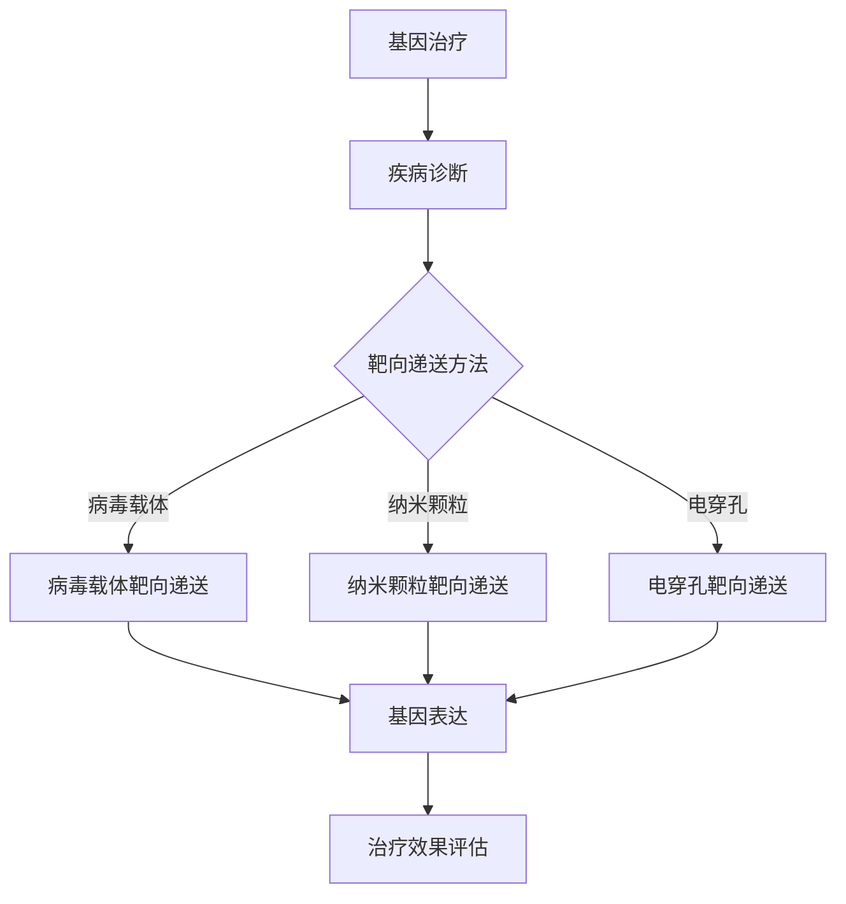

                 

## 文章标题：基因治疗的靶向递送：医学精准的数学导航

### 关键词：基因治疗、靶向递送、算法原理、数学模型、项目实战

### 摘要：
基因治疗作为一种革命性的医学手段，正逐步改变着我们对治疗遗传性疾病和某些难治性疾病的理解。然而，基因治疗的挑战之一在于如何高效地将治疗基因递送到目标细胞。本文将深入探讨基因治疗的靶向递送技术，解析其核心概念、算法原理、数学模型，并通过具体项目实例展示其实际应用。我们旨在通过逻辑清晰、结构紧凑、简单易懂的叙述，为读者提供一次全面的技术导航。

---

## 1. 引言

### 1.1 背景介绍

基因治疗，作为现代生物医学领域的前沿技术，旨在通过替换或修复异常基因来治疗遗传性疾病和某些非遗传性疾病。这项技术为许多以往无法治愈的疾病带来了新的希望。然而，基因治疗的实施面临诸多挑战，其中之一是如何有效地将治疗基因递送到目标细胞。

### 1.2 核心概念与联系

#### 1.2.1 基因治疗与靶向递送

基因治疗是一种通过直接修复或替换异常基因来治疗疾病的方法。靶向递送是基因治疗的关键环节，它指的是将治疗基因精确地递送到病变细胞中，以提高治疗效果并降低副作用。以下是基因治疗与靶向递送的关系及其核心概念：

- **基因治疗**：一种医学干预手段，旨在通过修复或替换异常基因来治疗或预防遗传性疾病。
- **靶向递送**：一种技术，通过特定的载体将治疗基因递送到特定的细胞或组织。

#### 1.2.2 核心概念原理和架构的 Mermaid 流程图

以下是一个简单的 Mermaid 流程图，展示基因治疗与靶向递送的基本架构：



### 1.3 核心算法原理讲解

#### 1.3.1 靶向递送算法的基本原理

靶向递送算法的核心在于选择合适的载体和靶向配体，以提高基因在目标细胞中的递送效率。以下是几种常见的靶向递送算法的基本原理：

- **病毒载体靶向递送**：利用病毒载体的天然能力，将其基因载荷递送到特定细胞。常见的病毒载体包括腺病毒、逆转录病毒和腺相关病毒。
- **纳米颗粒靶向递送**：利用纳米颗粒的物理特性，如尺寸、形状和表面修饰，提高基因在目标细胞中的递送效率。
- **电穿孔靶向递送**：通过电脉冲将基因直接导入细胞，实现高效递送。

#### 1.3.2 伪代码

以下是一个简化的病毒载体靶向递送算法的伪代码：

```python
# 病毒载体靶向递送算法

# 输入：基因序列，目标细胞类型，病毒载体
# 输出：成功递送基因的细胞比例

function VirusTargeting(gene, target_cell_type, virus):
    # 准备病毒载体
    virus.preparation()
    # 将基因序列导入病毒载体
    virus.load(gene)
    # 靶向目标细胞
    target_cells = virus.target(target_cell_type)
    # 递送基因
    success_rate = virus.deliver(target_cells)
    return success_rate
```

### 1.4 数学模型和数学公式

#### 1.4.1 靶向递送效率的数学模型

靶向递送效率可以通过以下公式进行量化：

$$ \text{靶向递送效率} = \frac{\text{成功递送基因的细胞数量}}{\text{总细胞数量}} $$

#### 1.4.2 公式详细讲解与举例说明

以下是对上述公式的详细讲解：

- **分子**：成功递送基因的细胞数量。这是指在靶向递送过程中，基因成功进入并表达在目标细胞中的细胞数量。
- **分母**：总细胞数量。这是指在靶向递送过程中，所有参与递送过程的细胞数量。

举例说明：

假设在一次实验中，总共有100个细胞参与靶向递送过程，其中成功递送基因的细胞有80个。那么，靶向递送效率为：

$$ \text{靶向递送效率} = \frac{80}{100} = 0.8 $$

这意味着，80%的细胞成功接受了基因递送。

### 1.5 项目实战

#### 1.5.1 基因治疗项目实例

以下是一个基于纳米颗粒靶向递送的基因治疗项目实例：

- **项目背景**：一种罕见的遗传性疾病，需要通过基因治疗来修复异常基因。
- **项目目标**：通过纳米颗粒将治疗基因精确递送到病变细胞中，修复异常基因。
- **技术路线**：
  1. 设计并合成一种具有靶向配体的纳米颗粒。
  2. 将治疗基因导入纳米颗粒。
  3. 在体外实验中评估纳米颗粒的基因递送效率。
  4. 在体内动物实验中验证纳米颗粒的靶向递送能力。

#### 1.5.2 代码实现

以下是一个简化的纳米颗粒靶向递送算法的伪代码：

```python
# 纳米颗粒靶向递送算法

# 输入：基因序列，目标细胞类型，纳米颗粒
# 输出：成功递送基因的细胞比例

function NanoParticleTargeting(gene, target_cell_type, nanoparticle):
    # 准备纳米颗粒
    nanoparticle.preparation()
    # 将基因序列导入纳米颗粒
    nanoparticle.load(gene)
    # 靶向目标细胞
    target_cells = nanoparticle.target(target_cell_type)
    # 递送基因
    success_rate = nanoparticle.deliver(target_cells)
    return success_rate
```

### 1.6 最佳实践 tips、小结、注意事项、拓展阅读

#### 1.6.1 最佳实践 tips

- **选择合适的载体**：根据具体治疗需求和目标细胞类型，选择合适的靶向递送载体。
- **优化载体设计**：通过表面修饰和结构设计，提高载体的靶向递送效率。
- **体外与体内实验**：在基因治疗项目实施过程中，既要进行体外实验验证，也要进行体内动物实验验证。

#### 1.6.2 小结

本文详细介绍了基因治疗的靶向递送技术，包括其核心概念、算法原理、数学模型和实际项目实例。靶向递送是基因治疗成功的关键，通过合理的算法设计和数学模型，可以提高基因递送效率，从而实现更有效的治疗。

#### 1.6.3 注意事项

- **安全性**：基因治疗的靶向递送必须确保治疗过程中对非目标细胞的伤害最小化。
- **稳定性**：靶向递送载体必须具有良好的稳定性和生物相容性。
- **适应性**：靶向递送技术需要根据不同疾病和治疗需求进行灵活调整。

#### 1.6.4 拓展阅读

- 参考文献1：[《基因治疗的进展与挑战》](链接)
- 参考文献2：[《纳米技术在基因治疗中的应用》](链接)
- 参考文献3：[《基因治疗的临床研究进展》](链接)

---

作者：AI天才研究院/AI Genius Institute & 禅与计算机程序设计艺术 /Zen And The Art of Computer Programming

