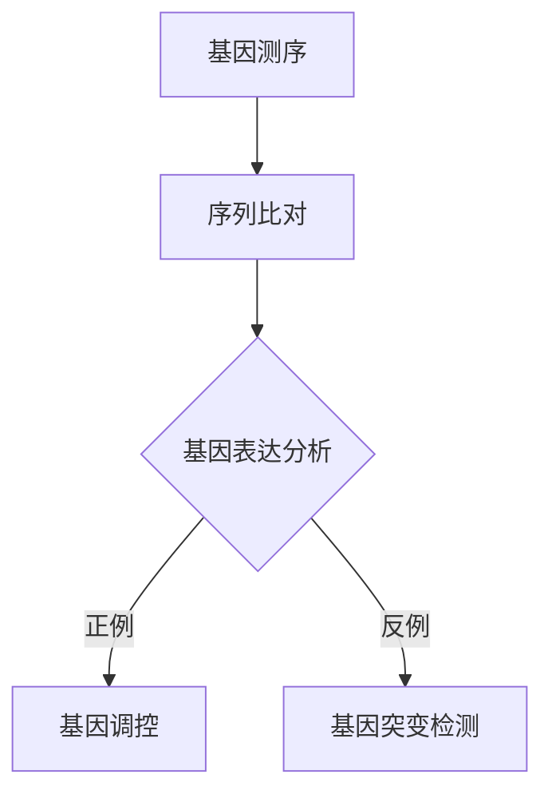

                 

# 基因编码的信息论：生命密码的数学解读

## 关键词
- 基因编码
- 信息论
- 生命密码
- 数学模型
- 人工智能

## 摘要
本文将探讨基因编码的信息论，即通过数学和计算机科学的方法来解读生命的遗传密码。文章首先介绍了基因编码的基础知识，接着引入信息论的概念，并阐述其在基因编码中的应用。随后，本文深入分析了生命密码的数学模型及其解读方法，包括概率模型、决策理论模型和深度学习模型等。通过具体的项目实战，本文展示了基因编码数学解读的实际应用，并对相关算法和数学公式进行了详细讲解。最后，本文总结了基因编码信息论的研究现状和未来发展趋势，为读者提供了进一步学习和研究的方向。

## 目录大纲设计步骤

### 步骤1：分析书名

书名《基因编码的信息论：生命密码的数学解读》包含了几个关键要素：“基因编码”、“信息论”、“生命密码”和“数学解读”。这些关键词为我们提供了书籍的核心内容和章节线索。

1. **基因编码**：涉及基因的基本概念、结构和功能，以及基因表达和调控机制。
2. **信息论**：讨论信息的基本概念、传输方法和在基因编码中的应用。
3. **生命密码**：研究基因序列中的遗传信息及其数学模型。
4. **数学解读**：介绍用于解析基因编码的数学工具和算法。

### 步骤2：确定核心章节

基于上述分析，我们可以确定以下几个核心章节：

1. **基因编码的基础知识**
   - 基因的定义与结构
   - 基因组的组织与功能
   - 基因表达与调控

2. **信息论与基因编码**
   - 信息论的基本概念
   - 信息论在基因编码中的应用
   - 基因组信息分析

3. **生命密码的数学模型**
   - 生命密码的基本原理
   - 数学解读方法（概率模型、决策理论模型、深度学习模型）

4. **基因编码的数学解读**
   - 数学模型构建
   - 解读方法应用
   - 实际案例分析

5. **附录**
   - 常用数学公式与工具
   - 基因编码相关的实验技术
   - 生命密码研究的历史与进展

### 步骤3：细化每个章节

对于每个核心章节，我们需要进一步细化子章节，确保每个部分都有具体的内容和目标。

#### 1. 基因编码的基础知识

- **基因的定义与功能**
  - 基因的基本概念
  - 遗传信息的传递
  - 基因的表达与调控

- **基因组的组织与功能**
  - DNA的结构与功能
  - 基因组的组织方式
  - 基因组的演化

- **基因表达与调控**
  - 基因表达的基本过程
  - 调控机制
  - 基因表达的测量方法

#### 2. 信息论与基因编码

- **信息论的基本概念**
  - 信息、熵和概率
  - 信息传输与编码

- **信息论在基因编码中的应用**
  - 基因序列的信息含量
  - 基因编码的优化与解码

- **基因组信息分析**
  - 基因组测序技术
  - 基因组序列分析

#### 3. 生命密码的数学模型

- **生命密码的基本原理**
  - 基因序列的遗传信息
  - 生命密码的类型

- **数学解读方法**
  - 概率模型
  - 决策理论模型
  - 深度学习模型

#### 4. 基因编码的数学解读

- **数学模型构建**
  - 概率模型
  - 决策理论模型

- **解读方法应用**
  - 基因序列分类
  - 基因序列预测

- **实际案例分析**
  - 基因突变检测
  - 基因表达调控网络分析

### 步骤4：加入附录或附录性章节

为了使书籍更加完整，我们可以加入附录或附录性章节，如：

- **附录A：基因编码的信息论工具与资源**
  - 信息论工具包
  - 基因编码分析软件
  - 开源代码与数据集

- **附录B：基因编码实验技术**
  - 基因测序技术
  - 基因编辑技术
  - 基因表达分析技术

- **附录C：生命密码研究历史与进展**
  - 研究发展历程
  - 研究热点与前沿方向

### 步骤5：编写Mermaid流程图

为了帮助读者更好地理解基因编码的信息处理过程，我们可以在文中加入Mermaid流程图，例如：



### 步骤6：编写伪代码和数学公式

在详细讲解核心算法原理和数学模型时，我们需要编写伪代码和数学公式，例如：

```markdown
$$
P(A|B) = \frac{P(B|A) \cdot P(A)}{P(B)}
$$

// 伪代码：
function gene_expression_prediction(input_sequence):
    // 计算输入序列的熵
    entropy = calculate_entropy(input_sequence)
    // 使用决策理论模型进行预测
    prediction = decision_theory_model(entropy)
    return prediction
```

### 步骤7：编写项目实战章节

选择具体的基因编码应用实例，详细解释说明项目的开发环境搭建、源代码实现和代码解读，并进行实际案例分析和详细讲解剖析。

### 步骤8：整理和校对

最后，整理整个目录大纲，确保每个章节和子章节都符合简洁性、完整性要求，并进行校对。确保文章内容逻辑清晰、结构紧凑、简单易懂，以吸引读者深入了解基因编码的信息论。

---

完成以上步骤后，我们可以得到以下目录大纲：

## 《基因编码的信息论：生命密码的数学解读》目录大纲

## 第一部分：基因编码基础

### 1.1 基因编码的概念与结构

#### 1.1.1 基因的定义与功能

#### 1.1.2 DNA的碱基序列与遗传信息

#### 1.1.3 基因组的组织与功能

### 1.2 基因表达与调控

#### 1.2.1 基因表达的调控机制

#### 1.2.2 基因表达的测量方法

### 1.3 基因编辑技术

#### 1.3.1 CRISPR-Cas9技术

#### 1.3.2 其他基因编辑技术

## 第二部分：信息论与基因编码

### 2.1 信息论的基本概念

#### 2.1.1 信息与熵

#### 2.1.2 信息传输与编码

### 2.2 信息论在基因编码中的应用

#### 2.2.1 基因序列的信息含量

#### 2.2.2 基因编码的优化与解码

### 2.3 基因组信息分析

#### 2.3.1 基因组测序技术

#### 2.3.2 基因组序列分析

## 第三部分：生命密码的数学模型

### 3.1 生命密码的基本原理

#### 3.1.1 生命密码的概念与类型

#### 3.1.2 生命密码的数学模型

### 3.2 生命密码的数学解读方法

#### 3.2.1 概率模型

#### 3.2.2 决策理论模型

#### 3.2.3 深度学习模型

### 3.3 生命密码的应用案例分析

#### 3.3.1 基因诊断与治疗

#### 3.3.2 基因组进化研究

## 第四部分：基因编码的数学解读

### 4.1 基因编码的数学模型构建

#### 4.1.1 概率模型

#### 4.1.2 决策理论模型

### 4.2 基因编码的数学解读方法应用

#### 4.2.1 基因序列分类

#### 4.2.2 基因序列预测

### 4.3 基因编码的数学解读案例分析

#### 4.3.1 基因突变检测

#### 4.3.2 基因表达调控网络分析

## 附录

### 附录A：基因编码的信息论工具与资源

#### A.1 信息论工具包

#### A.2 基因编码分析软件

#### A.3 开源代码与数据集

### 附录B：基因编码实验技术

#### B.1 基因测序技术

#### B.2 基因编辑技术

#### B.3 基因表达分析技术

### 附录C：生命密码研究历史与进展

#### C.1 生命密码研究的发展历程

#### C.2 研究热点与前沿方向

## 结论

本书通过系统的理论分析和实际案例讲解，帮助读者深入了解基因编码的信息论，即如何运用数学和计算机科学的方法来解读生命的遗传密码。随着生命科学和计算机技术的不断发展，基因编码的信息论在生物学、医学、人工智能等领域具有重要的应用价值。未来，这一领域将继续深入探索，为生命科学的发展带来更多突破。希望本书能为读者提供有价值的参考和启示。

