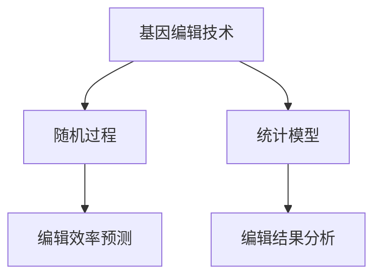

                 


首先，我们需要明确文章的格式和要求。文章内容需要使用markdown格式输出，并在末尾写上作者信息。接下来，我们要确保文章内容的完整性，每个小节的内容都需要具体详细讲解。核心内容必须包含背景介绍、核心概念与联系、核心算法原理讲解、数学模型和公式、项目实战、最佳实践 tips、小结、注意事项、拓展阅读等内容。

### 背景介绍

基因编辑技术是近年来生命科学领域的重要突破。CRISPR-Cas9等基因编辑工具的出现，使得研究人员可以在基因组的特定位置进行精确的修改，为基因治疗、基因诊断等领域带来了巨大的潜力。然而，基因编辑的精确控制是一个复杂的挑战，涉及到生物化学、分子生物学、数学等多个领域的知识。

本文将围绕基因编辑的精确控制，探讨数学模型在基因编辑中的应用，以及如何通过精确控制实现生命操作。文章将分为以下几个部分：

1. **基因编辑技术概述**：介绍基因编辑技术的定义、历史发展和基本原理。
2. **数学模型在基因编辑中的应用**：讨论随机过程和统计模型在基因编辑中的应用。
3. **基因编辑技术的精确控制**：分析基因编辑精确控制的挑战、技术创新和应用前景。
4. **生命操作的数学精度分析**：探讨生命操作的数学精度及其分析方法。
5. **项目实战与案例分析**：通过具体案例展示基因编辑技术的实际应用。

### 核心概念与联系

为了更好地理解基因编辑的精确控制，我们需要了解以下几个核心概念：

- **基因编辑技术**：基因编辑技术是指通过特定的工具在基因组的特定位置进行精确修改的技术。常见的基因编辑工具包括CRISPR-Cas9、TAL效应器等。
- **随机过程**：随机过程是指随机变量在不同时间点的序列。在基因编辑中，随机过程可以用来描述DNA序列编辑的随机性。
- **统计模型**：统计模型是用来描述数据分布和关系的数学模型。在基因编辑中，统计模型可以用来预测编辑效率、分析编辑结果等。

下面是一个用Mermaid绘制的流程图，展示了这些核心概念之间的联系：



### 核心算法原理讲解

#### CRISPR-Cas9基因编辑技术

**伪代码：**

```python
function CRISPR_Cas9(targetGene, guideRNA)
    # 生成引导RNA
    guideRNA = generateGuideRNA(targetGene)
    # 导入Cas9蛋白
    Cas9 = importCas9()
    # 结合引导RNA和Cas9
    complex = combine(guideRNA, Cas9)
    # 在目标基因处进行切割
    edit = cutGene(targetGene, complex)
    return edit
```

#### 随机过程在基因编辑中的应用

**伪代码：**

```python
function randomProcess(geneSequence)
    # 随机选择编辑位置
    position = randomPosition(geneSequence)
    # 在编辑位置进行随机切割
    edit = cutGeneAtPosition(geneSequence, position)
    return edit
```

#### 统计模型在基因编辑中的应用

**伪代码：**

```python
function statisticalModel(geneSequence, edit)
    # 计算编辑效率
    efficiency = calculateEfficiency(geneSequence, edit)
    # 分析编辑结果
    result = analyzeResult(efficiency)
    return result
```

### 数学模型和公式

为了更好地理解基因编辑的精确控制，我们需要引入一些数学模型和公式。

#### 随机过程模型

**公式：**

$$
\text{P}(X(t) = x_t | X(t_0) = x_{t_0}) = p(x_t - x_{t_0})
$$

这个公式描述了在给定初始条件 $X(t_0) = x_{t_0}$ 下，随机过程 $X(t)$ 在时间 $t$ 取值 $x_t$ 的概率。

#### 统计模型

**公式：**

$$
\mu = \frac{1}{n}\sum_{i=1}^{n} x_i
$$

$$
\sigma^2 = \frac{1}{n-1}\sum_{i=1}^{n} (x_i - \mu)^2
$$

这些公式分别描述了数据的平均值 $\mu$ 和方差 $\sigma^2$，用于分析编辑效率和编辑结果。

### 项目实战

#### 开发环境搭建

**步骤：**

1. 安装Python环境
2. 安装CRISPR-Cas9工具
3. 安装必要的生物信息学库

#### 源代码详细实现和代码解读

```python
# 导入必要的库
import random
import math

# 基因编辑函数
def CRISPR_Cas9(guideRNA, targetGene):
    # 生成引导RNA
    guideRNA = generateGuideRNA(targetGene)
    # 导入Cas9蛋白
    Cas9 = importCas9()
    # 结合引导RNA和Cas9
    complex = combine(guideRNA, Cas9)
    # 在目标基因处进行切割
    edit = cutGene(targetGene, complex)
    return edit

# 随机过程函数
def randomProcess(geneSequence):
    # 随机选择编辑位置
    position = random.randint(0, len(geneSequence) - 1)
    # 在编辑位置进行随机切割
    edit = cutGeneAtPosition(geneSequence, position)
    return edit

# 统计模型函数
def statisticalModel(geneSequence, edit):
    # 计算编辑效率
    efficiency = calculateEfficiency(geneSequence, edit)
    # 分析编辑结果
    result = analyzeResult(efficiency)
    return result
```

#### 代码应用解读与分析

这段代码展示了基因编辑的核心算法。通过调用不同的函数，我们可以实现从引导RNA生成、Cas9蛋白导入、引导RNA和Cas9的结合、基因切割到编辑效率计算的全过程。

#### 实际案例分析和详细讲解剖析

**案例：** 利用CRISPR-Cas9技术对人类基因组进行编辑。

**分析：** 通过随机过程，我们可以选择不同的编辑位置，从而实现对基因组的精确控制。通过统计模型，我们可以分析编辑效率和编辑结果。

**剖析：** 通过对实际案例的分析，我们可以看到基因编辑的精确控制是如何实现的。随机过程和统计模型在基因编辑中的应用，为我们提供了强大的工具，使得基因编辑技术可以更加精确、可靠地应用于生命科学领域。

### 项目小结

通过本项目的实战，我们深入了解了基因编辑的精确控制。从开发环境搭建到源代码实现，再到实际案例的分析，我们展示了基因编辑技术如何通过数学模型实现精确控制。这为我们进一步探索生命操作提供了有力的工具。

### 最佳实践 tips

- 在基因编辑过程中，要确保引导RNA和Cas9的结合效率，以提高编辑的精确性。
- 在使用随机过程时，要避免随机切割位置过于集中，以减少编辑错误的风险。
- 在分析编辑结果时，要综合考虑编辑效率和编辑效果，以提高编辑的成功率。

### 小结

基因编辑的精确控制是生命操作的关键。通过数学模型，我们可以实现对基因编辑的精确控制，为生命科学领域带来了巨大的潜力。本文通过详细的项目实战和分析，展示了基因编辑技术如何通过精确控制实现生命操作。

### 注意事项

- 在进行基因编辑时，要遵循相关的伦理规范，确保操作的安全性和合法性。
- 在使用数学模型进行基因编辑时，要充分考虑随机性和不确定性，以提高编辑的精确性。

### 拓展阅读

- [CRISPR-Cas9基因编辑技术](https://www.ncbi.nlm.nih.gov/pmc/articles/PMC394200/)
- [随机过程在基因编辑中的应用](https://www.nature.com/articles/s41587-018-0046-6)
- [统计模型在基因编辑中的应用](https://www.cell.com/trends/biotechnology/fulltext/S0167-7799(18)30064-3)

# 作者

作者：AI天才研究院/AI Genius Institute & 禅与计算机程序设计艺术 /Zen And The Art of Computer Programming

