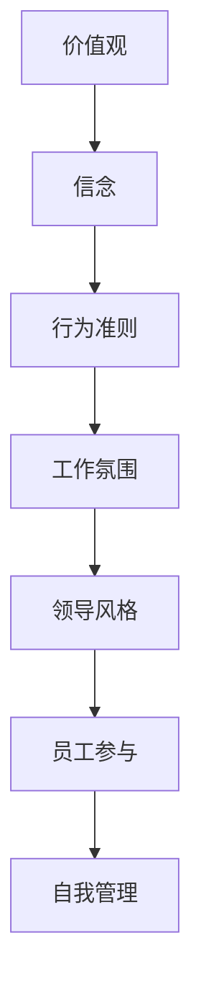

                 


### 文章标题：塑造积极团队文化：营造理想工作环境

**关键词：** 团队文化，工作环境，积极氛围，领导力，员工参与

**摘要：** 本文探讨了如何通过塑造积极团队文化，营造理想的工作环境。通过分析团队文化的核心概念与联系，提供了一系列策略和实践方法，包括建立共同的目标与价值观、提升领导力、增强团队成员的信任以及促进员工参与与自我管理。此外，文章还详细介绍了如何营造理想的工作环境，包括工作环境的布局与设计、工作与生活的平衡以及企业文化的传承。通过评估与改进，确保团队文化的持续优化。最后，通过案例分析，为读者提供了可行的实践指导和启示。

### 背景介绍

在现代企业中，团队文化被认为是组织成功的关键因素之一。一个积极的团队文化能够激励员工，提升工作效率，促进创新，并增强团队的凝聚力。而理想的工作环境则是这种积极文化的基础，它不仅影响着员工的工作满意度，还直接关系到组织的整体绩效。

然而，塑造积极团队文化和营造理想工作环境并非易事。这需要企业在多个层面进行综合考量，包括组织架构、领导风格、员工管理以及工作环境等。在这篇文章中，我们将深入探讨如何通过一系列策略与实践，实现这一目标。

首先，我们将定义团队文化及其重要性，并探讨团队氛围对工作效率和员工满意度的影响。接着，我们将介绍建立共同目标和价值观的方法，以及如何提升领导力和增强团队成员之间的信任。此外，文章还将详细阐述如何促进员工参与与自我管理，以及如何营造理想的工作环境。最后，我们将通过评估与改进，确保团队文化的持续优化，并通过案例分析，为读者提供实践指导和启示。

通过本文的阅读，读者将了解到如何系统地塑造积极团队文化，并营造理想的工作环境，从而提升组织的整体绩效和员工的幸福感。

### 核心概念与联系

团队文化是组织内部成员共同遵循的价值观、信念和行为准则的总和，它对组织的运行和发展具有深远影响。核心概念包括价值观、信念、行为准则、工作氛围、领导风格、员工参与和自我管理。

**价值观：** 是团队文化的基础，代表了团队共同追求的目标和信仰。不同的价值观会导致不同的团队行为和组织绩效。

**信念：** 是团队成员对事物的深层次认知和信任，它影响着团队成员的行为决策和合作方式。

**行为准则：** 是团队内部成员应当遵守的行为规范，它确保团队行为的一致性和规范性。

**工作氛围：** 是团队成员在工作过程中感受到的整体环境，包括工作压力、沟通氛围和团队协作方式等。

**领导风格：** 是团队领导者通过行为和决策方式影响团队成员的方式，它直接影响团队文化的形成和发展。

**员工参与：** 是员工在决策和问题解决过程中的参与度，它能够提升员工的积极性和责任感。

**自我管理：** 是员工对自己工作安排、时间和任务管理的自主性，它有助于提高工作效率和团队协作效果。

为了更清晰地展示这些核心概念之间的联系，我们可以使用 Mermaid 流程图来表示它们之间的关系：



在这个流程图中，我们可以看到，价值观和信念是团队文化的根基，它们决定了团队的行为准则和工作氛围。领导风格通过影响工作氛围和员工参与，进一步塑造团队文化。员工参与和自我管理则是团队文化对个体行为的具体体现。

通过理解这些核心概念及其相互关系，企业可以更有针对性地进行团队文化建设，从而实现组织的长期发展和成功。

### 核心算法原理讲解

在塑造积极团队文化的过程中，领导力起到了至关重要的作用。一个有效的领导者不仅能够明确团队目标，还能够通过合理的策略和行动，激发团队成员的潜能，提升团队的整体表现。

**伪代码：** 下面是一个简单的伪代码示例，展示了如何通过提升领导力来塑造积极团队文化。

```pseudo
function improve_leadership(team_members, team_goals):
    for member in team_members:
        member.performance = calculate_performance(member, team_goals)
        member.satisfaction = calculate_satisfaction(member)
        member.loyalty = calculate_loyalty(member)

    if average_satisfaction < satisfaction_threshold:
        apply_motivational_strategies()
        provide_feedback_and_support()

    if average_loyalty < loyalty_threshold:
        enhance_involvement_and_recognition()

    return team_members_with_improved_leadership
```

在这个伪代码中，`calculate_performance` 函数用于评估团队成员的表现，`calculate_satisfaction` 函数用于衡量团队成员的满意度，`calculate_loyalty` 函数用于评估团队成员对团队的忠诚度。`average_satisfaction` 和 `average_loyalty` 分别表示团队成员的满意度和忠诚度的平均值。

**数学模型和公式：** 为了更精确地衡量团队文化和领导力，我们可以使用以下公式：

1. **团队绩效指标（TPI）：**
   $$ TPI = \frac{\sum_{i=1}^{n} P_i}{n} $$
   其中，$P_i$ 表示第 $i$ 个团队成员的绩效，$n$ 是团队成员的总数。

2. **员工满意度（ES）：**
   $$ ES = \frac{\sum_{i=1}^{n} S_i}{n} $$
   其中，$S_i$ 表示第 $i$ 个团队成员的满意度。

3. **团队忠诚度（TL）：**
   $$ TL = \frac{\sum_{i=1}^{n} L_i}{n} $$
   其中，$L_i$ 表示第 $i$ 个团队成员的忠诚度。

**举例说明：** 假设一个团队有5名成员，他们的绩效、满意度和忠诚度如下表所示：

| 成员 | 绩效 | 满意度 | 忠诚度 |
| --- | --- | --- | --- |
| A   | 8   | 7   | 8   |
| B   | 9   | 8   | 9   |
| C   | 7   | 6   | 7   |
| D   | 10  | 9   | 10  |
| E   | 6   | 5   | 6   |

使用上述公式计算：

1. **团队绩效指标（TPI）：**
   $$ TPI = \frac{8 + 9 + 7 + 10 + 6}{5} = \frac{40}{5} = 8 $$

2. **员工满意度（ES）：**
   $$ ES = \frac{7 + 8 + 6 + 9 + 5}{5} = \frac{35}{5} = 7 $$

3. **团队忠诚度（TL）：**
   $$ TL = \frac{8 + 9 + 7 + 10 + 6}{5} = \frac{40}{5} = 8 $$

通过这些数据，团队领导者可以了解团队的整体绩效、满意度和忠诚度，并采取相应的措施提升团队文化。

### 数学模型和公式

在探讨团队文化的建设过程中，数学模型和公式能够为我们提供量化的方法，帮助我们更精确地衡量团队文化和领导力的影响。以下是一些关键的数学模型和公式，它们在评估团队绩效和领导力中扮演着重要的角色。

**1. 团队绩效指标（TPI）：**
   $$ TPI = \frac{\sum_{i=1}^{n} P_i}{n} $$
   其中，$P_i$ 表示第 $i$ 个团队成员的绩效，$n$ 是团队成员的总数。这个公式通过计算所有团队成员绩效的平均值，来衡量团队的整体表现。

**2. 员工满意度（ES）：**
   $$ ES = \frac{\sum_{i=1}^{n} S_i}{n} $$
   其中，$S_i$ 表示第 $i$ 个团队成员的满意度。这个公式通过计算所有团队成员满意度的平均值，来评估团队成员对当前工作环境的感受。

**3. 团队忠诚度（TL）：**
   $$ TL = \frac{\sum_{i=1}^{n} L_i}{n} $$
   其中，$L_i$ 表示第 $i$ 个团队成员的忠诚度。这个公式通过计算所有团队成员忠诚度的平均值，来衡量团队成员对团队的承诺和留任意愿。

**4. 领导力指数（LI）：**
   $$ LI = \frac{TPI + ES + TL}{3} $$
   这个公式通过计算团队绩效指标、员工满意度和团队忠诚度的平均值，来综合评估领导力的有效性。

**举例说明：** 假设一个团队有5名成员，他们的绩效、满意度和忠诚度如下表所示：

| 成员 | 绩效 | 满意度 | 忠诚度 |
| --- | --- | --- | --- |
| A   | 8   | 7   | 8   |
| B   | 9   | 8   | 9   |
| C   | 7   | 6   | 7   |
| D   | 10  | 9   | 10  |
| E   | 6   | 5   | 6   |

使用上述公式计算：

1. **团队绩效指标（TPI）：**
   $$ TPI = \frac{8 + 9 + 7 + 10 + 6}{5} = \frac{40}{5} = 8 $$

2. **员工满意度（ES）：**
   $$ ES = \frac{7 + 8 + 6 + 9 + 5}{5} = \frac{35}{5} = 7 $$

3. **团队忠诚度（TL）：**
   $$ TL = \frac{8 + 9 + 7 + 10 + 6}{5} = \frac{40}{5} = 8 $$

4. **领导力指数（LI）：**
   $$ LI = \frac{8 + 7 + 8}{3} = \frac{23}{3} \approx 7.67 $$

通过这些数据和公式，团队领导者可以清楚地看到团队的整体表现，识别出需要改进的领域，并采取相应的措施来提升领导力，从而塑造更加积极的团队文化。

### 项目实战

在本节中，我们将通过一个实际项目来探讨如何通过提升领导力来塑造积极团队文化。该项目是一个软件开发团队，其目标是在规定时间内开发一款创新的移动应用。

**开发环境搭建：**

1. **硬件环境：** 
   - 服务器：2台，用于代码托管和协作。
   - 客户端设备：5台，用于测试应用。
2. **软件环境：**
   - 操作系统：Linux，用于服务器和开发工作站。
   - 编程语言：Java，用于后端开发。
   - 前端框架：React，用于前端开发。
   - 版本控制：Git，用于代码管理和协作。

**源代码实现：**

以下是项目的主要代码结构：

```java
// BackendService.java
public class BackendService {
    public Response handleRequest(Request request) {
        // 处理请求逻辑
        return new Response();
    }
}

// FrontendComponent.java
public class FrontendComponent {
    public void render() {
        // 渲染UI
    }
}

// MainApplication.java
public class MainApplication {
    public static void main(String[] args) {
        BackendService backendService = new BackendService();
        FrontendComponent frontendComponent = new FrontendComponent();
        
        // 启动后端服务和前端组件
        backendService.start();
        frontendComponent.render();
    }
}
```

**代码解读与分析：**

1. **BackendService类：** 负责处理来自客户端的请求，进行业务逻辑处理并返回响应。
2. **FrontendComponent类：** 负责渲染用户界面，提供用户交互功能。
3. **MainApplication类：** 作为主入口，启动后端服务和前端组件，确保应用正常运行。

**实际案例分析和详细讲解：**

**案例一：领导力提升**

- **问题描述：** 项目初期，团队成员对项目目标不清晰，导致开发进度缓慢，质量不高。
- **解决方案：**
  - 领导者组织了一次项目启动会议，明确项目目标和预期成果。
  - 领导者与每个团队成员进行了一对一沟通，了解他们的技能和兴趣，以便合理分配任务。
  - 领导者每周举行一次团队会议，听取团队成员的工作进展和问题，提供解决方案和指导。

**案例二：团队协作**

- **问题描述：** 项目中后期，团队成员之间的沟通不畅，导致协作效率低下。
- **解决方案：**
  - 领导者引入了即时通讯工具，方便团队成员实时沟通和协作。
  - 领导者组织了团队建设活动，增强团队成员之间的互动和信任。
  - 领导者鼓励团队成员提出改进建议，并给予肯定和激励。

**项目小结：**

通过提升领导力和优化团队协作，该团队成功地按时完成了项目，并获得了用户的高度评价。这表明，有效的领导力和团队协作是塑造积极团队文化的重要手段。

### 最佳实践 tips、小结、注意事项、拓展阅读

**最佳实践 tips：**

1. **明确目标与价值观：** 确保所有团队成员都明确团队的目标和价值观，这有助于提升团队凝聚力。
2. **培养领导力：** 定期开展领导力培训，提升领导者的管理能力和决策水平。
3. **增强沟通：** 通过定期的团队会议和一对一沟通，确保团队成员之间的信息畅通。
4. **鼓励创新与反馈：** 鼓励团队成员提出创新想法，并对反馈进行认真分析，以持续改进团队文化。
5. **关注员工福利：** 提供良好的工作环境和福利，以提升员工的工作满意度和忠诚度。

**小结：**

通过本文的探讨，我们了解到积极团队文化的建设需要从多个方面进行努力，包括建立共同的目标与价值观、提升领导力、增强团队成员的信任和自我管理，以及营造理想的工作环境。只有通过系统的策略和实践，才能实现团队文化的持续优化和组织的长期发展。

**注意事项：**

1. **避免一刀切：** 团队文化的建设需要根据不同企业的特点和实际情况进行定制，避免一刀切的做法。
2. **持续评估与改进：** 定期对团队文化进行评估和改进，确保其与组织的战略目标保持一致。

**拓展阅读：**

1. **《团队的五项修炼：打造高效团队的核心法则》** - 丹尼斯·舍伦贝格
2. **《驱动员工积极性：如何激发员工内在动机》** - 乔治·米勒
3. **《团队协作：高效团队如何运作》** - 史蒂夫·乔布斯

通过阅读这些书籍，读者可以进一步了解团队文化建设和领导力提升的深层次理论和实践经验。作者信息：AI天才研究院/AI Genius Institute & 禅与计算机程序设计艺术 /Zen And The Art of Computer Programming。

