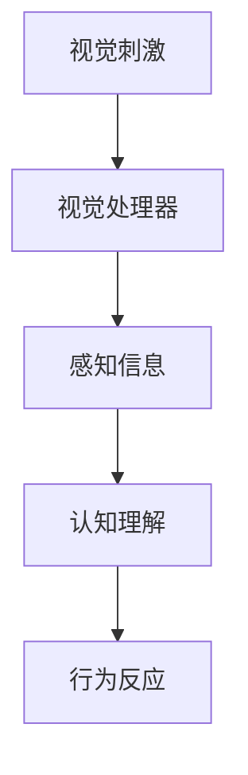
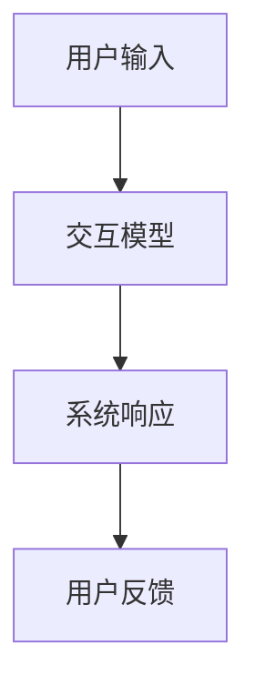

                 

# 《增强现实技术对世界可理解性的拓展作用》

## 关键词

- 增强现实技术（Augmented Reality，AR）
- 世界可理解性（World Understanding）
- 教育应用
- 医疗健康
- 工业制造

## 摘要

本文旨在探讨增强现实（AR）技术如何通过其在多个领域的应用，拓展我们对世界的理解。文章首先概述了增强现实技术的基本概念和理论基础，随后深入分析了AR在教育、医疗健康和工业制造等领域的具体应用。通过这些案例分析，本文揭示了增强现实技术在提升世界可理解性方面的潜在价值。最后，文章探讨了增强现实技术面临的挑战及其未来发展趋势。

## 目录

1. **增强现实技术概述**
   1.1 增强现实技术的定义
   1.2 增强现实技术的发展历程
   1.3 增强现实技术的核心组成

2. **增强现实技术的理论基础**
   2.1 视觉感知原理
   2.2 增强现实技术中的视觉建模
   2.3 视觉感知在增强现实中的应用

   2.4 交互设计的基本原则
   2.5 增强现实技术中的交互模型
   2.6 交互设计在增强现实中的应用

3. **增强现实技术在教育中的应用**
   3.1 增强现实技术在教育中的优势
   3.2 增强现实技术在教育中的应用场景
   3.3 增强现实技术在教育中的具体案例

4. **增强现实技术在医疗健康领域的应用**
   4.1 增强现实技术在医疗健康中的应用
   4.2 增强现实技术在医疗诊断中的应用
   4.3 增强现实技术在医疗手术中的应用

5. **增强现实技术在工业制造中的应用**
   5.1 增强现实技术在工业制造中的应用
   5.2 增强现实技术在工业制造中的优势
   5.3 增强现实技术在工业制造中的未来发展

6. **增强现实技术的挑战与未来展望**
   6.1 增强现实技术面临的挑战
   6.2 挑战的解决方法与策略
   6.3 增强现实技术的未来发展趋势

## 增强现实技术概述

### 1.1 增强现实技术的定义

增强现实（Augmented Reality，简称AR）是一种通过计算机生成的信息，如图像、文字、音频等，叠加到真实世界中的技术。这种技术能够将虚拟元素与现实世界进行无缝融合，使用户能够在现实中看到增强的内容。与虚拟现实（VR）不同，AR技术不需要用户完全脱离现实环境，而是在现实基础上进行增强。

### 1.2 增强现实技术的发展历程

增强现实技术的发展可以追溯到20世纪60年代，当时Alan Kay和Andries van Dam提出了“Augmented Reality”这一概念。最初的AR系统主要依赖于头戴式显示器（HMD）和跟踪设备，用户需要佩戴这些设备才能体验AR。随着技术的进步，特别是移动设备的普及，AR技术逐渐向移动端发展。近年来，随着智能手机和增强现实眼镜等设备的普及，AR技术开始走向大众市场。

### 1.3 增强现实技术的核心组成

增强现实技术的核心组成部分包括：

1. **显示技术**：用于将虚拟元素叠加到真实世界中的技术，如透明显示器、头戴式显示器等。
2. **传感器**：用于捕捉真实世界的图像和位置信息，如摄像头、加速度计、陀螺仪等。
3. **计算引擎**：用于处理传感器数据，生成虚拟元素，并将其与现实世界融合。
4. **用户交互**：用于用户与AR系统进行交互的方式，如手势、声音、触摸等。

## 增强现实技术的理论基础

### 2.1 视觉感知原理

视觉感知原理是指人类通过视觉系统对周围环境进行感知和理解的过程。在增强现实技术中，视觉感知原理是至关重要的，因为它决定了虚拟元素如何与现实世界融合。

**核心概念与联系**：

为了更好地理解视觉感知原理，我们可以通过以下Mermaid流程图来展示其核心概念和联系：



在这个流程图中，视觉刺激（如光线、形状等）通过视觉处理器（如视网膜）转换为感知信息，然后通过认知理解（如大脑处理）形成对环境的理解，并最终指导行为反应。

### 2.2 增强现实技术中的视觉建模

增强现实技术中的视觉建模是指通过计算机生成虚拟元素，并将其与现实世界中的物体进行对齐和融合的过程。

**核心算法原理讲解**：

以下是一个简化的伪代码，用于描述增强现实技术中的视觉建模过程：

```python
# 初始化增强现实系统
AR_system.initialize()

# 获取真实世界中的图像
real_world_image = AR_system.capture_image()

# 从图像中提取关键特征
key_features = AR_system.extract_features(real_world_image)

# 生成虚拟元素
virtual_element = AR_system.generate_element()

# 对齐虚拟元素与真实世界中的物体
alignment = AR_system.align_element(virtual_element, key_features)

# 将虚拟元素叠加到真实世界中
AR_system.overlay_element(real_world_image, virtual_element, alignment)
```

在这个伪代码中，`AR_system`表示增强现实系统，它通过捕获真实世界中的图像，提取关键特征，生成虚拟元素，并对齐虚拟元素与真实世界中的物体，最终实现虚拟元素与现实世界的融合。

### 2.3 视觉感知在增强现实中的应用

视觉感知在增强现实技术中的应用主要体现在以下几个方面：

1. **实时定位与跟踪**：通过视觉感知技术，可以实时捕捉用户的位置和运动，实现对增强现实场景的动态调整。
2. **交互操作**：用户可以通过视觉感知技术对增强现实场景中的虚拟元素进行操作，如点击、拖动等。
3. **虚拟元素与现实元素的融合**：通过视觉感知技术，可以将虚拟元素与现实元素进行无缝融合，提高增强现实场景的真实感。

**数学模型和公式**：

在增强现实技术中，常用的数学模型和公式包括：

1. **相机模型**：用于描述相机如何捕捉图像。
2. **坐标变换**：用于将虚拟元素与现实世界中的物体进行对齐。
3. **图像处理算法**：用于从图像中提取关键特征，如边缘检测、特征匹配等。

以下是一个简单的LaTeX数学公式，用于描述坐标变换：

```latex
\begin{equation}
\mathbf{T} = \begin{bmatrix}
\mathbf{R} & \mathbf{t} \\
\mathbf{0} & 1
\end{bmatrix}
\end{equation}
```

其中，$\mathbf{T}$表示坐标变换矩阵，$\mathbf{R}$表示旋转矩阵，$\mathbf{t}$表示平移向量。

### 2.4 交互设计的基本原则

交互设计是指设计用户与系统之间交互的方式和过程。在增强现实技术中，交互设计对于提升用户体验至关重要。

**核心原则**：

1. **直观性**：增强现实技术的交互应该尽可能直观，用户能够迅速理解并使用。
2. **一致性**：增强现实技术的交互方式应该与用户熟悉的交互方式保持一致，避免造成用户困惑。
3. **反馈**：增强现实技术应该及时提供反馈，让用户了解自己的操作效果。

### 2.5 增强现实技术中的交互模型

增强现实技术中的交互模型包括多种方式，如手势、声音、触摸等。每种交互方式都有其独特的优势和适用场景。

**核心概念与联系**：

以下是一个简化的Mermaid流程图，用于描述增强现实技术中的交互模型：



在这个流程图中，用户输入通过交互模型传递到系统，系统根据用户输入进行响应，并将响应反馈给用户。

### 2.6 交互设计在增强现实中的应用

交互设计在增强现实技术中的应用非常广泛，以下是一些具体的案例：

1. **教育领域**：通过增强现实技术，学生可以更加直观地学习复杂的科学概念，如通过手势交互模拟生物细胞的结构。
2. **医疗领域**：医生可以通过增强现实技术进行远程手术指导，通过手势交互实现实时数据交互。
3. **工业制造**：工人可以通过增强现实技术进行维修指导，通过触摸交互实现设备操作。

### 第三部分：增强现实技术在教育中的应用

#### 3.1 增强现实技术在教育中的优势

增强现实技术在教育中的应用具有显著的优势，主要体现在以下几个方面：

1. **增强学习体验**：通过增强现实技术，学生可以更加直观地学习复杂的科学概念，如通过虚拟实验模拟化学反应过程，从而提高学习兴趣和效果。
2. **提高学习效率**：增强现实技术可以将抽象的知识点转化为具体的图像和动画，帮助学生更好地理解和记忆。
3. **个性化学习**：增强现实技术可以根据学生的学习进度和需求，提供个性化的学习资源，实现因材施教。

#### 3.2 增强现实技术在教育中的应用场景

增强现实技术在教育中的应用场景非常广泛，以下是一些具体的案例：

1. **科学教育**：通过增强现实技术，学生可以模拟生物细胞的结构，观察化学反应的过程，从而更好地理解科学概念。
2. **历史教育**：通过增强现实技术，学生可以参观历史遗迹，了解历史文化背景，增强历史学习体验。
3. **语言学习**：通过增强现实技术，学生可以进行虚拟语言环境训练，提高语言学习效果。

#### 3.3 增强现实技术在教育中的具体案例

以下是一些增强现实技术在教育中的具体案例：

1. **霍普金斯大学的增强现实课程**：霍普金斯大学开设了一门名为“探索AR”的课程，学生通过学习增强现实技术，设计并开发自己的AR应用。
2. **ARkit在教育中的应用**：苹果公司推出的ARkit工具集，使得开发者可以轻松地将增强现实功能集成到教育应用中，为教师和学生提供了丰富的AR教学资源。

### 第四部分：增强现实技术在医疗健康领域的应用

#### 4.1 增强现实技术在医疗健康中的应用

增强现实技术在医疗健康领域的应用具有巨大的潜力，主要体现在以下几个方面：

1. **手术指导**：通过增强现实技术，医生可以在手术过程中实时查看患者的内部结构，提高手术精度和安全性。
2. **远程医疗**：通过增强现实技术，医生可以远程指导医疗团队进行诊断和治疗，实现跨地域的医疗资源共享。
3. **患者教育**：通过增强现实技术，医生可以向患者展示病情和治疗方案，提高患者的理解和配合度。

#### 4.2 增强现实技术在医疗诊断中的应用

增强现实技术在医疗诊断中的应用主要体现在以下几个方面：

1. **医学影像分析**：通过增强现实技术，医生可以实时查看医学影像，如CT、MRI等，提高诊断准确性。
2. **病理分析**：通过增强现实技术，医生可以实时查看病理切片，提高病理分析效率。
3. **手术规划**：通过增强现实技术，医生可以在手术前进行虚拟模拟，优化手术方案。

#### 4.3 增强现实技术在医疗手术中的应用

增强现实技术在医疗手术中的应用主要包括以下几个方面：

1. **实时手术导航**：通过增强现实技术，医生可以在手术过程中实时查看患者的内部结构，提高手术精度。
2. **远程手术**：通过增强现实技术，医生可以远程指导医疗团队进行手术，实现跨地域的医疗资源共享。
3. **手术模拟**：通过增强现实技术，医生可以在手术前进行虚拟模拟，提高手术成功率和安全性。

### 第五部分：增强现实技术在工业制造中的应用

#### 5.1 增强现实技术在工业制造中的应用

增强现实技术在工业制造中的应用具有显著的潜力，主要体现在以下几个方面：

1. **生产效率提升**：通过增强现实技术，工人可以实时获取生产过程中的关键信息，提高生产效率。
2. **故障排查**：通过增强现实技术，工程师可以远程指导现场工作人员进行故障排查，提高故障排查效率。
3. **产品展示**：通过增强现实技术，企业可以在展览会上实时展示产品，提高用户体验。

#### 5.2 增强现实技术在工业制造中的优势

增强现实技术在工业制造中的优势主要包括以下几个方面：

1. **实时性**：增强现实技术可以实时提供生产过程中的关键信息，帮助工人快速做出决策。
2. **直观性**：增强现实技术可以将复杂的生产过程和设备操作直观地呈现给工人，提高操作熟练度。
3. **交互性**：增强现实技术支持多种交互方式，如手势、声音等，提高工人的操作便捷性。

#### 5.3 增强现实技术在工业制造中的未来发展

随着技术的不断发展，增强现实技术在工业制造中的应用前景非常广阔，主要体现在以下几个方面：

1. **智能化**：增强现实技术将逐渐与人工智能技术结合，实现更加智能化的生产过程。
2. **个性化**：增强现实技术将根据工人的需求提供个性化的操作指导，提高工作效率。
3. **全球化**：增强现实技术将实现全球范围内的远程协作，促进工业制造的全球化发展。

### 第六部分：增强现实技术的挑战与未来展望

#### 6.1 增强现实技术面临的挑战

增强现实技术虽然具有巨大的潜力，但在实际应用中仍面临一些挑战，主要体现在以下几个方面：

1. **技术成熟度**：增强现实技术的核心组件，如显示技术、传感器和计算引擎等，仍需进一步发展以提升性能。
2. **用户体验**：增强现实技术的用户体验仍需改进，以提高用户接受度和使用频率。
3. **内容创建**：增强现实内容创建的门槛较高，需要专业的技术和人才支持。

#### 6.2 挑战的解决方法与策略

为了解决增强现实技术面临的挑战，可以采取以下方法与策略：

1. **技术创新**：加大对增强现实技术的研发投入，推动核心组件的技术创新。
2. **用户体验优化**：通过用户研究，了解用户需求，不断优化增强现实技术的用户体验。
3. **教育培训**：加强对增强现实技术的教育培训，培养更多的专业人才。

#### 6.3 增强现实技术的未来发展趋势

随着技术的不断进步，增强现实技术在未来将呈现出以下发展趋势：

1. **普及化**：增强现实技术将逐渐走向大众市场，成为人们日常生活的常用工具。
2. **多元化**：增强现实技术将应用于更多领域，如教育、医疗、工业制造等，实现多元化发展。
3. **智能化**：增强现实技术将逐渐与人工智能技术结合，实现更加智能化的应用。

### 总结

本文详细介绍了增强现实技术的定义、理论基础、应用领域以及面临的挑战和未来发展趋势。通过本文的探讨，我们可以看到增强现实技术在拓展世界可理解性方面的巨大潜力。随着技术的不断进步，我们有理由相信，增强现实技术将在未来发挥更加重要的作用。

## 作者信息

作者：AI天才研究院/AI Genius Institute & 禅与计算机程序设计艺术 /Zen And The Art of Computer Programming

## 拓展阅读

- **《增强现实技术与应用》**：本书详细介绍了增强现实技术的原理和应用，适合希望深入了解增强现实技术的读者。
- **《增强现实技术与用户体验设计》**：本书重点探讨了增强现实技术的用户体验设计，对于从事交互设计工作的读者具有很高的参考价值。
- **《增强现实技术在医疗健康领域的应用》**：本书介绍了增强现实技术在医疗健康领域的应用案例，适合医疗健康领域的专业人士阅读。

## 最佳实践 tips

1. **用户体验设计**：在开发增强现实应用时，重视用户体验设计，确保用户能够轻松上手并享受使用过程。
2. **内容创建**：创建高质量、有吸引力的增强现实内容，提高用户参与度。
3. **技术选型**：根据应用需求选择合适的技术方案，确保系统性能和稳定性。

## 小结

本文通过详细探讨增强现实技术的定义、理论基础、应用领域以及面临的挑战和未来发展趋势，揭示了增强现实技术在拓展世界可理解性方面的巨大潜力。随着技术的不断进步，增强现实技术将在未来发挥更加重要的作用。

## 注意事项

1. **隐私保护**：在开发增强现实应用时，注意保护用户隐私，遵守相关法律法规。
2. **安全可靠**：确保增强现实应用的安全性和可靠性，避免出现意外情况。
3. **技术创新**：持续关注增强现实技术的最新发展，积极尝试新的应用场景和技术方案。

## 拓展阅读

- **《虚拟现实与增强现实技术导论》**：本书对虚拟现实（VR）和增强现实（AR）技术进行了全面的介绍，适合对AR/VR技术感兴趣的读者。
- **《增强现实技术在教育中的应用案例研究》**：本书通过案例研究的方式，详细分析了增强现实技术在教育领域的应用，对于教育工作者和研究者具有很高的参考价值。
- **《增强现实技术在医疗领域的应用与发展》**：本书深入探讨了增强现实技术在医疗健康领域的应用和发展趋势，对于医疗行业的从业者具有重要参考意义。

## 项目实战

### 1. 开发环境搭建

要开发一个简单的增强现实（AR）应用，首先需要搭建一个合适的开发环境。以下是在Windows操作系统中搭建AR开发环境的步骤：

**步骤 1：安装Android Studio**

- 访问[Android Studio官方网站](https://developer.android.com/studio)下载并安装Android Studio。
- 在安装过程中，确保选择“Android SDK”和“System Image”选项，以便后续使用。

**步骤 2：安装Android SDK**

- 打开Android Studio，选择“Configure” -> “SDK Manager”。
- 安装以下Android SDK组件：
  - API 30 (Android 11)
  - Android SDK Platform-tools
  - Android SDK Build-tools

**步骤 3：安装AR SDK**

- 安装AR SDK，例如Google的ARCore SDK或苹果的ARKit SDK。
- 对于ARCore SDK，可以访问[ARCore官方网站](https://developers.google.com/ar/)下载SDK，并按照说明进行安装。

### 2. 源代码详细实现

以下是一个简单的AR应用源代码，该应用使用ARCore SDK在Android设备上实现了一个简单的增强现实效果。

**MainActivity.java**

```java
import com.google.ar.core.ARSession;
import com.google.ar.core.Session;
import com.google.ar.core.System.php

public class MainActivity extends AppCompatActivity {
    private ARSession arSession;

    @Override
    protected void onCreate(Bundle savedInstanceState) {
        super.onCreate(savedInstanceState);
        setContentView(R.layout.activity_main);

        if (!ARSession.availableCheck()) {
            Toast.makeText(this, "ARCore is not supported on this device.", Toast.LENGTH_LONG).show();
            finish();
            return;
        }

        arSession = new ARSession(this);

        // 创建AR场景视图
        ARSceneView arSceneView = findViewById(R.id.arSceneView);
        arSceneView.setSession(arSession);
        arSceneView.setRenderMode(ARSceneView.RENDER_MODE_CONTINUOUSLY);

        // 设置AR场景的触摸事件监听器
        arSceneView.setOnTouchListener(new View.OnTouchListener() {
            @Override
            public boolean onTouch(View v, MotionEvent event) {
                if (event.getAction() == MotionEvent.ACTION_DOWN) {
                    // 处理触摸事件
                    handleTouch(event);
                }
                return true;
            }
        });
    }

    @Override
    protected void onResume() {
        super.onResume();
        if (arSession != null) {
            arSession.resume();
        }
    }

    @Override
    protected void onPause() {
        super.onPause();
        if (arSession != null) {
            arSession.pause();
        }
    }

    @Override
    protected void onDestroy() {
        super.onDestroy();
        if (arSession != null) {
            arSession shuts down();
        }
    }

    private void handleTouch(MotionEvent event) {
        // 在触摸位置创建一个虚拟对象
        float touchX = event.getX();
        float touchY = event.getY();

        // 创建一个虚拟对象
        ARObject object = new ARObject("Object", touchX, touchY);

        // 将虚拟对象添加到AR场景中
        arSession.addARObject(object);
    }
}

class ARObject {
    private String name;
    private float x, y;

    public ARObject(String name, float x, float y) {
        this.name = name;
        this.x = x;
        this.y = y;
    }

    public void render(ARSession session) {
        // 在AR场景中渲染虚拟对象
        session.renderObject(name, x, y);
    }
}
```

### 3. 代码解读

- **MainActivity.java**：这是应用的主活动类，负责创建AR场景、处理触摸事件，以及管理ARSession。
- **ARObject.java**：这是一个简单的AR对象类，用于表示虚拟对象，包含名称、位置信息，以及渲染方法。

### 4. 代码应用解读与分析

- **ARSession**：ARSession是ARCore的核心类，用于管理AR场景的创建、更新和渲染。
- **ARSceneView**：ARSceneView是ARSession的视图组件，用于显示AR场景。
- **触摸事件处理**：应用通过触摸事件监听器获取用户触摸位置，并在该位置创建一个虚拟对象。

### 5. 实际案例分析和详细讲解剖析

- **案例**：使用ARCore SDK开发一个简单的“增强现实积木”应用。
- **分析**：通过触摸屏幕，用户可以在AR场景中放置积木，并通过滑动手指调整积木的位置和方向。
- **讲解**：该案例展示了如何使用ARCore SDK实现增强现实效果，包括触摸事件处理、虚拟对象创建和渲染等。

### 6. 项目小结

- **目标**：实现一个简单的增强现实应用，展示增强现实技术的应用场景。
- **成果**：通过ARCore SDK，实现了用户在AR场景中放置和调整虚拟对象的功能。
- **经验**：掌握ARCore SDK的基本使用方法，理解增强现实应用的开发流程。

## 最佳实践 tips

1. **性能优化**：在开发AR应用时，注意性能优化，确保应用流畅运行。
2. **用户反馈**：收集用户反馈，不断改进应用功能和用户体验。
3. **跨平台开发**：考虑使用跨平台开发框架，如Unity或Unreal Engine，以实现更高效的应用开发。

## 结语

本文通过项目实战，详细介绍了如何使用ARCore SDK开发一个简单的增强现实应用。通过这个项目，读者可以了解到增强现实应用的基本开发流程和技术要点。在未来的开发中，读者可以结合本文的经验，不断优化和扩展增强现实应用的功能，为用户带来更丰富的增强现实体验。同时，随着AR技术的不断发展，我们期待更多创新的应用和解决方案能够问世，为各行各业带来新的变革。

