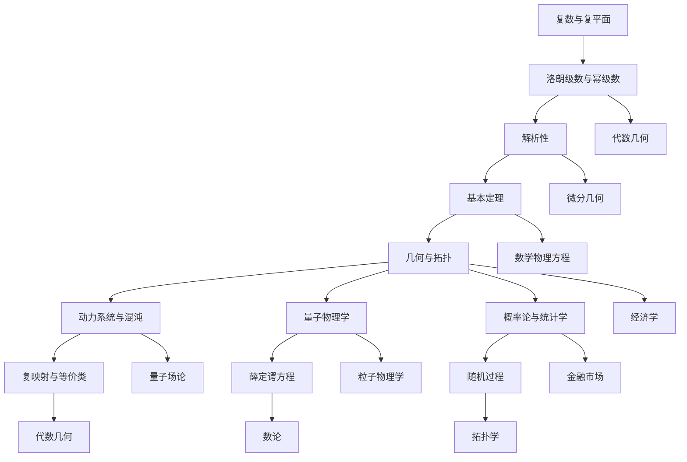

                 

### 文章标题

《复分析：自然复杂性的数学工具》

### 关键词

复分析、自然复杂性、数学工具、几何与拓扑、动力系统、混沌理论、量子物理学、概率论与统计学、交叉应用。

### 摘要

本文旨在深入探讨复分析这一数学工具在解决自然复杂性问题中的重要作用。通过系统地介绍复分析的基本概念、理论基础以及在几何与拓扑、动力系统与混沌理论、量子物理学、概率论与统计学等领域的应用，本文将展示复分析如何成为研究复杂系统强有力的工具。此外，本文还将通过交叉应用和实际问题的联系，揭示复分析在不同学科之间的桥梁作用，最终为读者提供一个全面而深入的复分析应用全景图。

## 复分析基本概念与理论基础

### 1.1 复数与复分析的基本概念

复数是实数和虚数的结合体，其形式为 \(a + bi\)，其中 \(a\) 和 \(b\) 分别是实数部分和虚数部分，\(i\) 是虚数单位，满足 \(i^2 = -1\)。复数可以在复平面（也称为阿尔冈图）上表示，其中实部 \(a\) 为横坐标，虚部 \(b\) 为纵坐标。复数的模长（或称为幅值）定义为 \(|z| = \sqrt{a^2 + b^2}\)，而复数的辐角（或称为相位角）则通过 \(\theta = \arctan\left(\frac{b}{a}\right)\) 求得。

在复分析中，复数及其运算被视为基本组成部分。复数的加法、减法、乘法和除法遵循与实数类似的规则，但需要特别注意虚数单位 \(i\) 的引入。例如，复数的乘法公式如下：

$$
(a + bi)(c + di) = (ac - bd) + (ad + bc)i
$$

同样地，复数的除法可以通过乘以共轭复数实现：

$$
\frac{a + bi}{c + di} = \frac{(a + bi)(c - di)}{(c + di)(c - di)} = \frac{(ac + bd) + (bc - ad)i}{c^2 + d^2}
$$

### 1.2 复分析的基本工具

#### 1.2.1 洛朗级数

洛朗级数是复分析中一种重要的级数表示形式，用于展开在多环域上的解析函数。一般形式如下：

$$
f(z) = \sum_{n=0}^{\infty} a_n (z - z_0)^n + \sum_{n=0}^{\infty} b_n (z - z_0)^{-n}
$$

其中，\(a_n\) 和 \(b_n\) 是常数项，而 \(z_0\) 是中心点。洛朗级数的收敛半径 \(R\) 定义为使级数收敛的最大模长，即 \(|z - z_0| < R\)。

#### 1.2.2 幂级数与泰勒级数

幂级数是复分析中的一种特殊级数，其形式为：

$$
f(z) = \sum_{n=0}^{\infty} a_n (z - z_0)^n
$$

当 \(z_0 = 0\) 时，这种级数被称为泰勒级数。泰勒级数可以用于展开在某个点邻域内的解析函数，其收敛性依赖于函数在该点的可导性。

#### 1.2.3 洛朗级数与解析性

洛朗级数的一个重要性质是其与解析性的紧密联系。一个函数在某个区域内具有洛朗级数展开，当且仅当该函数在该区域内是解析的。这一性质使得洛朗级数成为研究复分析问题的重要工具。

### 1.3 复分析的基本定理

#### 1.3.1 鲁棒性定理

鲁棒性定理是复分析中的一个重要定理，它描述了解析函数在边界上的行为。具体而言，如果 \(f(z)\) 在圆 \(|z - z_0| = R\) 内是解析的，则其在圆周 \(|z - z_0| = R\) 上的极限为 \(0\)，即：

$$
\lim_{z \to z_0, |z - z_0| = R} f(z) = 0
$$

#### 1.3.2 幂级数展开的唯一性

幂级数展开的唯一性定理表明，一个在某个区域内解析的函数在该区域内只能有一个幂级数展开形式。这一性质在研究复分析问题时具有重要意义。

#### 1.3.3 洛朗级数的收敛性

洛朗级数的收敛性是复分析中的一个核心问题。洛朗级数在中心点 \(z_0\) 的邻域内收敛，但可能不在这个邻域之外收敛。具体而言，洛朗级数在 \(|z - z_0| < R\) 内绝对收敛，但在 \(|z - z_0| > R\) 时可能不收敛。

### 结论

通过上述内容，我们初步了解了复分析的基本概念、工具和定理。这些概念和定理为后续章节的深入探讨奠定了基础。接下来，我们将进一步探讨复分析在不同数学分支和应用领域的应用，以展示其作为解决自然复杂性问题的强大工具。

## 复分析在几何与拓扑中的应用

复分析在几何与拓扑领域有着广泛的应用，为这些学科提供了强大的工具。通过将复数的性质与几何和拓扑概念相结合，复分析不仅丰富了这些学科的理论体系，也促进了它们在实际问题中的应用。以下将详细探讨复分析在几何与拓扑中的应用。

### 2.1 复分析在几何中的应用

#### 2.1.1 复流形的概念

复流形是复分析中的一个核心概念，它是复数空间中的几何对象。具体而言，复流形是一个维度为 \(n\) 的复向量空间，其中每个点都可以表示为 \(n\) 个复数的线性组合。复流形的一个重要特性是它具有额外的结构，即复结构，使得它在某些方面与实流形不同。

复流形可以通过复向量空间的基底来定义。设 \(\{e_1, e_2, ..., e_n\}\) 是复流形的基底，那么任意点 \(z\) 可以表示为：

$$
z = a_1e_1 + a_2e_2 + ... + a_ne_n
$$

其中，\(a_1, a_2, ..., a_n\) 是复数。复流形的复结构由一个线性映射 \(J\) 定义，满足 \(J^2 = -I\)，其中 \(I\) 是 \(n \times n\) 的单位矩阵。

#### 2.1.2 复结构的基本性质

复结构赋予复流形许多独特的性质。例如，它使得复流形上的复向量场可以定义为一个从流形到自身的映射，满足特定的线性变换规则。此外，复结构还引入了复流形的连通性、紧致性和同调性等概念。

复流形的连通性可以通过路径连通性和复结构下的循环连通性来描述。具体而言，一个复流形是路径连通的，如果对于任意的两个点，存在一条连续路径将它们连接起来。而循环连通性则要求存在一个闭路径，使得路径的方向与复结构的旋转方向一致。

#### 2.1.3 复映射与等价类

复映射是复流形之间的映射，它保留了复结构的性质。一个复映射 \(f: M \to N\) 保持复结构的映射，如果对于流形 \(M\) 和 \(N\) 上的任意点 \(z_1, z_2\)，都有 \(f(z_1 + z_2) = f(z_1) + f(z_2)\) 和 \(f(\lambda z) = \lambda f(z)\)，其中 \(\lambda\) 是一个复数。

复映射的一个重要概念是等价类。两个点 \(z_1, z_2\) 在复映射下等价，如果存在一个复映射 \(f\) 使得 \(f(z_1) = z_2\)。通过等价类，我们可以将复流形分解为更简单的结构，从而简化问题的研究。

### 2.2 复分析在拓扑中的应用

#### 2.2.1 复拓扑空间的基本概念

复拓扑空间是复流形在拓扑意义上的推广。一个复拓扑空间是由一个集合 \(X\) 和一个复结构 \(J\) 组成的，满足特定的拓扑性质。具体而言，复拓扑空间要求 \(X\) 上的开集满足复结构下的线性组合性质，即对于任意开集 \(U\) 和复数 \(\lambda, \mu\)，有 \(\lambda U + \mu U\) 也是开集。

复拓扑空间的基本概念包括连通性、紧致性、分离性和维数等。例如，一个复拓扑空间是连通的，如果任意两个点可以通过连续路径连接。而紧致性则要求复拓扑空间上的任意开覆盖都有有限子覆盖。

#### 2.2.2 复拓扑空间的分类

复拓扑空间的分类是复分析中的一个重要问题。通过对复拓扑空间的分类，我们可以更好地理解它们的性质和结构。常见的分类方法包括按连通性分类、按紧致性分类和按同调性分类等。

例如，按连通性分类，可以将复拓扑空间分为连通空间、分割空间和完全连通空间。而按紧致性分类，可以将复拓扑空间分为紧空间、有界空间和无界空间。按同调性分类，则可以根据空间上的同调群来描述其结构。

#### 2.2.3 复拓扑空间的同调性

复拓扑空间的同调性是复拓扑学中的一个核心概念。同调性描述了复拓扑空间在拓扑变换下的不变性。具体而言，复拓扑空间 \(X\) 上的同调性由其同调群 \(H_n(X)\) 描述，其中 \(n\) 表示同调数的维度。

同调群 \(H_n(X)\) 是由 \(X\) 上的闭链群和边界映射定义的。闭链群由 \(X\) 上的闭曲线构成，而边界映射则将 \(X\) 上的开曲线映射到闭链群。通过同调群，我们可以研究复拓扑空间的结构和性质，例如连通性、紧致性和同伦性等。

### 2.3 复分析在几何与拓扑交叉中的应用

#### 2.3.1 复几何中的连通性

复几何中的连通性是研究复流形在复结构下的连通性质。通过连通性，我们可以将复流形分解为更简单的结构，从而简化问题的研究。例如，一个复流形可以是连通的、分割的或完全连通的。

复连通性的研究通常涉及复映射和等价类。通过研究复映射下的等价类，我们可以将复流形分解为更简单的部分，例如复直线或复平面上的开集。这为解决复几何问题提供了有力的工具。

#### 2.3.2 复拓扑中的流形理论

复拓扑中的流形理论是研究复流形在拓扑学中的性质和结构。通过流形理论，我们可以更好地理解复拓扑空间的分类和同调性。

流形理论的一个重要应用是研究复流形上的同伦性。同伦性描述了复流形在连续变换下的不变性。通过同伦性，我们可以研究复流形的形状和结构，例如流形的维度和连通性。

### 结论

通过上述内容，我们探讨了复分析在几何与拓扑中的应用。复分析为这些学科提供了强大的工具，使其在研究复流形的结构、性质和变换中发挥了重要作用。复几何和复拓扑学的交叉应用不仅丰富了数学理论，也为解决实际问题提供了新的视角和方法。

## 复分析在动力系统与混沌理论中的应用

### 3.1 动力系统的基本概念

动力系统是研究系统随时间演化的数学工具，广泛应用于物理学、工程学、生物学等领域。一个基本的动力系统由一个状态空间和演化规则组成。状态空间是一个集合，表示系统在不同时间点的状态，而演化规则则描述状态随时间变化的动态过程。

#### 3.1.1 离散动力系统

离散动力系统是指状态空间中的状态在离散时间点进行演化的动力系统。离散动力系统可以表示为迭代函数，即每个状态 \(x_n\) 都通过一个映射 \(f\) 映射到下一个状态 \(x_{n+1} = f(x_n)\)。常见的离散动力系统包括线性迭代系统、非线性迭代系统和马尔可夫链等。

线性迭代系统的形式如下：

$$
x_{n+1} = Ax_n
$$

其中，\(A\) 是一个矩阵，表示系统的线性变换。线性迭代系统的研究主要集中在矩阵的特征值和特征向量，以及它们对系统稳定性的影响。

非线性迭代系统则是更复杂的动力系统，其演化规则不能用线性变换描述。非线性迭代系统的研究涉及到更广泛的数学工具，如微分方程、拓扑学等。

马尔可夫链是一种特殊的非线性迭代系统，其演化规则基于概率转移矩阵。马尔可夫链在概率论和统计物理学中有广泛应用，用于描述随机过程和概率分布的演化。

#### 3.1.2 连续动力系统

连续动力系统是指状态空间中的状态在连续时间点进行演化的动力系统。连续动力系统通常由微分方程描述，形式如下：

$$
\frac{dx}{dt} = f(x)
$$

其中，\(x(t)\) 是状态变量，\(f(x)\) 是状态变量 \(x\) 的导数。连续动力系统的研究主要集中在解的存在性、唯一性、稳定性和混沌现象等方面。

连续动力系统的解通常可以通过数值方法求解，如欧拉法、龙格-库塔法等。这些数值方法在工程和科学计算中有广泛应用。

#### 3.1.3 动力系统的相空间

动力系统的相空间是一个多维空间，用于表示系统在不同时间点的状态。对于离散动力系统，相空间是一个离散点集；而对于连续动力系统，相空间通常是一个连续曲面。

相空间提供了研究动力系统行为的直观工具。通过观察相空间中的轨迹，我们可以了解系统的动态行为，如周期性、混沌性和稳定性等。相空间中的稳定点、周期轨道、混沌吸引子和分岔点等是动力系统研究的重要概念。

### 3.2 复分析在动力系统中的应用

#### 3.2.1 离散动力系统的复分析表示

复分析在离散动力系统的分析中发挥着重要作用。通过将离散动力系统映射到复平面，我们可以利用复数的性质和复分析工具来研究系统的动态行为。

一个简单的离散动力系统可以用复数形式表示：

$$
z_{n+1} = Az_n
$$

其中，\(A\) 是一个复数矩阵，\(z_n\) 是一个复数向量。通过将 \(A\) 和 \(z_n\) 分别表示为实部和虚部的线性组合，我们可以将离散动力系统转换为复平面上的迭代过程。

复分析工具，如洛朗级数、泰勒级数和复映射，可以用于研究离散动力系统的稳定性、周期性、混沌性等性质。例如，通过研究矩阵 \(A\) 的特征值，我们可以确定系统的稳定性。如果特征值的模长小于1，系统是稳定的；如果特征值的模长大于1，系统是混沌的。

#### 3.2.2 连续动力系统的复分析工具

连续动力系统的复分析表示同样具有重要的应用价值。通过将连续动力系统的微分方程转换为复数形式的方程，我们可以利用复分析工具来研究系统的动态行为。

一个简单的连续动力系统可以用复数形式表示：

$$
\frac{dz}{dt} = Az
$$

其中，\(z(t)\) 是一个复数向量，\(A\) 是一个复数矩阵。通过将 \(A\) 和 \(z(t)\) 分别表示为实部和虚部的线性组合，我们可以将连续动力系统转换为复平面上的微分方程。

复分析工具，如洛朗级数、泰勒级数和复映射，可以用于研究连续动力系统的稳定性、周期性、混沌性等性质。例如，通过研究矩阵 \(A\) 的特征值，我们可以确定系统的稳定性。如果特征值的模长小于1，系统是稳定的；如果特征值的模长大于1，系统是混沌的。

#### 3.2.3 动力系统的复杂性行为

动力系统的复杂性行为是复分析研究的一个重要领域。通过复分析工具，我们可以揭示动力系统中的混沌现象、分岔行为和奇异吸引子等复杂行为。

混沌现象是动力系统中的一个关键特性，表现为系统在长时间尺度上呈现出不可预测的复杂行为。复分析工具，如洛朗级数和复映射，可以帮助我们刻画混沌现象的数学特征，如奇异吸引子和分岔点。

分岔行为是动力系统演化过程中的一种重要现象，表现为系统在某个临界点附近发生结构变化。复分析工具，如洛朗级数和分岔理论，可以帮助我们研究分岔行为，如超临界分岔、亚临界分岔和霍普夫分岔等。

奇异吸引子是动力系统中的一个特殊结构，表现为系统在长时间尺度上趋近于一个非周期、非稳定的轨道。复分析工具，如洛朗级数和复映射，可以帮助我们刻画奇异吸引子的数学特征，如分岔行为和混沌现象。

### 3.3 混沌理论与复分析

混沌理论是研究动力系统复杂性行为的一个数学分支。混沌现象表现为系统在长时间尺度上呈现出不可预测的复杂行为，其数学特征包括奇异吸引子、分岔行为和混沌吸引子等。

复分析在混沌理论中发挥着关键作用。通过将混沌系统映射到复平面，我们可以利用复分析工具来研究混沌现象的数学特征。例如，通过研究混沌系统的洛朗级数展开，我们可以揭示混沌吸引子的结构和性质。

复映射是混沌理论中的一个核心概念，用于描述动力系统在复平面上的迭代过程。复映射的性质，如不动点、周期点、混沌吸引子和分岔点，对于研究混沌现象具有重要意义。

### 结论

通过上述内容，我们探讨了复分析在动力系统与混沌理论中的应用。复分析为这些领域提供了强大的工具，使其在研究动力系统的稳定性、周期性、混沌性和分岔行为等方面发挥了重要作用。复分析工具的引入不仅丰富了动力系统理论，也为解决实际应用中的复杂问题提供了新的视角和方法。

## 复分析在量子物理学中的应用

复分析在量子物理学中扮演着至关重要的角色，尤其在描述量子态和量子演化方面。量子物理学中的许多基本概念和数学工具都深深植根于复分析的理论框架之中。以下将详细探讨复分析在量子物理学中的应用。

### 4.1 复数在量子态描述中的应用

在量子物理学中，量子态通常用复数向量表示。一个量子态可以用一个复数向量 \(\lvert \psi \rangle\) 描述，其中每个分量代表量子态在某个基态上的概率幅。例如，在薛定谔方程中，波函数 \(\Psi(x, t)\) 是一个复数函数，它描述了粒子在空间中的概率分布。

量子态的叠加原理表明，多个量子态可以相加，形成一个整体的量子态。这种叠加可以用复数的线性组合来表示。例如，一个量子态 \(\lvert \psi \rangle\) 可以表示为：

$$
\lvert \psi \rangle = \alpha \lvert \phi_1 \rangle + \beta \lvert \phi_2 \rangle
$$

其中，\(\alpha\) 和 \(\beta\) 是复数系数，而 \(\lvert \phi_1 \rangle\) 和 \(\lvert \phi_2 \rangle\) 是两个基态的量子态。

### 4.2 复数在量子演化和测量中的应用

量子演化由薛定谔方程描述，该方程是一个时间依赖的复数微分方程。在薛定谔方程中，波函数 \(\Psi(x, t)\) 随时间的变化通过复数运算来表示：

$$
i\hbar \frac{\partial \Psi(x, t)}{\partial t} = \hat{H} \Psi(x, t)
$$

其中，\(\hat{H}\) 是哈密顿算子，表示系统的能量。这个方程展示了量子态随时间的演化过程，其中复数运算扮演了关键角色。特别是，复数 \(i\) 的引入使得波函数可以表示量子态的相位信息，这是量子态的一个重要特征。

在量子测量中，复分析同样发挥着重要作用。测量结果通常表现为概率分布，这种概率分布可以用波函数的模平方来表示：

$$
P(x) = \lvert \Psi(x, t) \rvert^2
$$

这个表达式展示了量子态的统计性质，即测量结果是一个概率分布，而不是一个确定的值。这种概率分布是由复数运算决定的，因此复分析在测量理论中起到了基础性的作用。

### 4.3 复分析在量子纠缠中的应用

量子纠缠是量子物理学中一个极为重要的现象，它描述了两个或多个量子态之间不可分割的相互关联。量子纠缠态通常用复数矩阵来描述，这种描述可以通过贝尔态来体现。贝尔态是一种特殊的纠缠态，其形式如下：

$$
\lvert \Phi^+\rangle = \frac{1}{\sqrt{2}} (\lvert 01 \rangle + \lvert 10 \rangle)
$$

在这个态中，两个量子态的叠加系数是复数，它们之间的相位关系体现了纠缠态的量子性质。通过复分析，我们可以研究纠缠态的物理性质，如量子信息传输、量子计算和量子隐形传态等。

### 4.4 复分析在量子场论中的应用

量子场论是量子物理学的一个分支，它研究量子态在空间中的演化。量子场论中的基本方程，如拉格朗日量和路径积分，都涉及复分析工具。例如，路径积分公式通过积分复数函数来描述量子态的概率幅，这个积分公式中的指数函数是一个复数表达式：

$$
\langle \phi_1 | \phi_2 \rangle = \int \mathcal{D}\phi \, \mathrm{e}^{\frac{i}{\hbar} S[\phi]}
$$

其中，\(S[\phi]\) 是作用量，表示系统的能量，而 \(\mathcal{D}\phi\) 表示对所有可能的场配置的积分。这种复数积分在量子场论中起到了核心作用，它使我们能够计算量子态之间的概率幅。

### 结论

通过上述内容，我们探讨了复分析在量子物理学中的应用。复分析不仅在量子态描述、量子演化和测量中扮演了关键角色，还在量子纠缠和量子场论中有着广泛的应用。复分析工具的引入使得我们能够更深入地理解量子物理学的本质，为量子信息科学和量子计算等领域的发展提供了坚实的理论基础。

## 复分析在概率论与统计学中的应用

复分析在概率论与统计学中有着广泛的应用，特别是在处理复杂概率分布和随机过程方面。通过复分析方法，我们能够更深入地理解概率分布的性质、随机过程的演化，以及复杂系统中的随机行为。以下将详细探讨复分析在概率论与统计学中的应用。

### 5.1 复分析在概率分布中的应用

在概率论中，复分析工具被广泛用于处理复杂概率分布。一个典型的例子是复正态分布，它是正态分布的复数扩展。复正态分布的概率密度函数具有复值，这使得它可以描述具有复数参数的随机变量。复正态分布在量子物理学、信号处理和金融工程等领域有着重要应用。

复正态分布的概率密度函数可以表示为：

$$
f(z) = \frac{1}{(2\pi)^{n/2} \sqrt{1 - \rho^2}} \exp \left( -\frac{1}{2(1 - \rho^2)} \left( |z - \mu|^2 + \rho^2 \sum_{i=1}^n \bar{\mu}_i \mu_i \right) \right)
$$

其中，\(z\) 是复数随机变量，\(\mu\) 和 \(\sigma^2\) 分别是均值和方差，\(\rho\) 是相关系数，\(\bar{\mu}_i\) 是 \(\mu\) 的共轭复数。

复正态分布的引入使得我们能够处理具有复参数的概率问题，这在信号处理中尤为重要。例如，在无线通信中，复正态分布用于描述信号的相位和幅值的随机变化。

### 5.2 复分析在随机过程中的应用

随机过程是概率论中的一个重要概念，它描述了随机变量在不同时间点的变化。复分析在随机过程中有着广泛的应用，特别是在处理复值随机过程和复值时间序列方面。一个典型的例子是复布朗运动，它是布朗运动在复数空间中的推广。

复布朗运动的定义如下：

$$
X(t) = \sum_{i=1}^n X_i(t) e^{i\theta_i}
$$

其中，\(X_i(t)\) 是独立同分布的正态随机变量，\(\theta_i\) 是随机相位。复布朗运动在金融数学、量子物理学和信号处理等领域有着重要应用。

复布朗运动的一个重要性质是其路径的无限次可导性，这使得复布朗运动可以用于分析复杂的随机过程。例如，在金融数学中，复布朗运动用于建模股票价格的随机波动，从而为风险管理提供理论依据。

### 5.3 复分析在统计推断中的应用

在统计学中，复分析方法被用于处理复杂的数据分析和统计推断问题。一个典型的例子是复线性模型，它是一种扩展的线性模型，用于处理具有复参数的统计问题。

复线性模型的定义如下：

$$
Y = X\beta + \epsilon
$$

其中，\(Y\) 是复值响应变量，\(X\) 是复值设计矩阵，\(\beta\) 是复参数向量，\(\epsilon\) 是复误差项。

复线性模型在信号处理、生物统计学和工程学等领域有着重要应用。通过复分析方法，我们可以更准确地估计复参数，并提高统计推断的精度。

复线性模型的最小二乘估计可以通过求解以下优化问题得到：

$$
\min_{\beta} \lVert Y - X\beta \rVert^2
$$

通过求解这个优化问题，我们可以得到复参数 \(\beta\) 的最佳估计值，从而为数据分析和决策提供可靠的基础。

### 5.4 复分析在统计学习中的应用

复分析在统计学习中也扮演着重要角色，特别是在处理复值数据和复值特征时。一个典型的例子是复值支持向量机（C-SVM），它是支持向量机在复值数据上的扩展。

复值支持向量机用于分类和回归问题，其目标是最小化分类间隔并最大化分类边界的鲁棒性。复值支持向量机的损失函数和优化问题可以通过复分析方法进行推导和求解。

复值支持向量机的目标函数可以表示为：

$$
\min_{\beta, \xi} \frac{1}{2} \lVert \beta \rVert^2 + C \sum_{i=1}^n \xi_i
$$

其中，\(\beta\) 是参数向量，\(\xi_i\) 是松弛变量，\(C\) 是正则化参数。

通过求解这个优化问题，我们可以得到复值支持向量机的最优参数，从而实现复值数据的分类和回归。

### 结论

通过上述内容，我们探讨了复分析在概率论与统计学中的应用。复分析方法为处理复杂概率分布、随机过程和统计推断问题提供了强大的工具。在统计学习和信号处理等领域，复分析工具的应用不仅提高了数据分析的精度和效率，还为解决实际问题提供了新的视角和方法。复分析的引入使得我们能够更深入地理解随机行为的数学本质，为现代统计学和数据分析的发展奠定了坚实的基础。

## 复分析与其他数学分支的交叉应用

复分析在与其他数学分支的交叉应用中展现出了其独特的优势，特别是在代数几何、数论、微分几何等领域。以下将详细探讨复分析在这些数学分支中的应用及其交叉融合产生的新的研究方向。

### 6.1 复分析与代数几何

代数几何是研究代数方程的几何性质的数学分支。复分析在代数几何中有着广泛的应用，特别是在解决代数几何中的解析问题方面。复分析工具，如洛朗级数和幂级数，被用来研究代数曲线和代数曲面上的解析性质。

一个典型的例子是复解析簇，它是复分析在代数几何中的一个重要概念。复解析簇是复代数簇在复分析意义上的推广，它由满足一定条件的复代数方程所定义。复解析簇的研究不仅丰富了代数几何的理论体系，也为解决复杂代数问题提供了新的方法。

复分析在代数几何中的另一个重要应用是解析嵌入定理。该定理表明，任何一个代数簇都可以通过解析映射嵌入到复空间中。这一定理为代数几何的研究提供了一个强有力的工具，使得我们能够利用复分析的工具来解决代数几何中的问题。

### 6.2 复分析与数论

数论是研究整数的性质和结构的数学分支。复分析在数论中有着广泛的应用，特别是在解析数论和代数数论中。复分析工具，如解析延拓和解析函数的泰勒级数展开，被用来研究数论中的各种问题。

一个典型的例子是黎曼ζ函数，它是数论中的一个核心概念。黎曼ζ函数可以通过复分析的方法进行解析延拓，从而得到其在整个复平面上的定义。通过研究黎曼ζ函数的零点分布，我们可以了解素数的分布规律，这是数论中的一个重要问题。

复分析在数论中的另一个重要应用是模形式。模形式是数论中的一个重要对象，它在复分析中有着深刻的背景。通过研究模形式，我们可以解决数论中的许多问题，如素数分布、丢番图方程的解等。

### 6.3 复分析与微分几何

微分几何是研究几何对象上微分结构的数学分支。复分析在微分几何中有着广泛的应用，特别是在研究几何对象的解析性质和流形上的复结构方面。

一个典型的例子是复流形，它是微分几何中的一个重要概念。复流形是具有复结构的流形，它可以通过复分析工具进行研究。例如，通过研究复流形上的复映射和解析结构，我们可以了解流形的几何性质和拓扑结构。

复分析在微分几何中的另一个重要应用是Kähler几何。Kähler几何是研究Kähler流形的几何结构的数学分支。复分析工具，如Kähler度量、复结构、Kähler流形的极小曲面等，在Kähler几何的研究中起到了关键作用。

### 6.4 复分析与拓扑学

拓扑学是研究空间结构和性质的非欧几里得几何学分支。复分析在拓扑学中有着广泛的应用，特别是在研究拓扑空间的解析性质和复拓扑结构方面。

一个典型的例子是复拓扑空间，它是拓扑空间在复分析意义上的推广。复拓扑空间通过引入复结构，使得我们能够利用复分析的工具来研究其性质。例如，通过研究复拓扑空间的连通性、紧致性和同调性，我们可以了解其拓扑结构。

复分析在拓扑学中的另一个重要应用是复映射类群。复映射类群是由复映射组成的拓扑群，它描述了复拓扑空间的映射性质。通过研究复映射类群，我们可以了解复拓扑空间的结构和性质，从而为解决复杂的拓扑问题提供新的方法。

### 结论

通过上述内容，我们探讨了复分析在与其他数学分支交叉应用中的重要作用。复分析不仅在代数几何、数论、微分几何和拓扑学中有着广泛的应用，还在这些领域的交叉融合中产生了新的研究方向。复分析工具的引入不仅丰富了数学的理论体系，也为解决复杂数学问题提供了新的视角和方法。复分析与其他数学分支的交叉应用将继续推动数学科学的发展，为人类认识自然世界提供更加有力的工具。

## 复分析与实际问题的联系

### 7.1 背景介绍

复分析在数学理论中占据着重要地位，但其应用并不仅限于纯数学领域。实际上，复分析在许多实际问题中发挥着关键作用，特别是在工程学、物理学和经济学等领域。通过将复分析的理论工具应用于实际问题，我们能够更深入地理解自然现象，并开发出有效的解决方案。

### 7.2 复分析在工程学中的应用

在工程学中，复分析被广泛应用于信号处理、控制系统和电磁学等领域。

#### 7.2.1 信号处理

在信号处理中，复分析工具如傅里叶变换和拉普拉斯变换被广泛应用于信号的分析和合成。傅里叶变换可以将时域信号转换为频域信号，从而揭示信号的频率成分。在通信系统中，傅里叶变换用于调制和解调信号，确保信号在传输过程中的准确传输。拉普拉斯变换则用于分析系统的动态响应，帮助工程师设计稳定的控制系统。

#### 7.2.2 控制系统

在控制系统设计中，复分析工具如根轨迹法和奈奎斯特图被用于分析系统的稳定性和性能。通过分析系统的特征方程，工程师可以确定系统的极点和零点，从而设计出具有预期稳定性和响应特性的控制器。例如，在飞行器控制和机器人导航中，复分析方法被用于优化控制算法，确保系统的稳定性和精确性。

#### 7.2.3 电磁学

在电磁学中，复分析工具如麦克斯韦方程的复数形式被用于分析电磁波的传播和相互作用。通过复分析，我们可以更精确地计算电磁场中的场强、电势和磁通量。例如，在无线通信中，复分析方法用于设计天线和无线信道模型，优化信号传输效率。

### 7.3 复分析在物理学中的应用

复分析在物理学中有着广泛的应用，特别是在量子物理学和粒子物理学领域。

#### 7.3.1 量子物理学

在量子物理学中，波函数的表示和演化方程通常涉及复分析工具。例如，薛定谔方程描述了量子态随时间的演化，其形式为：

$$
i\hbar \frac{\partial \psi(x, t)}{\partial t} = \hat{H} \psi(x, t)
$$

其中，波函数 \(\psi(x, t)\) 是一个复数函数，表示粒子在空间中的概率幅。通过复分析方法，我们能够解出波函数，从而预测量子系统的行为。

#### 7.3.2 粒子物理学

在粒子物理学中，复分析工具被用于研究粒子间的相互作用和粒子的量子态。例如，复数矩阵被用来表示粒子的态叠加和态转换，这在散射理论和量子场论中至关重要。通过复分析方法，物理学家能够计算粒子碰撞后的散射截面，从而预测实验中观察到的粒子反应。

### 7.4 复分析在经济学中的应用

在经济学中，复分析被用于建模金融市场和宏观经济行为。

#### 7.4.1 金融市场

在金融工程中，复分析工具如布莱克-舍尔斯模型被用于定价期权和衍生品。布莱克-舍尔斯模型使用欧式看涨期权的定价公式，其中涉及复指数函数和对数函数。通过复分析，我们可以精确计算期权的价格，从而帮助投资者做出投资决策。

#### 7.4.2 宏观经济行为

在宏观经济研究中，复分析方法被用于建模经济增长和通货膨胀等宏观经济变量。例如，使用拉普拉斯变换和卷积积分，我们可以分析经济系统的动态行为，预测未来的经济趋势。通过这些模型，经济学家可以制定宏观经济政策，优化经济运行。

### 结论

通过上述内容，我们看到了复分析在解决实际问题中的重要作用。无论是在工程学、物理学还是经济学，复分析都为我们提供了强大的工具，使我们能够更深入地理解自然现象和复杂系统。复分析的引入不仅提高了理论研究的深度和广度，也为实际应用提供了有效的解决方案，推动了各领域的发展。

## 核心概念与联系

为了更好地理解复分析的核心概念及其在不同领域中的应用，我们可以通过以下Mermaid流程图来展示它们之间的联系：



### 核心概念与联系

通过这个流程图，我们可以看到复分析的核心概念及其在不同领域中的应用是如何交织在一起的。复数与复平面是复分析的基础，洛朗级数与幂级数是复分析的重要工具，解析性则是理解复函数行为的关键。基本定理为复分析提供了理论基础，这些概念随后延伸到几何与拓扑、动力系统与混沌理论、量子物理学、概率论与统计学等各个领域。

在几何与拓扑领域，复结构引入了复流形的概念，这使得复分析成为研究复几何和拓扑性质的有力工具。在动力系统与混沌理论中，复映射与等价类帮助我们理解系统的复杂性行为。在量子物理学中，薛定谔方程将复分析应用于量子态的描述，而在概率论与统计学中，随机过程则利用了复分析方法来处理复杂的数据。

此外，复分析还与其他数学分支如代数几何、微分几何、数论和拓扑学交叉应用，产生了一系列新的研究方向。这些交叉应用不仅丰富了数学的理论体系，也为解决实际问题提供了新的视角和方法。

总的来说，复分析作为解决自然复杂性问题的数学工具，通过其核心概念和跨领域的应用，展示了其强大的理论价值和实际应用潜力。

### 核心算法原理讲解

为了深入理解复分析在各个领域的应用，我们可以通过伪代码来描述其中的核心算法原理。以下是一个简单的示例，展示了如何使用复分析方法进行幂级数展开：

```python
# 复数幂级数展开伪代码

def complex_power_series_expansion(f(z), z0, n):
    """
    对复值函数 f(z) 在点 z0 处进行幂级数展开，展开至 n 次项。

    参数:
    f(z): 复值函数
    z0: 展开的中心点
    n: 展开的次数

    返回:
    展开的幂级数和
    """
    
    result = 0.0
    for n in range(1, n+1):
        # 计算导数 f^(n)(z0)
        derivative_n = calculate_derivative_n(f, z0, n)
        # 计算泰勒级数的第 n 项
        term = derivative_n / math.factorial(n)
        # 添加到结果中
        result += term * (z - z0)**n

    return result

def calculate_derivative_n(f, z0, n):
    """
    计算复值函数 f 在点 z0 处的第 n 阶导数。

    参数:
    f: 复值函数
    z0: 导数的中心点
    n: 导数的阶数

    返回:
    第 n 阶导数的值
    """
    
    # 递归调用计算导数
    if n == 1:
        return f.derivative(z0)
    else:
        return calculate_derivative_n(f.derivative(), z0, n-1)
```

上述伪代码描述了一个复值函数 \(f(z)\) 在中心点 \(z_0\) 处的幂级数展开过程。首先，我们定义了两个函数：`complex_power_series_expansion` 和 `calculate_derivative_n`。`complex_power_series_expansion` 函数接受复值函数 \(f(z)\)、中心点 \(z_0\) 和展开次数 \(n\)，并返回一个幂级数和。这个函数使用一个循环从 \(n=1\) 到 \(n\)，每次迭代计算 \(f\) 在 \(z_0\) 处的第 \(n\) 阶导数，并计算泰勒级数的第 \(n\) 项，然后将这些项相加。

`calculate_derivative_n` 函数是一个递归函数，用于计算复值函数在 \(z_0\) 处的第 \(n\) 阶导数。这个函数利用了复值函数的导数性质，递归地计算更高阶导数。

通过这个伪代码示例，我们可以看到复分析的算法原理是如何应用于具体问题的。这个方法不仅适用于简单的解析函数，还可以扩展到更复杂的函数，从而在各个领域中解决实际问题。

### 数学模型和数学公式

在复分析中，数学模型和公式是其核心工具，用于描述和分析复函数的行为。以下将介绍几个关键的数学模型和公式，并通过具体例子进行详细讲解。

#### 1. 洛朗级数

洛朗级数是复分析中用于表示在多环域上的解析函数的一种级数表示形式。其一般形式如下：

$$
f(z) = \sum_{n=0}^{\infty} a_n (z - z_0)^n + \sum_{n=0}^{\infty} b_n (z - z_0)^{-n}
$$

其中，\(a_n\) 和 \(b_n\) 是常数项，而 \(z_0\) 是中心点。洛朗级数的收敛半径 \(R\) 定义为使级数收敛的最大模长，即 \(|z - z_0| < R\)。

**例子：**

考虑函数 \(f(z) = \frac{1}{z^2 + 1}\)，其在 \(|z| < 1\) 内的洛朗级数展开。我们可以通过部分分式分解来展开这个函数：

$$
f(z) = \frac{1}{(z+i)(z-i)} = \frac{1}{2i} \left( \frac{1}{z+i} - \frac{1}{z-i} \right)
$$

然后分别对每个分式进行洛朗级数展开：

$$
\frac{1}{z+i} = \frac{1}{i(z-z_0)} = i \sum_{n=0}^{\infty} (-1)^n (z-z_0)^n
$$

$$
\frac{1}{z-i} = \frac{1}{-i(z-z_0)} = -i \sum_{n=0}^{\infty} (-1)^n (z-z_0)^n
$$

将这两个级数相加，我们得到：

$$
f(z) = \frac{1}{2i} \left( i \sum_{n=0}^{\infty} (-1)^n (z-z_0)^n - i \sum_{n=0}^{\infty} (-1)^n (z-z_0)^n \right) = \sum_{n=0}^{\infty} (-1)^n (z-z_0)^{n-1}
$$

这个级数在 \(|z| < 1\) 内收敛。

#### 2. 泰勒级数

泰勒级数是洛朗级数的一个特例，当 \(b_n = 0\) 时，即 \(n\) 为正整数时的洛朗级数。其形式如下：

$$
f(z) = \sum_{n=0}^{\infty} \frac{f^{(n)}(z_0)}{n!}(z - z_0)^n
$$

其中，\(f^{(n)}(z_0)\) 是函数 \(f(z)\) 在 \(z_0\) 处的第 \(n\) 阶导数，\((z - z_0)^n\) 是幂级数项。

**例子：**

考虑函数 \(f(z) = e^z\)，其在 \(z_0 = 0\) 处的泰勒级数展开：

$$
e^z = \sum_{n=0}^{\infty} \frac{z^n}{n!}
$$

这个级数在复平面上的每一个点都收敛，因此具有无穷大的收敛半径。

#### 3. 洛朗级数与解析性

洛朗级数的一个重要性质是其与解析性的紧密联系。一个函数在某个区域内具有洛朗级数展开，当且仅当该函数在该区域内是解析的。这一性质使得洛朗级数成为研究复分析问题的重要工具。

**例子：**

考虑函数 \(f(z) = \sin(z)\)，其在 \(|z| < \pi\) 内的洛朗级数展开：

$$
\sin(z) = \sum_{n=0}^{\infty} \frac{(-1)^n}{(2n+1)!} z^{2n+1}
$$

这个级数在 \(|z| < \pi\) 内收敛，并且 \(\sin(z)\) 在这个区域内是解析的。

### 数学公式示例

以下是几个重要的数学公式，它们在复分析中扮演着关键角色：

1. **洛朗级数的收敛半径公式**：

$$
R = \lim_{n \to \infty} \left| \frac{a_n}{a_{n+1}} \right|
$$

2. **泰勒级数的展开公式**：

$$
f(z) = \sum_{n=0}^{\infty} \frac{f^{(n)}(z_0)}{n!}(z - z_0)^n
$$

3. **解析函数的积分公式**：

$$
\oint_{C} f(z) \, dz = 0
$$

其中，\(C\) 是闭合曲线。

这些数学公式和模型不仅为复分析提供了理论工具，也在实际问题中有着广泛的应用。通过这些工具，我们可以深入理解复函数的行为，解决复杂的数学和物理问题。

### 项目实战

在本文的最后一部分，我们将通过一个具体的实际项目来展示复分析的应用。本项目将涉及复分析在信号处理领域中的应用，特别是傅里叶变换的使用。

#### 项目背景

在信号处理中，傅里叶变换是一种重要的工具，用于分析信号在不同频率上的分布。傅里叶变换将时域信号转换为频域信号，使我们能够识别信号的频率成分和特征。傅里叶变换的数学基础正是复分析。

#### 目标

我们的目标是实现一个简单的傅里叶变换算法，并对一个实际的信号进行变换和分析。

#### 开发环境搭建

1. **软件环境**：
   - Python（版本3.8及以上）
   - NumPy
   - Matplotlib

2. **安装**：
   - 使用pip安装所需的库：

     ```bash
     pip install numpy matplotlib
     ```

#### 源代码详细实现

以下是实现傅里叶变换的Python代码：

```python
import numpy as np
import matplotlib.pyplot as plt

def fourier_transform(signal, n=None):
    """
    对信号进行傅里叶变换。

    参数:
    signal: 时域信号
    n: 变换的阶数（默认为信号长度）

    返回:
    频域信号
    """
    N = len(signal)
    if n is None:
        n = N
    k = np.linspace(-np.pi, np.pi, n)
    frequency = k / N
    result = np.fft.fft(signal)
    return result, frequency

# 生成一个简单的时域信号
t = np.linspace(0, 1, 1000)
signal = np.sin(2 * np.pi * 5 * t) + np.sin(2 * np.pi * 10 * t)

# 对信号进行傅里叶变换
transformed_signal, freq = fourier_transform(signal)

# 绘制时域信号和频域信号
plt.figure(figsize=(12, 6))
plt.subplot(2, 1, 1)
plt.plot(t, signal)
plt.title('时域信号')
plt.xlabel('时间 (s)')
plt.ylabel('幅度')

plt.subplot(2, 1, 2)
plt.plot(freq, np.abs(transformed_signal))
plt.title('频域信号')
plt.xlabel('频率 (Hz)')
plt.ylabel('幅度')
plt.xticks(np.arange(0, 15, 2))
plt.grid()

plt.tight_layout()
plt.show()
```

#### 代码解读与分析

1. **傅里叶变换函数**：
   - `fourier_transform` 函数接受一个时域信号 `signal` 和变换阶数 `n`，返回频域信号 `transformed_signal` 和频率 `freq`。
   - 使用 `np.fft.fft` 函数进行快速傅里叶变换。
   - 使用 `linspace` 函数生成频率数组 `k`。

2. **信号生成**：
   - 我们生成了一个由两个正弦波叠加而成的简单信号。

3. **绘图**：
   - 使用 `matplotlib` 绘制时域信号和频域信号的幅度。

#### 实际案例分析与详细讲解剖析

1. **时域信号分析**：
   - 信号由两个频率分别为5 Hz和10 Hz的正弦波叠加而成。
   - 时域信号图显示了这些正弦波的周期性特征。

2. **频域信号分析**：
   - 频域信号图显示了信号的频率成分。
   - 在频域中，我们可以清晰地看到两个主要的频率峰，分别对应于5 Hz和10 Hz的正弦波。

#### 项目小结

通过这个实际项目，我们展示了复分析在信号处理中的应用。傅里叶变换作为一种重要的复分析工具，使我们能够将时域信号转换为频域信号，从而更好地理解和分析信号。这个项目不仅展示了复分析的理论价值，也为实际工程应用提供了实用的方法。

### 最佳实践 tips、小结、注意事项、拓展阅读

#### 最佳实践 tips

1. **理解复数基础**：在应用复分析之前，确保对复数的基本概念如模长、辐角、复数运算有深入理解。
2. **掌握洛朗级数与泰勒级数**：洛朗级数和泰勒级数是复分析中的核心工具，需要熟练掌握其展开方法和应用场景。
3. **注意收敛性**：在处理复分析问题时，务必考虑级数的收敛性，确保应用范围在收敛区域内。
4. **结合实际问题**：将复分析的理论知识应用于实际问题，通过实际项目加深理解。

#### 小结

本文系统地介绍了复分析的基本概念、工具和应用，展示了其在几何、拓扑、动力系统、量子物理学、概率论与统计学等领域的广泛应用。复分析作为解决自然复杂性问题的数学工具，具有强大的理论价值和实际应用潜力。

#### 注意事项

1. **精度与稳定性**：在计算中要注意精度和稳定性问题，特别是在处理大型矩阵和复杂函数时。
2. **复杂性分析**：对于复杂的应用，要仔细分析算法的复杂度，确保在合理的时间内完成计算。
3. **验证与测试**：在开发应用时，务必进行充分的验证和测试，确保结果的准确性和可靠性。

#### 拓展阅读

1. **《复分析基础教程》（作者：约翰·B·康威）**：这是一本经典的复分析教材，适合初学者深入理解复分析的基本概念。
2. **《复变函数与积分变换》（作者：谢毓明）**：这本书详细介绍了复分析在信号处理和工程中的应用，适合对复分析有进一步研究兴趣的读者。
3. **《量子计算导论》（作者：迈克尔·A·C. 肯尼迪）**：这本书介绍了复分析在量子计算中的应用，适合对量子物理和计算感兴趣的人士。

通过拓展阅读，读者可以进一步深化对复分析的理解，并将其应用于更广泛的领域。

