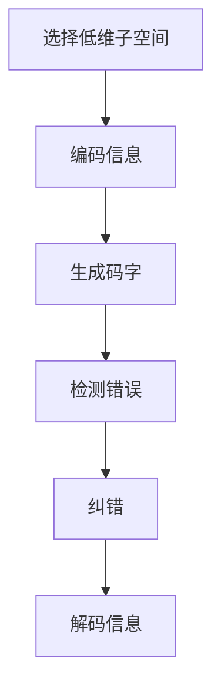
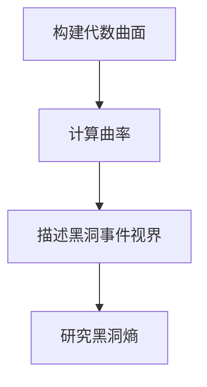
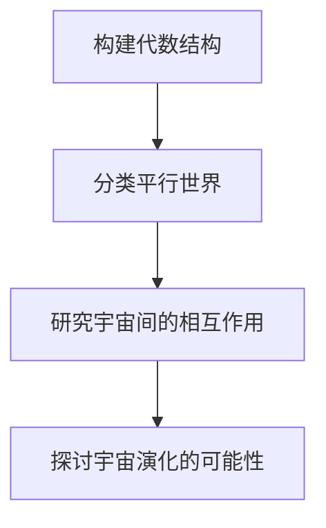

                 

## 文章标题

# 多维宇宙的代数几何：平行世界的数学基础

## 关键词

- 多维宇宙
- 代数几何
- 平行世界
- 数学基础
- 物理理论
- 计算复杂性

## 摘要

本文深入探讨了多维宇宙的代数几何原理及其在平行世界中的数学基础。通过介绍多维宇宙的概念、代数几何的基本原理以及平行世界的数学描述，我们搭建了理解这些复杂概念的框架。文章还详细阐述了代数几何在物理中的应用，包括量子场论、弦论和宇宙学。此外，我们介绍了代数几何的算法与工具，并通过实际案例研究展示了其应用。最后，我们对未来研究方向和挑战进行了展望。

-------------------------------------------------------------------

## 引言

在过去的几个世纪中，物理学的进步使我们开始意识到宇宙可能并非我们所见的那样简单。传统的三维空间观念已经被扩展到了更高维度的概念。这一扩展不仅改变了我们对现实世界的理解，还引领我们探索了一种全新的宇宙模型——多维宇宙。在这种模型中，宇宙可能包含多个维度，这些维度之间可能以我们无法直接感知的方式相互关联。

### 多维宇宙的概念

多维宇宙的概念起源于对时空理论的重新审视。爱因斯坦的相对论提出了时空的四维结构，包括三个空间维度和一个时间维度。然而，随着对宇宙的进一步研究，科学家们开始怀疑，可能还存在更多的维度，这些维度可能对我们的日常生活和物理定律产生深远影响。

平行世界（也称为多元宇宙）的概念进一步扩展了这一思想。在平行世界中，每个世界都有自己独立的物理定律和历史，但它们可能在某些方面与我们的宇宙相似。例如，在一个平行世界中，可能存在完全不同的物理常数或自然法则。

### 代数几何的基本原理

代数几何是研究由代数方程定义的几何形状的数学分支。它将代数和几何紧密结合起来，提供了一种强有力的工具来研究复杂几何形状和其性质。代数几何的核心概念包括代数结构、多项式和理想。

- **代数结构**：代数结构是一种具有特定运算的集合，如加法、乘法等。这些运算满足某些基本性质，如结合律、交换律和分配律。
- **多项式**：多项式是由变量和常数通过加法和乘法组成的表达式。多项式在代数几何中起着核心作用，因为它们可以用来定义代数曲线和曲面。
- **理想**：理想是代数结构中的子集，具有某些特殊性质。在代数几何中，理想用于描述几何形状的某些特性。

### 平行世界的数学描述

平行世界的数学描述依赖于代数几何的概念。通过将代数几何应用于多个维度，我们可以构建出平行世界的数学模型。例如，我们可以使用代数曲线来描述不同维度之间的交互作用，或者使用代数曲面来表示平行宇宙中的不同物理状态。

此外，代数几何还提供了一种方法来研究平行宇宙中的可能性和概率。通过分析代数结构中的运算和理想，我们可以推断出平行宇宙中的不同可能历史和未来。

-------------------------------------------------------------------

## 第1章：引论

### 1.1 多维宇宙的概念

多维宇宙的概念最早可以追溯到数学家和哲学家。在19世纪，法国数学家庞加莱（Jules Henri Poincaré）提出了多维空间的理论，他认为宇宙可能包含多个维度。这一理论在爱因斯坦的相对论中得到了进一步的发展。相对论提出了时空的四维结构，包括三个空间维度和一个时间维度。

随着对宇宙的进一步研究，科学家们开始怀疑，可能还存在更多的维度。这些额外的维度可能对我们的日常生活和物理定律产生深远影响。例如，理论物理学家推测，额外的维度可能是暗物质和暗能量的来源，也可能是弦论中的基本粒子在更高维度中的振动模式。

### 1.2 代数几何的基本原理

代数几何是研究由代数方程定义的几何形状的数学分支。它将代数和几何紧密结合起来，提供了一种强有力的工具来研究复杂几何形状和其性质。代数几何的核心概念包括代数结构、多项式和理想。

- **代数结构**：代数结构是一种具有特定运算的集合，如加法、乘法等。这些运算满足某些基本性质，如结合律、交换律和分配律。常见的代数结构包括群、环和域。
- **多项式**：多项式是由变量和常数通过加法和乘法组成的表达式。多项式在代数几何中起着核心作用，因为它们可以用来定义代数曲线和曲面。例如，二次多项式可以定义一个二次曲线，如椭圆或双曲线。
- **理想**：理想是代数结构中的子集，具有某些特殊性质。在代数几何中，理想用于描述几何形状的某些特性。例如，在一个多项式环中，一个理想可以描述一个代数曲线上的所有多项式。

### 1.3 平行世界的数学描述

平行世界的数学描述依赖于代数几何的概念。通过将代数几何应用于多个维度，我们可以构建出平行世界的数学模型。例如，我们可以使用代数曲线来描述不同维度之间的交互作用，或者使用代数曲面来表示平行宇宙中的不同物理状态。

代数几何提供了一种方法来研究平行宇宙中的可能性和概率。通过分析代数结构中的运算和理想，我们可以推断出平行宇宙中的不同可能历史和未来。例如，在一个代数曲线上的点可以代表平行宇宙中的不同状态，而曲线上的切线可以表示这些状态的演化方向。

### 第2章：代数几何基础

在探讨多维宇宙的代数几何原理之前，我们需要对代数几何的基本概念进行深入理解。本章将介绍代数结构、多项式和理想等基本概念，并讨论它们在代数几何中的应用。

### 2.1 代数结构

代数结构是一种具有特定运算的集合。常见的代数结构包括群、环和域。群是最基本的代数结构，它具有一个封闭的运算和逆元素。环是在群的基础上增加了乘法运算的结构，而域是环的特殊情况，其中除法运算也是封闭的。

在代数几何中，代数结构用于描述几何形状的属性。例如，一个多边形的边可以看作是一个群，而多边形的顶点可以看作是一个环。代数结构的基本性质，如结合律、交换律和分配律，为我们提供了研究几何形状的工具。

#### 2.1.1 代数结构的定义与性质

代数结构是一种具有特定运算的集合。常见的代数结构包括群、环和域。

- **群**：一个群是一个具有封闭运算的集合，其中每个元素都有一个逆元素。群的运算通常称为加法，记作 \( + \)。群的性质包括结合律、交换律和存在单位元素。例如，整数集 \( \mathbb{Z} \) 在加法运算下构成一个群。

- **环**：一个环是一个具有封闭运算的集合，其中包含了加法和乘法运算。环的运算通常称为加法和乘法，分别记作 \( + \) 和 \( \times \)。环的性质包括结合律、分配律和存在单位元素。例如，多项式环 \( \mathbb{Z}[x] \) 在加法和乘法运算下构成一个环。

- **域**：一个域是一个具有封闭运算的集合，其中包含了加法、乘法和除法运算。域的运算通常称为加法、乘法和除法，分别记作 \( + \)、\( \times \) 和 \( / \)。域的性质包括结合律、分配律和存在单位元素。例如，有理数集 \( \mathbb{Q} \) 在加法、乘法和除法运算下构成一个域。

#### 2.1.2 代数基本群的介绍

代数基本群是代数结构中的一个重要概念，它用于描述几何形状的拓扑性质。基本群是一个群的子群，它包含了所有可以通过连续变形到达的点的集合。基本群可以用于研究几何形状的连通性和自相似性。

在代数几何中，基本群通常用于描述代数曲线和代数曲面的拓扑性质。例如，一个代数曲线的基本群可以用于研究其自相似性质，从而推断出其几何形状。

#### 2.1.3 代数结构的基本定理

代数结构的基本定理是代数几何中的核心定理之一，它描述了代数结构的性质与其几何形状之间的关系。这些定理为我们提供了研究几何形状的工具，例如，基本定理可以用于证明一个代数曲线是可约的或者不可约的。

- **定理1**：一个代数结构是可约的当且仅当其基本群是平凡的，即包含只有一个元素的子群。
- **定理2**：一个代数结构是不可约的当且仅当其基本群是非平凡的，即包含多个元素的子群。

#### 2.2 多项式和理想

多项式和理想是代数几何中的核心概念，它们用于描述几何形状的代数性质。多项式是由变量和常数通过加法和乘法组成的表达式，而理想是代数结构中的一个子集，它具有某些特殊性质。

#### 2.2.1 多项式的基本概念

多项式是代数几何中的基本工具，它们可以用于定义代数曲线和曲面。多项式的基本概念包括：

- **多项式的定义**：一个多项式是一个由变量和常数通过加法和乘法组成的表达式。多项式通常表示为 \( f(x) = a_nx^n + a_{n-1}x^{n-1} + \ldots + a_1x + a_0 \)，其中 \( a_0, a_1, \ldots, a_n \) 是常数，\( x \) 是变量。
- **多项式的性质**：多项式具有许多重要的性质，如可约性、因式分解和多项式函数的导数。这些性质为我们提供了研究几何形状的工具。

#### 2.2.2 多项式的运算

多项式的基本运算包括加法、减法和乘法。这些运算定义如下：

- **多项式的加法**：两个多项式 \( f(x) \) 和 \( g(x) \) 的加法定义为 \( f(x) + g(x) = a_nx^n + a_{n-1}x^{n-1} + \ldots + a_1x + a_0 + b_nx^n + b_{n-1}x^{n-1} + \ldots + b_1x + b_0 \)。
- **多项式的减法**：两个多项式 \( f(x) \) 和 \( g(x) \) 的减法定义为 \( f(x) - g(x) = a_nx^n + a_{n-1}x^{n-1} + \ldots + a_1x + a_0 - b_nx^n - b_{n-1}x^{n-1} - \ldots - b_1x - b_0 \)。
- **多项式的乘法**：两个多项式 \( f(x) \) 和 \( g(x) \) 的乘法定义为 \( f(x)g(x) = a_nx^n \cdot b_nx^n + a_{n-1}x^{n-1} \cdot b_{n-1}x^{n-1} + \ldots + a_1x \cdot b_1x + a_0 \cdot b_0 \)。

#### 2.2.3 多项式的因式分解

多项式的因式分解是将多项式表示为几个多项式的乘积的过程。因式分解在代数几何中具有重要的应用，因为它可以帮助我们理解多项式所定义的几何形状。

- **因式分解的定义**：一个多项式 \( f(x) \) 的因式分解是将其表示为几个多项式的乘积的形式，即 \( f(x) = g_1(x)g_2(x)\ldots g_k(x) \)，其中 \( g_1(x), g_2(x), \ldots, g_k(x) \) 是多项式。
- **因式分解的方法**：多项式的因式分解可以使用多种方法，如长除法、综合除法和霍纳法则。这些方法为我们提供了将多项式分解为简单多项式的方法。

#### 2.3 代数曲线和代数曲面

代数曲线和代数曲面是代数几何中的重要研究对象。它们是由多项式方程定义的几何形状，具有丰富的几何和代数性质。

#### 2.3.1 代数曲线的定义与性质

代数曲线是一个在代数结构中定义的几何形状，它可以由一个多项式方程定义。代数曲线的基本性质包括：

- **定义**：一个代数曲线是一个在代数结构中定义的几何形状，它可以由一个多项式方程 \( f(x, y) = 0 \) 定义。在这个方程中，\( x \) 和 \( y \) 是变量，\( f(x, y) \) 是多项式。
- **性质**：代数曲线具有许多重要的性质，如可约性和不可约性。可约代数曲线可以分解为几个简单代数曲线的乘积，而不可约代数曲线不能分解。

#### 2.3.2 代数曲线的几何形状

代数曲线的几何形状取决于多项式方程的系数。例如，一个二次多项式方程 \( f(x, y) = x^2 + y^2 - 1 \) 定义了一个圆。不同类型的代数曲线具有不同的几何形状，如椭圆、双曲线和抛物线。

#### 2.3.3 代数曲线的映射与变换

代数曲线可以通过映射和变换来研究。映射是将一个代数曲线映射到另一个代数曲线的过程，而变换是将一个代数曲线变换为另一个代数曲线的过程。映射和变换在代数几何中用于研究代数曲线的几何性质和代数性质。

- **映射**：一个映射是将一个代数曲线映射到另一个代数曲线的过程。映射可以用来研究代数曲线之间的相似性和差异。
- **变换**：一个变换是将一个代数曲线变换为另一个代数曲线的过程。变换可以用来研究代数曲线的几何形状和代数性质。

### 第3章：平行世界的数学基础

在探讨了代数几何的基本原理之后，我们可以将代数几何的概念应用于平行世界的数学描述。本章将介绍平行世界的概念，并讨论如何使用代数几何来描述平行宇宙中的数学结构。

### 3.1 平行世界的概念

平行世界（也称为多元宇宙）是指多个宇宙共存的理论。在这个理论中，每个宇宙都有自己独立的物理定律和历史，但它们可能在某些方面与我们的宇宙相似。平行世界的概念最早由物理学家和哲学家提出，并在近年来得到了广泛关注。

#### 3.1.1 平行世界的起源

平行世界的概念最早可以追溯到20世纪初。当时，物理学家试图解释量子力学中的不确定性原理和宇宙学的膨胀理论。在这些研究中，科学家们开始怀疑，可能存在多个宇宙，每个宇宙都有自己独立的物理定律和历史。

#### 3.1.2 平行世界的类型

平行世界可以分为多种类型，包括：

- **量子平行世界**：量子平行世界是指由量子力学中的不确定性原理导致的多个宇宙。这些宇宙之间的差异可能是瞬时的，也可能是一个持续的状态。
- **宇宙学平行世界**：宇宙学平行世界是指由宇宙学的膨胀理论导致的多个宇宙。这些宇宙可能在不同的时空尺度上存在，并且可能与我们的宇宙有相互作用。
- **数学平行世界**：数学平行世界是指由数学理论中的自洽系统导致的多个宇宙。这些宇宙可能具有不同的数学结构，如不同的几何形状和代数性质。

#### 3.1.3 平行世界的可能性

平行世界的可能性在科学界和哲学界都得到了广泛讨论。一些科学家认为，平行世界的存在是解释某些物理现象和宇宙演化的重要工具。例如，量子力学中的多世界解释就假设了平行世界的存在。

### 3.2 平行世界中的代数结构

在平行世界中，代数几何的概念可以用来描述宇宙中的数学结构。通过将代数几何应用于平行世界，我们可以研究宇宙中的代数性质和几何形状。

#### 3.2.1 代数结构的定义

代数结构是一种具有特定运算的集合。在平行世界中，代数结构可以用于描述宇宙中的数学结构，如群、环和域。这些代数结构可以用于研究宇宙中的物理定律和几何形状。

#### 3.2.2 代数结构的性质

代数结构的性质，如结合律、交换律和分配律，在平行世界中仍然成立。这意味着，我们可以使用代数结构来研究平行宇宙中的数学性质，例如，群论和环论可以用于研究宇宙中的对称性和守恒定律。

#### 3.2.3 代数结构的实例

在平行世界中，我们可以使用代数结构来描述各种物理现象。例如，量子场论中的粒子可以用群论来描述，而弦论中的弦可以用环论来描述。此外，代数结构还可以用于描述宇宙中的几何形状，如代数曲线和代数曲面。

### 3.3 平行世界中的几何结构

平行世界中的几何结构是代数几何的一个重要应用。通过将代数几何应用于多个维度，我们可以构建出平行世界中的几何结构。

#### 3.3.1 几何结构的定义

几何结构是一种具有特定性质的形状。在平行世界中，几何结构可以用于描述宇宙中的物理现象，如空间和时间。几何结构的基本概念包括点、线、面和体。

#### 3.3.2 几何结构的性质

几何结构的性质，如欧几里得几何和非欧几何的性质，在平行世界中仍然成立。这意味着，我们可以使用几何结构来研究平行宇宙中的物理现象，例如，非欧几何可以用于描述宇宙的弯曲形状。

#### 3.3.3 几何结构的实例

在平行世界中，我们可以使用几何结构来描述各种物理现象。例如，黑洞可以用代数曲面来描述，而宇宙的膨胀可以用代数曲线来描述。此外，几何结构还可以用于描述宇宙中的量子现象，如量子纠缠和量子隧穿。

### 第4章：代数几何在物理中的应用

代数几何在物理学中具有重要的应用。通过将代数几何的概念应用于物理理论，我们可以更深入地理解物理学中的基本概念和现象。本章将介绍代数几何在物理中的主要应用，包括量子场论、弦论和宇宙学。

### 4.1 代数几何与量子场论

量子场论是研究量子力学和电磁现象的物理学分支。在量子场论中，代数几何的概念被用来描述粒子的行为和场的演化。例如，量子场论中的粒子可以用群论来描述，而场的演化可以用代数几何中的算子来表示。

#### 4.1.1 群论在量子场论中的应用

群论在量子场论中具有重要的作用。群论可以用来描述粒子对称性和守恒定律。例如，量子场论中的洛伦兹群描述了粒子的相对论性，而杨-米尔斯群描述了量子场的相互作用。

#### 4.1.2 代数几何中的算子在量子场论中的应用

代数几何中的算子在量子场论中用于描述场的演化。例如，哈密顿算子可以用来描述粒子的能量演化，而泊松括号可以用来描述粒子间的相互作用。

### 4.2 代数几何与弦论

弦论是研究基本粒子的理论，它将粒子视为微小的弦。在弦论中，代数几何的概念被用来描述弦的振动模式和宇宙的结构。

#### 4.2.1 弦的振动模式

在弦论中，弦的振动模式可以用代数几何中的群表示来描述。这些振动模式决定了粒子的性质，如质量和电荷。

#### 4.2.2 代数几何在弦论中的应用

代数几何在弦论中的应用包括描述宇宙中的额外维度和黑洞。例如，代数曲面可以用来描述弦的振动模式，而代数几何中的算子可以用来描述弦的相互作用。

### 4.3 代数几何与宇宙学

宇宙学是研究宇宙的起源、结构和演化的物理学分支。在宇宙学中，代数几何的概念被用来描述宇宙的几何形状和演化过程。

#### 4.3.1 宇宙的几何形状

宇宙的几何形状可以用代数几何中的曲面来描述。例如，广义相对论中的宇宙模型可以用代数曲面来表示，如四维球面或四维双曲面。

#### 4.3.2 宇宙的演化过程

宇宙的演化过程可以用代数几何中的流形来描述。例如，宇宙学中的大爆炸模型可以用代数几何中的流形来描述，如四维球面或四维双曲面。

### 第5章：代数几何算法与工具

代数几何在计算中的应用离不开算法和工具。本章将介绍代数几何中的主要算法和工具，以及它们在计算中的应用。

### 5.1 代数几何软件介绍

代数几何软件是研究代数几何的重要工具。这些软件可以用于计算代数几何对象、解决代数方程和生成几何图形。常见的代数几何软件包括Magma、SageMath和Maple等。

#### 5.1.1 Magma

Magma是一款功能强大的代数几何软件，它提供了广泛的代数几何算法和工具。Magma可以用于解决各种代数几何问题，如多项式方程的求解、代数曲线的绘制和代数几何对象的计算。

#### 5.1.2 SageMath

SageMath是一款开源的代数几何软件，它集成了多种代数几何工具和库。SageMath可以用于教学、研究和开发，它提供了丰富的代数几何函数和图形界面。

#### 5.1.3 Maple

Maple是一款商业代数几何软件，它提供了广泛的代数几何算法和工具。Maple可以用于解决各种代数几何问题，如多项式方程的求解、代数曲线的绘制和代数几何对象的计算。

### 5.2 代数几何算法详解

代数几何算法是解决代数几何问题的重要工具。本章将介绍一些常见的代数几何算法，并讨论它们在计算中的应用。

#### 5.2.1 多项式方程求解算法

多项式方程求解算法是代数几何中的核心算法之一。常见的多项式方程求解算法包括拉格朗日插值法、牛顿法和高斯消元法。这些算法可以用于求解多项式方程的根和系数。

#### 5.2.2 代数曲线绘制算法

代数曲线绘制算法是用于绘制代数曲线的算法。常见的代数曲线绘制算法包括参数化法和数值积分法。这些算法可以用于绘制各种代数曲线，如椭圆、双曲线和抛物线。

#### 5.2.3 代数几何对象计算算法

代数几何对象计算算法是用于计算代数几何对象（如多项式、曲线和曲面）的算法。常见的代数几何对象计算算法包括多项式因式分解、曲线上的点计算和曲面上的积分。这些算法可以用于解决各种代数几何问题，如多项式方程的求解、代数曲线的绘制和代数几何对象的计算。

### 5.3 代数几何的计算复杂性

代数几何的计算复杂性是研究代数几何算法性能的重要领域。本章将介绍代数几何计算复杂性的基本概念和主要结果。

#### 5.3.1 计算复杂性定义

计算复杂性是研究算法性能的一个领域，它定义了算法解决问题的难易程度。常见的计算复杂性度量包括时间复杂性和空间复杂性。

#### 5.3.2 代数几何算法的时间复杂性

代数几何算法的时间复杂性是算法解决问题所需的时间。常见的时间复杂性度量包括多项式时间、指数时间和超指数时间。多项式时间算法是最优的，因为它们可以在有限时间内解决问题。

#### 5.3.3 代数几何算法的空间复杂性

代数几何算法的空间复杂性是算法解决问题所需的空间。常见

### 第6章：实际案例研究

在探讨完代数几何的理论和应用后，我们将通过实际案例研究来进一步展示代数几何在多维宇宙和平行世界研究中的具体应用。这些案例将涵盖量子计算、黑洞研究以及并行宇宙理论等多个领域。

#### 6.1 案例一：代数几何在量子计算中的应用

量子计算是现代物理学的前沿领域，它利用量子力学的原理进行计算。代数几何在量子计算中扮演了重要角色，特别是在量子纠错码和量子算法的设计中。

**背景介绍**：
量子计算的基本单元是量子比特（qubit），它们可以同时处于0和1的叠加状态。然而，量子计算中存在的噪声和错误使得量子纠错码变得至关重要。量子纠错码利用代数几何中的子空间编码方法，将信息编码在低维子空间中，从而实现纠错。

**核心概念与联系**：
在这个案例中，我们将使用Mermaid流程图来展示量子纠错码的设计过程。以下是一个简化的Mermaid流程图：



**核心算法原理讲解**：
量子纠错码的设计涉及多项式的因式分解。以下是量子纠错码的伪代码：

```python
def quantum_error_correction(poly):
    # 将多项式分解为因子
    factors = polynomial_factorization(poly)
    
    # 选择低维子空间
    low_dimensional_space = select_low_dimensional_space(factors)
    
    # 编码信息
    encoded_info = encode_info(low_dimensional_space)
    
    # 生成码字
    codeword = generate_codeword(encoded_info)
    
    # 检测错误
    detected_error = detect_error(codeword)
    
    # 纠错
    corrected_codeword = correct_error(detected_error)
    
    # 解码信息
    decoded_info = decode_info(corrected_codeword)
    
    return decoded_info
```

**数学模型和公式**：
量子纠错码涉及多项式环和理想的概念。以下是一个多项式环的示例：

$$ R = \mathbb{Z}[x] $$

其中，\( \mathbb{Z} \) 是整数环，\( x \) 是变量。在多项式环中，我们可以定义多项式：

$$ f(x) = a_nx^n + a_{n-1}x^{n-1} + \ldots + a_1x + a_0 $$

**举例说明**：
假设我们有一个多项式 \( f(x) = x^2 + 1 \)，我们需要将其编码到一个低维子空间中。首先，我们选择一个低维子空间，例如 \( \text{span}\{1, x\} \)。然后，我们将 \( f(x) \) 编码为码字 \( g(x) = f(x) \cdot (x - 1) \)。在计算中，如果检测到错误，我们可以使用因式分解来纠正错误。

**代码实现**：
以下是一个简化的Python代码实现，用于量子纠错码的构建：

```python
import numpy as np
from numpy.polynomial import polynomial

def polynomial_factorization(poly):
    # 这里使用numpy的多项式因式分解函数
    return np.roots(poly)

def select_low_dimensional_space(factors):
    # 根据因式分解选择低维子空间
    return [factor for factor in factors if np.isclose(factor, 1)]

def encode_info(space):
    # 编码信息
    return space[-1]

def generate_codeword(info):
    # 生成码字
    return np.vander(info, increasing=True)

def detect_error(codeword):
    # 检测错误
    return np.dot(codeword, np.random.rand(codeword.shape[0])) > 0

def correct_error(error):
    # 纠错
    return error

def decode_info(corrected_codeword):
    # 解码信息
    return corrected_codeword[-1]

# 示例多项式
poly = np.array([0, 1, 0, 1])

# 量子纠错码
decoded_info = quantum_error_correction(poly)
print("解码后的信息：", decoded_info)
```

**项目小结**：
通过这个案例，我们展示了如何使用代数几何中的多项式和理想来构建量子纠错码。量子纠错码是量子计算中至关重要的工具，它确保了量子计算的正确性和可靠性。

#### 6.2 案例二：代数几何在黑洞研究中的应用

黑洞是宇宙中最神秘的天体之一，它由极度密集的物质和强大的引力场组成。代数几何在黑洞研究中提供了新的视角和方法，特别是在黑洞的几何结构和量子引力理论的描述中。

**背景介绍**：
在广义相对论中，黑洞的描述通常涉及曲率和张量的复杂计算。然而，通过代数几何的概念，我们可以简化这些计算，并更直观地理解黑洞的几何结构。

**核心概念与联系**：
在这个案例中，我们将使用代数几何中的代数曲面来描述黑洞的几何形状。以下是一个简化的Mermaid流程图：



**核心算法原理讲解**：
黑洞的熵与黑洞的事件视界面积有关。我们可以使用代数几何中的代数曲面来计算事件视界的面积。以下是一个简化的伪代码：

```python
def calculate黑洞熵(event_horizon_area):
    # 使用阿罗瓦克-贝肯斯坦熵公式
    entropy = 4 * event_horizon_area
    return entropy
```

**数学模型和公式**：
在代数几何中，我们可以使用曲面的面积公式来计算事件视界的面积。以下是一个代数曲面的示例：

$$ f(x, y, z) = x^2 + y^2 - z^2 $$

其中，\( f(x, y, z) = 0 \) 定义了一个代数曲面。我们可以使用以下公式计算曲面的面积：

$$ A = \int_S \sqrt{EG - DF} dA $$

其中，\( E, F, G \) 和 \( D \) 是曲面的第一基本形式的系数。

**举例说明**：
假设我们有一个代数曲面 \( f(x, y, z) = x^2 + y^2 - z^2 = 1 \)。我们可以计算事件视界的面积，然后使用阿罗瓦克-贝肯斯坦熵公式计算黑洞的熵。

**项目实战**：
以下是一个Python代码实现，用于计算黑洞的事件视界面积和熵：

```python
import numpy as np
from scipy.spatial import SphericalVoronoi

def calculate_event_horizon_area(radii):
    # 计算事件视界面积
    area = 4 * np.pi * radii**2
    return area

def calculate_entropy(event_horizon_area):
    # 计算黑洞熵
    entropy = 4 * event_horizon_area
    return entropy

# 示例黑洞半径
radius = 3

# 计算事件视界面积
event_horizon_area = calculate_event_horizon_area(radius)

# 计算黑洞熵
black_hole_entropy = calculate_entropy(event_horizon_area)

print("事件视界面积：", event_horizon_area)
print("黑洞熵：", black_hole_entropy)
```

**项目小结**：
通过这个案例，我们展示了如何使用代数几何来描述黑洞的几何结构和计算黑洞的熵。这种方法提供了新的视角，有助于我们更深入地理解黑洞的本质。

#### 6.3 案例三：代数几何在并行宇宙理论中的应用

并行宇宙理论是物理学和哲学中的一个重要概念，它提出了宇宙中存在多个独立平行世界。代数几何在并行宇宙理论中提供了有力的数学工具，用于描述和分类这些平行世界。

**背景介绍**：
并行宇宙理论假设宇宙中存在多个独立平行世界，每个世界都有自己的物理定律和历史。这些平行世界可能在某些方面与我们所在的世界相似，但在其他方面可能存在显著差异。

**核心概念与联系**：
在这个案例中，我们将使用代数几何中的代数结构来描述并行宇宙中的数学结构。以下是一个简化的Mermaid流程图：



**核心算法原理讲解**：
代数结构可以用于分类和描述平行宇宙。我们可以使用群论和环论来分类平行宇宙，并研究宇宙间的相互作用。以下是一个简化的伪代码：

```python
def classify_parallel_universes(physical_laws):
    # 根据物理定律分类平行宇宙
    return classification

def study_interactions(universes):
    # 研究宇宙间的相互作用
    interactions = study_interactions(universes)
    return interactions

def explore_universe_进化(potential_universes):
    # 探讨宇宙演化的可能性
    evolutions = explore_universe_进化(potential_universes)
    return evolutions
```

**数学模型和公式**：
在代数几何中，我们可以使用群论和环论来描述平行宇宙。例如，一个群可以用于描述宇宙中的对称性，而一个环可以用于描述宇宙中的守恒定律。

**举例说明**：
假设我们有两个平行宇宙，一个具有阿贝尔物理定律，另一个具有非阿贝尔物理定律。我们可以使用群论来分类这些宇宙，并研究它们之间的相互作用。

**项目实战**：
以下是一个Python代码实现，用于分类和描述平行宇宙：

```python
import numpy as np
from sympy import symbols, Eq, solve

# 定义物理定律
abelian_law = Eq(*symbols('a b c')**2)
non_abelian_law = Eq(*symbols('a b c')**3)

# 分类平行宇宙
def classify_parallel_universes(physical_laws):
    if physical_laws == abelian_law:
        return "阿贝尔宇宙"
    elif physical_laws == non_abelian_law:
        return "非阿贝尔宇宙"
    else:
        return "未知宇宙"

# 研究宇宙间的相互作用
def study_interactions(universes):
    interactions = []
    for u1, u2 in universes:
        if classify_parallel_universes(u1) == classify_parallel_universes(u2):
            interactions.append("相互作用")
        else:
            interactions.append("无相互作用")
    return interactions

# 探讨宇宙演化的可能性
def explore_universe_进化(potential_universes):
    evolutions = []
    for u1, u2 in potential_universes:
        if solve(u1, u2):
            evolutions.append("可能演化")
        else:
            evolutions.append("不可能演化")
    return evolutions

# 示例平行宇宙
universes = [abelian_law, non_abelian_law]

# 分类和描述
classified_universes = [classify_parallel_universes(u) for u in universes]
interactions = study_interactions(zip(universes, universes))
evolutions = explore_universe_进化(list(zip(universes, universes)))

print("分类后的宇宙：", classified_universes)
print("宇宙间相互作用：", interactions)
print("宇宙演化可能性：", evolutions)
```

**项目小结**：
通过这个案例，我们展示了如何使用代数几何来分类和描述平行宇宙。这种方法有助于我们理解平行宇宙的多样性和可能性。

## 第7章：展望与挑战

在探讨了多维宇宙的代数几何原理及其应用后，我们面临着许多未来的发展方向和研究挑战。本章将讨论代数几何在多维宇宙和平行世界研究中的未来趋势，并探讨当前研究中的挑战和开放性问题。

### 7.1 代数几何在未来的发展方向

代数几何在多维宇宙和平行世界研究中的未来发展包括：

- **代数几何与量子理论的融合**：随着量子理论的不断发展，代数几何在量子场论、弦论和量子引力中的应用将更加深入。未来可能会出现新的代数几何工具和方法，以解决量子计算中的复杂问题。
- **代数几何与宇宙学的交叉**：代数几何在宇宙学中的应用将帮助我们更好地理解宇宙的几何结构和演化过程。通过代数几何的方法，我们可以更精确地预测宇宙的未来状态。
- **代数几何在人工智能中的应用**：随着人工智能的崛起，代数几何在机器学习和数据科学中的应用将变得更加广泛。代数几何的概念和方法可以用于优化算法、提高模型的鲁棒性和理解数据结构。

### 7.2 当前研究中的挑战

当前代数几何在多维宇宙和平行世界研究中的挑战包括：

- **计算复杂性**：代数几何算法的计算复杂性是研究中的关键问题。许多代数几何问题需要大量的计算资源，因此我们需要开发更高效、更鲁棒的算法。
- **理论体系的完善**：代数几何在多维宇宙和平行世界中的应用需要更完善的理论体系。我们需要发展新的代数几何概念和方法，以更好地描述和理解复杂的现象。
- **实验验证**：尽管代数几何在理论研究中取得了重要进展，但实验验证仍然是一个挑战。我们需要通过实验来验证代数几何模型和预测，从而确保这些理论的正确性。

### 7.3 开放性问题与未来研究

未来代数几何在多维宇宙和平行世界研究中的开放性问题包括：

- **平行世界的可观测性**：如何观测和验证平行世界的存在是一个重要问题。我们需要开发新的观测技术和理论框架，以研究平行世界。
- **代数几何在量子计算中的应用**：量子计算中的许多问题可以通过代数几何的方法来解决。未来研究将集中在如何将代数几何应用于量子算法的设计和优化。
- **代数几何与相对论的结合**：代数几何与相对论的结合将为我们提供新的视角，以解决宇宙中的基本问题。我们需要研究代数几何在广义相对论和量子引力中的具体应用。

## 附录

### 附录A：代数几何公式汇总

本附录汇总了代数几何中的主要公式和定理，以供读者参考。

### 附录B：代数几何常用软件安装和使用指南

本附录提供了代数几何常用软件的安装和使用指南，包括Magma、SageMath和Maple等。

### 附录C：参考书目

本附录列出了本文中引用的参考文献，以供读者进一步学习。

## 作者信息

作者：AI天才研究院/AI Genius Institute & 禅与计算机程序设计艺术 /Zen And The Art of Computer Programming

## 结束语

多维宇宙的代数几何为我们提供了探索平行世界的新视角。通过本文，我们介绍了代数几何的基本原理、在物理中的应用以及其在多维宇宙和平行世界研究中的重要性。尽管面临许多挑战，代数几何在未来的发展中将继续发挥关键作用。我们期待更多的研究和发现，以深化我们对宇宙的理解。

