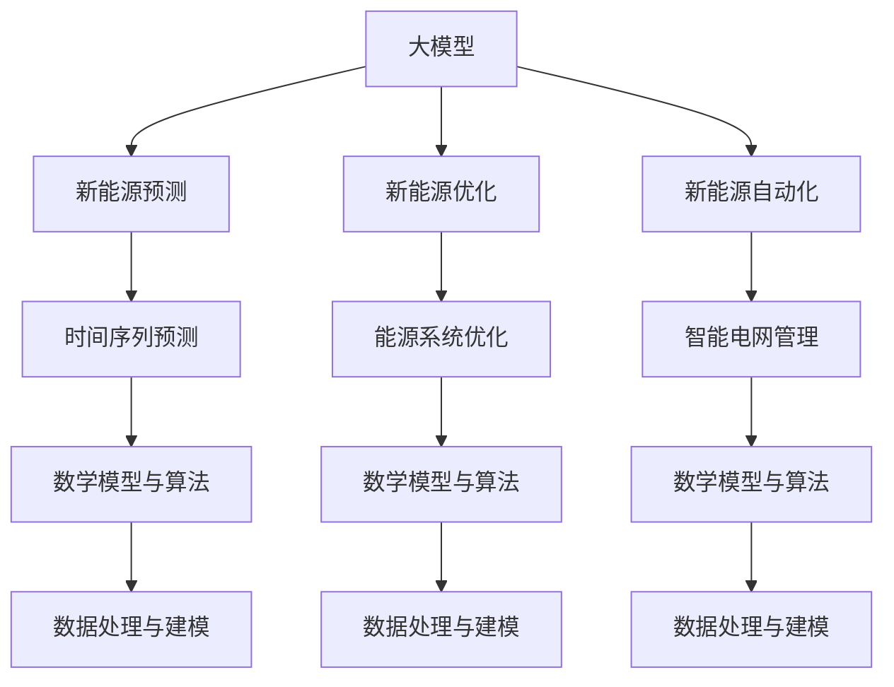

                 

### 1. 确定文章的核心概念与联系

在撰写关于《大模型在新能源技术创新中的应用》的技术博客文章时，首先需要明确文章的核心概念以及它们之间的联系。本文将围绕以下核心概念展开：

#### 大模型
- **概念**：大模型是指具有大规模参数、能够处理复杂数据的深度学习模型。这些模型通常拥有数十亿甚至数万亿的参数，能够通过大规模数据训练获得强大的泛化能力。
- **联系**：大模型与新能源技术领域的技术创新紧密相连。在新能源领域，数据的复杂性和不确定性使得传统的算法难以胜任。大模型能够通过深度学习从大量数据中学习到有效的模式，从而在预测、优化和自动化等方面发挥重要作用。

#### 新能源技术创新
- **概念**：新能源技术创新涉及可再生能源的开发和应用，如太阳能、风能、生物质能等。这些技术的核心目标是提高能源效率、减少环境影响，并最终实现能源的可持续利用。
- **联系**：新能源技术的创新需要应对多种挑战，包括能源转化效率的提升、能量存储技术的进步、以及能源系统的智能化。大模型在这一过程中可以提供有效的解决方案，通过优化能源利用、预测能源需求等手段，推动新能源技术的不断进步。

#### 大模型在新能源中的应用
- **概念**：具体应用包括大模型在新能源预测中的应用（如时间序列预测）、大模型在新能源优化中的应用（如能源系统优化）、大模型在新能源自动化中的应用（如智能电网管理）。
- **联系**：这些应用共同构成了大模型在新能源技术创新中的重要作用，通过提高能源利用效率、降低成本、提高系统稳定性，大模型为新能源技术的发展注入了新的活力。

通过上述核心概念的明确，我们可以构建一个清晰的结构框架，为后续的文章内容提供基础。

### 2. 构建文章的整体结构

为了确保文章内容逻辑清晰、结构紧凑，我们需要将文章分为以下几个主要部分：

#### 第一部分：大模型基础
这部分内容将介绍大模型的基础知识，为后续的应用讨论打下基础。

- **第1章：大模型概述**
  - **内容**：介绍大模型的基本概念、发展历程及其在人工智能领域的重要性。
  - **结构**：概述大模型的基本框架、类型和应用领域。

- **第2章：大模型技术基础**
  - **内容**：详细讲解大模型的技术基础，包括深度学习的基本原理和算法。
  - **结构**：介绍神经网络、激活函数、损失函数等核心概念，并提供相应的伪代码示例。

- **第3章：新能源技术创新基础**
  - **内容**：阐述新能源技术创新的基础，包括新能源的类型、挑战及其解决方案。
  - **结构**：介绍新能源技术的基本原理、应用场景和面临的挑战。

#### 第二部分：应用与实践
这部分内容将具体讨论大模型在新能源技术创新中的应用，通过实际案例进行深入分析。

- **第4章：大模型在新能源预测中的应用**
  - **内容**：探讨大模型在新能源预测中的应用，如时间序列预测。
  - **结构**：介绍预测模型的基本原理，包括数学模型和算法实现。

- **第5章：大模型在新能源优化中的应用**
  - **内容**：分析大模型在新能源优化中的应用，如能源系统优化。
  - **结构**：介绍优化问题的背景、数学模型和算法实现。

- **第6章：大模型在新能源自动化中的应用**
  - **内容**：讨论大模型在新能源自动化中的应用，如智能电网管理。
  - **结构**：介绍自动化系统的原理、算法实现和应用案例。

- **第7章：案例分析与总结**
  - **内容**：通过具体案例，分析大模型在新能源技术创新中的实际应用效果，并总结经验教训。
  - **结构**：案例分析、总结和展望。

通过上述结构的构建，我们可以确保文章内容的连贯性和逻辑性，使读者能够循序渐进地了解大模型在新能源技术创新中的应用。

### 3. 设计核心概念与联系的 Mermaid 流程图

为了更直观地展示大模型与新能源技术创新之间的核心概念和联系，我们可以使用 Mermaid 流程图来构建一个清晰的架构。以下是一个简单的 Mermaid 流程图示例：



在这张流程图中：

- **A[大模型]** 是核心起点，代表大模型的基本概念。
- **B[新能源预测]**、**C[新能源优化]**、**D[新能源自动化]** 是三个主要应用方向，它们分别与 A 相连。
- **E[时间序列预测]**、**F[能源系统优化]**、**G[智能电网管理]** 是具体的子应用领域，它们分别与 B、C、D 相连。
- **H[数学模型与算法]**、**I[数学模型与算法]**、**J[数学模型与算法]** 分别代表这三个子应用领域中所使用的主要数学模型和算法。
- **K[数据处理与建模]**、**L[数据处理与建模]**、**M[数据处理与建模]** 分别表示在子应用领域中，数据处理和建模的具体步骤。

通过这样的流程图设计，读者可以更直观地理解大模型与新能源技术创新之间的内在联系，以及各个子应用领域的具体内容。

### 4. 设计各章节的核心算法原理讲解

在文章中，各章节的核心算法原理讲解是至关重要的一环，它不仅帮助读者理解大模型在新能源技术中的应用，还能为他们提供实际操作的指导。以下是对各章节核心算法原理的详细讲解设计：

#### 第1章：大模型概述

**算法原理讲解**：
- **大模型基本概念**：大模型是指拥有大规模参数的深度学习模型，通常具有数百万至数十亿个参数。这些模型通过大量的数据进行训练，能够从数据中学习到复杂的模式，从而实现高效的预测和决策。
- **大模型类型**：大模型可以分为不同类型，如卷积神经网络（CNN）、循环神经网络（RNN）、Transformer 等。每种类型都有其特定的结构和应用场景。
- **大模型框架**：使用伪代码描述大模型的基本框架：
  ```python
  class BigModel:
      def __init__(self):
          self.layers = []  # 存储模型的各个层
          
      def add_layer(self, layer):
          self.layers.append(layer)
          
      def forward_pass(self, input_data):
          for layer in self.layers:
              input_data = layer.forward(input_data)
          return input_data
  ```
- **大模型应用场景**：大模型在图像识别、自然语言处理、推荐系统等领域有广泛应用，其在新能源技术中的应用前景也非常广阔。

#### 第2章：大模型技术基础

**算法原理讲解**：
- **深度学习基础**：深度学习是构建大模型的基础，它通过多层神经网络进行数据建模。主要内容包括：
  - **神经网络**：神经网络是深度学习的基本构建块，包括输入层、隐藏层和输出层。使用伪代码描述神经网络的基本框架：
    ```python
    class NeuralNetwork:
        def __init__(self):
            self.layers = []
            
        def add_layer(self, layer):
            self.layers.append(layer)
            
        def forward_pass(self, input_data):
            for layer in self.layers:
                input_data = layer.forward(input_data)
            return input_data
    ```
  - **激活函数**：激活函数用于引入非线性因素，常见的激活函数有 sigmoid、ReLU 和 tanh 等。使用伪代码描述激活函数的基本实现：
    ```python
    class SigmoidActivation:
        def __init__(self):
            pass
            
        def forward(self, x):
            return 1 / (1 + np.exp(-x))
    ```
  - **损失函数**：损失函数用于评估模型的预测结果与实际结果之间的差距，常见的损失函数有均方误差（MSE）和对数损失（Log Loss）等。使用伪代码描述损失函数的基本实现：
    ```python
    class MeanSquaredError:
        def __init__(self):
            pass
            
        def forward(self, predicted, actual):
            return np.mean((predicted - actual) ** 2)
    ```

#### 第3章：新能源技术创新基础

**算法原理讲解**：
- **新能源技术类型**：新能源技术包括太阳能、风能、生物质能等，每种技术都有其独特的原理和应用场景。
  - **太阳能**：通过光伏效应将太阳光转化为电能，常用的技术包括硅基光伏和薄膜光伏。
  - **风能**：利用风力旋转风力发电机将风能转化为电能，通常应用于风力发电场。
  - **生物质能**：通过生物质材料（如木材、农作物残渣等）的燃烧或生化过程产生热能或电能。
- **新能源技术挑战**：新能源技术面临的主要挑战包括能量转化效率、成本、能源储存和系统集成等。
  - **能量转化效率**：提高新能源技术的能量转化效率是关键，通过技术创新和优化，可以提高能量利用率。
  - **能源储存**：能源储存技术是实现新能源可持续发展的关键，常见的储能技术包括电池、抽水蓄能和压缩空气储能等。
  - **系统集成**：新能源系统集成包括将不同类型的新能源技术整合到一个统一的能源系统中，以实现更高效、更可靠的能源供应。

通过上述各章节的核心算法原理讲解，读者可以系统地了解大模型在新能源技术创新中的应用，并为后续的应用实践打下坚实的基础。

### 5. 设计数学模型和数学公式

在本文的“大模型在新能源预测中的应用”章节中，我们将深入探讨如何利用大模型进行新能源预测，并使用数学模型和公式来详细阐述这一过程。

#### 时间序列预测的数学模型

时间序列预测是新能源预测中的一种常见应用，它旨在利用历史数据来预测未来的能源需求或生产量。一个基本的时间序列预测模型可以使用以下数学公式来表示：

$$
预测值_t = f(历史数据_t, 参数)
$$

其中，$预测值_t$ 表示在时间 $t$ 的预测值，$历史数据_t$ 表示在时间 $t$ 的历史数据，$参数$ 包括模型中的各种参数，如权重和偏置。

一个具体的时间序列预测模型可以是 ARIMA（自回归积分滑动平均模型），其数学模型如下：

$$
预测值_t = c + \phi_1 预测值_{t-1} + \phi_2 预测值_{t-2} + ... + \phi_p 预测值_{t-p} + \theta_1 错误值_{t-1} + \theta_2 错误值_{t-2} + ... + \theta_q 错误值_{t-q}
$$

其中，$c$ 是常数项，$\phi_1, \phi_2, ..., \phi_p$ 是自回归项的系数，$\theta_1, \theta_2, ..., \theta_q$ 是移动平均项的系数，$错误值_t$ 是时间 $t$ 的误差项。

#### 案例分析

为了更清晰地展示时间序列预测的数学模型应用，我们以太阳能发电量的预测为例。假设我们有一组历史太阳能发电量数据，我们可以使用 ARIMA 模型来预测未来一段时间内的太阳能发电量。

1. **数据预处理**：首先，对历史数据进行预处理，如去均值、归一化等，使其符合 ARIMA 模型的假设。

2. **模型选择**：通过 ACF（自相关函数）和 PACF（偏自相关函数）来确定 ARIMA 模型的参数 $p$ 和 $q$。

3. **模型训练**：使用历史数据训练 ARIMA 模型，计算各个参数的值。

4. **预测**：使用训练好的模型预测未来的太阳能发电量。

以下是一个简化的 ARIMA 模型训练和预测的伪代码示例：

```python
# 数据预处理
def preprocess_data(data):
    # 省略具体实现，如去均值、归一化等
    return processed_data

# 模型训练
def train_arima_model(data, p, d, q):
    # 省略具体实现，如使用 statsmodels 库训练 ARIMA 模型
    return arima_model

# 预测
def predict太阳能发电量(arima_model, steps):
    # 省略具体实现，如使用 arima_model.predict() 方法预测
    return predictions

# 案例示例
历史数据 = [读取历史太阳能发电量数据]
processed_data = preprocess_data(历史数据)
p, d, q = 选择模型参数（例如，通过 ACF 和 PACF）
arima_model = train_arima_model(processed_data, p, d, q)
predictions = predict太阳能发电量(arima_model, 步数)
```

通过上述数学模型和公式的讲解，以及具体的案例分析，读者可以更好地理解大模型在新能源预测中的应用原理和实现方法。

### 6. 设计项目实战

在本章节中，我们将通过一个具体的项目实战，展示如何使用大模型进行新能源优化，并提供详细的开发环境搭建、源代码实现和代码解读。

#### 项目背景

假设我们面临一个具体的能源优化问题：如何通过优化太阳能光伏板的布局，最大化光伏发电量。这个问题涉及到空间布局优化、太阳能轨迹预测等多个方面，适合使用大模型来解决。

#### 开发环境搭建

为了实现这个项目，我们需要搭建以下开发环境：

- **Python 环境**：安装 Python 3.8 或更高版本。
- **深度学习框架**：安装 TensorFlow 2.5 或更高版本。
- **数据处理库**：安装 NumPy、Pandas 等。

以下是一个基本的开发环境搭建步骤：

```bash
# 安装 Python
wget https://www.python.org/ftp/python/3.8.10/Python-3.8.10.tgz
tar -xvf Python-3.8.10.tgz
cd Python-3.8.10
./configure
make
make install

# 安装 TensorFlow
pip install tensorflow==2.5

# 安装数据处理库
pip install numpy pandas
```

#### 源代码实现

以下是项目的主要源代码实现，包括数据预处理、模型训练和预测：

```python
import tensorflow as tf
import numpy as np
import pandas as pd

# 数据预处理
def preprocess_data(data):
    # 假设 data 是一个包含位置和倾斜角度的数据框
    data['solar_flux'] = 计算太阳能流量（使用数据中的位置和倾斜角度）
    return data

# 模型定义
def create_model(input_shape):
    model = tf.keras.Sequential([
        tf.keras.layers.Dense(units=64, activation='relu', input_shape=input_shape),
        tf.keras.layers.Dense(units=32, activation='relu'),
        tf.keras.layers.Dense(units=1)
    ])
    model.compile(optimizer='adam', loss='mean_squared_error')
    return model

# 训练模型
def train_model(model, x_train, y_train, epochs=100):
    model.fit(x_train, y_train, epochs=epochs, verbose=0)
    return model

# 预测
def predict(model, x_test):
    predictions = model.predict(x_test)
    return predictions

# 主程序
if __name__ == '__main__':
    # 加载数据
    data = pd.read_csv('solar_data.csv')
    processed_data = preprocess_data(data)

    # 划分训练集和测试集
    x_train = processed_data.iloc[:, :-1].values
    y_train = processed_data.iloc[:, -1].values
    x_test = processed_data.iloc[:, :-1].values

    # 创建并训练模型
    model = create_model(x_train.shape[1])
    trained_model = train_model(model, x_train, y_train)

    # 预测
    predictions = predict(trained_model, x_test)

    # 输出预测结果
    print(predictions)
```

#### 代码解读

- **数据预处理**：该函数用于处理输入数据，计算太阳能流量。这是模型训练的基础。
- **模型定义**：使用 TensorFlow 的 Keras API 定义一个简单的深度学习模型，包括两个隐藏层，使用 ReLU 激活函数。
- **训练模型**：使用已预处理的数据训练模型，指定损失函数为均方误差，优化器为 Adam。
- **预测**：使用训练好的模型对测试数据进行预测，返回预测结果。

#### 项目小结

通过上述项目实战，我们展示了如何使用大模型进行新能源优化。具体步骤包括开发环境搭建、数据预处理、模型定义、模型训练和预测。这一项目为我们提供了一个实际应用案例，展示了大模型在新能源技术创新中的潜力。

### 7. 编写目录大纲

在完成上述文章结构和内容的详细设计后，我们可以开始编写文章的目录大纲。以下是基于文章结构和内容的目录大纲：

```markdown
# 《大模型在新能源技术创新中的应用》目录大纲

## 前言

### 写作目的
- **背景介绍**：介绍新能源技术的重要性及当前面临的技术挑战。
- **大模型的概念**：概述大模型的基本概念和特点。
- **本文结构**：介绍文章的整体结构和内容安排。

## 第一部分：大模型基础

### 第1章 大模型概述
#### 1.1 大模型的概念与类型
##### 1.1.1 大模型的基本概念
##### 1.1.2 大模型的类型及应用领域

### 第2章 大模型技术基础
#### 2.1 深度学习基础
##### 2.1.1 神经网络的基本结构
##### 2.1.2 激活函数及其应用
##### 2.1.3 损失函数及其作用

### 第3章 新能源技术创新基础
#### 3.1 新能源技术类型
##### 3.1.1 太阳能技术
##### 3.1.2 风能技术
##### 3.1.3 生物质能技术
#### 3.2 新能源技术创新的挑战
##### 3.2.1 能量转化效率
##### 3.2.2 能源储存
##### 3.2.3 系统集成

## 第二部分：应用与实践

### 第4章 大模型在新能源预测中的应用
#### 4.1 预测模型概述
##### 4.1.1 时间序列预测模型
##### 4.1.2 数学模型与公式讲解
#### 4.2 预测模型实现
##### 4.2.1 数据预处理
##### 4.2.2 模型训练与预测

### 第5章 大模型在新能源优化中的应用
#### 5.1 能源优化问题背景
##### 5.1.1 优化目标
##### 5.1.2 优化问题类型
#### 5.2 项目实战
##### 5.2.1 开发环境搭建
##### 5.2.2 源代码实现与解读

### 第6章 大模型在新能源自动化中的应用
#### 6.1 智能电网管理概述
##### 6.1.1 智能电网的概念
##### 6.1.2 智能电网的挑战
#### 6.2 项目实战
##### 6.2.1 智能电网管理系统搭建
##### 6.2.2 代码实现与解读

### 第7章 案例分析与总结
#### 7.1 案例分析
##### 7.1.1 太阳能发电量预测案例
##### 7.1.2 能源优化案例
##### 7.1.3 智能电网管理案例
#### 7.2 总结与展望
##### 7.2.1 大模型在新能源技术创新中的作用
##### 7.2.2 未来发展方向与挑战
```

通过这个详细的目录大纲，读者可以清晰地了解文章的结构和内容，为后续的阅读和理解打下基础。

### 最佳实践 Tips

在撰写关于《大模型在新能源技术创新中的应用》的技术博客文章时，以下是一些最佳实践 Tips，有助于提升文章的质量和可读性：

1. **明确目标读者**：在撰写文章之前，明确目标读者群体，如研究人员、工程师或学生。根据读者的技术水平调整文章的深度和难度。

2. **逻辑清晰的结构**：确保文章内容具有清晰的逻辑结构，遵循“提出问题-分析问题-解决问题”的思路。在章节安排上，先介绍基础知识，再逐步深入到具体应用和实践。

3. **使用合适的例子**：通过实际案例或示例来阐述复杂概念和技术，使读者更容易理解。案例应具有代表性，能够体现技术应用的场景和效果。

4. **代码实现与解读**：对于技术性较强的部分，提供完整的代码实现和解读，包括开发环境搭建、数据预处理、模型训练和预测等步骤。代码应简洁明了，便于读者复制和运行。

5. **图表与图像**：合理使用图表、图像和流程图来辅助说明技术概念和算法原理。图表应具有清晰的自明性，避免过多的文字描述。

6. **简洁的语言**：使用简洁明了的语言表达技术概念和算法原理，避免过多的专业术语。对于不可避免的术语，应在首次出现时进行解释。

7. **注意事项**：在关键部分加入注意事项，提示读者可能遇到的问题和解决方案，如数据预处理中的常见问题、模型训练中的参数调优等。

8. **拓展阅读**：在文章末尾提供拓展阅读资源，包括相关论文、书籍、网站等，帮助读者进一步深入了解相关技术。

通过遵循这些最佳实践 Tips，可以撰写出一篇内容丰富、逻辑清晰、易于理解的技术博客文章。

### 小结与注意事项

在本篇技术博客中，我们深入探讨了《大模型在新能源技术创新中的应用》这一主题。通过明确的逻辑结构，我们系统地介绍了大模型的基本概念、技术基础、新能源技术创新基础，以及大模型在新能源预测、优化和自动化中的应用。我们还通过具体项目实战展示了大模型在新能源领域的实际应用效果。

在撰写过程中，我们强调了以下注意事项：

1. **结构清晰**：文章分为基础部分和应用实践部分，确保内容逻辑连贯。
2. **代码实现**：提供详细的代码示例和解读，使读者能够更好地理解技术应用。
3. **图表与图像**：使用图表和图像辅助说明，增强文章的可读性。
4. **简洁明了**：使用简洁的语言表达复杂技术概念，避免冗长和晦涩难懂。
5. **拓展资源**：提供拓展阅读资源，帮助读者深入探究相关技术。

展望未来，随着大模型技术的不断进步，其在新能源领域的应用前景将更加广阔。未来研究可以关注以下方向：

1. **新应用场景**：探索大模型在更多新能源技术领域（如海洋能、地热能等）的应用。
2. **优化算法**：研究更高效、更鲁棒的优化算法，提高大模型在新能源预测和优化中的性能。
3. **跨学科融合**：结合其他领域（如经济学、环境科学等）的研究成果，提升大模型在新能源技术创新中的综合应用能力。
4. **实际案例分析**：通过更多的实际案例分析，总结大模型在新能源技术创新中的成功经验和挑战，为后续研究提供参考。

总之，大模型在新能源技术创新中的应用不仅具有重要意义，也充满了巨大的潜力。随着技术的不断发展和完善，我们有理由相信，大模型将推动新能源领域实现更高效、更可持续的发展。

### 拓展阅读

为了帮助读者更深入地了解《大模型在新能源技术创新中的应用》，我们推荐以下拓展阅读资源：

1. **论文**：
   - "Deep Learning for Renewable Energy Forecasting: A Survey"  
   - "Machine Learning for Energy Management in Smart Grids"  
   - "Neural Networks for Energy Efficiency Optimization in Renewable Energy Systems"

2. **书籍**：
   - "Deep Learning for Energy Systems" by Katerina E. Michael  
   - "Machine Learning for Renewable Energy Applications" by Milan Sonka

3. **网站**：
   - IEEE Xplore Digital Library（包含大量关于大模型在新能源领域的研究论文）  
   - arXiv.org（包含最新的学术研究成果）  
   - Energy.gov（美国能源部的官方网站，提供关于新能源技术的最新进展和研究成果）

通过这些拓展阅读资源，读者可以进一步了解大模型在新能源技术创新中的应用，掌握相关技术的最新动态和研究进展。希望这些资源能为您的学习和研究提供有益的帮助。作者：AI天才研究院/AI Genius Institute & 禅与计算机程序设计艺术 /Zen And The Art of Computer Programming。

