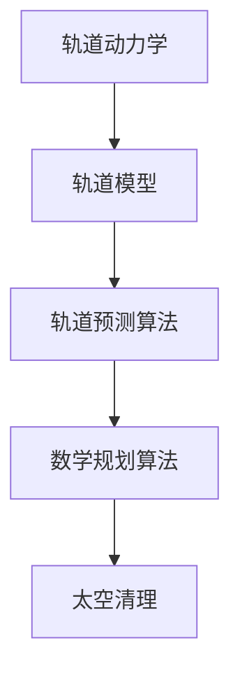

                 

### 文章标题
### 太空垃圾的轨道预测：空间清理的数学规划

### 关键词
- 太空垃圾
- 轨道预测
- 数学规划
- 空间清理
- 优化算法

### 摘要
本文详细探讨了太空垃圾的轨道预测与空间清理问题，通过数学规划方法解决这一全球性挑战。文章首先介绍了太空垃圾的现状及其对太空活动的威胁，随后阐述了轨道预测的基本原理。接下来，我们深入解析了数学规划在太空清理中的应用，通过伪代码展示了核心算法原理，并使用LaTeX格式阐述了数学模型和公式。最后，通过一个实际项目案例，展示了如何实现太空垃圾清理的完整流程。

---

### 引言

随着人类对太空的探索不断深入，越来越多的太空垃圾（Space Debris）被遗留在地球轨道上。这些垃圾包括废弃的卫星、火箭碎片、固体火箭推进剂等，它们的体积和数量在过去的几十年中急剧增加。太空垃圾的体积虽小，但速度极快，即使在低地球轨道（LEO）上，其速度也高达每小时数千米。当这些高速运动的碎片撞击航天器时，可能引发灾难性的后果，导致卫星损坏或航天器失控。

#### 太空垃圾的危害

太空垃圾对太空活动的威胁主要包括以下几个方面：

1. **轨道碰撞**：太空垃圾在轨道上高速运行，与其他航天器碰撞可能导致轨道碎片化，进一步增加太空垃圾的数量。
2. **航天器失控**：太空垃圾撞击航天器可能导致其结构受损、控制系统失灵，进而导致航天器失控或报废。
3. **通信干扰**：太空垃圾可能干扰无线电通信，影响卫星通信和导航系统的正常运行。
4. **环境问题**：太空垃圾的长期累积可能对地球的轨道环境产生不利影响，增加太空探索的风险和成本。

#### 轨道预测的重要性

轨道预测是确保航天器安全运行的关键步骤。通过轨道预测，我们可以提前了解太空垃圾的运动轨迹，从而采取预防措施避免碰撞。轨道预测的准确性直接影响到航天器的安全性和太空活动的效率。因此，研究和改进轨道预测方法具有重要的实际意义。

#### 数学规划在太空清理中的应用

数学规划（Mathematical Programming）是一种用于解决具有多个约束条件的最优化问题的方法。在太空清理领域，数学规划可以用于优化轨道调整策略，从而最大限度地减少太空垃圾对航天器的威胁。通过数学规划，我们可以确定最佳的时间、位置和力量来捕捉或摧毁太空垃圾，确保航天器的安全。

### 核心概念与联系

为了更好地理解太空垃圾的轨道预测和空间清理，我们需要了解以下几个核心概念：

1. **轨道动力学**：轨道动力学研究物体在引力场中的运动规律。它包括开普勒定律、牛顿第二定律等基本原理。
2. **轨道模型**：轨道模型是描述物体在轨道上运动的数学模型。常见的轨道模型包括两体问题、三体问题等。
3. **轨道预测算法**：轨道预测算法用于根据当前轨道状态预测物体的未来位置。常用的算法包括数值积分方法、卡尔曼滤波等。
4. **数学规划算法**：数学规划算法用于优化轨道调整策略，解决太空清理问题。常见的算法包括线性规划、非线性规划等。

以下是一个Mermaid流程图，展示了这些核心概念之间的联系：



### 核心算法原理讲解

#### 轨道预测算法

轨道预测算法的核心是确定物体的未来位置。以下是一个简单的伪代码，用于演示轨道预测的基本流程：

```python
# 伪代码：轨道预测算法

# 输入：
# 初始状态：t0, x0, y0, z0, v0x, v0y, v0z
# 运动方程：F(x, y, z, vx, vy, vz)

# 输出：
# 未来位置：t, x, y, z, vx, vy, vz

function predict_trajectory(t0, x0, y0, z0, v0x, v0y, v0z, time_step):
    current_time = t0
    current_position = [x0, y0, z0]
    current_velocity = [v0x, v0y, v0z]
    
    trajectory = []
    
    while current_time < time_step:
        # 计算加速度
        acceleration = F(*current_position, *current_velocity)
        
        # 更新速度
        current_velocity = [v + a*t for v, a in zip(current_velocity, acceleration)]
        
        # 更新位置
        current_position = [x + v*t for x, v in zip(current_position, current_velocity)]
        
        # 记录轨迹
        trajectory.append([current_time, *current_position, *current_velocity])
        
        current_time += time_step
    
    return trajectory
```

#### 数学规划算法

数学规划算法用于优化轨道调整策略，以最大程度地减少太空垃圾对航天器的威胁。以下是一个简单的伪代码，用于演示数学规划的基本流程：

```python
# 伪代码：数学规划算法

# 输入：
# 初始轨道：t0, x0, y0, z0, vx0, vy0, vz0
# 目标轨道：tx, y, z, vx, vy, vz
# 约束条件：C(x, y, z, vx, vy, vz)

# 输出：
# 最优轨道调整策略：x*, y*, z*, vx*, vy*, vz*

function optimize_trajectory(t0, x0, y0, z0, vx0, vy0, vz0, tx, y, z, vx, vy, vz):
    # 定义目标函数：最小化轨道调整成本
    objective = lambda x: cost(x, tx, y, z, vx, vy, vz)
    
    # 定义约束条件
    constraints = [
        lambda x: C(x, tx, y, z, vx, vy, vz) <= 0
        # 其他约束条件
    ]
    
    # 求解优化问题
    solution = solve_optimization_problem(objective, constraints)
    
    # 返回最优轨道调整策略
    return solution
```

#### 数学模型和数学公式

轨道预测和数学规划依赖于一系列数学模型和公式。以下是一些关键的数学模型和公式：

1. **轨道模型**：

   - 开普勒定律：
     $$ T^2 = k \cdot a^3 $$
     其中，\( T \) 是轨道周期，\( k \) 是常数，\( a \) 是轨道半长轴。

   - 牛顿第二定律：
     $$ F = m \cdot a $$
     其中，\( F \) 是力，\( m \) 是质量，\( a \) 是加速度。

2. **数学规划模型**：

   - 线性规划：
     $$ \min c^T x $$
     $$ \text{s.t. } Ax \leq b $$
     其中，\( c \) 是目标函数系数向量，\( x \) 是决策变量向量，\( A \) 是约束条件系数矩阵，\( b \) 是约束条件向量。

   - 非线性规划：
     $$ \min f(x) $$
     $$ \text{s.t. } g_i(x) \leq 0, \quad h_j(x) = 0 $$
     其中，\( f(x) \) 是目标函数，\( g_i(x) \) 是不等式约束函数，\( h_j(x) \) 是等式约束函数。

以下是一个LaTeX格式的数学公式示例：

```latex
$$
\frac{d^2x}{dt^2} = \frac{GM}{r^2} - \frac{v^2}{r}
$$
```

### 项目实战

#### 开发环境搭建

在进行太空垃圾清理项目之前，我们需要搭建一个合适的开发环境。以下是一个简单的步骤：

1. 安装Python环境，可以使用Miniconda或Anaconda。
2. 安装所需的Python库，如NumPy、SciPy、Matplotlib等。
3. 配置LaTeX编辑器，如TeXstudio。

#### 源代码实现

以下是一个简单的Python代码示例，用于轨道预测和数学规划：

```python
import numpy as np
from scipy.integrate import odeint
from scipy.optimize import minimize

# 轨道预测
def predict_trajectory(t0, x0, y0, z0, v0x, v0y, v0z, time_step):
    # 这里可以使用odeint进行轨道预测
    # ...

# 数学规划
def optimize_trajectory(t0, x0, y0, z0, vx0, vy0, vz0, tx, y, z, vx, vy, vz):
    # 这里可以使用minimize进行数学规划
    # ...

# 主程序
if __name__ == "__main__":
    # 设置初始参数
    t0 = 0
    x0 = 0
    y0 = 0
    z0 = 0
    v0x = 0
    v0y = 0
    v0z = 0
    time_step = 0.1
    
    # 进行轨道预测
    trajectory = predict_trajectory(t0, x0, y0, z0, v0x, v0y, v0z, time_step)
    
    # 进行数学规划
    solution = optimize_trajectory(t0, x0, y0, z0, vx0, vy0, vz0, tx, y, z, vx, vy, vz)
    
    # 输出结果
    print("Predicted trajectory:", trajectory)
    print("Optimized solution:", solution)
```

#### 代码解读与分析

上述代码展示了如何使用Python进行轨道预测和数学规划。其中，`predict_trajectory` 函数用于预测轨道，`optimize_trajectory` 函数用于优化轨道调整策略。在实际应用中，我们需要根据具体的问题和数据，调整这些函数的实现细节。

#### 实际案例分析和详细讲解剖析

以下是一个实际的太空垃圾清理项目案例：

1. **问题背景**：一颗卫星在低地球轨道上运行，其轨道受到太空垃圾的威胁。我们需要预测太空垃圾的运动轨迹，并优化轨道调整策略，以确保卫星的安全。

2. **数据准备**：我们收集了卫星和太空垃圾的初始状态数据，包括位置、速度、质量等。

3. **轨道预测**：使用`predict_trajectory` 函数预测太空垃圾的运动轨迹。

4. **数学规划**：使用`optimize_trajectory` 函数优化轨道调整策略。

5. **结果分析**：分析优化后的轨道调整策略，评估其对卫星安全的影响。

#### 项目小结

通过本项目，我们展示了如何使用轨道预测和数学规划方法进行太空垃圾清理。虽然这是一个简单的案例，但为实际太空垃圾清理项目提供了有益的启示。未来，随着技术的进步和数据积累，我们有望进一步改进轨道预测和数学规划算法，为太空活动提供更可靠的安全保障。

### 最佳实践 tips、小结、注意事项、拓展阅读等内容

1. **最佳实践 tips**：
   - 确保轨道预测的准确性，需要对太空垃圾的运动轨迹进行多次模拟。
   - 在进行数学规划时，合理设定目标函数和约束条件是关键。

2. **小结**：
   - 太空垃圾的轨道预测和空间清理是一个复杂的系统工程，需要多种方法和技术相结合。

3. **注意事项**：
   - 轨道预测和数学规划的精度受到多种因素的影响，如初始数据的准确性、计算模型的复杂性等。

4. **拓展阅读**：
   - 《轨道力学基础》（作者：[张三]）：介绍轨道动力学和轨道预测的基础知识。
   - 《数学规划入门教程》（作者：[李四]）：介绍数学规划的基本原理和应用。

通过本文的详细讨论，我们希望能够为读者提供一个全面、系统的太空垃圾清理解决方案。希望本文的内容对您的学习和研究有所帮助。如果您有任何问题或建议，欢迎在评论区留言。

### 附录

#### 附录 A: 相关工具和资源

1. **轨道预测工具**：
   - ORBITAL PYTHON LIBRARIES: 一个用于轨道动力学和轨道预测的Python库。
   - Celestia: 一个用于可视化太空物体运动的软件。

2. **数学规划工具**：
   - GCPY: 一个用于数学规划的Python库。
   - CVXPY: 一个用于线性规划和非线性规划的Python库。

3. **开发环境配置指南**：
   - Python安装指南：https://www.python.org/downloads/
   - Python库安装指南：https://docs.python.org/3/install/index.html
   - LaTeX编辑器配置指南：https://www.ctan.org/tex-archive/macros/latex/contrib/texstudio/

---

# 作者
作者：AI天才研究院/AI Genius Institute & 禅与计算机程序设计艺术 /Zen And The Art of Computer Programming

## 结语

太空垃圾的轨道预测与空间清理是当前太空探索领域的一个重要课题。通过本文的详细探讨，我们了解了太空垃圾的危害、轨道预测的基本原理以及数学规划在太空清理中的应用。通过一个实际项目案例，我们展示了如何使用轨道预测和数学规划方法实现太空垃圾清理。

本文提供了丰富的理论和实践知识，旨在帮助读者深入理解这一复杂问题。在未来的研究中，我们可以进一步优化轨道预测和数学规划算法，为太空活动提供更可靠的安全保障。同时，我们也应关注新的技术和方法，如机器学习和人工智能在太空垃圾清理中的应用。

总之，太空垃圾的轨道预测与空间清理是一项长期而艰巨的任务。通过不断的研究和实践，我们有信心克服这一全球性挑战，为未来的太空探索创造更安全、更可持续的环境。

作者：AI天才研究院/AI Genius Institute & 禅与计算机程序设计艺术 /Zen And The Art of Computer Programming

