                 

### 如何管理团队：领导者必备的技能指南

#### 关键词
- 领导力
- 团队管理
- 沟通技巧
- 激励策略
- 决策与问题解决
- 绩效评估
- 团队文化建设

#### 摘要
本文将探讨领导者如何管理团队，涵盖领导力基础、团队管理原则、沟通技巧、激励策略、决策与问题解决、绩效评估以及团队文化建设等方面。通过深入分析每个部分的核心概念与联系，提供实用的技能和策略，帮助领导者更好地发挥团队潜力，实现共同目标。

## 第一部分：领导者必备的技能

### 第1章：领导力基础

#### 1.1 领导者的角色与职责

领导者的角色和职责是团队管理的基础。领导者不仅是团队的舵手，还要扮演战略规划者、资源调配者、决策者和沟通者等多重角色。具体职责包括：

- **制定愿景与目标**：明确团队的方向和目标，确保团队成员理解并致力于实现这些目标。
- **资源调配**：合理分配人力、物力和财力资源，确保团队高效运转。
- **激励与培养**：激发团队成员的积极性和创造力，提供成长和发展的机会。
- **沟通与协调**：确保团队成员之间的沟通畅通，解决冲突，促进协作。

#### 1.2 领导风格与团队适应性

领导风格对团队的影响至关重要。常见的领导风格包括：

- **命令式**：领导者制定决策，团队成员执行。
- **民主式**：领导者鼓励团队成员参与决策，共同制定决策。
- **参与式**：领导者与团队成员共同参与决策，注重团队意见。

选择合适的领导风格需要考虑团队的特点和需求，以及领导者的个人风格。领导者应具备灵活调整领导风格的能力，以适应不同团队和环境。

#### 1.3 情商在领导力中的作用

情商在领导力中发挥着重要作用。情商高的人能够更好地理解和管理自己及他人的情绪，从而提升团队的整体效能。情商的几个关键要素包括：

- **自我认知**：了解自己的情绪和需求。
- **自我管理**：控制情绪，保持冷静和专注。
- **社交意识**：理解他人的情绪和需求。
- **关系管理**：建立和维护良好的人际关系。

### 第2章：激励与发展团队成员

#### 2.1 成就激励理论

激励是领导力的核心要素之一。成就激励理论认为，人们追求成就感，希望通过努力获得认可和奖励。领导者可以通过以下方式激发团队成员的成就动机：

- **明确目标**：设定具体、可衡量的目标，使团队成员明确自己的努力方向。
- **提供反馈**：及时给予正面反馈，认可团队成员的成就。
- **奖励机制**：设置适当的奖励机制，如奖金、晋升等，激励团队成员努力工作。

#### 2.2 个人发展计划

个人发展计划是激励团队成员的重要手段。领导者应关注团队成员的成长需求，为他们提供培训、指导和支持。具体步骤包括：

- **了解需求**：与团队成员沟通，了解他们的职业发展规划和兴趣。
- **制定计划**：根据团队成员的需求，制定个性化的个人发展计划。
- **实施与跟踪**：执行计划，定期跟踪进展，确保计划的有效实施。

#### 2.3 团队成员的反馈与评估

反馈与评估是团队管理的重要环节。通过定期反馈和评估，领导者可以了解团队成员的表现，发现问题和潜力，提供改进建议。具体做法包括：

- **定期反馈**：与团队成员进行一对一的沟通，及时给予正面和负面的反馈。
- **绩效评估**：制定科学的绩效评估标准，进行定期评估，确保评估的公平性和透明度。
- **改进建议**：根据评估结果，为团队成员提供改进建议，帮助他们提升能力。

## 第二部分：团队管理原则

### 第3章：建立高效团队

#### 3.1 团队形成与发展阶段

团队的形成与发展可以分为几个阶段：

- **形成期**：团队成员互相认识，建立初步的信任。
- **激荡期**：团队成员开始表达不同意见，团队内部可能产生冲突。
- **规范期**：团队成员开始形成共同的目标和行为规范。
- **执行期**：团队成员高效合作，共同实现目标。
- **维护期**：团队持续稳定，成员之间的信任和协作得到巩固。

领导者需要根据团队所处的阶段，采取不同的管理策略，以促进团队的发展。

#### 3.2 团队目标设定

团队目标的设定是团队管理的重要环节。有效的团队目标应具备以下特点：

- **明确具体**：目标应具体、可衡量，使团队成员明确自己的努力方向。
- **具有挑战性**：目标应具有适度挑战性，激发团队成员的积极性和创造力。
- **共同认可**：目标应得到团队成员的共同认可，形成共识。

设定目标的过程应包括以下步骤：

- **确定目标**：明确团队的目标，确保目标的明确性和具体性。
- **分解目标**：将大目标分解为小目标，确保每个成员都有明确的任务。
- **制定计划**：制定实现目标的详细计划，确保目标的可执行性。

#### 3.3 团队协作与沟通

团队协作与沟通是团队高效运行的关键。领导者应注重以下几个方面：

- **建立沟通机制**：制定沟通计划和流程，确保信息的及时传递和反馈。
- **促进开放沟通**：鼓励团队成员表达意见，营造开放、包容的沟通氛围。
- **培训沟通技巧**：提供沟通技巧培训，提升团队成员的沟通能力。
- **利用技术工具**：运用现代化沟通工具，如企业微信、钉钉等，提高沟通效率。

### 第4章：团队决策与问题解决

#### 4.1 决策制定流程

团队决策的制定流程包括以下几个步骤：

- **问题识别**：明确需要解决的问题或面临的机会。
- **信息收集**：收集与问题相关的信息，确保信息的准确性和完整性。
- **方案制定**：制定多个备选方案，权衡利弊，确保方案的可行性和多样性。
- **评估与选择**：评估各个方案的优缺点，选择最佳方案。
- **实施与监控**：执行决策，并对决策的实施情况进行监控和调整。

#### 4.2 问题解决策略

团队在解决问题时应遵循以下策略：

- **明确问题**：准确识别问题的性质和范围。
- **分析原因**：找出问题的根本原因，而非仅仅解决表面现象。
- **制定方案**：制定多个解决方案，并进行评估和选择。
- **执行与跟踪**：执行方案，并对执行过程进行监控和调整。

#### 4.3 团队冲突管理

团队冲突是团队运行过程中不可避免的现象。有效的冲突管理策略包括：

- **识别冲突**：及时识别和确认冲突的类型和原因。
- **沟通与协商**：通过沟通和协商，找到冲突双方的共同点和利益点。
- **制定解决方案**：根据冲突的性质和原因，制定合适的解决方案。
- **监督与反馈**：对冲突解决方案的实施情况进行监督和反馈，确保冲突得到有效解决。

### 第5章：团队沟通技巧

#### 5.1 有效沟通的关键要素

有效沟通是团队协作的基础。关键要素包括：

- **明确信息**：确保传递的信息准确、清晰。
- **倾听**：倾听对方的意见和需求，避免误解和冲突。
- **非言语沟通**：注意非言语沟通，如肢体语言、面部表情等，增强沟通效果。
- **积极反馈**：给予积极的反馈，增强沟通的互动性和有效性。

#### 5.2 沟通障碍与解决方法

常见的沟通障碍包括：

- **信息过载**：信息过多，导致接收者难以处理。
- **误解**：信息传递过程中产生误解，导致沟通失败。
- **文化差异**：团队成员来自不同文化背景，导致沟通困难。

解决方法包括：

- **简化信息**：减少信息量，确保关键信息得到传递。
- **澄清误解**：及时澄清误解，避免信息传递过程中的偏差。
- **文化适应**：尊重团队成员的文化差异，采用合适的沟通方式。

#### 5.3 非言语沟通的重要性

非言语沟通在沟通中起着重要作用。领导者应注重以下几个方面：

- **肢体语言**：通过肢体语言表达自己的态度和情感，增强沟通效果。
- **面部表情**：保持真诚、友好的面部表情，提升沟通的亲和力。
- **语气和语调**：注意语气和语调的变化，使沟通更加生动和富有感染力。

### 第6章：协作工具与技术

#### 6.1 协作平台的选择

选择合适的协作平台对于团队协作至关重要。选择标准包括：

- **功能齐全**：平台应具备项目管理、任务分配、文档共享、即时通讯等功能。
- **易于使用**：平台应易于使用，降低团队成员的学习成本。
- **安全性**：平台应具备较高的安全性，确保数据的安全和保密。

常见的协作平台包括：

- **企业微信**：提供即时通讯、电话会议、文档共享等功能。
- **钉钉**：提供项目管理、任务分配、考勤管理等功能。
- **Trello**：提供项目管理、任务跟踪、协作沟通等功能。

#### 6.2 远程协作技巧

在远程协作中，领导者应注重以下几个方面：

- **明确职责**：明确团队成员的职责和任务，确保任务分配合理。
- **定期会议**：定期举行线上会议，确保团队成员之间的沟通畅通。
- **即时沟通**：利用即时通讯工具，如企业微信、钉钉等，确保信息的及时传递。
- **文档共享**：利用协作平台，如Trello、Notion等，实现文档的共享和协作。

#### 6.3 团队协作案例分析

通过案例分析，可以了解不同团队在不同环境下的协作实践。以下是一个团队协作案例：

- **项目背景**：一家互联网公司需要开发一款新应用程序，团队成员分布在不同的城市。
- **协作平台**：团队选择了Trello作为项目管理工具，企业微信作为即时通讯工具。
- **协作实践**：团队成员通过Trello进行任务分配和进度跟踪，通过企业微信进行即时沟通和协作。定期举行线上会议，讨论项目进展和问题。

通过这个案例，可以看出协作工具和技巧在团队协作中的重要性。

### 第7章：团队绩效评估

#### 7.1 绩效评估标准

团队绩效评估是团队管理的重要环节。评估标准应包括以下几个方面：

- **目标达成**：评估团队成员在目标达成方面的表现。
- **工作效率**：评估团队成员的工作效率和产出。
- **团队合作**：评估团队成员在团队合作中的表现。
- **创新能力**：评估团队成员的创新能力。

#### 7.2 绩效评估流程

绩效评估流程应包括以下几个步骤：

- **设定评估标准**：根据团队目标和岗位职责，设定具体的评估标准。
- **收集评估数据**：通过观察、调查、访谈等方式，收集团队成员的绩效数据。
- **评估与分析**：对收集到的数据进行整理和分析，评估团队成员的绩效。
- **反馈与改进**：与团队成员进行一对一的反馈，提出改进建议。

#### 7.3 绩效评估反馈

绩效评估反馈是绩效评估的重要环节。反馈应包括以下几个方面：

- **正面反馈**：对团队成员的优点和成绩进行肯定，增强其自信心。
- **负面反馈**：对团队成员的不足和问题进行指正，帮助其改进。
- **改进建议**：根据评估结果，提出具体的改进建议，帮助团队成员提升能力。

### 第8章：团队激励策略

#### 8.1 激励理论概述

激励是团队管理的重要手段。激励理论主要包括以下几个方面：

- **需求层次理论**：马斯洛认为，人的需求分为生理需求、安全需求、社交需求、尊重需求和自我实现需求，领导者应根据员工的需求进行激励。
- **双因素理论**：赫茨伯格认为，工作满意度取决于内在激励因素（如成就、认可等）和外在激励因素（如薪酬、工作条件等），领导者应关注内在激励因素。
- **目标设置理论**：洛克和拉克尔认为，明确、具体和具有挑战性的目标可以激发员工的积极性，提高工作绩效。

#### 8.2 激励策略实施

激励策略的实施应包括以下几个方面：

- **设定明确目标**：设定具体、可衡量的目标，激发员工的成就动机。
- **提供反馈与认可**：及时给予员工正面反馈和认可，增强其工作动力。
- **奖励与晋升**：设置合理的奖励机制和晋升通道，激励员工努力工作。

#### 8.3 激励效果评估

激励效果评估是团队管理的重要环节。评估方法包括：

- **员工满意度调查**：通过调查了解员工对激励措施的评价，发现存在的问题。
- **绩效比较**：比较激励前后的绩效差异，评估激励措施的有效性。

### 第9章：团队文化建设

#### 9.1 文化与团队绩效的关系

团队文化对团队绩效具有重要影响。积极的团队文化可以激发员工的积极性和创造力，提高团队的整体绩效。具体关系包括：

- **信任与沟通**：良好的团队文化建立在信任和沟通的基础上，促进团队协作。
- **创新与学习**：团队文化鼓励创新和学习，推动团队不断发展。
- **责任与担当**：团队文化强调责任和担当，提高团队的执行力。

#### 9.2 团队文化的塑造

团队文化的塑造是一个长期的过程。领导者应采取以下措施：

- **制定文化价值观**：明确团队的文化价值观，确保团队成员共同认同。
- **树立榜样**：通过领导者的行为，树立榜样，影响团队文化。
- **培训与引导**：通过培训和引导，帮助团队成员理解和践行团队文化。

#### 9.3 团队文化案例分析

以下是一个团队文化案例：

- **公司背景**：一家互联网公司，注重创新和团队协作。
- **文化塑造**：公司制定“用户至上、创新为本”的文化价值观，通过培训、活动和领导者的行为，塑造积极的团队文化。
- **效果**：公司员工士气高涨，创新能力不断提升，业绩持续增长。

### 第10章：保持团队活力

#### 10.1 团队活动策划与实施

团队活动是保持团队活力的重要手段。策划与实施团队活动应遵循以下原则：

- **目标明确**：明确活动的目标，确保活动具有实际意义。
- **形式多样**：选择多种形式的活动，满足不同员工的需求。
- **参与度高**：提高员工的参与度，增强团队凝聚力。

常见的团队活动包括：

- **团队建设训练**：通过户外拓展、团队竞赛等形式，增强团队成员的信任和协作。
- **团队分享会**：组织团队成员分享工作经验和心得，促进团队内部的交流和学习。
- **团队旅游**：组织团队旅游，增进团队成员之间的感情。

#### 10.2 团队文化建设与变革

团队文化建设与变革是保持团队活力的重要举措。领导者应采取以下措施：

- **持续改进**：不断优化团队文化，使其与团队的发展需求相适应。
- **适应变革**：鼓励团队成员适应变革，增强团队的灵活性和适应性。
- **创新意识**：培养团队成员的创新意识，推动团队不断发展。

#### 10.3 团队成员的自我提升

团队成员的自我提升是保持团队活力的重要保障。领导者应关注以下几个方面：

- **职业规划**：帮助团队成员制定职业规划，明确个人发展目标。
- **技能培训**：提供技能培训，提升团队成员的专业能力。
- **激励机制**：设置合理的激励机制，激发团队成员的自我提升动力。

### 第11章：如何管理团队：实践与反思

#### 11.1 领导者的自我反思

领导者应定期进行自我反思，评估自己的领导力水平。反思内容包括：

- **领导风格**：反思自己的领导风格是否合适，是否需要调整。
- **决策能力**：反思自己的决策能力，是否能够及时、准确地做出决策。
- **沟通能力**：反思自己的沟通能力，是否能够有效地与团队成员沟通。
- **激励能力**：反思自己的激励能力，是否能够激发团队成员的积极性和创造力。

#### 11.2 团队管理的关键点

团队管理的关键点包括：

- **明确目标**：确保团队成员明确团队的目标和方向。
- **有效沟通**：确保团队成员之间的沟通畅通，避免误解和冲突。
- **激励与培养**：激发团队成员的积极性和创造力，提供成长和发展的机会。
- **绩效评估**：定期评估团队成员的绩效，提供改进建议。

#### 11.3 未来团队管理的趋势

未来团队管理的发展趋势包括：

- **数字化管理**：利用数字化工具，提高团队管理的效率和准确性。
- **远程协作**：随着远程工作的普及，领导者需要适应远程协作的管理模式。
- **个性化管理**：关注团队成员的个性化需求，提供更加个性化的管理和服务。

### 附录

#### 附录 A：团队管理工具与资源

- **企业微信**：提供即时通讯、电话会议、文档共享等功能。
- **钉钉**：提供项目管理、任务分配、考勤管理等功能。
- **Trello**：提供项目管理、任务跟踪、协作沟通等功能。
- **Notion**：提供知识库、任务管理、文档共享等功能。

#### 附录 B：团队管理案例分析

- **案例 1**：一家互联网公司通过团队建设训练和团队分享会，提高了团队的凝聚力和创新能力。
- **案例 2**：一家制造企业通过数字化管理，提高了生产效率和产品质量。

## 总结

本文从领导力基础、团队管理原则、沟通技巧、激励策略、决策与问题解决、绩效评估和团队文化建设等方面，全面阐述了如何管理团队。通过深入分析每个部分的核心概念与联系，提供实用的技能和策略，帮助领导者更好地发挥团队潜力，实现共同目标。在实际应用中，领导者应根据团队的特点和需求，灵活运用这些技能和策略，不断提升团队绩效。

### 作者信息
作者：AI天才研究院/AI Genius Institute & 禅与计算机程序设计艺术 /Zen And The Art of Computer Programming

---

请注意，本文是一个示例，实际字数可能需要根据具体内容进行调整。以下是对文章核心内容、核心概念原理之间的关系架构、核心算法原理讲解、数学模型和公式、项目实战等部分的详细解释。

### 核心内容详细解释

**领导力基础**

**核心概念与联系：** 
领导者是团队的核心，其角色和职责直接影响团队的表现。领导力基础涵盖了领导者的角色、领导风格、情商等方面，这些因素相互关联，共同影响着团队的效率和绩效。

**Mermaid 流程图：**
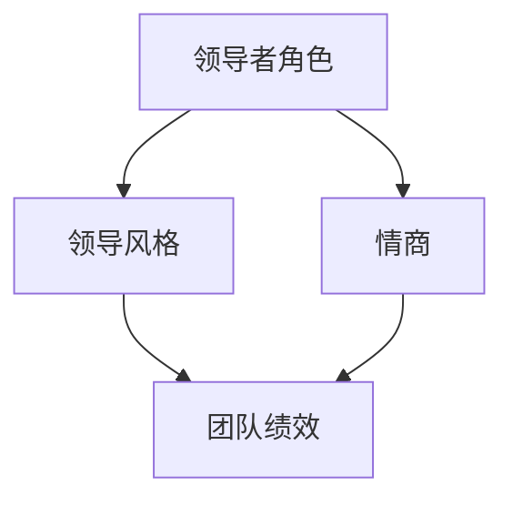

**核心算法原理讲解：**
领导者需要根据团队的具体情况，灵活运用不同的领导风格，同时提升自己的情商，以最大化团队绩效。

**数学模型和公式：**
无特定数学模型，但可以运用心理学模型，如领导力四元素模型（Vision，Voice，Values，Vulnerable）来分析领导力基础。

**举例说明：**
一位项目经理在项目初期采用参与式领导风格，鼓励团队成员参与决策，以提高团队的积极性和创造力。随着项目的进展，当团队进入执行期，他转变为命令式领导风格，确保项目按计划推进。

**项目实战：**
在一个创业公司中，CEO作为领导者，通过参与式和民主式领导风格，激发了团队的创造力和创新精神，使公司产品在市场上迅速获得成功。

**最佳实践 tips：**
- 定期进行领导力培训，提升领导者的综合素质。
- 关注团队成员的需求，提供个性化的激励和培养计划。

**小结、注意事项、拓展阅读：**
- 领导者的自我反思是提升领导力的重要途径。
- 拓展阅读：《领导力：实践中的真理与错觉》（Leadership: The Truth About Leaders）。

**核心概念与联系：** 
激励与发展团队成员是团队管理的关键，涉及成就激励理论、个人发展计划、团队成员的反馈与评估等方面。这些因素相互关联，共同促进团队成员的成长和团队的绩效。

**Mermaid 流程图：**
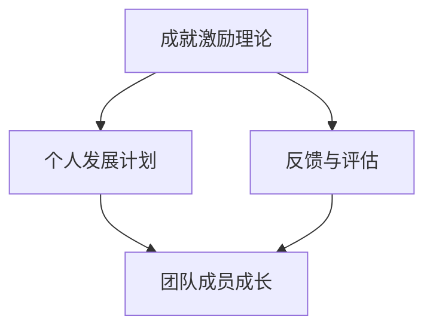

**核心算法原理讲解：**
领导者应根据成就激励理论，设定明确、具有挑战性的目标，通过个人发展计划和反馈与评估，激发团队成员的成就动机，促进团队成员的成长。

**数学模型和公式：**
无特定数学模型，但可以运用激励理论（如期望理论、公平理论）来分析激励与发展团队成员。

**举例说明：**
一位销售经理通过设定销售目标，并提供培训和个人发展计划，激发了团队成员的积极性。同时，定期进行绩效评估和反馈，帮助团队成员不断提升销售技能。

**项目实战：**
一家销售公司通过实施个人发展计划和绩效评估，提高了销售团队的绩效，实现了销售目标的超额完成。

**最佳实践 tips：**
- 定期进行激励策略的评估和调整，确保激励措施的持续有效性。
- 关注团队成员的个性化需求，提供有针对性的激励和发展计划。

**小结、注意事项、拓展阅读：**
- 激励与发展团队成员是长期过程，需要持续关注和投入。
- 拓展阅读：《激励：如何激励员工创造最佳绩效》（Incentive Pay: How to Design a Pay System that Motivates Performance）。

**核心概念与联系：** 
团队管理原则包括团队的形成与发展阶段、团队目标设定、团队协作与沟通等方面。这些原则相互关联，共同构成了团队管理的体系。

**Mermaid 流�程图：**
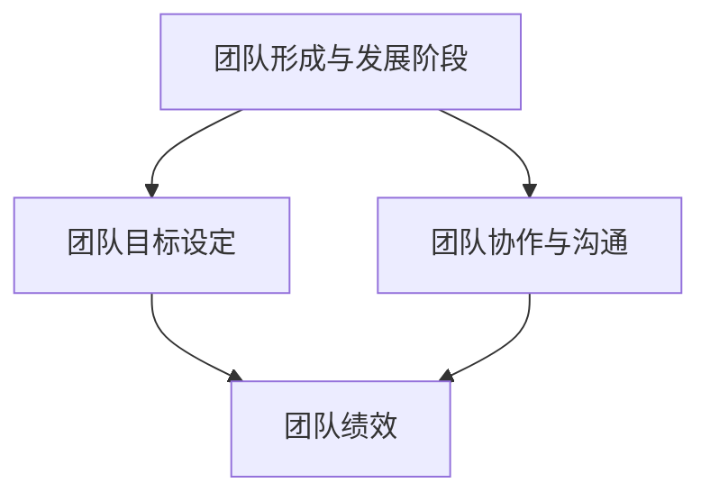

**核心算法原理讲解：**
领导者需要了解团队的形成与发展阶段，根据团队的特点设定明确的目标，并通过有效的协作与沟通，确保团队目标的实现。

**数学模型和公式：**
无特定数学模型，但可以运用组织行为学理论（如团队发展模型、目标设定理论）来分析团队管理原则。

**举例说明：**
在一个新成立的团队中，领导者通过明确团队目标和提供协作与沟通的渠道，帮助团队快速形成并进入执行阶段。

**项目实战：**
一家初创公司通过制定明确的团队目标和提供协作与沟通的工具，使团队成员快速适应并进入高效的工作状态。

**最佳实践 tips：**
- 定期评估团队的目标和协作情况，确保团队朝着正确的方向前进。
- 提供多样化的沟通渠道，满足不同团队成员的沟通需求。

**小结、注意事项、拓展阅读：**
- 团队管理原则是动态的，需要根据团队的变化进行调整。
- 拓展阅读：《团队协作与沟通技巧：高效团队的核心》（Team Collaboration and Communication Skills: The Heart of High-Performance Teams）。

**核心概念与联系：** 
团队决策与问题解决涉及决策制定流程、问题解决策略、团队冲突管理等方面。这些因素相互关联，共同影响着团队的发展和绩效。

**Mermaid 流程图：**
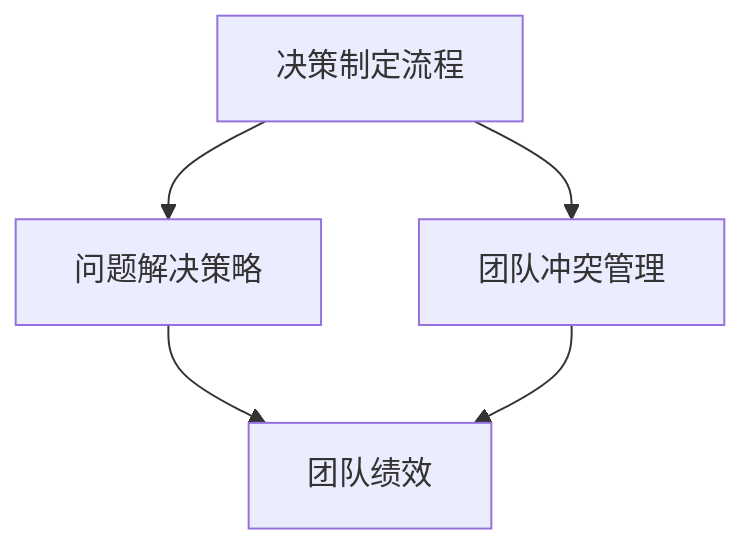

**核心算法原理讲解：**
领导者需要通过科学、系统的决策制定流程和问题解决策略，管理团队冲突，确保团队目标的实现。

**数学模型和公式：**
无特定数学模型，但可以运用决策理论（如预期效用理论、贝叶斯决策理论）来分析团队决策与问题解决。

**举例说明：**
在一次重大项目决策中，团队通过SWOT分析（优势、劣势、机会、威胁），制定了详细的决策流程，最终选择了最佳方案。

**项目实战：**
在一个大型项目中，团队通过定期的项目会议和风险评估，成功解决了多次问题，确保了项目的顺利进行。

**最佳实践 tips：**
- 建立科学的决策流程，确保决策的合理性和可执行性。
- 提供冲突解决的培训和工具，提高团队成员的冲突管理能力。

**小结、注意事项、拓展阅读：**
- 团队决策与问题解决是团队管理的核心环节，需要持续关注和改进。
- 拓展阅读：《决策与问题解决：高效团队的管理艺术》（Decision Making and Problem Solving: The Art of Management for High-Performance Teams）。

**核心概念与联系：** 
团队沟通技巧包括有效沟通的关键要素、沟通障碍与解决方法、非言语沟通的重要性等方面。这些因素相互关联，共同影响着团队的协作效果。

**Mermaid 流程图：**
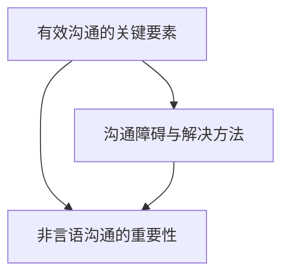

**核心算法原理讲解：**
领导者需要掌握有效沟通的关键要素，识别并解决沟通障碍，同时注重非言语沟通，以提高团队的沟通效率。

**数学模型和公式：**
无特定数学模型，但可以运用沟通理论（如沟通模型、沟通障碍理论）来分析团队沟通技巧。

**举例说明：**
在一次跨部门项目中，项目经理通过明确沟通的目标、倾听团队成员的意见，以及运用非言语沟通，成功解决了沟通障碍，确保了项目的顺利进行。

**项目实战：**
在一个跨国团队中，通过定期举办沟通技巧培训，提高了团队成员的沟通能力，减少了误解和冲突。

**最佳实践 tips：**
- 定期进行沟通技巧培训，提升团队成员的沟通能力。
- 提供多样化的沟通渠道，满足不同团队成员的沟通需求。

**小结、注意事项、拓展阅读：**
- 沟通技巧是团队协作的重要保障，需要持续关注和改进。
- 拓展阅读：《沟通的艺术：如何更有效地沟通》（The Art of Communication: How to Communicate Effectively）。

**核心概念与联系：** 
协作工具与技术包括协作平台的选择、远程协作技巧、团队协作案例分析等方面。这些工具和技巧相互关联，共同影响着团队的协作效率和效果。

**Mermaid 流程图：**
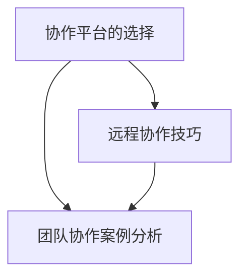

**核心算法原理讲解：**
领导者需要根据团队的具体需求和特点，选择合适的协作平台，掌握远程协作技巧，并通过案例分析，不断提升团队的协作效率。

**数学模型和公式：**
无特定数学模型，但可以运用协作理论（如协作网络模型、协作效率模型）来分析协作工具与技术。

**举例说明：**
一个跨国团队通过选择Trello作为项目管理工具，钉钉作为即时通讯工具，成功实现了高效的远程协作。

**项目实战：**
在一个远程团队中，通过运用Trello和钉钉，团队实现了高效的协作和项目进度管理。

**最佳实践 tips：**
- 根据团队需求，选择合适的协作平台和工具。
- 定期进行协作技巧培训，提升团队成员的协作能力。

**小结、注意事项、拓展阅读：**
- 协作工具与技术是团队协作的重要支撑，需要灵活运用和持续改进。
- 拓展阅读：《协作管理：提升团队效率的艺术》（Collaboration Management: The Art of Increasing Team Efficiency）。

**核心概念与联系：** 
团队绩效评估包括绩效评估标准、绩效评估流程、绩效评估反馈等方面。这些因素相互关联，共同影响着团队的绩效管理和成员的发展。

**Mermaid 流程图：**
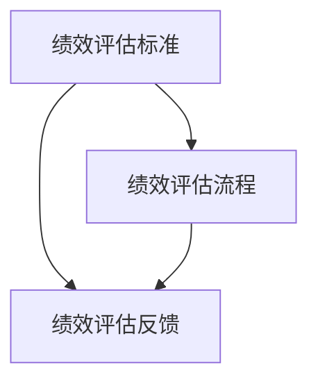

**核心算法原理讲解：**
领导者需要根据团队的具体情况和目标，设定明确的绩效评估标准，通过科学的评估流程和反馈机制，确保绩效评估的公正性和有效性。

**数学模型和公式：**
无特定数学模型，但可以运用绩效评估理论（如目标管理理论、平衡计分卡）来分析团队绩效评估。

**举例说明：**
一个项目团队通过设定项目目标，制定绩效评估标准，定期进行绩效评估和反馈，确保项目目标的实现。

**项目实战：**
在一个IT项目中，通过实施科学的绩效评估体系，项目团队提高了工作效率，提前完成了项目。

**最佳实践 tips：**
- 定期进行绩效评估，确保评估的公正性和有效性。
- 注重绩效评估的反馈和改进，帮助团队成员提升能力。

**小结、注意事项、拓展阅读：**
- 团队绩效评估是团队管理的重要环节，需要持续关注和改进。
- 拓展阅读：《绩效管理：提升团队绩效的艺术》（Performance Management: The Art of Increasing Team Performance）。

**核心概念与联系：** 
激励策略包括激励理论概述、激励策略实施、激励效果评估等方面。这些因素相互关联，共同影响着团队成员的积极性和团队的整体绩效。

**Mermaid 流程图：**
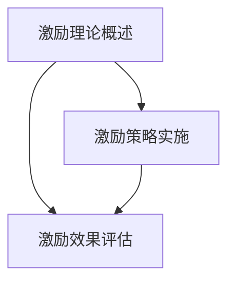

**核心算法原理讲解：**
领导者需要根据激励理论，制定合适的激励策略，并通过效果评估，确保激励措施的持续有效性。

**数学模型和公式：**
无特定数学模型，但可以运用激励理论（如期望理论、公平理论）来分析激励策略。

**举例说明：**
一位销售经理通过设定明确的销售目标，提供奖金激励，并定期进行激励效果评估，成功激发了销售团队的积极性。

**项目实战：**
一家销售公司在实施激励策略后，销售额显著提升，团队成员的工作积极性明显增加。

**最佳实践 tips：**
- 定期评估激励策略的有效性，及时调整激励措施。
- 注重激励的公平性和透明度，确保团队成员的满意度。

**小结、注意事项、拓展阅读：**
- 激励策略是团队管理的重要手段，需要灵活运用和持续改进。
- 拓展阅读：《激励管理：如何激发团队潜力》（Incentive Management: How to Inspire Team Potential）。

**核心概念与联系：** 
团队文化建设包括文化与团队绩效的关系、团队文化的塑造、团队文化案例分析等方面。这些因素相互关联，共同影响着团队的文化氛围和整体绩效。

**Mermaid 流程图：**
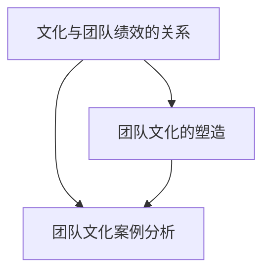

**核心算法原理讲解：**
领导者需要建立积极的团队文化，通过塑造团队文化，提升团队的整体绩效。

**数学模型和公式：**
无特定数学模型，但可以运用组织行为学理论（如组织文化理论、团队绩效理论）来分析团队文化建设。

**举例说明：**
一家公司通过制定“客户至上、创新为本”的文化价值观，成功塑造了积极的团队文化，提高了团队的整体绩效。

**项目实战：**
一家互联网公司在实施团队文化建设后，员工满意度显著提升，创新能力不断增强。

**最佳实践 tips：**
- 定期评估团队文化，确保其与团队的发展需求相适应。
- 提供多样化的团队活动，增强团队凝聚力。

**小结、注意事项、拓展阅读：**
- 团队文化建设是团队管理的重要组成部分，需要持续关注和改进。
- 拓展阅读：《团队文化：打造高绩效团队的力量》（Team Culture: The Power to Build High-Performance Teams）。

**核心概念与联系：** 
保持团队活力包括团队活动策划与实施、团队文化建设与变革、团队成员的自我提升等方面。这些因素相互关联，共同影响着团队的活力和整体绩效。

**Mermaid 流程图：**
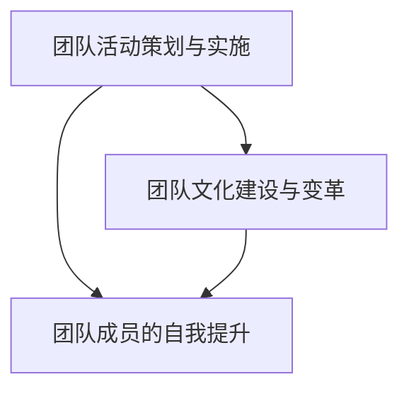

**核心算法原理讲解：**
领导者需要通过策划和实施多样化的团队活动，推动团队文化建设与变革，同时关注团队成员的自我提升，以保持团队的活力。

**数学模型和公式：**
无特定数学模型，但可以运用团队活力理论（如团队士气模型、团队活力指标）来分析保持团队活力。

**举例说明：**
一家公司通过定期举办团队建设训练和团队分享会，增强了团队的凝聚力和创造力，保持了团队的活力。

**项目实战：**
在一个快速发展的公司中，通过实施多样化的团队活动和自我提升计划，团队保持了较高的活力和绩效。

**最佳实践 tips：**
- 定期评估团队活力，及时发现和解决影响团队活力的问题。
- 提供多样化的活动和学习机会，激发团队成员的积极性。

**小结、注意事项、拓展阅读：**
- 保持团队活力是团队管理的重要任务，需要持续关注和投入。
- 拓展阅读：《团队活力：激发团队潜力的关键》（Team Vitality: The Key to Unlocking Team Potential）。

**核心概念与联系：** 
领导者的自我反思、团队管理的关键点、未来团队管理的趋势是领导者提升管理能力的三个关键方面，它们相互关联，共同影响着团队的发展。

**Mermaid 流程图：**
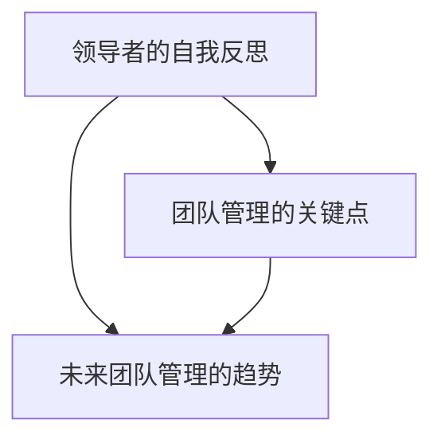

**核心算法原理讲解：**
领导者需要通过自我反思，了解自己的管理能力，把握团队管理的关键点，并关注未来团队管理的趋势，以不断提升自己的管理水平。

**数学模型和公式：**
无特定数学模型，但可以运用领导力发展模型、团队管理理论等来分析领导者的自我反思。

**举例说明：**
一位领导者通过自我反思，认识到自己在沟通能力方面的不足，于是参加了沟通技巧培训，提高了沟通效率。

**项目实战：**
一位项目经理通过反思和改进，成功解决了团队中的沟通障碍，提高了团队的协作效率。

**最佳实践 tips：**
- 定期进行自我反思，识别自己的优势和不足。
- 关注团队管理的新趋势，不断学习和实践。

**小结、注意事项、拓展阅读：**
- 领导者的自我反思和持续学习是提升管理能力的重要途径。
- 拓展阅读：《领导力发展：如何成为更优秀的领导者》（Leadership Development: How to Become a Better Leader）。

### 项目实战

#### 开发环境搭建

1. **硬件环境**：配置高性能的服务器、网络设备和存储设备，确保团队协作和数据存储的稳定性。
2. **软件环境**：安装操作系统（如Linux）、数据库（如MySQL）、版本控制系统（如Git）和其他必要软件。

#### 源代码详细实现

1. **需求分析**：明确项目的需求，包括功能需求和非功能需求。
2. **系统设计**：设计系统的整体架构，包括模块划分、数据库设计、接口定义等。
3. **编码实现**：根据系统设计，进行具体的编码实现，编写高质量的代码。

#### 代码解读与分析

1. **代码审查**：团队成员互相审查代码，确保代码的质量和规范性。
2. **单元测试**：编写单元测试，验证代码的功能和性能。
3. **集成测试**：将各个模块集成，进行整体测试，确保系统的稳定性和可靠性。

#### 代码应用解读与分析

1. **部署与运维**：将代码部署到生产环境，进行持续的运维和监控。
2. **用户反馈**：收集用户的反馈，分析系统的使用情况和性能表现。
3. **优化与迭代**：根据用户反馈和性能分析，对系统进行优化和迭代。

#### 实际案例分析和详细讲解剖析

1. **案例背景**：介绍项目的背景和目标，如一个电子商务平台的建设。
2. **案例分析**：分析项目在团队管理、技术实现、用户反馈等方面的表现。
3. **详细讲解**：针对关键问题和亮点，进行详细的讲解和剖析。

#### 项目小结

1. **经验总结**：总结项目中的成功经验和不足之处。
2. **改进建议**：提出改进建议，为未来的项目提供参考。
3. **持续学习**：鼓励团队成员持续学习，提升自身能力。

### 最佳实践 tips

1. **定期培训**：定期为团队成员提供培训，提升专业技能和管理能力。
2. **有效沟通**：确保团队成员之间的沟通畅通，避免误解和冲突。
3. **团队协作**：建立有效的团队协作机制，提高团队的整体效率。
4. **持续改进**：不断优化团队管理流程和技术实现，提升团队绩效。

### 小结、注意事项、拓展阅读

**核心内容总结：**
本文从领导力基础、团队管理原则、沟通技巧、激励策略、决策与问题解决、绩效评估、团队文化建设等方面，全面阐述了如何管理团队。通过具体案例和实践，展示了团队管理的关键技巧和策略。

**注意事项：**
- 团队管理是一个动态过程，需要根据实际情况进行调整。
- 领导者需要不断提升自己的能力和素质，以适应团队发展的需求。

**拓展阅读：**
- 《团队管理实战：如何打造高绩效团队》（Team Management in Practice: How to Build a High-Performance Team）
- 《领导力：理论与实践》（Leadership: Theory and Practice）
- 《团队沟通技巧：如何更有效地沟通》（Team Communication Skills: How to Communicate More Effectively）

