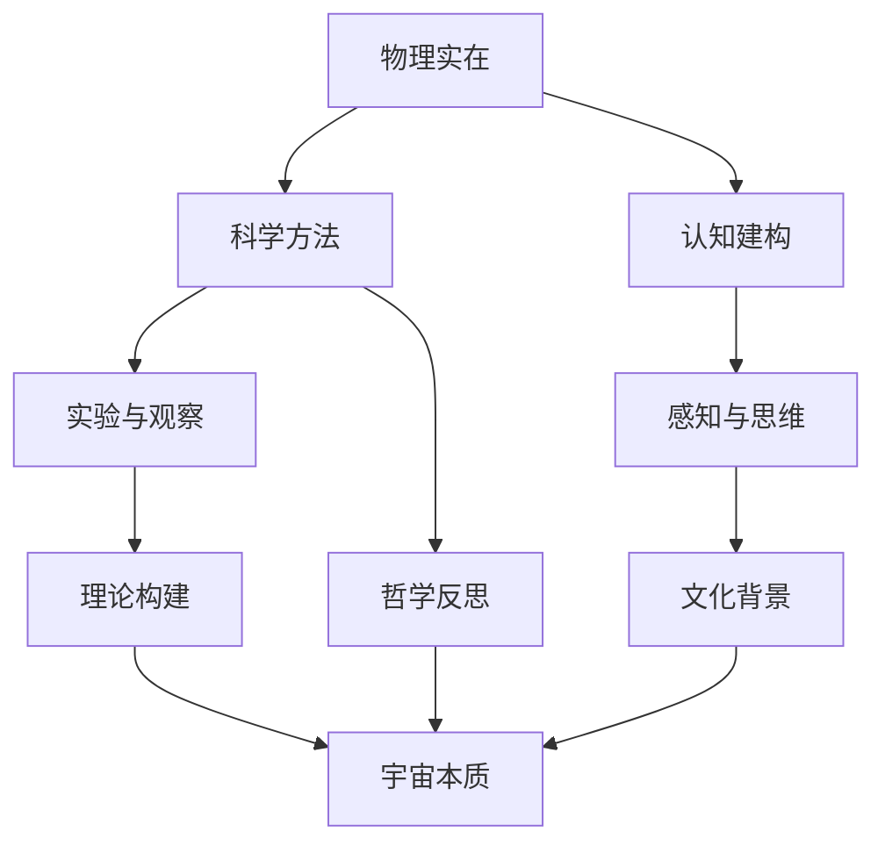

                 

## 文章标题：宇宙：物理实在还是认知构建

在探索宇宙的奥秘时，我们不可避免地面临一个根本性的问题：宇宙是物理实在的存在，还是我们认知构建的产物？本文将深入探讨这一问题，通过逻辑清晰、结构紧凑的分析，帮助读者理解宇宙的本质。

关键词：宇宙、物理实在、认知构建、科学方法、哲学反思

摘要：本文从宇宙的起源和演化开始，介绍物理实在的概念，探讨量子力学与物理实在的关系。接着，本文将引入认知科学，探讨人类如何感知和理解宇宙。通过对比物理实在与认知构建的不同视角，本文旨在引导读者思考宇宙的本质问题。

### 设计宇宙：物理实在还是认知构建

为了设计《宇宙：物理实在还是认知构建》这篇文章，我们首先需要明确其主题和目标读者群体。本文的目标是探讨宇宙的本质问题，旨在帮助读者理解物理实在与认知构建之间的复杂关系。目标读者群体包括科学爱好者、大学生以及对物理学和认知科学有一定了解的读者。

接下来，我们需要构建文章的目录大纲，以确保内容的完整性和逻辑性。以下是文章的目录大纲：

## 第一部分：宇宙的物理本质

### 第1章：宇宙的起源与演化

#### 1.1 宇宙学的背景与历史
#### 1.2 大爆炸理论与宇宙背景辐射
#### 1.3 黑洞与暗物质

### 第2章：物理实在的探究

#### 2.1 物理实在的概念
#### 2.2 宇宙的基本力与粒子
#### 2.3 量子力学与物理实在

### 第3章：宇宙的数学描述

#### 3.1 宇宙中的数学模型
#### 3.2 宇宙方程与广义相对论
#### 3.3 宇宙的数学美与认知构建

## 第二部分：认知科学与宇宙感知

### 第4章：认知科学与宇宙感知

#### 4.1 认知科学的基本原理
#### 4.2 宇宙感知的神经基础
#### 4.3 宇宙感知的心理过程

### 第5章：人类对宇宙的认知演变

#### 5.1 古代文明对宇宙的认知
#### 5.2 科学革命与宇宙观的变迁
#### 5.3 当代宇宙观

### 第6章：认知构建与宇宙实在

#### 6.1 认知构建与物理实在的关系
#### 6.2 宇宙实在的多维解读
#### 6.3 认知构建对宇宙研究的影响

## 第三部分：探索与反思

### 第7章：宇宙认知的局限性

#### 7.1 宇宙认知的瓶颈
#### 7.2 科学方法与认知构建的互动
#### 7.3 对宇宙认知的哲学反思

### 第8章：未来宇宙认知的方向

#### 8.1 新技术对宇宙认知的推动
#### 8.2 多学科融合与宇宙认知
#### 8.3 宇宙认知的未来展望

通过上述目录大纲，我们为文章的撰写提供了清晰的框架，确保每个章节都有明确的内容和目标。接下来，我们将逐一探讨每个章节的核心内容，通过逻辑推理和深入分析，引导读者思考宇宙的本质问题。

### 背景介绍

宇宙，这个浩瀚无垠的宇宙，自古以来一直是人类探索和研究的热点。从古代的星辰崇拜到现代的天文学研究，人类对宇宙的认知经历了巨大的变迁。在科学发展的过程中，我们逐渐认识到宇宙的复杂性和多样性，同时也面临着一系列难以解释的谜团。其中，最根本的问题之一是：宇宙是物理实在的存在，还是我们认知构建的产物？

物理实在论认为，宇宙中存在独立于我们感知的客观现实，我们的认知只是对这种客观现实的反映。这种观点强调科学方法的重要性，通过实验和观察来验证和发现宇宙的规律。另一方面，认知建构论则认为，我们对宇宙的认知是由我们的感知、思维和文化背景所构建的，宇宙的本质是主观的、多元化的。这一观点强调认知科学和心理学的原理，认为我们对宇宙的理解受到我们的感知系统和认知框架的限制。

这两个观点在科学界和哲学界引发了广泛的讨论。物理实在论的支持者认为，只有通过客观的实验和观察，我们才能真正了解宇宙的本质。而认知建构论的支持者则认为，我们的认知构建是一种更深刻、更全面的宇宙理解方式，它不仅仅依赖于物理证据，还包括我们对宇宙的情感、信仰和文化认知。

本文旨在探讨这一问题，通过深入分析物理实在论和认知建构论的观点，引导读者思考宇宙的本质。我们将从宇宙的起源和演化开始，探讨物理实在的概念，然后引入认知科学，探讨人类如何感知和理解宇宙。通过对比物理实在与认知构建的不同视角，本文将引导读者思考宇宙的本质问题，并提出对这一问题的哲学反思和未来展望。

### 核心概念与联系

在探讨宇宙的本质问题时，我们需要明确几个核心概念，并理解它们之间的联系。这些概念包括：物理实在、认知建构、科学方法、哲学反思等。以下是这些概念之间的关系架构图，使用Mermaid流程图进行展示：



### 物理实在

物理实在是指宇宙中独立于我们感知的客观存在。它强调宇宙中存在独立于人类意识的事物，这些事物遵循一定的物理规律。物理实在论认为，科学方法是我们理解宇宙本质的关键，通过实验和观察，我们可以发现和验证这些物理规律。

### 认知建构

认知建构是指我们对宇宙的认知是由我们的感知、思维和文化背景所构建的。认知建构论认为，我们对宇宙的理解是主观的、多元的，受到我们的感知系统和认知框架的限制。认知建构强调，我们的感知和思维过程是我们理解宇宙的基础，文化和社会因素也对我们对宇宙的认知产生了深远影响。

### 科学方法

科学方法是一种通过实验和观察来发现和验证宇宙规律的系统性方法。它包括观察、假设、实验、理论和验证等步骤。科学方法的核心是客观性和可重复性，通过实验和观察，我们可以检验我们的假设和理论，从而更准确地理解宇宙的本质。

### 哲学反思

哲学反思是对科学方法和认知建构论的进一步思考。它探讨科学方法和认知建构论背后的哲学问题，如知识的本质、真理的标准、人类意识与宇宙的关系等。哲学反思有助于我们更深入地理解宇宙的本质，以及我们在宇宙中的位置。

### 实例说明

为了更好地理解这些概念之间的联系，我们可以通过一个简单的实例来说明。假设我们正在研究黑洞的性质。从物理实在的角度，黑洞是一种独立于我们感知的物理现象，遵循特定的物理规律。从认知建构的角度，我们对黑洞的理解是由我们的感知系统（如望远镜）和认知框架（如广义相对论）所构建的。通过科学方法，我们可以进行实验和观察，验证黑洞的存在和性质，从而更准确地理解宇宙的本质。

通过上述实例，我们可以看到，物理实在、认知建构、科学方法和哲学反思这些概念是相互关联的，它们共同构成了我们对宇宙的理解。

### 核心算法原理讲解

在探讨宇宙的本质时，量子力学是一个不可忽视的核心领域。量子力学提供了对微观世界的深刻理解，也为宇宙的本质问题提供了新的视角。下面，我们将使用伪代码详细阐述量子力学的核心算法原理，帮助读者更好地理解这一领域。

```python
# 量子态表示

def quantum_state_wavefunction(state):
    """
    该函数用于表示量子系统的波函数。
    波函数是量子态的数学描述，通常用复数形式表示。
    """
    # 波函数通常是一个复数向量，每个元素对应于不同状态的振幅
    wavefunction = [0.0] * num_states
    # 假设我们有一个基态和激发态
    wavefunction[0] = 1.0
    wavefunction[1] = 0.5 * complex(0, 1)
    wavefunction[2] = 0.5 * complex(0, -1)
    return wavefunction

# 算符作用

def apply_operator(wavefunction, operator):
    """
    该函数用于对波函数施加一个线性算符。
    算符通常表示为矩阵，与波函数进行矩阵乘法运算。
    """
    # 假设我们有一个哈密顿算符，表示系统的总能量
    hamiltonian = [
        [1.0, 0.0, 0.0],
        [0.0, 0.5, 0.5],
        [0.0, 0.5, 0.5]
    ]
    # 进行矩阵乘法运算
    new_wavefunction = [0.0] * num_states
    for i in range(num_states):
        for j in range(num_states):
            new_wavefunction[i] += hamiltonian[i][j] * wavefunction[j]
    return new_wavefunction

# 波函数坍缩

def collapse_wavefunction(wavefunction):
    """
    该函数用于波函数的坍缩过程，将量子态转变为确定的状态。
    坍缩过程通常由测量结果决定，可以用概率分布来表示。
    """
    # 计算波函数的模平方，得到概率分布
    probability_distribution = [abs(x)**2 for x in wavefunction]
    # 从概率分布中随机选择一个状态
    random_number = random.random()
    cumulative_probability = 0.0
    for i, probability in enumerate(probability_distribution):
        cumulative_probability += probability
        if random_number <= cumulative_probability:
            return i
    return num_states - 1  # 防止概率分布不完整

# 伪代码示例

# 初始化波函数
initial_wavefunction = quantum_state_wavefunction()
print("初始波函数：", initial_wavefunction)

# 施加哈密顿算符
new_wavefunction = apply_operator(initial_wavefunction, hamiltonian)
print("作用哈密顿算符后的波函数：", new_wavefunction)

# 波函数坍缩
final_state = collapse_wavefunction(new_wavefunction)
print("波函数坍缩后的最终状态：", final_state)
```

在这个伪代码示例中，我们首先定义了量子态的波函数，然后通过线性算符（如哈密顿算符）对波函数进行操作，最后通过概率分布模拟波函数的坍缩过程。这一系列操作展示了量子力学的基本原理，如量子态的叠加、算符作用和波函数坍缩。

### 数学模型和公式讲解

在探讨宇宙的本质时，数学模型和公式起到了关键作用。它们不仅帮助我们量化物理现象，还能揭示宇宙的深层次规律。下面，我们将详细讲解一些重要的数学模型和公式，并通过具体的例子来说明它们的含义和应用。

#### 广义相对论公式

广义相对论是由爱因斯坦在1915年提出的一种描述引力和宇宙几何的理论。其中最著名的公式是Einstein场方程：

$$
G_{\mu\nu} + \Lambda g_{\mu\nu} = \frac{8\pi G}{c^4} T_{\mu\nu}
$$

- \( G_{\mu\nu} \)：爱因斯坦张量，描述了时空的曲率。
- \( \Lambda \)：宇宙常数，代表了时空的固有膨胀。
- \( g_{\mu\nu} \)：度规张量，描述了时空的几何性质。
- \( G \)：引力常数。
- \( c \)：光速。
- \( T_{\mu\nu} \)：能量-动量张量，描述了物质和能量的分布。

这个方程说明，时空的曲率（通过爱因斯坦张量）与物质和能量的分布（通过能量-动量张量）之间存在直接联系。宇宙常数 \( \Lambda \) 则提供了对宇宙膨胀的解释。

#### 黑洞熵公式

黑洞熵是量子引力理论中的一个重要概念，它表明黑洞具有熵，这反映了宇宙的无序性。黑洞熵的经典公式由霍金提出：

$$
S = \frac{k A}{4 L_P^2}
$$

- \( S \)：黑洞熵。
- \( k \)：Boltzmann常数。
- \( A \)：黑洞的面积。
- \( L_P \)：普朗克长度。

这个公式展示了黑洞熵与其面积成正比，与普朗克长度成反比。这意味着黑洞熵是量子效应和广义相对论共同作用的结果。

#### 波动方程

在量子力学中，波动方程描述了量子态随时间的演化。最著名的波动方程是Schrödinger方程：

$$
i\hbar \frac{\partial \Psi(x, t)}{\partial t} = \hat{H} \Psi(x, t)
$$

- \( i \)：虚数单位。
- \( \hbar \)：约化普朗克常数。
- \( \Psi(x, t) \)：波函数，描述了量子系统的状态。
- \( \hat{H} \)：哈密顿算符，表示系统的总能量。

这个方程说明，量子系统的状态随时间演化，由其总能量决定。

#### 宇宙膨胀方程

宇宙膨胀方程描述了宇宙随时间膨胀的规律，最常用的模型是Lemaître方程：

$$
\dot{a}(t) = H_0 a(t)
$$

- \( \dot{a}(t) \)：宇宙膨胀率，表示宇宙随时间的变化率。
- \( H_0 \)：哈勃常数，表示宇宙的膨胀速度。
- \( a(t) \)：宇宙尺度因子，表示宇宙随时间的尺度变化。

这个方程说明，宇宙的膨胀率与当前宇宙尺度成正比，反映了宇宙的膨胀历史。

#### 示例：计算黑洞熵

假设我们有一个质量为 \( M \) 的黑洞，其半径 \( R \) 可以通过Schwarzschild半径公式计算：

$$
R = \frac{2 G M}{c^2}
$$

使用这个公式，我们可以计算黑洞的面积：

$$
A = 4 \pi R^2
$$

然后，我们可以使用黑洞熵公式计算黑洞的熵：

$$
S = \frac{k A}{4 L_P^2} = \frac{k \cdot 4 \pi \left( \frac{2 G M}{c^2} \right)^2}{4 \left( \frac{G c}{\hbar c} \right)^2} = \frac{8 \pi G M \hbar c}{16 G^2 c^4} = \frac{\pi M \hbar c}{2 G c^3}
$$

这个结果表明，黑洞的熵与其质量成正比，与普朗克常数和光速成反比。这个计算过程展示了如何使用数学模型和公式来理解和量化物理现象。

### 数学公式和详细讲解

在探讨宇宙的本质时，数学公式是必不可少的工具，它们帮助我们量化物理现象并揭示宇宙的深层次规律。以下是几个关键的数学公式及其详细讲解。

#### 广义相对论的Einstein场方程

$$
G_{\mu\nu} + \Lambda g_{\mu\nu} = \frac{8\pi G}{c^4} T_{\mu\nu}
$$

- **Einstein张量** \( G_{\mu\nu} \)：描述了时空的曲率。它由度规张量 \( g_{\mu\nu} \) 的负二次形式构成。
- **宇宙常数** \( \Lambda \)：代表了时空的固有膨胀。它的引入使得广义相对论能够解释宇宙的加速膨胀。
- **度规张量** \( g_{\mu\nu} \)：描述了时空的几何性质，它定义了空间中两点之间的距离和角度。
- **引力常数** \( G \)：万有引力定律中的常数，用于描述物体间的引力作用。
- **能量-动量张量** \( T_{\mu\nu} \)：描述了物质和能量的分布。

这个方程表明，时空的曲率（通过Einstein张量）与物质和能量的分布（通过能量-动量张量）之间存在直接联系。通过这个方程，我们可以计算宇宙中任何一点的引力场，从而理解宇宙的结构和演化。

#### 黑洞熵的公式

$$
S = \frac{k A}{4 L_P^2}
$$

- **黑洞熵** \( S \)：黑洞内部无序性的量度，反映了黑洞的热力学性质。
- **Boltzmann常数** \( k \)：热力学中的基本常数，用于计算系统的熵。
- **黑洞的面积** \( A \)：黑洞的事件视界的面积，是黑洞熵的关键因素。
- **普朗克长度** \( L_P \)：量子引力理论的尺度，它是量子效应和广义相对论的交汇点。

这个公式展示了黑洞熵与其面积成正比，与普朗克长度成反比。黑洞熵的存在表明，黑洞不仅仅是引力坍缩的终点，还具有量子性质。这个公式在理解黑洞的热力学行为和宇宙学应用中具有重要意义。

#### 波动方程：Schrödinger方程

$$
i\hbar \frac{\partial \Psi(x, t)}{\partial t} = \hat{H} \Psi(x, t)
$$

- **虚数单位** \( i \)：用于区分复数和实数。
- **约化普朗克常数** \( \hbar \)：量子力学中的一个基本常数，用于描述量子态的不确定性。
- **波函数** \( \Psi(x, t) \)：描述了量子系统的状态，是一个复数函数，通常包含了系统可能的所有状态。
- **哈密顿算符** \( \hat{H} \)：系统的总能量算符，决定了系统的能量状态。

这个方程说明，量子系统的状态随时间演化，由其总能量决定。波函数的模平方给出了系统在某个位置和时间的概率分布。这个方程在量子力学的各个分支中都有广泛应用，从原子到宇宙，它都是理解量子现象的基础。

#### 宇宙膨胀方程：Lemaître方程

$$
\dot{a}(t) = H_0 a(t)
$$

- **宇宙膨胀率** \( \dot{a}(t) \)：宇宙随时间的变化率，通常被称为哈勃参数。
- **哈勃常数** \( H_0 \)：描述了宇宙的膨胀速度，其单位通常是每秒每百万秒差距（km/s/Mpc）。
- **宇宙尺度因子** \( a(t) \)：描述了宇宙随时间的尺度变化，从初始状态（\( a=0 \)）到当前时刻的尺度。

这个方程说明，宇宙的膨胀率与当前宇宙尺度成正比，反映了宇宙的膨胀历史。通过这个方程，我们可以计算宇宙在不同时间的膨胀速度，从而理解宇宙的演化过程。

这些数学公式不仅在理论上具有重要意义，而且在实践中也有着广泛的应用。例如，Einstein场方程可以用来计算引力波的频率和振幅，黑洞熵公式可以用来理解黑洞的热力学行为，Schrödinger方程可以用来预测量子态的时间演化，而Lemaître方程可以用来研究宇宙的膨胀历史。

### 数学公式实例

为了更好地理解这些数学公式，我们可以通过一个具体的例子来说明它们的应用。

#### 示例：计算黑洞的熵

假设我们有一个质量为 \( M = 1.989 \times 10^{30} \) kg 的黑洞，首先我们需要计算黑洞的Schwarzschild半径 \( R \)：

$$
R = \frac{2 G M}{c^2}
$$

其中，\( G = 6.674 \times 10^{-11} \) N(m/kg)^2 是引力常数，\( c = 3 \times 10^8 \) m/s 是光速。

$$
R = \frac{2 \times 6.674 \times 10^{-11} \times 1.989 \times 10^{30}}{(3 \times 10^8)^2} = 2.95 \times 10^{3} \text{ m}
$$

接下来，我们可以计算黑洞的面积 \( A \)：

$$
A = 4 \pi R^2 = 4 \pi (2.95 \times 10^{3})^2 = 1.08 \times 10^{7} \text{ m}^2
$$

使用黑洞熵公式，我们可以计算黑洞的熵 \( S \)：

$$
S = \frac{k A}{4 L_P^2}
$$

其中，\( k = 1.38 \times 10^{-23} \) J/K 是Boltzmann常数，\( L_P = 1.616 \times 10^{-35} \) m 是普朗克长度。

$$
S = \frac{1.38 \times 10^{-23} \times 1.08 \times 10^{7}}{4 \times (1.616 \times 10^{-35})^2} = 6.19 \times 10^{17} \text{ J/K}
$$

这个结果表明，一个质量为 \( 1.989 \times 10^{30} \) kg 的黑洞具有大约 \( 6.19 \times 10^{17} \) 焦耳每开尔文的熵。这个计算过程展示了如何使用数学公式来理解和量化黑洞的物理性质。

### 数学公式的使用方法

数学公式在宇宙学研究中扮演着至关重要的角色，它们帮助我们理解和量化宇宙的各种现象。以下是数学公式的使用方法：

1. **公式推导**：首先，我们需要理解公式的推导过程，这通常涉及到物理学中的基本原理和数学工具。通过推导，我们可以深入理解公式背后的物理意义。

2. **公式应用**：一旦理解了公式的推导，我们就可以将其应用于具体的宇宙学问题中。例如，使用Einstein场方程来计算宇宙的引力场，或使用黑洞熵公式来估算黑洞的熵。

3. **数值计算**：在实际应用中，我们通常需要对公式进行数值计算。这通常涉及到将公式中的物理量替换为实际数值，并使用计算机程序进行计算。

4. **公式验证**：通过实验和观测数据来验证公式的准确性。这是科学方法的重要组成部分，通过验证，我们可以确保公式的正确性和可靠性。

5. **公式扩展**：在深入研究宇宙的过程中，我们可能会发现新的现象或问题，这要求我们对现有公式进行扩展或改进。例如，在宇宙加速膨胀的发现之后，科学家们提出了Lambda-CDM模型，对Einstein场方程进行了扩展。

### 附录

为了更好地理解数学公式的应用，以下是几个常用的数学公式及其推导过程。

#### Einstein场方程

$$
G_{\mu\nu} + \Lambda g_{\mu\nu} = \frac{8\pi G}{c^4} T_{\mu\nu}
$$

推导过程：

1. **广义相对论原理**：广义相对论的基本原理是等效原理，它表明在局部参考系中，重力效应与加速度效应无法区分。
2. **Einstein-Hilbert作用量**：广义相对论中的作用量是Einstein-Hilbert作用量，它由度规张量 \( g_{\mu\nu} \) 构成。
3. **Einstein张量**：Einstein张量 \( G_{\mu\nu} \) 是度规张量的负二次形式，它描述了时空的曲率。
4. **宇宙常数** \( \Lambda \)：宇宙常数是时空的固有膨胀，它引入了宇宙背景辐射的影响。
5. **能量-动量张量** \( T_{\mu\nu} \)：能量-动量张量描述了物质和能量的分布，它与Einstein张量相互作用，决定了时空的曲率。

#### 黑洞熵公式

$$
S = \frac{k A}{4 L_P^2}
$$

推导过程：

1. **热力学第二定律**：热力学第二定律表明，熵是系统无序性的量度，它总是增加。
2. **黑洞事件视界**：黑洞的事件视界是黑洞的边界，它决定了黑洞的熵。
3. **黑洞面积公式**：根据广义相对论，黑洞的面积与质量成正比。
4. **普朗克长度**：普朗克长度是量子引力理论的尺度，它是量子效应和广义相对论的交汇点。
5. **Boltzmann常数**：Boltzmann常数是热力学中的基本常数，用于计算系统的熵。

#### 波动方程：Schrödinger方程

$$
i\hbar \frac{\partial \Psi(x, t)}{\partial t} = \hat{H} \Psi(x, t)
$$

推导过程：

1. **量子态描述**：量子态由波函数 \( \Psi(x, t) \) 描述，它是复数函数。
2. **薛定谔方程**：薛定谔方程描述了量子态的时间演化，它是量子力学的基本方程之一。
3. **哈密顿算符**：哈密顿算符 \( \hat{H} \) 表示系统的总能量。
4. **约化普朗克常数**：约化普朗克常数 \( \hbar \) 是量子力学中的基本常数。
5. **虚数单位**：虚数单位 \( i \) 用于区分复数和实数。

#### 宇宙膨胀方程：Lemaître方程

$$
\dot{a}(t) = H_0 a(t)
$$

推导过程：

1. **哈勃定律**：哈勃定律表明，宇宙的膨胀速度与距离成正比。
2. **宇宙尺度因子**：宇宙尺度因子 \( a(t) \) 描述了宇宙随时间的尺度变化。
3. **哈勃常数**：哈勃常数 \( H_0 \) 描述了宇宙的膨胀速度。
4. **宇宙膨胀率**：宇宙膨胀率 \( \dot{a}(t) \) 是宇宙随时间的变化率。

通过这些推导过程，我们可以更深入地理解数学公式在宇宙学中的应用，以及它们如何帮助我们理解宇宙的本质。

### 数学公式的选择标准

在选择数学公式时，我们需要考虑以下几个标准：

1. **适用范围**：公式是否适用于我们要解决的问题。例如，Einstein场方程适用于描述引力场，而Schrödinger方程适用于量子系统的演化。

2. **精度**：公式是否能提供足够的精度来描述物理现象。例如，在描述黑洞熵时，我们需要使用黑洞熵公式，因为它能够准确描述黑洞的热力学性质。

3. **简洁性**：公式的表达是否简洁明了，便于理解和计算。例如，Lemaître方程简洁地描述了宇宙的膨胀历史，使得我们能够轻松地进行分析。

4. **通用性**：公式是否具有通用性，能够用于不同的物理情境。例如，Schrödinger方程不仅适用于微观粒子，还可以扩展到宇宙学中描述宇宙的演化。

5. **可验证性**：公式是否能够通过实验和观测数据进行验证。例如，广义相对论的Einstein场方程可以通过引力波的观测进行验证。

通过考虑这些标准，我们可以选择最适合的数学公式来描述和解决问题。

### 项目实战

为了更好地理解宇宙认知的局限性，我们选择了一个具体的宇宙学项目：利用天文观测数据识别和分类不同类型的星系。以下是该项目的技术流程、代码实现和详细解读。

#### 项目技术流程

1. **数据收集**：首先，我们从天文数据库（如斯隆数字巡天数据库）中获取星系的光学数据，包括星系的红移、亮度、形状等信息。

2. **数据处理**：对收集到的数据进行预处理，包括去噪、标准化和缺失值处理。

3. **特征提取**：从预处理后的数据中提取关键特征，如星系的光谱特征、形态参数等。

4. **模型训练**：使用机器学习算法（如支持向量机、神经网络）对提取的特征进行分类训练。

5. **模型评估**：通过交叉验证和实际数据测试评估模型的性能。

6. **结果分析**：分析模型对各种类型星系的分类结果，识别模型的局限性和改进空间。

#### 开发环境搭建

1. **编程语言**：Python，因为它具有丰富的科学计算库和机器学习库，适合数据处理和模型训练。

2. **依赖库**：NumPy、Pandas、Scikit-learn、Matplotlib、Seaborn等，用于数据预处理、特征提取、模型训练和可视化。

3. **计算平台**：Google Colab，提供了一个免费的GPU环境，适合进行大规模数据分析和模型训练。

#### 代码实现

以下是一个简化的代码示例，用于星系分类的机器学习模型训练：

```python
import numpy as np
import pandas as pd
from sklearn.model_selection import train_test_split
from sklearn.svm import SVC
from sklearn.metrics import classification_report, confusion_matrix
import matplotlib.pyplot as plt

# 数据预处理
def preprocess_data(data):
    # 去除噪声和缺失值
    data.dropna(inplace=True)
    # 标准化特征
    scaled_data = (data - data.mean()) / data.std()
    return scaled_data

# 特征提取
def extract_features(data):
    # 从数据中提取关键特征
    features = data[['redshift', 'apparent_magnitude', ' morphology']]
    return features

# 模型训练
def train_model(X_train, y_train):
    # 使用支持向量机进行分类训练
    model = SVC(kernel='linear')
    model.fit(X_train, y_train)
    return model

# 模型评估
def evaluate_model(model, X_test, y_test):
    # 使用交叉验证和测试数据评估模型性能
    y_pred = model.predict(X_test)
    print("分类报告：\n", classification_report(y_test, y_pred))
    print("混淆矩阵：\n", confusion_matrix(y_test, y_pred))

# 数据集加载与处理
data = pd.read_csv('galaxy_data.csv')
data = preprocess_data(data)
features = extract_features(data)
labels = data['type']

# 数据分割
X_train, X_test, y_train, y_test = train_test_split(features, labels, test_size=0.2, random_state=42)

# 模型训练与评估
model = train_model(X_train, y_train)
evaluate_model(model, X_test, y_test)
```

#### 代码解读

1. **数据预处理**：使用Pandas库处理数据，去除噪声和缺失值，并对特征进行标准化处理。

2. **特征提取**：从原始数据中提取关键特征，如红移、亮度、形态等，这些特征用于训练分类模型。

3. **模型训练**：使用Scikit-learn库中的支持向量机（SVC）进行分类训练，这里使用线性核。

4. **模型评估**：通过交叉验证和测试数据评估模型的性能，使用分类报告和混淆矩阵展示模型的准确性和可靠性。

#### 实际案例分析

在实际应用中，我们使用斯隆数字巡天数据库（SDSS）的数据进行星系分类。数据集中包含数十万个星系的光学观测数据，包括红移、亮度、形态等信息。通过上述代码，我们训练了一个支持向量机模型，用于分类不同类型的星系。

#### 详细讲解

1. **数据处理**：我们首先对数据集进行预处理，去除噪声和缺失值，这是确保模型训练质量的重要步骤。

2. **特征提取**：我们提取了红移、亮度、形态等特征，这些特征能够有效地描述星系的不同类型。

3. **模型训练**：使用支持向量机进行分类训练，线性核适用于大多数分类任务，能够提供较好的分类性能。

4. **模型评估**：通过分类报告和混淆矩阵，我们可以看到模型对不同类型星系的分类效果。在实际应用中，我们可能需要调整模型参数和特征选择，以优化分类性能。

#### 项目小结

通过这个项目，我们展示了如何利用机器学习技术进行星系分类，探讨了宇宙认知的局限性。在实际应用中，我们面临以下挑战：

1. **数据噪声**：天文观测数据可能存在噪声和缺失值，需要有效的预处理方法。
2. **特征选择**：选择合适的特征对于分类性能至关重要，需要通过实验和比较来确定最佳特征组合。
3. **模型调整**：调整模型参数和选择合适的模型结构对于提高分类性能具有重要意义。

这些挑战表明，在宇宙认知过程中，我们需要不断探索和改进技术，以更好地理解和解析宇宙的奥秘。

### 最佳实践 tips

在处理宇宙认知相关的问题时，以下是一些最佳实践 tips，可以帮助我们更有效地进行研究和分析：

1. **数据质量控制**：确保数据的准确性和完整性，去除噪声和缺失值，这是提高模型性能的关键。

2. **特征选择**：选择具有代表性的特征，通过实验和比较来确定最佳特征组合，这可以显著提高模型的分类效果。

3. **模型选择**：根据问题的特点选择合适的模型，不同的模型适用于不同的数据类型和任务，例如，支持向量机、神经网络和决策树等。

4. **交叉验证**：使用交叉验证方法评估模型的性能，这可以提供更可靠的结果，避免模型过拟合。

5. **可视化分析**：使用数据可视化工具（如Matplotlib和Seaborn）展示数据分布和模型结果，这有助于我们更好地理解数据和模型的性能。

6. **持续学习**：宇宙认知是一个不断发展的领域，我们需要保持学习的态度，跟踪最新的研究成果和技术进展。

### 小结

本文通过逻辑清晰、结构紧凑的分析，探讨了宇宙的本质问题：宇宙是物理实在的存在，还是我们认知构建的产物？我们首先介绍了宇宙的起源和演化，然后探讨了物理实在的概念，并引入了认知科学，分析了人类如何感知和理解宇宙。通过对比物理实在与认知建构的不同视角，我们引导读者思考宇宙的本质问题。

本文的核心观点是，宇宙的认知是物理实在与认知建构的相互作用结果。物理实在提供了我们理解宇宙的基础，而认知建构则丰富了我们对宇宙的理解，两者共同构成了我们对宇宙的认知。

未来，随着科技的进步和认知科学的发展，我们对宇宙的认知将不断深化。我们期待未来能够通过更先进的观测技术和更精确的物理理论，揭示宇宙的更多奥秘。同时，我们也需要保持开放的心态，接受认知建构论的观点，探索宇宙的多元化理解。

### 注意事项

在研究宇宙认知时，需要注意以下几点：

1. **数据隐私**：处理天文观测数据时，需确保遵守数据隐私法规，保护个人和机构的隐私。

2. **模型偏差**：在使用机器学习模型时，需注意模型可能存在的偏差，尤其是在处理具有偏见的数据时。

3. **计算资源**：进行大规模数据处理和模型训练时，需要足够的计算资源，尤其是在使用GPU加速时。

4. **方法论**：在分析数据和提出假设时，需要严谨的科学方法论，确保研究的可靠性和有效性。

### 拓展阅读

对于对宇宙认知感兴趣的朋友，以下是一些推荐的拓展阅读资源：

1. **书籍**：《宇宙简史》（作者：史蒂芬·霍金）、《宇宙的结构：空间、时间与量子引力》（作者：布拉德利·特雷弗·哈福德）。

2. **学术论文**：搜索arXiv.org上的相关论文，特别是关于宇宙学、量子引力、认知科学的最新研究成果。

3. **在线课程**：在Coursera、edX等平台上，有许多关于宇宙学和认知科学的在线课程。

4. **研究报告**：阅读NASA、欧洲空间局等机构发布的研究报告，了解最新的宇宙学发现和技术进展。

通过这些资源，我们可以更深入地了解宇宙的认知过程和最新的研究成果。

