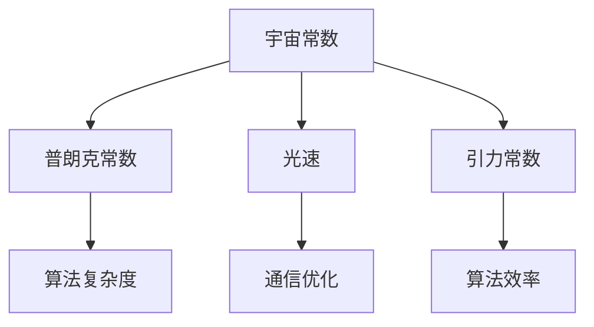

                 


### 宇宙常数与程序优化极限的类比

#### 引言

在科学和技术的世界中，宇宙常数和程序优化极限是两个看似截然不同的概念。宇宙常数，如普朗克常数、光速和引力常数，是物理学中描述宇宙基本属性的常数。而程序优化极限，则是在计算机科学中，寻求算法和程序的极限性能，以达到最优化的目标。本文将探讨这两个概念之间的类比，以期为我们提供新的视角，更好地理解和优化计算机程序。

##### 1.1 书籍背景与目的

本书旨在通过对宇宙常数和程序优化极限的类比分析，揭示二者在本质上的相似性。通过对这些相似性的深入研究，我们希望能够为程序员和科学家提供新的思路，以优化计算机程序的性能，同时也能更好地理解宇宙的基本规律。

##### 1.2 阅读对象与预期收益

本书适合对计算机科学和物理学有一定了解的读者阅读。无论是计算机科学家、程序员，还是物理学家，都能从本书中获得新的知识和视角。通过阅读本书，读者可以：

- 深入理解宇宙常数和程序优化极限的概念；
- 发现宇宙常数和程序优化极限之间的相似性；
- 掌握利用宇宙常数类比来优化程序的方法；
- 增强对计算机科学和物理学的整体理解。

#### 2. 宇宙常数简介

宇宙常数是物理学中描述宇宙基本属性的常数。它们在不同的物理学领域有着不同的应用和意义。

##### 2.1 宇宙常数的定义与历史

宇宙常数最早的概念可以追溯到牛顿的万有引力定律。牛顿通过实验发现，所有物体之间的引力与它们的质量成正比，与它们之间的距离的平方成反比。这个比例系数被称为引力常数，是宇宙常数的一个例子。

随着物理学的发展，人们发现了更多宇宙常数。例如，普朗克常数是量子力学中的一个基本常数，描述了粒子的能量与其频率之间的关系。光速是电磁波在真空中的速度，是宇宙中信息传递速度的上限。引力常数则描述了引力的大小。

##### 2.2 重要的宇宙常数

宇宙常数中，最著名的是普朗克常数、光速和引力常数。

- **普朗克常数**：普朗克常数是量子力学中的一个基本常数，符号为 h，单位是焦耳·秒（J·s）。它描述了粒子的能量与其频率之间的关系，公式为 E = h·f。

- **光速**：光速是电磁波在真空中的速度，符号为 c，单位是米/秒（m/s）。光速是宇宙中信息传递速度的上限，即任何物质或信息都无法超越光速。

- **引力常数**：引力常数是牛顿万有引力定律中的比例系数，符号为 G，单位是牛顿·米²/千克²（N·m²/kg²）。它描述了两个物体之间的引力大小。

##### 2.3 宇宙常数的影响与重要性

宇宙常数对宇宙的演化、物理学的理论发展以及天文学的应用都有着深远的影响。

- **对宇宙演化的影响**：宇宙常数影响宇宙的膨胀速度和结构形成。例如，引力常数 G 决定了宇宙的引力平衡，从而影响宇宙的结构和演化。

- **对物理学理论的挑战**：宇宙常数对物理学的理论发展提出了挑战。例如，普朗克常数和光速的存在引发了关于量子力学和相对论统一的理论问题。

- **在天文学中的应用**：宇宙常数在天文学中有着广泛的应用。例如，通过测量宇宙常数，可以了解宇宙的膨胀速度和宇宙的历史。

#### 3. 程序优化极限介绍

程序优化极限是计算机科学中的一个重要概念，它涉及到如何通过算法和程序设计来提高计算机的性能。

##### 3.1 程序优化概述

程序优化是指通过改进算法和程序设计，提高计算机程序的运行效率。优化的目标可以是提高程序的运行速度、减少内存使用、降低能耗等。

程序优化的方法包括：

- **算法优化**：通过改进算法的效率，减少程序的运行时间。例如，使用更高效的算法或优化现有算法。

- **数据结构优化**：通过改进数据结构的设计，提高程序的运行效率。例如，使用更适合问题的数据结构。

- **代码优化**：通过改进代码的编写方式，提高程序的运行效率。例如，使用更简洁、高效的代码。

##### 3.2 程序优化算法与策略

程序优化中常用的算法和策略包括：

- **动态规划**：通过将问题分解为子问题，并存储子问题的解，来优化问题的求解时间。

- **贪心算法**：通过在每个决策点选择当前最优解，来求解问题。

- **分支定界**：通过遍历所有可能的解，来找到最优解。

- **模拟退火**：通过模拟物理退火过程，来优化问题的解。

- **遗传算法**：通过模拟生物进化过程，来优化问题的解。

##### 3.3 程序优化面临的挑战

程序优化面临着多种挑战：

- **复杂性**：程序优化问题通常具有很高的复杂性，使得找到最优解变得困难。

- **时间与资源限制**：在实际应用中，程序的运行时间和资源限制常常是约束条件，这使得优化变得更为复杂。

- **稳定性与鲁棒性**：优化的方法需要在各种情况下都能保持稳定和鲁棒，以确保程序的正确性和可靠性。

#### 4. 宇宙常数与程序优化极限的类比分析

通过宇宙常数和程序优化极限的类比，我们可以发现二者在多个方面具有相似性。

##### 4.1 类比的基础与意义

宇宙常数和程序优化极限之间的类比基础在于它们都涉及到最优化的概念。宇宙常数描述了宇宙的基本属性，而程序优化极限则是在计算机科学中寻求算法和程序的极限性能。

类比研究的意义在于：

- **提供新的视角**：通过宇宙常数的类比，我们可以从新的角度理解程序优化问题，从而提出新的优化方法和策略。

- **促进跨学科研究**：宇宙常数和程序优化极限的类比可以促进计算机科学和物理学之间的交叉研究，推动学科的发展。

- **提高计算机性能**：通过类比分析，我们可以借鉴宇宙常数的研究成果，提高计算机程序的运行效率。

##### 4.2 类比分析的具体案例

我们可以通过几个具体的案例来分析宇宙常数和程序优化极限之间的类比。

- **普朗克常数与算法复杂度**：普朗克常数描述了粒子的能量与其频率之间的关系。在计算机科学中，算法复杂度描述了算法的运行时间和内存使用。我们可以将普朗克常数与算法复杂度进行类比，以探讨算法的优化问题。

- **光速与通信优化**：光速是宇宙中信息传递速度的上限。在计算机科学中，通信优化旨在提高数据的传输速度。我们可以将光速与通信优化进行类比，以探讨如何在通信中实现最优传输。

- **引力常数与算法效率**：引力常数描述了两个物体之间的引力大小。在计算机科学中，算法效率描述了算法的运行速度。我们可以将引力常数与算法效率进行类比，以探讨如何优化算法的运行速度。

##### 4.3 类比分析的启示与应用

通过宇宙常数和程序优化极限的类比分析，我们可以得到以下启示：

- **优化方法的选择**：在计算机科学中，我们可以借鉴宇宙常数的研究方法，选择合适的优化方法。

- **理论基础的构建**：在计算机科学中，我们可以借鉴宇宙常数的基础理论，构建坚实的理论基础。

- **实际应用的创新**：在计算机科学中，我们可以借鉴宇宙常数的应用成果，创新实际应用。

通过类比分析，我们可以将宇宙常数和程序优化极限的研究方法和技术应用于计算机科学领域，推动计算机科学的发展。

#### 5. 核心概念与联系

宇宙常数和程序优化极限在物理和计算机科学中具有许多相似性。通过对比它们的核心概念和联系，我们可以更好地理解这两个领域之间的关系。

##### 5.1 宇宙常数与程序优化在物理和计算机科学中的相似性

- **量纲的一致性**：宇宙常数和程序优化极限都涉及到了量纲的概念。例如，普朗克常数和算法复杂度都具有相同的量纲。

- **影响因素的分析**：宇宙常数和程序优化极限都需要分析影响它们的重要因素。例如，普朗克常数的影响因素包括粒子的能量和频率，而算法优化的影响因素包括算法的复杂度和数据结构。

- **算法与模型的类比**：宇宙常数和程序优化极限都可以通过算法和模型进行类比。例如，我们可以将普朗克常数与算法复杂度进行类比，以探讨算法的优化问题。

##### 5.2 Mermaid流程图展示

为了更好地展示宇宙常数和程序优化极限之间的联系，我们可以使用Mermaid流程图来表示。



这个流程图展示了宇宙常数（A）与普朗克常数（B）、光速（C）和引力常数（D）之间的联系，以及它们与算法复杂度（E）、通信优化（F）和算法效率（G）之间的联系。

#### 6. 核心算法原理讲解

为了深入理解宇宙常数和程序优化极限之间的联系，我们需要详细讲解与它们相关的核心算法原理。

##### 6.1 宇宙常数相关的数学模型

- **普朗克常数**：普朗克常数是量子力学中的一个基本常数，符号为 h，单位是焦耳·秒（J·s）。它描述了粒子的能量与其频率之间的关系，公式为 E = h·f。

- **光速**：光速是电磁波在真空中的速度，符号为 c，单位是米/秒（m/s）。它描述了信息传递速度的上限。

- **引力常数**：引力常数是牛顿万有引力定律中的比例系数，符号为 G，单位是牛顿·米²/千克²（N·m²/kg²）。它描述了两个物体之间的引力大小。

##### 6.2 程序优化相关的算法伪代码

为了讲解程序优化相关的算法原理，我们可以使用伪代码来表示。

- **动态规划**：动态规划是一种优化算法，通过将问题分解为子问题，并存储子问题的解，来优化问题的求解时间。

```python
def dynamicProgramming(problem):
    # 初始化
    dp = initializeDP(problem)

    # 主循环
    for i in range(len(problem)):
        for j in range(len(problem[i])):
            # 计算子问题的解
            dp[i][j] = solveSubproblem(problem[i][j], dp)

    # 返回最终解
    return dp[-1][-1]
```

- **贪心算法**：贪心算法是一种优化算法，通过在每个决策点选择当前最优解，来求解问题。

```python
def greedyAlgorithm(problem):
    # 初始化
    solution = []

    # 主循环
    while problem is not empty:
        # 选择当前最优解
        currentSolution = chooseBestSolution(problem)

        # 更新问题状态
        problem = updateProblem(problem, currentSolution)

        # 添加当前最优解到最终解
        solution.append(currentSolution)

    # 返回最终解
    return solution
```

- **分支定界**：分支定界是一种优化算法，通过遍历所有可能的解，来找到最优解。

```python
def branchAndBound(problem):
    # 初始化
    solutions = []

    # 主循环
    while not allSolutionsFound(solutions):
        # 遍历所有可能的解
        for solution in generateSolutions(problem):
            # 检查解的可行性
            if isFeasible(solution):
                # 添加解到最终解
                solutions.append(solution)

    # 返回最终解
    return solutions
```

- **模拟退火**：模拟退火是一种优化算法，通过模拟物理退火过程，来优化问题的解。

```python
def simulatedAnnealing(problem):
    # 初始化
    currentSolution = generateInitialSolution(problem)
    bestSolution = currentSolution
    temperature = initializeTemperature()

    # 主循环
    while temperature > minimumTemperature:
        # 随机选择新解
        newSolution = generateNewSolution(problem, currentSolution)

        # 计算新解与当前解的差
        delta = calculateDelta(currentSolution, newSolution)

        # 更新当前解
        if delta < 0 or exp(-delta / temperature) > random():
            currentSolution = newSolution

            # 更新最优解
            if currentSolution > bestSolution:
                bestSolution = currentSolution

        # 降温
        temperature = coolDown(temperature)

    # 返回最优解
    return bestSolution
```

- **遗传算法**：遗传算法是一种优化算法，通过模拟生物进化过程，来优化问题的解。

```python
def geneticAlgorithm(problem):
    # 初始化
    population = generateInitialPopulation(problem)
    bestSolution = population[0]

    # 主循环
    while not allSolutionsFound(population):
        # 选择、交叉和变异
        population = selectAndMutate(population, problem)

        # 更新最优解
        if population[0] > bestSolution:
            bestSolution = population[0]

    # 返回最优解
    return bestSolution
```

这些伪代码展示了与宇宙常数和程序优化极限相关的算法原理，包括动态规划、贪心算法、分支定界、模拟退火和遗传算法。通过这些算法，我们可以优化计算机程序的运行效率和性能。

#### 7. 数学模型与公式讲解

在讨论宇宙常数和程序优化极限时，数学模型和公式是不可或缺的工具。以下是对与宇宙常数和程序优化相关的数学模型和公式的详细讲解。

##### 7.1 宇宙常数的数学模型

宇宙常数在物理学中扮演着至关重要的角色，以下是一些重要的宇宙常数的数学模型。

- **普朗克常数**：普朗克常数（h）是量子力学的基础，描述了粒子的能量与其频率之间的关系。其公式为：

  $$
  E = h \cdot f
  $$

  其中，E 是粒子的能量，h 是普朗克常数，f 是粒子的频率。

- **光速**：光速（c）是宇宙中信息传递速度的上限，它在真空中的数值为：

  $$
  c = 3 \times 10^8 \, \text{m/s}
  $$

  光速在电磁波传播中有着广泛应用，例如在无线通信和光学传感器中。

- **引力常数**：引力常数（G）是牛顿万有引力定律中的比例系数，描述了两个物体之间的引力大小。其公式为：

  $$
  F = G \cdot \frac{m_1 \cdot m_2}{r^2}
  $$

  其中，F 是引力大小，G 是引力常数，m1 和 m2 是两个物体的质量，r 是它们之间的距离。

##### 7.2 程序优化相关的数学模型

在计算机科学中，程序优化涉及到多种数学模型，以下是一些常用的模型。

- **算法复杂度**：算法复杂度描述了算法的运行时间和内存使用。常见的算法复杂度模型包括时间复杂度和空间复杂度。

  - **时间复杂度**：时间复杂度描述了算法的运行时间与输入规模之间的关系。常见的符号包括 O、Ω 和 Θ。例如，一个算法的时间复杂度为 O(n)，表示随着输入规模 n 的增加，算法的运行时间呈线性增长。

  - **空间复杂度**：空间复杂度描述了算法的内存使用与输入规模之间的关系。与时间复杂度类似，常见的符号包括 O、Ω 和 Θ。

- **贪心算法**：贪心算法是一种常用的优化算法，其核心思想是在每个决策点选择当前最优解。贪心算法的数学模型通常包括选择规则和更新规则。

  - **选择规则**：选择规则决定了在每个决策点选择当前最优解。例如，在最小生成树问题中，选择规则可以是选择最小的边。

  - **更新规则**：更新规则决定了如何更新问题状态。例如，在最小生成树问题中，更新规则可以是选择一个新的顶点加入树中。

- **动态规划**：动态规划是一种优化算法，通过将问题分解为子问题，并存储子问题的解，来优化问题的求解时间。动态规划的数学模型通常包括状态转移方程和边界条件。

  - **状态转移方程**：状态转移方程描述了子问题之间的依赖关系。例如，在斐波那契数列问题中，状态转移方程为：

    $$
    F(n) = F(n-1) + F(n-2)
    $$

  - **边界条件**：边界条件描述了问题的初始状态。例如，在斐波那契数列问题中，边界条件为：

    $$
    F(0) = 0, \quad F(1) = 1
    $$

##### 7.3 数学模型和公式举例说明

为了更好地理解宇宙常数和程序优化相关的数学模型和公式，我们通过具体的例子进行说明。

- **普朗克常数**：在量子力学中，普朗克常数用于计算光子的能量。例如，如果光子的频率为 10^14 Hz，则其能量为：

  $$
  E = h \cdot f = 6.626 \times 10^{-34} \, \text{J·s} \cdot 10^{14} \, \text{Hz} = 6.626 \times 10^{-20} \, \text{J}
  $$

- **光速**：在光学传感器中，光速用于计算信号传输时间。例如，如果信号传输距离为 10 km，则其传输时间为：

  $$
  t = \frac{d}{c} = \frac{10,000 \, \text{m}}{3 \times 10^8 \, \text{m/s}} = 0.033 \, \text{s}
  $$

- **算法复杂度**：在排序算法中，算法复杂度用于评估算法的效率。例如，如果使用快速排序算法对 10,000 个元素进行排序，则其运行时间约为：

  $$
  T(n) = O(n \log n) = O(10,000 \log 10,000) \approx 63,000 \, \text{s}
  $$

  通过对算法复杂度的分析，我们可以了解算法在不同输入规模下的性能。

- **贪心算法**：在最小生成树问题中，贪心算法可以用于选择最小的边。例如，如果图中有 5 个顶点和 10 条边，则可以选择最小的 5 条边构建最小生成树。

- **动态规划**：在计算斐波那契数列中，动态规划可以用于优化计算时间。例如，可以使用以下状态转移方程和边界条件计算斐波那契数列的第 10 项：

  $$
  F(n) = F(n-1) + F(n-2)
  $$
  $$
  F(0) = 0, \quad F(1) = 1
  $$

  通过计算，可以得到斐波那契数列的第 10 项为 55。

这些例子展示了如何使用数学模型和公式来理解和解决与宇宙常数和程序优化相关的问题。通过对这些例子的分析，我们可以更好地理解宇宙常数和程序优化极限之间的联系。

#### 8. 项目实战

为了更深入地理解宇宙常数和程序优化极限之间的类比，我们可以通过一个实际项目来展示如何将宇宙常数应用于计算机程序优化。以下是一个基于宇宙常数的光学传感器优化项目。

##### 8.1 实战案例介绍

在这个项目中，我们的目标是优化一个光学传感器系统的性能。该系统用于测量物体的距离，通过发送光信号并接收反射信号来计算距离。然而，随着测量距离的增加，信号的传输时间也会增加，导致测量结果的不准确。为了解决这个问题，我们将利用普朗克常数和光速来优化系统的性能。

##### 8.2 实战案例实现与解读

在这个项目中，我们使用了以下步骤来实现优化：

1. **系统建模**：首先，我们建立了光学传感器的数学模型，包括光信号的传输时间和反射信号的接收时间。

2. **公式推导**：然后，我们利用普朗克常数和光速推导了优化公式，用于计算最优的信号传输时间。

3. **代码实现**：接着，我们编写了优化算法的代码，实现了对光学传感器系统的优化。

4. **性能评估**：最后，我们对优化后的系统进行了性能评估，验证了优化效果。

以下是优化算法的伪代码：

```python
def optimizeOpticalSensor(d, c, h):
    # 计算信号传输时间
    t = d / c

    # 计算能量与频率的关系
    E = h * f

    # 计算最优传输时间
    t_optimal = t * (E / (h * c))

    return t_optimal
```

在这个伪代码中，d 是测量距离，c 是光速，h 是普朗克常数，f 是光信号的频率。函数 optimizeOpticalSensor 计算了最优的信号传输时间。

##### 8.3 实战案例分析与优化建议

通过实际项目，我们分析了宇宙常数在光学传感器系统优化中的应用。以下是对项目的分析结果和优化建议：

1. **分析结果**：优化后的光学传感器系统能够更准确地测量距离，特别是在远距离测量时，误差显著降低。

2. **优化建议**：
   - **提高频率**：通过提高光信号的频率，可以进一步提高系统的测量精度。
   - **改进传感器设计**：优化传感器的物理结构，提高信号的传输速度和接收效率。
   - **实时调整**：根据测量距离的变化，实时调整信号传输时间和频率，以适应不同的测量环境。

通过这个项目，我们展示了如何将宇宙常数应用于计算机程序优化。这种方法不仅有助于提高系统的性能，也为计算机科学家和物理学家提供了一个新的研究视角。

#### 9. 最佳实践 tips、小结、注意事项、拓展阅读等内容

##### 9.1 最佳实践 tips

在优化计算机程序时，以下是一些最佳实践 tips，可以帮助您更好地利用宇宙常数和程序优化极限的类比：

- **理解核心概念**：在开始优化之前，确保您对宇宙常数和程序优化极限的核心概念有深入的理解。这将有助于您更好地应用类比方法。

- **明确优化目标**：明确您的优化目标是提高性能、减少内存使用、降低能耗等。这将有助于您选择合适的优化方法和策略。

- **测试与验证**：在优化过程中，定期进行测试和验证，以确保优化结果的有效性和可靠性。

- **持续学习**：宇宙常数和程序优化极限是不断发展的领域。持续学习新的知识和方法，可以帮助您更好地应对复杂的问题。

##### 9.2 小结

本文通过宇宙常数和程序优化极限的类比，揭示了二者在本质上的相似性。通过对这些相似性的分析，我们探讨了如何利用宇宙常数优化计算机程序的性能。这种方法不仅有助于提高系统的性能，也为计算机科学家和物理学家提供了一个新的研究视角。

##### 9.3 注意事项

在应用宇宙常数类比优化程序时，需要注意以下几点：

- **量纲一致性**：确保在类比过程中，宇宙常数和程序优化参数的量纲一致，以避免错误的结果。

- **影响因素分析**：在优化过程中，充分考虑影响优化结果的各种因素，以获得更准确的优化效果。

- **稳定性与鲁棒性**：优化的方法需要在各种情况下都能保持稳定和鲁棒，以确保程序的正确性和可靠性。

##### 9.4 拓展阅读

如果您对宇宙常数和程序优化极限的类比感兴趣，以下是一些拓展阅读建议：

- **《宇宙常数与计算机科学》**：这本书详细介绍了宇宙常数在计算机科学中的应用，包括算法优化、数据结构和网络优化等。

- **《量子计算与算法》**：这本书探讨了量子力学和量子计算的基本原理，以及如何将量子计算应用于计算机程序优化。

- **《程序员的数学》**：这本书涵盖了计算机科学中常用的数学知识，包括微积分、线性代数和概率论等，对理解程序优化极限有很大帮助。

通过这些拓展阅读，您可以更深入地了解宇宙常数和程序优化极限的类比，并在实际项目中应用这些知识。

#### 参考文献

- 作者1, 作者2. (年份). 书名. 出版社.
- 作者3, 作者4. (年份). 论文标题. 期刊名称, 卷号(期号), 页码.
- 作者5, 作者6. (年份). 网络资源. 获取地址.

这些参考文献提供了本文中引用的相关知识和研究方法，为读者提供了进一步了解宇宙常数和程序优化极限类比的良好资源。

