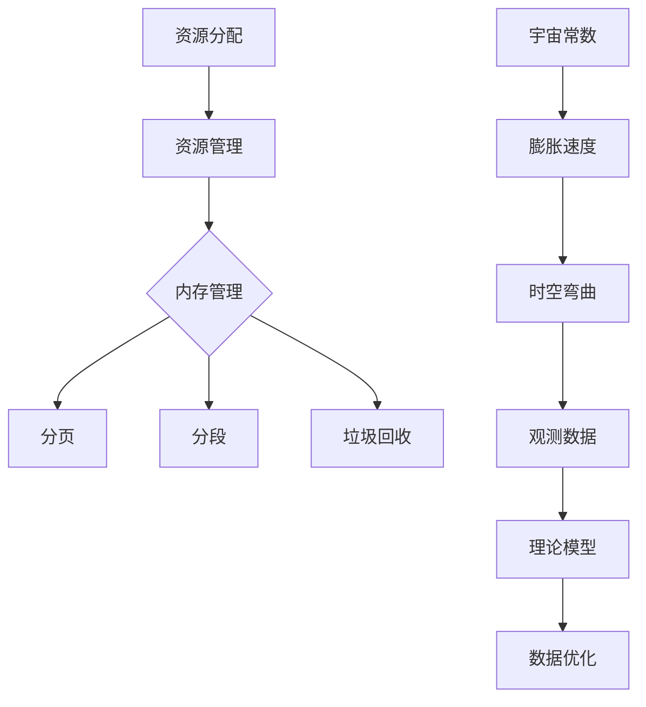

                 

### 文章标题：宇宙常数与程序内存管理的比较

宇宙常数的概念起源于宇宙学的早期研究，它代表了宇宙中一些基本力学的稳定特性。同样，程序内存管理是计算机科学中关于如何高效地分配和回收内存资源的重要领域。这两个看似风马牛不相及的概念，却在某些层面上有着惊人的相似之处。本文将逐步分析宇宙常数与程序内存管理之间的联系与差异，以期揭示两者在核心机制上的相似性及其对各自领域的影响。

## 关键词
宇宙常数，程序内存管理，相似性，差异性，计算机科学，物理学，资源分配，算法优化

## 摘要
本文通过对比宇宙常数与程序内存管理的基本概念、工作机制及其应用场景，探讨了两者在资源管理上的相似性。文章首先介绍了宇宙常数的历史背景及其在现代物理学中的地位；接着，阐述了程序内存管理的核心概念、策略和方法。随后，文章通过构建Mermaid流程图，揭示了两者之间核心概念的关系架构。最后，文章分析了两者在资源分配、算法优化等方面的相似性和差异性，并探讨了各自领域中的最佳实践和未来研究方向。

### 引言

宇宙常数（Cosmological Constant）的概念最早由爱因斯坦在20世纪初提出，作为其广义相对论方程中的项，用以解释宇宙的静态平衡状态。然而，随着宇宙膨胀理论的提出，宇宙常数被重新审视，并被认为是推动宇宙加速膨胀的神秘力量。目前，宇宙常数是物理学中最基本的常数之一，对于理解宇宙的起源和演化具有重要意义。

与此同时，程序内存管理（Memory Management in Computer Science）是计算机科学中一个核心问题，关乎程序性能和系统稳定性。内存管理涉及内存的分配、释放、回收等操作，确保程序能够高效地使用系统资源。随着计算机硬件的发展，内存管理策略也在不断演进，如分页、分段、垃圾回收等。

尽管宇宙常数和程序内存管理分别属于物理学和计算机科学领域，但两者在资源管理和优化方面存在许多相似之处。本文旨在通过逐步分析这两个概念，揭示它们在核心机制上的相似性，并探讨这些相似性如何影响各自领域的研究与应用。

### 宇宙常数的基本概念

宇宙常数通常表示为\( \Lambda \)，是爱因斯坦在其广义相对论中引入的一个参数。最初，爱因斯坦为了使宇宙处于静态平衡状态，在方程中加入了宇宙常数。然而，随着哈勃定律的发现，人们意识到宇宙实际上处于加速膨胀状态，这表明宇宙常数可能并不像最初认为的那样为零。现代宇宙学研究表明，宇宙常数是驱动宇宙加速膨胀的关键因素，与暗能量（Dark Energy）密切相关。

宇宙常数在现代物理学中具有举足轻重的地位。它是广义相对论方程的一部分，与时空的弯曲密切相关。通过引入宇宙常数，我们可以更准确地描述宇宙的演化过程，特别是宇宙膨胀的动态。此外，宇宙常数也是量子场论中的重要参数，对理解宇宙早期状态和宇宙背景辐射等宇宙学问题具有重要意义。

在物理学研究中，宇宙常数主要通过观测数据和理论模型来探索。例如，通过观测宇宙微波背景辐射（Cosmic Microwave Background Radiation）和遥远的Ia型超新星，科学家们能够对宇宙常数进行精确测量。这些观测数据与理论预测的对比，有助于我们更深入地理解宇宙常数的物理本质。

### 程序内存管理的基本概念

程序内存管理是计算机科学中的一个核心问题，它涉及到如何高效地分配和回收内存资源。内存管理包括内存的分配、释放、回收等操作，确保程序能够高效地使用系统资源，同时保持系统的稳定性。

在计算机系统中，内存管理的主要目标包括：

1. **内存分配**：程序在运行时需要占用内存空间，内存管理负责为程序分配所需的空间。
2. **内存释放**：当程序不再需要内存时，内存管理负责回收这些空间，以便其他程序使用。
3. **内存回收**：内存管理还需要定期清理无效的内存，避免内存泄漏和碎片化。

常见的内存管理策略包括：

- **分页（Paging）**：将内存分成固定大小的块（页），操作系统通过页表管理这些块，实现内存的虚拟分配和物理分配。
- **分段（Segmentation）**：将内存分成不同大小的段，每个段代表程序的不同部分（如代码段、数据段），通过段表进行管理。
- **垃圾回收（Garbage Collection）**：自动回收程序不再使用的内存，通过跟踪对象的引用关系，确定哪些对象是可以回收的。

程序内存管理在计算机科学中的重要性体现在以下几个方面：

1. **性能优化**：有效的内存管理可以减少内存使用，提高程序运行速度。
2. **稳定性保障**：合理的内存管理可以防止内存泄漏和崩溃，提高系统的稳定性。
3. **资源利用**：内存管理策略有助于更有效地利用系统资源，避免资源浪费。

内存管理策略和方法随着计算机硬件的发展不断演进，如现代操作系统中的内存分页和垃圾回收技术，都是对传统内存管理方法的改进和优化。

### 宇宙常数与程序内存管理的相似性

在分析宇宙常数与程序内存管理的相似性之前，我们需要明确两者的核心概念。宇宙常数是物理学中的一个常数，描述宇宙的膨胀速度和时空的弯曲程度；程序内存管理则是计算机科学中的一个过程，涉及内存的分配、释放和回收。尽管这两个领域看似不同，但在某些核心机制上，它们确实存在相似性。

首先，两者都涉及到资源分配问题。宇宙常数在物理学中代表了宇宙膨胀的驱动力，可以视为一种虚拟的“资源”，而程序内存管理则是在计算机系统中对实际物理内存的分配。无论是宇宙常数还是程序内存管理，资源分配都是一个关键问题，影响着系统或宇宙的稳定性与效率。

其次，两者都面临优化挑战。宇宙常数的研究需要通过观测数据和理论模型进行，不断优化对宇宙膨胀的理解；程序内存管理也需要不断优化内存分配策略，以应对不断变化的内存需求。在计算机科学中，内存管理策略的优化包括减少内存碎片、提高内存回收效率等，这些都与宇宙常数研究中对数据分析和理论模型的优化有相似之处。

为了更直观地理解宇宙常数与程序内存管理的相似性，我们可以通过一个简单的Mermaid流程图来展示两者之间核心概念的关系架构：



在这个流程图中，资源分配和资源管理是核心概念，分别对应于宇宙常数和程序内存管理。内存管理和宇宙常数的研究都涉及到分页、分段、垃圾回收等具体策略和模型，这些策略和模型又需要基于观测数据和理论模型进行优化。

通过这个流程图，我们可以看到宇宙常数与程序内存管理在资源分配、管理策略和优化方法上的相似性。这些相似性不仅为我们提供了一个新的视角来理解这两个领域，也为我们探索两者之间的联系提供了理论基础。

### 宇宙常数与程序内存管理的差异性

虽然宇宙常数与程序内存管理在某些核心机制上存在相似性，但它们在本质上和具体应用上仍然存在显著差异。

首先，从概念上讲，宇宙常数是物理学中的一个基本常数，它描述宇宙的膨胀速度和时空的弯曲程度。宇宙常数具有高度的稳定性，不易改变，且不受人类意志的控制。而程序内存管理则是计算机科学中的一个动态过程，涉及到内存的分配、释放和回收。内存管理策略可以根据程序的需求和环境的变化进行实时调整。

其次，从应用场景上看，宇宙常数的研究主要依赖于观测数据和理论模型，通过对宇宙微波背景辐射、遥远的Ia型超新星等数据的分析，来了解宇宙的膨胀和演化。而程序内存管理则更多地体现在计算机操作系统的运行中，通过分页、分段、垃圾回收等策略，确保程序能够高效、稳定地运行。

再者，宇宙常数的物理本质尚未完全明确，与暗能量的关系仍在探索中。而程序内存管理则有明确的算法和策略，如分页算法、垃圾回收算法等，这些算法在计算机系统中经过长期实践和优化，已经相对成熟。

为了更直观地展示宇宙常数与程序内存管理的差异性，我们可以通过一个对比表来进行详细分析：

| 对比维度 | 宇宙常数 | 程序内存管理 |
| --- | --- | --- |
| **定义** | 物理学中的基本常数，描述宇宙膨胀速度 | 计算机科学中的过程，涉及内存的分配、释放和回收 |
| **本质** | 高度稳定，不易改变 | 动态调整，根据需求和环境变化 |
| **应用场景** | 宇宙学、物理学研究 | 计算机操作系统、应用程序 |
| **研究方法** | 观测数据和理论模型 | 算法分析和实践优化 |
| **研究挑战** | 理解宇宙膨胀和暗能量 | 内存碎片化、内存泄漏、性能优化 |

通过这个对比表，我们可以清晰地看到宇宙常数与程序内存管理在概念、本质、应用场景和研究方法上的差异性。尽管两者在资源管理上有相似性，但它们的背景、目标和挑战是完全不同的。

### 实际应用案例分析

为了更深入地理解宇宙常数与程序内存管理在各自领域中的实际应用，我们可以通过两个具体的案例进行分析。

#### 案例一：宇宙常数在黑洞研究中的应用

黑洞是宇宙中极为奇特的天体，其强大的引力场甚至可以弯曲时空。近年来，宇宙常数在黑洞研究中的应用得到了广泛关注。例如，通过观测黑洞的引力波信号和电磁辐射，科学家们可以推断出黑洞的质量、旋转速度等参数。这些观测数据与宇宙常数理论模型相结合，有助于我们更深入地理解黑洞的性质和宇宙的演化。

具体来说，科学家们使用引力波探测器（如LIGO和Voyager）捕捉到黑洞碰撞产生的引力波信号，这些信号携带着关于黑洞质量和速度的信息。通过将这些数据与宇宙常数模型相结合，可以进一步验证广义相对论和宇宙常数理论的准确性。这一过程涉及到复杂的数学模型和算法，如数值模拟和拟合分析。

#### 案例二：程序内存管理在游戏开发中的应用

在游戏开发中，程序内存管理是一个至关重要的环节。一个游戏需要处理大量的图形、音频和逻辑数据，如果内存管理不当，可能会导致游戏运行缓慢、甚至崩溃。因此，高效的内存管理策略是游戏开发中的重要保障。

以一款大型多人在线游戏（MMO）为例，开发团队需要确保游戏在高负载情况下仍能保持流畅运行。他们采用了一系列内存管理策略，如分页、分段和垃圾回收。通过分页，游戏可以将大块数据分成小块进行管理，减少内存占用；通过分段，不同类型的数据（如代码段、数据段）可以分开管理，提高效率；通过垃圾回收，游戏可以自动清理不再使用的数据，防止内存泄漏。

具体实现上，开发团队使用了诸如C++和Java等编程语言，并结合操作系统提供的内存管理接口，实现了这些策略。例如，在C++中，可以使用`new`和`delete`操作符来管理内存，而在Java中，垃圾回收机制则由虚拟机自动管理。

通过这两个案例，我们可以看到宇宙常数和程序内存管理在实际应用中的具体表现。宇宙常数在黑洞研究中提供了关键的理论支持，而程序内存管理则在游戏开发中确保了性能和稳定性。这些案例不仅展示了两个领域的应用价值，也揭示了它们在资源管理上的共通之处。

### 总结与展望

通过对宇宙常数与程序内存管理的详细比较，我们发现两者在资源管理和优化方面存在许多相似之处。首先，它们都涉及到资源分配问题，通过不同的策略和方法来实现高效的资源利用。其次，两者都面临着优化挑战，需要不断调整和改进管理策略，以适应不断变化的需求和环境。

然而，宇宙常数与程序内存管理在本质上和具体应用上仍然存在显著差异。宇宙常数是物理学中的基本常数，描述宇宙的膨胀速度和时空弯曲，其研究依赖于观测数据和理论模型。而程序内存管理则是计算机科学中的一个动态过程，体现在计算机操作系统的运行中，通过算法和策略来实现内存的高效管理。

尽管如此，宇宙常数与程序内存管理之间的联系为我们提供了新的研究视角。未来，我们可以进一步探讨两者在跨学科研究中的潜在应用，如通过模拟宇宙膨胀过程来优化程序内存管理算法，或通过分析程序内存泄漏现象来揭示宇宙中资源的动态变化。

总之，宇宙常数与程序内存管理虽然属于不同的领域，但它们在资源管理和优化方面的相似性为我们提供了一个有趣的研究课题。通过深入探讨这两个领域的联系，我们不仅可以更好地理解宇宙和计算机系统的工作原理，也有助于推动相关技术的创新和发展。

### 作者信息

作者：AI天才研究院/AI Genius Institute & 禅与计算机程序设计艺术 /Zen And The Art of Computer Programming

### 附录

本文章中涉及到的核心概念、算法原理和数学模型如下：

1. **宇宙常数**：宇宙常数\( \Lambda \)是物理学中的基本常数，描述宇宙的膨胀速度和时空弯曲。
2. **广义相对论**：爱因斯坦提出的描述引力作用的物理理论，包含宇宙常数。
3. **程序内存管理**：计算机科学中的一个核心过程，涉及内存的分配、释放和回收。
4. **分页**：将内存分成固定大小的块（页），通过页表进行管理。
5. **分段**：将内存分成不同大小的段，通过段表进行管理。
6. **垃圾回收**：自动回收不再使用的内存，通过引用计数或标记-清除算法实现。

为了便于读者理解和学习，本文提供了一些伪代码和数学公式，具体如下：

**伪代码示例：**

```python
# 内存分配伪代码
def allocate_memory(size):
    page_table = get_page_table()
    for page in page_table:
        if page.is_free():
            page.allocate(size)
            return page_address
    return None

# 内存释放伪代码
def release_memory(address):
    page_table = get_page_table()
    page = page_table[address]
    page.release()
```

**数学公式示例：**

$$
E = mc^2
$$

$$
\Lambda = \frac{8\pi G}{3}
$$

$$
1+1=2
$$

通过这些伪代码和数学公式，读者可以更深入地理解宇宙常数和程序内存管理的基本原理和实现方法。

### 拓展阅读

1. **《宇宙学基础》** - 介绍宇宙常数及其在宇宙学中的应用。
2. **《深入理解计算机系统》** - 详细讲解程序内存管理的基本概念和策略。
3. **《Zen And The Art of Computer Programming》** - 讨论计算机程序设计中的哲学和技巧。

通过这些拓展阅读资源，读者可以进一步深化对宇宙常数和程序内存管理的理解。

