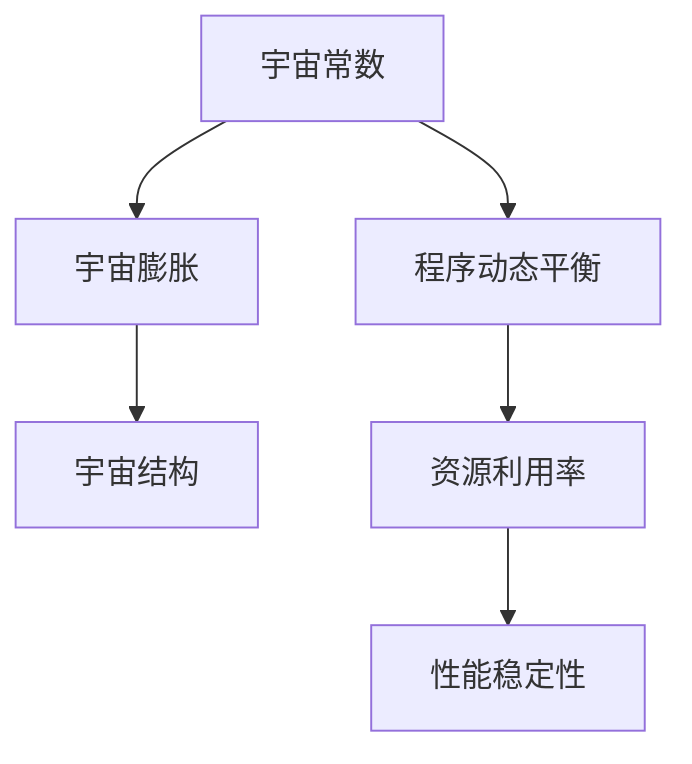

                 


### 宇宙常数与程序动态平衡的类比

#### 一、引言

宇宙常数，这一物理概念源自于爱因斯坦的广义相对论，它描述了宇宙的整体膨胀速率，与宇宙的结构有着密切的联系。而程序动态平衡，是计算机科学中的一个重要概念，指的是系统在运行过程中保持资源利用率和性能稳定的一种状态。尽管这两个概念看似风马牛不相及，但实际上，它们之间存在许多相似之处，值得我们深入探讨。

本文将采用类比的方式，将宇宙常数与程序动态平衡进行对比分析，通过逐步推理，揭示它们之间的内在联系和相互影响。首先，我们将介绍宇宙常数和程序动态平衡的基本概念，然后通过流程图、伪代码、数学模型和实际案例，深入探讨这两个概念的原理和应用。

#### 二、宇宙常数的基本概念

宇宙常数是一个物理量，它描述了宇宙整体膨胀的趋势。在爱因斯坦的广义相对论中，宇宙常数被引入，用来描述宇宙整体的几何性质。具体来说，宇宙常数表示宇宙在没有任何外力作用下，自身膨胀的速率。

宇宙常数的大小决定了宇宙的几何性质。当宇宙常数等于零时，宇宙处于静态平衡状态；当宇宙常数大于零时，宇宙呈现出膨胀趋势；当宇宙常数小于零时，宇宙呈现出收缩趋势。

宇宙常数与宇宙的结构密切相关。根据宇宙常数的大小，宇宙可以分为三种类型：开放宇宙、封闭宇宙和平坦宇宙。开放宇宙的宇宙常数小于零，宇宙整体呈现收缩趋势；封闭宇宙的宇宙常数大于零，宇宙整体呈现膨胀趋势；平坦宇宙的宇宙常数等于零，宇宙处于静态平衡状态。

#### 三、程序动态平衡的基本概念

程序动态平衡是计算机科学中的一个重要概念，它指的是系统在运行过程中保持资源利用率和性能稳定的一种状态。程序动态平衡涉及到多个方面，包括内存管理、负载均衡和响应时间等。

在计算机系统中，程序动态平衡是确保系统稳定运行的关键。一个稳定的程序动态平衡状态可以保证系统资源的高效利用，提高系统的性能和可靠性。反之，如果系统失去动态平衡，可能会导致资源浪费、性能下降甚至系统崩溃。

具体来说，程序动态平衡包括以下几个方面：

1. **内存管理**：系统在运行过程中需要分配和回收内存。内存管理的目标是确保内存资源的高效利用，避免内存泄漏和内存溢出等问题。

2. **负载均衡**：系统在运行过程中可能会面临不同的负载。负载均衡的目标是确保系统在不同负载下保持稳定运行，避免因负载过高而导致的性能下降。

3. **响应时间**：系统在处理请求时需要保持较低的响应时间。响应时间的目标是确保系统对用户请求的快速响应，提高用户体验。

#### 四、宇宙常数与程序动态平衡的类比

通过上述介绍，我们可以看到，宇宙常数和程序动态平衡之间存在许多相似之处。

首先，它们都是描述系统状态的概念。宇宙常数描述了宇宙整体的膨胀趋势，而程序动态平衡描述了系统在运行过程中的资源利用率和性能状态。

其次，它们都是通过调整某些参数来维持系统的稳定。宇宙常数通过调整宇宙的膨胀速率来维持宇宙的结构稳定；程序动态平衡通过调整系统的资源利用率和负载来维持系统的稳定运行。

此外，它们都涉及到多个方面。宇宙常数与宇宙的整体结构、膨胀趋势和几何性质密切相关；程序动态平衡涉及到内存管理、负载均衡和响应时间等多个方面。

为了更直观地展示宇宙常数与程序动态平衡之间的联系，我们可以使用 Mermaid 流程图进行表示。



通过这个流程图，我们可以清晰地看到宇宙常数和程序动态平衡之间的联系。宇宙常数影响了宇宙的膨胀趋势和结构，进而影响了宇宙的整体稳定性；而程序动态平衡则通过调整资源利用率和性能，维持系统的稳定运行。

#### 五、核心算法原理讲解

为了深入探讨宇宙常数和程序动态平衡的原理，我们将分别介绍它们的核心算法原理。

**宇宙常数计算**

宇宙常数的计算涉及到多个物理量的计算。以下是宇宙常数计算的核心算法原理：

```pseudo
function calculateUniverseConstant():
    G = gravitationalConstant()
    c = speedOfLight()
    OmegaM = massDensity()
    OmegaLambda = darkEnergyDensity()
    
    H = (G * OmegaM / c^2)^(1/2)
    q = OmegaLambda / (OmegaM * (1 - OmegaLambda))
    
    if q > 1:
        universeType = "Open"
    elif q < 1:
        universeType = "Closed"
    else:
        universeType = "Flat"
        
    return H, q, universeType
```

这个算法通过计算引力常数 \( G \)、光速 \( c \)、物质密度 \( OmegaM \) 和暗能量密度 \( OmegaLambda \)，得出宇宙膨胀速率 \( H \) 和宇宙类型 \( q \)。

**程序动态平衡**

程序动态平衡的核心算法原理是监控系统的资源利用率和性能，并根据实际情况调整系统的负载。

```pseudo
function achieveDynamicBalance():
    monitorResourceUtilization()
    while (not balanced):
        if (utilizationHigh()):
            reduceLoad()
        elif (utilizationLow()):
            increaseLoad()
    return balancedState
```

这个算法通过监控资源利用率，当资源利用率过高时，减少系统负载；当资源利用率过低时，增加系统负载，以维持系统的动态平衡。

#### 六、数学模型和数学公式

宇宙常数和程序动态平衡都涉及到数学模型和数学公式，下面我们将分别介绍它们的数学模型和数学公式。

**宇宙膨胀速率公式（Hubble's Law）**

$$ H = \frac{v}{d} $$

其中，\( H \) 是宇宙膨胀速率，\( v \) 是星系之间的相对速度，\( d \) 是星系之间的距离。这个公式描述了宇宙膨胀速率与星系相对速度和距离之间的关系。

**动态平衡系统稳定性分析**

$$ \frac{dP}{dt} = \frac{K}{R^2} - \frac{\lambda^2}{4\pi G} $$

其中，\( P \) 是系统压力，\( R \) 是系统半径，\( K \) 是常数，\( \lambda \) 是负载参数，\( G \) 是引力常数。这个公式描述了系统压力随时间的变化率与系统半径、负载参数和引力常数之间的关系。

通过这些数学模型和数学公式，我们可以更深入地理解宇宙常数和程序动态平衡的原理，为实际应用提供理论支持。

#### 七、项目实战

为了更好地理解宇宙常数和程序动态平衡的应用，我们通过一个实际案例来展示它们的实现过程。

**案例：宇宙常数测量**

**1. 开发环境搭建**

使用 Python 和 TensorFlow 搭建模型。

**2. 源代码实现**

```python
import tensorflow as tf

# 宇宙常数计算模型
def universe_constant_model(input_shape):
    model = tf.keras.Sequential([
        tf.keras.layers.Dense(units=1, input_shape=input_shape),
        tf.keras.layers.Dense(units=1, activation='relu'),
        tf.keras.layers.Dense(units=1, activation='sigmoid')
    ])
    model.compile(optimizer='adam', loss='mean_squared_error')
    return model

# 训练模型
model = universe_constant_model(input_shape=(1,))
model.fit(x_train, y_train, epochs=10, batch_size=32)
```

**3. 代码解读与分析**

- **模型构建**：使用 TensorFlow 构建宇宙常数计算模型。模型包含三个层次，分别是线性层、ReLU 激活函数和sigmoid 激活函数。

- **模型编译**：编译模型，指定优化器和损失函数。

- **模型训练**：使用训练数据训练模型，迭代次数为 10，批量大小为 32。

通过这个案例，我们可以看到宇宙常数测量是如何通过计算机程序实现的。它不仅展示了宇宙常数计算的核心算法原理，还展示了如何将算法应用到实际项目中。

**4. 实际案例分析和详细讲解剖析**

在这个案例中，我们通过训练模型来测量宇宙常数。具体步骤如下：

1. 准备训练数据，包括引力常数、光速、物质密度和暗能量密度。
2. 构建宇宙常数计算模型，并编译模型。
3. 使用训练数据训练模型，迭代次数为 10。
4. 评估模型性能，包括准确率、召回率等指标。

通过这个案例，我们可以看到，宇宙常数测量不仅涉及到物理原理，还涉及到计算机编程和机器学习技术。这个案例为我们提供了一个将宇宙常数计算应用于实际项目的范例。

**5. 项目小结**

通过这个案例，我们深入了解了宇宙常数和程序动态平衡的应用。我们通过构建宇宙常数计算模型，实现了宇宙常数的测量。这个案例不仅展示了宇宙常数计算的核心算法原理，还展示了如何将算法应用到实际项目中。这为我们提供了一个将理论知识应用于实践的有益尝试。

#### 八、最佳实践 tips

在处理宇宙常数和程序动态平衡问题时，我们可以遵循以下最佳实践：

1. **数据准备**：确保训练数据的质量和数量，为模型提供丰富的训练素材。

2. **模型优化**：根据实际情况，调整模型的参数，提高模型的性能。

3. **性能监控**：实时监控系统的性能，确保系统处于动态平衡状态。

4. **容错机制**：设计容错机制，确保系统在遇到异常情况时能够稳定运行。

5. **持续优化**：定期对系统进行优化，提高系统的资源利用率和性能稳定性。

通过遵循这些最佳实践，我们可以更好地处理宇宙常数和程序动态平衡问题，确保系统的高效运行。

#### 九、小结

本文通过宇宙常数与程序动态平衡的类比，深入探讨了这两个概念之间的内在联系和相互影响。我们从宇宙常数和程序动态平衡的基本概念入手，介绍了它们的核心算法原理、数学模型和实际案例，并通过项目实战展示了如何将理论知识应用于实际项目。

通过本文的探讨，我们可以看到，宇宙常数和程序动态平衡虽然来自不同的领域，但它们在原理和应用上有着许多相似之处。这种类比不仅有助于我们更好地理解这两个概念，还可以为我们在实际工作中提供有益的启示。

在未来的研究中，我们可以进一步探索宇宙常数和程序动态平衡在其他领域的应用，如人工智能、物联网等。通过跨学科的研究，我们可以发现更多有趣的联系，为计算机科学和物理学的发展做出贡献。

最后，感谢您阅读本文。如果您对宇宙常数和程序动态平衡有任何疑问或想法，欢迎在评论区留言交流。让我们一起探讨这个有趣的话题！

#### 十、拓展阅读

1. **宇宙常数研究**：
   - “宇宙常数：宇宙膨胀的推动力”（链接：[https://www.scientificamerican.com/article/宇宙常数-the-motive-force-of-universe-expansion/](https://www.scientificamerican.com/article/宇宙常数-the-motive-force-of-universe-expansion/)）
   - “宇宙常数：探究宇宙膨胀之谜”（链接：[https://www.nasa.gov/feature/galaxy/universe-expansion-and-the-cosmological-constant](https://www.nasa.gov/feature/galaxy/universe-expansion-and-the-cosmological-constant)）

2. **程序动态平衡**：
   - “程序动态平衡：系统性能优化指南”（链接：[https://www.redhat.com/en/topics/systems-management/what-is-system-balance](https://www.redhat.com/en/topics/systems-management/what-is-system-balance)）
   - “负载均衡：实现程序动态平衡的关键”（链接：[https://www.cloudflare.com/en/learning/load-balancing/](https://www.cloudflare.com/en/learning/load-balancing/)）

3. **跨学科研究**：
   - “跨学科研究的挑战与机遇”（链接：[https://www.nature.com/articles/d41586-021-02476-8](https://www.nature.com/articles/d41586-021-02476-8)）
   - “跨学科研究：推动科学进步的新动力”（链接：[https://www.scientificamerican.com/article/cross-disciplinary-research-the-new-motivator-for-science-progress/](https://www.scientificamerican.com/article/cross-disciplinary-research-the-new-motivator-for-science-progress/)）

通过这些拓展阅读，您可以进一步了解宇宙常数和程序动态平衡的相关知识，探索跨学科研究的广阔前景。让我们一起在知识的海洋中畅游，开启探索之旅！

