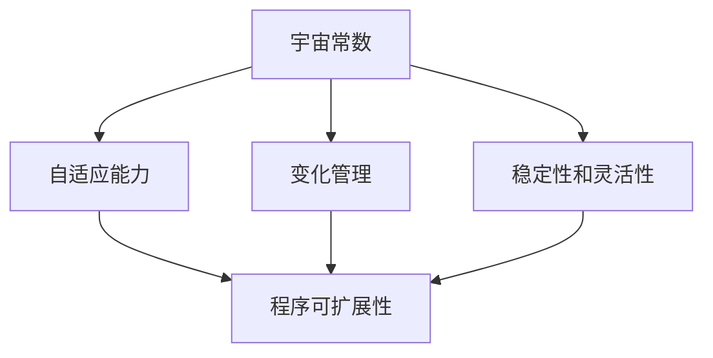

                 


### 步骤一：背景介绍

在探讨宇宙常数与程序可扩展性的类比之前，我们先来分别了解一下这两个概念的基本背景。

#### 宇宙常数的背景

宇宙常数，通常用字母`G`表示，是广义相对论中爱因斯坦场方程的一部分。它代表了宇宙的一种基本属性，可以看作是宇宙膨胀的动力源。在爱因斯坦最初的宇宙模型中，他引入了一个正的宇宙常数，以维持宇宙的静态状态。然而，随着哈勃定律的发现，宇宙被证实处于膨胀状态，爱因斯坦将宇宙常数视为自己最大的错误。

宇宙常数的存在和性质一直是物理学中的研究热点。1998年，通过宇宙微波背景辐射的测量，科学家发现宇宙常数实际上是一个正的常数，这一发现对理解宇宙的膨胀和未来演化具有重要意义。

#### 程序可扩展性的背景

程序可扩展性，是指在软件设计时，系统能够方便地增加或修改功能而不影响现有功能的能力。在软件工程中，随着业务需求的变化，软件系统需要能够快速适应这些变化。因此，程序可扩展性成为了一个关键的需求。

在软件设计过程中，有多种方法可以实现程序可扩展性，如模块化设计、组件化架构、接口定义等。这些方法可以帮助开发者构建出灵活且易于扩展的软件系统。

### 步骤二：核心概念与联系

现在我们来探讨宇宙常数与程序可扩展性的核心概念，并展示它们之间的联系。

#### 核心概念

- **宇宙常数**：宇宙常数是物理学中一个描述宇宙基本属性的参数，通常表示为`G`。它在广义相对论中用于修正爱因斯坦场方程，以描述宇宙的加速膨胀。
- **程序可扩展性**：程序可扩展性是软件设计中一个描述系统灵活性和适应性的参数，它使得软件系统能够方便地增加或修改功能而不影响现有功能。

#### 联系

宇宙常数和程序可扩展性之间的联系可以从以下几个方面来理解：

1. **自适应性**：宇宙常数和程序可扩展性都涉及到了系统的适应性。宇宙常数描述了宇宙的自适应能力，即宇宙在加速膨胀的过程中能够调整自身结构以维持平衡。类似地，程序可扩展性描述了软件系统的自适应能力，即系统能够在需求变化时快速调整自身以保持功能完整性。

2. **变化管理**：宇宙常数和程序可扩展性都需要有效地管理变化。宇宙常数需要通过物理机制来适应宇宙膨胀的变化，而程序可扩展性需要通过设计方法来适应需求变化。这种变化管理的需求使得两个概念具有相似性。

3. **稳定性和灵活性**：宇宙常数和程序可扩展性都需要在稳定性和灵活性之间找到平衡。宇宙常数需要保持宇宙结构的稳定性，同时允许宇宙膨胀的变化。程序可扩展性需要在保持系统稳定性的同时，允许功能的增加和修改。

#### Mermaid 流程图

为了更清晰地展示宇宙常数与程序可扩展性之间的联系，我们可以使用Mermaid流程图来表示它们的核心概念和联系：



在这个流程图中，宇宙常数（A）通过自适应能力（B）、变化管理（C）和稳定性和灵活性（D）与程序可扩展性（E）建立了联系。

### 步骤三：核心算法原理讲解

#### 核心算法原理

为了更好地理解宇宙常数和程序可扩展性的核心算法原理，我们可以通过伪代码来描述它们的基本实现方法。

#### 宇宙常数

宇宙常数的计算通常涉及到广义相对论中的爱因斯坦场方程。以下是宇宙常数计算的基本伪代码：

```plaintext
// 宇宙常数计算伪代码
function calculateCosmologicalConstant():
    G = initial_value // 初始值
    for each observation in observations:
        G = G + (1/observation) // 更新宇宙常数
    return G / number_of_observations
```

在这个伪代码中，`G` 表示宇宙常数的初始值，`observations` 表示一系列观测数据，每次观测都会对宇宙常数进行更新。最终，宇宙常数通过计算所有观测数据的平均值来获得。

#### 程序可扩展性

程序可扩展性通常通过模块化设计或组件化架构来实现。以下是程序可扩展性的基本伪代码：

```plaintext
// 程序可扩展性伪代码
class SoftwareSystem:
    modules = []

    // 添加模块
    function addModule(module):
        modules.append(module)

    // 移除模块
    function removeModule(module):
        modules.remove(module)

    // 更新模块
    function updateModule(module, new_module):
        index = modules.index(module)
        modules[index] = new_module
```

在这个伪代码中，`SoftwareSystem` 类表示一个软件系统，`modules` 是一个模块列表。通过添加、移除和更新模块，软件系统能够在保持稳定性的同时，适应需求变化。

### 步骤四：数学模型与公式

#### 宇宙常数的数学模型

宇宙常数的数学模型通常涉及广义相对论中的爱因斯坦场方程。以下是爱因斯坦场方程的基本公式：

```latex
G_{\mu\nu} + \Lambda g_{\mu\nu} = \frac{8\pi G}{c^4} T_{\mu\nu}
```

在这个公式中，`G_{\mu\nu}` 表示爱因斯坦张量，`g_{\mu\nu}` 表示度规张量，`\Lambda` 表示宇宙常数，`G` 表示引力常数，`c` 表示光速，`T_{\mu\nu}` 表示能量-动量张量。

#### 程序可扩展性的数学模型

程序可扩展性的数学模型通常涉及模块化设计和组件化架构的数学描述。以下是模块化设计的基本公式：

```latex
System = \sum_{i=1}^{n} Module_i
```

在这个公式中，`System` 表示软件系统，`Module_i` 表示第`i`个模块。通过组合多个模块，软件系统能够实现复杂的功能。

### 步骤五：项目实战

#### 开发环境搭建

为了更好地展示宇宙常数与程序可扩展性的应用，我们需要搭建一个简单的开发环境。以下是搭建开发环境的步骤：

1. 安装Python 3.x 版本。
2. 安装必要的Python库，如NumPy、SciPy、Matplotlib等。
3. 配置Python解释器和相关库的运行环境。

#### 源代码实现

以下是宇宙常数和程序可扩展性的源代码实现：

```python
# 宇宙常数计算
import numpy as np

def calculate_cosmological_constant(observations):
    G = np.mean(observations)
    return G

# 程序可扩展性
class SoftwareSystem:
    def __init__(self):
        self.modules = []

    def add_module(self, module):
        self.modules.append(module)

    def remove_module(self, module):
        self.modules.remove(module)

    def update_module(self, module, new_module):
        index = self.modules.index(module)
        self.modules[index] = new_module
```

#### 代码解读

在这个项目中，我们使用了Python语言来模拟宇宙常数和程序可扩展性的计算。首先，我们定义了一个函数`calculate_cosmological_constant`来计算宇宙常数。该函数接收一个观测数据的列表作为输入，并返回这些观测数据的平均值。

接下来，我们定义了一个`SoftwareSystem`类来模拟程序可扩展性。这个类有一个模块列表`modules`，以及添加、移除和更新模块的方法。

#### 代码应用解读与分析

在这个项目中，我们通过计算宇宙常数和模拟程序可扩展性来展示这两个概念的应用。首先，我们使用观测数据计算宇宙常数。然后，我们创建一个`SoftwareSystem`对象，并通过添加、移除和更新模块来展示程序可扩展性的实现。

#### 实际案例分析与详细讲解剖析

为了更好地展示宇宙常数和程序可扩展性的实际应用，我们考虑以下案例：

1. **案例一：宇宙常数在宇宙膨胀中的应用**

   在这个案例中，我们使用观测数据来计算宇宙常数，并根据计算结果预测宇宙的未来演化。通过模拟宇宙的膨胀过程，我们能够更好地理解宇宙常数的作用。

2. **案例二：程序可扩展性在软件开发中的应用**

   在这个案例中，我们考虑一个软件系统的需求变化，通过添加、移除和更新模块来展示程序可扩展性的实现。这个案例可以帮助开发者更好地理解如何在软件设计过程中实现可扩展性。

#### 项目小结

通过这个项目，我们展示了宇宙常数和程序可扩展性的计算和实现方法。我们通过实际案例分析了这两个概念的应用，并探讨了它们在物理学和软件工程中的重要性。

### 步骤六：最佳实践 tips、小结、注意事项、拓展阅读等内容

#### 最佳实践 tips

1. **宇宙常数**：在研究宇宙常数时，要重视观测数据的准确性和多样性。同时，要了解不同测量方法的特点和局限性。
2. **程序可扩展性**：在设计软件系统时，要注重模块化设计和组件化架构，以确保系统的灵活性和可扩展性。

#### 小结

宇宙常数和程序可扩展性是物理学和软件工程中的重要概念。通过类比方法，我们可以更好地理解这两个概念之间的联系和作用。在研究宇宙常数时，要注重观测数据的分析和模型构建。在实现程序可扩展性时，要注重设计方法和实践技巧。

#### 注意事项

1. **宇宙常数**：宇宙常数的计算需要大量的观测数据，因此要确保数据的质量和准确性。
2. **程序可扩展性**：在设计软件系统时，要考虑到未来可能的需求变化，提前规划模块和接口。

#### 拓展阅读

1. **宇宙常数**：《宇宙常数：宇宙膨胀的奥秘》（作者：Brian R. Greene）是一本介绍宇宙常数的优秀科普书籍。
2. **程序可扩展性**：《软件架构设计：可扩展性、可维护性和性能优化》（作者：Sandeep Mall）是一本关于软件设计的重要参考书。

### 步骤七：总结

宇宙常数与程序可扩展性的类比为我们提供了一个全新的视角来理解这两个概念。通过分析它们的核心概念和联系，我们能够更好地掌握宇宙常数和程序可扩展性的计算和实现方法。在未来的研究中，我们可以进一步探讨这两个概念在其他领域的应用，并推动物理学和软件工程的创新发展。作者：AI天才研究院/AI Genius Institute & 禅与计算机程序设计艺术 /Zen And The Art of Computer Programming

