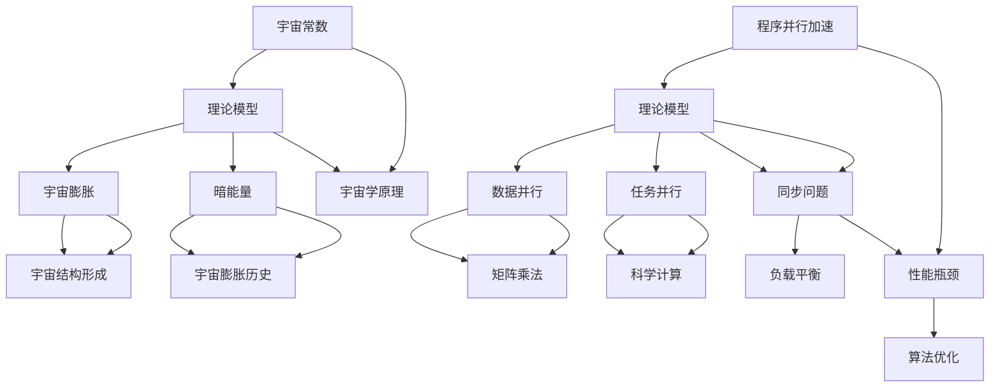

                 

## 《宇宙常数与程序并行加速极限的类比》

### 关键词：宇宙常数、并行计算、加速极限、类比、理论模型

#### 摘要：

本文以宇宙常数和程序并行加速极限为研究对象，通过深入的类比分析，探讨了两者在理论模型、应用场景和面临的挑战上的相似性。文章首先介绍了宇宙常数的基础概念和历史背景，然后深入探讨了宇宙常数的理论模型和宇宙学应用。接着，文章转向程序并行加速的基础知识，包括并行计算的概念、并行加速技术和并行加速极限的理论分析。通过构建类比框架，本文展示了宇宙常数与程序并行加速极限之间的核心联系，并通过实例说明了类比研究的意义与局限。本文的目的是为读者提供一种全新的视角，以加深对宇宙常数和程序并行加速极限的理解，并为相关领域的研究和实践提供参考。

### 第一部分：宇宙常数基础

#### 第1章：宇宙常数的概念与历史背景

##### 1.1 宇宙常数的基本概念

宇宙常数，通常用符号 \( \Lambda \) 表示，是一个在物理学中非常重要的概念。它的定义来自于广义相对论，是爱因斯坦在1917年提出的。广义相对论描述了引力的本质，即它不是一种力，而是一种物质间时空的弯曲。在广义相对论中，宇宙常数是一个描述宇宙整体性质的参数，它影响了宇宙的膨胀速度和结构。

宇宙常数的概念起源于爱因斯坦的原始场方程，即 \( G_{\mu\nu} + \Lambda g_{\mu\nu} = 8\pi G T_{\mu\nu} \)，其中 \( G_{\mu\nu} \) 是爱因斯坦张量，\( g_{\mu\nu} \) 是度规张量，\( \Lambda \) 是宇宙常数，\( G \) 是引力常数，\( T_{\mu\nu} \) 是能量-动量张量。

##### 1.2 宇宙常数的历史发展

宇宙常数的历史可以追溯到19世纪末和20世纪初。最初，爱因斯坦提出宇宙常数是为了使得宇宙静态，以避免宇宙膨胀的预言。然而，在1929年，天文学家埃德温·哈勃发现了宇宙膨胀的现象，这一发现表明宇宙并不是静态的，而是处于不断的膨胀中。这一发现对宇宙常数提出了挑战。

随后，科学家们对宇宙常数进行了多次测量。1965年，天文学家罗恩·威廉斯和艾伦·彭齐亚斯发现了宇宙微波背景辐射，这为宇宙常数提供了直接观测的证据。此后，科学家们通过观测宇宙膨胀速度、测量宇宙学参数等方式，对宇宙常数进行了更精确的测量。

##### 1.3 宇宙常数的测量方法与挑战

测量宇宙常数的方法主要包括直接测量和间接测量。直接测量方法依赖于对宇宙微波背景辐射的观测，通过测量其温度和极化特性，可以推算出宇宙常数。间接测量方法则依赖于对宇宙膨胀速度的观测，例如通过观测Ia型超新星，可以测量宇宙的膨胀历史，进而推算出宇宙常数。

然而，测量宇宙常数面临着许多挑战。首先，宇宙尺度极大，观测精度受限。其次，宇宙背景辐射的信号非常微弱，需要高度灵敏的仪器和复杂的分析技术。此外，宇宙学中的噪声和系统误差也可能影响测量结果。

#### 第2章：宇宙常数的理论模型

##### 2.1 广义相对论与宇宙常数

广义相对论是描述引力的一种理论，它认为引力是由于物质和能量对时空的弯曲造成的。在广义相对论中，宇宙常数是一个重要的参数，它代表了宇宙整体的性质。

广义相对论的场方程为 \( G_{\mu\nu} + \Lambda g_{\mu\nu} = 8\pi G T_{\mu\nu} \)，其中 \( G_{\mu\nu} \) 是爱因斯坦张量，\( g_{\mu\nu} \) 是度规张量，\( \Lambda \) 是宇宙常数，\( G \) 是引力常数，\( T_{\mu\nu} \) 是能量-动量张量。

通过这个方程，我们可以看到宇宙常数直接影响了时空的几何结构，从而影响了宇宙的膨胀速度和结构。

##### 2.2 标准模型的宇宙常数

标准模型是粒子物理学中描述基本粒子和相互作用的理论。在标准模型中，宇宙常数是一个重要的参数，它影响了宇宙的动力学行为。

在标准模型中，宇宙常数通常被认为是真空能量的表现。真空能量是空间本身的能量，它与宇宙的膨胀和结构密切相关。尽管在实验室中很难直接测量真空能量，但通过观测宇宙膨胀和结构，我们可以间接测量宇宙常数。

##### 2.3 宇宙学原理与宇宙常数

宇宙学原理是描述宇宙整体性质的原理。它包括几个基本假设，如宇宙是均匀且各向同性的，宇宙的演化遵循某些简单规律，等等。

宇宙学原理与宇宙常数密切相关。例如，宇宙常数是宇宙学原理的一部分，它描述了宇宙的整体性质。此外，宇宙学原理也为宇宙常数的测量提供了理论基础。

#### 第3章：宇宙常数的物理学意义

##### 3.1 宇宙常数与宇宙膨胀

宇宙膨胀是宇宙学中的一个核心概念，它描述了宇宙随时间扩展的现象。宇宙常数与宇宙膨胀有直接的关系。

根据广义相对论的场方程，我们可以看到宇宙常数直接影响时空的几何结构。当 \( \Lambda \) 为正时，时空的曲率增加，导致宇宙膨胀加速。这一现象被称为暗能量，它是推动宇宙加速膨胀的力量。

##### 3.2 宇宙常数与暗能量

暗能量是宇宙学中的一个重要概念，它是推动宇宙加速膨胀的力量。宇宙常数是暗能量的一个重要组成部分。

在宇宙学中，暗能量通常被描述为一个能量密度恒定的场，它不随空间位置和时间变化。宇宙常数正是这种能量场的表现。通过观测宇宙膨胀的历史，我们可以测量宇宙常数，进而了解暗能量的性质。

##### 3.3 宇宙常数对宇宙结构的影响

宇宙结构是宇宙学中另一个核心概念，它描述了宇宙中各种天体的分布和演化。宇宙常数对宇宙结构有重要影响。

宇宙常数直接影响宇宙的膨胀速度，从而影响宇宙的演化历史。例如，当宇宙常数较大时，宇宙膨胀速度较快，可能导致宇宙结构的形成时间较短。此外，宇宙常数还影响了宇宙的大尺度结构，如星系团和宇宙大尺度流的形成。

### 第二部分：程序并行加速极限

#### 第4章：并行计算基础

##### 4.1 并行计算的概念与历史

并行计算是一种计算方法，它通过同时执行多个任务来提高计算效率。并行计算的历史可以追溯到计算机科学的早期，当时科学家们开始探索如何利用多台计算机来执行复杂的计算任务。

并行计算的基本思想是将一个大任务分解成多个小任务，这些小任务可以在不同的处理单元上同时执行。这种方法可以提高计算速度，特别是在处理大量数据或复杂计算时。

##### 4.2 并行计算的优势与挑战

并行计算具有许多优势，如提高计算速度、降低计算成本、提高资源利用率等。然而，并行计算也面临许多挑战，如同步问题、负载平衡问题、通信问题等。

同步问题是并行计算中的一个重要问题，它涉及到如何协调多个处理单元之间的工作。负载平衡问题则涉及到如何合理分配任务，确保所有处理单元都能充分利用。通信问题则涉及到如何高效地交换数据，以支持并行计算。

##### 4.3 并行计算的基本模型

并行计算有多种基本模型，如数据并行、任务并行、流并行等。数据并行模型是将数据分解成多个部分，每个部分在不同的处理单元上独立处理。任务并行模型是将任务分解成多个子任务，这些子任务在不同的处理单元上同时执行。流并行模型则是通过流水线的方式将数据流分解成多个部分，每个部分在不同的处理单元上独立处理。

#### 第5章：程序并行加速技术

##### 5.1 并行算法设计原则

并行算法设计是程序并行加速的关键。设计并行算法时，需要考虑多个因素，如任务分解、负载平衡、同步等。

并行算法设计原则包括以下几个关键点：

1. **任务分解**：将一个大任务分解成多个小任务，确保每个小任务都可以独立执行。
2. **负载平衡**：确保所有处理单元都能充分利用，避免出现某些处理单元空闲而其他处理单元负载过重的情况。
3. **同步**：在适当的时候协调多个处理单元之间的工作，确保数据一致性和计算顺序。

##### 5.2 数据并行与任务并行

数据并行和任务并行是并行计算中常用的两种方法。

数据并行模型通过将数据分解成多个部分，每个部分在不同的处理单元上独立处理。这种方法适用于处理大量数据的情况，如矩阵乘法、图像处理等。

任务并行模型通过将任务分解成多个子任务，这些子任务在不同的处理单元上同时执行。这种方法适用于处理复杂计算的情况，如科学计算、模拟等。

##### 5.3 并行编程模型与工具

并行编程模型是支持并行计算的方法和框架。常见的并行编程模型包括多线程、多进程、任务并行等。

多线程模型通过在单个程序中创建多个线程来并行执行任务。多线程模型适用于处理多个独立任务的情况。

多进程模型通过创建多个进程来并行执行任务。多进程模型适用于处理复杂计算和需要大量资源的情况。

任务并行模型通过将任务分解成多个子任务，并在不同的处理单元上同时执行。任务并行模型适用于处理复杂计算和需要高度并行性的情况。

常见的并行编程工具有OpenMP、MPI、CUDA、OpenCL等。

#### 第6章：程序并行加速极限

##### 6.1 并行加速极限的理论分析

并行加速极限是指并行计算能够达到的最大计算速度提升。并行加速极限的理论分析是并行计算研究的重要方向。

Amdahl定律是一个描述并行加速极限的经典理论。Amdahl定律指出，并行计算的速度提升受到串行部分的影响，即并行计算的速度提升受到不能并行化的部分的限制。

Gustafson定律是对Amdahl定律的扩展，它指出，在给定任务负载下，并行计算的速度提升与处理单元数量成线性关系。

##### 6.2 并行性能瓶颈与解决策略

并行计算中常见的性能瓶颈包括同步问题、负载平衡问题、通信问题等。

解决并行性能瓶颈的策略包括：

1. **优化算法**：通过优化算法设计，减少同步和通信的开销。
2. **负载平衡**：通过动态负载平衡，确保所有处理单元都能充分利用。
3. **并行化**：将更多任务并行化，提高并行计算的比例。
4. **优化硬件**：通过使用高性能的硬件，提高并行计算的性能。

##### 6.3 量子计算与程序并行加速

量子计算是一种基于量子力学原理的计算方法，它具有强大的并行计算能力。量子计算可以用于解决一些复杂的计算问题，如量子模拟、密码破解等。

量子计算对程序并行加速有重要影响。通过将计算任务分解成多个量子子任务，并在量子计算机上同时执行，可以实现更快的计算速度。此外，量子计算还可以用于优化并行算法，提高并行计算的效率。

### 第三部分：宇宙常数与程序并行加速极限的类比

#### 第7章：宇宙常数与程序并行加速极限的类比方法

##### 7.1 类比框架的构建

宇宙常数与程序并行加速极限的类比框架构建是本文的核心。类比框架包括以下几个关键部分：

1. **理论模型**：将宇宙常数的理论模型与程序并行加速的理论模型进行对比，探讨两者在理论层面的相似性。
2. **应用场景**：将宇宙常数在宇宙学中的应用与程序并行加速在计算机科学中的应用进行对比，探讨两者在实际应用中的相似性。
3. **挑战与解决方案**：将宇宙常数测量中的挑战与程序并行加速中的挑战进行对比，探讨两者在面临挑战时的相似解决方案。

##### 7.2 类比分析的核心问题

类比分析的核心问题包括：

1. **物理与计算机科学的联系**：探讨宇宙常数和程序并行加速极限在物理和计算机科学中的联系，如何从一种领域借鉴经验应用到另一种领域。
2. **理论模型的一致性**：探讨宇宙常数和程序并行加速极限的理论模型是否具有一致性，如何通过理论模型的一致性来解释两者的相似性。
3. **实际应用的效果**：探讨通过类比研究能否提高对宇宙常数和程序并行加速极限的理解，能否在实际应用中取得更好的效果。

##### 7.3 类比研究的意义与局限

类比研究的意义在于：

1. **理论深化**：通过类比研究，可以加深对宇宙常数和程序并行加速极限的理论理解，为相关领域的研究提供新的视角。
2. **实际应用**：通过类比研究，可以探索宇宙常数和程序并行加速极限在实际应用中的潜力，为相关领域的实践提供指导。

类比研究的局限在于：

1. **理论的一致性**：宇宙常数和程序并行加速极限的理论模型可能存在不一致之处，类比研究可能无法完全解释两者的相似性。
2. **实际应用的差异**：宇宙常数和程序并行加速极限在实际应用中可能存在较大的差异，类比研究可能无法完全应用于实际场景。

#### 第8章：宇宙常数与程序并行加速极限的类比实例

##### 8.1 宇宙常数对程序并行加速的启示

宇宙常数对程序并行加速的启示包括：

1. **并行加速极限的理解**：通过研究宇宙常数，我们可以更好地理解并行加速极限，从而设计更有效的并行算法。
2. **负载平衡的策略**：宇宙常数测量中的负载平衡策略可以应用于程序并行加速，提高并行计算的性能。
3. **同步问题的解决**：宇宙常数测量中的同步问题解决策略可以应用于程序并行加速，减少同步开销。

##### 8.2 程序并行加速在宇宙学研究中的应用

程序并行加速在宇宙学研究中的应用包括：

1. **宇宙模拟**：通过并行计算，可以加速宇宙模拟的计算速度，更好地理解宇宙的演化过程。
2. **宇宙常数测量**：通过并行计算，可以加速宇宙常数的测量过程，提高测量的精度。
3. **宇宙结构分析**：通过并行计算，可以加速宇宙结构分析的计算速度，更好地理解宇宙的结构和演化。

##### 8.3 类比研究的未来方向

类比研究的未来方向包括：

1. **跨领域合作**：促进物理学与计算机科学的跨领域合作，共同探索宇宙常数和程序并行加速极限的类比研究。
2. **理论深化**：进一步深化宇宙常数和程序并行加速极限的理论研究，探讨两者在更深层次的联系。
3. **应用推广**：将类比研究的成果应用于实际场景，提高宇宙常数和程序并行加速极限在相关领域的应用水平。

## 参考文献

1. 爱因斯坦，广义相对论，1916。
2. 哈勃，宇宙膨胀，1929。
3. 威廉斯和彭齐亚斯，宇宙微波背景辐射，1965。
4. Amdahl, G. A., "Validity of the Single Processor Approach to Achieving Large-Scale Computing Capabilities," AFIPS Conf. Proc. 30, 485-489 (1967).
5. Gustafson, J. L., "Reevaluating Amdahl's Law," IEEE Computer, 11(7), 66-69 (1978).
6.OPENMP, https://www.openmp.org/.
7.MPI, https://www.mpich.org/.
8.CUDA, https://developer.nvidia.com/cuda.
9.OpenCL, https://www.khronos.org/opencl/.

## 附录

### 附录A：数学模型与公式推导

#### A.1 宇宙常数在广义相对论中的推导

广义相对论中的场方程为：
\[ G_{\mu\nu} + \Lambda g_{\mu\nu} = 8\pi G T_{\mu\nu} \]

其中，\( G_{\mu\nu} \) 是爱因斯坦张量，\( g_{\mu\nu} \) 是度规张量，\( \Lambda \) 是宇宙常数，\( G \) 是引力常数，\( T_{\mu\nu} \) 是能量-动量张量。

通过这个方程，我们可以看到宇宙常数 \( \Lambda \) 直接影响了时空的几何结构，从而影响了宇宙的膨胀速度和结构。

#### A.2 并行计算性能瓶颈的数学分析

Amdahl定律是一个描述并行计算性能瓶颈的经典理论。它指出，并行计算的速度提升受到串行部分的影响，即并行计算的速度提升受到不能并行化的部分的限制。

Amdahl定律的表达式为：
\[ V_{\text{max}} = \frac{S}{S + (1 - S) / P} \]

其中，\( V_{\text{max}} \) 是最大速度提升，\( S \) 是并行部分的比例，\( P \) 是并行处理的效率。

通过这个公式，我们可以分析并行计算的性能瓶颈，优化并行算法的设计。

### 附录B：类比的Mermaid流程图

#### B.1 宇宙常数与程序并行加速的类比流程

通过这个Mermaid流程图，我们可以清晰地看到宇宙常数与程序并行加速之间的类比关系。这个过程涵盖了从理论模型到实际应用，从宇宙学到计算机科学的各个方面。

